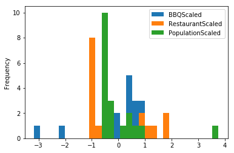

# Applied Data Science Capstone - Opening a BBQ Restaurant in Kansas City

## Introduction

One of the things that Kansas City is most well known for is their distinct barbecue style - a variety of different meats that are slow smoked and coated in a thick tomato based sauce.  If you ask a Kansas City local what their favorite barbecue restaurant is, you are likely to hear a variety of answers.  There are many different restaurants located around the metropolitan area, and each one has a slightly different take on the style than the others.  However, as the Kansas City metropolitan area continues to grow, there will be additional opportunities for new BBQ restaurants to start up.  The biggest challenges that a new BBQ restaurant would face is standing out within the Kansas City area, and a good location is one of the best ways to address this challenge.  This report is an attempt to help future business developers decide where in Kansas City a new BBQ venue could be placed successfully. 

The major factors we will use to determine the optimal location of a new BBQ restaurant are the following:
1. How many additional BBQ restaurants are within the region of Kansas City?
2. How many restaurants in total are already located within the region of Kansas City?
3. How many people live in this region of Kansas City?

Our ultimate goal is to find a location that is well populated, but that also isn't completely developed with too many restaurants and especially restaurants that would be a direct competitor with the new venue that is being planned.  

By using data science techniques, we will analyze the neighborhoods of the Kansas City metropolitan area on the criteria given above.  Then, based on these criteria, we will make some recommendations of potential locations that the new BBQ restaurant could be placed into, with the positives and negatives of each potential location considered.

## Data

The Kansas City metropolitan area can be divided into Kansas City and a large collection of suburban areas that surround it.  As we would like to place our new restaurant in a well populated area, according to the criteria given in the introduction, let's limit ourselves to towns in the Kansas City metro area with a population above 20,000 people.  This leaves us with the following collection of towns, with given populations, as provided by the wikipedia page https://en.wikipedia.org/wiki/Kansas_City_metropolitan_area:

<ul>
  <li>Kansas City, Missouri (488,943)</li>
  <li>Kansas City, Kansas (152, 938)</li>
  <li>Overland Park, Kansas (191,278)</li>
  <li>Olathe, Kansas (137,472)</li>
  <li>Independence, Missouri (117,306)</li>
  <li>Lee's Summit, Missouri (97,290)</li>
  <li>Shawnee, Kansas (65,513)</li>
  <li>Blue Springs, Missouri (54,945)</li>
  <li>Lenexa, Kansas (53,553)</li>
  <li>Leavenworth, Kansas (36,210)</li>
  <li>Leawood, Kansas (34,659)</li>
  <li>Liberty, Missouri (31,507)</li>
  <li>Raytown, Missouri (29,211)</li>
  <li>Gladstone, Missouri (27,140)</li>
  <li>Grandview, Missouri (25,159)</li>
  <li>Belton, Missouri (23,480)</li>
  <li>Prarie Village, Kansas (22,368)</li>
  <li>Gardner, Kansas (21,583)</li>
  <li>Raymore, Missouri (21,167)</li>
</ul>

While there are numerous other municipalities within the Kansas City area, a majority of these municipalities are located within a 15 minute drive from one of the larger municipalities listed above.  As a result, we will not consider them as large enough to warrant consideration for the location of a thriving new BBQ business within the Kansas City area.

In order to make a decision about which of the following municipalities would make good locations for a new BBQ restaurant, we will need to collect and use the following information:

1.  The geographic latitude and longitude coordinates for each of the cities listed above.  These centers can be obtained by using the geopy package in Python, or additionally, through the Wikipedia pages for the municipalities, all of which are linked in the reference above.

2.  A geographical boundary for each of the following cities.  As each of the above municipalities have different sizes from one another, it will be important to provide a radius in which we want to search for other restaurants and in particular other BBQ restaurants that our new venue would have to compete against.

3.  By applying the Foursquare API, we will collect a list of all restaurants, as well as those which are designated BBQ restaurants within the boundaries that are defined in the previous point.

After all of this data is collected, we can use it to determine which municipalities are the best fit for our new venue.

In the following cells, we compute the geographic centers of the municipalities that we listed above.


```python
! pip install geopy
from geopy.geocoders import Nominatim
```


```python
import pandas as pd
import numpy as np
columns = ['Name', 'Latitude', 'Longitude']
namesList = ['Kansas City Missouri', 'Kansas City Kansas', 'Overland Park Kansas', 'Olathe Kansas', 'Independence Missouri', "Lee's Summit Missouri", 'Shawnee Kansas', 'Blue Springs Missouri', 'Lenexa Kansas', 'Leavenworth Kansas', 'Leawood Kansas', 'Liberty Missouri', 'Raytown Missouri', 'Gladstone Missouri', 'Grandview Missouri', 'Belton Missouri', 'Prarie Village, Kansas', 'Gardner Kansas', 'Raymore Missouri']
latitudeList = []
longitudeList = []
KCdf = pd.DataFrame(columns = columns)
KCdf['Name'] = namesList
for name in namesList:
    geolocator = Nominatim(user_agent="KCMunicipalities")
    location = geolocator.geocode(name)
    latitudeList.append(location.latitude)
    longitudeList.append(location.longitude)
KCdf['Latitude'] = latitudeList
KCdf['Longitude'] = longitudeList
KCdf
```


<div>
<style scoped>
    .dataframe tbody tr th:only-of-type {
        vertical-align: middle;
    }

    .dataframe tbody tr th {
        vertical-align: top;
    }

    .dataframe thead th {
        text-align: right;
    }
</style>
<table border="1" class="dataframe">
  <thead>
    <tr style="text-align: right;">
      <th></th>
      <th>Name</th>
      <th>Latitude</th>
      <th>Longitude</th>
    </tr>
  </thead>
  <tbody>
    <tr>
      <th>0</th>
      <td>Kansas City Missouri</td>
      <td>39.100105</td>
      <td>-94.578142</td>
    </tr>
    <tr>
      <th>1</th>
      <td>Kansas City Kansas</td>
      <td>39.113456</td>
      <td>-94.626497</td>
    </tr>
    <tr>
      <th>2</th>
      <td>Overland Park Kansas</td>
      <td>38.974250</td>
      <td>-94.685170</td>
    </tr>
    <tr>
      <th>3</th>
      <td>Olathe Kansas</td>
      <td>38.883886</td>
      <td>-94.818870</td>
    </tr>
    <tr>
      <th>4</th>
      <td>Independence Missouri</td>
      <td>39.092479</td>
      <td>-94.413792</td>
    </tr>
    <tr>
      <th>5</th>
      <td>Lee's Summit Missouri</td>
      <td>38.910716</td>
      <td>-94.382130</td>
    </tr>
    <tr>
      <th>6</th>
      <td>Shawnee Kansas</td>
      <td>39.041672</td>
      <td>-94.720238</td>
    </tr>
    <tr>
      <th>7</th>
      <td>Blue Springs Missouri</td>
      <td>39.017316</td>
      <td>-94.282265</td>
    </tr>
    <tr>
      <th>8</th>
      <td>Lenexa Kansas</td>
      <td>38.969746</td>
      <td>-94.784584</td>
    </tr>
    <tr>
      <th>9</th>
      <td>Leavenworth Kansas</td>
      <td>39.311326</td>
      <td>-94.922759</td>
    </tr>
    <tr>
      <th>10</th>
      <td>Leawood Kansas</td>
      <td>38.966673</td>
      <td>-94.616901</td>
    </tr>
    <tr>
      <th>11</th>
      <td>Liberty Missouri</td>
      <td>39.246479</td>
      <td>-94.419079</td>
    </tr>
    <tr>
      <th>12</th>
      <td>Raytown Missouri</td>
      <td>39.016843</td>
      <td>-94.463047</td>
    </tr>
    <tr>
      <th>13</th>
      <td>Gladstone Missouri</td>
      <td>39.221477</td>
      <td>-94.571975</td>
    </tr>
    <tr>
      <th>14</th>
      <td>Grandview Missouri</td>
      <td>38.889848</td>
      <td>-94.531382</td>
    </tr>
    <tr>
      <th>15</th>
      <td>Belton Missouri</td>
      <td>38.810810</td>
      <td>-94.531350</td>
    </tr>
    <tr>
      <th>16</th>
      <td>Prarie Village, Kansas</td>
      <td>37.346513</td>
      <td>-95.285950</td>
    </tr>
    <tr>
      <th>17</th>
      <td>Gardner Kansas</td>
      <td>38.810925</td>
      <td>-94.927296</td>
    </tr>
    <tr>
      <th>18</th>
      <td>Raymore Missouri</td>
      <td>38.810131</td>
      <td>-94.467650</td>
    </tr>
  </tbody>
</table>
</div>


Notice that Prarie Village, Kansas is located very far from the other points above.  The geocode method has located the wrong Prarie Village, and so we adjust the data manually for this row of the table.


```python
KCdf.at[16, 'Latitude'] = 38.989722
KCdf.at[16, 'Longitude'] = -94.636111
KCdf[16:17]
```


<div>
<style scoped>
    .dataframe tbody tr th:only-of-type {
        vertical-align: middle;
    }

    .dataframe tbody tr th {
        vertical-align: top;
    }

    .dataframe thead th {
        text-align: right;
    }
</style>
<table border="1" class="dataframe">
  <thead>
    <tr style="text-align: right;">
      <th></th>
      <th>Name</th>
      <th>Latitude</th>
      <th>Longitude</th>
    </tr>
  </thead>
  <tbody>
    <tr>
      <th>16</th>
      <td>Prarie Village, Kansas</td>
      <td>38.989722</td>
      <td>-94.636111</td>
    </tr>
  </tbody>
</table>
</div>


First, let's visualize these points on a map using the Folium package.


```python
! pip install folium
import folium
```


```python
KCMap = folium.Map(location = [39.100105, -94.578142], zoom_start = 9, tiles = 'CartoDB positron')
for row in KCdf.itertuples():
    folium.Marker([row.Latitude, row.Longitude], popup= row.Name).add_to(KCMap)

KCMap
```


<div style="width:100%;"><div style="position:relative;width:100%;height:0;padding-bottom:60%;"><iframe src="data:text/html;charset=utf-8;base64,PCFET0NUWVBFIGh0bWw+CjxoZWFkPiAgICAKICAgIDxtZXRhIGh0dHAtZXF1aXY9ImNvbnRlbnQtdHlwZSIgY29udGVudD0idGV4dC9odG1sOyBjaGFyc2V0PVVURi04IiAvPgogICAgCiAgICAgICAgPHNjcmlwdD4KICAgICAgICAgICAgTF9OT19UT1VDSCA9IGZhbHNlOwogICAgICAgICAgICBMX0RJU0FCTEVfM0QgPSBmYWxzZTsKICAgICAgICA8L3NjcmlwdD4KICAgIAogICAgPHNjcmlwdCBzcmM9Imh0dHBzOi8vY2RuLmpzZGVsaXZyLm5ldC9ucG0vbGVhZmxldEAxLjQuMC9kaXN0L2xlYWZsZXQuanMiPjwvc2NyaXB0PgogICAgPHNjcmlwdCBzcmM9Imh0dHBzOi8vY29kZS5qcXVlcnkuY29tL2pxdWVyeS0xLjEyLjQubWluLmpzIj48L3NjcmlwdD4KICAgIDxzY3JpcHQgc3JjPSJodHRwczovL21heGNkbi5ib290c3RyYXBjZG4uY29tL2Jvb3RzdHJhcC8zLjIuMC9qcy9ib290c3RyYXAubWluLmpzIj48L3NjcmlwdD4KICAgIDxzY3JpcHQgc3JjPSJodHRwczovL2NkbmpzLmNsb3VkZmxhcmUuY29tL2FqYXgvbGlicy9MZWFmbGV0LmF3ZXNvbWUtbWFya2Vycy8yLjAuMi9sZWFmbGV0LmF3ZXNvbWUtbWFya2Vycy5qcyI+PC9zY3JpcHQ+CiAgICA8bGluayByZWw9InN0eWxlc2hlZXQiIGhyZWY9Imh0dHBzOi8vY2RuLmpzZGVsaXZyLm5ldC9ucG0vbGVhZmxldEAxLjQuMC9kaXN0L2xlYWZsZXQuY3NzIi8+CiAgICA8bGluayByZWw9InN0eWxlc2hlZXQiIGhyZWY9Imh0dHBzOi8vbWF4Y2RuLmJvb3RzdHJhcGNkbi5jb20vYm9vdHN0cmFwLzMuMi4wL2Nzcy9ib290c3RyYXAubWluLmNzcyIvPgogICAgPGxpbmsgcmVsPSJzdHlsZXNoZWV0IiBocmVmPSJodHRwczovL21heGNkbi5ib290c3RyYXBjZG4uY29tL2Jvb3RzdHJhcC8zLjIuMC9jc3MvYm9vdHN0cmFwLXRoZW1lLm1pbi5jc3MiLz4KICAgIDxsaW5rIHJlbD0ic3R5bGVzaGVldCIgaHJlZj0iaHR0cHM6Ly9tYXhjZG4uYm9vdHN0cmFwY2RuLmNvbS9mb250LWF3ZXNvbWUvNC42LjMvY3NzL2ZvbnQtYXdlc29tZS5taW4uY3NzIi8+CiAgICA8bGluayByZWw9InN0eWxlc2hlZXQiIGhyZWY9Imh0dHBzOi8vY2RuanMuY2xvdWRmbGFyZS5jb20vYWpheC9saWJzL0xlYWZsZXQuYXdlc29tZS1tYXJrZXJzLzIuMC4yL2xlYWZsZXQuYXdlc29tZS1tYXJrZXJzLmNzcyIvPgogICAgPGxpbmsgcmVsPSJzdHlsZXNoZWV0IiBocmVmPSJodHRwczovL3Jhd2Nkbi5naXRoYWNrLmNvbS9weXRob24tdmlzdWFsaXphdGlvbi9mb2xpdW0vbWFzdGVyL2ZvbGl1bS90ZW1wbGF0ZXMvbGVhZmxldC5hd2Vzb21lLnJvdGF0ZS5jc3MiLz4KICAgIDxzdHlsZT5odG1sLCBib2R5IHt3aWR0aDogMTAwJTtoZWlnaHQ6IDEwMCU7bWFyZ2luOiAwO3BhZGRpbmc6IDA7fTwvc3R5bGU+CiAgICA8c3R5bGU+I21hcCB7cG9zaXRpb246YWJzb2x1dGU7dG9wOjA7Ym90dG9tOjA7cmlnaHQ6MDtsZWZ0OjA7fTwvc3R5bGU+CiAgICAKICAgICAgICAgICAgPG1ldGEgbmFtZT0idmlld3BvcnQiIGNvbnRlbnQ9IndpZHRoPWRldmljZS13aWR0aCwKICAgICAgICAgICAgICAgIGluaXRpYWwtc2NhbGU9MS4wLCBtYXhpbXVtLXNjYWxlPTEuMCwgdXNlci1zY2FsYWJsZT1ubyIgLz4KICAgICAgICAgICAgPHN0eWxlPgogICAgICAgICAgICAgICAgI21hcF81ZGFmNTM2MGE0NzY0NjlkOGYwYmJjMzEyNjUwMTA3MSB7CiAgICAgICAgICAgICAgICAgICAgcG9zaXRpb246IHJlbGF0aXZlOwogICAgICAgICAgICAgICAgICAgIHdpZHRoOiAxMDAuMCU7CiAgICAgICAgICAgICAgICAgICAgaGVpZ2h0OiAxMDAuMCU7CiAgICAgICAgICAgICAgICAgICAgbGVmdDogMC4wJTsKICAgICAgICAgICAgICAgICAgICB0b3A6IDAuMCU7CiAgICAgICAgICAgICAgICB9CiAgICAgICAgICAgIDwvc3R5bGU+CiAgICAgICAgCjwvaGVhZD4KPGJvZHk+ICAgIAogICAgCiAgICAgICAgICAgIDxkaXYgY2xhc3M9ImZvbGl1bS1tYXAiIGlkPSJtYXBfNWRhZjUzNjBhNDc2NDY5ZDhmMGJiYzMxMjY1MDEwNzEiID48L2Rpdj4KICAgICAgICAKPC9ib2R5Pgo8c2NyaXB0PiAgICAKICAgIAogICAgICAgICAgICB2YXIgbWFwXzVkYWY1MzYwYTQ3NjQ2OWQ4ZjBiYmMzMTI2NTAxMDcxID0gTC5tYXAoCiAgICAgICAgICAgICAgICAibWFwXzVkYWY1MzYwYTQ3NjQ2OWQ4ZjBiYmMzMTI2NTAxMDcxIiwKICAgICAgICAgICAgICAgIHsKICAgICAgICAgICAgICAgICAgICBjZW50ZXI6IFszOS4xMDAxMDUsIC05NC41NzgxNDJdLAogICAgICAgICAgICAgICAgICAgIGNyczogTC5DUlMuRVBTRzM4NTcsCiAgICAgICAgICAgICAgICAgICAgem9vbTogOSwKICAgICAgICAgICAgICAgICAgICB6b29tQ29udHJvbDogdHJ1ZSwKICAgICAgICAgICAgICAgICAgICBwcmVmZXJDYW52YXM6IGZhbHNlLAogICAgICAgICAgICAgICAgfQogICAgICAgICAgICApOwoKICAgICAgICAgICAgCgogICAgICAgIAogICAgCiAgICAgICAgICAgIHZhciB0aWxlX2xheWVyXzNlYTU0ZjQyYTRhZDRmYzM4NzA4MDNjNGI0MjQ2OGFjID0gTC50aWxlTGF5ZXIoCiAgICAgICAgICAgICAgICAiaHR0cHM6Ly9jYXJ0b2RiLWJhc2VtYXBzLXtzfS5nbG9iYWwuc3NsLmZhc3RseS5uZXQvbGlnaHRfYWxsL3t6fS97eH0ve3l9LnBuZyIsCiAgICAgICAgICAgICAgICB7ImF0dHJpYnV0aW9uIjogIlx1MDAyNmNvcHk7IFx1MDAzY2EgaHJlZj1cImh0dHA6Ly93d3cub3BlbnN0cmVldG1hcC5vcmcvY29weXJpZ2h0XCJcdTAwM2VPcGVuU3RyZWV0TWFwXHUwMDNjL2FcdTAwM2UgY29udHJpYnV0b3JzIFx1MDAyNmNvcHk7IFx1MDAzY2EgaHJlZj1cImh0dHA6Ly9jYXJ0b2RiLmNvbS9hdHRyaWJ1dGlvbnNcIlx1MDAzZUNhcnRvREJcdTAwM2MvYVx1MDAzZSwgQ2FydG9EQiBcdTAwM2NhIGhyZWYgPVwiaHR0cDovL2NhcnRvZGIuY29tL2F0dHJpYnV0aW9uc1wiXHUwMDNlYXR0cmlidXRpb25zXHUwMDNjL2FcdTAwM2UiLCAiZGV0ZWN0UmV0aW5hIjogZmFsc2UsICJtYXhOYXRpdmVab29tIjogMTgsICJtYXhab29tIjogMTgsICJtaW5ab29tIjogMCwgIm5vV3JhcCI6IGZhbHNlLCAib3BhY2l0eSI6IDEsICJzdWJkb21haW5zIjogImFiYyIsICJ0bXMiOiBmYWxzZX0KICAgICAgICAgICAgKS5hZGRUbyhtYXBfNWRhZjUzNjBhNDc2NDY5ZDhmMGJiYzMxMjY1MDEwNzEpOwogICAgICAgIAogICAgCiAgICAgICAgICAgIHZhciBtYXJrZXJfOWU4NWNhOTIwZjBjNDMyOWIwYzQzNWI2YWM1ZjcwOTggPSBMLm1hcmtlcigKICAgICAgICAgICAgICAgIFszOS4xMDAxMDUsIC05NC41NzgxNDE2XSwKICAgICAgICAgICAgICAgIHt9CiAgICAgICAgICAgICkuYWRkVG8obWFwXzVkYWY1MzYwYTQ3NjQ2OWQ4ZjBiYmMzMTI2NTAxMDcxKTsKICAgICAgICAKICAgIAogICAgICAgIHZhciBwb3B1cF9iZWVkZDBhNTNlMjI0MjQyYTI1MzM5OGUzMTBmMzg2ZSA9IEwucG9wdXAoeyJtYXhXaWR0aCI6ICIxMDAlIn0pOwoKICAgICAgICAKICAgICAgICAgICAgdmFyIGh0bWxfYTZiZjgyNWQ3ODkyNDhhYzhmOTFjMmFmNzRjNmY0MjIgPSAkKGA8ZGl2IGlkPSJodG1sX2E2YmY4MjVkNzg5MjQ4YWM4ZjkxYzJhZjc0YzZmNDIyIiBzdHlsZT0id2lkdGg6IDEwMC4wJTsgaGVpZ2h0OiAxMDAuMCU7Ij5LYW5zYXMgQ2l0eSBNaXNzb3VyaTwvZGl2PmApWzBdOwogICAgICAgICAgICBwb3B1cF9iZWVkZDBhNTNlMjI0MjQyYTI1MzM5OGUzMTBmMzg2ZS5zZXRDb250ZW50KGh0bWxfYTZiZjgyNWQ3ODkyNDhhYzhmOTFjMmFmNzRjNmY0MjIpOwogICAgICAgIAoKICAgICAgICBtYXJrZXJfOWU4NWNhOTIwZjBjNDMyOWIwYzQzNWI2YWM1ZjcwOTguYmluZFBvcHVwKHBvcHVwX2JlZWRkMGE1M2UyMjQyNDJhMjUzMzk4ZTMxMGYzODZlKQogICAgICAgIDsKCiAgICAgICAgCiAgICAKICAgIAogICAgICAgICAgICB2YXIgbWFya2VyX2RjOTk4Nzg1ZmY1NjRkYTk4Yzg4ODkzYzc3MjUzMzFhID0gTC5tYXJrZXIoCiAgICAgICAgICAgICAgICBbMzkuMTEzNDU2MiwgLTk0LjYyNjQ5N10sCiAgICAgICAgICAgICAgICB7fQogICAgICAgICAgICApLmFkZFRvKG1hcF81ZGFmNTM2MGE0NzY0NjlkOGYwYmJjMzEyNjUwMTA3MSk7CiAgICAgICAgCiAgICAKICAgICAgICB2YXIgcG9wdXBfMjU4ZjdlM2E1ZDc4NDhjNWI2ZjYwMjZjY2IyMmU1ZWUgPSBMLnBvcHVwKHsibWF4V2lkdGgiOiAiMTAwJSJ9KTsKCiAgICAgICAgCiAgICAgICAgICAgIHZhciBodG1sXzIwMjU4NWRlOTkwZDRkZjA4ZWFkMTI4MzE1MzVkMjQ2ID0gJChgPGRpdiBpZD0iaHRtbF8yMDI1ODVkZTk5MGQ0ZGYwOGVhZDEyODMxNTM1ZDI0NiIgc3R5bGU9IndpZHRoOiAxMDAuMCU7IGhlaWdodDogMTAwLjAlOyI+S2Fuc2FzIENpdHkgS2Fuc2FzPC9kaXY+YClbMF07CiAgICAgICAgICAgIHBvcHVwXzI1OGY3ZTNhNWQ3ODQ4YzViNmY2MDI2Y2NiMjJlNWVlLnNldENvbnRlbnQoaHRtbF8yMDI1ODVkZTk5MGQ0ZGYwOGVhZDEyODMxNTM1ZDI0Nik7CiAgICAgICAgCgogICAgICAgIG1hcmtlcl9kYzk5ODc4NWZmNTY0ZGE5OGM4ODg5M2M3NzI1MzMxYS5iaW5kUG9wdXAocG9wdXBfMjU4ZjdlM2E1ZDc4NDhjNWI2ZjYwMjZjY2IyMmU1ZWUpCiAgICAgICAgOwoKICAgICAgICAKICAgIAogICAgCiAgICAgICAgICAgIHZhciBtYXJrZXJfNmEzNmZlMjg2ZTJhNGFmNmJhY2ZhNThmZjlhODViNDAgPSBMLm1hcmtlcigKICAgICAgICAgICAgICAgIFszOC45NzQyNTAyLCAtOTQuNjg1MTcwMl0sCiAgICAgICAgICAgICAgICB7fQogICAgICAgICAgICApLmFkZFRvKG1hcF81ZGFmNTM2MGE0NzY0NjlkOGYwYmJjMzEyNjUwMTA3MSk7CiAgICAgICAgCiAgICAKICAgICAgICB2YXIgcG9wdXBfYzdjNjRmODMyZTA0NDZhNzkyZWZkNzgzZDc5N2FmMmMgPSBMLnBvcHVwKHsibWF4V2lkdGgiOiAiMTAwJSJ9KTsKCiAgICAgICAgCiAgICAgICAgICAgIHZhciBodG1sXzhhYmU2NmRhYTU3ODQyNmNhY2JhMDIyYzExNzI3Mzg5ID0gJChgPGRpdiBpZD0iaHRtbF84YWJlNjZkYWE1Nzg0MjZjYWNiYTAyMmMxMTcyNzM4OSIgc3R5bGU9IndpZHRoOiAxMDAuMCU7IGhlaWdodDogMTAwLjAlOyI+T3ZlcmxhbmQgUGFyayBLYW5zYXM8L2Rpdj5gKVswXTsKICAgICAgICAgICAgcG9wdXBfYzdjNjRmODMyZTA0NDZhNzkyZWZkNzgzZDc5N2FmMmMuc2V0Q29udGVudChodG1sXzhhYmU2NmRhYTU3ODQyNmNhY2JhMDIyYzExNzI3Mzg5KTsKICAgICAgICAKCiAgICAgICAgbWFya2VyXzZhMzZmZTI4NmUyYTRhZjZiYWNmYTU4ZmY5YTg1YjQwLmJpbmRQb3B1cChwb3B1cF9jN2M2NGY4MzJlMDQ0NmE3OTJlZmQ3ODNkNzk3YWYyYykKICAgICAgICA7CgogICAgICAgIAogICAgCiAgICAKICAgICAgICAgICAgdmFyIG1hcmtlcl85NTJlYzNlOWMxZTM0NmRhYTljODEzM2M4MTcwZWM4YSA9IEwubWFya2VyKAogICAgICAgICAgICAgICAgWzM4Ljg4Mzg4NTYsIC05NC44MTg4N10sCiAgICAgICAgICAgICAgICB7fQogICAgICAgICAgICApLmFkZFRvKG1hcF81ZGFmNTM2MGE0NzY0NjlkOGYwYmJjMzEyNjUwMTA3MSk7CiAgICAgICAgCiAgICAKICAgICAgICB2YXIgcG9wdXBfZmQzZDhjMzlmMjgxNDcyNTgzZGZiZDlmMDI2NTYwZjAgPSBMLnBvcHVwKHsibWF4V2lkdGgiOiAiMTAwJSJ9KTsKCiAgICAgICAgCiAgICAgICAgICAgIHZhciBodG1sX2ZhOGIyYWYxODQ4YjQ2OThiMTAzNzEwZGJkMGU0ZWZlID0gJChgPGRpdiBpZD0iaHRtbF9mYThiMmFmMTg0OGI0Njk4YjEwMzcxMGRiZDBlNGVmZSIgc3R5bGU9IndpZHRoOiAxMDAuMCU7IGhlaWdodDogMTAwLjAlOyI+T2xhdGhlIEthbnNhczwvZGl2PmApWzBdOwogICAgICAgICAgICBwb3B1cF9mZDNkOGMzOWYyODE0NzI1ODNkZmJkOWYwMjY1NjBmMC5zZXRDb250ZW50KGh0bWxfZmE4YjJhZjE4NDhiNDY5OGIxMDM3MTBkYmQwZTRlZmUpOwogICAgICAgIAoKICAgICAgICBtYXJrZXJfOTUyZWMzZTljMWUzNDZkYWE5YzgxMzNjODE3MGVjOGEuYmluZFBvcHVwKHBvcHVwX2ZkM2Q4YzM5ZjI4MTQ3MjU4M2RmYmQ5ZjAyNjU2MGYwKQogICAgICAgIDsKCiAgICAgICAgCiAgICAKICAgIAogICAgICAgICAgICB2YXIgbWFya2VyXzMyOTdlOWE4ODVkYTQ3MzI5ZDI2OGMwMmVjZjliNmQzID0gTC5tYXJrZXIoCiAgICAgICAgICAgICAgICBbMzkuMDkyNDc5MiwgLTk0LjQxMzc5MjNdLAogICAgICAgICAgICAgICAge30KICAgICAgICAgICAgKS5hZGRUbyhtYXBfNWRhZjUzNjBhNDc2NDY5ZDhmMGJiYzMxMjY1MDEwNzEpOwogICAgICAgIAogICAgCiAgICAgICAgdmFyIHBvcHVwXzNkMGMyMDdiNDQyYjQ5YTRiZjA0ZjQzNzdiZDZlMGUyID0gTC5wb3B1cCh7Im1heFdpZHRoIjogIjEwMCUifSk7CgogICAgICAgIAogICAgICAgICAgICB2YXIgaHRtbF9hNDkyMzlhOTY1ZGY0OWY4OTk3MWYwMjljNDBiM2Y4MiA9ICQoYDxkaXYgaWQ9Imh0bWxfYTQ5MjM5YTk2NWRmNDlmODk5NzFmMDI5YzQwYjNmODIiIHN0eWxlPSJ3aWR0aDogMTAwLjAlOyBoZWlnaHQ6IDEwMC4wJTsiPkluZGVwZW5kZW5jZSBNaXNzb3VyaTwvZGl2PmApWzBdOwogICAgICAgICAgICBwb3B1cF8zZDBjMjA3YjQ0MmI0OWE0YmYwNGY0Mzc3YmQ2ZTBlMi5zZXRDb250ZW50KGh0bWxfYTQ5MjM5YTk2NWRmNDlmODk5NzFmMDI5YzQwYjNmODIpOwogICAgICAgIAoKICAgICAgICBtYXJrZXJfMzI5N2U5YTg4NWRhNDczMjlkMjY4YzAyZWNmOWI2ZDMuYmluZFBvcHVwKHBvcHVwXzNkMGMyMDdiNDQyYjQ5YTRiZjA0ZjQzNzdiZDZlMGUyKQogICAgICAgIDsKCiAgICAgICAgCiAgICAKICAgIAogICAgICAgICAgICB2YXIgbWFya2VyXzc2ZmUzZjlkZTgzMzRkYmNhNDUyNmE4N2IwZTE5ZWRjID0gTC5tYXJrZXIoCiAgICAgICAgICAgICAgICBbMzguOTEwNzE1NiwgLTk0LjM4MjEyOTVdLAogICAgICAgICAgICAgICAge30KICAgICAgICAgICAgKS5hZGRUbyhtYXBfNWRhZjUzNjBhNDc2NDY5ZDhmMGJiYzMxMjY1MDEwNzEpOwogICAgICAgIAogICAgCiAgICAgICAgdmFyIHBvcHVwXzBhZmRjMDkxNWU1MDQ3YTBiZmIxOGU5NjBkZDMxOTI4ID0gTC5wb3B1cCh7Im1heFdpZHRoIjogIjEwMCUifSk7CgogICAgICAgIAogICAgICAgICAgICB2YXIgaHRtbF9iMTYzZjEzZjM5MmM0N2JkOGMwMWQ0NmYzZDRkOGU1YiA9ICQoYDxkaXYgaWQ9Imh0bWxfYjE2M2YxM2YzOTJjNDdiZDhjMDFkNDZmM2Q0ZDhlNWIiIHN0eWxlPSJ3aWR0aDogMTAwLjAlOyBoZWlnaHQ6IDEwMC4wJTsiPkxlZSdzIFN1bW1pdCBNaXNzb3VyaTwvZGl2PmApWzBdOwogICAgICAgICAgICBwb3B1cF8wYWZkYzA5MTVlNTA0N2EwYmZiMThlOTYwZGQzMTkyOC5zZXRDb250ZW50KGh0bWxfYjE2M2YxM2YzOTJjNDdiZDhjMDFkNDZmM2Q0ZDhlNWIpOwogICAgICAgIAoKICAgICAgICBtYXJrZXJfNzZmZTNmOWRlODMzNGRiY2E0NTI2YTg3YjBlMTllZGMuYmluZFBvcHVwKHBvcHVwXzBhZmRjMDkxNWU1MDQ3YTBiZmIxOGU5NjBkZDMxOTI4KQogICAgICAgIDsKCiAgICAgICAgCiAgICAKICAgIAogICAgICAgICAgICB2YXIgbWFya2VyXzc4NDgzYzEwYjdkMjQ4NjE5ZDlhYzQ3OGU1NGQ1NmIwID0gTC5tYXJrZXIoCiAgICAgICAgICAgICAgICBbMzkuMDQxNjcxOCwgLTk0LjcyMDIzNzZdLAogICAgICAgICAgICAgICAge30KICAgICAgICAgICAgKS5hZGRUbyhtYXBfNWRhZjUzNjBhNDc2NDY5ZDhmMGJiYzMxMjY1MDEwNzEpOwogICAgICAgIAogICAgCiAgICAgICAgdmFyIHBvcHVwX2VjYWZhOWJhMmZiOTQ2MDY4ZWRjYmNhYjdlZThhNjMxID0gTC5wb3B1cCh7Im1heFdpZHRoIjogIjEwMCUifSk7CgogICAgICAgIAogICAgICAgICAgICB2YXIgaHRtbF9jNTgwYTUxODgyZWE0ZjFhYmMwYTcwZTczMGYzZTgwYyA9ICQoYDxkaXYgaWQ9Imh0bWxfYzU4MGE1MTg4MmVhNGYxYWJjMGE3MGU3MzBmM2U4MGMiIHN0eWxlPSJ3aWR0aDogMTAwLjAlOyBoZWlnaHQ6IDEwMC4wJTsiPlNoYXduZWUgS2Fuc2FzPC9kaXY+YClbMF07CiAgICAgICAgICAgIHBvcHVwX2VjYWZhOWJhMmZiOTQ2MDY4ZWRjYmNhYjdlZThhNjMxLnNldENvbnRlbnQoaHRtbF9jNTgwYTUxODgyZWE0ZjFhYmMwYTcwZTczMGYzZTgwYyk7CiAgICAgICAgCgogICAgICAgIG1hcmtlcl83ODQ4M2MxMGI3ZDI0ODYxOWQ5YWM0NzhlNTRkNTZiMC5iaW5kUG9wdXAocG9wdXBfZWNhZmE5YmEyZmI5NDYwNjhlZGNiY2FiN2VlOGE2MzEpCiAgICAgICAgOwoKICAgICAgICAKICAgIAogICAgCiAgICAgICAgICAgIHZhciBtYXJrZXJfZWJlYTlmNjgwNzg2NGY2YmJhMDI4YmJmYWQ2OTE3MTkgPSBMLm1hcmtlcigKICAgICAgICAgICAgICAgIFszOS4wMTczMTYsIC05NC4yODIyNjVdLAogICAgICAgICAgICAgICAge30KICAgICAgICAgICAgKS5hZGRUbyhtYXBfNWRhZjUzNjBhNDc2NDY5ZDhmMGJiYzMxMjY1MDEwNzEpOwogICAgICAgIAogICAgCiAgICAgICAgdmFyIHBvcHVwXzVhZDFiODFiM2RmZDRmMTk5NGY4ZmMxOWZmMjE0MDczID0gTC5wb3B1cCh7Im1heFdpZHRoIjogIjEwMCUifSk7CgogICAgICAgIAogICAgICAgICAgICB2YXIgaHRtbF8zMTg0Mjk1ODI5NGY0MTMxODQ1MTI4ODg0ZTBlMDNiZiA9ICQoYDxkaXYgaWQ9Imh0bWxfMzE4NDI5NTgyOTRmNDEzMTg0NTEyODg4NGUwZTAzYmYiIHN0eWxlPSJ3aWR0aDogMTAwLjAlOyBoZWlnaHQ6IDEwMC4wJTsiPkJsdWUgU3ByaW5ncyBNaXNzb3VyaTwvZGl2PmApWzBdOwogICAgICAgICAgICBwb3B1cF81YWQxYjgxYjNkZmQ0ZjE5OTRmOGZjMTlmZjIxNDA3My5zZXRDb250ZW50KGh0bWxfMzE4NDI5NTgyOTRmNDEzMTg0NTEyODg4NGUwZTAzYmYpOwogICAgICAgIAoKICAgICAgICBtYXJrZXJfZWJlYTlmNjgwNzg2NGY2YmJhMDI4YmJmYWQ2OTE3MTkuYmluZFBvcHVwKHBvcHVwXzVhZDFiODFiM2RmZDRmMTk5NGY4ZmMxOWZmMjE0MDczKQogICAgICAgIDsKCiAgICAgICAgCiAgICAKICAgIAogICAgICAgICAgICB2YXIgbWFya2VyX2Q2Mzc2ZWIzNzRiYzQ3Nzc5YjVkNTY4MDliYmQ4NjJiID0gTC5tYXJrZXIoCiAgICAgICAgICAgICAgICBbMzguOTY5NzQ1OCwgLTk0Ljc4NDU4MzddLAogICAgICAgICAgICAgICAge30KICAgICAgICAgICAgKS5hZGRUbyhtYXBfNWRhZjUzNjBhNDc2NDY5ZDhmMGJiYzMxMjY1MDEwNzEpOwogICAgICAgIAogICAgCiAgICAgICAgdmFyIHBvcHVwX2Y2NjAyMTE3YzIyMzQwYjBiNTZhZGMyYjU1ZmUwOWU0ID0gTC5wb3B1cCh7Im1heFdpZHRoIjogIjEwMCUifSk7CgogICAgICAgIAogICAgICAgICAgICB2YXIgaHRtbF83NTJhYzFmZTkyMzI0ZTRiOWZlZjNjNDZiNDVhZjcyMyA9ICQoYDxkaXYgaWQ9Imh0bWxfNzUyYWMxZmU5MjMyNGU0YjlmZWYzYzQ2YjQ1YWY3MjMiIHN0eWxlPSJ3aWR0aDogMTAwLjAlOyBoZWlnaHQ6IDEwMC4wJTsiPkxlbmV4YSBLYW5zYXM8L2Rpdj5gKVswXTsKICAgICAgICAgICAgcG9wdXBfZjY2MDIxMTdjMjIzNDBiMGI1NmFkYzJiNTVmZTA5ZTQuc2V0Q29udGVudChodG1sXzc1MmFjMWZlOTIzMjRlNGI5ZmVmM2M0NmI0NWFmNzIzKTsKICAgICAgICAKCiAgICAgICAgbWFya2VyX2Q2Mzc2ZWIzNzRiYzQ3Nzc5YjVkNTY4MDliYmQ4NjJiLmJpbmRQb3B1cChwb3B1cF9mNjYwMjExN2MyMjM0MGIwYjU2YWRjMmI1NWZlMDllNCkKICAgICAgICA7CgogICAgICAgIAogICAgCiAgICAKICAgICAgICAgICAgdmFyIG1hcmtlcl9kYmNjNTRlZWY2NGQ0MGMzOGRmYTZhOWM2NmQ2NTI5ZSA9IEwubWFya2VyKAogICAgICAgICAgICAgICAgWzM5LjMxMTMyNTcsIC05NC45MjI3NTldLAogICAgICAgICAgICAgICAge30KICAgICAgICAgICAgKS5hZGRUbyhtYXBfNWRhZjUzNjBhNDc2NDY5ZDhmMGJiYzMxMjY1MDEwNzEpOwogICAgICAgIAogICAgCiAgICAgICAgdmFyIHBvcHVwX2YwYWY0MDdhZmI2ODQ0NTM4MDFmNDg0MDIxYmVjNjUxID0gTC5wb3B1cCh7Im1heFdpZHRoIjogIjEwMCUifSk7CgogICAgICAgIAogICAgICAgICAgICB2YXIgaHRtbF9jMTQ1Mjk5MzUxZWU0MWQyYWY1MmQ5ZjQ2MmI4ODNmMCA9ICQoYDxkaXYgaWQ9Imh0bWxfYzE0NTI5OTM1MWVlNDFkMmFmNTJkOWY0NjJiODgzZjAiIHN0eWxlPSJ3aWR0aDogMTAwLjAlOyBoZWlnaHQ6IDEwMC4wJTsiPkxlYXZlbndvcnRoIEthbnNhczwvZGl2PmApWzBdOwogICAgICAgICAgICBwb3B1cF9mMGFmNDA3YWZiNjg0NDUzODAxZjQ4NDAyMWJlYzY1MS5zZXRDb250ZW50KGh0bWxfYzE0NTI5OTM1MWVlNDFkMmFmNTJkOWY0NjJiODgzZjApOwogICAgICAgIAoKICAgICAgICBtYXJrZXJfZGJjYzU0ZWVmNjRkNDBjMzhkZmE2YTljNjZkNjUyOWUuYmluZFBvcHVwKHBvcHVwX2YwYWY0MDdhZmI2ODQ0NTM4MDFmNDg0MDIxYmVjNjUxKQogICAgICAgIDsKCiAgICAgICAgCiAgICAKICAgIAogICAgICAgICAgICB2YXIgbWFya2VyX2U1YmVlMmYxNDUxYzQ4Nzk5NmU1ODM5ZDVjMzdkOWJkID0gTC5tYXJrZXIoCiAgICAgICAgICAgICAgICBbMzguOTY2NjczLCAtOTQuNjE2OTAxMl0sCiAgICAgICAgICAgICAgICB7fQogICAgICAgICAgICApLmFkZFRvKG1hcF81ZGFmNTM2MGE0NzY0NjlkOGYwYmJjMzEyNjUwMTA3MSk7CiAgICAgICAgCiAgICAKICAgICAgICB2YXIgcG9wdXBfY2ZkNDFlOGYxNjQyNDA5Y2EyNDlkNWM5NzM5NGEwN2UgPSBMLnBvcHVwKHsibWF4V2lkdGgiOiAiMTAwJSJ9KTsKCiAgICAgICAgCiAgICAgICAgICAgIHZhciBodG1sX2FiNjIxMjRmZDQ3ZDQyN2U4NDY5ZDdkNjUxMGE2MTNjID0gJChgPGRpdiBpZD0iaHRtbF9hYjYyMTI0ZmQ0N2Q0MjdlODQ2OWQ3ZDY1MTBhNjEzYyIgc3R5bGU9IndpZHRoOiAxMDAuMCU7IGhlaWdodDogMTAwLjAlOyI+TGVhd29vZCBLYW5zYXM8L2Rpdj5gKVswXTsKICAgICAgICAgICAgcG9wdXBfY2ZkNDFlOGYxNjQyNDA5Y2EyNDlkNWM5NzM5NGEwN2Uuc2V0Q29udGVudChodG1sX2FiNjIxMjRmZDQ3ZDQyN2U4NDY5ZDdkNjUxMGE2MTNjKTsKICAgICAgICAKCiAgICAgICAgbWFya2VyX2U1YmVlMmYxNDUxYzQ4Nzk5NmU1ODM5ZDVjMzdkOWJkLmJpbmRQb3B1cChwb3B1cF9jZmQ0MWU4ZjE2NDI0MDljYTI0OWQ1Yzk3Mzk0YTA3ZSkKICAgICAgICA7CgogICAgICAgIAogICAgCiAgICAKICAgICAgICAgICAgdmFyIG1hcmtlcl9iMjQwMzMxYTI4OTI0NjE1YTk0OWU3YWRkMDE4Nzc0MyA9IEwubWFya2VyKAogICAgICAgICAgICAgICAgWzM5LjI0NjQ3OSwgLTk0LjQxOTA3OV0sCiAgICAgICAgICAgICAgICB7fQogICAgICAgICAgICApLmFkZFRvKG1hcF81ZGFmNTM2MGE0NzY0NjlkOGYwYmJjMzEyNjUwMTA3MSk7CiAgICAgICAgCiAgICAKICAgICAgICB2YXIgcG9wdXBfN2M0NmMxZWRiODNkNGNlNmI2NDExMmUzNjI3ZTcwNDQgPSBMLnBvcHVwKHsibWF4V2lkdGgiOiAiMTAwJSJ9KTsKCiAgICAgICAgCiAgICAgICAgICAgIHZhciBodG1sXzRjODU5OThkMmI5YTRkNjg5ZWQ1OTBiZjZiNmYwNWUzID0gJChgPGRpdiBpZD0iaHRtbF80Yzg1OTk4ZDJiOWE0ZDY4OWVkNTkwYmY2YjZmMDVlMyIgc3R5bGU9IndpZHRoOiAxMDAuMCU7IGhlaWdodDogMTAwLjAlOyI+TGliZXJ0eSBNaXNzb3VyaTwvZGl2PmApWzBdOwogICAgICAgICAgICBwb3B1cF83YzQ2YzFlZGI4M2Q0Y2U2YjY0MTEyZTM2MjdlNzA0NC5zZXRDb250ZW50KGh0bWxfNGM4NTk5OGQyYjlhNGQ2ODllZDU5MGJmNmI2ZjA1ZTMpOwogICAgICAgIAoKICAgICAgICBtYXJrZXJfYjI0MDMzMWEyODkyNDYxNWE5NDllN2FkZDAxODc3NDMuYmluZFBvcHVwKHBvcHVwXzdjNDZjMWVkYjgzZDRjZTZiNjQxMTJlMzYyN2U3MDQ0KQogICAgICAgIDsKCiAgICAgICAgCiAgICAKICAgIAogICAgICAgICAgICB2YXIgbWFya2VyXzExNDY2ZTQ1MGQwODQ0MzdhN2NjNmFhZDhiZWEyZjBkID0gTC5tYXJrZXIoCiAgICAgICAgICAgICAgICBbMzkuMDE2ODQyNSwgLTk0LjQ2MzA0NjhdLAogICAgICAgICAgICAgICAge30KICAgICAgICAgICAgKS5hZGRUbyhtYXBfNWRhZjUzNjBhNDc2NDY5ZDhmMGJiYzMxMjY1MDEwNzEpOwogICAgICAgIAogICAgCiAgICAgICAgdmFyIHBvcHVwXzMzM2I4OGI4NTAwNDQ4OTQ5NWJkNTRhOTNmNDU4OTlhID0gTC5wb3B1cCh7Im1heFdpZHRoIjogIjEwMCUifSk7CgogICAgICAgIAogICAgICAgICAgICB2YXIgaHRtbF8wNTRiYTM4NDJiZWI0ZGZkODg4NThmMWVkYWJlNWY4ZCA9ICQoYDxkaXYgaWQ9Imh0bWxfMDU0YmEzODQyYmViNGRmZDg4ODU4ZjFlZGFiZTVmOGQiIHN0eWxlPSJ3aWR0aDogMTAwLjAlOyBoZWlnaHQ6IDEwMC4wJTsiPlJheXRvd24gTWlzc291cmk8L2Rpdj5gKVswXTsKICAgICAgICAgICAgcG9wdXBfMzMzYjg4Yjg1MDA0NDg5NDk1YmQ1NGE5M2Y0NTg5OWEuc2V0Q29udGVudChodG1sXzA1NGJhMzg0MmJlYjRkZmQ4ODg1OGYxZWRhYmU1ZjhkKTsKICAgICAgICAKCiAgICAgICAgbWFya2VyXzExNDY2ZTQ1MGQwODQ0MzdhN2NjNmFhZDhiZWEyZjBkLmJpbmRQb3B1cChwb3B1cF8zMzNiODhiODUwMDQ0ODk0OTViZDU0YTkzZjQ1ODk5YSkKICAgICAgICA7CgogICAgICAgIAogICAgCiAgICAKICAgICAgICAgICAgdmFyIG1hcmtlcl83OGI1OTAxZjRmZTA0NzA5OGIyYjVmZDBkZTY5NmI3NiA9IEwubWFya2VyKAogICAgICAgICAgICAgICAgWzM5LjIyMTQ3NjUsIC05NC41NzE5NzQ4XSwKICAgICAgICAgICAgICAgIHt9CiAgICAgICAgICAgICkuYWRkVG8obWFwXzVkYWY1MzYwYTQ3NjQ2OWQ4ZjBiYmMzMTI2NTAxMDcxKTsKICAgICAgICAKICAgIAogICAgICAgIHZhciBwb3B1cF8wNWIzZDJhNTE4YWE0ZGQzODBhY2JkOWNiZjQxMDM3ZSA9IEwucG9wdXAoeyJtYXhXaWR0aCI6ICIxMDAlIn0pOwoKICAgICAgICAKICAgICAgICAgICAgdmFyIGh0bWxfNzUxZWVmNzQ1MTc4NDkzMWI2NWYxYTZiOWUwMmM3NTAgPSAkKGA8ZGl2IGlkPSJodG1sXzc1MWVlZjc0NTE3ODQ5MzFiNjVmMWE2YjllMDJjNzUwIiBzdHlsZT0id2lkdGg6IDEwMC4wJTsgaGVpZ2h0OiAxMDAuMCU7Ij5HbGFkc3RvbmUgTWlzc291cmk8L2Rpdj5gKVswXTsKICAgICAgICAgICAgcG9wdXBfMDViM2QyYTUxOGFhNGRkMzgwYWNiZDljYmY0MTAzN2Uuc2V0Q29udGVudChodG1sXzc1MWVlZjc0NTE3ODQ5MzFiNjVmMWE2YjllMDJjNzUwKTsKICAgICAgICAKCiAgICAgICAgbWFya2VyXzc4YjU5MDFmNGZlMDQ3MDk4YjJiNWZkMGRlNjk2Yjc2LmJpbmRQb3B1cChwb3B1cF8wNWIzZDJhNTE4YWE0ZGQzODBhY2JkOWNiZjQxMDM3ZSkKICAgICAgICA7CgogICAgICAgIAogICAgCiAgICAKICAgICAgICAgICAgdmFyIG1hcmtlcl9lNjZkYzdmY2U5Y2U0ZjNlYjA5MjUzZTAzNTVmNmFhYSA9IEwubWFya2VyKAogICAgICAgICAgICAgICAgWzM4Ljg4OTg0NzgsIC05NC41MzEzODE2XSwKICAgICAgICAgICAgICAgIHt9CiAgICAgICAgICAgICkuYWRkVG8obWFwXzVkYWY1MzYwYTQ3NjQ2OWQ4ZjBiYmMzMTI2NTAxMDcxKTsKICAgICAgICAKICAgIAogICAgICAgIHZhciBwb3B1cF9hNGU5NWU3Y2IyNjc0ZDM3ODA1OWY2ZGM3NWJmMzg4YyA9IEwucG9wdXAoeyJtYXhXaWR0aCI6ICIxMDAlIn0pOwoKICAgICAgICAKICAgICAgICAgICAgdmFyIGh0bWxfZTc3NTQ2MTRmYTc2NDUzN2EzZjQwY2Y0NGQwYTEyNjMgPSAkKGA8ZGl2IGlkPSJodG1sX2U3NzU0NjE0ZmE3NjQ1MzdhM2Y0MGNmNDRkMGExMjYzIiBzdHlsZT0id2lkdGg6IDEwMC4wJTsgaGVpZ2h0OiAxMDAuMCU7Ij5HcmFuZHZpZXcgTWlzc291cmk8L2Rpdj5gKVswXTsKICAgICAgICAgICAgcG9wdXBfYTRlOTVlN2NiMjY3NGQzNzgwNTlmNmRjNzViZjM4OGMuc2V0Q29udGVudChodG1sX2U3NzU0NjE0ZmE3NjQ1MzdhM2Y0MGNmNDRkMGExMjYzKTsKICAgICAgICAKCiAgICAgICAgbWFya2VyX2U2NmRjN2ZjZTljZTRmM2ViMDkyNTNlMDM1NWY2YWFhLmJpbmRQb3B1cChwb3B1cF9hNGU5NWU3Y2IyNjc0ZDM3ODA1OWY2ZGM3NWJmMzg4YykKICAgICAgICA7CgogICAgICAgIAogICAgCiAgICAKICAgICAgICAgICAgdmFyIG1hcmtlcl81NDliMTBiMjgxZGU0Nzk4OWQxNmJkYzgwMWIyMzQ3ZCA9IEwubWFya2VyKAogICAgICAgICAgICAgICAgWzM4LjgxMDgwOTcsIC05NC41MzEzNTAyXSwKICAgICAgICAgICAgICAgIHt9CiAgICAgICAgICAgICkuYWRkVG8obWFwXzVkYWY1MzYwYTQ3NjQ2OWQ4ZjBiYmMzMTI2NTAxMDcxKTsKICAgICAgICAKICAgIAogICAgICAgIHZhciBwb3B1cF9hOGJkOTQ4ZjVkMjk0NjYxYjcxOGQ5OTA1ZGUyZTU0YiA9IEwucG9wdXAoeyJtYXhXaWR0aCI6ICIxMDAlIn0pOwoKICAgICAgICAKICAgICAgICAgICAgdmFyIGh0bWxfZGY4OWI5OTRkNjI3NDMyM2I2ODBiNmY3M2QwZjRjNzUgPSAkKGA8ZGl2IGlkPSJodG1sX2RmODliOTk0ZDYyNzQzMjNiNjgwYjZmNzNkMGY0Yzc1IiBzdHlsZT0id2lkdGg6IDEwMC4wJTsgaGVpZ2h0OiAxMDAuMCU7Ij5CZWx0b24gTWlzc291cmk8L2Rpdj5gKVswXTsKICAgICAgICAgICAgcG9wdXBfYThiZDk0OGY1ZDI5NDY2MWI3MThkOTkwNWRlMmU1NGIuc2V0Q29udGVudChodG1sX2RmODliOTk0ZDYyNzQzMjNiNjgwYjZmNzNkMGY0Yzc1KTsKICAgICAgICAKCiAgICAgICAgbWFya2VyXzU0OWIxMGIyODFkZTQ3OTg5ZDE2YmRjODAxYjIzNDdkLmJpbmRQb3B1cChwb3B1cF9hOGJkOTQ4ZjVkMjk0NjYxYjcxOGQ5OTA1ZGUyZTU0YikKICAgICAgICA7CgogICAgICAgIAogICAgCiAgICAKICAgICAgICAgICAgdmFyIG1hcmtlcl8xOWRhNGU2NmE2NjM0YWY3OGMzOTAxN2QxNmQ3NmI5MiA9IEwubWFya2VyKAogICAgICAgICAgICAgICAgWzM4Ljk4OTcyMiwgLTk0LjYzNjExMV0sCiAgICAgICAgICAgICAgICB7fQogICAgICAgICAgICApLmFkZFRvKG1hcF81ZGFmNTM2MGE0NzY0NjlkOGYwYmJjMzEyNjUwMTA3MSk7CiAgICAgICAgCiAgICAKICAgICAgICB2YXIgcG9wdXBfOGUzZDFkNTI1NzhkNDEyYWI0NTBlZTk3OGIzOTNjYzEgPSBMLnBvcHVwKHsibWF4V2lkdGgiOiAiMTAwJSJ9KTsKCiAgICAgICAgCiAgICAgICAgICAgIHZhciBodG1sXzg3NDkxYWNhOGU1YzQ2OTQ4Mjg0Mjc2ZWUxZTM4NGEyID0gJChgPGRpdiBpZD0iaHRtbF84NzQ5MWFjYThlNWM0Njk0ODI4NDI3NmVlMWUzODRhMiIgc3R5bGU9IndpZHRoOiAxMDAuMCU7IGhlaWdodDogMTAwLjAlOyI+UHJhcmllIFZpbGxhZ2UsIEthbnNhczwvZGl2PmApWzBdOwogICAgICAgICAgICBwb3B1cF84ZTNkMWQ1MjU3OGQ0MTJhYjQ1MGVlOTc4YjM5M2NjMS5zZXRDb250ZW50KGh0bWxfODc0OTFhY2E4ZTVjNDY5NDgyODQyNzZlZTFlMzg0YTIpOwogICAgICAgIAoKICAgICAgICBtYXJrZXJfMTlkYTRlNjZhNjYzNGFmNzhjMzkwMTdkMTZkNzZiOTIuYmluZFBvcHVwKHBvcHVwXzhlM2QxZDUyNTc4ZDQxMmFiNDUwZWU5NzhiMzkzY2MxKQogICAgICAgIDsKCiAgICAgICAgCiAgICAKICAgIAogICAgICAgICAgICB2YXIgbWFya2VyX2I1MTY1YTExMmZkMDQ5NGFhZTE0MWIxNjBmMzY2OTFmID0gTC5tYXJrZXIoCiAgICAgICAgICAgICAgICBbMzguODEwOTI1NCwgLTk0LjkyNzI5NThdLAogICAgICAgICAgICAgICAge30KICAgICAgICAgICAgKS5hZGRUbyhtYXBfNWRhZjUzNjBhNDc2NDY5ZDhmMGJiYzMxMjY1MDEwNzEpOwogICAgICAgIAogICAgCiAgICAgICAgdmFyIHBvcHVwX2I0NTIzNTg0ODVhYzQyNjhhNmFmYWE0Y2IwMDc2ODMwID0gTC5wb3B1cCh7Im1heFdpZHRoIjogIjEwMCUifSk7CgogICAgICAgIAogICAgICAgICAgICB2YXIgaHRtbF9lYjk4MjEwZmVkZDI0MzYxYjZhZGRmNTNmOGI5ZjA2NiA9ICQoYDxkaXYgaWQ9Imh0bWxfZWI5ODIxMGZlZGQyNDM2MWI2YWRkZjUzZjhiOWYwNjYiIHN0eWxlPSJ3aWR0aDogMTAwLjAlOyBoZWlnaHQ6IDEwMC4wJTsiPkdhcmRuZXIgS2Fuc2FzPC9kaXY+YClbMF07CiAgICAgICAgICAgIHBvcHVwX2I0NTIzNTg0ODVhYzQyNjhhNmFmYWE0Y2IwMDc2ODMwLnNldENvbnRlbnQoaHRtbF9lYjk4MjEwZmVkZDI0MzYxYjZhZGRmNTNmOGI5ZjA2Nik7CiAgICAgICAgCgogICAgICAgIG1hcmtlcl9iNTE2NWExMTJmZDA0OTRhYWUxNDFiMTYwZjM2NjkxZi5iaW5kUG9wdXAocG9wdXBfYjQ1MjM1ODQ4NWFjNDI2OGE2YWZhYTRjYjAwNzY4MzApCiAgICAgICAgOwoKICAgICAgICAKICAgIAogICAgCiAgICAgICAgICAgIHZhciBtYXJrZXJfN2U0OWNiODFkNDNmNDcwZjgyYjBkMmNiZmIxYmY4M2MgPSBMLm1hcmtlcigKICAgICAgICAgICAgICAgIFszOC44MTAxMzEsIC05NC40Njc2NTAxXSwKICAgICAgICAgICAgICAgIHt9CiAgICAgICAgICAgICkuYWRkVG8obWFwXzVkYWY1MzYwYTQ3NjQ2OWQ4ZjBiYmMzMTI2NTAxMDcxKTsKICAgICAgICAKICAgIAogICAgICAgIHZhciBwb3B1cF81ZWU5ODkxZGMwMWU0MGVjYmRjNTkxNzA2YmU5NWI1YSA9IEwucG9wdXAoeyJtYXhXaWR0aCI6ICIxMDAlIn0pOwoKICAgICAgICAKICAgICAgICAgICAgdmFyIGh0bWxfZDJmMzZiZmRhODJiNDIzMzgyNDM2N2NmZDE3ZjgyYmUgPSAkKGA8ZGl2IGlkPSJodG1sX2QyZjM2YmZkYTgyYjQyMzM4MjQzNjdjZmQxN2Y4MmJlIiBzdHlsZT0id2lkdGg6IDEwMC4wJTsgaGVpZ2h0OiAxMDAuMCU7Ij5SYXltb3JlIE1pc3NvdXJpPC9kaXY+YClbMF07CiAgICAgICAgICAgIHBvcHVwXzVlZTk4OTFkYzAxZTQwZWNiZGM1OTE3MDZiZTk1YjVhLnNldENvbnRlbnQoaHRtbF9kMmYzNmJmZGE4MmI0MjMzODI0MzY3Y2ZkMTdmODJiZSk7CiAgICAgICAgCgogICAgICAgIG1hcmtlcl83ZTQ5Y2I4MWQ0M2Y0NzBmODJiMGQyY2JmYjFiZjgzYy5iaW5kUG9wdXAocG9wdXBfNWVlOTg5MWRjMDFlNDBlY2JkYzU5MTcwNmJlOTViNWEpCiAgICAgICAgOwoKICAgICAgICAKICAgIAo8L3NjcmlwdD4=" style="position:absolute;width:100%;height:100%;left:0;top:0;border:none !important;" allowfullscreen webkitallowfullscreen mozallowfullscreen></iframe></div></div>


The above map provides the latitude and longitude of the centers of the municipalities that we will use for the centers of possible places to locate the new BBQ restaurant.  However, we need to define the boundaries of these municipalities as well, so that we know how far away from the center to search for other restaurants.  

First, let's treat each of the municipalities of Kansas City as a point.


```python
KCPoints = []
for row in KCdf.itertuples():
    rowPoint = (row.Latitude, row.Longitude)
    KCPoints.append(rowPoint)
KCPoints
```


    [(39.100105, -94.5781416),
     (39.1134562, -94.626497),
     (38.9742502, -94.6851702),
     (38.8838856, -94.81887),
     (39.0924792, -94.4137923),
     (38.9107156, -94.3821295),
     (39.0416718, -94.7202376),
     (39.017316, -94.282265),
     (38.9697458, -94.7845837),
     (39.3113257, -94.922759),
     (38.966673, -94.6169012),
     (39.246479, -94.419079),
     (39.0168425, -94.4630468),
     (39.2214765, -94.5719748),
     (38.8898478, -94.5313816),
     (38.8108097, -94.5313502),
     (38.989722, -94.636111),
     (38.8109254, -94.9272958),
     (38.810131, -94.4676501)]


Now, let's compute the distance between these points, with the caveat that we want to create a circle of at least radius 1.5 miles around each of our municipalities.  Then, let's store the minimum distance between these points that is at least three miles or larger. We'll also need to convert this distance into meters, as that is the measurement that Folium accepts.


```python
from geopy import distance
KCdf['minDistance'] = np.nan
i = 0
for point in KCPoints:
    distanceList = []
    for secondpoint in KCPoints:
        if distance.distance(point, secondpoint).miles > 3:
            distanceList.append(distance.distance(point, secondpoint).miles)
    minDistance = min(distanceList)
    KCdf.at[i, 'minDistance'] = minDistance
    i = i+1
KCdf['minDistanceMeters'] = KCdf['minDistance']*1609.34
KCdf
```


<div>
<style scoped>
    .dataframe tbody tr th:only-of-type {
        vertical-align: middle;
    }

    .dataframe tbody tr th {
        vertical-align: top;
    }

    .dataframe thead th {
        text-align: right;
    }
</style>
<table border="1" class="dataframe">
  <thead>
    <tr style="text-align: right;">
      <th></th>
      <th>Name</th>
      <th>Latitude</th>
      <th>Longitude</th>
      <th>minDistance</th>
      <th>minDistanceMeters</th>
    </tr>
  </thead>
  <tbody>
    <tr>
      <th>0</th>
      <td>Kansas City Missouri</td>
      <td>39.100105</td>
      <td>-94.578142</td>
      <td>8.228269</td>
      <td>13242.083018</td>
    </tr>
    <tr>
      <th>1</th>
      <td>Kansas City Kansas</td>
      <td>39.113456</td>
      <td>-94.626497</td>
      <td>7.065800</td>
      <td>11371.274754</td>
    </tr>
    <tr>
      <th>2</th>
      <td>Overland Park Kansas</td>
      <td>38.974250</td>
      <td>-94.685170</td>
      <td>3.713225</td>
      <td>5975.841168</td>
    </tr>
    <tr>
      <th>3</th>
      <td>Olathe Kansas</td>
      <td>38.883886</td>
      <td>-94.818870</td>
      <td>6.204160</td>
      <td>9984.603159</td>
    </tr>
    <tr>
      <th>4</th>
      <td>Independence Missouri</td>
      <td>39.092479</td>
      <td>-94.413792</td>
      <td>5.851633</td>
      <td>9417.267530</td>
    </tr>
    <tr>
      <th>5</th>
      <td>Lee's Summit Missouri</td>
      <td>38.910716</td>
      <td>-94.382130</td>
      <td>8.172844</td>
      <td>13152.884795</td>
    </tr>
    <tr>
      <th>6</th>
      <td>Shawnee Kansas</td>
      <td>39.041672</td>
      <td>-94.720238</td>
      <td>5.019238</td>
      <td>8077.661186</td>
    </tr>
    <tr>
      <th>7</th>
      <td>Blue Springs Missouri</td>
      <td>39.017316</td>
      <td>-94.282265</td>
      <td>8.770909</td>
      <td>14115.374769</td>
    </tr>
    <tr>
      <th>8</th>
      <td>Lenexa Kansas</td>
      <td>38.969746</td>
      <td>-94.784584</td>
      <td>5.362264</td>
      <td>8629.705748</td>
    </tr>
    <tr>
      <th>9</th>
      <td>Leavenworth Kansas</td>
      <td>39.311326</td>
      <td>-94.922759</td>
      <td>19.805560</td>
      <td>31873.880719</td>
    </tr>
    <tr>
      <th>10</th>
      <td>Leawood Kansas</td>
      <td>38.966673</td>
      <td>-94.616901</td>
      <td>3.713225</td>
      <td>5975.841168</td>
    </tr>
    <tr>
      <th>11</th>
      <td>Liberty Missouri</td>
      <td>39.246479</td>
      <td>-94.419079</td>
      <td>8.382144</td>
      <td>13489.718880</td>
    </tr>
    <tr>
      <th>12</th>
      <td>Raytown Missouri</td>
      <td>39.016843</td>
      <td>-94.463047</td>
      <td>5.851633</td>
      <td>9417.267530</td>
    </tr>
    <tr>
      <th>13</th>
      <td>Gladstone Missouri</td>
      <td>39.221477</td>
      <td>-94.571975</td>
      <td>8.006209</td>
      <td>12884.711790</td>
    </tr>
    <tr>
      <th>14</th>
      <td>Grandview Missouri</td>
      <td>38.889848</td>
      <td>-94.531382</td>
      <td>5.452052</td>
      <td>8774.205713</td>
    </tr>
    <tr>
      <th>15</th>
      <td>Belton Missouri</td>
      <td>38.810810</td>
      <td>-94.531350</td>
      <td>3.438242</td>
      <td>5533.300801</td>
    </tr>
    <tr>
      <th>16</th>
      <td>Prarie Village, Kansas</td>
      <td>38.989722</td>
      <td>-94.636111</td>
      <td>5.773958</td>
      <td>9292.261480</td>
    </tr>
    <tr>
      <th>17</th>
      <td>Gardner Kansas</td>
      <td>38.810925</td>
      <td>-94.927296</td>
      <td>7.716028</td>
      <td>12417.712749</td>
    </tr>
    <tr>
      <th>18</th>
      <td>Raymore Missouri</td>
      <td>38.810131</td>
      <td>-94.467650</td>
      <td>3.438242</td>
      <td>5533.300801</td>
    </tr>
  </tbody>
</table>
</div>


Now, let's plot circles that will represent the areas for each of the various municipalities that we are looking at.


```python
KCMapRadii = folium.Map(location = [39.100105, -94.578142], zoom_start = 9, tiles = 'CartoDB positron')
for row in KCdf.itertuples():
    folium.Marker([row.Latitude, row.Longitude], popup= row.Name).add_to(KCMapRadii)
    folium.Circle(radius = row.minDistanceMeters/2, location = [row.Latitude, row.Longitude], color = 'Blue', fill = True).add_to(KCMapRadii)

KCMapRadii
```


<div style="width:100%;"><div style="position:relative;width:100%;height:0;padding-bottom:60%;"><iframe src="data:text/html;charset=utf-8;base64,PCFET0NUWVBFIGh0bWw+CjxoZWFkPiAgICAKICAgIDxtZXRhIGh0dHAtZXF1aXY9ImNvbnRlbnQtdHlwZSIgY29udGVudD0idGV4dC9odG1sOyBjaGFyc2V0PVVURi04IiAvPgogICAgCiAgICAgICAgPHNjcmlwdD4KICAgICAgICAgICAgTF9OT19UT1VDSCA9IGZhbHNlOwogICAgICAgICAgICBMX0RJU0FCTEVfM0QgPSBmYWxzZTsKICAgICAgICA8L3NjcmlwdD4KICAgIAogICAgPHNjcmlwdCBzcmM9Imh0dHBzOi8vY2RuLmpzZGVsaXZyLm5ldC9ucG0vbGVhZmxldEAxLjQuMC9kaXN0L2xlYWZsZXQuanMiPjwvc2NyaXB0PgogICAgPHNjcmlwdCBzcmM9Imh0dHBzOi8vY29kZS5qcXVlcnkuY29tL2pxdWVyeS0xLjEyLjQubWluLmpzIj48L3NjcmlwdD4KICAgIDxzY3JpcHQgc3JjPSJodHRwczovL21heGNkbi5ib290c3RyYXBjZG4uY29tL2Jvb3RzdHJhcC8zLjIuMC9qcy9ib290c3RyYXAubWluLmpzIj48L3NjcmlwdD4KICAgIDxzY3JpcHQgc3JjPSJodHRwczovL2NkbmpzLmNsb3VkZmxhcmUuY29tL2FqYXgvbGlicy9MZWFmbGV0LmF3ZXNvbWUtbWFya2Vycy8yLjAuMi9sZWFmbGV0LmF3ZXNvbWUtbWFya2Vycy5qcyI+PC9zY3JpcHQ+CiAgICA8bGluayByZWw9InN0eWxlc2hlZXQiIGhyZWY9Imh0dHBzOi8vY2RuLmpzZGVsaXZyLm5ldC9ucG0vbGVhZmxldEAxLjQuMC9kaXN0L2xlYWZsZXQuY3NzIi8+CiAgICA8bGluayByZWw9InN0eWxlc2hlZXQiIGhyZWY9Imh0dHBzOi8vbWF4Y2RuLmJvb3RzdHJhcGNkbi5jb20vYm9vdHN0cmFwLzMuMi4wL2Nzcy9ib290c3RyYXAubWluLmNzcyIvPgogICAgPGxpbmsgcmVsPSJzdHlsZXNoZWV0IiBocmVmPSJodHRwczovL21heGNkbi5ib290c3RyYXBjZG4uY29tL2Jvb3RzdHJhcC8zLjIuMC9jc3MvYm9vdHN0cmFwLXRoZW1lLm1pbi5jc3MiLz4KICAgIDxsaW5rIHJlbD0ic3R5bGVzaGVldCIgaHJlZj0iaHR0cHM6Ly9tYXhjZG4uYm9vdHN0cmFwY2RuLmNvbS9mb250LWF3ZXNvbWUvNC42LjMvY3NzL2ZvbnQtYXdlc29tZS5taW4uY3NzIi8+CiAgICA8bGluayByZWw9InN0eWxlc2hlZXQiIGhyZWY9Imh0dHBzOi8vY2RuanMuY2xvdWRmbGFyZS5jb20vYWpheC9saWJzL0xlYWZsZXQuYXdlc29tZS1tYXJrZXJzLzIuMC4yL2xlYWZsZXQuYXdlc29tZS1tYXJrZXJzLmNzcyIvPgogICAgPGxpbmsgcmVsPSJzdHlsZXNoZWV0IiBocmVmPSJodHRwczovL3Jhd2Nkbi5naXRoYWNrLmNvbS9weXRob24tdmlzdWFsaXphdGlvbi9mb2xpdW0vbWFzdGVyL2ZvbGl1bS90ZW1wbGF0ZXMvbGVhZmxldC5hd2Vzb21lLnJvdGF0ZS5jc3MiLz4KICAgIDxzdHlsZT5odG1sLCBib2R5IHt3aWR0aDogMTAwJTtoZWlnaHQ6IDEwMCU7bWFyZ2luOiAwO3BhZGRpbmc6IDA7fTwvc3R5bGU+CiAgICA8c3R5bGU+I21hcCB7cG9zaXRpb246YWJzb2x1dGU7dG9wOjA7Ym90dG9tOjA7cmlnaHQ6MDtsZWZ0OjA7fTwvc3R5bGU+CiAgICAKICAgICAgICAgICAgPG1ldGEgbmFtZT0idmlld3BvcnQiIGNvbnRlbnQ9IndpZHRoPWRldmljZS13aWR0aCwKICAgICAgICAgICAgICAgIGluaXRpYWwtc2NhbGU9MS4wLCBtYXhpbXVtLXNjYWxlPTEuMCwgdXNlci1zY2FsYWJsZT1ubyIgLz4KICAgICAgICAgICAgPHN0eWxlPgogICAgICAgICAgICAgICAgI21hcF8xOTgwMTNkOTM3YjM0NDgyODc1ZGI3Mjc2YWRkNjEyNiB7CiAgICAgICAgICAgICAgICAgICAgcG9zaXRpb246IHJlbGF0aXZlOwogICAgICAgICAgICAgICAgICAgIHdpZHRoOiAxMDAuMCU7CiAgICAgICAgICAgICAgICAgICAgaGVpZ2h0OiAxMDAuMCU7CiAgICAgICAgICAgICAgICAgICAgbGVmdDogMC4wJTsKICAgICAgICAgICAgICAgICAgICB0b3A6IDAuMCU7CiAgICAgICAgICAgICAgICB9CiAgICAgICAgICAgIDwvc3R5bGU+CiAgICAgICAgCjwvaGVhZD4KPGJvZHk+ICAgIAogICAgCiAgICAgICAgICAgIDxkaXYgY2xhc3M9ImZvbGl1bS1tYXAiIGlkPSJtYXBfMTk4MDEzZDkzN2IzNDQ4Mjg3NWRiNzI3NmFkZDYxMjYiID48L2Rpdj4KICAgICAgICAKPC9ib2R5Pgo8c2NyaXB0PiAgICAKICAgIAogICAgICAgICAgICB2YXIgbWFwXzE5ODAxM2Q5MzdiMzQ0ODI4NzVkYjcyNzZhZGQ2MTI2ID0gTC5tYXAoCiAgICAgICAgICAgICAgICAibWFwXzE5ODAxM2Q5MzdiMzQ0ODI4NzVkYjcyNzZhZGQ2MTI2IiwKICAgICAgICAgICAgICAgIHsKICAgICAgICAgICAgICAgICAgICBjZW50ZXI6IFszOS4xMDAxMDUsIC05NC41NzgxNDJdLAogICAgICAgICAgICAgICAgICAgIGNyczogTC5DUlMuRVBTRzM4NTcsCiAgICAgICAgICAgICAgICAgICAgem9vbTogOSwKICAgICAgICAgICAgICAgICAgICB6b29tQ29udHJvbDogdHJ1ZSwKICAgICAgICAgICAgICAgICAgICBwcmVmZXJDYW52YXM6IGZhbHNlLAogICAgICAgICAgICAgICAgfQogICAgICAgICAgICApOwoKICAgICAgICAgICAgCgogICAgICAgIAogICAgCiAgICAgICAgICAgIHZhciB0aWxlX2xheWVyXzU1Y2EwZmVlMWEzZTQyYTdiZTYxZTRhNTFlNWQ1YWUzID0gTC50aWxlTGF5ZXIoCiAgICAgICAgICAgICAgICAiaHR0cHM6Ly9jYXJ0b2RiLWJhc2VtYXBzLXtzfS5nbG9iYWwuc3NsLmZhc3RseS5uZXQvbGlnaHRfYWxsL3t6fS97eH0ve3l9LnBuZyIsCiAgICAgICAgICAgICAgICB7ImF0dHJpYnV0aW9uIjogIlx1MDAyNmNvcHk7IFx1MDAzY2EgaHJlZj1cImh0dHA6Ly93d3cub3BlbnN0cmVldG1hcC5vcmcvY29weXJpZ2h0XCJcdTAwM2VPcGVuU3RyZWV0TWFwXHUwMDNjL2FcdTAwM2UgY29udHJpYnV0b3JzIFx1MDAyNmNvcHk7IFx1MDAzY2EgaHJlZj1cImh0dHA6Ly9jYXJ0b2RiLmNvbS9hdHRyaWJ1dGlvbnNcIlx1MDAzZUNhcnRvREJcdTAwM2MvYVx1MDAzZSwgQ2FydG9EQiBcdTAwM2NhIGhyZWYgPVwiaHR0cDovL2NhcnRvZGIuY29tL2F0dHJpYnV0aW9uc1wiXHUwMDNlYXR0cmlidXRpb25zXHUwMDNjL2FcdTAwM2UiLCAiZGV0ZWN0UmV0aW5hIjogZmFsc2UsICJtYXhOYXRpdmVab29tIjogMTgsICJtYXhab29tIjogMTgsICJtaW5ab29tIjogMCwgIm5vV3JhcCI6IGZhbHNlLCAib3BhY2l0eSI6IDEsICJzdWJkb21haW5zIjogImFiYyIsICJ0bXMiOiBmYWxzZX0KICAgICAgICAgICAgKS5hZGRUbyhtYXBfMTk4MDEzZDkzN2IzNDQ4Mjg3NWRiNzI3NmFkZDYxMjYpOwogICAgICAgIAogICAgCiAgICAgICAgICAgIHZhciBtYXJrZXJfMmVlYzNlYTA2OTBhNGU2ZDgwYTM5YTUxNWMzYzg0MDUgPSBMLm1hcmtlcigKICAgICAgICAgICAgICAgIFszOS4xMDAxMDUsIC05NC41NzgxNDE2XSwKICAgICAgICAgICAgICAgIHt9CiAgICAgICAgICAgICkuYWRkVG8obWFwXzE5ODAxM2Q5MzdiMzQ0ODI4NzVkYjcyNzZhZGQ2MTI2KTsKICAgICAgICAKICAgIAogICAgICAgIHZhciBwb3B1cF8yM2U5N2I1YzMyNTA0ZjVjYjE3YWU0ZDJkNGNiMTQ4MSA9IEwucG9wdXAoeyJtYXhXaWR0aCI6ICIxMDAlIn0pOwoKICAgICAgICAKICAgICAgICAgICAgdmFyIGh0bWxfNzFjODljMmJkN2I3NDkwMjhiODE4Yzg3OTA4YmMzMWUgPSAkKGA8ZGl2IGlkPSJodG1sXzcxYzg5YzJiZDdiNzQ5MDI4YjgxOGM4NzkwOGJjMzFlIiBzdHlsZT0id2lkdGg6IDEwMC4wJTsgaGVpZ2h0OiAxMDAuMCU7Ij5LYW5zYXMgQ2l0eSBNaXNzb3VyaTwvZGl2PmApWzBdOwogICAgICAgICAgICBwb3B1cF8yM2U5N2I1YzMyNTA0ZjVjYjE3YWU0ZDJkNGNiMTQ4MS5zZXRDb250ZW50KGh0bWxfNzFjODljMmJkN2I3NDkwMjhiODE4Yzg3OTA4YmMzMWUpOwogICAgICAgIAoKICAgICAgICBtYXJrZXJfMmVlYzNlYTA2OTBhNGU2ZDgwYTM5YTUxNWMzYzg0MDUuYmluZFBvcHVwKHBvcHVwXzIzZTk3YjVjMzI1MDRmNWNiMTdhZTRkMmQ0Y2IxNDgxKQogICAgICAgIDsKCiAgICAgICAgCiAgICAKICAgIAogICAgICAgICAgICB2YXIgY2lyY2xlX2MzMDA4Zjk1OTk3NTRiODc5NTMxMjY2ZTBjZjhlZjU5ID0gTC5jaXJjbGUoCiAgICAgICAgICAgICAgICBbMzkuMTAwMTA1LCAtOTQuNTc4MTQxNl0sCiAgICAgICAgICAgICAgICB7ImJ1YmJsaW5nTW91c2VFdmVudHMiOiB0cnVlLCAiY29sb3IiOiAiQmx1ZSIsICJkYXNoQXJyYXkiOiBudWxsLCAiZGFzaE9mZnNldCI6IG51bGwsICJmaWxsIjogdHJ1ZSwgImZpbGxDb2xvciI6ICJCbHVlIiwgImZpbGxPcGFjaXR5IjogMC4yLCAiZmlsbFJ1bGUiOiAiZXZlbm9kZCIsICJsaW5lQ2FwIjogInJvdW5kIiwgImxpbmVKb2luIjogInJvdW5kIiwgIm9wYWNpdHkiOiAxLjAsICJyYWRpdXMiOiA2NjIxLjA0MTUwOTA1NjE1MywgInN0cm9rZSI6IHRydWUsICJ3ZWlnaHQiOiAzfQogICAgICAgICAgICApLmFkZFRvKG1hcF8xOTgwMTNkOTM3YjM0NDgyODc1ZGI3Mjc2YWRkNjEyNik7CiAgICAgICAgCiAgICAKICAgICAgICAgICAgdmFyIG1hcmtlcl80MjVmODY5NWM0ZTI0ZTg1OGMyYTI3YWI0ZjM1MGY5YSA9IEwubWFya2VyKAogICAgICAgICAgICAgICAgWzM5LjExMzQ1NjIsIC05NC42MjY0OTddLAogICAgICAgICAgICAgICAge30KICAgICAgICAgICAgKS5hZGRUbyhtYXBfMTk4MDEzZDkzN2IzNDQ4Mjg3NWRiNzI3NmFkZDYxMjYpOwogICAgICAgIAogICAgCiAgICAgICAgdmFyIHBvcHVwXzZhOGNiOGM3YWVlNDQ5MTY5NDk1MzVhOWU2YmZjNDEzID0gTC5wb3B1cCh7Im1heFdpZHRoIjogIjEwMCUifSk7CgogICAgICAgIAogICAgICAgICAgICB2YXIgaHRtbF9jMWIwNDkwZTVkNDk0Njk0ODBhZjhmMmY5OWJhNzRlMiA9ICQoYDxkaXYgaWQ9Imh0bWxfYzFiMDQ5MGU1ZDQ5NDY5NDgwYWY4ZjJmOTliYTc0ZTIiIHN0eWxlPSJ3aWR0aDogMTAwLjAlOyBoZWlnaHQ6IDEwMC4wJTsiPkthbnNhcyBDaXR5IEthbnNhczwvZGl2PmApWzBdOwogICAgICAgICAgICBwb3B1cF82YThjYjhjN2FlZTQ0OTE2OTQ5NTM1YTllNmJmYzQxMy5zZXRDb250ZW50KGh0bWxfYzFiMDQ5MGU1ZDQ5NDY5NDgwYWY4ZjJmOTliYTc0ZTIpOwogICAgICAgIAoKICAgICAgICBtYXJrZXJfNDI1Zjg2OTVjNGUyNGU4NThjMmEyN2FiNGYzNTBmOWEuYmluZFBvcHVwKHBvcHVwXzZhOGNiOGM3YWVlNDQ5MTY5NDk1MzVhOWU2YmZjNDEzKQogICAgICAgIDsKCiAgICAgICAgCiAgICAKICAgIAogICAgICAgICAgICB2YXIgY2lyY2xlXzIwMDc3OTFkMjA0YzQwOTk5MjcxNzY0ZWNlNWFiMGNlID0gTC5jaXJjbGUoCiAgICAgICAgICAgICAgICBbMzkuMTEzNDU2MiwgLTk0LjYyNjQ5N10sCiAgICAgICAgICAgICAgICB7ImJ1YmJsaW5nTW91c2VFdmVudHMiOiB0cnVlLCAiY29sb3IiOiAiQmx1ZSIsICJkYXNoQXJyYXkiOiBudWxsLCAiZGFzaE9mZnNldCI6IG51bGwsICJmaWxsIjogdHJ1ZSwgImZpbGxDb2xvciI6ICJCbHVlIiwgImZpbGxPcGFjaXR5IjogMC4yLCAiZmlsbFJ1bGUiOiAiZXZlbm9kZCIsICJsaW5lQ2FwIjogInJvdW5kIiwgImxpbmVKb2luIjogInJvdW5kIiwgIm9wYWNpdHkiOiAxLjAsICJyYWRpdXMiOiA1Njg1LjYzNzM3Njg4NzY2NjUsICJzdHJva2UiOiB0cnVlLCAid2VpZ2h0IjogM30KICAgICAgICAgICAgKS5hZGRUbyhtYXBfMTk4MDEzZDkzN2IzNDQ4Mjg3NWRiNzI3NmFkZDYxMjYpOwogICAgICAgIAogICAgCiAgICAgICAgICAgIHZhciBtYXJrZXJfZjEzZmM4MDFlNjQzNDg4OGE1ZjMyNDRjOGNjMDliZDcgPSBMLm1hcmtlcigKICAgICAgICAgICAgICAgIFszOC45NzQyNTAyLCAtOTQuNjg1MTcwMl0sCiAgICAgICAgICAgICAgICB7fQogICAgICAgICAgICApLmFkZFRvKG1hcF8xOTgwMTNkOTM3YjM0NDgyODc1ZGI3Mjc2YWRkNjEyNik7CiAgICAgICAgCiAgICAKICAgICAgICB2YXIgcG9wdXBfN2I5Njg4YjczZWMzNDM0MTk4ZGQwNzZjMDQ5YTYxN2IgPSBMLnBvcHVwKHsibWF4V2lkdGgiOiAiMTAwJSJ9KTsKCiAgICAgICAgCiAgICAgICAgICAgIHZhciBodG1sX2VjNmE4ZTlhYmU4YTQ1MjliN2ZkYzVhNmVlODQ0OTA1ID0gJChgPGRpdiBpZD0iaHRtbF9lYzZhOGU5YWJlOGE0NTI5YjdmZGM1YTZlZTg0NDkwNSIgc3R5bGU9IndpZHRoOiAxMDAuMCU7IGhlaWdodDogMTAwLjAlOyI+T3ZlcmxhbmQgUGFyayBLYW5zYXM8L2Rpdj5gKVswXTsKICAgICAgICAgICAgcG9wdXBfN2I5Njg4YjczZWMzNDM0MTk4ZGQwNzZjMDQ5YTYxN2Iuc2V0Q29udGVudChodG1sX2VjNmE4ZTlhYmU4YTQ1MjliN2ZkYzVhNmVlODQ0OTA1KTsKICAgICAgICAKCiAgICAgICAgbWFya2VyX2YxM2ZjODAxZTY0MzQ4ODhhNWYzMjQ0YzhjYzA5YmQ3LmJpbmRQb3B1cChwb3B1cF83Yjk2ODhiNzNlYzM0MzQxOThkZDA3NmMwNDlhNjE3YikKICAgICAgICA7CgogICAgICAgIAogICAgCiAgICAKICAgICAgICAgICAgdmFyIGNpcmNsZV8wN2I1NmUwMzkyZjk0YjIwYTRmOTA4OWY2NTcwNjZiMiA9IEwuY2lyY2xlKAogICAgICAgICAgICAgICAgWzM4Ljk3NDI1MDIsIC05NC42ODUxNzAyXSwKICAgICAgICAgICAgICAgIHsiYnViYmxpbmdNb3VzZUV2ZW50cyI6IHRydWUsICJjb2xvciI6ICJCbHVlIiwgImRhc2hBcnJheSI6IG51bGwsICJkYXNoT2Zmc2V0IjogbnVsbCwgImZpbGwiOiB0cnVlLCAiZmlsbENvbG9yIjogIkJsdWUiLCAiZmlsbE9wYWNpdHkiOiAwLjIsICJmaWxsUnVsZSI6ICJldmVub2RkIiwgImxpbmVDYXAiOiAicm91bmQiLCAibGluZUpvaW4iOiAicm91bmQiLCAib3BhY2l0eSI6IDEuMCwgInJhZGl1cyI6IDI5ODcuOTIwNTgzODUwODA1NSwgInN0cm9rZSI6IHRydWUsICJ3ZWlnaHQiOiAzfQogICAgICAgICAgICApLmFkZFRvKG1hcF8xOTgwMTNkOTM3YjM0NDgyODc1ZGI3Mjc2YWRkNjEyNik7CiAgICAgICAgCiAgICAKICAgICAgICAgICAgdmFyIG1hcmtlcl9mMGZiMjhkYzA1NzI0MWY0OGUxNTVlMGU5YTIxODU1MiA9IEwubWFya2VyKAogICAgICAgICAgICAgICAgWzM4Ljg4Mzg4NTYsIC05NC44MTg4N10sCiAgICAgICAgICAgICAgICB7fQogICAgICAgICAgICApLmFkZFRvKG1hcF8xOTgwMTNkOTM3YjM0NDgyODc1ZGI3Mjc2YWRkNjEyNik7CiAgICAgICAgCiAgICAKICAgICAgICB2YXIgcG9wdXBfNTIzYjRkYWUyNjUzNGY4OWJiOWFmNGM0MzExYzAxNTYgPSBMLnBvcHVwKHsibWF4V2lkdGgiOiAiMTAwJSJ9KTsKCiAgICAgICAgCiAgICAgICAgICAgIHZhciBodG1sXzA2YTA0Zjk0NDQ2MDQ2MDU4MTc4NjJiNTEyNjliY2MxID0gJChgPGRpdiBpZD0iaHRtbF8wNmEwNGY5NDQ0NjA0NjA1ODE3ODYyYjUxMjY5YmNjMSIgc3R5bGU9IndpZHRoOiAxMDAuMCU7IGhlaWdodDogMTAwLjAlOyI+T2xhdGhlIEthbnNhczwvZGl2PmApWzBdOwogICAgICAgICAgICBwb3B1cF81MjNiNGRhZTI2NTM0Zjg5YmI5YWY0YzQzMTFjMDE1Ni5zZXRDb250ZW50KGh0bWxfMDZhMDRmOTQ0NDYwNDYwNTgxNzg2MmI1MTI2OWJjYzEpOwogICAgICAgIAoKICAgICAgICBtYXJrZXJfZjBmYjI4ZGMwNTcyNDFmNDhlMTU1ZTBlOWEyMTg1NTIuYmluZFBvcHVwKHBvcHVwXzUyM2I0ZGFlMjY1MzRmODliYjlhZjRjNDMxMWMwMTU2KQogICAgICAgIDsKCiAgICAgICAgCiAgICAKICAgIAogICAgICAgICAgICB2YXIgY2lyY2xlX2I1YTYwN2Y3NGEwYTQ3ZDQ4NGUwOTE1NTM5MjhmZGM4ID0gTC5jaXJjbGUoCiAgICAgICAgICAgICAgICBbMzguODgzODg1NiwgLTk0LjgxODg3XSwKICAgICAgICAgICAgICAgIHsiYnViYmxpbmdNb3VzZUV2ZW50cyI6IHRydWUsICJjb2xvciI6ICJCbHVlIiwgImRhc2hBcnJheSI6IG51bGwsICJkYXNoT2Zmc2V0IjogbnVsbCwgImZpbGwiOiB0cnVlLCAiZmlsbENvbG9yIjogIkJsdWUiLCAiZmlsbE9wYWNpdHkiOiAwLjIsICJmaWxsUnVsZSI6ICJldmVub2RkIiwgImxpbmVDYXAiOiAicm91bmQiLCAibGluZUpvaW4iOiAicm91bmQiLCAib3BhY2l0eSI6IDEuMCwgInJhZGl1cyI6IDQ5OTIuMzAxNTc5NDczODQzLCAic3Ryb2tlIjogdHJ1ZSwgIndlaWdodCI6IDN9CiAgICAgICAgICAgICkuYWRkVG8obWFwXzE5ODAxM2Q5MzdiMzQ0ODI4NzVkYjcyNzZhZGQ2MTI2KTsKICAgICAgICAKICAgIAogICAgICAgICAgICB2YXIgbWFya2VyXzhlZTZhNWUxNzNmZDQwZTZiZWY4YzVlZmRmOTZjYzUyID0gTC5tYXJrZXIoCiAgICAgICAgICAgICAgICBbMzkuMDkyNDc5MiwgLTk0LjQxMzc5MjNdLAogICAgICAgICAgICAgICAge30KICAgICAgICAgICAgKS5hZGRUbyhtYXBfMTk4MDEzZDkzN2IzNDQ4Mjg3NWRiNzI3NmFkZDYxMjYpOwogICAgICAgIAogICAgCiAgICAgICAgdmFyIHBvcHVwXzBlZmEyZjQ4YTJhMzRhOTg4ZTA5MjBlMzEzYWQ4MzgwID0gTC5wb3B1cCh7Im1heFdpZHRoIjogIjEwMCUifSk7CgogICAgICAgIAogICAgICAgICAgICB2YXIgaHRtbF9hYzUzN2ExYTA4NDM0OGJhOGI3MDk4ZjI2OTBhMjA1MyA9ICQoYDxkaXYgaWQ9Imh0bWxfYWM1MzdhMWEwODQzNDhiYThiNzA5OGYyNjkwYTIwNTMiIHN0eWxlPSJ3aWR0aDogMTAwLjAlOyBoZWlnaHQ6IDEwMC4wJTsiPkluZGVwZW5kZW5jZSBNaXNzb3VyaTwvZGl2PmApWzBdOwogICAgICAgICAgICBwb3B1cF8wZWZhMmY0OGEyYTM0YTk4OGUwOTIwZTMxM2FkODM4MC5zZXRDb250ZW50KGh0bWxfYWM1MzdhMWEwODQzNDhiYThiNzA5OGYyNjkwYTIwNTMpOwogICAgICAgIAoKICAgICAgICBtYXJrZXJfOGVlNmE1ZTE3M2ZkNDBlNmJlZjhjNWVmZGY5NmNjNTIuYmluZFBvcHVwKHBvcHVwXzBlZmEyZjQ4YTJhMzRhOTg4ZTA5MjBlMzEzYWQ4MzgwKQogICAgICAgIDsKCiAgICAgICAgCiAgICAKICAgIAogICAgICAgICAgICB2YXIgY2lyY2xlX2U4YTI2NmY4MzY2MDRhYjY5NmYxNzIzZmQyMTNiMmEzID0gTC5jaXJjbGUoCiAgICAgICAgICAgICAgICBbMzkuMDkyNDc5MiwgLTk0LjQxMzc5MjNdLAogICAgICAgICAgICAgICAgeyJidWJibGluZ01vdXNlRXZlbnRzIjogdHJ1ZSwgImNvbG9yIjogIkJsdWUiLCAiZGFzaEFycmF5IjogbnVsbCwgImRhc2hPZmZzZXQiOiBudWxsLCAiZmlsbCI6IHRydWUsICJmaWxsQ29sb3IiOiAiQmx1ZSIsICJmaWxsT3BhY2l0eSI6IDAuMiwgImZpbGxSdWxlIjogImV2ZW5vZGQiLCAibGluZUNhcCI6ICJyb3VuZCIsICJsaW5lSm9pbiI6ICJyb3VuZCIsICJvcGFjaXR5IjogMS4wLCAicmFkaXVzIjogNDcwOC42MzM3NjUwMDQzNzYsICJzdHJva2UiOiB0cnVlLCAid2VpZ2h0IjogM30KICAgICAgICAgICAgKS5hZGRUbyhtYXBfMTk4MDEzZDkzN2IzNDQ4Mjg3NWRiNzI3NmFkZDYxMjYpOwogICAgICAgIAogICAgCiAgICAgICAgICAgIHZhciBtYXJrZXJfMGNhM2I1NTc5OTZjNDM1MmFmZmZhMjlmODYzNDVlMWQgPSBMLm1hcmtlcigKICAgICAgICAgICAgICAgIFszOC45MTA3MTU2LCAtOTQuMzgyMTI5NV0sCiAgICAgICAgICAgICAgICB7fQogICAgICAgICAgICApLmFkZFRvKG1hcF8xOTgwMTNkOTM3YjM0NDgyODc1ZGI3Mjc2YWRkNjEyNik7CiAgICAgICAgCiAgICAKICAgICAgICB2YXIgcG9wdXBfODQ1MjQ3OWRlZGE2NDJhOTgzODM5MTE5YmFjNWE1YjggPSBMLnBvcHVwKHsibWF4V2lkdGgiOiAiMTAwJSJ9KTsKCiAgICAgICAgCiAgICAgICAgICAgIHZhciBodG1sXzEyMTNlNGUxNDljNTQyZTE4OWJhMzlkMzdlNjUyNDI0ID0gJChgPGRpdiBpZD0iaHRtbF8xMjEzZTRlMTQ5YzU0MmUxODliYTM5ZDM3ZTY1MjQyNCIgc3R5bGU9IndpZHRoOiAxMDAuMCU7IGhlaWdodDogMTAwLjAlOyI+TGVlJ3MgU3VtbWl0IE1pc3NvdXJpPC9kaXY+YClbMF07CiAgICAgICAgICAgIHBvcHVwXzg0NTI0NzlkZWRhNjQyYTk4MzgzOTExOWJhYzVhNWI4LnNldENvbnRlbnQoaHRtbF8xMjEzZTRlMTQ5YzU0MmUxODliYTM5ZDM3ZTY1MjQyNCk7CiAgICAgICAgCgogICAgICAgIG1hcmtlcl8wY2EzYjU1Nzk5NmM0MzUyYWZmZmEyOWY4NjM0NWUxZC5iaW5kUG9wdXAocG9wdXBfODQ1MjQ3OWRlZGE2NDJhOTgzODM5MTE5YmFjNWE1YjgpCiAgICAgICAgOwoKICAgICAgICAKICAgIAogICAgCiAgICAgICAgICAgIHZhciBjaXJjbGVfN2NhMTg4MzBkMzg4NDQ0NWI1YTczNmRkNzY1YmRmZGUgPSBMLmNpcmNsZSgKICAgICAgICAgICAgICAgIFszOC45MTA3MTU2LCAtOTQuMzgyMTI5NV0sCiAgICAgICAgICAgICAgICB7ImJ1YmJsaW5nTW91c2VFdmVudHMiOiB0cnVlLCAiY29sb3IiOiAiQmx1ZSIsICJkYXNoQXJyYXkiOiBudWxsLCAiZGFzaE9mZnNldCI6IG51bGwsICJmaWxsIjogdHJ1ZSwgImZpbGxDb2xvciI6ICJCbHVlIiwgImZpbGxPcGFjaXR5IjogMC4yLCAiZmlsbFJ1bGUiOiAiZXZlbm9kZCIsICJsaW5lQ2FwIjogInJvdW5kIiwgImxpbmVKb2luIjogInJvdW5kIiwgIm9wYWNpdHkiOiAxLjAsICJyYWRpdXMiOiA2NTc2LjQ0MjM5NzQyNjQsICJzdHJva2UiOiB0cnVlLCAid2VpZ2h0IjogM30KICAgICAgICAgICAgKS5hZGRUbyhtYXBfMTk4MDEzZDkzN2IzNDQ4Mjg3NWRiNzI3NmFkZDYxMjYpOwogICAgICAgIAogICAgCiAgICAgICAgICAgIHZhciBtYXJrZXJfOGE1NjlkOGJlNDY2NGU3MTg3NTBhYmE4Y2IwY2QyNGMgPSBMLm1hcmtlcigKICAgICAgICAgICAgICAgIFszOS4wNDE2NzE4LCAtOTQuNzIwMjM3Nl0sCiAgICAgICAgICAgICAgICB7fQogICAgICAgICAgICApLmFkZFRvKG1hcF8xOTgwMTNkOTM3YjM0NDgyODc1ZGI3Mjc2YWRkNjEyNik7CiAgICAgICAgCiAgICAKICAgICAgICB2YXIgcG9wdXBfMTMzY2Y4YzM0ODhjNGZhNmE0NDJhNmNmYTI2NDc5ZWIgPSBMLnBvcHVwKHsibWF4V2lkdGgiOiAiMTAwJSJ9KTsKCiAgICAgICAgCiAgICAgICAgICAgIHZhciBodG1sX2QyYTRlYzliNDk5YzRjYmNiMTQyODc0ZDFlNTEwMzk4ID0gJChgPGRpdiBpZD0iaHRtbF9kMmE0ZWM5YjQ5OWM0Y2JjYjE0Mjg3NGQxZTUxMDM5OCIgc3R5bGU9IndpZHRoOiAxMDAuMCU7IGhlaWdodDogMTAwLjAlOyI+U2hhd25lZSBLYW5zYXM8L2Rpdj5gKVswXTsKICAgICAgICAgICAgcG9wdXBfMTMzY2Y4YzM0ODhjNGZhNmE0NDJhNmNmYTI2NDc5ZWIuc2V0Q29udGVudChodG1sX2QyYTRlYzliNDk5YzRjYmNiMTQyODc0ZDFlNTEwMzk4KTsKICAgICAgICAKCiAgICAgICAgbWFya2VyXzhhNTY5ZDhiZTQ2NjRlNzE4NzUwYWJhOGNiMGNkMjRjLmJpbmRQb3B1cChwb3B1cF8xMzNjZjhjMzQ4OGM0ZmE2YTQ0MmE2Y2ZhMjY0NzllYikKICAgICAgICA7CgogICAgICAgIAogICAgCiAgICAKICAgICAgICAgICAgdmFyIGNpcmNsZV8zOGJhMmQ1MmNhMzI0MzQ0OTY4NWFiNmJmMDNkMDBiNCA9IEwuY2lyY2xlKAogICAgICAgICAgICAgICAgWzM5LjA0MTY3MTgsIC05NC43MjAyMzc2XSwKICAgICAgICAgICAgICAgIHsiYnViYmxpbmdNb3VzZUV2ZW50cyI6IHRydWUsICJjb2xvciI6ICJCbHVlIiwgImRhc2hBcnJheSI6IG51bGwsICJkYXNoT2Zmc2V0IjogbnVsbCwgImZpbGwiOiB0cnVlLCAiZmlsbENvbG9yIjogIkJsdWUiLCAiZmlsbE9wYWNpdHkiOiAwLjIsICJmaWxsUnVsZSI6ICJldmVub2RkIiwgImxpbmVDYXAiOiAicm91bmQiLCAibGluZUpvaW4iOiAicm91bmQiLCAib3BhY2l0eSI6IDEuMCwgInJhZGl1cyI6IDQwMzguODMwNTkyOTQwNDcwNSwgInN0cm9rZSI6IHRydWUsICJ3ZWlnaHQiOiAzfQogICAgICAgICAgICApLmFkZFRvKG1hcF8xOTgwMTNkOTM3YjM0NDgyODc1ZGI3Mjc2YWRkNjEyNik7CiAgICAgICAgCiAgICAKICAgICAgICAgICAgdmFyIG1hcmtlcl9kOWQ4MTAwNzNjZWI0YWRlYmUwODBlNTg2Y2Q5OTQ4ZiA9IEwubWFya2VyKAogICAgICAgICAgICAgICAgWzM5LjAxNzMxNiwgLTk0LjI4MjI2NV0sCiAgICAgICAgICAgICAgICB7fQogICAgICAgICAgICApLmFkZFRvKG1hcF8xOTgwMTNkOTM3YjM0NDgyODc1ZGI3Mjc2YWRkNjEyNik7CiAgICAgICAgCiAgICAKICAgICAgICB2YXIgcG9wdXBfNmU5ODE4NGFlM2JjNGY0OTgzYmZiMDdlY2FhNjI3ZGIgPSBMLnBvcHVwKHsibWF4V2lkdGgiOiAiMTAwJSJ9KTsKCiAgICAgICAgCiAgICAgICAgICAgIHZhciBodG1sXzY2OWYyNmVjMGE4NzQ1OTFiNDZmMGIzMzA3YjEyYzUzID0gJChgPGRpdiBpZD0iaHRtbF82NjlmMjZlYzBhODc0NTkxYjQ2ZjBiMzMwN2IxMmM1MyIgc3R5bGU9IndpZHRoOiAxMDAuMCU7IGhlaWdodDogMTAwLjAlOyI+Qmx1ZSBTcHJpbmdzIE1pc3NvdXJpPC9kaXY+YClbMF07CiAgICAgICAgICAgIHBvcHVwXzZlOTgxODRhZTNiYzRmNDk4M2JmYjA3ZWNhYTYyN2RiLnNldENvbnRlbnQoaHRtbF82NjlmMjZlYzBhODc0NTkxYjQ2ZjBiMzMwN2IxMmM1Myk7CiAgICAgICAgCgogICAgICAgIG1hcmtlcl9kOWQ4MTAwNzNjZWI0YWRlYmUwODBlNTg2Y2Q5OTQ4Zi5iaW5kUG9wdXAocG9wdXBfNmU5ODE4NGFlM2JjNGY0OTgzYmZiMDdlY2FhNjI3ZGIpCiAgICAgICAgOwoKICAgICAgICAKICAgIAogICAgCiAgICAgICAgICAgIHZhciBjaXJjbGVfNWQ4Y2M5NzIzM2Y3NGFiMjg1YWMzYzcwMTU3MjExYzcgPSBMLmNpcmNsZSgKICAgICAgICAgICAgICAgIFszOS4wMTczMTYsIC05NC4yODIyNjVdLAogICAgICAgICAgICAgICAgeyJidWJibGluZ01vdXNlRXZlbnRzIjogdHJ1ZSwgImNvbG9yIjogIkJsdWUiLCAiZGFzaEFycmF5IjogbnVsbCwgImRhc2hPZmZzZXQiOiBudWxsLCAiZmlsbCI6IHRydWUsICJmaWxsQ29sb3IiOiAiQmx1ZSIsICJmaWxsT3BhY2l0eSI6IDAuMiwgImZpbGxSdWxlIjogImV2ZW5vZGQiLCAibGluZUNhcCI6ICJyb3VuZCIsICJsaW5lSm9pbiI6ICJyb3VuZCIsICJvcGFjaXR5IjogMS4wLCAicmFkaXVzIjogNzA1Ny42ODczODQ1NjM2NjksICJzdHJva2UiOiB0cnVlLCAid2VpZ2h0IjogM30KICAgICAgICAgICAgKS5hZGRUbyhtYXBfMTk4MDEzZDkzN2IzNDQ4Mjg3NWRiNzI3NmFkZDYxMjYpOwogICAgICAgIAogICAgCiAgICAgICAgICAgIHZhciBtYXJrZXJfNTQxMzg4NDgxMWYwNGFjZjlhMmIwMDZkYzZjNjY5NjcgPSBMLm1hcmtlcigKICAgICAgICAgICAgICAgIFszOC45Njk3NDU4LCAtOTQuNzg0NTgzN10sCiAgICAgICAgICAgICAgICB7fQogICAgICAgICAgICApLmFkZFRvKG1hcF8xOTgwMTNkOTM3YjM0NDgyODc1ZGI3Mjc2YWRkNjEyNik7CiAgICAgICAgCiAgICAKICAgICAgICB2YXIgcG9wdXBfNjI5OWY2MmE3YmQyNGY1MTk3YjdiMDg2OTUyNGY3NmQgPSBMLnBvcHVwKHsibWF4V2lkdGgiOiAiMTAwJSJ9KTsKCiAgICAgICAgCiAgICAgICAgICAgIHZhciBodG1sXzZhYWRjZmEzOWMzNzRlMTQ4ZTdhZWQzZDExZTVmOGEzID0gJChgPGRpdiBpZD0iaHRtbF82YWFkY2ZhMzljMzc0ZTE0OGU3YWVkM2QxMWU1ZjhhMyIgc3R5bGU9IndpZHRoOiAxMDAuMCU7IGhlaWdodDogMTAwLjAlOyI+TGVuZXhhIEthbnNhczwvZGl2PmApWzBdOwogICAgICAgICAgICBwb3B1cF82Mjk5ZjYyYTdiZDI0ZjUxOTdiN2IwODY5NTI0Zjc2ZC5zZXRDb250ZW50KGh0bWxfNmFhZGNmYTM5YzM3NGUxNDhlN2FlZDNkMTFlNWY4YTMpOwogICAgICAgIAoKICAgICAgICBtYXJrZXJfNTQxMzg4NDgxMWYwNGFjZjlhMmIwMDZkYzZjNjY5NjcuYmluZFBvcHVwKHBvcHVwXzYyOTlmNjJhN2JkMjRmNTE5N2I3YjA4Njk1MjRmNzZkKQogICAgICAgIDsKCiAgICAgICAgCiAgICAKICAgIAogICAgICAgICAgICB2YXIgY2lyY2xlXzQ1NDI1MGY4OTE1YjQ4Njk4YjgzZmU0ZTU1YzQ2MTBiID0gTC5jaXJjbGUoCiAgICAgICAgICAgICAgICBbMzguOTY5NzQ1OCwgLTk0Ljc4NDU4MzddLAogICAgICAgICAgICAgICAgeyJidWJibGluZ01vdXNlRXZlbnRzIjogdHJ1ZSwgImNvbG9yIjogIkJsdWUiLCAiZGFzaEFycmF5IjogbnVsbCwgImRhc2hPZmZzZXQiOiBudWxsLCAiZmlsbCI6IHRydWUsICJmaWxsQ29sb3IiOiAiQmx1ZSIsICJmaWxsT3BhY2l0eSI6IDAuMiwgImZpbGxSdWxlIjogImV2ZW5vZGQiLCAibGluZUNhcCI6ICJyb3VuZCIsICJsaW5lSm9pbiI6ICJyb3VuZCIsICJvcGFjaXR5IjogMS4wLCAicmFkaXVzIjogNDMxNC44NTI4NzM4MDY5NjcsICJzdHJva2UiOiB0cnVlLCAid2VpZ2h0IjogM30KICAgICAgICAgICAgKS5hZGRUbyhtYXBfMTk4MDEzZDkzN2IzNDQ4Mjg3NWRiNzI3NmFkZDYxMjYpOwogICAgICAgIAogICAgCiAgICAgICAgICAgIHZhciBtYXJrZXJfYzFhZjk0MDg1MTJmNGYyZDk3NDFiM2NmNDQ2NGU4OWQgPSBMLm1hcmtlcigKICAgICAgICAgICAgICAgIFszOS4zMTEzMjU3LCAtOTQuOTIyNzU5XSwKICAgICAgICAgICAgICAgIHt9CiAgICAgICAgICAgICkuYWRkVG8obWFwXzE5ODAxM2Q5MzdiMzQ0ODI4NzVkYjcyNzZhZGQ2MTI2KTsKICAgICAgICAKICAgIAogICAgICAgIHZhciBwb3B1cF8yODEyNTA0ZGFiZTM0MjEyYmJhNDQwYWIyYjM2ODk1ZSA9IEwucG9wdXAoeyJtYXhXaWR0aCI6ICIxMDAlIn0pOwoKICAgICAgICAKICAgICAgICAgICAgdmFyIGh0bWxfNTM1MGQxOWQ0MTY5NGQ0YTg3NDNiZjMwYjM3Mjg4ZmQgPSAkKGA8ZGl2IGlkPSJodG1sXzUzNTBkMTlkNDE2OTRkNGE4NzQzYmYzMGIzNzI4OGZkIiBzdHlsZT0id2lkdGg6IDEwMC4wJTsgaGVpZ2h0OiAxMDAuMCU7Ij5MZWF2ZW53b3J0aCBLYW5zYXM8L2Rpdj5gKVswXTsKICAgICAgICAgICAgcG9wdXBfMjgxMjUwNGRhYmUzNDIxMmJiYTQ0MGFiMmIzNjg5NWUuc2V0Q29udGVudChodG1sXzUzNTBkMTlkNDE2OTRkNGE4NzQzYmYzMGIzNzI4OGZkKTsKICAgICAgICAKCiAgICAgICAgbWFya2VyX2MxYWY5NDA4NTEyZjRmMmQ5NzQxYjNjZjQ0NjRlODlkLmJpbmRQb3B1cChwb3B1cF8yODEyNTA0ZGFiZTM0MjEyYmJhNDQwYWIyYjM2ODk1ZSkKICAgICAgICA7CgogICAgICAgIAogICAgCiAgICAKICAgICAgICAgICAgdmFyIGNpcmNsZV82NjM3OGU2M2IxZTk0OGM4YmYyYTliNWVkNGU5OGJhZSA9IEwuY2lyY2xlKAogICAgICAgICAgICAgICAgWzM5LjMxMTMyNTcsIC05NC45MjI3NTldLAogICAgICAgICAgICAgICAgeyJidWJibGluZ01vdXNlRXZlbnRzIjogdHJ1ZSwgImNvbG9yIjogIkJsdWUiLCAiZGFzaEFycmF5IjogbnVsbCwgImRhc2hPZmZzZXQiOiBudWxsLCAiZmlsbCI6IHRydWUsICJmaWxsQ29sb3IiOiAiQmx1ZSIsICJmaWxsT3BhY2l0eSI6IDAuMiwgImZpbGxSdWxlIjogImV2ZW5vZGQiLCAibGluZUNhcCI6ICJyb3VuZCIsICJsaW5lSm9pbiI6ICJyb3VuZCIsICJvcGFjaXR5IjogMS4wLCAicmFkaXVzIjogMTU5MzYuOTQwMzU5MzM4NzgxLCAic3Ryb2tlIjogdHJ1ZSwgIndlaWdodCI6IDN9CiAgICAgICAgICAgICkuYWRkVG8obWFwXzE5ODAxM2Q5MzdiMzQ0ODI4NzVkYjcyNzZhZGQ2MTI2KTsKICAgICAgICAKICAgIAogICAgICAgICAgICB2YXIgbWFya2VyXzJlOWU0NjU3ZjAzMjQ2MjZhNzNjM2JjN2VhMWJiMTEwID0gTC5tYXJrZXIoCiAgICAgICAgICAgICAgICBbMzguOTY2NjczLCAtOTQuNjE2OTAxMl0sCiAgICAgICAgICAgICAgICB7fQogICAgICAgICAgICApLmFkZFRvKG1hcF8xOTgwMTNkOTM3YjM0NDgyODc1ZGI3Mjc2YWRkNjEyNik7CiAgICAgICAgCiAgICAKICAgICAgICB2YXIgcG9wdXBfMDFmZjIxZWJkMjQwNGM0ZmE1N2YwNTVlYTE4Zjc0NjYgPSBMLnBvcHVwKHsibWF4V2lkdGgiOiAiMTAwJSJ9KTsKCiAgICAgICAgCiAgICAgICAgICAgIHZhciBodG1sXzU1NjE0YWJiNDhlYjQ2Y2RhN2VkOGQ1MzY0Mjc0OTdlID0gJChgPGRpdiBpZD0iaHRtbF81NTYxNGFiYjQ4ZWI0NmNkYTdlZDhkNTM2NDI3NDk3ZSIgc3R5bGU9IndpZHRoOiAxMDAuMCU7IGhlaWdodDogMTAwLjAlOyI+TGVhd29vZCBLYW5zYXM8L2Rpdj5gKVswXTsKICAgICAgICAgICAgcG9wdXBfMDFmZjIxZWJkMjQwNGM0ZmE1N2YwNTVlYTE4Zjc0NjYuc2V0Q29udGVudChodG1sXzU1NjE0YWJiNDhlYjQ2Y2RhN2VkOGQ1MzY0Mjc0OTdlKTsKICAgICAgICAKCiAgICAgICAgbWFya2VyXzJlOWU0NjU3ZjAzMjQ2MjZhNzNjM2JjN2VhMWJiMTEwLmJpbmRQb3B1cChwb3B1cF8wMWZmMjFlYmQyNDA0YzRmYTU3ZjA1NWVhMThmNzQ2NikKICAgICAgICA7CgogICAgICAgIAogICAgCiAgICAKICAgICAgICAgICAgdmFyIGNpcmNsZV9kODQ4Mzc2YzE1YmU0OTMxOTI3OGI2ZDhhZGE2MjEzNyA9IEwuY2lyY2xlKAogICAgICAgICAgICAgICAgWzM4Ljk2NjY3MywgLTk0LjYxNjkwMTJdLAogICAgICAgICAgICAgICAgeyJidWJibGluZ01vdXNlRXZlbnRzIjogdHJ1ZSwgImNvbG9yIjogIkJsdWUiLCAiZGFzaEFycmF5IjogbnVsbCwgImRhc2hPZmZzZXQiOiBudWxsLCAiZmlsbCI6IHRydWUsICJmaWxsQ29sb3IiOiAiQmx1ZSIsICJmaWxsT3BhY2l0eSI6IDAuMiwgImZpbGxSdWxlIjogImV2ZW5vZGQiLCAibGluZUNhcCI6ICJyb3VuZCIsICJsaW5lSm9pbiI6ICJyb3VuZCIsICJvcGFjaXR5IjogMS4wLCAicmFkaXVzIjogMjk4Ny45MjA1ODM4NTA4MDU1LCAic3Ryb2tlIjogdHJ1ZSwgIndlaWdodCI6IDN9CiAgICAgICAgICAgICkuYWRkVG8obWFwXzE5ODAxM2Q5MzdiMzQ0ODI4NzVkYjcyNzZhZGQ2MTI2KTsKICAgICAgICAKICAgIAogICAgICAgICAgICB2YXIgbWFya2VyXzg0NGU0NmYzMjgwMTQ5YTRiODVlMjgwZTlkZTVjMTFiID0gTC5tYXJrZXIoCiAgICAgICAgICAgICAgICBbMzkuMjQ2NDc5LCAtOTQuNDE5MDc5XSwKICAgICAgICAgICAgICAgIHt9CiAgICAgICAgICAgICkuYWRkVG8obWFwXzE5ODAxM2Q5MzdiMzQ0ODI4NzVkYjcyNzZhZGQ2MTI2KTsKICAgICAgICAKICAgIAogICAgICAgIHZhciBwb3B1cF8yZWY0MTQ0MTQxOWQ0NDQxOWU1MDNjMzMyMTNhNzZkOSA9IEwucG9wdXAoeyJtYXhXaWR0aCI6ICIxMDAlIn0pOwoKICAgICAgICAKICAgICAgICAgICAgdmFyIGh0bWxfMTFkYjM4MDYzZjZhNGZkODlmMDk2ZWVlZjgzMTIzYWYgPSAkKGA8ZGl2IGlkPSJodG1sXzExZGIzODA2M2Y2YTRmZDg5ZjA5NmVlZWY4MzEyM2FmIiBzdHlsZT0id2lkdGg6IDEwMC4wJTsgaGVpZ2h0OiAxMDAuMCU7Ij5MaWJlcnR5IE1pc3NvdXJpPC9kaXY+YClbMF07CiAgICAgICAgICAgIHBvcHVwXzJlZjQxNDQxNDE5ZDQ0NDE5ZTUwM2MzMzIxM2E3NmQ5LnNldENvbnRlbnQoaHRtbF8xMWRiMzgwNjNmNmE0ZmQ4OWYwOTZlZWVmODMxMjNhZik7CiAgICAgICAgCgogICAgICAgIG1hcmtlcl84NDRlNDZmMzI4MDE0OWE0Yjg1ZTI4MGU5ZGU1YzExYi5iaW5kUG9wdXAocG9wdXBfMmVmNDE0NDE0MTlkNDQ0MTllNTAzYzMzMjEzYTc2ZDkpCiAgICAgICAgOwoKICAgICAgICAKICAgIAogICAgCiAgICAgICAgICAgIHZhciBjaXJjbGVfMmE1ODMyNmFhNjgyNDA0Y2E2M2NkYjA1MGUwODg0ZDMgPSBMLmNpcmNsZSgKICAgICAgICAgICAgICAgIFszOS4yNDY0NzksIC05NC40MTkwNzldLAogICAgICAgICAgICAgICAgeyJidWJibGluZ01vdXNlRXZlbnRzIjogdHJ1ZSwgImNvbG9yIjogIkJsdWUiLCAiZGFzaEFycmF5IjogbnVsbCwgImRhc2hPZmZzZXQiOiBudWxsLCAiZmlsbCI6IHRydWUsICJmaWxsQ29sb3IiOiAiQmx1ZSIsICJmaWxsT3BhY2l0eSI6IDAuMiwgImZpbGxSdWxlIjogImV2ZW5vZGQiLCAibGluZUNhcCI6ICJyb3VuZCIsICJsaW5lSm9pbiI6ICJyb3VuZCIsICJvcGFjaXR5IjogMS4wLCAicmFkaXVzIjogNjc0NC44NTk0Mzk5NjA5NTcsICJzdHJva2UiOiB0cnVlLCAid2VpZ2h0IjogM30KICAgICAgICAgICAgKS5hZGRUbyhtYXBfMTk4MDEzZDkzN2IzNDQ4Mjg3NWRiNzI3NmFkZDYxMjYpOwogICAgICAgIAogICAgCiAgICAgICAgICAgIHZhciBtYXJrZXJfZmRjNDFlMThjOGEwNGNiZmI4NGI5MmYyNWQzOWVmZjggPSBMLm1hcmtlcigKICAgICAgICAgICAgICAgIFszOS4wMTY4NDI1LCAtOTQuNDYzMDQ2OF0sCiAgICAgICAgICAgICAgICB7fQogICAgICAgICAgICApLmFkZFRvKG1hcF8xOTgwMTNkOTM3YjM0NDgyODc1ZGI3Mjc2YWRkNjEyNik7CiAgICAgICAgCiAgICAKICAgICAgICB2YXIgcG9wdXBfODhjMzNkMTkzYTNlNDZkZGEzZDgxMTBlZGJmMTA1YTUgPSBMLnBvcHVwKHsibWF4V2lkdGgiOiAiMTAwJSJ9KTsKCiAgICAgICAgCiAgICAgICAgICAgIHZhciBodG1sX2M4ZGUyODdkZjA1YzQyNDJiZDMxOTZlNTUxNjYyNWNjID0gJChgPGRpdiBpZD0iaHRtbF9jOGRlMjg3ZGYwNWM0MjQyYmQzMTk2ZTU1MTY2MjVjYyIgc3R5bGU9IndpZHRoOiAxMDAuMCU7IGhlaWdodDogMTAwLjAlOyI+UmF5dG93biBNaXNzb3VyaTwvZGl2PmApWzBdOwogICAgICAgICAgICBwb3B1cF84OGMzM2QxOTNhM2U0NmRkYTNkODExMGVkYmYxMDVhNS5zZXRDb250ZW50KGh0bWxfYzhkZTI4N2RmMDVjNDI0MmJkMzE5NmU1NTE2NjI1Y2MpOwogICAgICAgIAoKICAgICAgICBtYXJrZXJfZmRjNDFlMThjOGEwNGNiZmI4NGI5MmYyNWQzOWVmZjguYmluZFBvcHVwKHBvcHVwXzg4YzMzZDE5M2EzZTQ2ZGRhM2Q4MTEwZWRiZjEwNWE1KQogICAgICAgIDsKCiAgICAgICAgCiAgICAKICAgIAogICAgICAgICAgICB2YXIgY2lyY2xlX2FiZjYwMDYzNGFmZDRkNmY4NjdjYjJmNTlkMmZjZmNhID0gTC5jaXJjbGUoCiAgICAgICAgICAgICAgICBbMzkuMDE2ODQyNSwgLTk0LjQ2MzA0NjhdLAogICAgICAgICAgICAgICAgeyJidWJibGluZ01vdXNlRXZlbnRzIjogdHJ1ZSwgImNvbG9yIjogIkJsdWUiLCAiZGFzaEFycmF5IjogbnVsbCwgImRhc2hPZmZzZXQiOiBudWxsLCAiZmlsbCI6IHRydWUsICJmaWxsQ29sb3IiOiAiQmx1ZSIsICJmaWxsT3BhY2l0eSI6IDAuMiwgImZpbGxSdWxlIjogImV2ZW5vZGQiLCAibGluZUNhcCI6ICJyb3VuZCIsICJsaW5lSm9pbiI6ICJyb3VuZCIsICJvcGFjaXR5IjogMS4wLCAicmFkaXVzIjogNDcwOC42MzM3NjUwMDQzNzYsICJzdHJva2UiOiB0cnVlLCAid2VpZ2h0IjogM30KICAgICAgICAgICAgKS5hZGRUbyhtYXBfMTk4MDEzZDkzN2IzNDQ4Mjg3NWRiNzI3NmFkZDYxMjYpOwogICAgICAgIAogICAgCiAgICAgICAgICAgIHZhciBtYXJrZXJfMzZiM2JhZWNkNjJmNGU4ODk2ZWRhZWNmMzhkN2I5Y2EgPSBMLm1hcmtlcigKICAgICAgICAgICAgICAgIFszOS4yMjE0NzY1LCAtOTQuNTcxOTc0OF0sCiAgICAgICAgICAgICAgICB7fQogICAgICAgICAgICApLmFkZFRvKG1hcF8xOTgwMTNkOTM3YjM0NDgyODc1ZGI3Mjc2YWRkNjEyNik7CiAgICAgICAgCiAgICAKICAgICAgICB2YXIgcG9wdXBfNGExYzFiYTgxYzlmNDI0YmI2NmUxODdmNTljYzFlNjcgPSBMLnBvcHVwKHsibWF4V2lkdGgiOiAiMTAwJSJ9KTsKCiAgICAgICAgCiAgICAgICAgICAgIHZhciBodG1sXzllMDcxMzJlZjJlZjRmNWE4ODIwZGQwOWRmYmEwYTgwID0gJChgPGRpdiBpZD0iaHRtbF85ZTA3MTMyZWYyZWY0ZjVhODgyMGRkMDlkZmJhMGE4MCIgc3R5bGU9IndpZHRoOiAxMDAuMCU7IGhlaWdodDogMTAwLjAlOyI+R2xhZHN0b25lIE1pc3NvdXJpPC9kaXY+YClbMF07CiAgICAgICAgICAgIHBvcHVwXzRhMWMxYmE4MWM5ZjQyNGJiNjZlMTg3ZjU5Y2MxZTY3LnNldENvbnRlbnQoaHRtbF85ZTA3MTMyZWYyZWY0ZjVhODgyMGRkMDlkZmJhMGE4MCk7CiAgICAgICAgCgogICAgICAgIG1hcmtlcl8zNmIzYmFlY2Q2MmY0ZTg4OTZlZGFlY2YzOGQ3YjljYS5iaW5kUG9wdXAocG9wdXBfNGExYzFiYTgxYzlmNDI0YmI2NmUxODdmNTljYzFlNjcpCiAgICAgICAgOwoKICAgICAgICAKICAgIAogICAgCiAgICAgICAgICAgIHZhciBjaXJjbGVfZjYwNjYzZWI0YWQ5NDVmNmE4MDgwODIyYjYyZDFiNjcgPSBMLmNpcmNsZSgKICAgICAgICAgICAgICAgIFszOS4yMjE0NzY1LCAtOTQuNTcxOTc0OF0sCiAgICAgICAgICAgICAgICB7ImJ1YmJsaW5nTW91c2VFdmVudHMiOiB0cnVlLCAiY29sb3IiOiAiQmx1ZSIsICJkYXNoQXJyYXkiOiBudWxsLCAiZGFzaE9mZnNldCI6IG51bGwsICJmaWxsIjogdHJ1ZSwgImZpbGxDb2xvciI6ICJCbHVlIiwgImZpbGxPcGFjaXR5IjogMC4yLCAiZmlsbFJ1bGUiOiAiZXZlbm9kZCIsICJsaW5lQ2FwIjogInJvdW5kIiwgImxpbmVKb2luIjogInJvdW5kIiwgIm9wYWNpdHkiOiAxLjAsICJyYWRpdXMiOiA2NDQyLjM1NTg5NTA1MDUyNSwgInN0cm9rZSI6IHRydWUsICJ3ZWlnaHQiOiAzfQogICAgICAgICAgICApLmFkZFRvKG1hcF8xOTgwMTNkOTM3YjM0NDgyODc1ZGI3Mjc2YWRkNjEyNik7CiAgICAgICAgCiAgICAKICAgICAgICAgICAgdmFyIG1hcmtlcl8yOTA0MjYzZmQ3ZTA0Nzc0ODhiMDY5ZDNjZGViYTFkNiA9IEwubWFya2VyKAogICAgICAgICAgICAgICAgWzM4Ljg4OTg0NzgsIC05NC41MzEzODE2XSwKICAgICAgICAgICAgICAgIHt9CiAgICAgICAgICAgICkuYWRkVG8obWFwXzE5ODAxM2Q5MzdiMzQ0ODI4NzVkYjcyNzZhZGQ2MTI2KTsKICAgICAgICAKICAgIAogICAgICAgIHZhciBwb3B1cF81NDQwNDgyYWNlZDM0MTEyYmIyZmFjODU0YzBiMDRjMSA9IEwucG9wdXAoeyJtYXhXaWR0aCI6ICIxMDAlIn0pOwoKICAgICAgICAKICAgICAgICAgICAgdmFyIGh0bWxfNmNkZGY1MzY4ZGJiNDU2YzkxNzQzNGIzM2Y3NDIwZWEgPSAkKGA8ZGl2IGlkPSJodG1sXzZjZGRmNTM2OGRiYjQ1NmM5MTc0MzRiMzNmNzQyMGVhIiBzdHlsZT0id2lkdGg6IDEwMC4wJTsgaGVpZ2h0OiAxMDAuMCU7Ij5HcmFuZHZpZXcgTWlzc291cmk8L2Rpdj5gKVswXTsKICAgICAgICAgICAgcG9wdXBfNTQ0MDQ4MmFjZWQzNDExMmJiMmZhYzg1NGMwYjA0YzEuc2V0Q29udGVudChodG1sXzZjZGRmNTM2OGRiYjQ1NmM5MTc0MzRiMzNmNzQyMGVhKTsKICAgICAgICAKCiAgICAgICAgbWFya2VyXzI5MDQyNjNmZDdlMDQ3NzQ4OGIwNjlkM2NkZWJhMWQ2LmJpbmRQb3B1cChwb3B1cF81NDQwNDgyYWNlZDM0MTEyYmIyZmFjODU0YzBiMDRjMSkKICAgICAgICA7CgogICAgICAgIAogICAgCiAgICAKICAgICAgICAgICAgdmFyIGNpcmNsZV9kZWRmZjJlNDNkNjg0ZTZjYWE2MmFlMzM1MTM3NDhlMyA9IEwuY2lyY2xlKAogICAgICAgICAgICAgICAgWzM4Ljg4OTg0NzgsIC05NC41MzEzODE2XSwKICAgICAgICAgICAgICAgIHsiYnViYmxpbmdNb3VzZUV2ZW50cyI6IHRydWUsICJjb2xvciI6ICJCbHVlIiwgImRhc2hBcnJheSI6IG51bGwsICJkYXNoT2Zmc2V0IjogbnVsbCwgImZpbGwiOiB0cnVlLCAiZmlsbENvbG9yIjogIkJsdWUiLCAiZmlsbE9wYWNpdHkiOiAwLjIsICJmaWxsUnVsZSI6ICJldmVub2RkIiwgImxpbmVDYXAiOiAicm91bmQiLCAibGluZUpvaW4iOiAicm91bmQiLCAib3BhY2l0eSI6IDEuMCwgInJhZGl1cyI6IDQzODcuMTAyODU2MzYzMzA0LCAic3Ryb2tlIjogdHJ1ZSwgIndlaWdodCI6IDN9CiAgICAgICAgICAgICkuYWRkVG8obWFwXzE5ODAxM2Q5MzdiMzQ0ODI4NzVkYjcyNzZhZGQ2MTI2KTsKICAgICAgICAKICAgIAogICAgICAgICAgICB2YXIgbWFya2VyX2Q3N2RlNTZjZmVmZjRiZjQ4NzdhYTNiZmRmYjg0YjJlID0gTC5tYXJrZXIoCiAgICAgICAgICAgICAgICBbMzguODEwODA5NywgLTk0LjUzMTM1MDJdLAogICAgICAgICAgICAgICAge30KICAgICAgICAgICAgKS5hZGRUbyhtYXBfMTk4MDEzZDkzN2IzNDQ4Mjg3NWRiNzI3NmFkZDYxMjYpOwogICAgICAgIAogICAgCiAgICAgICAgdmFyIHBvcHVwX2RkN2I0NjdmYjljYjQ5Y2FhZmZjNjI0MzJkMTRlYTM4ID0gTC5wb3B1cCh7Im1heFdpZHRoIjogIjEwMCUifSk7CgogICAgICAgIAogICAgICAgICAgICB2YXIgaHRtbF8zMDBkMGQ4ZmVlOWE0YmI2YTNhMTE2Yzk4MDE1ODVhZSA9ICQoYDxkaXYgaWQ9Imh0bWxfMzAwZDBkOGZlZTlhNGJiNmEzYTExNmM5ODAxNTg1YWUiIHN0eWxlPSJ3aWR0aDogMTAwLjAlOyBoZWlnaHQ6IDEwMC4wJTsiPkJlbHRvbiBNaXNzb3VyaTwvZGl2PmApWzBdOwogICAgICAgICAgICBwb3B1cF9kZDdiNDY3ZmI5Y2I0OWNhYWZmYzYyNDMyZDE0ZWEzOC5zZXRDb250ZW50KGh0bWxfMzAwZDBkOGZlZTlhNGJiNmEzYTExNmM5ODAxNTg1YWUpOwogICAgICAgIAoKICAgICAgICBtYXJrZXJfZDc3ZGU1NmNmZWZmNGJmNDg3N2FhM2JmZGZiODRiMmUuYmluZFBvcHVwKHBvcHVwX2RkN2I0NjdmYjljYjQ5Y2FhZmZjNjI0MzJkMTRlYTM4KQogICAgICAgIDsKCiAgICAgICAgCiAgICAKICAgIAogICAgICAgICAgICB2YXIgY2lyY2xlXzYyMWY5YWVmNWM2YjQzZWU4YTllZmI3MzRjNjM1M2ZlID0gTC5jaXJjbGUoCiAgICAgICAgICAgICAgICBbMzguODEwODA5NywgLTk0LjUzMTM1MDJdLAogICAgICAgICAgICAgICAgeyJidWJibGluZ01vdXNlRXZlbnRzIjogdHJ1ZSwgImNvbG9yIjogIkJsdWUiLCAiZGFzaEFycmF5IjogbnVsbCwgImRhc2hPZmZzZXQiOiBudWxsLCAiZmlsbCI6IHRydWUsICJmaWxsQ29sb3IiOiAiQmx1ZSIsICJmaWxsT3BhY2l0eSI6IDAuMiwgImZpbGxSdWxlIjogImV2ZW5vZGQiLCAibGluZUNhcCI6ICJyb3VuZCIsICJsaW5lSm9pbiI6ICJyb3VuZCIsICJvcGFjaXR5IjogMS4wLCAicmFkaXVzIjogMjc2Ni42NTA0MDA3MTAwODA3LCAic3Ryb2tlIjogdHJ1ZSwgIndlaWdodCI6IDN9CiAgICAgICAgICAgICkuYWRkVG8obWFwXzE5ODAxM2Q5MzdiMzQ0ODI4NzVkYjcyNzZhZGQ2MTI2KTsKICAgICAgICAKICAgIAogICAgICAgICAgICB2YXIgbWFya2VyXzcyMjE5OGU2YWU0ODRlMjA4ZDkzNWVhMzY5NDJlM2NkID0gTC5tYXJrZXIoCiAgICAgICAgICAgICAgICBbMzguOTg5NzIyLCAtOTQuNjM2MTExXSwKICAgICAgICAgICAgICAgIHt9CiAgICAgICAgICAgICkuYWRkVG8obWFwXzE5ODAxM2Q5MzdiMzQ0ODI4NzVkYjcyNzZhZGQ2MTI2KTsKICAgICAgICAKICAgIAogICAgICAgIHZhciBwb3B1cF9jZDE4OTIxOTJiOGM0ZGI0YWQ5ZGI5MDQ5MmZjOTQxYSA9IEwucG9wdXAoeyJtYXhXaWR0aCI6ICIxMDAlIn0pOwoKICAgICAgICAKICAgICAgICAgICAgdmFyIGh0bWxfNzYyY2UzOGNjY2NiNDMyMzlkM2EzZGRjM2E5MWRjYjggPSAkKGA8ZGl2IGlkPSJodG1sXzc2MmNlMzhjY2NjYjQzMjM5ZDNhM2RkYzNhOTFkY2I4IiBzdHlsZT0id2lkdGg6IDEwMC4wJTsgaGVpZ2h0OiAxMDAuMCU7Ij5QcmFyaWUgVmlsbGFnZSwgS2Fuc2FzPC9kaXY+YClbMF07CiAgICAgICAgICAgIHBvcHVwX2NkMTg5MjE5MmI4YzRkYjRhZDlkYjkwNDkyZmM5NDFhLnNldENvbnRlbnQoaHRtbF83NjJjZTM4Y2NjY2I0MzIzOWQzYTNkZGMzYTkxZGNiOCk7CiAgICAgICAgCgogICAgICAgIG1hcmtlcl83MjIxOThlNmFlNDg0ZTIwOGQ5MzVlYTM2OTQyZTNjZC5iaW5kUG9wdXAocG9wdXBfY2QxODkyMTkyYjhjNGRiNGFkOWRiOTA0OTJmYzk0MWEpCiAgICAgICAgOwoKICAgICAgICAKICAgIAogICAgCiAgICAgICAgICAgIHZhciBjaXJjbGVfZDhlYjFlMDQ5MDE4NGVmNWJmOTY5MDFlZTc3NmJjNGEgPSBMLmNpcmNsZSgKICAgICAgICAgICAgICAgIFszOC45ODk3MjIsIC05NC42MzYxMTFdLAogICAgICAgICAgICAgICAgeyJidWJibGluZ01vdXNlRXZlbnRzIjogdHJ1ZSwgImNvbG9yIjogIkJsdWUiLCAiZGFzaEFycmF5IjogbnVsbCwgImRhc2hPZmZzZXQiOiBudWxsLCAiZmlsbCI6IHRydWUsICJmaWxsQ29sb3IiOiAiQmx1ZSIsICJmaWxsT3BhY2l0eSI6IDAuMiwgImZpbGxSdWxlIjogImV2ZW5vZGQiLCAibGluZUNhcCI6ICJyb3VuZCIsICJsaW5lSm9pbiI6ICJyb3VuZCIsICJvcGFjaXR5IjogMS4wLCAicmFkaXVzIjogNDY0Ni4xMzA3Mzk3NTQzMDYsICJzdHJva2UiOiB0cnVlLCAid2VpZ2h0IjogM30KICAgICAgICAgICAgKS5hZGRUbyhtYXBfMTk4MDEzZDkzN2IzNDQ4Mjg3NWRiNzI3NmFkZDYxMjYpOwogICAgICAgIAogICAgCiAgICAgICAgICAgIHZhciBtYXJrZXJfYTExYTRkZjAxY2Y5NGFjNmE4MGEzNzdkYTc0YTczMWIgPSBMLm1hcmtlcigKICAgICAgICAgICAgICAgIFszOC44MTA5MjU0LCAtOTQuOTI3Mjk1OF0sCiAgICAgICAgICAgICAgICB7fQogICAgICAgICAgICApLmFkZFRvKG1hcF8xOTgwMTNkOTM3YjM0NDgyODc1ZGI3Mjc2YWRkNjEyNik7CiAgICAgICAgCiAgICAKICAgICAgICB2YXIgcG9wdXBfYzViMmRlN2Q4ZTQxNDBmY2I2ODI3OTEyNjRkMjNmODkgPSBMLnBvcHVwKHsibWF4V2lkdGgiOiAiMTAwJSJ9KTsKCiAgICAgICAgCiAgICAgICAgICAgIHZhciBodG1sXzVjMDNmOTlkN2NjYzRiNDdhZTIwMzU4YjA0ZWMxNWI0ID0gJChgPGRpdiBpZD0iaHRtbF81YzAzZjk5ZDdjY2M0YjQ3YWUyMDM1OGIwNGVjMTViNCIgc3R5bGU9IndpZHRoOiAxMDAuMCU7IGhlaWdodDogMTAwLjAlOyI+R2FyZG5lciBLYW5zYXM8L2Rpdj5gKVswXTsKICAgICAgICAgICAgcG9wdXBfYzViMmRlN2Q4ZTQxNDBmY2I2ODI3OTEyNjRkMjNmODkuc2V0Q29udGVudChodG1sXzVjMDNmOTlkN2NjYzRiNDdhZTIwMzU4YjA0ZWMxNWI0KTsKICAgICAgICAKCiAgICAgICAgbWFya2VyX2ExMWE0ZGYwMWNmOTRhYzZhODBhMzc3ZGE3NGE3MzFiLmJpbmRQb3B1cChwb3B1cF9jNWIyZGU3ZDhlNDE0MGZjYjY4Mjc5MTI2NGQyM2Y4OSkKICAgICAgICA7CgogICAgICAgIAogICAgCiAgICAKICAgICAgICAgICAgdmFyIGNpcmNsZV9hNzdkMDkxZDQ0MWI0Mjc4YWVmMDgxOTEwOWRmNzllMSA9IEwuY2lyY2xlKAogICAgICAgICAgICAgICAgWzM4LjgxMDkyNTQsIC05NC45MjcyOTU4XSwKICAgICAgICAgICAgICAgIHsiYnViYmxpbmdNb3VzZUV2ZW50cyI6IHRydWUsICJjb2xvciI6ICJCbHVlIiwgImRhc2hBcnJheSI6IG51bGwsICJkYXNoT2Zmc2V0IjogbnVsbCwgImZpbGwiOiB0cnVlLCAiZmlsbENvbG9yIjogIkJsdWUiLCAiZmlsbE9wYWNpdHkiOiAwLjIsICJmaWxsUnVsZSI6ICJldmVub2RkIiwgImxpbmVDYXAiOiAicm91bmQiLCAibGluZUpvaW4iOiAicm91bmQiLCAib3BhY2l0eSI6IDEuMCwgInJhZGl1cyI6IDYyMDguODU2Mzc0NDkyMjE1LCAic3Ryb2tlIjogdHJ1ZSwgIndlaWdodCI6IDN9CiAgICAgICAgICAgICkuYWRkVG8obWFwXzE5ODAxM2Q5MzdiMzQ0ODI4NzVkYjcyNzZhZGQ2MTI2KTsKICAgICAgICAKICAgIAogICAgICAgICAgICB2YXIgbWFya2VyXzc5ODY3ZDgyYmQxMjQzOTE4OGYyODc0N2YyMTExOGVhID0gTC5tYXJrZXIoCiAgICAgICAgICAgICAgICBbMzguODEwMTMxLCAtOTQuNDY3NjUwMV0sCiAgICAgICAgICAgICAgICB7fQogICAgICAgICAgICApLmFkZFRvKG1hcF8xOTgwMTNkOTM3YjM0NDgyODc1ZGI3Mjc2YWRkNjEyNik7CiAgICAgICAgCiAgICAKICAgICAgICB2YXIgcG9wdXBfMjI3NGMwMjYwOTEzNDgyMzg2NTBhMDM2ZWFkYjRiMzAgPSBMLnBvcHVwKHsibWF4V2lkdGgiOiAiMTAwJSJ9KTsKCiAgICAgICAgCiAgICAgICAgICAgIHZhciBodG1sXzE5OWNkZWIyNDYwNDRmM2ViZmI1YmZjYTAzMDFkMTU3ID0gJChgPGRpdiBpZD0iaHRtbF8xOTljZGViMjQ2MDQ0ZjNlYmZiNWJmY2EwMzAxZDE1NyIgc3R5bGU9IndpZHRoOiAxMDAuMCU7IGhlaWdodDogMTAwLjAlOyI+UmF5bW9yZSBNaXNzb3VyaTwvZGl2PmApWzBdOwogICAgICAgICAgICBwb3B1cF8yMjc0YzAyNjA5MTM0ODIzODY1MGEwMzZlYWRiNGIzMC5zZXRDb250ZW50KGh0bWxfMTk5Y2RlYjI0NjA0NGYzZWJmYjViZmNhMDMwMWQxNTcpOwogICAgICAgIAoKICAgICAgICBtYXJrZXJfNzk4NjdkODJiZDEyNDM5MTg4ZjI4NzQ3ZjIxMTE4ZWEuYmluZFBvcHVwKHBvcHVwXzIyNzRjMDI2MDkxMzQ4MjM4NjUwYTAzNmVhZGI0YjMwKQogICAgICAgIDsKCiAgICAgICAgCiAgICAKICAgIAogICAgICAgICAgICB2YXIgY2lyY2xlX2M5OGZhNTNhNTdiZjQ5NzE5NjRkZmYwOTEwNzNiMjY2ID0gTC5jaXJjbGUoCiAgICAgICAgICAgICAgICBbMzguODEwMTMxLCAtOTQuNDY3NjUwMV0sCiAgICAgICAgICAgICAgICB7ImJ1YmJsaW5nTW91c2VFdmVudHMiOiB0cnVlLCAiY29sb3IiOiAiQmx1ZSIsICJkYXNoQXJyYXkiOiBudWxsLCAiZGFzaE9mZnNldCI6IG51bGwsICJmaWxsIjogdHJ1ZSwgImZpbGxDb2xvciI6ICJCbHVlIiwgImZpbGxPcGFjaXR5IjogMC4yLCAiZmlsbFJ1bGUiOiAiZXZlbm9kZCIsICJsaW5lQ2FwIjogInJvdW5kIiwgImxpbmVKb2luIjogInJvdW5kIiwgIm9wYWNpdHkiOiAxLjAsICJyYWRpdXMiOiAyNzY2LjY1MDQwMDcxMDA4MDcsICJzdHJva2UiOiB0cnVlLCAid2VpZ2h0IjogM30KICAgICAgICAgICAgKS5hZGRUbyhtYXBfMTk4MDEzZDkzN2IzNDQ4Mjg3NWRiNzI3NmFkZDYxMjYpOwogICAgICAgIAo8L3NjcmlwdD4=" style="position:absolute;width:100%;height:100%;left:0;top:0;border:none !important;" allowfullscreen webkitallowfullscreen mozallowfullscreen></iframe></div></div>


First, notice that there is some overlap between Kansas City Kansas and Kansas City Missouri.  This is somewhat unavoidable, as the cities bleed into each other, geographically.  There is also overlap between some of the larger Kansas suburbs:  Overland Park, Prarie Village, and Leawood.  Finally, there is a rather large circle surrounding Leavenworth, Kansas.  This is due to the relatively large distance between it and Kansas City.  In reality, we should not have such a large area representing the municipality.  Let's manually shrink the radius to better fit the city, and see what the results look like.


```python
KCdf.at[9, 'minDistance'] = 5
KCdf.at[9, 'minDistanceMeters'] = 5*1609.34
KCdf[9:10]
```


<div>
<style scoped>
    .dataframe tbody tr th:only-of-type {
        vertical-align: middle;
    }

    .dataframe tbody tr th {
        vertical-align: top;
    }

    .dataframe thead th {
        text-align: right;
    }
</style>
<table border="1" class="dataframe">
  <thead>
    <tr style="text-align: right;">
      <th></th>
      <th>Name</th>
      <th>Latitude</th>
      <th>Longitude</th>
      <th>minDistance</th>
      <th>minDistanceMeters</th>
    </tr>
  </thead>
  <tbody>
    <tr>
      <th>9</th>
      <td>Leavenworth Kansas</td>
      <td>39.311326</td>
      <td>-94.922759</td>
      <td>5.0</td>
      <td>8046.7</td>
    </tr>
  </tbody>
</table>
</div>


```python
KCMapRadii = folium.Map(location = [39.100105, -94.578142], zoom_start = 9, tiles = 'CartoDB positron')
for row in KCdf.itertuples():
    folium.Marker([row.Latitude, row.Longitude], popup= row.Name).add_to(KCMapRadii)
    folium.Circle(radius = row.minDistanceMeters/2, location = [row.Latitude, row.Longitude], color = 'Blue', fill = True).add_to(KCMapRadii)

KCMapRadii
```


<div style="width:100%;"><div style="position:relative;width:100%;height:0;padding-bottom:60%;"><iframe src="data:text/html;charset=utf-8;base64,PCFET0NUWVBFIGh0bWw+CjxoZWFkPiAgICAKICAgIDxtZXRhIGh0dHAtZXF1aXY9ImNvbnRlbnQtdHlwZSIgY29udGVudD0idGV4dC9odG1sOyBjaGFyc2V0PVVURi04IiAvPgogICAgCiAgICAgICAgPHNjcmlwdD4KICAgICAgICAgICAgTF9OT19UT1VDSCA9IGZhbHNlOwogICAgICAgICAgICBMX0RJU0FCTEVfM0QgPSBmYWxzZTsKICAgICAgICA8L3NjcmlwdD4KICAgIAogICAgPHNjcmlwdCBzcmM9Imh0dHBzOi8vY2RuLmpzZGVsaXZyLm5ldC9ucG0vbGVhZmxldEAxLjQuMC9kaXN0L2xlYWZsZXQuanMiPjwvc2NyaXB0PgogICAgPHNjcmlwdCBzcmM9Imh0dHBzOi8vY29kZS5qcXVlcnkuY29tL2pxdWVyeS0xLjEyLjQubWluLmpzIj48L3NjcmlwdD4KICAgIDxzY3JpcHQgc3JjPSJodHRwczovL21heGNkbi5ib290c3RyYXBjZG4uY29tL2Jvb3RzdHJhcC8zLjIuMC9qcy9ib290c3RyYXAubWluLmpzIj48L3NjcmlwdD4KICAgIDxzY3JpcHQgc3JjPSJodHRwczovL2NkbmpzLmNsb3VkZmxhcmUuY29tL2FqYXgvbGlicy9MZWFmbGV0LmF3ZXNvbWUtbWFya2Vycy8yLjAuMi9sZWFmbGV0LmF3ZXNvbWUtbWFya2Vycy5qcyI+PC9zY3JpcHQ+CiAgICA8bGluayByZWw9InN0eWxlc2hlZXQiIGhyZWY9Imh0dHBzOi8vY2RuLmpzZGVsaXZyLm5ldC9ucG0vbGVhZmxldEAxLjQuMC9kaXN0L2xlYWZsZXQuY3NzIi8+CiAgICA8bGluayByZWw9InN0eWxlc2hlZXQiIGhyZWY9Imh0dHBzOi8vbWF4Y2RuLmJvb3RzdHJhcGNkbi5jb20vYm9vdHN0cmFwLzMuMi4wL2Nzcy9ib290c3RyYXAubWluLmNzcyIvPgogICAgPGxpbmsgcmVsPSJzdHlsZXNoZWV0IiBocmVmPSJodHRwczovL21heGNkbi5ib290c3RyYXBjZG4uY29tL2Jvb3RzdHJhcC8zLjIuMC9jc3MvYm9vdHN0cmFwLXRoZW1lLm1pbi5jc3MiLz4KICAgIDxsaW5rIHJlbD0ic3R5bGVzaGVldCIgaHJlZj0iaHR0cHM6Ly9tYXhjZG4uYm9vdHN0cmFwY2RuLmNvbS9mb250LWF3ZXNvbWUvNC42LjMvY3NzL2ZvbnQtYXdlc29tZS5taW4uY3NzIi8+CiAgICA8bGluayByZWw9InN0eWxlc2hlZXQiIGhyZWY9Imh0dHBzOi8vY2RuanMuY2xvdWRmbGFyZS5jb20vYWpheC9saWJzL0xlYWZsZXQuYXdlc29tZS1tYXJrZXJzLzIuMC4yL2xlYWZsZXQuYXdlc29tZS1tYXJrZXJzLmNzcyIvPgogICAgPGxpbmsgcmVsPSJzdHlsZXNoZWV0IiBocmVmPSJodHRwczovL3Jhd2Nkbi5naXRoYWNrLmNvbS9weXRob24tdmlzdWFsaXphdGlvbi9mb2xpdW0vbWFzdGVyL2ZvbGl1bS90ZW1wbGF0ZXMvbGVhZmxldC5hd2Vzb21lLnJvdGF0ZS5jc3MiLz4KICAgIDxzdHlsZT5odG1sLCBib2R5IHt3aWR0aDogMTAwJTtoZWlnaHQ6IDEwMCU7bWFyZ2luOiAwO3BhZGRpbmc6IDA7fTwvc3R5bGU+CiAgICA8c3R5bGU+I21hcCB7cG9zaXRpb246YWJzb2x1dGU7dG9wOjA7Ym90dG9tOjA7cmlnaHQ6MDtsZWZ0OjA7fTwvc3R5bGU+CiAgICAKICAgICAgICAgICAgPG1ldGEgbmFtZT0idmlld3BvcnQiIGNvbnRlbnQ9IndpZHRoPWRldmljZS13aWR0aCwKICAgICAgICAgICAgICAgIGluaXRpYWwtc2NhbGU9MS4wLCBtYXhpbXVtLXNjYWxlPTEuMCwgdXNlci1zY2FsYWJsZT1ubyIgLz4KICAgICAgICAgICAgPHN0eWxlPgogICAgICAgICAgICAgICAgI21hcF83N2JlZmJiOTUxMGY0M2VhYmU1OGRhMzc1ZWYxNzlhZSB7CiAgICAgICAgICAgICAgICAgICAgcG9zaXRpb246IHJlbGF0aXZlOwogICAgICAgICAgICAgICAgICAgIHdpZHRoOiAxMDAuMCU7CiAgICAgICAgICAgICAgICAgICAgaGVpZ2h0OiAxMDAuMCU7CiAgICAgICAgICAgICAgICAgICAgbGVmdDogMC4wJTsKICAgICAgICAgICAgICAgICAgICB0b3A6IDAuMCU7CiAgICAgICAgICAgICAgICB9CiAgICAgICAgICAgIDwvc3R5bGU+CiAgICAgICAgCjwvaGVhZD4KPGJvZHk+ICAgIAogICAgCiAgICAgICAgICAgIDxkaXYgY2xhc3M9ImZvbGl1bS1tYXAiIGlkPSJtYXBfNzdiZWZiYjk1MTBmNDNlYWJlNThkYTM3NWVmMTc5YWUiID48L2Rpdj4KICAgICAgICAKPC9ib2R5Pgo8c2NyaXB0PiAgICAKICAgIAogICAgICAgICAgICB2YXIgbWFwXzc3YmVmYmI5NTEwZjQzZWFiZTU4ZGEzNzVlZjE3OWFlID0gTC5tYXAoCiAgICAgICAgICAgICAgICAibWFwXzc3YmVmYmI5NTEwZjQzZWFiZTU4ZGEzNzVlZjE3OWFlIiwKICAgICAgICAgICAgICAgIHsKICAgICAgICAgICAgICAgICAgICBjZW50ZXI6IFszOS4xMDAxMDUsIC05NC41NzgxNDJdLAogICAgICAgICAgICAgICAgICAgIGNyczogTC5DUlMuRVBTRzM4NTcsCiAgICAgICAgICAgICAgICAgICAgem9vbTogOSwKICAgICAgICAgICAgICAgICAgICB6b29tQ29udHJvbDogdHJ1ZSwKICAgICAgICAgICAgICAgICAgICBwcmVmZXJDYW52YXM6IGZhbHNlLAogICAgICAgICAgICAgICAgfQogICAgICAgICAgICApOwoKICAgICAgICAgICAgCgogICAgICAgIAogICAgCiAgICAgICAgICAgIHZhciB0aWxlX2xheWVyXzcyNGI0MzNiZjc0YTQzYjU5NjI4NDEyZGRmNTI5NDk4ID0gTC50aWxlTGF5ZXIoCiAgICAgICAgICAgICAgICAiaHR0cHM6Ly9jYXJ0b2RiLWJhc2VtYXBzLXtzfS5nbG9iYWwuc3NsLmZhc3RseS5uZXQvbGlnaHRfYWxsL3t6fS97eH0ve3l9LnBuZyIsCiAgICAgICAgICAgICAgICB7ImF0dHJpYnV0aW9uIjogIlx1MDAyNmNvcHk7IFx1MDAzY2EgaHJlZj1cImh0dHA6Ly93d3cub3BlbnN0cmVldG1hcC5vcmcvY29weXJpZ2h0XCJcdTAwM2VPcGVuU3RyZWV0TWFwXHUwMDNjL2FcdTAwM2UgY29udHJpYnV0b3JzIFx1MDAyNmNvcHk7IFx1MDAzY2EgaHJlZj1cImh0dHA6Ly9jYXJ0b2RiLmNvbS9hdHRyaWJ1dGlvbnNcIlx1MDAzZUNhcnRvREJcdTAwM2MvYVx1MDAzZSwgQ2FydG9EQiBcdTAwM2NhIGhyZWYgPVwiaHR0cDovL2NhcnRvZGIuY29tL2F0dHJpYnV0aW9uc1wiXHUwMDNlYXR0cmlidXRpb25zXHUwMDNjL2FcdTAwM2UiLCAiZGV0ZWN0UmV0aW5hIjogZmFsc2UsICJtYXhOYXRpdmVab29tIjogMTgsICJtYXhab29tIjogMTgsICJtaW5ab29tIjogMCwgIm5vV3JhcCI6IGZhbHNlLCAib3BhY2l0eSI6IDEsICJzdWJkb21haW5zIjogImFiYyIsICJ0bXMiOiBmYWxzZX0KICAgICAgICAgICAgKS5hZGRUbyhtYXBfNzdiZWZiYjk1MTBmNDNlYWJlNThkYTM3NWVmMTc5YWUpOwogICAgICAgIAogICAgCiAgICAgICAgICAgIHZhciBtYXJrZXJfZTgyYTY5NTkwNjIyNDQyYzg1MGMxZThlNDdiMGVkYTIgPSBMLm1hcmtlcigKICAgICAgICAgICAgICAgIFszOS4xMDAxMDUsIC05NC41NzgxNDE2XSwKICAgICAgICAgICAgICAgIHt9CiAgICAgICAgICAgICkuYWRkVG8obWFwXzc3YmVmYmI5NTEwZjQzZWFiZTU4ZGEzNzVlZjE3OWFlKTsKICAgICAgICAKICAgIAogICAgICAgIHZhciBwb3B1cF9hNzY1YzcwYTAxNWI0NGJlYmExYjMxNWUyYjAzY2ZhYiA9IEwucG9wdXAoeyJtYXhXaWR0aCI6ICIxMDAlIn0pOwoKICAgICAgICAKICAgICAgICAgICAgdmFyIGh0bWxfMTZlMTFiMGIzNzg0NDc4MDhjNDA5YmU3YjE4NTAzZGYgPSAkKGA8ZGl2IGlkPSJodG1sXzE2ZTExYjBiMzc4NDQ3ODA4YzQwOWJlN2IxODUwM2RmIiBzdHlsZT0id2lkdGg6IDEwMC4wJTsgaGVpZ2h0OiAxMDAuMCU7Ij5LYW5zYXMgQ2l0eSBNaXNzb3VyaTwvZGl2PmApWzBdOwogICAgICAgICAgICBwb3B1cF9hNzY1YzcwYTAxNWI0NGJlYmExYjMxNWUyYjAzY2ZhYi5zZXRDb250ZW50KGh0bWxfMTZlMTFiMGIzNzg0NDc4MDhjNDA5YmU3YjE4NTAzZGYpOwogICAgICAgIAoKICAgICAgICBtYXJrZXJfZTgyYTY5NTkwNjIyNDQyYzg1MGMxZThlNDdiMGVkYTIuYmluZFBvcHVwKHBvcHVwX2E3NjVjNzBhMDE1YjQ0YmViYTFiMzE1ZTJiMDNjZmFiKQogICAgICAgIDsKCiAgICAgICAgCiAgICAKICAgIAogICAgICAgICAgICB2YXIgY2lyY2xlX2QyNjJhM2ZkYzFlNjRmYzZhNzczODNiODlhOGJmMDMxID0gTC5jaXJjbGUoCiAgICAgICAgICAgICAgICBbMzkuMTAwMTA1LCAtOTQuNTc4MTQxNl0sCiAgICAgICAgICAgICAgICB7ImJ1YmJsaW5nTW91c2VFdmVudHMiOiB0cnVlLCAiY29sb3IiOiAiQmx1ZSIsICJkYXNoQXJyYXkiOiBudWxsLCAiZGFzaE9mZnNldCI6IG51bGwsICJmaWxsIjogdHJ1ZSwgImZpbGxDb2xvciI6ICJCbHVlIiwgImZpbGxPcGFjaXR5IjogMC4yLCAiZmlsbFJ1bGUiOiAiZXZlbm9kZCIsICJsaW5lQ2FwIjogInJvdW5kIiwgImxpbmVKb2luIjogInJvdW5kIiwgIm9wYWNpdHkiOiAxLjAsICJyYWRpdXMiOiA2NjIxLjA0MTUwOTA1NjE1MywgInN0cm9rZSI6IHRydWUsICJ3ZWlnaHQiOiAzfQogICAgICAgICAgICApLmFkZFRvKG1hcF83N2JlZmJiOTUxMGY0M2VhYmU1OGRhMzc1ZWYxNzlhZSk7CiAgICAgICAgCiAgICAKICAgICAgICAgICAgdmFyIG1hcmtlcl80M2ZlMDNjZGYyNzk0YmY1OWY4MjAwMjMyY2E1ODM5OSA9IEwubWFya2VyKAogICAgICAgICAgICAgICAgWzM5LjExMzQ1NjIsIC05NC42MjY0OTddLAogICAgICAgICAgICAgICAge30KICAgICAgICAgICAgKS5hZGRUbyhtYXBfNzdiZWZiYjk1MTBmNDNlYWJlNThkYTM3NWVmMTc5YWUpOwogICAgICAgIAogICAgCiAgICAgICAgdmFyIHBvcHVwXzBiNTJkZWEyY2NlYjQ0MTRhYTdiYTNlM2IzMzVlM2M4ID0gTC5wb3B1cCh7Im1heFdpZHRoIjogIjEwMCUifSk7CgogICAgICAgIAogICAgICAgICAgICB2YXIgaHRtbF8zOWVlNmNkOTAwYjc0NGQ0YTExM2FmNDgzZGM3NTAyYyA9ICQoYDxkaXYgaWQ9Imh0bWxfMzllZTZjZDkwMGI3NDRkNGExMTNhZjQ4M2RjNzUwMmMiIHN0eWxlPSJ3aWR0aDogMTAwLjAlOyBoZWlnaHQ6IDEwMC4wJTsiPkthbnNhcyBDaXR5IEthbnNhczwvZGl2PmApWzBdOwogICAgICAgICAgICBwb3B1cF8wYjUyZGVhMmNjZWI0NDE0YWE3YmEzZTNiMzM1ZTNjOC5zZXRDb250ZW50KGh0bWxfMzllZTZjZDkwMGI3NDRkNGExMTNhZjQ4M2RjNzUwMmMpOwogICAgICAgIAoKICAgICAgICBtYXJrZXJfNDNmZTAzY2RmMjc5NGJmNTlmODIwMDIzMmNhNTgzOTkuYmluZFBvcHVwKHBvcHVwXzBiNTJkZWEyY2NlYjQ0MTRhYTdiYTNlM2IzMzVlM2M4KQogICAgICAgIDsKCiAgICAgICAgCiAgICAKICAgIAogICAgICAgICAgICB2YXIgY2lyY2xlX2NjNDZmYWNmYjliMzQ5N2FiYjIwYzY2ZDYzMjNlNTg0ID0gTC5jaXJjbGUoCiAgICAgICAgICAgICAgICBbMzkuMTEzNDU2MiwgLTk0LjYyNjQ5N10sCiAgICAgICAgICAgICAgICB7ImJ1YmJsaW5nTW91c2VFdmVudHMiOiB0cnVlLCAiY29sb3IiOiAiQmx1ZSIsICJkYXNoQXJyYXkiOiBudWxsLCAiZGFzaE9mZnNldCI6IG51bGwsICJmaWxsIjogdHJ1ZSwgImZpbGxDb2xvciI6ICJCbHVlIiwgImZpbGxPcGFjaXR5IjogMC4yLCAiZmlsbFJ1bGUiOiAiZXZlbm9kZCIsICJsaW5lQ2FwIjogInJvdW5kIiwgImxpbmVKb2luIjogInJvdW5kIiwgIm9wYWNpdHkiOiAxLjAsICJyYWRpdXMiOiA1Njg1LjYzNzM3Njg4NzY2NjUsICJzdHJva2UiOiB0cnVlLCAid2VpZ2h0IjogM30KICAgICAgICAgICAgKS5hZGRUbyhtYXBfNzdiZWZiYjk1MTBmNDNlYWJlNThkYTM3NWVmMTc5YWUpOwogICAgICAgIAogICAgCiAgICAgICAgICAgIHZhciBtYXJrZXJfMDkxNjIwNjQ1NDQwNDZiYmJjMmNlYjExN2ZjM2Y2ZjMgPSBMLm1hcmtlcigKICAgICAgICAgICAgICAgIFszOC45NzQyNTAyLCAtOTQuNjg1MTcwMl0sCiAgICAgICAgICAgICAgICB7fQogICAgICAgICAgICApLmFkZFRvKG1hcF83N2JlZmJiOTUxMGY0M2VhYmU1OGRhMzc1ZWYxNzlhZSk7CiAgICAgICAgCiAgICAKICAgICAgICB2YXIgcG9wdXBfZTZlMmFiMjVkMTdkNDVkMTg3ODc5ZjFhODRkYzIxMmMgPSBMLnBvcHVwKHsibWF4V2lkdGgiOiAiMTAwJSJ9KTsKCiAgICAgICAgCiAgICAgICAgICAgIHZhciBodG1sXzg3ZjhiMzkzZGQzZTQ0ZDdiYTMzN2NiNDJjZGU3N2IzID0gJChgPGRpdiBpZD0iaHRtbF84N2Y4YjM5M2RkM2U0NGQ3YmEzMzdjYjQyY2RlNzdiMyIgc3R5bGU9IndpZHRoOiAxMDAuMCU7IGhlaWdodDogMTAwLjAlOyI+T3ZlcmxhbmQgUGFyayBLYW5zYXM8L2Rpdj5gKVswXTsKICAgICAgICAgICAgcG9wdXBfZTZlMmFiMjVkMTdkNDVkMTg3ODc5ZjFhODRkYzIxMmMuc2V0Q29udGVudChodG1sXzg3ZjhiMzkzZGQzZTQ0ZDdiYTMzN2NiNDJjZGU3N2IzKTsKICAgICAgICAKCiAgICAgICAgbWFya2VyXzA5MTYyMDY0NTQ0MDQ2YmJiYzJjZWIxMTdmYzNmNmYzLmJpbmRQb3B1cChwb3B1cF9lNmUyYWIyNWQxN2Q0NWQxODc4NzlmMWE4NGRjMjEyYykKICAgICAgICA7CgogICAgICAgIAogICAgCiAgICAKICAgICAgICAgICAgdmFyIGNpcmNsZV9mMzM2ZWNlZjEwM2I0NTM0OGFmMGVjMzEyOWRkZTcwMSA9IEwuY2lyY2xlKAogICAgICAgICAgICAgICAgWzM4Ljk3NDI1MDIsIC05NC42ODUxNzAyXSwKICAgICAgICAgICAgICAgIHsiYnViYmxpbmdNb3VzZUV2ZW50cyI6IHRydWUsICJjb2xvciI6ICJCbHVlIiwgImRhc2hBcnJheSI6IG51bGwsICJkYXNoT2Zmc2V0IjogbnVsbCwgImZpbGwiOiB0cnVlLCAiZmlsbENvbG9yIjogIkJsdWUiLCAiZmlsbE9wYWNpdHkiOiAwLjIsICJmaWxsUnVsZSI6ICJldmVub2RkIiwgImxpbmVDYXAiOiAicm91bmQiLCAibGluZUpvaW4iOiAicm91bmQiLCAib3BhY2l0eSI6IDEuMCwgInJhZGl1cyI6IDI5ODcuOTIwNTgzODUwODA1NSwgInN0cm9rZSI6IHRydWUsICJ3ZWlnaHQiOiAzfQogICAgICAgICAgICApLmFkZFRvKG1hcF83N2JlZmJiOTUxMGY0M2VhYmU1OGRhMzc1ZWYxNzlhZSk7CiAgICAgICAgCiAgICAKICAgICAgICAgICAgdmFyIG1hcmtlcl8zNzE4YjU0OTdhMzM0NmQyYTU1YmVmZTFlNzBkMzdlNyA9IEwubWFya2VyKAogICAgICAgICAgICAgICAgWzM4Ljg4Mzg4NTYsIC05NC44MTg4N10sCiAgICAgICAgICAgICAgICB7fQogICAgICAgICAgICApLmFkZFRvKG1hcF83N2JlZmJiOTUxMGY0M2VhYmU1OGRhMzc1ZWYxNzlhZSk7CiAgICAgICAgCiAgICAKICAgICAgICB2YXIgcG9wdXBfZDc1NzZkOTIxZmYyNDRlMzkzNmI0ODFmYmUxMGIyNDUgPSBMLnBvcHVwKHsibWF4V2lkdGgiOiAiMTAwJSJ9KTsKCiAgICAgICAgCiAgICAgICAgICAgIHZhciBodG1sXzg2NzMwMWQyMDJhODQxYmViNDJhNTVmNjljMmEzZWNkID0gJChgPGRpdiBpZD0iaHRtbF84NjczMDFkMjAyYTg0MWJlYjQyYTU1ZjY5YzJhM2VjZCIgc3R5bGU9IndpZHRoOiAxMDAuMCU7IGhlaWdodDogMTAwLjAlOyI+T2xhdGhlIEthbnNhczwvZGl2PmApWzBdOwogICAgICAgICAgICBwb3B1cF9kNzU3NmQ5MjFmZjI0NGUzOTM2YjQ4MWZiZTEwYjI0NS5zZXRDb250ZW50KGh0bWxfODY3MzAxZDIwMmE4NDFiZWI0MmE1NWY2OWMyYTNlY2QpOwogICAgICAgIAoKICAgICAgICBtYXJrZXJfMzcxOGI1NDk3YTMzNDZkMmE1NWJlZmUxZTcwZDM3ZTcuYmluZFBvcHVwKHBvcHVwX2Q3NTc2ZDkyMWZmMjQ0ZTM5MzZiNDgxZmJlMTBiMjQ1KQogICAgICAgIDsKCiAgICAgICAgCiAgICAKICAgIAogICAgICAgICAgICB2YXIgY2lyY2xlX2JjNGM3YmUwOWM1YTRmYmJhY2U5OWJkNDNhMWQ5MjlmID0gTC5jaXJjbGUoCiAgICAgICAgICAgICAgICBbMzguODgzODg1NiwgLTk0LjgxODg3XSwKICAgICAgICAgICAgICAgIHsiYnViYmxpbmdNb3VzZUV2ZW50cyI6IHRydWUsICJjb2xvciI6ICJCbHVlIiwgImRhc2hBcnJheSI6IG51bGwsICJkYXNoT2Zmc2V0IjogbnVsbCwgImZpbGwiOiB0cnVlLCAiZmlsbENvbG9yIjogIkJsdWUiLCAiZmlsbE9wYWNpdHkiOiAwLjIsICJmaWxsUnVsZSI6ICJldmVub2RkIiwgImxpbmVDYXAiOiAicm91bmQiLCAibGluZUpvaW4iOiAicm91bmQiLCAib3BhY2l0eSI6IDEuMCwgInJhZGl1cyI6IDQ5OTIuMzAxNTc5NDczODQzLCAic3Ryb2tlIjogdHJ1ZSwgIndlaWdodCI6IDN9CiAgICAgICAgICAgICkuYWRkVG8obWFwXzc3YmVmYmI5NTEwZjQzZWFiZTU4ZGEzNzVlZjE3OWFlKTsKICAgICAgICAKICAgIAogICAgICAgICAgICB2YXIgbWFya2VyX2Q1MTJjNTQ5OTkxZDQ1MmViYmZkNjhkZjIyNzYzNDkxID0gTC5tYXJrZXIoCiAgICAgICAgICAgICAgICBbMzkuMDkyNDc5MiwgLTk0LjQxMzc5MjNdLAogICAgICAgICAgICAgICAge30KICAgICAgICAgICAgKS5hZGRUbyhtYXBfNzdiZWZiYjk1MTBmNDNlYWJlNThkYTM3NWVmMTc5YWUpOwogICAgICAgIAogICAgCiAgICAgICAgdmFyIHBvcHVwXzUzZDJkODZjNDI5ZTQwMGViODYzMzMzYWQyYjFlNDUwID0gTC5wb3B1cCh7Im1heFdpZHRoIjogIjEwMCUifSk7CgogICAgICAgIAogICAgICAgICAgICB2YXIgaHRtbF9kYTBlYmNkNDhkZDM0NzQ5OWRhYjUzMTNkYTcwZWJkOSA9ICQoYDxkaXYgaWQ9Imh0bWxfZGEwZWJjZDQ4ZGQzNDc0OTlkYWI1MzEzZGE3MGViZDkiIHN0eWxlPSJ3aWR0aDogMTAwLjAlOyBoZWlnaHQ6IDEwMC4wJTsiPkluZGVwZW5kZW5jZSBNaXNzb3VyaTwvZGl2PmApWzBdOwogICAgICAgICAgICBwb3B1cF81M2QyZDg2YzQyOWU0MDBlYjg2MzMzM2FkMmIxZTQ1MC5zZXRDb250ZW50KGh0bWxfZGEwZWJjZDQ4ZGQzNDc0OTlkYWI1MzEzZGE3MGViZDkpOwogICAgICAgIAoKICAgICAgICBtYXJrZXJfZDUxMmM1NDk5OTFkNDUyZWJiZmQ2OGRmMjI3NjM0OTEuYmluZFBvcHVwKHBvcHVwXzUzZDJkODZjNDI5ZTQwMGViODYzMzMzYWQyYjFlNDUwKQogICAgICAgIDsKCiAgICAgICAgCiAgICAKICAgIAogICAgICAgICAgICB2YXIgY2lyY2xlXzFiOGQ4M2RhMWVlODQyNjVhZDY2NDNhOGQ5Y2ZlOThlID0gTC5jaXJjbGUoCiAgICAgICAgICAgICAgICBbMzkuMDkyNDc5MiwgLTk0LjQxMzc5MjNdLAogICAgICAgICAgICAgICAgeyJidWJibGluZ01vdXNlRXZlbnRzIjogdHJ1ZSwgImNvbG9yIjogIkJsdWUiLCAiZGFzaEFycmF5IjogbnVsbCwgImRhc2hPZmZzZXQiOiBudWxsLCAiZmlsbCI6IHRydWUsICJmaWxsQ29sb3IiOiAiQmx1ZSIsICJmaWxsT3BhY2l0eSI6IDAuMiwgImZpbGxSdWxlIjogImV2ZW5vZGQiLCAibGluZUNhcCI6ICJyb3VuZCIsICJsaW5lSm9pbiI6ICJyb3VuZCIsICJvcGFjaXR5IjogMS4wLCAicmFkaXVzIjogNDcwOC42MzM3NjUwMDQzNzYsICJzdHJva2UiOiB0cnVlLCAid2VpZ2h0IjogM30KICAgICAgICAgICAgKS5hZGRUbyhtYXBfNzdiZWZiYjk1MTBmNDNlYWJlNThkYTM3NWVmMTc5YWUpOwogICAgICAgIAogICAgCiAgICAgICAgICAgIHZhciBtYXJrZXJfNGM4ZjFkMjc1ZjA1NDlmMTgzNDJlOTdiZWI0MjRlNDcgPSBMLm1hcmtlcigKICAgICAgICAgICAgICAgIFszOC45MTA3MTU2LCAtOTQuMzgyMTI5NV0sCiAgICAgICAgICAgICAgICB7fQogICAgICAgICAgICApLmFkZFRvKG1hcF83N2JlZmJiOTUxMGY0M2VhYmU1OGRhMzc1ZWYxNzlhZSk7CiAgICAgICAgCiAgICAKICAgICAgICB2YXIgcG9wdXBfNzZlZDdiNmQ3NWM0NDlhMWJiMjJhYTJkN2I3NDk1ZGYgPSBMLnBvcHVwKHsibWF4V2lkdGgiOiAiMTAwJSJ9KTsKCiAgICAgICAgCiAgICAgICAgICAgIHZhciBodG1sX2E2ZjJkZDlkYjliYjRiNDJiY2YxYTg0MzgwM2Q4ZjljID0gJChgPGRpdiBpZD0iaHRtbF9hNmYyZGQ5ZGI5YmI0YjQyYmNmMWE4NDM4MDNkOGY5YyIgc3R5bGU9IndpZHRoOiAxMDAuMCU7IGhlaWdodDogMTAwLjAlOyI+TGVlJ3MgU3VtbWl0IE1pc3NvdXJpPC9kaXY+YClbMF07CiAgICAgICAgICAgIHBvcHVwXzc2ZWQ3YjZkNzVjNDQ5YTFiYjIyYWEyZDdiNzQ5NWRmLnNldENvbnRlbnQoaHRtbF9hNmYyZGQ5ZGI5YmI0YjQyYmNmMWE4NDM4MDNkOGY5Yyk7CiAgICAgICAgCgogICAgICAgIG1hcmtlcl80YzhmMWQyNzVmMDU0OWYxODM0MmU5N2JlYjQyNGU0Ny5iaW5kUG9wdXAocG9wdXBfNzZlZDdiNmQ3NWM0NDlhMWJiMjJhYTJkN2I3NDk1ZGYpCiAgICAgICAgOwoKICAgICAgICAKICAgIAogICAgCiAgICAgICAgICAgIHZhciBjaXJjbGVfMzQyY2VlZTY0Yzg4NDI4MWEzZmMyMzgwMWQ5MGQxYzIgPSBMLmNpcmNsZSgKICAgICAgICAgICAgICAgIFszOC45MTA3MTU2LCAtOTQuMzgyMTI5NV0sCiAgICAgICAgICAgICAgICB7ImJ1YmJsaW5nTW91c2VFdmVudHMiOiB0cnVlLCAiY29sb3IiOiAiQmx1ZSIsICJkYXNoQXJyYXkiOiBudWxsLCAiZGFzaE9mZnNldCI6IG51bGwsICJmaWxsIjogdHJ1ZSwgImZpbGxDb2xvciI6ICJCbHVlIiwgImZpbGxPcGFjaXR5IjogMC4yLCAiZmlsbFJ1bGUiOiAiZXZlbm9kZCIsICJsaW5lQ2FwIjogInJvdW5kIiwgImxpbmVKb2luIjogInJvdW5kIiwgIm9wYWNpdHkiOiAxLjAsICJyYWRpdXMiOiA2NTc2LjQ0MjM5NzQyNjQsICJzdHJva2UiOiB0cnVlLCAid2VpZ2h0IjogM30KICAgICAgICAgICAgKS5hZGRUbyhtYXBfNzdiZWZiYjk1MTBmNDNlYWJlNThkYTM3NWVmMTc5YWUpOwogICAgICAgIAogICAgCiAgICAgICAgICAgIHZhciBtYXJrZXJfZjcxMGFmN2I1NmQ0NDZjNzlmZDE0YjJiODBiN2Y0YzEgPSBMLm1hcmtlcigKICAgICAgICAgICAgICAgIFszOS4wNDE2NzE4LCAtOTQuNzIwMjM3Nl0sCiAgICAgICAgICAgICAgICB7fQogICAgICAgICAgICApLmFkZFRvKG1hcF83N2JlZmJiOTUxMGY0M2VhYmU1OGRhMzc1ZWYxNzlhZSk7CiAgICAgICAgCiAgICAKICAgICAgICB2YXIgcG9wdXBfYzE3MDJjYzkwZWE2NGJkZDg5YjA3NmU3Njc3ZmZkNGQgPSBMLnBvcHVwKHsibWF4V2lkdGgiOiAiMTAwJSJ9KTsKCiAgICAgICAgCiAgICAgICAgICAgIHZhciBodG1sXzU5NGM2OGJhMjg3YzRiYTBiNjVlZGFjYTkyMDkwNWEyID0gJChgPGRpdiBpZD0iaHRtbF81OTRjNjhiYTI4N2M0YmEwYjY1ZWRhY2E5MjA5MDVhMiIgc3R5bGU9IndpZHRoOiAxMDAuMCU7IGhlaWdodDogMTAwLjAlOyI+U2hhd25lZSBLYW5zYXM8L2Rpdj5gKVswXTsKICAgICAgICAgICAgcG9wdXBfYzE3MDJjYzkwZWE2NGJkZDg5YjA3NmU3Njc3ZmZkNGQuc2V0Q29udGVudChodG1sXzU5NGM2OGJhMjg3YzRiYTBiNjVlZGFjYTkyMDkwNWEyKTsKICAgICAgICAKCiAgICAgICAgbWFya2VyX2Y3MTBhZjdiNTZkNDQ2Yzc5ZmQxNGIyYjgwYjdmNGMxLmJpbmRQb3B1cChwb3B1cF9jMTcwMmNjOTBlYTY0YmRkODliMDc2ZTc2NzdmZmQ0ZCkKICAgICAgICA7CgogICAgICAgIAogICAgCiAgICAKICAgICAgICAgICAgdmFyIGNpcmNsZV9kZDFlODIzZjFjYTg0MTE1YjliZDg0MDU4ZDk3ZGYwYSA9IEwuY2lyY2xlKAogICAgICAgICAgICAgICAgWzM5LjA0MTY3MTgsIC05NC43MjAyMzc2XSwKICAgICAgICAgICAgICAgIHsiYnViYmxpbmdNb3VzZUV2ZW50cyI6IHRydWUsICJjb2xvciI6ICJCbHVlIiwgImRhc2hBcnJheSI6IG51bGwsICJkYXNoT2Zmc2V0IjogbnVsbCwgImZpbGwiOiB0cnVlLCAiZmlsbENvbG9yIjogIkJsdWUiLCAiZmlsbE9wYWNpdHkiOiAwLjIsICJmaWxsUnVsZSI6ICJldmVub2RkIiwgImxpbmVDYXAiOiAicm91bmQiLCAibGluZUpvaW4iOiAicm91bmQiLCAib3BhY2l0eSI6IDEuMCwgInJhZGl1cyI6IDQwMzguODMwNTkyOTQwNDcwNSwgInN0cm9rZSI6IHRydWUsICJ3ZWlnaHQiOiAzfQogICAgICAgICAgICApLmFkZFRvKG1hcF83N2JlZmJiOTUxMGY0M2VhYmU1OGRhMzc1ZWYxNzlhZSk7CiAgICAgICAgCiAgICAKICAgICAgICAgICAgdmFyIG1hcmtlcl85ODU1NWEwMzIwNmM0NzhmOWM4MGZjNzMyNDA3NTE1NSA9IEwubWFya2VyKAogICAgICAgICAgICAgICAgWzM5LjAxNzMxNiwgLTk0LjI4MjI2NV0sCiAgICAgICAgICAgICAgICB7fQogICAgICAgICAgICApLmFkZFRvKG1hcF83N2JlZmJiOTUxMGY0M2VhYmU1OGRhMzc1ZWYxNzlhZSk7CiAgICAgICAgCiAgICAKICAgICAgICB2YXIgcG9wdXBfMTY0YzliODNjYjk0NGQ1OTk4NTUwNTAwZjNkOGJjODggPSBMLnBvcHVwKHsibWF4V2lkdGgiOiAiMTAwJSJ9KTsKCiAgICAgICAgCiAgICAgICAgICAgIHZhciBodG1sXzJiNGViMjg1YmRjZTQ0NDZiYmVmODgyOWJmZGU4NWY2ID0gJChgPGRpdiBpZD0iaHRtbF8yYjRlYjI4NWJkY2U0NDQ2YmJlZjg4MjliZmRlODVmNiIgc3R5bGU9IndpZHRoOiAxMDAuMCU7IGhlaWdodDogMTAwLjAlOyI+Qmx1ZSBTcHJpbmdzIE1pc3NvdXJpPC9kaXY+YClbMF07CiAgICAgICAgICAgIHBvcHVwXzE2NGM5YjgzY2I5NDRkNTk5ODU1MDUwMGYzZDhiYzg4LnNldENvbnRlbnQoaHRtbF8yYjRlYjI4NWJkY2U0NDQ2YmJlZjg4MjliZmRlODVmNik7CiAgICAgICAgCgogICAgICAgIG1hcmtlcl85ODU1NWEwMzIwNmM0NzhmOWM4MGZjNzMyNDA3NTE1NS5iaW5kUG9wdXAocG9wdXBfMTY0YzliODNjYjk0NGQ1OTk4NTUwNTAwZjNkOGJjODgpCiAgICAgICAgOwoKICAgICAgICAKICAgIAogICAgCiAgICAgICAgICAgIHZhciBjaXJjbGVfOGVhODY5ZjE2MjI4NDA4Y2I4ZWIwN2ZmN2U4MmYyMjcgPSBMLmNpcmNsZSgKICAgICAgICAgICAgICAgIFszOS4wMTczMTYsIC05NC4yODIyNjVdLAogICAgICAgICAgICAgICAgeyJidWJibGluZ01vdXNlRXZlbnRzIjogdHJ1ZSwgImNvbG9yIjogIkJsdWUiLCAiZGFzaEFycmF5IjogbnVsbCwgImRhc2hPZmZzZXQiOiBudWxsLCAiZmlsbCI6IHRydWUsICJmaWxsQ29sb3IiOiAiQmx1ZSIsICJmaWxsT3BhY2l0eSI6IDAuMiwgImZpbGxSdWxlIjogImV2ZW5vZGQiLCAibGluZUNhcCI6ICJyb3VuZCIsICJsaW5lSm9pbiI6ICJyb3VuZCIsICJvcGFjaXR5IjogMS4wLCAicmFkaXVzIjogNzA1Ny42ODczODQ1NjM2NjksICJzdHJva2UiOiB0cnVlLCAid2VpZ2h0IjogM30KICAgICAgICAgICAgKS5hZGRUbyhtYXBfNzdiZWZiYjk1MTBmNDNlYWJlNThkYTM3NWVmMTc5YWUpOwogICAgICAgIAogICAgCiAgICAgICAgICAgIHZhciBtYXJrZXJfZjNjNTI0ODRmZjc5NDRiMjgwZDlhY2E5YTg2ZjJmODcgPSBMLm1hcmtlcigKICAgICAgICAgICAgICAgIFszOC45Njk3NDU4LCAtOTQuNzg0NTgzN10sCiAgICAgICAgICAgICAgICB7fQogICAgICAgICAgICApLmFkZFRvKG1hcF83N2JlZmJiOTUxMGY0M2VhYmU1OGRhMzc1ZWYxNzlhZSk7CiAgICAgICAgCiAgICAKICAgICAgICB2YXIgcG9wdXBfMDU5M2JkMmEzYzNjNDBkMjg3YzY1YzUwOWRjMTQwM2EgPSBMLnBvcHVwKHsibWF4V2lkdGgiOiAiMTAwJSJ9KTsKCiAgICAgICAgCiAgICAgICAgICAgIHZhciBodG1sXzEwOGZiYWRlY2YxODQ0NmY4OWMzNmM4NGMwMjk5ZTY2ID0gJChgPGRpdiBpZD0iaHRtbF8xMDhmYmFkZWNmMTg0NDZmODljMzZjODRjMDI5OWU2NiIgc3R5bGU9IndpZHRoOiAxMDAuMCU7IGhlaWdodDogMTAwLjAlOyI+TGVuZXhhIEthbnNhczwvZGl2PmApWzBdOwogICAgICAgICAgICBwb3B1cF8wNTkzYmQyYTNjM2M0MGQyODdjNjVjNTA5ZGMxNDAzYS5zZXRDb250ZW50KGh0bWxfMTA4ZmJhZGVjZjE4NDQ2Zjg5YzM2Yzg0YzAyOTllNjYpOwogICAgICAgIAoKICAgICAgICBtYXJrZXJfZjNjNTI0ODRmZjc5NDRiMjgwZDlhY2E5YTg2ZjJmODcuYmluZFBvcHVwKHBvcHVwXzA1OTNiZDJhM2MzYzQwZDI4N2M2NWM1MDlkYzE0MDNhKQogICAgICAgIDsKCiAgICAgICAgCiAgICAKICAgIAogICAgICAgICAgICB2YXIgY2lyY2xlXzdjY2FlYjg0M2ZhODQ3ZGM4ZmU3YzJjOWY4OWU2ZmM0ID0gTC5jaXJjbGUoCiAgICAgICAgICAgICAgICBbMzguOTY5NzQ1OCwgLTk0Ljc4NDU4MzddLAogICAgICAgICAgICAgICAgeyJidWJibGluZ01vdXNlRXZlbnRzIjogdHJ1ZSwgImNvbG9yIjogIkJsdWUiLCAiZGFzaEFycmF5IjogbnVsbCwgImRhc2hPZmZzZXQiOiBudWxsLCAiZmlsbCI6IHRydWUsICJmaWxsQ29sb3IiOiAiQmx1ZSIsICJmaWxsT3BhY2l0eSI6IDAuMiwgImZpbGxSdWxlIjogImV2ZW5vZGQiLCAibGluZUNhcCI6ICJyb3VuZCIsICJsaW5lSm9pbiI6ICJyb3VuZCIsICJvcGFjaXR5IjogMS4wLCAicmFkaXVzIjogNDMxNC44NTI4NzM4MDY5NjcsICJzdHJva2UiOiB0cnVlLCAid2VpZ2h0IjogM30KICAgICAgICAgICAgKS5hZGRUbyhtYXBfNzdiZWZiYjk1MTBmNDNlYWJlNThkYTM3NWVmMTc5YWUpOwogICAgICAgIAogICAgCiAgICAgICAgICAgIHZhciBtYXJrZXJfZTk5NzA5Y2FlMDE3NDA5MmExMGY1ZGVkZDgwOTlhYzUgPSBMLm1hcmtlcigKICAgICAgICAgICAgICAgIFszOS4zMTEzMjU3LCAtOTQuOTIyNzU5XSwKICAgICAgICAgICAgICAgIHt9CiAgICAgICAgICAgICkuYWRkVG8obWFwXzc3YmVmYmI5NTEwZjQzZWFiZTU4ZGEzNzVlZjE3OWFlKTsKICAgICAgICAKICAgIAogICAgICAgIHZhciBwb3B1cF85YjJjODk5ODVlNTA0MTM5OTNhZjgwMzdkMmI5YjhkZSA9IEwucG9wdXAoeyJtYXhXaWR0aCI6ICIxMDAlIn0pOwoKICAgICAgICAKICAgICAgICAgICAgdmFyIGh0bWxfN2Q4Mjk1OTE1ZTllNDIxMGFlYjViOWExMDA3NzQxZmEgPSAkKGA8ZGl2IGlkPSJodG1sXzdkODI5NTkxNWU5ZTQyMTBhZWI1YjlhMTAwNzc0MWZhIiBzdHlsZT0id2lkdGg6IDEwMC4wJTsgaGVpZ2h0OiAxMDAuMCU7Ij5MZWF2ZW53b3J0aCBLYW5zYXM8L2Rpdj5gKVswXTsKICAgICAgICAgICAgcG9wdXBfOWIyYzg5OTg1ZTUwNDEzOTkzYWY4MDM3ZDJiOWI4ZGUuc2V0Q29udGVudChodG1sXzdkODI5NTkxNWU5ZTQyMTBhZWI1YjlhMTAwNzc0MWZhKTsKICAgICAgICAKCiAgICAgICAgbWFya2VyX2U5OTcwOWNhZTAxNzQwOTJhMTBmNWRlZGQ4MDk5YWM1LmJpbmRQb3B1cChwb3B1cF85YjJjODk5ODVlNTA0MTM5OTNhZjgwMzdkMmI5YjhkZSkKICAgICAgICA7CgogICAgICAgIAogICAgCiAgICAKICAgICAgICAgICAgdmFyIGNpcmNsZV8zN2YzY2JiODk2Yjg0ZTI4Yjk1Y2FhMzQ4MGVmNWRiMCA9IEwuY2lyY2xlKAogICAgICAgICAgICAgICAgWzM5LjMxMTMyNTcsIC05NC45MjI3NTldLAogICAgICAgICAgICAgICAgeyJidWJibGluZ01vdXNlRXZlbnRzIjogdHJ1ZSwgImNvbG9yIjogIkJsdWUiLCAiZGFzaEFycmF5IjogbnVsbCwgImRhc2hPZmZzZXQiOiBudWxsLCAiZmlsbCI6IHRydWUsICJmaWxsQ29sb3IiOiAiQmx1ZSIsICJmaWxsT3BhY2l0eSI6IDAuMiwgImZpbGxSdWxlIjogImV2ZW5vZGQiLCAibGluZUNhcCI6ICJyb3VuZCIsICJsaW5lSm9pbiI6ICJyb3VuZCIsICJvcGFjaXR5IjogMS4wLCAicmFkaXVzIjogNDAyMy4zNSwgInN0cm9rZSI6IHRydWUsICJ3ZWlnaHQiOiAzfQogICAgICAgICAgICApLmFkZFRvKG1hcF83N2JlZmJiOTUxMGY0M2VhYmU1OGRhMzc1ZWYxNzlhZSk7CiAgICAgICAgCiAgICAKICAgICAgICAgICAgdmFyIG1hcmtlcl81OTk0NGQ2NGViNjM0Y2E2ODljZmNjNGNmMWRkNWM2MiA9IEwubWFya2VyKAogICAgICAgICAgICAgICAgWzM4Ljk2NjY3MywgLTk0LjYxNjkwMTJdLAogICAgICAgICAgICAgICAge30KICAgICAgICAgICAgKS5hZGRUbyhtYXBfNzdiZWZiYjk1MTBmNDNlYWJlNThkYTM3NWVmMTc5YWUpOwogICAgICAgIAogICAgCiAgICAgICAgdmFyIHBvcHVwX2QwMzAxZDliZDc2ZTRlZjU4NjUzZTI5NDBiMTkwYzdjID0gTC5wb3B1cCh7Im1heFdpZHRoIjogIjEwMCUifSk7CgogICAgICAgIAogICAgICAgICAgICB2YXIgaHRtbF9iM2ZiNGYxOTZmOWU0ODQyODBjZGI3YzljZWVhMzE4NSA9ICQoYDxkaXYgaWQ9Imh0bWxfYjNmYjRmMTk2ZjllNDg0MjgwY2RiN2M5Y2VlYTMxODUiIHN0eWxlPSJ3aWR0aDogMTAwLjAlOyBoZWlnaHQ6IDEwMC4wJTsiPkxlYXdvb2QgS2Fuc2FzPC9kaXY+YClbMF07CiAgICAgICAgICAgIHBvcHVwX2QwMzAxZDliZDc2ZTRlZjU4NjUzZTI5NDBiMTkwYzdjLnNldENvbnRlbnQoaHRtbF9iM2ZiNGYxOTZmOWU0ODQyODBjZGI3YzljZWVhMzE4NSk7CiAgICAgICAgCgogICAgICAgIG1hcmtlcl81OTk0NGQ2NGViNjM0Y2E2ODljZmNjNGNmMWRkNWM2Mi5iaW5kUG9wdXAocG9wdXBfZDAzMDFkOWJkNzZlNGVmNTg2NTNlMjk0MGIxOTBjN2MpCiAgICAgICAgOwoKICAgICAgICAKICAgIAogICAgCiAgICAgICAgICAgIHZhciBjaXJjbGVfNGVjZDIxYmFhY2JlNGQ0Yzk0NTNkYzE1YTU2ZTAyNzcgPSBMLmNpcmNsZSgKICAgICAgICAgICAgICAgIFszOC45NjY2NzMsIC05NC42MTY5MDEyXSwKICAgICAgICAgICAgICAgIHsiYnViYmxpbmdNb3VzZUV2ZW50cyI6IHRydWUsICJjb2xvciI6ICJCbHVlIiwgImRhc2hBcnJheSI6IG51bGwsICJkYXNoT2Zmc2V0IjogbnVsbCwgImZpbGwiOiB0cnVlLCAiZmlsbENvbG9yIjogIkJsdWUiLCAiZmlsbE9wYWNpdHkiOiAwLjIsICJmaWxsUnVsZSI6ICJldmVub2RkIiwgImxpbmVDYXAiOiAicm91bmQiLCAibGluZUpvaW4iOiAicm91bmQiLCAib3BhY2l0eSI6IDEuMCwgInJhZGl1cyI6IDI5ODcuOTIwNTgzODUwODA1NSwgInN0cm9rZSI6IHRydWUsICJ3ZWlnaHQiOiAzfQogICAgICAgICAgICApLmFkZFRvKG1hcF83N2JlZmJiOTUxMGY0M2VhYmU1OGRhMzc1ZWYxNzlhZSk7CiAgICAgICAgCiAgICAKICAgICAgICAgICAgdmFyIG1hcmtlcl9jMTNmYTI1NjJlOWQ0OTZjYjgzYzg0ODExNTUxOTMyNiA9IEwubWFya2VyKAogICAgICAgICAgICAgICAgWzM5LjI0NjQ3OSwgLTk0LjQxOTA3OV0sCiAgICAgICAgICAgICAgICB7fQogICAgICAgICAgICApLmFkZFRvKG1hcF83N2JlZmJiOTUxMGY0M2VhYmU1OGRhMzc1ZWYxNzlhZSk7CiAgICAgICAgCiAgICAKICAgICAgICB2YXIgcG9wdXBfMjg3NmEyZDEzNWM0NDgxZTk3ODEzYTVhODYxMmYyYzMgPSBMLnBvcHVwKHsibWF4V2lkdGgiOiAiMTAwJSJ9KTsKCiAgICAgICAgCiAgICAgICAgICAgIHZhciBodG1sXzI4M2U2NDA5ZWZhNjQzNzJiNGQ4MTJjYTliN2Y4ZjEzID0gJChgPGRpdiBpZD0iaHRtbF8yODNlNjQwOWVmYTY0MzcyYjRkODEyY2E5YjdmOGYxMyIgc3R5bGU9IndpZHRoOiAxMDAuMCU7IGhlaWdodDogMTAwLjAlOyI+TGliZXJ0eSBNaXNzb3VyaTwvZGl2PmApWzBdOwogICAgICAgICAgICBwb3B1cF8yODc2YTJkMTM1YzQ0ODFlOTc4MTNhNWE4NjEyZjJjMy5zZXRDb250ZW50KGh0bWxfMjgzZTY0MDllZmE2NDM3MmI0ZDgxMmNhOWI3ZjhmMTMpOwogICAgICAgIAoKICAgICAgICBtYXJrZXJfYzEzZmEyNTYyZTlkNDk2Y2I4M2M4NDgxMTU1MTkzMjYuYmluZFBvcHVwKHBvcHVwXzI4NzZhMmQxMzVjNDQ4MWU5NzgxM2E1YTg2MTJmMmMzKQogICAgICAgIDsKCiAgICAgICAgCiAgICAKICAgIAogICAgICAgICAgICB2YXIgY2lyY2xlXzIzZTM4YTU5NjE0ZjQxNDFhN2I2MmY0NjZkZWQzMGQ1ID0gTC5jaXJjbGUoCiAgICAgICAgICAgICAgICBbMzkuMjQ2NDc5LCAtOTQuNDE5MDc5XSwKICAgICAgICAgICAgICAgIHsiYnViYmxpbmdNb3VzZUV2ZW50cyI6IHRydWUsICJjb2xvciI6ICJCbHVlIiwgImRhc2hBcnJheSI6IG51bGwsICJkYXNoT2Zmc2V0IjogbnVsbCwgImZpbGwiOiB0cnVlLCAiZmlsbENvbG9yIjogIkJsdWUiLCAiZmlsbE9wYWNpdHkiOiAwLjIsICJmaWxsUnVsZSI6ICJldmVub2RkIiwgImxpbmVDYXAiOiAicm91bmQiLCAibGluZUpvaW4iOiAicm91bmQiLCAib3BhY2l0eSI6IDEuMCwgInJhZGl1cyI6IDY3NDQuODU5NDM5OTYwOTU3LCAic3Ryb2tlIjogdHJ1ZSwgIndlaWdodCI6IDN9CiAgICAgICAgICAgICkuYWRkVG8obWFwXzc3YmVmYmI5NTEwZjQzZWFiZTU4ZGEzNzVlZjE3OWFlKTsKICAgICAgICAKICAgIAogICAgICAgICAgICB2YXIgbWFya2VyXzcwYWQ2MGY0ODA5ZjRjNjBhMGQzMjNhM2ZmZTJjNmU2ID0gTC5tYXJrZXIoCiAgICAgICAgICAgICAgICBbMzkuMDE2ODQyNSwgLTk0LjQ2MzA0NjhdLAogICAgICAgICAgICAgICAge30KICAgICAgICAgICAgKS5hZGRUbyhtYXBfNzdiZWZiYjk1MTBmNDNlYWJlNThkYTM3NWVmMTc5YWUpOwogICAgICAgIAogICAgCiAgICAgICAgdmFyIHBvcHVwXzlmMzcyNzhmMmY1MDRhZTk5YmZlY2JiNzk1MGE4ZmMyID0gTC5wb3B1cCh7Im1heFdpZHRoIjogIjEwMCUifSk7CgogICAgICAgIAogICAgICAgICAgICB2YXIgaHRtbF8wNGQwMjQxMjA5NjE0ZTQxYjFkNTBhODkyZTE1ZDM0MiA9ICQoYDxkaXYgaWQ9Imh0bWxfMDRkMDI0MTIwOTYxNGU0MWIxZDUwYTg5MmUxNWQzNDIiIHN0eWxlPSJ3aWR0aDogMTAwLjAlOyBoZWlnaHQ6IDEwMC4wJTsiPlJheXRvd24gTWlzc291cmk8L2Rpdj5gKVswXTsKICAgICAgICAgICAgcG9wdXBfOWYzNzI3OGYyZjUwNGFlOTliZmVjYmI3OTUwYThmYzIuc2V0Q29udGVudChodG1sXzA0ZDAyNDEyMDk2MTRlNDFiMWQ1MGE4OTJlMTVkMzQyKTsKICAgICAgICAKCiAgICAgICAgbWFya2VyXzcwYWQ2MGY0ODA5ZjRjNjBhMGQzMjNhM2ZmZTJjNmU2LmJpbmRQb3B1cChwb3B1cF85ZjM3Mjc4ZjJmNTA0YWU5OWJmZWNiYjc5NTBhOGZjMikKICAgICAgICA7CgogICAgICAgIAogICAgCiAgICAKICAgICAgICAgICAgdmFyIGNpcmNsZV9lZWMwOWZlYjk3NDU0NmJmOTc4YTYxM2JhZDBiZGU0NyA9IEwuY2lyY2xlKAogICAgICAgICAgICAgICAgWzM5LjAxNjg0MjUsIC05NC40NjMwNDY4XSwKICAgICAgICAgICAgICAgIHsiYnViYmxpbmdNb3VzZUV2ZW50cyI6IHRydWUsICJjb2xvciI6ICJCbHVlIiwgImRhc2hBcnJheSI6IG51bGwsICJkYXNoT2Zmc2V0IjogbnVsbCwgImZpbGwiOiB0cnVlLCAiZmlsbENvbG9yIjogIkJsdWUiLCAiZmlsbE9wYWNpdHkiOiAwLjIsICJmaWxsUnVsZSI6ICJldmVub2RkIiwgImxpbmVDYXAiOiAicm91bmQiLCAibGluZUpvaW4iOiAicm91bmQiLCAib3BhY2l0eSI6IDEuMCwgInJhZGl1cyI6IDQ3MDguNjMzNzY1MDA0Mzc2LCAic3Ryb2tlIjogdHJ1ZSwgIndlaWdodCI6IDN9CiAgICAgICAgICAgICkuYWRkVG8obWFwXzc3YmVmYmI5NTEwZjQzZWFiZTU4ZGEzNzVlZjE3OWFlKTsKICAgICAgICAKICAgIAogICAgICAgICAgICB2YXIgbWFya2VyXzE0MzExNzJkNmU1MDQxYTE5ZmJiMzRkYTZiZmFjNjA0ID0gTC5tYXJrZXIoCiAgICAgICAgICAgICAgICBbMzkuMjIxNDc2NSwgLTk0LjU3MTk3NDhdLAogICAgICAgICAgICAgICAge30KICAgICAgICAgICAgKS5hZGRUbyhtYXBfNzdiZWZiYjk1MTBmNDNlYWJlNThkYTM3NWVmMTc5YWUpOwogICAgICAgIAogICAgCiAgICAgICAgdmFyIHBvcHVwX2Q4YzUxZjQ2ODNkYTQ4NjhiN2VlYTU3ZGQ5MGEyNWVjID0gTC5wb3B1cCh7Im1heFdpZHRoIjogIjEwMCUifSk7CgogICAgICAgIAogICAgICAgICAgICB2YXIgaHRtbF9jZjY3MzM0M2M4MWQ0MTJmOGUzOGU0ZjZlZGIwMDM2YSA9ICQoYDxkaXYgaWQ9Imh0bWxfY2Y2NzMzNDNjODFkNDEyZjhlMzhlNGY2ZWRiMDAzNmEiIHN0eWxlPSJ3aWR0aDogMTAwLjAlOyBoZWlnaHQ6IDEwMC4wJTsiPkdsYWRzdG9uZSBNaXNzb3VyaTwvZGl2PmApWzBdOwogICAgICAgICAgICBwb3B1cF9kOGM1MWY0NjgzZGE0ODY4YjdlZWE1N2RkOTBhMjVlYy5zZXRDb250ZW50KGh0bWxfY2Y2NzMzNDNjODFkNDEyZjhlMzhlNGY2ZWRiMDAzNmEpOwogICAgICAgIAoKICAgICAgICBtYXJrZXJfMTQzMTE3MmQ2ZTUwNDFhMTlmYmIzNGRhNmJmYWM2MDQuYmluZFBvcHVwKHBvcHVwX2Q4YzUxZjQ2ODNkYTQ4NjhiN2VlYTU3ZGQ5MGEyNWVjKQogICAgICAgIDsKCiAgICAgICAgCiAgICAKICAgIAogICAgICAgICAgICB2YXIgY2lyY2xlXzhiYjNlMWRjZWViOTRhM2NiYWZkNmU3Yjc3MTM5MjRkID0gTC5jaXJjbGUoCiAgICAgICAgICAgICAgICBbMzkuMjIxNDc2NSwgLTk0LjU3MTk3NDhdLAogICAgICAgICAgICAgICAgeyJidWJibGluZ01vdXNlRXZlbnRzIjogdHJ1ZSwgImNvbG9yIjogIkJsdWUiLCAiZGFzaEFycmF5IjogbnVsbCwgImRhc2hPZmZzZXQiOiBudWxsLCAiZmlsbCI6IHRydWUsICJmaWxsQ29sb3IiOiAiQmx1ZSIsICJmaWxsT3BhY2l0eSI6IDAuMiwgImZpbGxSdWxlIjogImV2ZW5vZGQiLCAibGluZUNhcCI6ICJyb3VuZCIsICJsaW5lSm9pbiI6ICJyb3VuZCIsICJvcGFjaXR5IjogMS4wLCAicmFkaXVzIjogNjQ0Mi4zNTU4OTUwNTA1MjUsICJzdHJva2UiOiB0cnVlLCAid2VpZ2h0IjogM30KICAgICAgICAgICAgKS5hZGRUbyhtYXBfNzdiZWZiYjk1MTBmNDNlYWJlNThkYTM3NWVmMTc5YWUpOwogICAgICAgIAogICAgCiAgICAgICAgICAgIHZhciBtYXJrZXJfNDJkNzViZTkyOWNmNDliNDk2MDNjZTczNTgxNjQyN2IgPSBMLm1hcmtlcigKICAgICAgICAgICAgICAgIFszOC44ODk4NDc4LCAtOTQuNTMxMzgxNl0sCiAgICAgICAgICAgICAgICB7fQogICAgICAgICAgICApLmFkZFRvKG1hcF83N2JlZmJiOTUxMGY0M2VhYmU1OGRhMzc1ZWYxNzlhZSk7CiAgICAgICAgCiAgICAKICAgICAgICB2YXIgcG9wdXBfM2Q1ZjhiMjE0M2RjNDZlOWFiODg1ZWNiN2UyYTdkNDYgPSBMLnBvcHVwKHsibWF4V2lkdGgiOiAiMTAwJSJ9KTsKCiAgICAgICAgCiAgICAgICAgICAgIHZhciBodG1sX2YwMTgzM2UxYzJhMTQ5MzQ4MTUzN2M0YjdmM2Y4YTk2ID0gJChgPGRpdiBpZD0iaHRtbF9mMDE4MzNlMWMyYTE0OTM0ODE1MzdjNGI3ZjNmOGE5NiIgc3R5bGU9IndpZHRoOiAxMDAuMCU7IGhlaWdodDogMTAwLjAlOyI+R3JhbmR2aWV3IE1pc3NvdXJpPC9kaXY+YClbMF07CiAgICAgICAgICAgIHBvcHVwXzNkNWY4YjIxNDNkYzQ2ZTlhYjg4NWVjYjdlMmE3ZDQ2LnNldENvbnRlbnQoaHRtbF9mMDE4MzNlMWMyYTE0OTM0ODE1MzdjNGI3ZjNmOGE5Nik7CiAgICAgICAgCgogICAgICAgIG1hcmtlcl80MmQ3NWJlOTI5Y2Y0OWI0OTYwM2NlNzM1ODE2NDI3Yi5iaW5kUG9wdXAocG9wdXBfM2Q1ZjhiMjE0M2RjNDZlOWFiODg1ZWNiN2UyYTdkNDYpCiAgICAgICAgOwoKICAgICAgICAKICAgIAogICAgCiAgICAgICAgICAgIHZhciBjaXJjbGVfMmE3YzBlZmE1OTk4NDllYWE3MTNkN2Q1ZmM0YmZlNWUgPSBMLmNpcmNsZSgKICAgICAgICAgICAgICAgIFszOC44ODk4NDc4LCAtOTQuNTMxMzgxNl0sCiAgICAgICAgICAgICAgICB7ImJ1YmJsaW5nTW91c2VFdmVudHMiOiB0cnVlLCAiY29sb3IiOiAiQmx1ZSIsICJkYXNoQXJyYXkiOiBudWxsLCAiZGFzaE9mZnNldCI6IG51bGwsICJmaWxsIjogdHJ1ZSwgImZpbGxDb2xvciI6ICJCbHVlIiwgImZpbGxPcGFjaXR5IjogMC4yLCAiZmlsbFJ1bGUiOiAiZXZlbm9kZCIsICJsaW5lQ2FwIjogInJvdW5kIiwgImxpbmVKb2luIjogInJvdW5kIiwgIm9wYWNpdHkiOiAxLjAsICJyYWRpdXMiOiA0Mzg3LjEwMjg1NjM2MzMwNCwgInN0cm9rZSI6IHRydWUsICJ3ZWlnaHQiOiAzfQogICAgICAgICAgICApLmFkZFRvKG1hcF83N2JlZmJiOTUxMGY0M2VhYmU1OGRhMzc1ZWYxNzlhZSk7CiAgICAgICAgCiAgICAKICAgICAgICAgICAgdmFyIG1hcmtlcl83MTNmNjcxZGM3NzE0OTAyYWIyOTJlZDFjMTk4ZGU0MSA9IEwubWFya2VyKAogICAgICAgICAgICAgICAgWzM4LjgxMDgwOTcsIC05NC41MzEzNTAyXSwKICAgICAgICAgICAgICAgIHt9CiAgICAgICAgICAgICkuYWRkVG8obWFwXzc3YmVmYmI5NTEwZjQzZWFiZTU4ZGEzNzVlZjE3OWFlKTsKICAgICAgICAKICAgIAogICAgICAgIHZhciBwb3B1cF83MDgzZjQ0MGVkZGY0ZDg5YTRlNjMwOWJiNTBjMzQxYyA9IEwucG9wdXAoeyJtYXhXaWR0aCI6ICIxMDAlIn0pOwoKICAgICAgICAKICAgICAgICAgICAgdmFyIGh0bWxfMTExOWE1ODllYjUwNGYxMzllNmFhNDljNWIyYzZhMzggPSAkKGA8ZGl2IGlkPSJodG1sXzExMTlhNTg5ZWI1MDRmMTM5ZTZhYTQ5YzViMmM2YTM4IiBzdHlsZT0id2lkdGg6IDEwMC4wJTsgaGVpZ2h0OiAxMDAuMCU7Ij5CZWx0b24gTWlzc291cmk8L2Rpdj5gKVswXTsKICAgICAgICAgICAgcG9wdXBfNzA4M2Y0NDBlZGRmNGQ4OWE0ZTYzMDliYjUwYzM0MWMuc2V0Q29udGVudChodG1sXzExMTlhNTg5ZWI1MDRmMTM5ZTZhYTQ5YzViMmM2YTM4KTsKICAgICAgICAKCiAgICAgICAgbWFya2VyXzcxM2Y2NzFkYzc3MTQ5MDJhYjI5MmVkMWMxOThkZTQxLmJpbmRQb3B1cChwb3B1cF83MDgzZjQ0MGVkZGY0ZDg5YTRlNjMwOWJiNTBjMzQxYykKICAgICAgICA7CgogICAgICAgIAogICAgCiAgICAKICAgICAgICAgICAgdmFyIGNpcmNsZV8zNGIwNGM5ZTFlYzc0MzNjOTFiMWJmMzM3YzFmN2I3OCA9IEwuY2lyY2xlKAogICAgICAgICAgICAgICAgWzM4LjgxMDgwOTcsIC05NC41MzEzNTAyXSwKICAgICAgICAgICAgICAgIHsiYnViYmxpbmdNb3VzZUV2ZW50cyI6IHRydWUsICJjb2xvciI6ICJCbHVlIiwgImRhc2hBcnJheSI6IG51bGwsICJkYXNoT2Zmc2V0IjogbnVsbCwgImZpbGwiOiB0cnVlLCAiZmlsbENvbG9yIjogIkJsdWUiLCAiZmlsbE9wYWNpdHkiOiAwLjIsICJmaWxsUnVsZSI6ICJldmVub2RkIiwgImxpbmVDYXAiOiAicm91bmQiLCAibGluZUpvaW4iOiAicm91bmQiLCAib3BhY2l0eSI6IDEuMCwgInJhZGl1cyI6IDI3NjYuNjUwNDAwNzEwMDgwNywgInN0cm9rZSI6IHRydWUsICJ3ZWlnaHQiOiAzfQogICAgICAgICAgICApLmFkZFRvKG1hcF83N2JlZmJiOTUxMGY0M2VhYmU1OGRhMzc1ZWYxNzlhZSk7CiAgICAgICAgCiAgICAKICAgICAgICAgICAgdmFyIG1hcmtlcl9kN2E2NjdmMWU4NWI0NTllOGE4Nzg0N2Q5ZTZkOGJhOCA9IEwubWFya2VyKAogICAgICAgICAgICAgICAgWzM4Ljk4OTcyMiwgLTk0LjYzNjExMV0sCiAgICAgICAgICAgICAgICB7fQogICAgICAgICAgICApLmFkZFRvKG1hcF83N2JlZmJiOTUxMGY0M2VhYmU1OGRhMzc1ZWYxNzlhZSk7CiAgICAgICAgCiAgICAKICAgICAgICB2YXIgcG9wdXBfYWM5MzEyNzlkMjgwNGMwMGI5NzEwYTQ3NzhkODc2NjggPSBMLnBvcHVwKHsibWF4V2lkdGgiOiAiMTAwJSJ9KTsKCiAgICAgICAgCiAgICAgICAgICAgIHZhciBodG1sXzJhODc3NDlmZmY2OTRkMzlhMjdiODM1MWY0NzYwZGMyID0gJChgPGRpdiBpZD0iaHRtbF8yYTg3NzQ5ZmZmNjk0ZDM5YTI3YjgzNTFmNDc2MGRjMiIgc3R5bGU9IndpZHRoOiAxMDAuMCU7IGhlaWdodDogMTAwLjAlOyI+UHJhcmllIFZpbGxhZ2UsIEthbnNhczwvZGl2PmApWzBdOwogICAgICAgICAgICBwb3B1cF9hYzkzMTI3OWQyODA0YzAwYjk3MTBhNDc3OGQ4NzY2OC5zZXRDb250ZW50KGh0bWxfMmE4Nzc0OWZmZjY5NGQzOWEyN2I4MzUxZjQ3NjBkYzIpOwogICAgICAgIAoKICAgICAgICBtYXJrZXJfZDdhNjY3ZjFlODViNDU5ZThhODc4NDdkOWU2ZDhiYTguYmluZFBvcHVwKHBvcHVwX2FjOTMxMjc5ZDI4MDRjMDBiOTcxMGE0Nzc4ZDg3NjY4KQogICAgICAgIDsKCiAgICAgICAgCiAgICAKICAgIAogICAgICAgICAgICB2YXIgY2lyY2xlX2M3ZDRiYmU1MWM4YjQyYWZhM2UwMTM1NjE2YjA5M2YwID0gTC5jaXJjbGUoCiAgICAgICAgICAgICAgICBbMzguOTg5NzIyLCAtOTQuNjM2MTExXSwKICAgICAgICAgICAgICAgIHsiYnViYmxpbmdNb3VzZUV2ZW50cyI6IHRydWUsICJjb2xvciI6ICJCbHVlIiwgImRhc2hBcnJheSI6IG51bGwsICJkYXNoT2Zmc2V0IjogbnVsbCwgImZpbGwiOiB0cnVlLCAiZmlsbENvbG9yIjogIkJsdWUiLCAiZmlsbE9wYWNpdHkiOiAwLjIsICJmaWxsUnVsZSI6ICJldmVub2RkIiwgImxpbmVDYXAiOiAicm91bmQiLCAibGluZUpvaW4iOiAicm91bmQiLCAib3BhY2l0eSI6IDEuMCwgInJhZGl1cyI6IDQ2NDYuMTMwNzM5NzU0MzA2LCAic3Ryb2tlIjogdHJ1ZSwgIndlaWdodCI6IDN9CiAgICAgICAgICAgICkuYWRkVG8obWFwXzc3YmVmYmI5NTEwZjQzZWFiZTU4ZGEzNzVlZjE3OWFlKTsKICAgICAgICAKICAgIAogICAgICAgICAgICB2YXIgbWFya2VyX2M2ODNhMGJiYTllYzRkYzBiM2JmYWVkM2UxM2M2OTM0ID0gTC5tYXJrZXIoCiAgICAgICAgICAgICAgICBbMzguODEwOTI1NCwgLTk0LjkyNzI5NThdLAogICAgICAgICAgICAgICAge30KICAgICAgICAgICAgKS5hZGRUbyhtYXBfNzdiZWZiYjk1MTBmNDNlYWJlNThkYTM3NWVmMTc5YWUpOwogICAgICAgIAogICAgCiAgICAgICAgdmFyIHBvcHVwX2NjMDRkY2I4OTczMzRhZThiYjc2NGYyMTI1MGNkZWI0ID0gTC5wb3B1cCh7Im1heFdpZHRoIjogIjEwMCUifSk7CgogICAgICAgIAogICAgICAgICAgICB2YXIgaHRtbF82NzE5NjhhMjU1MTM0YTY3YWI2ZTY1MTFjZTJiNmRhMiA9ICQoYDxkaXYgaWQ9Imh0bWxfNjcxOTY4YTI1NTEzNGE2N2FiNmU2NTExY2UyYjZkYTIiIHN0eWxlPSJ3aWR0aDogMTAwLjAlOyBoZWlnaHQ6IDEwMC4wJTsiPkdhcmRuZXIgS2Fuc2FzPC9kaXY+YClbMF07CiAgICAgICAgICAgIHBvcHVwX2NjMDRkY2I4OTczMzRhZThiYjc2NGYyMTI1MGNkZWI0LnNldENvbnRlbnQoaHRtbF82NzE5NjhhMjU1MTM0YTY3YWI2ZTY1MTFjZTJiNmRhMik7CiAgICAgICAgCgogICAgICAgIG1hcmtlcl9jNjgzYTBiYmE5ZWM0ZGMwYjNiZmFlZDNlMTNjNjkzNC5iaW5kUG9wdXAocG9wdXBfY2MwNGRjYjg5NzMzNGFlOGJiNzY0ZjIxMjUwY2RlYjQpCiAgICAgICAgOwoKICAgICAgICAKICAgIAogICAgCiAgICAgICAgICAgIHZhciBjaXJjbGVfNjA1N2QxNjhkYTZhNDY0ZGJkYmY2YmM5YzU1ODNjZDIgPSBMLmNpcmNsZSgKICAgICAgICAgICAgICAgIFszOC44MTA5MjU0LCAtOTQuOTI3Mjk1OF0sCiAgICAgICAgICAgICAgICB7ImJ1YmJsaW5nTW91c2VFdmVudHMiOiB0cnVlLCAiY29sb3IiOiAiQmx1ZSIsICJkYXNoQXJyYXkiOiBudWxsLCAiZGFzaE9mZnNldCI6IG51bGwsICJmaWxsIjogdHJ1ZSwgImZpbGxDb2xvciI6ICJCbHVlIiwgImZpbGxPcGFjaXR5IjogMC4yLCAiZmlsbFJ1bGUiOiAiZXZlbm9kZCIsICJsaW5lQ2FwIjogInJvdW5kIiwgImxpbmVKb2luIjogInJvdW5kIiwgIm9wYWNpdHkiOiAxLjAsICJyYWRpdXMiOiA2MjA4Ljg1NjM3NDQ5MjIxNSwgInN0cm9rZSI6IHRydWUsICJ3ZWlnaHQiOiAzfQogICAgICAgICAgICApLmFkZFRvKG1hcF83N2JlZmJiOTUxMGY0M2VhYmU1OGRhMzc1ZWYxNzlhZSk7CiAgICAgICAgCiAgICAKICAgICAgICAgICAgdmFyIG1hcmtlcl9hN2Y4MmI4NzFkN2Y0ODM3ODY1YjBiZTVlNWQ4ZTc2NyA9IEwubWFya2VyKAogICAgICAgICAgICAgICAgWzM4LjgxMDEzMSwgLTk0LjQ2NzY1MDFdLAogICAgICAgICAgICAgICAge30KICAgICAgICAgICAgKS5hZGRUbyhtYXBfNzdiZWZiYjk1MTBmNDNlYWJlNThkYTM3NWVmMTc5YWUpOwogICAgICAgIAogICAgCiAgICAgICAgdmFyIHBvcHVwXzhlNWEzOTUxNThlYjQ3NTFiZjliMjZiNDkzMDZiMzEyID0gTC5wb3B1cCh7Im1heFdpZHRoIjogIjEwMCUifSk7CgogICAgICAgIAogICAgICAgICAgICB2YXIgaHRtbF8yMjFkMDZhZDc1YjM0NWI1OTE5MTM5ZTg2NzkyMTEwZiA9ICQoYDxkaXYgaWQ9Imh0bWxfMjIxZDA2YWQ3NWIzNDViNTkxOTEzOWU4Njc5MjExMGYiIHN0eWxlPSJ3aWR0aDogMTAwLjAlOyBoZWlnaHQ6IDEwMC4wJTsiPlJheW1vcmUgTWlzc291cmk8L2Rpdj5gKVswXTsKICAgICAgICAgICAgcG9wdXBfOGU1YTM5NTE1OGViNDc1MWJmOWIyNmI0OTMwNmIzMTIuc2V0Q29udGVudChodG1sXzIyMWQwNmFkNzViMzQ1YjU5MTkxMzllODY3OTIxMTBmKTsKICAgICAgICAKCiAgICAgICAgbWFya2VyX2E3ZjgyYjg3MWQ3ZjQ4Mzc4NjViMGJlNWU1ZDhlNzY3LmJpbmRQb3B1cChwb3B1cF84ZTVhMzk1MTU4ZWI0NzUxYmY5YjI2YjQ5MzA2YjMxMikKICAgICAgICA7CgogICAgICAgIAogICAgCiAgICAKICAgICAgICAgICAgdmFyIGNpcmNsZV81NjFmOGY0YjRkYzk0ZDcxOTBhMmY4NmJlMWZkMTJiNiA9IEwuY2lyY2xlKAogICAgICAgICAgICAgICAgWzM4LjgxMDEzMSwgLTk0LjQ2NzY1MDFdLAogICAgICAgICAgICAgICAgeyJidWJibGluZ01vdXNlRXZlbnRzIjogdHJ1ZSwgImNvbG9yIjogIkJsdWUiLCAiZGFzaEFycmF5IjogbnVsbCwgImRhc2hPZmZzZXQiOiBudWxsLCAiZmlsbCI6IHRydWUsICJmaWxsQ29sb3IiOiAiQmx1ZSIsICJmaWxsT3BhY2l0eSI6IDAuMiwgImZpbGxSdWxlIjogImV2ZW5vZGQiLCAibGluZUNhcCI6ICJyb3VuZCIsICJsaW5lSm9pbiI6ICJyb3VuZCIsICJvcGFjaXR5IjogMS4wLCAicmFkaXVzIjogMjc2Ni42NTA0MDA3MTAwODA3LCAic3Ryb2tlIjogdHJ1ZSwgIndlaWdodCI6IDN9CiAgICAgICAgICAgICkuYWRkVG8obWFwXzc3YmVmYmI5NTEwZjQzZWFiZTU4ZGEzNzVlZjE3OWFlKTsKICAgICAgICAKPC9zY3JpcHQ+" style="position:absolute;width:100%;height:100%;left:0;top:0;border:none !important;" allowfullscreen webkitallowfullscreen mozallowfullscreen></iframe></div></div>


We've now defined a reasonable radius to search for restaurants within for each of our municipalities.  Let's now use the Foursquare API to determine how many different restaurants there are within each of the circles that we've defined.


```python
import requests
CLIENT_ID = 'CSFSY4SGBL0IYHGPZXSDCY3G2YBBI5DT54LU1UHR0WZX3JUT' # your Foursquare ID
CLIENT_SECRET = 'R3RV53OJXUN2XMO2S52B4R1A4DX0F152BZQBSPHWN1Y05V3G' # your Foursquare Secret
VERSION = '20180604'
print('Your credentials:')
print('CLIENT_ID: ' + CLIENT_ID)
print('CLIENT_SECRET:' + CLIENT_SECRET)
```

    Your credentials:
    CLIENT_ID: CSFSY4SGBL0IYHGPZXSDCY3G2YBBI5DT54LU1UHR0WZX3JUT
    CLIENT_SECRET:R3RV53OJXUN2XMO2S52B4R1A4DX0F152BZQBSPHWN1Y05V3G
    

The cell below defines a call to the Foursquare API that finds all of the restaurants within a specified radius of a point that are tagged as a BBQ Joint.  It then takes those restaurants and places them into a table. 


```python

def getNearbyBBQJoints(lat, lng, rad):
    
    venues_list=[]
    # create the API request URL
    url = 'https://api.foursquare.com/v2/venues/explore?client_id={}&client_secret={}&v={}&ll={},{}&categoryId={}&radius={}&limit={}'.format(
    CLIENT_ID, CLIENT_SECRET, VERSION, lat, lng, '4bf58dd8d48988d1df931735', rad, 1000)
    # make the GET request
    results = requests.get(url).json()["response"]['groups'][0]['items']
    
    # return only relevant information for each nearby venue
    venues_list.append([(
        v['venue']['name'], 
        v['venue']['location']['lat'], 
        v['venue']['location']['lng'],  
        v['venue']['categories'][0]['name']) for v in results])

    nearby_venues = pd.DataFrame([item for venue_list in venues_list for item in venue_list])
    nearby_venues.columns = [ 
                  'Venue', 
                  'Venue_Latitude', 
                  'Venue_Longitude', 
                  'Venue_Category']
    nearby_venues = nearby_venues[nearby_venues.Venue_Category == 'BBQ Joint']
    return(nearby_venues)
```

In the cell below, we'll find all of the restaurants within the different municipalities that we considered at the start of the project, and place them on a map. We'll also add a row to the dataframe that counts each of the BBQ restaurants within the municipality.


```python
for i in range(19):
    print(getNearbyBBQJoints(KCdf.at[i, 'Latitude'], KCdf.at[i, 'Longitude'], KCdf.at[i, 'minDistanceMeters']/2))
    KCdf.at[i, 'BBQCount'] = len(getNearbyBBQJoints(KCdf.at[i, 'Latitude'], KCdf.at[i, 'Longitude'], KCdf.at[i, 'minDistanceMeters']/2))
print(KCdf)
```

                                 Venue  Venue_Latitude  Venue_Longitude  \
    0   Fiorella's Jack Stack Barbecue       39.087455       -94.585568   
    1         Arthur Bryant's Barbeque       39.091446       -94.556285   
    2            County Road Ice House       39.097412       -94.582144   
    3                    Gates Bar-B-Q       39.098435       -94.555813   
    4                       Slap's BBQ       39.102547       -94.624463   
    5                              Q39       39.057394       -94.598225   
    6                    Gates Bar-B-Q       39.069013       -94.585127   
    7                         Char Bar       39.053999       -94.592560   
    8              Hawg Jaw Que & Brew       39.126202       -94.577500   
    9                Plowboys Barbeque       39.100123       -94.583051   
    10                    Rosedale BBQ       39.065897       -94.616166   
    11      Three Little Pigs Barbeque       39.082738       -94.581730   
    12                   Gates Bar-B-Q       39.116787       -94.636172   
    13               Danny Edwards BBQ       39.075241       -94.603904   
    14                Smokin' Guns BBQ       39.131002       -94.577727   
    15                   Gates Bar-B-Q       39.041067       -94.569238   
    24                          Kobi Q       39.094695       -94.580951   
    26                Green Duck Grill       39.078502       -94.552538   
    27                Big Grill & More       39.111317       -94.623828   
    
       Venue_Category  
    0       BBQ Joint  
    1       BBQ Joint  
    2       BBQ Joint  
    3       BBQ Joint  
    4       BBQ Joint  
    5       BBQ Joint  
    6       BBQ Joint  
    7       BBQ Joint  
    8       BBQ Joint  
    9       BBQ Joint  
    10      BBQ Joint  
    11      BBQ Joint  
    12      BBQ Joint  
    13      BBQ Joint  
    14      BBQ Joint  
    15      BBQ Joint  
    24      BBQ Joint  
    26      BBQ Joint  
    27      BBQ Joint  
                                 Venue  Venue_Latitude  Venue_Longitude  \
    0                       Slap's BBQ       39.102547       -94.624463   
    1                    Gates Bar-B-Q       39.116787       -94.636172   
    2   Fiorella's Jack Stack Barbecue       39.087455       -94.585568   
    3              Hawg Jaw Que & Brew       39.126202       -94.577500   
    4            County Road Ice House       39.097412       -94.582144   
    5                     Rosedale BBQ       39.065897       -94.616166   
    6                Plowboys Barbeque       39.100123       -94.583051   
    7                Danny Edwards BBQ       39.075241       -94.603904   
    8       Three Little Pigs Barbeque       39.082738       -94.581730   
    9                 Smokin' Guns BBQ       39.131002       -94.577727   
    11                Big Grill & More       39.111317       -94.623828   
    15              B's BBQ & Soulfood       39.129544       -94.650446   
    16    Bear's Smoke Shack Ozark Bbq       39.123128       -94.659493   
    19                          Kobi Q       39.094695       -94.580951   
    
       Venue_Category  
    0       BBQ Joint  
    1       BBQ Joint  
    2       BBQ Joint  
    3       BBQ Joint  
    4       BBQ Joint  
    5       BBQ Joint  
    6       BBQ Joint  
    7       BBQ Joint  
    8       BBQ Joint  
    9       BBQ Joint  
    11      BBQ Joint  
    15      BBQ Joint  
    16      BBQ Joint  
    19      BBQ Joint  
                                Venue  Venue_Latitude  Venue_Longitude  \
    0  Fiorella's Jack Stack Barbecue       38.955938       -94.668398   
    2              Wyandot Barbeque 2       38.992845       -94.669574   
    3                   Cindy's Grill       38.989112       -94.704589   
    
      Venue_Category  
    0      BBQ Joint  
    2      BBQ Joint  
    3      BBQ Joint  
                   Venue  Venue_Latitude  Venue_Longitude Venue_Category
    0  Smokin' Joe's BBQ       38.883286       -94.810182      BBQ Joint
    1       Johnny's BBQ       38.866532       -94.840718      BBQ Joint
    3    Crazy Good Eats       38.854497       -94.779160      BBQ Joint
                       Venue  Venue_Latitude  Venue_Longitude Venue_Category
    0     A Little BBQ Joint        39.10169       -94.428947      BBQ Joint
    1  Dickey's Barbecue Pit        39.07612       -94.414167      BBQ Joint
    2            Wing Street        39.07749       -94.413909      BBQ Joint
                                 Venue  Venue_Latitude  Venue_Longitude  \
    0              Filling Station BBQ       38.911385       -94.375273   
    1   Fiorella's Jack Stack Barbecue       38.932367       -94.411577   
    2           Summit Hickory Pit BBQ       38.903804       -94.356784   
    3             Dickeys Barbecue Pit       38.928675       -94.408088   
    5  Q's 'Que - Bar-B-Que Restaurant       38.911541       -94.378910   
    6               Summit Hickory Pit       38.905415       -94.345152   
    7                  Jazzy B's Diner       38.945326       -94.337981   
    
      Venue_Category  
    0      BBQ Joint  
    1      BBQ Joint  
    2      BBQ Joint  
    3      BBQ Joint  
    5      BBQ Joint  
    6      BBQ Joint  
    7      BBQ Joint  
                      Venue  Venue_Latitude  Venue_Longitude Venue_Category
    0         Blind Box BBQ       39.015752       -94.739474      BBQ Joint
    1  Bates City Bar-B-Que       39.012023       -94.723171      BBQ Joint
    3         Mad Man's BBQ       39.022778       -94.715124      BBQ Joint
    4     Vintage Bar-B-Que       39.022687       -94.727053      BBQ Joint
                             Venue  Venue_Latitude  Venue_Longitude Venue_Category
    0                    Zarda BBQ       39.020358       -94.271211      BBQ Joint
    1                 Plowboys BBQ       38.988473       -94.273932      BBQ Joint
    3               Three Pigs BBQ       39.027697       -94.272221      BBQ Joint
    9         Babyback's Rib Shack       39.008901       -94.223514      BBQ Joint
    10  Blue Springs BBQ Blaze Off       39.032853       -94.332626      BBQ Joint
    11             Bates City  BBQ       39.024668       -94.224833      BBQ Joint
    12   Three pigs BBQ food truck       39.041142       -94.339271      BBQ Joint
                   Venue  Venue_Latitude  Venue_Longitude Venue_Category
    0         Lenexa BBQ       38.969624       -94.758701      BBQ Joint
    1   Mad Man's KC BBQ       38.970698       -94.784216      BBQ Joint
    2  The Rub Bar-B-Que       38.938037       -94.798172      BBQ Joint
                            Venue  Venue_Latitude  Venue_Longitude Venue_Category
    1  Ten Penny Restaurant & Bar       39.300233       -94.926982      BBQ Joint
    2            Smokin Meats BBQ       39.328133       -94.918164      BBQ Joint
                   Venue  Venue_Latitude  Venue_Longitude Venue_Category
    3  KC Smokehouse BBQ       38.974862       -94.594961      BBQ Joint
                       Venue  Venue_Latitude  Venue_Longitude Venue_Category
    1            Mudhole BBQ       39.244880       -94.416140      BBQ Joint
    4  Dickey's Barbeque Pit       39.239676       -94.439084      BBQ Joint
                                 Venue  Venue_Latitude  Venue_Longitude  \
    0                    Gates Bar-B-Q       39.053308       -94.454891   
    1                Big T's Bar-B-Que       39.032281       -94.513696   
    2   Ritter's Barbeque and Catering       39.001226       -94.463507   
    3                      Benny's Bbq       39.051975       -94.452494   
    4  Sweet Baby Ray’s Barbecue Shack       39.051804       -94.479050   
    
      Venue_Category  
    0      BBQ Joint  
    1      BBQ Joint  
    2      BBQ Joint  
    3      BBQ Joint  
    4      BBQ Joint  
                                  Venue  Venue_Latitude  Venue_Longitude  \
    0  Smokehouse Barbecue-Gladstone Mo       39.209058       -94.577106   
    1                       Mudhole BBQ       39.207633       -94.575539   
    3              Dickeys Barbecue Pit       39.186238       -94.549607   
    
      Venue_Category  
    0      BBQ Joint  
    1      BBQ Joint  
    3      BBQ Joint  
                 Venue  Venue_Latitude  Venue_Longitude Venue_Category
    0  Dad's Bar-B-Que        38.88303       -94.537994      BBQ Joint
                             Venue  Venue_Latitude  Venue_Longitude Venue_Category
    0               The Little Pig       38.814108       -94.534685      BBQ Joint
    1              Gregory G's BBQ       38.814329       -94.527541      BBQ Joint
    2  Belton Heritage BBQ Contest       38.807992       -94.524634      BBQ Joint
    3              Gregory G's BBQ       38.813419       -94.520905      BBQ Joint
    4       One Rib Short Barbecue       38.813957       -94.520556      BBQ Joint
    5                 Mick B's BBQ       38.800608       -94.535206      BBQ Joint
                          Venue  Venue_Latitude  Venue_Longitude Venue_Category
    0   R.J.'s Bob-Be-Que Shack       39.022798       -94.658150      BBQ Joint
    1                  C. Frogs       39.002000       -94.631150      BBQ Joint
    2              Johnny's BBQ       39.020794       -94.665211      BBQ Joint
    7         KC Smokehouse BBQ       38.974862       -94.594961      BBQ Joint
    10       Wyandot Barbeque 2       38.992845       -94.669574      BBQ Joint
            Venue  Venue_Latitude  Venue_Longitude Venue_Category
    2  Billy Sims       38.812739       -94.906339      BBQ Joint
                     Venue  Venue_Latitude  Venue_Longitude Venue_Category
    0  Boulevard Bar & BBQ       38.812625       -94.476415      BBQ Joint
    1        The BBQ Patio       38.791537       -94.465950      BBQ Joint
                          Name   Latitude  Longitude  minDistance  \
    0     Kansas City Missouri  39.100105 -94.578142     8.228269   
    1       Kansas City Kansas  39.113456 -94.626497     7.065800   
    2     Overland Park Kansas  38.974250 -94.685170     3.713225   
    3            Olathe Kansas  38.883886 -94.818870     6.204160   
    4    Independence Missouri  39.092479 -94.413792     5.851633   
    5    Lee's Summit Missouri  38.910716 -94.382130     8.172844   
    6           Shawnee Kansas  39.041672 -94.720238     5.019238   
    7    Blue Springs Missouri  39.017316 -94.282265     8.770909   
    8            Lenexa Kansas  38.969746 -94.784584     5.362264   
    9       Leavenworth Kansas  39.311326 -94.922759     5.000000   
    10          Leawood Kansas  38.966673 -94.616901     3.713225   
    11        Liberty Missouri  39.246479 -94.419079     8.382144   
    12        Raytown Missouri  39.016843 -94.463047     5.851633   
    13      Gladstone Missouri  39.221477 -94.571975     8.006209   
    14      Grandview Missouri  38.889848 -94.531382     5.452052   
    15         Belton Missouri  38.810810 -94.531350     3.438242   
    16  Prarie Village, Kansas  38.989722 -94.636111     5.773958   
    17          Gardner Kansas  38.810925 -94.927296     7.716028   
    18        Raymore Missouri  38.810131 -94.467650     3.438242   
    
        minDistanceMeters  BBQCount  
    0        13242.083018      19.0  
    1        11371.274754      14.0  
    2         5975.841168       3.0  
    3         9984.603159       3.0  
    4         9417.267530       3.0  
    5        13152.884795       7.0  
    6         8077.661186       4.0  
    7        14115.374769       7.0  
    8         8629.705748       3.0  
    9         8046.700000       2.0  
    10        5975.841168       1.0  
    11       13489.718880       2.0  
    12        9417.267530       5.0  
    13       12884.711790       3.0  
    14        8774.205713       1.0  
    15        5533.300801       6.0  
    16        9292.261480       5.0  
    17       12417.712749       1.0  
    18        5533.300801       2.0  
    


```python
KCMapBBQ = folium.Map(location = [39.100105, -94.578142], zoom_start = 9, tiles = 'CartoDB positron')
for row in KCdf.itertuples():
    folium.Marker([row.Latitude, row.Longitude], popup= row.Name).add_to(KCMapBBQ)
    folium.Circle(radius = row.minDistanceMeters/2, location = [row.Latitude, row.Longitude], color = 'Blue', fill = True).add_to(KCMapBBQ)
for i in range(19):
    df = getNearbyBBQJoints(KCdf.at[i, 'Latitude'], KCdf.at[i, 'Longitude'], KCdf.at[i, 'minDistanceMeters']/2)
    for row in df.itertuples():
        folium.Marker([row.Venue_Latitude, row.Venue_Longitude], popup= row.Venue, icon=folium.Icon(color='green')).add_to(KCMapBBQ)
KCMapBBQ
```


<div style="width:100%;"><div style="position:relative;width:100%;height:0;padding-bottom:60%;"><iframe src="data:text/html;charset=utf-8;base64,PCFET0NUWVBFIGh0bWw+CjxoZWFkPiAgICAKICAgIDxtZXRhIGh0dHAtZXF1aXY9ImNvbnRlbnQtdHlwZSIgY29udGVudD0idGV4dC9odG1sOyBjaGFyc2V0PVVURi04IiAvPgogICAgCiAgICAgICAgPHNjcmlwdD4KICAgICAgICAgICAgTF9OT19UT1VDSCA9IGZhbHNlOwogICAgICAgICAgICBMX0RJU0FCTEVfM0QgPSBmYWxzZTsKICAgICAgICA8L3NjcmlwdD4KICAgIAogICAgPHNjcmlwdCBzcmM9Imh0dHBzOi8vY2RuLmpzZGVsaXZyLm5ldC9ucG0vbGVhZmxldEAxLjQuMC9kaXN0L2xlYWZsZXQuanMiPjwvc2NyaXB0PgogICAgPHNjcmlwdCBzcmM9Imh0dHBzOi8vY29kZS5qcXVlcnkuY29tL2pxdWVyeS0xLjEyLjQubWluLmpzIj48L3NjcmlwdD4KICAgIDxzY3JpcHQgc3JjPSJodHRwczovL21heGNkbi5ib290c3RyYXBjZG4uY29tL2Jvb3RzdHJhcC8zLjIuMC9qcy9ib290c3RyYXAubWluLmpzIj48L3NjcmlwdD4KICAgIDxzY3JpcHQgc3JjPSJodHRwczovL2NkbmpzLmNsb3VkZmxhcmUuY29tL2FqYXgvbGlicy9MZWFmbGV0LmF3ZXNvbWUtbWFya2Vycy8yLjAuMi9sZWFmbGV0LmF3ZXNvbWUtbWFya2Vycy5qcyI+PC9zY3JpcHQ+CiAgICA8bGluayByZWw9InN0eWxlc2hlZXQiIGhyZWY9Imh0dHBzOi8vY2RuLmpzZGVsaXZyLm5ldC9ucG0vbGVhZmxldEAxLjQuMC9kaXN0L2xlYWZsZXQuY3NzIi8+CiAgICA8bGluayByZWw9InN0eWxlc2hlZXQiIGhyZWY9Imh0dHBzOi8vbWF4Y2RuLmJvb3RzdHJhcGNkbi5jb20vYm9vdHN0cmFwLzMuMi4wL2Nzcy9ib290c3RyYXAubWluLmNzcyIvPgogICAgPGxpbmsgcmVsPSJzdHlsZXNoZWV0IiBocmVmPSJodHRwczovL21heGNkbi5ib290c3RyYXBjZG4uY29tL2Jvb3RzdHJhcC8zLjIuMC9jc3MvYm9vdHN0cmFwLXRoZW1lLm1pbi5jc3MiLz4KICAgIDxsaW5rIHJlbD0ic3R5bGVzaGVldCIgaHJlZj0iaHR0cHM6Ly9tYXhjZG4uYm9vdHN0cmFwY2RuLmNvbS9mb250LWF3ZXNvbWUvNC42LjMvY3NzL2ZvbnQtYXdlc29tZS5taW4uY3NzIi8+CiAgICA8bGluayByZWw9InN0eWxlc2hlZXQiIGhyZWY9Imh0dHBzOi8vY2RuanMuY2xvdWRmbGFyZS5jb20vYWpheC9saWJzL0xlYWZsZXQuYXdlc29tZS1tYXJrZXJzLzIuMC4yL2xlYWZsZXQuYXdlc29tZS1tYXJrZXJzLmNzcyIvPgogICAgPGxpbmsgcmVsPSJzdHlsZXNoZWV0IiBocmVmPSJodHRwczovL3Jhd2Nkbi5naXRoYWNrLmNvbS9weXRob24tdmlzdWFsaXphdGlvbi9mb2xpdW0vbWFzdGVyL2ZvbGl1bS90ZW1wbGF0ZXMvbGVhZmxldC5hd2Vzb21lLnJvdGF0ZS5jc3MiLz4KICAgIDxzdHlsZT5odG1sLCBib2R5IHt3aWR0aDogMTAwJTtoZWlnaHQ6IDEwMCU7bWFyZ2luOiAwO3BhZGRpbmc6IDA7fTwvc3R5bGU+CiAgICA8c3R5bGU+I21hcCB7cG9zaXRpb246YWJzb2x1dGU7dG9wOjA7Ym90dG9tOjA7cmlnaHQ6MDtsZWZ0OjA7fTwvc3R5bGU+CiAgICAKICAgICAgICAgICAgPG1ldGEgbmFtZT0idmlld3BvcnQiIGNvbnRlbnQ9IndpZHRoPWRldmljZS13aWR0aCwKICAgICAgICAgICAgICAgIGluaXRpYWwtc2NhbGU9MS4wLCBtYXhpbXVtLXNjYWxlPTEuMCwgdXNlci1zY2FsYWJsZT1ubyIgLz4KICAgICAgICAgICAgPHN0eWxlPgogICAgICAgICAgICAgICAgI21hcF9jNTliZjA3NjAzMzE0NjU3YWFmZjY1Y2QzNDg1NjhiNyB7CiAgICAgICAgICAgICAgICAgICAgcG9zaXRpb246IHJlbGF0aXZlOwogICAgICAgICAgICAgICAgICAgIHdpZHRoOiAxMDAuMCU7CiAgICAgICAgICAgICAgICAgICAgaGVpZ2h0OiAxMDAuMCU7CiAgICAgICAgICAgICAgICAgICAgbGVmdDogMC4wJTsKICAgICAgICAgICAgICAgICAgICB0b3A6IDAuMCU7CiAgICAgICAgICAgICAgICB9CiAgICAgICAgICAgIDwvc3R5bGU+CiAgICAgICAgCjwvaGVhZD4KPGJvZHk+ICAgIAogICAgCiAgICAgICAgICAgIDxkaXYgY2xhc3M9ImZvbGl1bS1tYXAiIGlkPSJtYXBfYzU5YmYwNzYwMzMxNDY1N2FhZmY2NWNkMzQ4NTY4YjciID48L2Rpdj4KICAgICAgICAKPC9ib2R5Pgo8c2NyaXB0PiAgICAKICAgIAogICAgICAgICAgICB2YXIgbWFwX2M1OWJmMDc2MDMzMTQ2NTdhYWZmNjVjZDM0ODU2OGI3ID0gTC5tYXAoCiAgICAgICAgICAgICAgICAibWFwX2M1OWJmMDc2MDMzMTQ2NTdhYWZmNjVjZDM0ODU2OGI3IiwKICAgICAgICAgICAgICAgIHsKICAgICAgICAgICAgICAgICAgICBjZW50ZXI6IFszOS4xMDAxMDUsIC05NC41NzgxNDJdLAogICAgICAgICAgICAgICAgICAgIGNyczogTC5DUlMuRVBTRzM4NTcsCiAgICAgICAgICAgICAgICAgICAgem9vbTogOSwKICAgICAgICAgICAgICAgICAgICB6b29tQ29udHJvbDogdHJ1ZSwKICAgICAgICAgICAgICAgICAgICBwcmVmZXJDYW52YXM6IGZhbHNlLAogICAgICAgICAgICAgICAgfQogICAgICAgICAgICApOwoKICAgICAgICAgICAgCgogICAgICAgIAogICAgCiAgICAgICAgICAgIHZhciB0aWxlX2xheWVyXzgwNjllNzFkOTYwMzQyNGViZWQ4ZmViODY2MDZlY2M3ID0gTC50aWxlTGF5ZXIoCiAgICAgICAgICAgICAgICAiaHR0cHM6Ly9jYXJ0b2RiLWJhc2VtYXBzLXtzfS5nbG9iYWwuc3NsLmZhc3RseS5uZXQvbGlnaHRfYWxsL3t6fS97eH0ve3l9LnBuZyIsCiAgICAgICAgICAgICAgICB7ImF0dHJpYnV0aW9uIjogIlx1MDAyNmNvcHk7IFx1MDAzY2EgaHJlZj1cImh0dHA6Ly93d3cub3BlbnN0cmVldG1hcC5vcmcvY29weXJpZ2h0XCJcdTAwM2VPcGVuU3RyZWV0TWFwXHUwMDNjL2FcdTAwM2UgY29udHJpYnV0b3JzIFx1MDAyNmNvcHk7IFx1MDAzY2EgaHJlZj1cImh0dHA6Ly9jYXJ0b2RiLmNvbS9hdHRyaWJ1dGlvbnNcIlx1MDAzZUNhcnRvREJcdTAwM2MvYVx1MDAzZSwgQ2FydG9EQiBcdTAwM2NhIGhyZWYgPVwiaHR0cDovL2NhcnRvZGIuY29tL2F0dHJpYnV0aW9uc1wiXHUwMDNlYXR0cmlidXRpb25zXHUwMDNjL2FcdTAwM2UiLCAiZGV0ZWN0UmV0aW5hIjogZmFsc2UsICJtYXhOYXRpdmVab29tIjogMTgsICJtYXhab29tIjogMTgsICJtaW5ab29tIjogMCwgIm5vV3JhcCI6IGZhbHNlLCAib3BhY2l0eSI6IDEsICJzdWJkb21haW5zIjogImFiYyIsICJ0bXMiOiBmYWxzZX0KICAgICAgICAgICAgKS5hZGRUbyhtYXBfYzU5YmYwNzYwMzMxNDY1N2FhZmY2NWNkMzQ4NTY4YjcpOwogICAgICAgIAogICAgCiAgICAgICAgICAgIHZhciBtYXJrZXJfMWRhZmNlZjYwNmE3NDI2Nzg2OGM5NDE1MzY0YTAxZTYgPSBMLm1hcmtlcigKICAgICAgICAgICAgICAgIFszOS4xMDAxMDUsIC05NC41NzgxNDE2XSwKICAgICAgICAgICAgICAgIHt9CiAgICAgICAgICAgICkuYWRkVG8obWFwX2M1OWJmMDc2MDMzMTQ2NTdhYWZmNjVjZDM0ODU2OGI3KTsKICAgICAgICAKICAgIAogICAgICAgIHZhciBwb3B1cF84ZGQyNTBmOGZlM2E0M2NkODQ1MzM2YTAwZGMyNjY4MiA9IEwucG9wdXAoeyJtYXhXaWR0aCI6ICIxMDAlIn0pOwoKICAgICAgICAKICAgICAgICAgICAgdmFyIGh0bWxfYWJhYTNiZjUyYzhhNGM2ZmJjYjJlM2Q2MGU4NjhkZDQgPSAkKGA8ZGl2IGlkPSJodG1sX2FiYWEzYmY1MmM4YTRjNmZiY2IyZTNkNjBlODY4ZGQ0IiBzdHlsZT0id2lkdGg6IDEwMC4wJTsgaGVpZ2h0OiAxMDAuMCU7Ij5LYW5zYXMgQ2l0eSBNaXNzb3VyaTwvZGl2PmApWzBdOwogICAgICAgICAgICBwb3B1cF84ZGQyNTBmOGZlM2E0M2NkODQ1MzM2YTAwZGMyNjY4Mi5zZXRDb250ZW50KGh0bWxfYWJhYTNiZjUyYzhhNGM2ZmJjYjJlM2Q2MGU4NjhkZDQpOwogICAgICAgIAoKICAgICAgICBtYXJrZXJfMWRhZmNlZjYwNmE3NDI2Nzg2OGM5NDE1MzY0YTAxZTYuYmluZFBvcHVwKHBvcHVwXzhkZDI1MGY4ZmUzYTQzY2Q4NDUzMzZhMDBkYzI2NjgyKQogICAgICAgIDsKCiAgICAgICAgCiAgICAKICAgIAogICAgICAgICAgICB2YXIgY2lyY2xlXzNkODA0NmNjN2MzODQzYzA4ZDk5MzU0NTJlNzk2OTU1ID0gTC5jaXJjbGUoCiAgICAgICAgICAgICAgICBbMzkuMTAwMTA1LCAtOTQuNTc4MTQxNl0sCiAgICAgICAgICAgICAgICB7ImJ1YmJsaW5nTW91c2VFdmVudHMiOiB0cnVlLCAiY29sb3IiOiAiQmx1ZSIsICJkYXNoQXJyYXkiOiBudWxsLCAiZGFzaE9mZnNldCI6IG51bGwsICJmaWxsIjogdHJ1ZSwgImZpbGxDb2xvciI6ICJCbHVlIiwgImZpbGxPcGFjaXR5IjogMC4yLCAiZmlsbFJ1bGUiOiAiZXZlbm9kZCIsICJsaW5lQ2FwIjogInJvdW5kIiwgImxpbmVKb2luIjogInJvdW5kIiwgIm9wYWNpdHkiOiAxLjAsICJyYWRpdXMiOiA2NjIxLjA0MTUwOTA1NjE1MywgInN0cm9rZSI6IHRydWUsICJ3ZWlnaHQiOiAzfQogICAgICAgICAgICApLmFkZFRvKG1hcF9jNTliZjA3NjAzMzE0NjU3YWFmZjY1Y2QzNDg1NjhiNyk7CiAgICAgICAgCiAgICAKICAgICAgICAgICAgdmFyIG1hcmtlcl8yN2MwYzZhZWYyMGU0Yjg4OTQzMTgxNTYxZDgyN2U0ZCA9IEwubWFya2VyKAogICAgICAgICAgICAgICAgWzM5LjExMzQ1NjIsIC05NC42MjY0OTddLAogICAgICAgICAgICAgICAge30KICAgICAgICAgICAgKS5hZGRUbyhtYXBfYzU5YmYwNzYwMzMxNDY1N2FhZmY2NWNkMzQ4NTY4YjcpOwogICAgICAgIAogICAgCiAgICAgICAgdmFyIHBvcHVwXzU3YzE5ZWVjOWQ0MDQzYzdiY2JjMTJkOGYzOTUzZWM5ID0gTC5wb3B1cCh7Im1heFdpZHRoIjogIjEwMCUifSk7CgogICAgICAgIAogICAgICAgICAgICB2YXIgaHRtbF81MDVlZDViZDUzOGU0ZDJjYWQ3Y2Q4ODZjNDY5NDg4NiA9ICQoYDxkaXYgaWQ9Imh0bWxfNTA1ZWQ1YmQ1MzhlNGQyY2FkN2NkODg2YzQ2OTQ4ODYiIHN0eWxlPSJ3aWR0aDogMTAwLjAlOyBoZWlnaHQ6IDEwMC4wJTsiPkthbnNhcyBDaXR5IEthbnNhczwvZGl2PmApWzBdOwogICAgICAgICAgICBwb3B1cF81N2MxOWVlYzlkNDA0M2M3YmNiYzEyZDhmMzk1M2VjOS5zZXRDb250ZW50KGh0bWxfNTA1ZWQ1YmQ1MzhlNGQyY2FkN2NkODg2YzQ2OTQ4ODYpOwogICAgICAgIAoKICAgICAgICBtYXJrZXJfMjdjMGM2YWVmMjBlNGI4ODk0MzE4MTU2MWQ4MjdlNGQuYmluZFBvcHVwKHBvcHVwXzU3YzE5ZWVjOWQ0MDQzYzdiY2JjMTJkOGYzOTUzZWM5KQogICAgICAgIDsKCiAgICAgICAgCiAgICAKICAgIAogICAgICAgICAgICB2YXIgY2lyY2xlXzhlNWNiNGNhOTFiYTQ0ZTNhYTcwMDE1MGNiYjQ5MjJjID0gTC5jaXJjbGUoCiAgICAgICAgICAgICAgICBbMzkuMTEzNDU2MiwgLTk0LjYyNjQ5N10sCiAgICAgICAgICAgICAgICB7ImJ1YmJsaW5nTW91c2VFdmVudHMiOiB0cnVlLCAiY29sb3IiOiAiQmx1ZSIsICJkYXNoQXJyYXkiOiBudWxsLCAiZGFzaE9mZnNldCI6IG51bGwsICJmaWxsIjogdHJ1ZSwgImZpbGxDb2xvciI6ICJCbHVlIiwgImZpbGxPcGFjaXR5IjogMC4yLCAiZmlsbFJ1bGUiOiAiZXZlbm9kZCIsICJsaW5lQ2FwIjogInJvdW5kIiwgImxpbmVKb2luIjogInJvdW5kIiwgIm9wYWNpdHkiOiAxLjAsICJyYWRpdXMiOiA1Njg1LjYzNzM3Njg4NzY2NjUsICJzdHJva2UiOiB0cnVlLCAid2VpZ2h0IjogM30KICAgICAgICAgICAgKS5hZGRUbyhtYXBfYzU5YmYwNzYwMzMxNDY1N2FhZmY2NWNkMzQ4NTY4YjcpOwogICAgICAgIAogICAgCiAgICAgICAgICAgIHZhciBtYXJrZXJfMTI4NmFiOGY4NGRlNDA1MDg2ZjlkY2E5NmMwODQ1YzAgPSBMLm1hcmtlcigKICAgICAgICAgICAgICAgIFszOC45NzQyNTAyLCAtOTQuNjg1MTcwMl0sCiAgICAgICAgICAgICAgICB7fQogICAgICAgICAgICApLmFkZFRvKG1hcF9jNTliZjA3NjAzMzE0NjU3YWFmZjY1Y2QzNDg1NjhiNyk7CiAgICAgICAgCiAgICAKICAgICAgICB2YXIgcG9wdXBfMjkzMDY0OTViNDBmNDMzM2EyZTRmZmM5MWUzZjg1YjMgPSBMLnBvcHVwKHsibWF4V2lkdGgiOiAiMTAwJSJ9KTsKCiAgICAgICAgCiAgICAgICAgICAgIHZhciBodG1sXzJmMGZhNWE2YjdmNjRkM2Y5MWI0NDgzMDZmN2E5NzZmID0gJChgPGRpdiBpZD0iaHRtbF8yZjBmYTVhNmI3ZjY0ZDNmOTFiNDQ4MzA2ZjdhOTc2ZiIgc3R5bGU9IndpZHRoOiAxMDAuMCU7IGhlaWdodDogMTAwLjAlOyI+T3ZlcmxhbmQgUGFyayBLYW5zYXM8L2Rpdj5gKVswXTsKICAgICAgICAgICAgcG9wdXBfMjkzMDY0OTViNDBmNDMzM2EyZTRmZmM5MWUzZjg1YjMuc2V0Q29udGVudChodG1sXzJmMGZhNWE2YjdmNjRkM2Y5MWI0NDgzMDZmN2E5NzZmKTsKICAgICAgICAKCiAgICAgICAgbWFya2VyXzEyODZhYjhmODRkZTQwNTA4NmY5ZGNhOTZjMDg0NWMwLmJpbmRQb3B1cChwb3B1cF8yOTMwNjQ5NWI0MGY0MzMzYTJlNGZmYzkxZTNmODViMykKICAgICAgICA7CgogICAgICAgIAogICAgCiAgICAKICAgICAgICAgICAgdmFyIGNpcmNsZV9iNDFmOWE0MGQ1YzA0ZjJhODZlMTE1ZmRhYTA1MzYzZSA9IEwuY2lyY2xlKAogICAgICAgICAgICAgICAgWzM4Ljk3NDI1MDIsIC05NC42ODUxNzAyXSwKICAgICAgICAgICAgICAgIHsiYnViYmxpbmdNb3VzZUV2ZW50cyI6IHRydWUsICJjb2xvciI6ICJCbHVlIiwgImRhc2hBcnJheSI6IG51bGwsICJkYXNoT2Zmc2V0IjogbnVsbCwgImZpbGwiOiB0cnVlLCAiZmlsbENvbG9yIjogIkJsdWUiLCAiZmlsbE9wYWNpdHkiOiAwLjIsICJmaWxsUnVsZSI6ICJldmVub2RkIiwgImxpbmVDYXAiOiAicm91bmQiLCAibGluZUpvaW4iOiAicm91bmQiLCAib3BhY2l0eSI6IDEuMCwgInJhZGl1cyI6IDI5ODcuOTIwNTgzODUwODA1NSwgInN0cm9rZSI6IHRydWUsICJ3ZWlnaHQiOiAzfQogICAgICAgICAgICApLmFkZFRvKG1hcF9jNTliZjA3NjAzMzE0NjU3YWFmZjY1Y2QzNDg1NjhiNyk7CiAgICAgICAgCiAgICAKICAgICAgICAgICAgdmFyIG1hcmtlcl82YmI1OTc0OGQxYTg0ZTZjODIyYmE5MDA1YThmODI2ZiA9IEwubWFya2VyKAogICAgICAgICAgICAgICAgWzM4Ljg4Mzg4NTYsIC05NC44MTg4N10sCiAgICAgICAgICAgICAgICB7fQogICAgICAgICAgICApLmFkZFRvKG1hcF9jNTliZjA3NjAzMzE0NjU3YWFmZjY1Y2QzNDg1NjhiNyk7CiAgICAgICAgCiAgICAKICAgICAgICB2YXIgcG9wdXBfNGRhYjE1ZmIxOWY3NDMzZmFkOWFkODNiM2IxOTAyOTEgPSBMLnBvcHVwKHsibWF4V2lkdGgiOiAiMTAwJSJ9KTsKCiAgICAgICAgCiAgICAgICAgICAgIHZhciBodG1sXzAwMDBmN2U5YTdjNTQ2YTA5MDlkM2QwMTY5MGEzNGU2ID0gJChgPGRpdiBpZD0iaHRtbF8wMDAwZjdlOWE3YzU0NmEwOTA5ZDNkMDE2OTBhMzRlNiIgc3R5bGU9IndpZHRoOiAxMDAuMCU7IGhlaWdodDogMTAwLjAlOyI+T2xhdGhlIEthbnNhczwvZGl2PmApWzBdOwogICAgICAgICAgICBwb3B1cF80ZGFiMTVmYjE5Zjc0MzNmYWQ5YWQ4M2IzYjE5MDI5MS5zZXRDb250ZW50KGh0bWxfMDAwMGY3ZTlhN2M1NDZhMDkwOWQzZDAxNjkwYTM0ZTYpOwogICAgICAgIAoKICAgICAgICBtYXJrZXJfNmJiNTk3NDhkMWE4NGU2YzgyMmJhOTAwNWE4ZjgyNmYuYmluZFBvcHVwKHBvcHVwXzRkYWIxNWZiMTlmNzQzM2ZhZDlhZDgzYjNiMTkwMjkxKQogICAgICAgIDsKCiAgICAgICAgCiAgICAKICAgIAogICAgICAgICAgICB2YXIgY2lyY2xlX2M1MjZjMDFiMDZmNDRiNjVhODVjOTUxNzE1ZWIyZDRkID0gTC5jaXJjbGUoCiAgICAgICAgICAgICAgICBbMzguODgzODg1NiwgLTk0LjgxODg3XSwKICAgICAgICAgICAgICAgIHsiYnViYmxpbmdNb3VzZUV2ZW50cyI6IHRydWUsICJjb2xvciI6ICJCbHVlIiwgImRhc2hBcnJheSI6IG51bGwsICJkYXNoT2Zmc2V0IjogbnVsbCwgImZpbGwiOiB0cnVlLCAiZmlsbENvbG9yIjogIkJsdWUiLCAiZmlsbE9wYWNpdHkiOiAwLjIsICJmaWxsUnVsZSI6ICJldmVub2RkIiwgImxpbmVDYXAiOiAicm91bmQiLCAibGluZUpvaW4iOiAicm91bmQiLCAib3BhY2l0eSI6IDEuMCwgInJhZGl1cyI6IDQ5OTIuMzAxNTc5NDczODQzLCAic3Ryb2tlIjogdHJ1ZSwgIndlaWdodCI6IDN9CiAgICAgICAgICAgICkuYWRkVG8obWFwX2M1OWJmMDc2MDMzMTQ2NTdhYWZmNjVjZDM0ODU2OGI3KTsKICAgICAgICAKICAgIAogICAgICAgICAgICB2YXIgbWFya2VyXzIyODEzYTZkYTJiNTQ5MTI5Zjc2OWY4OGRmYjlkNmQ2ID0gTC5tYXJrZXIoCiAgICAgICAgICAgICAgICBbMzkuMDkyNDc5MiwgLTk0LjQxMzc5MjNdLAogICAgICAgICAgICAgICAge30KICAgICAgICAgICAgKS5hZGRUbyhtYXBfYzU5YmYwNzYwMzMxNDY1N2FhZmY2NWNkMzQ4NTY4YjcpOwogICAgICAgIAogICAgCiAgICAgICAgdmFyIHBvcHVwXzkxYjVlNmQ5NTI3MjRlY2JiNzNlNzBjYmZkYjcxOTBhID0gTC5wb3B1cCh7Im1heFdpZHRoIjogIjEwMCUifSk7CgogICAgICAgIAogICAgICAgICAgICB2YXIgaHRtbF82OGMyMmZjODU5OTQ0ZGQ0YTYxNzU4ODQyMTBjMzY4OSA9ICQoYDxkaXYgaWQ9Imh0bWxfNjhjMjJmYzg1OTk0NGRkNGE2MTc1ODg0MjEwYzM2ODkiIHN0eWxlPSJ3aWR0aDogMTAwLjAlOyBoZWlnaHQ6IDEwMC4wJTsiPkluZGVwZW5kZW5jZSBNaXNzb3VyaTwvZGl2PmApWzBdOwogICAgICAgICAgICBwb3B1cF85MWI1ZTZkOTUyNzI0ZWNiYjczZTcwY2JmZGI3MTkwYS5zZXRDb250ZW50KGh0bWxfNjhjMjJmYzg1OTk0NGRkNGE2MTc1ODg0MjEwYzM2ODkpOwogICAgICAgIAoKICAgICAgICBtYXJrZXJfMjI4MTNhNmRhMmI1NDkxMjlmNzY5Zjg4ZGZiOWQ2ZDYuYmluZFBvcHVwKHBvcHVwXzkxYjVlNmQ5NTI3MjRlY2JiNzNlNzBjYmZkYjcxOTBhKQogICAgICAgIDsKCiAgICAgICAgCiAgICAKICAgIAogICAgICAgICAgICB2YXIgY2lyY2xlXzlhNDYxMThlZjVlZjQ1YjRiN2IyNTFhZjZlZDZjOGNiID0gTC5jaXJjbGUoCiAgICAgICAgICAgICAgICBbMzkuMDkyNDc5MiwgLTk0LjQxMzc5MjNdLAogICAgICAgICAgICAgICAgeyJidWJibGluZ01vdXNlRXZlbnRzIjogdHJ1ZSwgImNvbG9yIjogIkJsdWUiLCAiZGFzaEFycmF5IjogbnVsbCwgImRhc2hPZmZzZXQiOiBudWxsLCAiZmlsbCI6IHRydWUsICJmaWxsQ29sb3IiOiAiQmx1ZSIsICJmaWxsT3BhY2l0eSI6IDAuMiwgImZpbGxSdWxlIjogImV2ZW5vZGQiLCAibGluZUNhcCI6ICJyb3VuZCIsICJsaW5lSm9pbiI6ICJyb3VuZCIsICJvcGFjaXR5IjogMS4wLCAicmFkaXVzIjogNDcwOC42MzM3NjUwMDQzNzYsICJzdHJva2UiOiB0cnVlLCAid2VpZ2h0IjogM30KICAgICAgICAgICAgKS5hZGRUbyhtYXBfYzU5YmYwNzYwMzMxNDY1N2FhZmY2NWNkMzQ4NTY4YjcpOwogICAgICAgIAogICAgCiAgICAgICAgICAgIHZhciBtYXJrZXJfNjJjYzI1Y2ExNDJiNDE1YWFlYjc2ZWI2YjQxMDZjY2UgPSBMLm1hcmtlcigKICAgICAgICAgICAgICAgIFszOC45MTA3MTU2LCAtOTQuMzgyMTI5NV0sCiAgICAgICAgICAgICAgICB7fQogICAgICAgICAgICApLmFkZFRvKG1hcF9jNTliZjA3NjAzMzE0NjU3YWFmZjY1Y2QzNDg1NjhiNyk7CiAgICAgICAgCiAgICAKICAgICAgICB2YXIgcG9wdXBfNDgxN2VmMTBkZDA3NDZmNThkNGM0ZWMzMWRkMzcwOTggPSBMLnBvcHVwKHsibWF4V2lkdGgiOiAiMTAwJSJ9KTsKCiAgICAgICAgCiAgICAgICAgICAgIHZhciBodG1sXzMwYjQ5Y2I2NDIwNTQ4NGRiMDQ5YzJiZDkxZGQ1MTM4ID0gJChgPGRpdiBpZD0iaHRtbF8zMGI0OWNiNjQyMDU0ODRkYjA0OWMyYmQ5MWRkNTEzOCIgc3R5bGU9IndpZHRoOiAxMDAuMCU7IGhlaWdodDogMTAwLjAlOyI+TGVlJ3MgU3VtbWl0IE1pc3NvdXJpPC9kaXY+YClbMF07CiAgICAgICAgICAgIHBvcHVwXzQ4MTdlZjEwZGQwNzQ2ZjU4ZDRjNGVjMzFkZDM3MDk4LnNldENvbnRlbnQoaHRtbF8zMGI0OWNiNjQyMDU0ODRkYjA0OWMyYmQ5MWRkNTEzOCk7CiAgICAgICAgCgogICAgICAgIG1hcmtlcl82MmNjMjVjYTE0MmI0MTVhYWViNzZlYjZiNDEwNmNjZS5iaW5kUG9wdXAocG9wdXBfNDgxN2VmMTBkZDA3NDZmNThkNGM0ZWMzMWRkMzcwOTgpCiAgICAgICAgOwoKICAgICAgICAKICAgIAogICAgCiAgICAgICAgICAgIHZhciBjaXJjbGVfOWIwNDQ2YTk0NWMyNGNkY2FlN2VlYTk2ZWYwZjQzMDkgPSBMLmNpcmNsZSgKICAgICAgICAgICAgICAgIFszOC45MTA3MTU2LCAtOTQuMzgyMTI5NV0sCiAgICAgICAgICAgICAgICB7ImJ1YmJsaW5nTW91c2VFdmVudHMiOiB0cnVlLCAiY29sb3IiOiAiQmx1ZSIsICJkYXNoQXJyYXkiOiBudWxsLCAiZGFzaE9mZnNldCI6IG51bGwsICJmaWxsIjogdHJ1ZSwgImZpbGxDb2xvciI6ICJCbHVlIiwgImZpbGxPcGFjaXR5IjogMC4yLCAiZmlsbFJ1bGUiOiAiZXZlbm9kZCIsICJsaW5lQ2FwIjogInJvdW5kIiwgImxpbmVKb2luIjogInJvdW5kIiwgIm9wYWNpdHkiOiAxLjAsICJyYWRpdXMiOiA2NTc2LjQ0MjM5NzQyNjQsICJzdHJva2UiOiB0cnVlLCAid2VpZ2h0IjogM30KICAgICAgICAgICAgKS5hZGRUbyhtYXBfYzU5YmYwNzYwMzMxNDY1N2FhZmY2NWNkMzQ4NTY4YjcpOwogICAgICAgIAogICAgCiAgICAgICAgICAgIHZhciBtYXJrZXJfMmM0OWY1MDNlNzNmNGI5Zjg4MWRhNGM0ZmE4ZDJiM2QgPSBMLm1hcmtlcigKICAgICAgICAgICAgICAgIFszOS4wNDE2NzE4LCAtOTQuNzIwMjM3Nl0sCiAgICAgICAgICAgICAgICB7fQogICAgICAgICAgICApLmFkZFRvKG1hcF9jNTliZjA3NjAzMzE0NjU3YWFmZjY1Y2QzNDg1NjhiNyk7CiAgICAgICAgCiAgICAKICAgICAgICB2YXIgcG9wdXBfODY0MWI1OTViYzNjNDE1ZjgwMjc4M2EwYjY3YWU0NTggPSBMLnBvcHVwKHsibWF4V2lkdGgiOiAiMTAwJSJ9KTsKCiAgICAgICAgCiAgICAgICAgICAgIHZhciBodG1sXzNlM2NhZTk2NWRhMTQ3YmNhMTU2ZjViZGVmNjA3ZDllID0gJChgPGRpdiBpZD0iaHRtbF8zZTNjYWU5NjVkYTE0N2JjYTE1NmY1YmRlZjYwN2Q5ZSIgc3R5bGU9IndpZHRoOiAxMDAuMCU7IGhlaWdodDogMTAwLjAlOyI+U2hhd25lZSBLYW5zYXM8L2Rpdj5gKVswXTsKICAgICAgICAgICAgcG9wdXBfODY0MWI1OTViYzNjNDE1ZjgwMjc4M2EwYjY3YWU0NTguc2V0Q29udGVudChodG1sXzNlM2NhZTk2NWRhMTQ3YmNhMTU2ZjViZGVmNjA3ZDllKTsKICAgICAgICAKCiAgICAgICAgbWFya2VyXzJjNDlmNTAzZTczZjRiOWY4ODFkYTRjNGZhOGQyYjNkLmJpbmRQb3B1cChwb3B1cF84NjQxYjU5NWJjM2M0MTVmODAyNzgzYTBiNjdhZTQ1OCkKICAgICAgICA7CgogICAgICAgIAogICAgCiAgICAKICAgICAgICAgICAgdmFyIGNpcmNsZV83MmZmNWYxN2U2Mjc0ZTlkYWQ3ZGFkNDhkNGZhYjkxZCA9IEwuY2lyY2xlKAogICAgICAgICAgICAgICAgWzM5LjA0MTY3MTgsIC05NC43MjAyMzc2XSwKICAgICAgICAgICAgICAgIHsiYnViYmxpbmdNb3VzZUV2ZW50cyI6IHRydWUsICJjb2xvciI6ICJCbHVlIiwgImRhc2hBcnJheSI6IG51bGwsICJkYXNoT2Zmc2V0IjogbnVsbCwgImZpbGwiOiB0cnVlLCAiZmlsbENvbG9yIjogIkJsdWUiLCAiZmlsbE9wYWNpdHkiOiAwLjIsICJmaWxsUnVsZSI6ICJldmVub2RkIiwgImxpbmVDYXAiOiAicm91bmQiLCAibGluZUpvaW4iOiAicm91bmQiLCAib3BhY2l0eSI6IDEuMCwgInJhZGl1cyI6IDQwMzguODMwNTkyOTQwNDcwNSwgInN0cm9rZSI6IHRydWUsICJ3ZWlnaHQiOiAzfQogICAgICAgICAgICApLmFkZFRvKG1hcF9jNTliZjA3NjAzMzE0NjU3YWFmZjY1Y2QzNDg1NjhiNyk7CiAgICAgICAgCiAgICAKICAgICAgICAgICAgdmFyIG1hcmtlcl8zMTA3Njg3ZmJkMTQ0ZmRjODgxMWEwNzQ3ZjdlYTI2YiA9IEwubWFya2VyKAogICAgICAgICAgICAgICAgWzM5LjAxNzMxNiwgLTk0LjI4MjI2NV0sCiAgICAgICAgICAgICAgICB7fQogICAgICAgICAgICApLmFkZFRvKG1hcF9jNTliZjA3NjAzMzE0NjU3YWFmZjY1Y2QzNDg1NjhiNyk7CiAgICAgICAgCiAgICAKICAgICAgICB2YXIgcG9wdXBfY2Y5MjE0ZGI2NmQ4NDkyOTkwZjliNDUwNjliOGMyNjIgPSBMLnBvcHVwKHsibWF4V2lkdGgiOiAiMTAwJSJ9KTsKCiAgICAgICAgCiAgICAgICAgICAgIHZhciBodG1sX2IyMWQwZTZlZWU0NzQ1YjRhOTk1MzU3M2EzOGU0OTQyID0gJChgPGRpdiBpZD0iaHRtbF9iMjFkMGU2ZWVlNDc0NWI0YTk5NTM1NzNhMzhlNDk0MiIgc3R5bGU9IndpZHRoOiAxMDAuMCU7IGhlaWdodDogMTAwLjAlOyI+Qmx1ZSBTcHJpbmdzIE1pc3NvdXJpPC9kaXY+YClbMF07CiAgICAgICAgICAgIHBvcHVwX2NmOTIxNGRiNjZkODQ5Mjk5MGY5YjQ1MDY5YjhjMjYyLnNldENvbnRlbnQoaHRtbF9iMjFkMGU2ZWVlNDc0NWI0YTk5NTM1NzNhMzhlNDk0Mik7CiAgICAgICAgCgogICAgICAgIG1hcmtlcl8zMTA3Njg3ZmJkMTQ0ZmRjODgxMWEwNzQ3ZjdlYTI2Yi5iaW5kUG9wdXAocG9wdXBfY2Y5MjE0ZGI2NmQ4NDkyOTkwZjliNDUwNjliOGMyNjIpCiAgICAgICAgOwoKICAgICAgICAKICAgIAogICAgCiAgICAgICAgICAgIHZhciBjaXJjbGVfOGIwYzFhNDJlYWY4NDg3NGFlZmVjYWFkN2QyMDA1ZDMgPSBMLmNpcmNsZSgKICAgICAgICAgICAgICAgIFszOS4wMTczMTYsIC05NC4yODIyNjVdLAogICAgICAgICAgICAgICAgeyJidWJibGluZ01vdXNlRXZlbnRzIjogdHJ1ZSwgImNvbG9yIjogIkJsdWUiLCAiZGFzaEFycmF5IjogbnVsbCwgImRhc2hPZmZzZXQiOiBudWxsLCAiZmlsbCI6IHRydWUsICJmaWxsQ29sb3IiOiAiQmx1ZSIsICJmaWxsT3BhY2l0eSI6IDAuMiwgImZpbGxSdWxlIjogImV2ZW5vZGQiLCAibGluZUNhcCI6ICJyb3VuZCIsICJsaW5lSm9pbiI6ICJyb3VuZCIsICJvcGFjaXR5IjogMS4wLCAicmFkaXVzIjogNzA1Ny42ODczODQ1NjM2NjksICJzdHJva2UiOiB0cnVlLCAid2VpZ2h0IjogM30KICAgICAgICAgICAgKS5hZGRUbyhtYXBfYzU5YmYwNzYwMzMxNDY1N2FhZmY2NWNkMzQ4NTY4YjcpOwogICAgICAgIAogICAgCiAgICAgICAgICAgIHZhciBtYXJrZXJfYzlkMTVjNjU4ZDM4NDlmMDk2ZTc2YzNhMDUyYWE0ZTkgPSBMLm1hcmtlcigKICAgICAgICAgICAgICAgIFszOC45Njk3NDU4LCAtOTQuNzg0NTgzN10sCiAgICAgICAgICAgICAgICB7fQogICAgICAgICAgICApLmFkZFRvKG1hcF9jNTliZjA3NjAzMzE0NjU3YWFmZjY1Y2QzNDg1NjhiNyk7CiAgICAgICAgCiAgICAKICAgICAgICB2YXIgcG9wdXBfYmUxNWQzMmQ1YjA2NDA1YjhhMjVjZTZkYWE2OGQ2MTQgPSBMLnBvcHVwKHsibWF4V2lkdGgiOiAiMTAwJSJ9KTsKCiAgICAgICAgCiAgICAgICAgICAgIHZhciBodG1sXzNmZTNlYjdmYjBiMTQzMDhiOWViM2RhY2VhZjM1NzRjID0gJChgPGRpdiBpZD0iaHRtbF8zZmUzZWI3ZmIwYjE0MzA4YjllYjNkYWNlYWYzNTc0YyIgc3R5bGU9IndpZHRoOiAxMDAuMCU7IGhlaWdodDogMTAwLjAlOyI+TGVuZXhhIEthbnNhczwvZGl2PmApWzBdOwogICAgICAgICAgICBwb3B1cF9iZTE1ZDMyZDViMDY0MDViOGEyNWNlNmRhYTY4ZDYxNC5zZXRDb250ZW50KGh0bWxfM2ZlM2ViN2ZiMGIxNDMwOGI5ZWIzZGFjZWFmMzU3NGMpOwogICAgICAgIAoKICAgICAgICBtYXJrZXJfYzlkMTVjNjU4ZDM4NDlmMDk2ZTc2YzNhMDUyYWE0ZTkuYmluZFBvcHVwKHBvcHVwX2JlMTVkMzJkNWIwNjQwNWI4YTI1Y2U2ZGFhNjhkNjE0KQogICAgICAgIDsKCiAgICAgICAgCiAgICAKICAgIAogICAgICAgICAgICB2YXIgY2lyY2xlX2JkZjdlNDM5MzI1NzRlZWNhZjgxMDdkMWI0ZTk0MTYwID0gTC5jaXJjbGUoCiAgICAgICAgICAgICAgICBbMzguOTY5NzQ1OCwgLTk0Ljc4NDU4MzddLAogICAgICAgICAgICAgICAgeyJidWJibGluZ01vdXNlRXZlbnRzIjogdHJ1ZSwgImNvbG9yIjogIkJsdWUiLCAiZGFzaEFycmF5IjogbnVsbCwgImRhc2hPZmZzZXQiOiBudWxsLCAiZmlsbCI6IHRydWUsICJmaWxsQ29sb3IiOiAiQmx1ZSIsICJmaWxsT3BhY2l0eSI6IDAuMiwgImZpbGxSdWxlIjogImV2ZW5vZGQiLCAibGluZUNhcCI6ICJyb3VuZCIsICJsaW5lSm9pbiI6ICJyb3VuZCIsICJvcGFjaXR5IjogMS4wLCAicmFkaXVzIjogNDMxNC44NTI4NzM4MDY5NjcsICJzdHJva2UiOiB0cnVlLCAid2VpZ2h0IjogM30KICAgICAgICAgICAgKS5hZGRUbyhtYXBfYzU5YmYwNzYwMzMxNDY1N2FhZmY2NWNkMzQ4NTY4YjcpOwogICAgICAgIAogICAgCiAgICAgICAgICAgIHZhciBtYXJrZXJfZTNhOWUyNTc5NjYzNGIxZmEwOTVlZTNiMGZiZDllMjkgPSBMLm1hcmtlcigKICAgICAgICAgICAgICAgIFszOS4zMTEzMjU3LCAtOTQuOTIyNzU5XSwKICAgICAgICAgICAgICAgIHt9CiAgICAgICAgICAgICkuYWRkVG8obWFwX2M1OWJmMDc2MDMzMTQ2NTdhYWZmNjVjZDM0ODU2OGI3KTsKICAgICAgICAKICAgIAogICAgICAgIHZhciBwb3B1cF82OTg4OWI0NWI4YzI0ZTljYWRiZDJlYzQ3YTY5OTU5MSA9IEwucG9wdXAoeyJtYXhXaWR0aCI6ICIxMDAlIn0pOwoKICAgICAgICAKICAgICAgICAgICAgdmFyIGh0bWxfYmIxMTE0NzgxMTNkNGVmZGE3ZWMzMWYyNmJjZDU1NmQgPSAkKGA8ZGl2IGlkPSJodG1sX2JiMTExNDc4MTEzZDRlZmRhN2VjMzFmMjZiY2Q1NTZkIiBzdHlsZT0id2lkdGg6IDEwMC4wJTsgaGVpZ2h0OiAxMDAuMCU7Ij5MZWF2ZW53b3J0aCBLYW5zYXM8L2Rpdj5gKVswXTsKICAgICAgICAgICAgcG9wdXBfNjk4ODliNDViOGMyNGU5Y2FkYmQyZWM0N2E2OTk1OTEuc2V0Q29udGVudChodG1sX2JiMTExNDc4MTEzZDRlZmRhN2VjMzFmMjZiY2Q1NTZkKTsKICAgICAgICAKCiAgICAgICAgbWFya2VyX2UzYTllMjU3OTY2MzRiMWZhMDk1ZWUzYjBmYmQ5ZTI5LmJpbmRQb3B1cChwb3B1cF82OTg4OWI0NWI4YzI0ZTljYWRiZDJlYzQ3YTY5OTU5MSkKICAgICAgICA7CgogICAgICAgIAogICAgCiAgICAKICAgICAgICAgICAgdmFyIGNpcmNsZV84ODkxOTZmODVkNDM0YzgxYmM3NjhlMTdjYzc4OTE1ZCA9IEwuY2lyY2xlKAogICAgICAgICAgICAgICAgWzM5LjMxMTMyNTcsIC05NC45MjI3NTldLAogICAgICAgICAgICAgICAgeyJidWJibGluZ01vdXNlRXZlbnRzIjogdHJ1ZSwgImNvbG9yIjogIkJsdWUiLCAiZGFzaEFycmF5IjogbnVsbCwgImRhc2hPZmZzZXQiOiBudWxsLCAiZmlsbCI6IHRydWUsICJmaWxsQ29sb3IiOiAiQmx1ZSIsICJmaWxsT3BhY2l0eSI6IDAuMiwgImZpbGxSdWxlIjogImV2ZW5vZGQiLCAibGluZUNhcCI6ICJyb3VuZCIsICJsaW5lSm9pbiI6ICJyb3VuZCIsICJvcGFjaXR5IjogMS4wLCAicmFkaXVzIjogNDAyMy4zNSwgInN0cm9rZSI6IHRydWUsICJ3ZWlnaHQiOiAzfQogICAgICAgICAgICApLmFkZFRvKG1hcF9jNTliZjA3NjAzMzE0NjU3YWFmZjY1Y2QzNDg1NjhiNyk7CiAgICAgICAgCiAgICAKICAgICAgICAgICAgdmFyIG1hcmtlcl83ZTI2ZDlhNDcyMDg0MDdiOTViNDA5OTU1OWU2ODk0MCA9IEwubWFya2VyKAogICAgICAgICAgICAgICAgWzM4Ljk2NjY3MywgLTk0LjYxNjkwMTJdLAogICAgICAgICAgICAgICAge30KICAgICAgICAgICAgKS5hZGRUbyhtYXBfYzU5YmYwNzYwMzMxNDY1N2FhZmY2NWNkMzQ4NTY4YjcpOwogICAgICAgIAogICAgCiAgICAgICAgdmFyIHBvcHVwX2FlNDI1M2UxNzBkMTQ4YzI4NTYyOWUwNTFkZjFiYmJkID0gTC5wb3B1cCh7Im1heFdpZHRoIjogIjEwMCUifSk7CgogICAgICAgIAogICAgICAgICAgICB2YXIgaHRtbF8zNTI2NzQwYWY2ZTk0MGExOTc2OTk3NzM2NTIyM2Y5YSA9ICQoYDxkaXYgaWQ9Imh0bWxfMzUyNjc0MGFmNmU5NDBhMTk3Njk5NzczNjUyMjNmOWEiIHN0eWxlPSJ3aWR0aDogMTAwLjAlOyBoZWlnaHQ6IDEwMC4wJTsiPkxlYXdvb2QgS2Fuc2FzPC9kaXY+YClbMF07CiAgICAgICAgICAgIHBvcHVwX2FlNDI1M2UxNzBkMTQ4YzI4NTYyOWUwNTFkZjFiYmJkLnNldENvbnRlbnQoaHRtbF8zNTI2NzQwYWY2ZTk0MGExOTc2OTk3NzM2NTIyM2Y5YSk7CiAgICAgICAgCgogICAgICAgIG1hcmtlcl83ZTI2ZDlhNDcyMDg0MDdiOTViNDA5OTU1OWU2ODk0MC5iaW5kUG9wdXAocG9wdXBfYWU0MjUzZTE3MGQxNDhjMjg1NjI5ZTA1MWRmMWJiYmQpCiAgICAgICAgOwoKICAgICAgICAKICAgIAogICAgCiAgICAgICAgICAgIHZhciBjaXJjbGVfNmVmNDc3ZmQ0MzQ0NGY0OGE4MWQzODE5ZDU0MmZkZmUgPSBMLmNpcmNsZSgKICAgICAgICAgICAgICAgIFszOC45NjY2NzMsIC05NC42MTY5MDEyXSwKICAgICAgICAgICAgICAgIHsiYnViYmxpbmdNb3VzZUV2ZW50cyI6IHRydWUsICJjb2xvciI6ICJCbHVlIiwgImRhc2hBcnJheSI6IG51bGwsICJkYXNoT2Zmc2V0IjogbnVsbCwgImZpbGwiOiB0cnVlLCAiZmlsbENvbG9yIjogIkJsdWUiLCAiZmlsbE9wYWNpdHkiOiAwLjIsICJmaWxsUnVsZSI6ICJldmVub2RkIiwgImxpbmVDYXAiOiAicm91bmQiLCAibGluZUpvaW4iOiAicm91bmQiLCAib3BhY2l0eSI6IDEuMCwgInJhZGl1cyI6IDI5ODcuOTIwNTgzODUwODA1NSwgInN0cm9rZSI6IHRydWUsICJ3ZWlnaHQiOiAzfQogICAgICAgICAgICApLmFkZFRvKG1hcF9jNTliZjA3NjAzMzE0NjU3YWFmZjY1Y2QzNDg1NjhiNyk7CiAgICAgICAgCiAgICAKICAgICAgICAgICAgdmFyIG1hcmtlcl81Y2UwMDI2ZmFlZWY0OTlhODdhMDVmYWRjMWE0ZjYyMiA9IEwubWFya2VyKAogICAgICAgICAgICAgICAgWzM5LjI0NjQ3OSwgLTk0LjQxOTA3OV0sCiAgICAgICAgICAgICAgICB7fQogICAgICAgICAgICApLmFkZFRvKG1hcF9jNTliZjA3NjAzMzE0NjU3YWFmZjY1Y2QzNDg1NjhiNyk7CiAgICAgICAgCiAgICAKICAgICAgICB2YXIgcG9wdXBfNmE5YzgxM2JhMjMzNGVmNzhkMDA5OWMwZjhiNjM1NWQgPSBMLnBvcHVwKHsibWF4V2lkdGgiOiAiMTAwJSJ9KTsKCiAgICAgICAgCiAgICAgICAgICAgIHZhciBodG1sXzIxNGU5YjQ5MGY2NTRkNzViODRhZDY4ZDMyNDAyMmY0ID0gJChgPGRpdiBpZD0iaHRtbF8yMTRlOWI0OTBmNjU0ZDc1Yjg0YWQ2OGQzMjQwMjJmNCIgc3R5bGU9IndpZHRoOiAxMDAuMCU7IGhlaWdodDogMTAwLjAlOyI+TGliZXJ0eSBNaXNzb3VyaTwvZGl2PmApWzBdOwogICAgICAgICAgICBwb3B1cF82YTljODEzYmEyMzM0ZWY3OGQwMDk5YzBmOGI2MzU1ZC5zZXRDb250ZW50KGh0bWxfMjE0ZTliNDkwZjY1NGQ3NWI4NGFkNjhkMzI0MDIyZjQpOwogICAgICAgIAoKICAgICAgICBtYXJrZXJfNWNlMDAyNmZhZWVmNDk5YTg3YTA1ZmFkYzFhNGY2MjIuYmluZFBvcHVwKHBvcHVwXzZhOWM4MTNiYTIzMzRlZjc4ZDAwOTljMGY4YjYzNTVkKQogICAgICAgIDsKCiAgICAgICAgCiAgICAKICAgIAogICAgICAgICAgICB2YXIgY2lyY2xlX2FhZTQ2Mzc0NmY1OTQ0Y2I5YTE1ZGI2YjhhZjg4NmYzID0gTC5jaXJjbGUoCiAgICAgICAgICAgICAgICBbMzkuMjQ2NDc5LCAtOTQuNDE5MDc5XSwKICAgICAgICAgICAgICAgIHsiYnViYmxpbmdNb3VzZUV2ZW50cyI6IHRydWUsICJjb2xvciI6ICJCbHVlIiwgImRhc2hBcnJheSI6IG51bGwsICJkYXNoT2Zmc2V0IjogbnVsbCwgImZpbGwiOiB0cnVlLCAiZmlsbENvbG9yIjogIkJsdWUiLCAiZmlsbE9wYWNpdHkiOiAwLjIsICJmaWxsUnVsZSI6ICJldmVub2RkIiwgImxpbmVDYXAiOiAicm91bmQiLCAibGluZUpvaW4iOiAicm91bmQiLCAib3BhY2l0eSI6IDEuMCwgInJhZGl1cyI6IDY3NDQuODU5NDM5OTYwOTU3LCAic3Ryb2tlIjogdHJ1ZSwgIndlaWdodCI6IDN9CiAgICAgICAgICAgICkuYWRkVG8obWFwX2M1OWJmMDc2MDMzMTQ2NTdhYWZmNjVjZDM0ODU2OGI3KTsKICAgICAgICAKICAgIAogICAgICAgICAgICB2YXIgbWFya2VyXzRkYzdlZmQ4ZDNmYzQ0NmFhY2QwNTAwZTdlOTBhYmM2ID0gTC5tYXJrZXIoCiAgICAgICAgICAgICAgICBbMzkuMDE2ODQyNSwgLTk0LjQ2MzA0NjhdLAogICAgICAgICAgICAgICAge30KICAgICAgICAgICAgKS5hZGRUbyhtYXBfYzU5YmYwNzYwMzMxNDY1N2FhZmY2NWNkMzQ4NTY4YjcpOwogICAgICAgIAogICAgCiAgICAgICAgdmFyIHBvcHVwX2U4MTkxMGMwNjc0NjQ4Yzc5ZjA2ZmMyYTY4MjFiMjE0ID0gTC5wb3B1cCh7Im1heFdpZHRoIjogIjEwMCUifSk7CgogICAgICAgIAogICAgICAgICAgICB2YXIgaHRtbF81N2JjMjU4NTEzZGE0OTMzYWQzOTVjOGJlZTkxY2U0OCA9ICQoYDxkaXYgaWQ9Imh0bWxfNTdiYzI1ODUxM2RhNDkzM2FkMzk1YzhiZWU5MWNlNDgiIHN0eWxlPSJ3aWR0aDogMTAwLjAlOyBoZWlnaHQ6IDEwMC4wJTsiPlJheXRvd24gTWlzc291cmk8L2Rpdj5gKVswXTsKICAgICAgICAgICAgcG9wdXBfZTgxOTEwYzA2NzQ2NDhjNzlmMDZmYzJhNjgyMWIyMTQuc2V0Q29udGVudChodG1sXzU3YmMyNTg1MTNkYTQ5MzNhZDM5NWM4YmVlOTFjZTQ4KTsKICAgICAgICAKCiAgICAgICAgbWFya2VyXzRkYzdlZmQ4ZDNmYzQ0NmFhY2QwNTAwZTdlOTBhYmM2LmJpbmRQb3B1cChwb3B1cF9lODE5MTBjMDY3NDY0OGM3OWYwNmZjMmE2ODIxYjIxNCkKICAgICAgICA7CgogICAgICAgIAogICAgCiAgICAKICAgICAgICAgICAgdmFyIGNpcmNsZV9hYzFkYzEwNzEyOGY0YjEwYTY2YzIxMTM4OTZhYTU5MCA9IEwuY2lyY2xlKAogICAgICAgICAgICAgICAgWzM5LjAxNjg0MjUsIC05NC40NjMwNDY4XSwKICAgICAgICAgICAgICAgIHsiYnViYmxpbmdNb3VzZUV2ZW50cyI6IHRydWUsICJjb2xvciI6ICJCbHVlIiwgImRhc2hBcnJheSI6IG51bGwsICJkYXNoT2Zmc2V0IjogbnVsbCwgImZpbGwiOiB0cnVlLCAiZmlsbENvbG9yIjogIkJsdWUiLCAiZmlsbE9wYWNpdHkiOiAwLjIsICJmaWxsUnVsZSI6ICJldmVub2RkIiwgImxpbmVDYXAiOiAicm91bmQiLCAibGluZUpvaW4iOiAicm91bmQiLCAib3BhY2l0eSI6IDEuMCwgInJhZGl1cyI6IDQ3MDguNjMzNzY1MDA0Mzc2LCAic3Ryb2tlIjogdHJ1ZSwgIndlaWdodCI6IDN9CiAgICAgICAgICAgICkuYWRkVG8obWFwX2M1OWJmMDc2MDMzMTQ2NTdhYWZmNjVjZDM0ODU2OGI3KTsKICAgICAgICAKICAgIAogICAgICAgICAgICB2YXIgbWFya2VyX2UyOGIwMDVjNTI3ODQ2MzFiMjkzMWQ3YmZiMDNhMDAzID0gTC5tYXJrZXIoCiAgICAgICAgICAgICAgICBbMzkuMjIxNDc2NSwgLTk0LjU3MTk3NDhdLAogICAgICAgICAgICAgICAge30KICAgICAgICAgICAgKS5hZGRUbyhtYXBfYzU5YmYwNzYwMzMxNDY1N2FhZmY2NWNkMzQ4NTY4YjcpOwogICAgICAgIAogICAgCiAgICAgICAgdmFyIHBvcHVwXzZjZjI3MWNlOWVlOTQ2MGNiY2ExNDY2MGUzMTlhMjg4ID0gTC5wb3B1cCh7Im1heFdpZHRoIjogIjEwMCUifSk7CgogICAgICAgIAogICAgICAgICAgICB2YXIgaHRtbF85NTE5YzI0MDQwZTk0NzVmOWZlZTI4ODFiYmIwZDU3NiA9ICQoYDxkaXYgaWQ9Imh0bWxfOTUxOWMyNDA0MGU5NDc1ZjlmZWUyODgxYmJiMGQ1NzYiIHN0eWxlPSJ3aWR0aDogMTAwLjAlOyBoZWlnaHQ6IDEwMC4wJTsiPkdsYWRzdG9uZSBNaXNzb3VyaTwvZGl2PmApWzBdOwogICAgICAgICAgICBwb3B1cF82Y2YyNzFjZTllZTk0NjBjYmNhMTQ2NjBlMzE5YTI4OC5zZXRDb250ZW50KGh0bWxfOTUxOWMyNDA0MGU5NDc1ZjlmZWUyODgxYmJiMGQ1NzYpOwogICAgICAgIAoKICAgICAgICBtYXJrZXJfZTI4YjAwNWM1Mjc4NDYzMWIyOTMxZDdiZmIwM2EwMDMuYmluZFBvcHVwKHBvcHVwXzZjZjI3MWNlOWVlOTQ2MGNiY2ExNDY2MGUzMTlhMjg4KQogICAgICAgIDsKCiAgICAgICAgCiAgICAKICAgIAogICAgICAgICAgICB2YXIgY2lyY2xlXzhmZDkwM2M2NWNhYzQyNzliY2YxZDNlMGM5OGE0MjA5ID0gTC5jaXJjbGUoCiAgICAgICAgICAgICAgICBbMzkuMjIxNDc2NSwgLTk0LjU3MTk3NDhdLAogICAgICAgICAgICAgICAgeyJidWJibGluZ01vdXNlRXZlbnRzIjogdHJ1ZSwgImNvbG9yIjogIkJsdWUiLCAiZGFzaEFycmF5IjogbnVsbCwgImRhc2hPZmZzZXQiOiBudWxsLCAiZmlsbCI6IHRydWUsICJmaWxsQ29sb3IiOiAiQmx1ZSIsICJmaWxsT3BhY2l0eSI6IDAuMiwgImZpbGxSdWxlIjogImV2ZW5vZGQiLCAibGluZUNhcCI6ICJyb3VuZCIsICJsaW5lSm9pbiI6ICJyb3VuZCIsICJvcGFjaXR5IjogMS4wLCAicmFkaXVzIjogNjQ0Mi4zNTU4OTUwNTA1MjUsICJzdHJva2UiOiB0cnVlLCAid2VpZ2h0IjogM30KICAgICAgICAgICAgKS5hZGRUbyhtYXBfYzU5YmYwNzYwMzMxNDY1N2FhZmY2NWNkMzQ4NTY4YjcpOwogICAgICAgIAogICAgCiAgICAgICAgICAgIHZhciBtYXJrZXJfNGNmODY1MGNjYzZmNDE2ODhjODMyNjUzYzBmYWY2YjAgPSBMLm1hcmtlcigKICAgICAgICAgICAgICAgIFszOC44ODk4NDc4LCAtOTQuNTMxMzgxNl0sCiAgICAgICAgICAgICAgICB7fQogICAgICAgICAgICApLmFkZFRvKG1hcF9jNTliZjA3NjAzMzE0NjU3YWFmZjY1Y2QzNDg1NjhiNyk7CiAgICAgICAgCiAgICAKICAgICAgICB2YXIgcG9wdXBfMGY5NTY3MzkxNDUzNGViYWJlNmY4MmFjMjQzYzc0MDAgPSBMLnBvcHVwKHsibWF4V2lkdGgiOiAiMTAwJSJ9KTsKCiAgICAgICAgCiAgICAgICAgICAgIHZhciBodG1sX2YzNDQ5MmRjMDNmYzQ0YjQ5OTIzNGM2OWQ2OGIyNjA2ID0gJChgPGRpdiBpZD0iaHRtbF9mMzQ0OTJkYzAzZmM0NGI0OTkyMzRjNjlkNjhiMjYwNiIgc3R5bGU9IndpZHRoOiAxMDAuMCU7IGhlaWdodDogMTAwLjAlOyI+R3JhbmR2aWV3IE1pc3NvdXJpPC9kaXY+YClbMF07CiAgICAgICAgICAgIHBvcHVwXzBmOTU2NzM5MTQ1MzRlYmFiZTZmODJhYzI0M2M3NDAwLnNldENvbnRlbnQoaHRtbF9mMzQ0OTJkYzAzZmM0NGI0OTkyMzRjNjlkNjhiMjYwNik7CiAgICAgICAgCgogICAgICAgIG1hcmtlcl80Y2Y4NjUwY2NjNmY0MTY4OGM4MzI2NTNjMGZhZjZiMC5iaW5kUG9wdXAocG9wdXBfMGY5NTY3MzkxNDUzNGViYWJlNmY4MmFjMjQzYzc0MDApCiAgICAgICAgOwoKICAgICAgICAKICAgIAogICAgCiAgICAgICAgICAgIHZhciBjaXJjbGVfMzM2YWYxZjY3YzBkNDNjMTkxOTRkY2QxOWM1N2IzYWYgPSBMLmNpcmNsZSgKICAgICAgICAgICAgICAgIFszOC44ODk4NDc4LCAtOTQuNTMxMzgxNl0sCiAgICAgICAgICAgICAgICB7ImJ1YmJsaW5nTW91c2VFdmVudHMiOiB0cnVlLCAiY29sb3IiOiAiQmx1ZSIsICJkYXNoQXJyYXkiOiBudWxsLCAiZGFzaE9mZnNldCI6IG51bGwsICJmaWxsIjogdHJ1ZSwgImZpbGxDb2xvciI6ICJCbHVlIiwgImZpbGxPcGFjaXR5IjogMC4yLCAiZmlsbFJ1bGUiOiAiZXZlbm9kZCIsICJsaW5lQ2FwIjogInJvdW5kIiwgImxpbmVKb2luIjogInJvdW5kIiwgIm9wYWNpdHkiOiAxLjAsICJyYWRpdXMiOiA0Mzg3LjEwMjg1NjM2MzMwNCwgInN0cm9rZSI6IHRydWUsICJ3ZWlnaHQiOiAzfQogICAgICAgICAgICApLmFkZFRvKG1hcF9jNTliZjA3NjAzMzE0NjU3YWFmZjY1Y2QzNDg1NjhiNyk7CiAgICAgICAgCiAgICAKICAgICAgICAgICAgdmFyIG1hcmtlcl83M2NkOTc5MmQ4MmU0MjAxOTg2YTIxNTMwZWE0MjY4OSA9IEwubWFya2VyKAogICAgICAgICAgICAgICAgWzM4LjgxMDgwOTcsIC05NC41MzEzNTAyXSwKICAgICAgICAgICAgICAgIHt9CiAgICAgICAgICAgICkuYWRkVG8obWFwX2M1OWJmMDc2MDMzMTQ2NTdhYWZmNjVjZDM0ODU2OGI3KTsKICAgICAgICAKICAgIAogICAgICAgIHZhciBwb3B1cF84MjAyODExNWNjMmI0YWIwYTQwOGM4MTVhZmNmMzBlNiA9IEwucG9wdXAoeyJtYXhXaWR0aCI6ICIxMDAlIn0pOwoKICAgICAgICAKICAgICAgICAgICAgdmFyIGh0bWxfNDQ2ODljMmMxYWEwNGJkNDhlZmNmYTM5MzBmZWIwMjUgPSAkKGA8ZGl2IGlkPSJodG1sXzQ0Njg5YzJjMWFhMDRiZDQ4ZWZjZmEzOTMwZmViMDI1IiBzdHlsZT0id2lkdGg6IDEwMC4wJTsgaGVpZ2h0OiAxMDAuMCU7Ij5CZWx0b24gTWlzc291cmk8L2Rpdj5gKVswXTsKICAgICAgICAgICAgcG9wdXBfODIwMjgxMTVjYzJiNGFiMGE0MDhjODE1YWZjZjMwZTYuc2V0Q29udGVudChodG1sXzQ0Njg5YzJjMWFhMDRiZDQ4ZWZjZmEzOTMwZmViMDI1KTsKICAgICAgICAKCiAgICAgICAgbWFya2VyXzczY2Q5NzkyZDgyZTQyMDE5ODZhMjE1MzBlYTQyNjg5LmJpbmRQb3B1cChwb3B1cF84MjAyODExNWNjMmI0YWIwYTQwOGM4MTVhZmNmMzBlNikKICAgICAgICA7CgogICAgICAgIAogICAgCiAgICAKICAgICAgICAgICAgdmFyIGNpcmNsZV84YTgyZDEyMDJjNGY0MWYxOGRlYjRiMzQxMTQzZTcwYyA9IEwuY2lyY2xlKAogICAgICAgICAgICAgICAgWzM4LjgxMDgwOTcsIC05NC41MzEzNTAyXSwKICAgICAgICAgICAgICAgIHsiYnViYmxpbmdNb3VzZUV2ZW50cyI6IHRydWUsICJjb2xvciI6ICJCbHVlIiwgImRhc2hBcnJheSI6IG51bGwsICJkYXNoT2Zmc2V0IjogbnVsbCwgImZpbGwiOiB0cnVlLCAiZmlsbENvbG9yIjogIkJsdWUiLCAiZmlsbE9wYWNpdHkiOiAwLjIsICJmaWxsUnVsZSI6ICJldmVub2RkIiwgImxpbmVDYXAiOiAicm91bmQiLCAibGluZUpvaW4iOiAicm91bmQiLCAib3BhY2l0eSI6IDEuMCwgInJhZGl1cyI6IDI3NjYuNjUwNDAwNzEwMDgwNywgInN0cm9rZSI6IHRydWUsICJ3ZWlnaHQiOiAzfQogICAgICAgICAgICApLmFkZFRvKG1hcF9jNTliZjA3NjAzMzE0NjU3YWFmZjY1Y2QzNDg1NjhiNyk7CiAgICAgICAgCiAgICAKICAgICAgICAgICAgdmFyIG1hcmtlcl9lMzE5M2Y5YWZiY2Q0NzgzOTU0NDIzZmUyZGFlNjFkYyA9IEwubWFya2VyKAogICAgICAgICAgICAgICAgWzM4Ljk4OTcyMiwgLTk0LjYzNjExMV0sCiAgICAgICAgICAgICAgICB7fQogICAgICAgICAgICApLmFkZFRvKG1hcF9jNTliZjA3NjAzMzE0NjU3YWFmZjY1Y2QzNDg1NjhiNyk7CiAgICAgICAgCiAgICAKICAgICAgICB2YXIgcG9wdXBfOTNkYjRlZGZjZDc0NDRmNWJmMjc2N2ZkMjRlOGI1NGQgPSBMLnBvcHVwKHsibWF4V2lkdGgiOiAiMTAwJSJ9KTsKCiAgICAgICAgCiAgICAgICAgICAgIHZhciBodG1sXzViYWQ0ZWQ4YWI5MjRjNThhZjAzMzZmYmNjZTdmMTY5ID0gJChgPGRpdiBpZD0iaHRtbF81YmFkNGVkOGFiOTI0YzU4YWYwMzM2ZmJjY2U3ZjE2OSIgc3R5bGU9IndpZHRoOiAxMDAuMCU7IGhlaWdodDogMTAwLjAlOyI+UHJhcmllIFZpbGxhZ2UsIEthbnNhczwvZGl2PmApWzBdOwogICAgICAgICAgICBwb3B1cF85M2RiNGVkZmNkNzQ0NGY1YmYyNzY3ZmQyNGU4YjU0ZC5zZXRDb250ZW50KGh0bWxfNWJhZDRlZDhhYjkyNGM1OGFmMDMzNmZiY2NlN2YxNjkpOwogICAgICAgIAoKICAgICAgICBtYXJrZXJfZTMxOTNmOWFmYmNkNDc4Mzk1NDQyM2ZlMmRhZTYxZGMuYmluZFBvcHVwKHBvcHVwXzkzZGI0ZWRmY2Q3NDQ0ZjViZjI3NjdmZDI0ZThiNTRkKQogICAgICAgIDsKCiAgICAgICAgCiAgICAKICAgIAogICAgICAgICAgICB2YXIgY2lyY2xlXzRkNzk3ZWVhZWM4YzQ4YjFiZDBlNmE3OGIzMDlhOTAxID0gTC5jaXJjbGUoCiAgICAgICAgICAgICAgICBbMzguOTg5NzIyLCAtOTQuNjM2MTExXSwKICAgICAgICAgICAgICAgIHsiYnViYmxpbmdNb3VzZUV2ZW50cyI6IHRydWUsICJjb2xvciI6ICJCbHVlIiwgImRhc2hBcnJheSI6IG51bGwsICJkYXNoT2Zmc2V0IjogbnVsbCwgImZpbGwiOiB0cnVlLCAiZmlsbENvbG9yIjogIkJsdWUiLCAiZmlsbE9wYWNpdHkiOiAwLjIsICJmaWxsUnVsZSI6ICJldmVub2RkIiwgImxpbmVDYXAiOiAicm91bmQiLCAibGluZUpvaW4iOiAicm91bmQiLCAib3BhY2l0eSI6IDEuMCwgInJhZGl1cyI6IDQ2NDYuMTMwNzM5NzU0MzA2LCAic3Ryb2tlIjogdHJ1ZSwgIndlaWdodCI6IDN9CiAgICAgICAgICAgICkuYWRkVG8obWFwX2M1OWJmMDc2MDMzMTQ2NTdhYWZmNjVjZDM0ODU2OGI3KTsKICAgICAgICAKICAgIAogICAgICAgICAgICB2YXIgbWFya2VyX2E3NjIwODgyNTU2ZDRhNWE5Njg0YmQ5YjVlZGI5MTUyID0gTC5tYXJrZXIoCiAgICAgICAgICAgICAgICBbMzguODEwOTI1NCwgLTk0LjkyNzI5NThdLAogICAgICAgICAgICAgICAge30KICAgICAgICAgICAgKS5hZGRUbyhtYXBfYzU5YmYwNzYwMzMxNDY1N2FhZmY2NWNkMzQ4NTY4YjcpOwogICAgICAgIAogICAgCiAgICAgICAgdmFyIHBvcHVwX2VlZjIyNjBjM2RmZDRmNGZhN2ZhYzIzYzRmOWMyYjlmID0gTC5wb3B1cCh7Im1heFdpZHRoIjogIjEwMCUifSk7CgogICAgICAgIAogICAgICAgICAgICB2YXIgaHRtbF82YTY3MDk5MzY1Mjg0NGM5OGQ3YzdkMjFlNjYxM2FkYiA9ICQoYDxkaXYgaWQ9Imh0bWxfNmE2NzA5OTM2NTI4NDRjOThkN2M3ZDIxZTY2MTNhZGIiIHN0eWxlPSJ3aWR0aDogMTAwLjAlOyBoZWlnaHQ6IDEwMC4wJTsiPkdhcmRuZXIgS2Fuc2FzPC9kaXY+YClbMF07CiAgICAgICAgICAgIHBvcHVwX2VlZjIyNjBjM2RmZDRmNGZhN2ZhYzIzYzRmOWMyYjlmLnNldENvbnRlbnQoaHRtbF82YTY3MDk5MzY1Mjg0NGM5OGQ3YzdkMjFlNjYxM2FkYik7CiAgICAgICAgCgogICAgICAgIG1hcmtlcl9hNzYyMDg4MjU1NmQ0YTVhOTY4NGJkOWI1ZWRiOTE1Mi5iaW5kUG9wdXAocG9wdXBfZWVmMjI2MGMzZGZkNGY0ZmE3ZmFjMjNjNGY5YzJiOWYpCiAgICAgICAgOwoKICAgICAgICAKICAgIAogICAgCiAgICAgICAgICAgIHZhciBjaXJjbGVfZjJlNjNmMDQxZTEyNDAyNmFhNzcxODlhNGU4Y2FjMjYgPSBMLmNpcmNsZSgKICAgICAgICAgICAgICAgIFszOC44MTA5MjU0LCAtOTQuOTI3Mjk1OF0sCiAgICAgICAgICAgICAgICB7ImJ1YmJsaW5nTW91c2VFdmVudHMiOiB0cnVlLCAiY29sb3IiOiAiQmx1ZSIsICJkYXNoQXJyYXkiOiBudWxsLCAiZGFzaE9mZnNldCI6IG51bGwsICJmaWxsIjogdHJ1ZSwgImZpbGxDb2xvciI6ICJCbHVlIiwgImZpbGxPcGFjaXR5IjogMC4yLCAiZmlsbFJ1bGUiOiAiZXZlbm9kZCIsICJsaW5lQ2FwIjogInJvdW5kIiwgImxpbmVKb2luIjogInJvdW5kIiwgIm9wYWNpdHkiOiAxLjAsICJyYWRpdXMiOiA2MjA4Ljg1NjM3NDQ5MjIxNSwgInN0cm9rZSI6IHRydWUsICJ3ZWlnaHQiOiAzfQogICAgICAgICAgICApLmFkZFRvKG1hcF9jNTliZjA3NjAzMzE0NjU3YWFmZjY1Y2QzNDg1NjhiNyk7CiAgICAgICAgCiAgICAKICAgICAgICAgICAgdmFyIG1hcmtlcl8yMTljMTNkOTMyYTE0OWZlOTdkNTA0ZWZlNGU3Y2Q2OSA9IEwubWFya2VyKAogICAgICAgICAgICAgICAgWzM4LjgxMDEzMSwgLTk0LjQ2NzY1MDFdLAogICAgICAgICAgICAgICAge30KICAgICAgICAgICAgKS5hZGRUbyhtYXBfYzU5YmYwNzYwMzMxNDY1N2FhZmY2NWNkMzQ4NTY4YjcpOwogICAgICAgIAogICAgCiAgICAgICAgdmFyIHBvcHVwXzE0ZmEwNzdiNTEzMDQxZmJhM2VhNDYwODMxZmZjMmEwID0gTC5wb3B1cCh7Im1heFdpZHRoIjogIjEwMCUifSk7CgogICAgICAgIAogICAgICAgICAgICB2YXIgaHRtbF82MGFjNTIzOTA4ZjY0NDY3ODBjNmU3NmY1ZDY1MjM5ZSA9ICQoYDxkaXYgaWQ9Imh0bWxfNjBhYzUyMzkwOGY2NDQ2NzgwYzZlNzZmNWQ2NTIzOWUiIHN0eWxlPSJ3aWR0aDogMTAwLjAlOyBoZWlnaHQ6IDEwMC4wJTsiPlJheW1vcmUgTWlzc291cmk8L2Rpdj5gKVswXTsKICAgICAgICAgICAgcG9wdXBfMTRmYTA3N2I1MTMwNDFmYmEzZWE0NjA4MzFmZmMyYTAuc2V0Q29udGVudChodG1sXzYwYWM1MjM5MDhmNjQ0Njc4MGM2ZTc2ZjVkNjUyMzllKTsKICAgICAgICAKCiAgICAgICAgbWFya2VyXzIxOWMxM2Q5MzJhMTQ5ZmU5N2Q1MDRlZmU0ZTdjZDY5LmJpbmRQb3B1cChwb3B1cF8xNGZhMDc3YjUxMzA0MWZiYTNlYTQ2MDgzMWZmYzJhMCkKICAgICAgICA7CgogICAgICAgIAogICAgCiAgICAKICAgICAgICAgICAgdmFyIGNpcmNsZV9kZWI3MGJlZTBmMDM0Y2U3YTY1MGUzYzIwZTRlZGQwZiA9IEwuY2lyY2xlKAogICAgICAgICAgICAgICAgWzM4LjgxMDEzMSwgLTk0LjQ2NzY1MDFdLAogICAgICAgICAgICAgICAgeyJidWJibGluZ01vdXNlRXZlbnRzIjogdHJ1ZSwgImNvbG9yIjogIkJsdWUiLCAiZGFzaEFycmF5IjogbnVsbCwgImRhc2hPZmZzZXQiOiBudWxsLCAiZmlsbCI6IHRydWUsICJmaWxsQ29sb3IiOiAiQmx1ZSIsICJmaWxsT3BhY2l0eSI6IDAuMiwgImZpbGxSdWxlIjogImV2ZW5vZGQiLCAibGluZUNhcCI6ICJyb3VuZCIsICJsaW5lSm9pbiI6ICJyb3VuZCIsICJvcGFjaXR5IjogMS4wLCAicmFkaXVzIjogMjc2Ni42NTA0MDA3MTAwODA3LCAic3Ryb2tlIjogdHJ1ZSwgIndlaWdodCI6IDN9CiAgICAgICAgICAgICkuYWRkVG8obWFwX2M1OWJmMDc2MDMzMTQ2NTdhYWZmNjVjZDM0ODU2OGI3KTsKICAgICAgICAKICAgIAogICAgICAgICAgICB2YXIgbWFya2VyXzJjY2RkZDNhYTM1NzQ2NWJiMzZhZGZhZGMyNDgzNjA4ID0gTC5tYXJrZXIoCiAgICAgICAgICAgICAgICBbMzkuMDg3NDU1MzcwMzAyMjQ0LCAtOTQuNTg1NTY4MjYzNTcxNTJdLAogICAgICAgICAgICAgICAge30KICAgICAgICAgICAgKS5hZGRUbyhtYXBfYzU5YmYwNzYwMzMxNDY1N2FhZmY2NWNkMzQ4NTY4YjcpOwogICAgICAgIAogICAgCiAgICAgICAgICAgIHZhciBpY29uXzAxNmQ5ZjY4MGI0NzQ1NTc4MmM2ZTEwYjcxNGViZTJiID0gTC5Bd2Vzb21lTWFya2Vycy5pY29uKAogICAgICAgICAgICAgICAgeyJleHRyYUNsYXNzZXMiOiAiZmEtcm90YXRlLTAiLCAiaWNvbiI6ICJpbmZvLXNpZ24iLCAiaWNvbkNvbG9yIjogIndoaXRlIiwgIm1hcmtlckNvbG9yIjogImdyZWVuIiwgInByZWZpeCI6ICJnbHlwaGljb24ifQogICAgICAgICAgICApOwogICAgICAgICAgICBtYXJrZXJfMmNjZGRkM2FhMzU3NDY1YmIzNmFkZmFkYzI0ODM2MDguc2V0SWNvbihpY29uXzAxNmQ5ZjY4MGI0NzQ1NTc4MmM2ZTEwYjcxNGViZTJiKTsKICAgICAgICAKICAgIAogICAgICAgIHZhciBwb3B1cF8xMDg1YjQyMTY3MjQ0NjQ0YWRkM2Y3OGUyYTJlZmFlMCA9IEwucG9wdXAoeyJtYXhXaWR0aCI6ICIxMDAlIn0pOwoKICAgICAgICAKICAgICAgICAgICAgdmFyIGh0bWxfMWE3YTQ2NjZlZDc3NGIwNmI3MWRkZTkyNzI1MzAzNDcgPSAkKGA8ZGl2IGlkPSJodG1sXzFhN2E0NjY2ZWQ3NzRiMDZiNzFkZGU5MjcyNTMwMzQ3IiBzdHlsZT0id2lkdGg6IDEwMC4wJTsgaGVpZ2h0OiAxMDAuMCU7Ij5GaW9yZWxsYSdzIEphY2sgU3RhY2sgQmFyYmVjdWU8L2Rpdj5gKVswXTsKICAgICAgICAgICAgcG9wdXBfMTA4NWI0MjE2NzI0NDY0NGFkZDNmNzhlMmEyZWZhZTAuc2V0Q29udGVudChodG1sXzFhN2E0NjY2ZWQ3NzRiMDZiNzFkZGU5MjcyNTMwMzQ3KTsKICAgICAgICAKCiAgICAgICAgbWFya2VyXzJjY2RkZDNhYTM1NzQ2NWJiMzZhZGZhZGMyNDgzNjA4LmJpbmRQb3B1cChwb3B1cF8xMDg1YjQyMTY3MjQ0NjQ0YWRkM2Y3OGUyYTJlZmFlMCkKICAgICAgICA7CgogICAgICAgIAogICAgCiAgICAKICAgICAgICAgICAgdmFyIG1hcmtlcl85YTViYTQ4ODFkYzA0Zjk4OGI0Mzg3YTE3NjJmYmY3NSA9IEwubWFya2VyKAogICAgICAgICAgICAgICAgWzM5LjA5MTQ0NjIxODIzMDAyLCAtOTQuNTU2Mjg0Njc2ODM1MjZdLAogICAgICAgICAgICAgICAge30KICAgICAgICAgICAgKS5hZGRUbyhtYXBfYzU5YmYwNzYwMzMxNDY1N2FhZmY2NWNkMzQ4NTY4YjcpOwogICAgICAgIAogICAgCiAgICAgICAgICAgIHZhciBpY29uXzM3Zjc4NWJjMTBkNzQyODBhMTk3NjBhMDZkYzZkZmI4ID0gTC5Bd2Vzb21lTWFya2Vycy5pY29uKAogICAgICAgICAgICAgICAgeyJleHRyYUNsYXNzZXMiOiAiZmEtcm90YXRlLTAiLCAiaWNvbiI6ICJpbmZvLXNpZ24iLCAiaWNvbkNvbG9yIjogIndoaXRlIiwgIm1hcmtlckNvbG9yIjogImdyZWVuIiwgInByZWZpeCI6ICJnbHlwaGljb24ifQogICAgICAgICAgICApOwogICAgICAgICAgICBtYXJrZXJfOWE1YmE0ODgxZGMwNGY5ODhiNDM4N2ExNzYyZmJmNzUuc2V0SWNvbihpY29uXzM3Zjc4NWJjMTBkNzQyODBhMTk3NjBhMDZkYzZkZmI4KTsKICAgICAgICAKICAgIAogICAgICAgIHZhciBwb3B1cF8wMzYwZTdjMzY4OTI0MGY3YTY1N2NlMThhOWY3YTVmYSA9IEwucG9wdXAoeyJtYXhXaWR0aCI6ICIxMDAlIn0pOwoKICAgICAgICAKICAgICAgICAgICAgdmFyIGh0bWxfNjNjYWZlMGVmMWYzNGVmNDg2OTg3ZmJmYWQ5Zjk1NzMgPSAkKGA8ZGl2IGlkPSJodG1sXzYzY2FmZTBlZjFmMzRlZjQ4Njk4N2ZiZmFkOWY5NTczIiBzdHlsZT0id2lkdGg6IDEwMC4wJTsgaGVpZ2h0OiAxMDAuMCU7Ij5BcnRodXIgQnJ5YW50J3MgQmFyYmVxdWU8L2Rpdj5gKVswXTsKICAgICAgICAgICAgcG9wdXBfMDM2MGU3YzM2ODkyNDBmN2E2NTdjZTE4YTlmN2E1ZmEuc2V0Q29udGVudChodG1sXzYzY2FmZTBlZjFmMzRlZjQ4Njk4N2ZiZmFkOWY5NTczKTsKICAgICAgICAKCiAgICAgICAgbWFya2VyXzlhNWJhNDg4MWRjMDRmOTg4YjQzODdhMTc2MmZiZjc1LmJpbmRQb3B1cChwb3B1cF8wMzYwZTdjMzY4OTI0MGY3YTY1N2NlMThhOWY3YTVmYSkKICAgICAgICA7CgogICAgICAgIAogICAgCiAgICAKICAgICAgICAgICAgdmFyIG1hcmtlcl9jZmQwZDNlYWM2ZDM0YzdlYmJmNGEyYWE2N2EwMTUwZSA9IEwubWFya2VyKAogICAgICAgICAgICAgICAgWzM5LjA5NzQxMjIzMDI3OTAwNSwgLTk0LjU4MjE0Mzk3OTI0MzQxXSwKICAgICAgICAgICAgICAgIHt9CiAgICAgICAgICAgICkuYWRkVG8obWFwX2M1OWJmMDc2MDMzMTQ2NTdhYWZmNjVjZDM0ODU2OGI3KTsKICAgICAgICAKICAgIAogICAgICAgICAgICB2YXIgaWNvbl85NTEwNmRhNjBjNWY0MzBjYTNiYTgwMjg2ZWMxYmE1ZSA9IEwuQXdlc29tZU1hcmtlcnMuaWNvbigKICAgICAgICAgICAgICAgIHsiZXh0cmFDbGFzc2VzIjogImZhLXJvdGF0ZS0wIiwgImljb24iOiAiaW5mby1zaWduIiwgImljb25Db2xvciI6ICJ3aGl0ZSIsICJtYXJrZXJDb2xvciI6ICJncmVlbiIsICJwcmVmaXgiOiAiZ2x5cGhpY29uIn0KICAgICAgICAgICAgKTsKICAgICAgICAgICAgbWFya2VyX2NmZDBkM2VhYzZkMzRjN2ViYmY0YTJhYTY3YTAxNTBlLnNldEljb24oaWNvbl85NTEwNmRhNjBjNWY0MzBjYTNiYTgwMjg2ZWMxYmE1ZSk7CiAgICAgICAgCiAgICAKICAgICAgICB2YXIgcG9wdXBfM2VjZjI1MDJjZTNlNDg0Mjk1MzQ3YzE2ZTAwOGQ5ZjggPSBMLnBvcHVwKHsibWF4V2lkdGgiOiAiMTAwJSJ9KTsKCiAgICAgICAgCiAgICAgICAgICAgIHZhciBodG1sXzVjMGRmZGJlMWI1NjQwYzg5NDk4ODUwOWZkNzY3MzI2ID0gJChgPGRpdiBpZD0iaHRtbF81YzBkZmRiZTFiNTY0MGM4OTQ5ODg1MDlmZDc2NzMyNiIgc3R5bGU9IndpZHRoOiAxMDAuMCU7IGhlaWdodDogMTAwLjAlOyI+Q291bnR5IFJvYWQgSWNlIEhvdXNlPC9kaXY+YClbMF07CiAgICAgICAgICAgIHBvcHVwXzNlY2YyNTAyY2UzZTQ4NDI5NTM0N2MxNmUwMDhkOWY4LnNldENvbnRlbnQoaHRtbF81YzBkZmRiZTFiNTY0MGM4OTQ5ODg1MDlmZDc2NzMyNik7CiAgICAgICAgCgogICAgICAgIG1hcmtlcl9jZmQwZDNlYWM2ZDM0YzdlYmJmNGEyYWE2N2EwMTUwZS5iaW5kUG9wdXAocG9wdXBfM2VjZjI1MDJjZTNlNDg0Mjk1MzQ3YzE2ZTAwOGQ5ZjgpCiAgICAgICAgOwoKICAgICAgICAKICAgIAogICAgCiAgICAgICAgICAgIHZhciBtYXJrZXJfYmZhOWI2Y2IwZjBhNGIyNmEwYTIzYWQxYTA4NDljNWMgPSBMLm1hcmtlcigKICAgICAgICAgICAgICAgIFszOS4wOTg0MzUsIC05NC41NTU4MTNdLAogICAgICAgICAgICAgICAge30KICAgICAgICAgICAgKS5hZGRUbyhtYXBfYzU5YmYwNzYwMzMxNDY1N2FhZmY2NWNkMzQ4NTY4YjcpOwogICAgICAgIAogICAgCiAgICAgICAgICAgIHZhciBpY29uXzU5ODJjOTY5NTI5NzQwN2Q4MDZmYjQ4NDY0NGU2MWU1ID0gTC5Bd2Vzb21lTWFya2Vycy5pY29uKAogICAgICAgICAgICAgICAgeyJleHRyYUNsYXNzZXMiOiAiZmEtcm90YXRlLTAiLCAiaWNvbiI6ICJpbmZvLXNpZ24iLCAiaWNvbkNvbG9yIjogIndoaXRlIiwgIm1hcmtlckNvbG9yIjogImdyZWVuIiwgInByZWZpeCI6ICJnbHlwaGljb24ifQogICAgICAgICAgICApOwogICAgICAgICAgICBtYXJrZXJfYmZhOWI2Y2IwZjBhNGIyNmEwYTIzYWQxYTA4NDljNWMuc2V0SWNvbihpY29uXzU5ODJjOTY5NTI5NzQwN2Q4MDZmYjQ4NDY0NGU2MWU1KTsKICAgICAgICAKICAgIAogICAgICAgIHZhciBwb3B1cF9iNGY0MTRlMzAyMWE0YWNmYTk1NTBmNDM4MDZkYzY4OCA9IEwucG9wdXAoeyJtYXhXaWR0aCI6ICIxMDAlIn0pOwoKICAgICAgICAKICAgICAgICAgICAgdmFyIGh0bWxfMzUyZDY2MjcxMWEzNDU3Yzg1ZDI5NzNkMzVlNjY2YjYgPSAkKGA8ZGl2IGlkPSJodG1sXzM1MmQ2NjI3MTFhMzQ1N2M4NWQyOTczZDM1ZTY2NmI2IiBzdHlsZT0id2lkdGg6IDEwMC4wJTsgaGVpZ2h0OiAxMDAuMCU7Ij5HYXRlcyBCYXItQi1RPC9kaXY+YClbMF07CiAgICAgICAgICAgIHBvcHVwX2I0ZjQxNGUzMDIxYTRhY2ZhOTU1MGY0MzgwNmRjNjg4LnNldENvbnRlbnQoaHRtbF8zNTJkNjYyNzExYTM0NTdjODVkMjk3M2QzNWU2NjZiNik7CiAgICAgICAgCgogICAgICAgIG1hcmtlcl9iZmE5YjZjYjBmMGE0YjI2YTBhMjNhZDFhMDg0OWM1Yy5iaW5kUG9wdXAocG9wdXBfYjRmNDE0ZTMwMjFhNGFjZmE5NTUwZjQzODA2ZGM2ODgpCiAgICAgICAgOwoKICAgICAgICAKICAgIAogICAgCiAgICAgICAgICAgIHZhciBtYXJrZXJfZjgxNmExZDdhNmVmNGQ3ODkyNDEzNjBkNjhjMzAyNjMgPSBMLm1hcmtlcigKICAgICAgICAgICAgICAgIFszOS4xMDI1NDcwMDY1NzY2MzYsIC05NC42MjQ0NjI4MDUzNzk4OF0sCiAgICAgICAgICAgICAgICB7fQogICAgICAgICAgICApLmFkZFRvKG1hcF9jNTliZjA3NjAzMzE0NjU3YWFmZjY1Y2QzNDg1NjhiNyk7CiAgICAgICAgCiAgICAKICAgICAgICAgICAgdmFyIGljb25fNzBiNTUyNzU1YWFkNDVmMGI2MDM4NDI3OTkzMTViMzYgPSBMLkF3ZXNvbWVNYXJrZXJzLmljb24oCiAgICAgICAgICAgICAgICB7ImV4dHJhQ2xhc3NlcyI6ICJmYS1yb3RhdGUtMCIsICJpY29uIjogImluZm8tc2lnbiIsICJpY29uQ29sb3IiOiAid2hpdGUiLCAibWFya2VyQ29sb3IiOiAiZ3JlZW4iLCAicHJlZml4IjogImdseXBoaWNvbiJ9CiAgICAgICAgICAgICk7CiAgICAgICAgICAgIG1hcmtlcl9mODE2YTFkN2E2ZWY0ZDc4OTI0MTM2MGQ2OGMzMDI2My5zZXRJY29uKGljb25fNzBiNTUyNzU1YWFkNDVmMGI2MDM4NDI3OTkzMTViMzYpOwogICAgICAgIAogICAgCiAgICAgICAgdmFyIHBvcHVwXzA0MzZlMDQ3NjA5MTRlMzI5ZWFlZTNmY2I3NTFkOTNmID0gTC5wb3B1cCh7Im1heFdpZHRoIjogIjEwMCUifSk7CgogICAgICAgIAogICAgICAgICAgICB2YXIgaHRtbF9kZmYwYjc1NDczMDg0MTM4YjdmMjRlMTU0OTBiNmNmZCA9ICQoYDxkaXYgaWQ9Imh0bWxfZGZmMGI3NTQ3MzA4NDEzOGI3ZjI0ZTE1NDkwYjZjZmQiIHN0eWxlPSJ3aWR0aDogMTAwLjAlOyBoZWlnaHQ6IDEwMC4wJTsiPlNsYXAncyBCQlE8L2Rpdj5gKVswXTsKICAgICAgICAgICAgcG9wdXBfMDQzNmUwNDc2MDkxNGUzMjllYWVlM2ZjYjc1MWQ5M2Yuc2V0Q29udGVudChodG1sX2RmZjBiNzU0NzMwODQxMzhiN2YyNGUxNTQ5MGI2Y2ZkKTsKICAgICAgICAKCiAgICAgICAgbWFya2VyX2Y4MTZhMWQ3YTZlZjRkNzg5MjQxMzYwZDY4YzMwMjYzLmJpbmRQb3B1cChwb3B1cF8wNDM2ZTA0NzYwOTE0ZTMyOWVhZWUzZmNiNzUxZDkzZikKICAgICAgICA7CgogICAgICAgIAogICAgCiAgICAKICAgICAgICAgICAgdmFyIG1hcmtlcl9lMWI5MDQ2MmVmMTg0MmIwOTc5MTE2M2Q2NzkzY2EwMSA9IEwubWFya2VyKAogICAgICAgICAgICAgICAgWzM5LjA1NzM5NDA1NjY2OTk4NSwgLTk0LjU5ODIyNDYzNDA1NjQ0XSwKICAgICAgICAgICAgICAgIHt9CiAgICAgICAgICAgICkuYWRkVG8obWFwX2M1OWJmMDc2MDMzMTQ2NTdhYWZmNjVjZDM0ODU2OGI3KTsKICAgICAgICAKICAgIAogICAgICAgICAgICB2YXIgaWNvbl81YjY0MzRiOGRjNmU0OTI2OTg2ZTlmODRhMjk4NDhlZiA9IEwuQXdlc29tZU1hcmtlcnMuaWNvbigKICAgICAgICAgICAgICAgIHsiZXh0cmFDbGFzc2VzIjogImZhLXJvdGF0ZS0wIiwgImljb24iOiAiaW5mby1zaWduIiwgImljb25Db2xvciI6ICJ3aGl0ZSIsICJtYXJrZXJDb2xvciI6ICJncmVlbiIsICJwcmVmaXgiOiAiZ2x5cGhpY29uIn0KICAgICAgICAgICAgKTsKICAgICAgICAgICAgbWFya2VyX2UxYjkwNDYyZWYxODQyYjA5NzkxMTYzZDY3OTNjYTAxLnNldEljb24oaWNvbl81YjY0MzRiOGRjNmU0OTI2OTg2ZTlmODRhMjk4NDhlZik7CiAgICAgICAgCiAgICAKICAgICAgICB2YXIgcG9wdXBfZmE2MDlmYTEyY2ZiNGU1M2FlMWZhYjdkOTcwMmIzMmMgPSBMLnBvcHVwKHsibWF4V2lkdGgiOiAiMTAwJSJ9KTsKCiAgICAgICAgCiAgICAgICAgICAgIHZhciBodG1sXzZhOTM5YTFjMDkwMDQ2ZGU5MTk5OTljZTQ5NjQ1YzEyID0gJChgPGRpdiBpZD0iaHRtbF82YTkzOWExYzA5MDA0NmRlOTE5OTk5Y2U0OTY0NWMxMiIgc3R5bGU9IndpZHRoOiAxMDAuMCU7IGhlaWdodDogMTAwLjAlOyI+UTM5PC9kaXY+YClbMF07CiAgICAgICAgICAgIHBvcHVwX2ZhNjA5ZmExMmNmYjRlNTNhZTFmYWI3ZDk3MDJiMzJjLnNldENvbnRlbnQoaHRtbF82YTkzOWExYzA5MDA0NmRlOTE5OTk5Y2U0OTY0NWMxMik7CiAgICAgICAgCgogICAgICAgIG1hcmtlcl9lMWI5MDQ2MmVmMTg0MmIwOTc5MTE2M2Q2NzkzY2EwMS5iaW5kUG9wdXAocG9wdXBfZmE2MDlmYTEyY2ZiNGU1M2FlMWZhYjdkOTcwMmIzMmMpCiAgICAgICAgOwoKICAgICAgICAKICAgIAogICAgCiAgICAgICAgICAgIHZhciBtYXJrZXJfYjdlYzFkNDg4NDQ0NGVmY2E5MWZmODYzYzc4NGI4Y2UgPSBMLm1hcmtlcigKICAgICAgICAgICAgICAgIFszOS4wNjkwMTI5MDgzOTk3LCAtOTQuNTg1MTI2NTIyNzczMTJdLAogICAgICAgICAgICAgICAge30KICAgICAgICAgICAgKS5hZGRUbyhtYXBfYzU5YmYwNzYwMzMxNDY1N2FhZmY2NWNkMzQ4NTY4YjcpOwogICAgICAgIAogICAgCiAgICAgICAgICAgIHZhciBpY29uX2VkN2IyYzY5OTA3MTQwNjE5Mjg5YTI4ZTljZWQwOTY3ID0gTC5Bd2Vzb21lTWFya2Vycy5pY29uKAogICAgICAgICAgICAgICAgeyJleHRyYUNsYXNzZXMiOiAiZmEtcm90YXRlLTAiLCAiaWNvbiI6ICJpbmZvLXNpZ24iLCAiaWNvbkNvbG9yIjogIndoaXRlIiwgIm1hcmtlckNvbG9yIjogImdyZWVuIiwgInByZWZpeCI6ICJnbHlwaGljb24ifQogICAgICAgICAgICApOwogICAgICAgICAgICBtYXJrZXJfYjdlYzFkNDg4NDQ0NGVmY2E5MWZmODYzYzc4NGI4Y2Uuc2V0SWNvbihpY29uX2VkN2IyYzY5OTA3MTQwNjE5Mjg5YTI4ZTljZWQwOTY3KTsKICAgICAgICAKICAgIAogICAgICAgIHZhciBwb3B1cF8xOGI3ZWJlODVkNjQ0MjAzYTg1NGFkMWM2ZDg1NDIxMSA9IEwucG9wdXAoeyJtYXhXaWR0aCI6ICIxMDAlIn0pOwoKICAgICAgICAKICAgICAgICAgICAgdmFyIGh0bWxfZDJjODY3YmFkYzIzNDY0M2JiYzYyYmFiMDg3ODJmMDkgPSAkKGA8ZGl2IGlkPSJodG1sX2QyYzg2N2JhZGMyMzQ2NDNiYmM2MmJhYjA4NzgyZjA5IiBzdHlsZT0id2lkdGg6IDEwMC4wJTsgaGVpZ2h0OiAxMDAuMCU7Ij5HYXRlcyBCYXItQi1RPC9kaXY+YClbMF07CiAgICAgICAgICAgIHBvcHVwXzE4YjdlYmU4NWQ2NDQyMDNhODU0YWQxYzZkODU0MjExLnNldENvbnRlbnQoaHRtbF9kMmM4NjdiYWRjMjM0NjQzYmJjNjJiYWIwODc4MmYwOSk7CiAgICAgICAgCgogICAgICAgIG1hcmtlcl9iN2VjMWQ0ODg0NDQ0ZWZjYTkxZmY4NjNjNzg0YjhjZS5iaW5kUG9wdXAocG9wdXBfMThiN2ViZTg1ZDY0NDIwM2E4NTRhZDFjNmQ4NTQyMTEpCiAgICAgICAgOwoKICAgICAgICAKICAgIAogICAgCiAgICAgICAgICAgIHZhciBtYXJrZXJfMTFlNmI2NWU1NzRlNDFjYmEzMjdkY2JlMzk0ZmZhNTUgPSBMLm1hcmtlcigKICAgICAgICAgICAgICAgIFszOS4wNTM5OTkxNjkxMjQwOCwgLTk0LjU5MjU1OTYyMjM5MTUyXSwKICAgICAgICAgICAgICAgIHt9CiAgICAgICAgICAgICkuYWRkVG8obWFwX2M1OWJmMDc2MDMzMTQ2NTdhYWZmNjVjZDM0ODU2OGI3KTsKICAgICAgICAKICAgIAogICAgICAgICAgICB2YXIgaWNvbl9kMWU5NjliNjlkZTg0NzY5Yjg1ZGE4MjJiNGNlNzJhYiA9IEwuQXdlc29tZU1hcmtlcnMuaWNvbigKICAgICAgICAgICAgICAgIHsiZXh0cmFDbGFzc2VzIjogImZhLXJvdGF0ZS0wIiwgImljb24iOiAiaW5mby1zaWduIiwgImljb25Db2xvciI6ICJ3aGl0ZSIsICJtYXJrZXJDb2xvciI6ICJncmVlbiIsICJwcmVmaXgiOiAiZ2x5cGhpY29uIn0KICAgICAgICAgICAgKTsKICAgICAgICAgICAgbWFya2VyXzExZTZiNjVlNTc0ZTQxY2JhMzI3ZGNiZTM5NGZmYTU1LnNldEljb24oaWNvbl9kMWU5NjliNjlkZTg0NzY5Yjg1ZGE4MjJiNGNlNzJhYik7CiAgICAgICAgCiAgICAKICAgICAgICB2YXIgcG9wdXBfNmQ2YjMzY2IxNzhiNDc1OTg4NmNkZjc2ODJmMzFkMzYgPSBMLnBvcHVwKHsibWF4V2lkdGgiOiAiMTAwJSJ9KTsKCiAgICAgICAgCiAgICAgICAgICAgIHZhciBodG1sXzk1ZGQwNGQ4NTg5ZTRmMjFhNWM0ZTkwZjBiNTk4ODQwID0gJChgPGRpdiBpZD0iaHRtbF85NWRkMDRkODU4OWU0ZjIxYTVjNGU5MGYwYjU5ODg0MCIgc3R5bGU9IndpZHRoOiAxMDAuMCU7IGhlaWdodDogMTAwLjAlOyI+Q2hhciBCYXI8L2Rpdj5gKVswXTsKICAgICAgICAgICAgcG9wdXBfNmQ2YjMzY2IxNzhiNDc1OTg4NmNkZjc2ODJmMzFkMzYuc2V0Q29udGVudChodG1sXzk1ZGQwNGQ4NTg5ZTRmMjFhNWM0ZTkwZjBiNTk4ODQwKTsKICAgICAgICAKCiAgICAgICAgbWFya2VyXzExZTZiNjVlNTc0ZTQxY2JhMzI3ZGNiZTM5NGZmYTU1LmJpbmRQb3B1cChwb3B1cF82ZDZiMzNjYjE3OGI0NzU5ODg2Y2RmNzY4MmYzMWQzNikKICAgICAgICA7CgogICAgICAgIAogICAgCiAgICAKICAgICAgICAgICAgdmFyIG1hcmtlcl83NGZiNTEwYmU1ZTc0NTBkODgyNzY0ODFhNGZjNTU3MiA9IEwubWFya2VyKAogICAgICAgICAgICAgICAgWzM5LjEyNjIwMjMwNjM1NTM1LCAtOTQuNTc3NDk5OTkxODMxODRdLAogICAgICAgICAgICAgICAge30KICAgICAgICAgICAgKS5hZGRUbyhtYXBfYzU5YmYwNzYwMzMxNDY1N2FhZmY2NWNkMzQ4NTY4YjcpOwogICAgICAgIAogICAgCiAgICAgICAgICAgIHZhciBpY29uX2M2N2UzMzg2NGViMTQ2NWFiYTA4NWJlNzczMTg2YWQ4ID0gTC5Bd2Vzb21lTWFya2Vycy5pY29uKAogICAgICAgICAgICAgICAgeyJleHRyYUNsYXNzZXMiOiAiZmEtcm90YXRlLTAiLCAiaWNvbiI6ICJpbmZvLXNpZ24iLCAiaWNvbkNvbG9yIjogIndoaXRlIiwgIm1hcmtlckNvbG9yIjogImdyZWVuIiwgInByZWZpeCI6ICJnbHlwaGljb24ifQogICAgICAgICAgICApOwogICAgICAgICAgICBtYXJrZXJfNzRmYjUxMGJlNWU3NDUwZDg4Mjc2NDgxYTRmYzU1NzIuc2V0SWNvbihpY29uX2M2N2UzMzg2NGViMTQ2NWFiYTA4NWJlNzczMTg2YWQ4KTsKICAgICAgICAKICAgIAogICAgICAgIHZhciBwb3B1cF81ODQ3NGVlYWUzYWQ0ZmQ1OWI2MjJhZDRlMjEwMDU2MSA9IEwucG9wdXAoeyJtYXhXaWR0aCI6ICIxMDAlIn0pOwoKICAgICAgICAKICAgICAgICAgICAgdmFyIGh0bWxfNGIyZDJjMDMzMzg5NDBkMmE4MjgxMjBjOWM5NmRiMGYgPSAkKGA8ZGl2IGlkPSJodG1sXzRiMmQyYzAzMzM4OTQwZDJhODI4MTIwYzljOTZkYjBmIiBzdHlsZT0id2lkdGg6IDEwMC4wJTsgaGVpZ2h0OiAxMDAuMCU7Ij5IYXdnIEphdyBRdWUgJiBCcmV3PC9kaXY+YClbMF07CiAgICAgICAgICAgIHBvcHVwXzU4NDc0ZWVhZTNhZDRmZDU5YjYyMmFkNGUyMTAwNTYxLnNldENvbnRlbnQoaHRtbF80YjJkMmMwMzMzODk0MGQyYTgyODEyMGM5Yzk2ZGIwZik7CiAgICAgICAgCgogICAgICAgIG1hcmtlcl83NGZiNTEwYmU1ZTc0NTBkODgyNzY0ODFhNGZjNTU3Mi5iaW5kUG9wdXAocG9wdXBfNTg0NzRlZWFlM2FkNGZkNTliNjIyYWQ0ZTIxMDA1NjEpCiAgICAgICAgOwoKICAgICAgICAKICAgIAogICAgCiAgICAgICAgICAgIHZhciBtYXJrZXJfZDU0N2RiY2Q3OTk2NGE2NGEyZjQwZDJhYTAwNGQyMmQgPSBMLm1hcmtlcigKICAgICAgICAgICAgICAgIFszOS4xMDAxMjI4OTA3MjA5OSwgLTk0LjU4MzA1MDg4NDE3ODkyXSwKICAgICAgICAgICAgICAgIHt9CiAgICAgICAgICAgICkuYWRkVG8obWFwX2M1OWJmMDc2MDMzMTQ2NTdhYWZmNjVjZDM0ODU2OGI3KTsKICAgICAgICAKICAgIAogICAgICAgICAgICB2YXIgaWNvbl8zODYzOTc4MmZhZmI0NWJjYjVkMGQ0MjYyZjA1MGYxMCA9IEwuQXdlc29tZU1hcmtlcnMuaWNvbigKICAgICAgICAgICAgICAgIHsiZXh0cmFDbGFzc2VzIjogImZhLXJvdGF0ZS0wIiwgImljb24iOiAiaW5mby1zaWduIiwgImljb25Db2xvciI6ICJ3aGl0ZSIsICJtYXJrZXJDb2xvciI6ICJncmVlbiIsICJwcmVmaXgiOiAiZ2x5cGhpY29uIn0KICAgICAgICAgICAgKTsKICAgICAgICAgICAgbWFya2VyX2Q1NDdkYmNkNzk5NjRhNjRhMmY0MGQyYWEwMDRkMjJkLnNldEljb24oaWNvbl8zODYzOTc4MmZhZmI0NWJjYjVkMGQ0MjYyZjA1MGYxMCk7CiAgICAgICAgCiAgICAKICAgICAgICB2YXIgcG9wdXBfNmY2NDlhYjAyZTM1NGFhZmI1ZDBlZjJmZjg1MjhkODcgPSBMLnBvcHVwKHsibWF4V2lkdGgiOiAiMTAwJSJ9KTsKCiAgICAgICAgCiAgICAgICAgICAgIHZhciBodG1sXzQ0MWIxMDc5MmRiNzQyZmVhNTNhYWY3ZGEyZGRlMzcwID0gJChgPGRpdiBpZD0iaHRtbF80NDFiMTA3OTJkYjc0MmZlYTUzYWFmN2RhMmRkZTM3MCIgc3R5bGU9IndpZHRoOiAxMDAuMCU7IGhlaWdodDogMTAwLjAlOyI+UGxvd2JveXMgQmFyYmVxdWU8L2Rpdj5gKVswXTsKICAgICAgICAgICAgcG9wdXBfNmY2NDlhYjAyZTM1NGFhZmI1ZDBlZjJmZjg1MjhkODcuc2V0Q29udGVudChodG1sXzQ0MWIxMDc5MmRiNzQyZmVhNTNhYWY3ZGEyZGRlMzcwKTsKICAgICAgICAKCiAgICAgICAgbWFya2VyX2Q1NDdkYmNkNzk5NjRhNjRhMmY0MGQyYWEwMDRkMjJkLmJpbmRQb3B1cChwb3B1cF82ZjY0OWFiMDJlMzU0YWFmYjVkMGVmMmZmODUyOGQ4NykKICAgICAgICA7CgogICAgICAgIAogICAgCiAgICAKICAgICAgICAgICAgdmFyIG1hcmtlcl8zYTljZmMxYzE5ZGQ0YjkxOTk3MTdkMjdkNzk2MDliMyA9IEwubWFya2VyKAogICAgICAgICAgICAgICAgWzM5LjA2NTg5NywgLTk0LjYxNjE2Nl0sCiAgICAgICAgICAgICAgICB7fQogICAgICAgICAgICApLmFkZFRvKG1hcF9jNTliZjA3NjAzMzE0NjU3YWFmZjY1Y2QzNDg1NjhiNyk7CiAgICAgICAgCiAgICAKICAgICAgICAgICAgdmFyIGljb25fMWM2NmYzNDFiMzFjNDczZDkyNDhiNWMwOWI5NTAyY2UgPSBMLkF3ZXNvbWVNYXJrZXJzLmljb24oCiAgICAgICAgICAgICAgICB7ImV4dHJhQ2xhc3NlcyI6ICJmYS1yb3RhdGUtMCIsICJpY29uIjogImluZm8tc2lnbiIsICJpY29uQ29sb3IiOiAid2hpdGUiLCAibWFya2VyQ29sb3IiOiAiZ3JlZW4iLCAicHJlZml4IjogImdseXBoaWNvbiJ9CiAgICAgICAgICAgICk7CiAgICAgICAgICAgIG1hcmtlcl8zYTljZmMxYzE5ZGQ0YjkxOTk3MTdkMjdkNzk2MDliMy5zZXRJY29uKGljb25fMWM2NmYzNDFiMzFjNDczZDkyNDhiNWMwOWI5NTAyY2UpOwogICAgICAgIAogICAgCiAgICAgICAgdmFyIHBvcHVwXzQ1YmY4NWZmY2NkZDQxN2ZiZWRkODU3MzZmNmFhNmFhID0gTC5wb3B1cCh7Im1heFdpZHRoIjogIjEwMCUifSk7CgogICAgICAgIAogICAgICAgICAgICB2YXIgaHRtbF84ZjUxMWNhYWJmYzg0ZmU1OTZiYTY4N2Y0YTY0MTJlZSA9ICQoYDxkaXYgaWQ9Imh0bWxfOGY1MTFjYWFiZmM4NGZlNTk2YmE2ODdmNGE2NDEyZWUiIHN0eWxlPSJ3aWR0aDogMTAwLjAlOyBoZWlnaHQ6IDEwMC4wJTsiPlJvc2VkYWxlIEJCUTwvZGl2PmApWzBdOwogICAgICAgICAgICBwb3B1cF80NWJmODVmZmNjZGQ0MTdmYmVkZDg1NzM2ZjZhYTZhYS5zZXRDb250ZW50KGh0bWxfOGY1MTFjYWFiZmM4NGZlNTk2YmE2ODdmNGE2NDEyZWUpOwogICAgICAgIAoKICAgICAgICBtYXJrZXJfM2E5Y2ZjMWMxOWRkNGI5MTk5NzE3ZDI3ZDc5NjA5YjMuYmluZFBvcHVwKHBvcHVwXzQ1YmY4NWZmY2NkZDQxN2ZiZWRkODU3MzZmNmFhNmFhKQogICAgICAgIDsKCiAgICAgICAgCiAgICAKICAgIAogICAgICAgICAgICB2YXIgbWFya2VyXzI0YmY2NTQzYzhhNTQ5Yzc5M2VmYTkwYWFjNDNhZjA0ID0gTC5tYXJrZXIoCiAgICAgICAgICAgICAgICBbMzkuMDgyNzM4MjAxOTc3ODMsIC05NC41ODE3Mjk1NzQ0MDA0OF0sCiAgICAgICAgICAgICAgICB7fQogICAgICAgICAgICApLmFkZFRvKG1hcF9jNTliZjA3NjAzMzE0NjU3YWFmZjY1Y2QzNDg1NjhiNyk7CiAgICAgICAgCiAgICAKICAgICAgICAgICAgdmFyIGljb25fNzIwNTIzMDFkNGNhNGVmOTg1OWQ1YjE1NDc4ZTBhODIgPSBMLkF3ZXNvbWVNYXJrZXJzLmljb24oCiAgICAgICAgICAgICAgICB7ImV4dHJhQ2xhc3NlcyI6ICJmYS1yb3RhdGUtMCIsICJpY29uIjogImluZm8tc2lnbiIsICJpY29uQ29sb3IiOiAid2hpdGUiLCAibWFya2VyQ29sb3IiOiAiZ3JlZW4iLCAicHJlZml4IjogImdseXBoaWNvbiJ9CiAgICAgICAgICAgICk7CiAgICAgICAgICAgIG1hcmtlcl8yNGJmNjU0M2M4YTU0OWM3OTNlZmE5MGFhYzQzYWYwNC5zZXRJY29uKGljb25fNzIwNTIzMDFkNGNhNGVmOTg1OWQ1YjE1NDc4ZTBhODIpOwogICAgICAgIAogICAgCiAgICAgICAgdmFyIHBvcHVwXzcyNTE1NmE4OWQ0NDRkYWQ5NjRmNGNlYWU2ZTdjZDkyID0gTC5wb3B1cCh7Im1heFdpZHRoIjogIjEwMCUifSk7CgogICAgICAgIAogICAgICAgICAgICB2YXIgaHRtbF80M2E3YmJkYjQ5MTk0MTU5YjZhYzlmNjBjYTBmZDc3YyA9ICQoYDxkaXYgaWQ9Imh0bWxfNDNhN2JiZGI0OTE5NDE1OWI2YWM5ZjYwY2EwZmQ3N2MiIHN0eWxlPSJ3aWR0aDogMTAwLjAlOyBoZWlnaHQ6IDEwMC4wJTsiPlRocmVlIExpdHRsZSBQaWdzIEJhcmJlcXVlPC9kaXY+YClbMF07CiAgICAgICAgICAgIHBvcHVwXzcyNTE1NmE4OWQ0NDRkYWQ5NjRmNGNlYWU2ZTdjZDkyLnNldENvbnRlbnQoaHRtbF80M2E3YmJkYjQ5MTk0MTU5YjZhYzlmNjBjYTBmZDc3Yyk7CiAgICAgICAgCgogICAgICAgIG1hcmtlcl8yNGJmNjU0M2M4YTU0OWM3OTNlZmE5MGFhYzQzYWYwNC5iaW5kUG9wdXAocG9wdXBfNzI1MTU2YTg5ZDQ0NGRhZDk2NGY0Y2VhZTZlN2NkOTIpCiAgICAgICAgOwoKICAgICAgICAKICAgIAogICAgCiAgICAgICAgICAgIHZhciBtYXJrZXJfMThlNWI5M2ZhZDQ1NGVlNDlmYmI3Y2ZkNWE4M2FhYWQgPSBMLm1hcmtlcigKICAgICAgICAgICAgICAgIFszOS4xMTY3ODY2NDc2NjA2NDYsIC05NC42MzYxNzIyNzA2NzY3NV0sCiAgICAgICAgICAgICAgICB7fQogICAgICAgICAgICApLmFkZFRvKG1hcF9jNTliZjA3NjAzMzE0NjU3YWFmZjY1Y2QzNDg1NjhiNyk7CiAgICAgICAgCiAgICAKICAgICAgICAgICAgdmFyIGljb25fZWMzYTk2ZmY5NTAyNGJlNWFkNTQ0ODk5ZDMwMmM2MWEgPSBMLkF3ZXNvbWVNYXJrZXJzLmljb24oCiAgICAgICAgICAgICAgICB7ImV4dHJhQ2xhc3NlcyI6ICJmYS1yb3RhdGUtMCIsICJpY29uIjogImluZm8tc2lnbiIsICJpY29uQ29sb3IiOiAid2hpdGUiLCAibWFya2VyQ29sb3IiOiAiZ3JlZW4iLCAicHJlZml4IjogImdseXBoaWNvbiJ9CiAgICAgICAgICAgICk7CiAgICAgICAgICAgIG1hcmtlcl8xOGU1YjkzZmFkNDU0ZWU0OWZiYjdjZmQ1YTgzYWFhZC5zZXRJY29uKGljb25fZWMzYTk2ZmY5NTAyNGJlNWFkNTQ0ODk5ZDMwMmM2MWEpOwogICAgICAgIAogICAgCiAgICAgICAgdmFyIHBvcHVwXzM4NzVmMTZkNzg1MDQzMzc5YzY3N2M0NzZhNzhjOGJlID0gTC5wb3B1cCh7Im1heFdpZHRoIjogIjEwMCUifSk7CgogICAgICAgIAogICAgICAgICAgICB2YXIgaHRtbF80NmZhMTUxY2MyNmY0NTI4YmVlODBkYWIyMDdhZjA4ZSA9ICQoYDxkaXYgaWQ9Imh0bWxfNDZmYTE1MWNjMjZmNDUyOGJlZTgwZGFiMjA3YWYwOGUiIHN0eWxlPSJ3aWR0aDogMTAwLjAlOyBoZWlnaHQ6IDEwMC4wJTsiPkdhdGVzIEJhci1CLVE8L2Rpdj5gKVswXTsKICAgICAgICAgICAgcG9wdXBfMzg3NWYxNmQ3ODUwNDMzNzljNjc3YzQ3NmE3OGM4YmUuc2V0Q29udGVudChodG1sXzQ2ZmExNTFjYzI2ZjQ1MjhiZWU4MGRhYjIwN2FmMDhlKTsKICAgICAgICAKCiAgICAgICAgbWFya2VyXzE4ZTViOTNmYWQ0NTRlZTQ5ZmJiN2NmZDVhODNhYWFkLmJpbmRQb3B1cChwb3B1cF8zODc1ZjE2ZDc4NTA0MzM3OWM2NzdjNDc2YTc4YzhiZSkKICAgICAgICA7CgogICAgICAgIAogICAgCiAgICAKICAgICAgICAgICAgdmFyIG1hcmtlcl8yMmMxNDM4NmQ2NDk0MGM3YjZkOTI2YWJmODc5YThkMSA9IEwubWFya2VyKAogICAgICAgICAgICAgICAgWzM5LjA3NTI0MDk1MTU4Nzc1LCAtOTQuNjAzOTA0MTQwMTc3NDJdLAogICAgICAgICAgICAgICAge30KICAgICAgICAgICAgKS5hZGRUbyhtYXBfYzU5YmYwNzYwMzMxNDY1N2FhZmY2NWNkMzQ4NTY4YjcpOwogICAgICAgIAogICAgCiAgICAgICAgICAgIHZhciBpY29uXzAzOGI1ZTE2M2ViNjQzZDQ5N2JhMzVlNWZmMjY2ZTczID0gTC5Bd2Vzb21lTWFya2Vycy5pY29uKAogICAgICAgICAgICAgICAgeyJleHRyYUNsYXNzZXMiOiAiZmEtcm90YXRlLTAiLCAiaWNvbiI6ICJpbmZvLXNpZ24iLCAiaWNvbkNvbG9yIjogIndoaXRlIiwgIm1hcmtlckNvbG9yIjogImdyZWVuIiwgInByZWZpeCI6ICJnbHlwaGljb24ifQogICAgICAgICAgICApOwogICAgICAgICAgICBtYXJrZXJfMjJjMTQzODZkNjQ5NDBjN2I2ZDkyNmFiZjg3OWE4ZDEuc2V0SWNvbihpY29uXzAzOGI1ZTE2M2ViNjQzZDQ5N2JhMzVlNWZmMjY2ZTczKTsKICAgICAgICAKICAgIAogICAgICAgIHZhciBwb3B1cF9iMTMyNGI3MzEwZTg0NTU5YjQwNTJkNjE2YzVhYWMxNSA9IEwucG9wdXAoeyJtYXhXaWR0aCI6ICIxMDAlIn0pOwoKICAgICAgICAKICAgICAgICAgICAgdmFyIGh0bWxfZGUzMWRlZDU5M2JiNDlhZGI5YzZjM2ZjOTYzMDFmYzUgPSAkKGA8ZGl2IGlkPSJodG1sX2RlMzFkZWQ1OTNiYjQ5YWRiOWM2YzNmYzk2MzAxZmM1IiBzdHlsZT0id2lkdGg6IDEwMC4wJTsgaGVpZ2h0OiAxMDAuMCU7Ij5EYW5ueSBFZHdhcmRzIEJCUTwvZGl2PmApWzBdOwogICAgICAgICAgICBwb3B1cF9iMTMyNGI3MzEwZTg0NTU5YjQwNTJkNjE2YzVhYWMxNS5zZXRDb250ZW50KGh0bWxfZGUzMWRlZDU5M2JiNDlhZGI5YzZjM2ZjOTYzMDFmYzUpOwogICAgICAgIAoKICAgICAgICBtYXJrZXJfMjJjMTQzODZkNjQ5NDBjN2I2ZDkyNmFiZjg3OWE4ZDEuYmluZFBvcHVwKHBvcHVwX2IxMzI0YjczMTBlODQ1NTliNDA1MmQ2MTZjNWFhYzE1KQogICAgICAgIDsKCiAgICAgICAgCiAgICAKICAgIAogICAgICAgICAgICB2YXIgbWFya2VyXzY4NDY0ZjYyMTg2YjQyM2VhYWZmMDRlYmZhYWVjMWUyID0gTC5tYXJrZXIoCiAgICAgICAgICAgICAgICBbMzkuMTMxMDAxODgyMTUxNCwgLTk0LjU3NzcyNjkyOTIyMzQzXSwKICAgICAgICAgICAgICAgIHt9CiAgICAgICAgICAgICkuYWRkVG8obWFwX2M1OWJmMDc2MDMzMTQ2NTdhYWZmNjVjZDM0ODU2OGI3KTsKICAgICAgICAKICAgIAogICAgICAgICAgICB2YXIgaWNvbl8wMGI5NWI5ZDQ2MjU0NzVjODM2MDJlOGQ0Y2I4MTkyMyA9IEwuQXdlc29tZU1hcmtlcnMuaWNvbigKICAgICAgICAgICAgICAgIHsiZXh0cmFDbGFzc2VzIjogImZhLXJvdGF0ZS0wIiwgImljb24iOiAiaW5mby1zaWduIiwgImljb25Db2xvciI6ICJ3aGl0ZSIsICJtYXJrZXJDb2xvciI6ICJncmVlbiIsICJwcmVmaXgiOiAiZ2x5cGhpY29uIn0KICAgICAgICAgICAgKTsKICAgICAgICAgICAgbWFya2VyXzY4NDY0ZjYyMTg2YjQyM2VhYWZmMDRlYmZhYWVjMWUyLnNldEljb24oaWNvbl8wMGI5NWI5ZDQ2MjU0NzVjODM2MDJlOGQ0Y2I4MTkyMyk7CiAgICAgICAgCiAgICAKICAgICAgICB2YXIgcG9wdXBfMTVhZjM4N2VlYWIyNDlhYjlkMGU3YWFiYzM5ZTNhNjQgPSBMLnBvcHVwKHsibWF4V2lkdGgiOiAiMTAwJSJ9KTsKCiAgICAgICAgCiAgICAgICAgICAgIHZhciBodG1sX2NlMTQ1ZGMwZjY5MzQ3ZWQ4NWQyMWE1YzkwZGM4ZDZmID0gJChgPGRpdiBpZD0iaHRtbF9jZTE0NWRjMGY2OTM0N2VkODVkMjFhNWM5MGRjOGQ2ZiIgc3R5bGU9IndpZHRoOiAxMDAuMCU7IGhlaWdodDogMTAwLjAlOyI+U21va2luJyBHdW5zIEJCUTwvZGl2PmApWzBdOwogICAgICAgICAgICBwb3B1cF8xNWFmMzg3ZWVhYjI0OWFiOWQwZTdhYWJjMzllM2E2NC5zZXRDb250ZW50KGh0bWxfY2UxNDVkYzBmNjkzNDdlZDg1ZDIxYTVjOTBkYzhkNmYpOwogICAgICAgIAoKICAgICAgICBtYXJrZXJfNjg0NjRmNjIxODZiNDIzZWFhZmYwNGViZmFhZWMxZTIuYmluZFBvcHVwKHBvcHVwXzE1YWYzODdlZWFiMjQ5YWI5ZDBlN2FhYmMzOWUzYTY0KQogICAgICAgIDsKCiAgICAgICAgCiAgICAKICAgIAogICAgICAgICAgICB2YXIgbWFya2VyXzRjZGQ4MjI3YjJlZjRlZTRhNjQyNjk4ZTMxZWJjOTY5ID0gTC5tYXJrZXIoCiAgICAgICAgICAgICAgICBbMzkuMDQxMDY3NDAzMzg2NzYsIC05NC41NjkyMzgwMjg4NjYzNV0sCiAgICAgICAgICAgICAgICB7fQogICAgICAgICAgICApLmFkZFRvKG1hcF9jNTliZjA3NjAzMzE0NjU3YWFmZjY1Y2QzNDg1NjhiNyk7CiAgICAgICAgCiAgICAKICAgICAgICAgICAgdmFyIGljb25fNTVlNWFiYWQ4ZTllNDU1ZGEzOTQ2ODA1OWI5ZmYyYmYgPSBMLkF3ZXNvbWVNYXJrZXJzLmljb24oCiAgICAgICAgICAgICAgICB7ImV4dHJhQ2xhc3NlcyI6ICJmYS1yb3RhdGUtMCIsICJpY29uIjogImluZm8tc2lnbiIsICJpY29uQ29sb3IiOiAid2hpdGUiLCAibWFya2VyQ29sb3IiOiAiZ3JlZW4iLCAicHJlZml4IjogImdseXBoaWNvbiJ9CiAgICAgICAgICAgICk7CiAgICAgICAgICAgIG1hcmtlcl80Y2RkODIyN2IyZWY0ZWU0YTY0MjY5OGUzMWViYzk2OS5zZXRJY29uKGljb25fNTVlNWFiYWQ4ZTllNDU1ZGEzOTQ2ODA1OWI5ZmYyYmYpOwogICAgICAgIAogICAgCiAgICAgICAgdmFyIHBvcHVwX2Q1M2NhMGNkZGU0NjRjODliOTQ3ZGI1ZWIyMGY1Y2MxID0gTC5wb3B1cCh7Im1heFdpZHRoIjogIjEwMCUifSk7CgogICAgICAgIAogICAgICAgICAgICB2YXIgaHRtbF83NTgyNDJiYmFiZGQ0YTJjOTIyNjk4MGFhNjM5MjgwNSA9ICQoYDxkaXYgaWQ9Imh0bWxfNzU4MjQyYmJhYmRkNGEyYzkyMjY5ODBhYTYzOTI4MDUiIHN0eWxlPSJ3aWR0aDogMTAwLjAlOyBoZWlnaHQ6IDEwMC4wJTsiPkdhdGVzIEJhci1CLVE8L2Rpdj5gKVswXTsKICAgICAgICAgICAgcG9wdXBfZDUzY2EwY2RkZTQ2NGM4OWI5NDdkYjVlYjIwZjVjYzEuc2V0Q29udGVudChodG1sXzc1ODI0MmJiYWJkZDRhMmM5MjI2OTgwYWE2MzkyODA1KTsKICAgICAgICAKCiAgICAgICAgbWFya2VyXzRjZGQ4MjI3YjJlZjRlZTRhNjQyNjk4ZTMxZWJjOTY5LmJpbmRQb3B1cChwb3B1cF9kNTNjYTBjZGRlNDY0Yzg5Yjk0N2RiNWViMjBmNWNjMSkKICAgICAgICA7CgogICAgICAgIAogICAgCiAgICAKICAgICAgICAgICAgdmFyIG1hcmtlcl9mMjhjOTcwNWM4ZWE0ZTRkYWI1ZGVhNmFkMDNmY2Q1YSA9IEwubWFya2VyKAogICAgICAgICAgICAgICAgWzM5LjA5NDY5NDcxODg1NDMxLCAtOTQuNTgwOTUwOTgyMTcyMjNdLAogICAgICAgICAgICAgICAge30KICAgICAgICAgICAgKS5hZGRUbyhtYXBfYzU5YmYwNzYwMzMxNDY1N2FhZmY2NWNkMzQ4NTY4YjcpOwogICAgICAgIAogICAgCiAgICAgICAgICAgIHZhciBpY29uXzM0NDUzZmNiODZkZjRhZjRhZDdlYWM2YThlZjEzMzVkID0gTC5Bd2Vzb21lTWFya2Vycy5pY29uKAogICAgICAgICAgICAgICAgeyJleHRyYUNsYXNzZXMiOiAiZmEtcm90YXRlLTAiLCAiaWNvbiI6ICJpbmZvLXNpZ24iLCAiaWNvbkNvbG9yIjogIndoaXRlIiwgIm1hcmtlckNvbG9yIjogImdyZWVuIiwgInByZWZpeCI6ICJnbHlwaGljb24ifQogICAgICAgICAgICApOwogICAgICAgICAgICBtYXJrZXJfZjI4Yzk3MDVjOGVhNGU0ZGFiNWRlYTZhZDAzZmNkNWEuc2V0SWNvbihpY29uXzM0NDUzZmNiODZkZjRhZjRhZDdlYWM2YThlZjEzMzVkKTsKICAgICAgICAKICAgIAogICAgICAgIHZhciBwb3B1cF9hNmJlYzBjNWUxODE0MjRlOTEyMmFlZDVjZmMwMDExZCA9IEwucG9wdXAoeyJtYXhXaWR0aCI6ICIxMDAlIn0pOwoKICAgICAgICAKICAgICAgICAgICAgdmFyIGh0bWxfMzJjMmM3OTdmMzI3NDIwZjhlNzM0MDM5MGIwNjAwZGEgPSAkKGA8ZGl2IGlkPSJodG1sXzMyYzJjNzk3ZjMyNzQyMGY4ZTczNDAzOTBiMDYwMGRhIiBzdHlsZT0id2lkdGg6IDEwMC4wJTsgaGVpZ2h0OiAxMDAuMCU7Ij5Lb2JpIFE8L2Rpdj5gKVswXTsKICAgICAgICAgICAgcG9wdXBfYTZiZWMwYzVlMTgxNDI0ZTkxMjJhZWQ1Y2ZjMDAxMWQuc2V0Q29udGVudChodG1sXzMyYzJjNzk3ZjMyNzQyMGY4ZTczNDAzOTBiMDYwMGRhKTsKICAgICAgICAKCiAgICAgICAgbWFya2VyX2YyOGM5NzA1YzhlYTRlNGRhYjVkZWE2YWQwM2ZjZDVhLmJpbmRQb3B1cChwb3B1cF9hNmJlYzBjNWUxODE0MjRlOTEyMmFlZDVjZmMwMDExZCkKICAgICAgICA7CgogICAgICAgIAogICAgCiAgICAKICAgICAgICAgICAgdmFyIG1hcmtlcl85ZjA3MzA1YTgwMGQ0YWQyOThmMGRjODM0M2ZiMzM5MSA9IEwubWFya2VyKAogICAgICAgICAgICAgICAgWzM5LjA3ODUwMTU3OTM4OTQyLCAtOTQuNTUyNTM3ODM2MjU0NDddLAogICAgICAgICAgICAgICAge30KICAgICAgICAgICAgKS5hZGRUbyhtYXBfYzU5YmYwNzYwMzMxNDY1N2FhZmY2NWNkMzQ4NTY4YjcpOwogICAgICAgIAogICAgCiAgICAgICAgICAgIHZhciBpY29uXzI2NzQ3ZDJkYjg4MTQwODliNTUzZjU2Nzk2ZTUwZWUxID0gTC5Bd2Vzb21lTWFya2Vycy5pY29uKAogICAgICAgICAgICAgICAgeyJleHRyYUNsYXNzZXMiOiAiZmEtcm90YXRlLTAiLCAiaWNvbiI6ICJpbmZvLXNpZ24iLCAiaWNvbkNvbG9yIjogIndoaXRlIiwgIm1hcmtlckNvbG9yIjogImdyZWVuIiwgInByZWZpeCI6ICJnbHlwaGljb24ifQogICAgICAgICAgICApOwogICAgICAgICAgICBtYXJrZXJfOWYwNzMwNWE4MDBkNGFkMjk4ZjBkYzgzNDNmYjMzOTEuc2V0SWNvbihpY29uXzI2NzQ3ZDJkYjg4MTQwODliNTUzZjU2Nzk2ZTUwZWUxKTsKICAgICAgICAKICAgIAogICAgICAgIHZhciBwb3B1cF83ODAxZDhhNDJkYmU0OTRjYjZiNWJlNDc2ZDgyYjY5NyA9IEwucG9wdXAoeyJtYXhXaWR0aCI6ICIxMDAlIn0pOwoKICAgICAgICAKICAgICAgICAgICAgdmFyIGh0bWxfNDk2ZWZkMmUyN2I0NGRjNmJhYzg0OThmZjZkOTU1ZjYgPSAkKGA8ZGl2IGlkPSJodG1sXzQ5NmVmZDJlMjdiNDRkYzZiYWM4NDk4ZmY2ZDk1NWY2IiBzdHlsZT0id2lkdGg6IDEwMC4wJTsgaGVpZ2h0OiAxMDAuMCU7Ij5HcmVlbiBEdWNrIEdyaWxsPC9kaXY+YClbMF07CiAgICAgICAgICAgIHBvcHVwXzc4MDFkOGE0MmRiZTQ5NGNiNmI1YmU0NzZkODJiNjk3LnNldENvbnRlbnQoaHRtbF80OTZlZmQyZTI3YjQ0ZGM2YmFjODQ5OGZmNmQ5NTVmNik7CiAgICAgICAgCgogICAgICAgIG1hcmtlcl85ZjA3MzA1YTgwMGQ0YWQyOThmMGRjODM0M2ZiMzM5MS5iaW5kUG9wdXAocG9wdXBfNzgwMWQ4YTQyZGJlNDk0Y2I2YjViZTQ3NmQ4MmI2OTcpCiAgICAgICAgOwoKICAgICAgICAKICAgIAogICAgCiAgICAgICAgICAgIHZhciBtYXJrZXJfNDZjYTczYjFlODJlNGZmZTllYThkNzllZmNlODI1ODIgPSBMLm1hcmtlcigKICAgICAgICAgICAgICAgIFszOS4xMTEzMTY5NzI5ODczMjUsIC05NC42MjM4Mjc5Njg1MDEyOV0sCiAgICAgICAgICAgICAgICB7fQogICAgICAgICAgICApLmFkZFRvKG1hcF9jNTliZjA3NjAzMzE0NjU3YWFmZjY1Y2QzNDg1NjhiNyk7CiAgICAgICAgCiAgICAKICAgICAgICAgICAgdmFyIGljb25fZWQ0Yzk1NDFkODFkNDRjYjgyNjFhNzA5MmI0YjM1YzAgPSBMLkF3ZXNvbWVNYXJrZXJzLmljb24oCiAgICAgICAgICAgICAgICB7ImV4dHJhQ2xhc3NlcyI6ICJmYS1yb3RhdGUtMCIsICJpY29uIjogImluZm8tc2lnbiIsICJpY29uQ29sb3IiOiAid2hpdGUiLCAibWFya2VyQ29sb3IiOiAiZ3JlZW4iLCAicHJlZml4IjogImdseXBoaWNvbiJ9CiAgICAgICAgICAgICk7CiAgICAgICAgICAgIG1hcmtlcl80NmNhNzNiMWU4MmU0ZmZlOWVhOGQ3OWVmY2U4MjU4Mi5zZXRJY29uKGljb25fZWQ0Yzk1NDFkODFkNDRjYjgyNjFhNzA5MmI0YjM1YzApOwogICAgICAgIAogICAgCiAgICAgICAgdmFyIHBvcHVwXzMyMTBiN2U4NWQ5YTQ4NGJhZGY5YmNmYTAwNTg2NjY4ID0gTC5wb3B1cCh7Im1heFdpZHRoIjogIjEwMCUifSk7CgogICAgICAgIAogICAgICAgICAgICB2YXIgaHRtbF80MTg4MDYwYWNmZDI0ODU0YWYwMzc2NDY2N2FkNTZkNiA9ICQoYDxkaXYgaWQ9Imh0bWxfNDE4ODA2MGFjZmQyNDg1NGFmMDM3NjQ2NjdhZDU2ZDYiIHN0eWxlPSJ3aWR0aDogMTAwLjAlOyBoZWlnaHQ6IDEwMC4wJTsiPkJpZyBHcmlsbCAmIE1vcmU8L2Rpdj5gKVswXTsKICAgICAgICAgICAgcG9wdXBfMzIxMGI3ZTg1ZDlhNDg0YmFkZjliY2ZhMDA1ODY2Njguc2V0Q29udGVudChodG1sXzQxODgwNjBhY2ZkMjQ4NTRhZjAzNzY0NjY3YWQ1NmQ2KTsKICAgICAgICAKCiAgICAgICAgbWFya2VyXzQ2Y2E3M2IxZTgyZTRmZmU5ZWE4ZDc5ZWZjZTgyNTgyLmJpbmRQb3B1cChwb3B1cF8zMjEwYjdlODVkOWE0ODRiYWRmOWJjZmEwMDU4NjY2OCkKICAgICAgICA7CgogICAgICAgIAogICAgCiAgICAKICAgICAgICAgICAgdmFyIG1hcmtlcl85ZmIzZmZmNTYzOTI0MDM5YjBjZGExOWI0YzhlMzdkOCA9IEwubWFya2VyKAogICAgICAgICAgICAgICAgWzM5LjEwMjU0NzAwNjU3NjYzNiwgLTk0LjYyNDQ2MjgwNTM3OTg4XSwKICAgICAgICAgICAgICAgIHt9CiAgICAgICAgICAgICkuYWRkVG8obWFwX2M1OWJmMDc2MDMzMTQ2NTdhYWZmNjVjZDM0ODU2OGI3KTsKICAgICAgICAKICAgIAogICAgICAgICAgICB2YXIgaWNvbl9hYjdkN2FiZTYzZTU0ZjAwODJmZWZjNDg3ZWFiNmI1ZSA9IEwuQXdlc29tZU1hcmtlcnMuaWNvbigKICAgICAgICAgICAgICAgIHsiZXh0cmFDbGFzc2VzIjogImZhLXJvdGF0ZS0wIiwgImljb24iOiAiaW5mby1zaWduIiwgImljb25Db2xvciI6ICJ3aGl0ZSIsICJtYXJrZXJDb2xvciI6ICJncmVlbiIsICJwcmVmaXgiOiAiZ2x5cGhpY29uIn0KICAgICAgICAgICAgKTsKICAgICAgICAgICAgbWFya2VyXzlmYjNmZmY1NjM5MjQwMzliMGNkYTE5YjRjOGUzN2Q4LnNldEljb24oaWNvbl9hYjdkN2FiZTYzZTU0ZjAwODJmZWZjNDg3ZWFiNmI1ZSk7CiAgICAgICAgCiAgICAKICAgICAgICB2YXIgcG9wdXBfMTA4ODYzMWUyNDJiNGU2NWI1ZGVmZmY4MzNmZTU0ODUgPSBMLnBvcHVwKHsibWF4V2lkdGgiOiAiMTAwJSJ9KTsKCiAgICAgICAgCiAgICAgICAgICAgIHZhciBodG1sX2M4OGE1NzJjY2Q3MjQwNGE4NDcwZGE0M2JhYTY3ZmY1ID0gJChgPGRpdiBpZD0iaHRtbF9jODhhNTcyY2NkNzI0MDRhODQ3MGRhNDNiYWE2N2ZmNSIgc3R5bGU9IndpZHRoOiAxMDAuMCU7IGhlaWdodDogMTAwLjAlOyI+U2xhcCdzIEJCUTwvZGl2PmApWzBdOwogICAgICAgICAgICBwb3B1cF8xMDg4NjMxZTI0MmI0ZTY1YjVkZWZmZjgzM2ZlNTQ4NS5zZXRDb250ZW50KGh0bWxfYzg4YTU3MmNjZDcyNDA0YTg0NzBkYTQzYmFhNjdmZjUpOwogICAgICAgIAoKICAgICAgICBtYXJrZXJfOWZiM2ZmZjU2MzkyNDAzOWIwY2RhMTliNGM4ZTM3ZDguYmluZFBvcHVwKHBvcHVwXzEwODg2MzFlMjQyYjRlNjViNWRlZmZmODMzZmU1NDg1KQogICAgICAgIDsKCiAgICAgICAgCiAgICAKICAgIAogICAgICAgICAgICB2YXIgbWFya2VyX2MyNTU1N2IyNzczYzRkY2FiYjYyNDhkOWM4YTEzYTA2ID0gTC5tYXJrZXIoCiAgICAgICAgICAgICAgICBbMzkuMTE2Nzg2NjQ3NjYwNjQ2LCAtOTQuNjM2MTcyMjcwNjc2NzVdLAogICAgICAgICAgICAgICAge30KICAgICAgICAgICAgKS5hZGRUbyhtYXBfYzU5YmYwNzYwMzMxNDY1N2FhZmY2NWNkMzQ4NTY4YjcpOwogICAgICAgIAogICAgCiAgICAgICAgICAgIHZhciBpY29uXzdhNjZmN2M2M2VlODRjOTliMGM1ZDQ5OWE0ZDM1MGRiID0gTC5Bd2Vzb21lTWFya2Vycy5pY29uKAogICAgICAgICAgICAgICAgeyJleHRyYUNsYXNzZXMiOiAiZmEtcm90YXRlLTAiLCAiaWNvbiI6ICJpbmZvLXNpZ24iLCAiaWNvbkNvbG9yIjogIndoaXRlIiwgIm1hcmtlckNvbG9yIjogImdyZWVuIiwgInByZWZpeCI6ICJnbHlwaGljb24ifQogICAgICAgICAgICApOwogICAgICAgICAgICBtYXJrZXJfYzI1NTU3YjI3NzNjNGRjYWJiNjI0OGQ5YzhhMTNhMDYuc2V0SWNvbihpY29uXzdhNjZmN2M2M2VlODRjOTliMGM1ZDQ5OWE0ZDM1MGRiKTsKICAgICAgICAKICAgIAogICAgICAgIHZhciBwb3B1cF8zYmVlNzIwMjRiOGU0ZTc2ODg4ZjFmYzg4Zjk4MmRlZiA9IEwucG9wdXAoeyJtYXhXaWR0aCI6ICIxMDAlIn0pOwoKICAgICAgICAKICAgICAgICAgICAgdmFyIGh0bWxfZDA1MWZkYjc5MTNhNGFlYWFkMDdiZTQ1ZTE2ZDViMzIgPSAkKGA8ZGl2IGlkPSJodG1sX2QwNTFmZGI3OTEzYTRhZWFhZDA3YmU0NWUxNmQ1YjMyIiBzdHlsZT0id2lkdGg6IDEwMC4wJTsgaGVpZ2h0OiAxMDAuMCU7Ij5HYXRlcyBCYXItQi1RPC9kaXY+YClbMF07CiAgICAgICAgICAgIHBvcHVwXzNiZWU3MjAyNGI4ZTRlNzY4ODhmMWZjODhmOTgyZGVmLnNldENvbnRlbnQoaHRtbF9kMDUxZmRiNzkxM2E0YWVhYWQwN2JlNDVlMTZkNWIzMik7CiAgICAgICAgCgogICAgICAgIG1hcmtlcl9jMjU1NTdiMjc3M2M0ZGNhYmI2MjQ4ZDljOGExM2EwNi5iaW5kUG9wdXAocG9wdXBfM2JlZTcyMDI0YjhlNGU3Njg4OGYxZmM4OGY5ODJkZWYpCiAgICAgICAgOwoKICAgICAgICAKICAgIAogICAgCiAgICAgICAgICAgIHZhciBtYXJrZXJfNjE1YzZhNTkyNjE0NGE1OTgyYjI1NGIzODMyMjQ0OTEgPSBMLm1hcmtlcigKICAgICAgICAgICAgICAgIFszOS4wODc0NTUzNzAzMDIyNDQsIC05NC41ODU1NjgyNjM1NzE1Ml0sCiAgICAgICAgICAgICAgICB7fQogICAgICAgICAgICApLmFkZFRvKG1hcF9jNTliZjA3NjAzMzE0NjU3YWFmZjY1Y2QzNDg1NjhiNyk7CiAgICAgICAgCiAgICAKICAgICAgICAgICAgdmFyIGljb25fYTFhMzdmODc0YjMyNDg4ZDk4NjZhNGVkMGQ4OWM4MzMgPSBMLkF3ZXNvbWVNYXJrZXJzLmljb24oCiAgICAgICAgICAgICAgICB7ImV4dHJhQ2xhc3NlcyI6ICJmYS1yb3RhdGUtMCIsICJpY29uIjogImluZm8tc2lnbiIsICJpY29uQ29sb3IiOiAid2hpdGUiLCAibWFya2VyQ29sb3IiOiAiZ3JlZW4iLCAicHJlZml4IjogImdseXBoaWNvbiJ9CiAgICAgICAgICAgICk7CiAgICAgICAgICAgIG1hcmtlcl82MTVjNmE1OTI2MTQ0YTU5ODJiMjU0YjM4MzIyNDQ5MS5zZXRJY29uKGljb25fYTFhMzdmODc0YjMyNDg4ZDk4NjZhNGVkMGQ4OWM4MzMpOwogICAgICAgIAogICAgCiAgICAgICAgdmFyIHBvcHVwX2U1YTU5YTFlM2ZlNTQ0ZTdiMTg4MGZiY2U5Y2VlNjIyID0gTC5wb3B1cCh7Im1heFdpZHRoIjogIjEwMCUifSk7CgogICAgICAgIAogICAgICAgICAgICB2YXIgaHRtbF82ZWI4ZmM1MjQ0MTI0NDBiODZjYzczOGZkZWI0NGY1OSA9ICQoYDxkaXYgaWQ9Imh0bWxfNmViOGZjNTI0NDEyNDQwYjg2Y2M3MzhmZGViNDRmNTkiIHN0eWxlPSJ3aWR0aDogMTAwLjAlOyBoZWlnaHQ6IDEwMC4wJTsiPkZpb3JlbGxhJ3MgSmFjayBTdGFjayBCYXJiZWN1ZTwvZGl2PmApWzBdOwogICAgICAgICAgICBwb3B1cF9lNWE1OWExZTNmZTU0NGU3YjE4ODBmYmNlOWNlZTYyMi5zZXRDb250ZW50KGh0bWxfNmViOGZjNTI0NDEyNDQwYjg2Y2M3MzhmZGViNDRmNTkpOwogICAgICAgIAoKICAgICAgICBtYXJrZXJfNjE1YzZhNTkyNjE0NGE1OTgyYjI1NGIzODMyMjQ0OTEuYmluZFBvcHVwKHBvcHVwX2U1YTU5YTFlM2ZlNTQ0ZTdiMTg4MGZiY2U5Y2VlNjIyKQogICAgICAgIDsKCiAgICAgICAgCiAgICAKICAgIAogICAgICAgICAgICB2YXIgbWFya2VyXzBiZjVlNDc3MzY2YzQ0NzJiMGFiNTUxMmNmYWE2NjZlID0gTC5tYXJrZXIoCiAgICAgICAgICAgICAgICBbMzkuMTI2MjAyMzA2MzU1MzUsIC05NC41Nzc0OTk5OTE4MzE4NF0sCiAgICAgICAgICAgICAgICB7fQogICAgICAgICAgICApLmFkZFRvKG1hcF9jNTliZjA3NjAzMzE0NjU3YWFmZjY1Y2QzNDg1NjhiNyk7CiAgICAgICAgCiAgICAKICAgICAgICAgICAgdmFyIGljb25fNWU2ZWMyODNlMTIyNDhmODg2Y2QxYWRiZDAwZDdjYTMgPSBMLkF3ZXNvbWVNYXJrZXJzLmljb24oCiAgICAgICAgICAgICAgICB7ImV4dHJhQ2xhc3NlcyI6ICJmYS1yb3RhdGUtMCIsICJpY29uIjogImluZm8tc2lnbiIsICJpY29uQ29sb3IiOiAid2hpdGUiLCAibWFya2VyQ29sb3IiOiAiZ3JlZW4iLCAicHJlZml4IjogImdseXBoaWNvbiJ9CiAgICAgICAgICAgICk7CiAgICAgICAgICAgIG1hcmtlcl8wYmY1ZTQ3NzM2NmM0NDcyYjBhYjU1MTJjZmFhNjY2ZS5zZXRJY29uKGljb25fNWU2ZWMyODNlMTIyNDhmODg2Y2QxYWRiZDAwZDdjYTMpOwogICAgICAgIAogICAgCiAgICAgICAgdmFyIHBvcHVwXzUyZWQ3NjdlMGU2ODQxZjE5ZmQzODhiZGE3YTY2Yjg2ID0gTC5wb3B1cCh7Im1heFdpZHRoIjogIjEwMCUifSk7CgogICAgICAgIAogICAgICAgICAgICB2YXIgaHRtbF80MDVmZDQzNzhlZDc0MzMwYjgyODI2MDFiMDhjM2IwOCA9ICQoYDxkaXYgaWQ9Imh0bWxfNDA1ZmQ0Mzc4ZWQ3NDMzMGI4MjgyNjAxYjA4YzNiMDgiIHN0eWxlPSJ3aWR0aDogMTAwLjAlOyBoZWlnaHQ6IDEwMC4wJTsiPkhhd2cgSmF3IFF1ZSAmIEJyZXc8L2Rpdj5gKVswXTsKICAgICAgICAgICAgcG9wdXBfNTJlZDc2N2UwZTY4NDFmMTlmZDM4OGJkYTdhNjZiODYuc2V0Q29udGVudChodG1sXzQwNWZkNDM3OGVkNzQzMzBiODI4MjYwMWIwOGMzYjA4KTsKICAgICAgICAKCiAgICAgICAgbWFya2VyXzBiZjVlNDc3MzY2YzQ0NzJiMGFiNTUxMmNmYWE2NjZlLmJpbmRQb3B1cChwb3B1cF81MmVkNzY3ZTBlNjg0MWYxOWZkMzg4YmRhN2E2NmI4NikKICAgICAgICA7CgogICAgICAgIAogICAgCiAgICAKICAgICAgICAgICAgdmFyIG1hcmtlcl9lNmRmODNiN2I1ZGQ0MDVlOTk1ODBmYjk0ZjMzMTdlNiA9IEwubWFya2VyKAogICAgICAgICAgICAgICAgWzM5LjA5NzQxMjIzMDI3OTAwNSwgLTk0LjU4MjE0Mzk3OTI0MzQxXSwKICAgICAgICAgICAgICAgIHt9CiAgICAgICAgICAgICkuYWRkVG8obWFwX2M1OWJmMDc2MDMzMTQ2NTdhYWZmNjVjZDM0ODU2OGI3KTsKICAgICAgICAKICAgIAogICAgICAgICAgICB2YXIgaWNvbl9iOTM2ODRmNGFlMzE0NzQ0OTBmYTZjMzgxYTU0MmExMyA9IEwuQXdlc29tZU1hcmtlcnMuaWNvbigKICAgICAgICAgICAgICAgIHsiZXh0cmFDbGFzc2VzIjogImZhLXJvdGF0ZS0wIiwgImljb24iOiAiaW5mby1zaWduIiwgImljb25Db2xvciI6ICJ3aGl0ZSIsICJtYXJrZXJDb2xvciI6ICJncmVlbiIsICJwcmVmaXgiOiAiZ2x5cGhpY29uIn0KICAgICAgICAgICAgKTsKICAgICAgICAgICAgbWFya2VyX2U2ZGY4M2I3YjVkZDQwNWU5OTU4MGZiOTRmMzMxN2U2LnNldEljb24oaWNvbl9iOTM2ODRmNGFlMzE0NzQ0OTBmYTZjMzgxYTU0MmExMyk7CiAgICAgICAgCiAgICAKICAgICAgICB2YXIgcG9wdXBfZDkzMmYwYWMzNzMzNGMyMjliNDM5YTE4NTI0NDcyNWYgPSBMLnBvcHVwKHsibWF4V2lkdGgiOiAiMTAwJSJ9KTsKCiAgICAgICAgCiAgICAgICAgICAgIHZhciBodG1sXzExZDkxNjQxZTM4MTQzZTc5MzY4YTBkNjU2MWNjYmM0ID0gJChgPGRpdiBpZD0iaHRtbF8xMWQ5MTY0MWUzODE0M2U3OTM2OGEwZDY1NjFjY2JjNCIgc3R5bGU9IndpZHRoOiAxMDAuMCU7IGhlaWdodDogMTAwLjAlOyI+Q291bnR5IFJvYWQgSWNlIEhvdXNlPC9kaXY+YClbMF07CiAgICAgICAgICAgIHBvcHVwX2Q5MzJmMGFjMzczMzRjMjI5YjQzOWExODUyNDQ3MjVmLnNldENvbnRlbnQoaHRtbF8xMWQ5MTY0MWUzODE0M2U3OTM2OGEwZDY1NjFjY2JjNCk7CiAgICAgICAgCgogICAgICAgIG1hcmtlcl9lNmRmODNiN2I1ZGQ0MDVlOTk1ODBmYjk0ZjMzMTdlNi5iaW5kUG9wdXAocG9wdXBfZDkzMmYwYWMzNzMzNGMyMjliNDM5YTE4NTI0NDcyNWYpCiAgICAgICAgOwoKICAgICAgICAKICAgIAogICAgCiAgICAgICAgICAgIHZhciBtYXJrZXJfODQ4ZjI0OGQyNWY2NDkxNDllZmNlMzczYjEzY2FjZTEgPSBMLm1hcmtlcigKICAgICAgICAgICAgICAgIFszOS4wNjU4OTcsIC05NC42MTYxNjZdLAogICAgICAgICAgICAgICAge30KICAgICAgICAgICAgKS5hZGRUbyhtYXBfYzU5YmYwNzYwMzMxNDY1N2FhZmY2NWNkMzQ4NTY4YjcpOwogICAgICAgIAogICAgCiAgICAgICAgICAgIHZhciBpY29uXzY4ZWY2MzUxZTg5ODRhNTI5MWQxYzBjMDQwN2U4OTY5ID0gTC5Bd2Vzb21lTWFya2Vycy5pY29uKAogICAgICAgICAgICAgICAgeyJleHRyYUNsYXNzZXMiOiAiZmEtcm90YXRlLTAiLCAiaWNvbiI6ICJpbmZvLXNpZ24iLCAiaWNvbkNvbG9yIjogIndoaXRlIiwgIm1hcmtlckNvbG9yIjogImdyZWVuIiwgInByZWZpeCI6ICJnbHlwaGljb24ifQogICAgICAgICAgICApOwogICAgICAgICAgICBtYXJrZXJfODQ4ZjI0OGQyNWY2NDkxNDllZmNlMzczYjEzY2FjZTEuc2V0SWNvbihpY29uXzY4ZWY2MzUxZTg5ODRhNTI5MWQxYzBjMDQwN2U4OTY5KTsKICAgICAgICAKICAgIAogICAgICAgIHZhciBwb3B1cF85ZmEyZjU4NWEyMDI0YzcwODA0YmExZDg3NGM4ZGVhOSA9IEwucG9wdXAoeyJtYXhXaWR0aCI6ICIxMDAlIn0pOwoKICAgICAgICAKICAgICAgICAgICAgdmFyIGh0bWxfYTFkNGM0OWMzZmVjNDE2ZGE5NDM0MTA3MGEwZWYwZWMgPSAkKGA8ZGl2IGlkPSJodG1sX2ExZDRjNDljM2ZlYzQxNmRhOTQzNDEwNzBhMGVmMGVjIiBzdHlsZT0id2lkdGg6IDEwMC4wJTsgaGVpZ2h0OiAxMDAuMCU7Ij5Sb3NlZGFsZSBCQlE8L2Rpdj5gKVswXTsKICAgICAgICAgICAgcG9wdXBfOWZhMmY1ODVhMjAyNGM3MDgwNGJhMWQ4NzRjOGRlYTkuc2V0Q29udGVudChodG1sX2ExZDRjNDljM2ZlYzQxNmRhOTQzNDEwNzBhMGVmMGVjKTsKICAgICAgICAKCiAgICAgICAgbWFya2VyXzg0OGYyNDhkMjVmNjQ5MTQ5ZWZjZTM3M2IxM2NhY2UxLmJpbmRQb3B1cChwb3B1cF85ZmEyZjU4NWEyMDI0YzcwODA0YmExZDg3NGM4ZGVhOSkKICAgICAgICA7CgogICAgICAgIAogICAgCiAgICAKICAgICAgICAgICAgdmFyIG1hcmtlcl84MzQ2ZWZlMGQ1NmQ0MzYwYTc0ZjIzOGExYjJkODRlMiA9IEwubWFya2VyKAogICAgICAgICAgICAgICAgWzM5LjEwMDEyMjg5MDcyMDk5LCAtOTQuNTgzMDUwODg0MTc4OTJdLAogICAgICAgICAgICAgICAge30KICAgICAgICAgICAgKS5hZGRUbyhtYXBfYzU5YmYwNzYwMzMxNDY1N2FhZmY2NWNkMzQ4NTY4YjcpOwogICAgICAgIAogICAgCiAgICAgICAgICAgIHZhciBpY29uX2QzYjM4OTQ4ZDkzNDQzMDBhZGIxOTQ4ZTVlMzFmMzBiID0gTC5Bd2Vzb21lTWFya2Vycy5pY29uKAogICAgICAgICAgICAgICAgeyJleHRyYUNsYXNzZXMiOiAiZmEtcm90YXRlLTAiLCAiaWNvbiI6ICJpbmZvLXNpZ24iLCAiaWNvbkNvbG9yIjogIndoaXRlIiwgIm1hcmtlckNvbG9yIjogImdyZWVuIiwgInByZWZpeCI6ICJnbHlwaGljb24ifQogICAgICAgICAgICApOwogICAgICAgICAgICBtYXJrZXJfODM0NmVmZTBkNTZkNDM2MGE3NGYyMzhhMWIyZDg0ZTIuc2V0SWNvbihpY29uX2QzYjM4OTQ4ZDkzNDQzMDBhZGIxOTQ4ZTVlMzFmMzBiKTsKICAgICAgICAKICAgIAogICAgICAgIHZhciBwb3B1cF80ZDk3YjczMjIxNWI0MWQzYmJlMjI4ZDFlNDBkODA4ZSA9IEwucG9wdXAoeyJtYXhXaWR0aCI6ICIxMDAlIn0pOwoKICAgICAgICAKICAgICAgICAgICAgdmFyIGh0bWxfNTBjN2NjOTI3NzU4NDM3ZWE5ZDk5ZDVlNzc2ZWJmYzAgPSAkKGA8ZGl2IGlkPSJodG1sXzUwYzdjYzkyNzc1ODQzN2VhOWQ5OWQ1ZTc3NmViZmMwIiBzdHlsZT0id2lkdGg6IDEwMC4wJTsgaGVpZ2h0OiAxMDAuMCU7Ij5QbG93Ym95cyBCYXJiZXF1ZTwvZGl2PmApWzBdOwogICAgICAgICAgICBwb3B1cF80ZDk3YjczMjIxNWI0MWQzYmJlMjI4ZDFlNDBkODA4ZS5zZXRDb250ZW50KGh0bWxfNTBjN2NjOTI3NzU4NDM3ZWE5ZDk5ZDVlNzc2ZWJmYzApOwogICAgICAgIAoKICAgICAgICBtYXJrZXJfODM0NmVmZTBkNTZkNDM2MGE3NGYyMzhhMWIyZDg0ZTIuYmluZFBvcHVwKHBvcHVwXzRkOTdiNzMyMjE1YjQxZDNiYmUyMjhkMWU0MGQ4MDhlKQogICAgICAgIDsKCiAgICAgICAgCiAgICAKICAgIAogICAgICAgICAgICB2YXIgbWFya2VyXzQ1MGNiMDIwMGY1YjQyZTlhNDM4M2IzZGQzMjY0NTFlID0gTC5tYXJrZXIoCiAgICAgICAgICAgICAgICBbMzkuMDc1MjQwOTUxNTg3NzUsIC05NC42MDM5MDQxNDAxNzc0Ml0sCiAgICAgICAgICAgICAgICB7fQogICAgICAgICAgICApLmFkZFRvKG1hcF9jNTliZjA3NjAzMzE0NjU3YWFmZjY1Y2QzNDg1NjhiNyk7CiAgICAgICAgCiAgICAKICAgICAgICAgICAgdmFyIGljb25fYjA3MzZlNjNiMjZjNDY5NmFjMzg1MTVkZDkyNjM5N2UgPSBMLkF3ZXNvbWVNYXJrZXJzLmljb24oCiAgICAgICAgICAgICAgICB7ImV4dHJhQ2xhc3NlcyI6ICJmYS1yb3RhdGUtMCIsICJpY29uIjogImluZm8tc2lnbiIsICJpY29uQ29sb3IiOiAid2hpdGUiLCAibWFya2VyQ29sb3IiOiAiZ3JlZW4iLCAicHJlZml4IjogImdseXBoaWNvbiJ9CiAgICAgICAgICAgICk7CiAgICAgICAgICAgIG1hcmtlcl80NTBjYjAyMDBmNWI0MmU5YTQzODNiM2RkMzI2NDUxZS5zZXRJY29uKGljb25fYjA3MzZlNjNiMjZjNDY5NmFjMzg1MTVkZDkyNjM5N2UpOwogICAgICAgIAogICAgCiAgICAgICAgdmFyIHBvcHVwX2E2MzYwOGY4YWFkZDQzOTRiMWZmZGJiMjQ2YTU2OGUyID0gTC5wb3B1cCh7Im1heFdpZHRoIjogIjEwMCUifSk7CgogICAgICAgIAogICAgICAgICAgICB2YXIgaHRtbF9jZGRiNTk0MTc3Mzg0NTMzYWFmODQ5YzkwZDI0MTRmNyA9ICQoYDxkaXYgaWQ9Imh0bWxfY2RkYjU5NDE3NzM4NDUzM2FhZjg0OWM5MGQyNDE0ZjciIHN0eWxlPSJ3aWR0aDogMTAwLjAlOyBoZWlnaHQ6IDEwMC4wJTsiPkRhbm55IEVkd2FyZHMgQkJRPC9kaXY+YClbMF07CiAgICAgICAgICAgIHBvcHVwX2E2MzYwOGY4YWFkZDQzOTRiMWZmZGJiMjQ2YTU2OGUyLnNldENvbnRlbnQoaHRtbF9jZGRiNTk0MTc3Mzg0NTMzYWFmODQ5YzkwZDI0MTRmNyk7CiAgICAgICAgCgogICAgICAgIG1hcmtlcl80NTBjYjAyMDBmNWI0MmU5YTQzODNiM2RkMzI2NDUxZS5iaW5kUG9wdXAocG9wdXBfYTYzNjA4ZjhhYWRkNDM5NGIxZmZkYmIyNDZhNTY4ZTIpCiAgICAgICAgOwoKICAgICAgICAKICAgIAogICAgCiAgICAgICAgICAgIHZhciBtYXJrZXJfYzg2M2Q5ZTNlNzRhNGY2MTgxZDc3NDZjNzk0YTUzMGUgPSBMLm1hcmtlcigKICAgICAgICAgICAgICAgIFszOS4wODI3MzgyMDE5Nzc4MywgLTk0LjU4MTcyOTU3NDQwMDQ4XSwKICAgICAgICAgICAgICAgIHt9CiAgICAgICAgICAgICkuYWRkVG8obWFwX2M1OWJmMDc2MDMzMTQ2NTdhYWZmNjVjZDM0ODU2OGI3KTsKICAgICAgICAKICAgIAogICAgICAgICAgICB2YXIgaWNvbl83NGZjNWNkYmEzZmI0M2U5YWViOTI3MzE3MDViOWY4OCA9IEwuQXdlc29tZU1hcmtlcnMuaWNvbigKICAgICAgICAgICAgICAgIHsiZXh0cmFDbGFzc2VzIjogImZhLXJvdGF0ZS0wIiwgImljb24iOiAiaW5mby1zaWduIiwgImljb25Db2xvciI6ICJ3aGl0ZSIsICJtYXJrZXJDb2xvciI6ICJncmVlbiIsICJwcmVmaXgiOiAiZ2x5cGhpY29uIn0KICAgICAgICAgICAgKTsKICAgICAgICAgICAgbWFya2VyX2M4NjNkOWUzZTc0YTRmNjE4MWQ3NzQ2Yzc5NGE1MzBlLnNldEljb24oaWNvbl83NGZjNWNkYmEzZmI0M2U5YWViOTI3MzE3MDViOWY4OCk7CiAgICAgICAgCiAgICAKICAgICAgICB2YXIgcG9wdXBfZTZmYThlYzI5ZTBmNGM4Njg2ZWZiMGM2N2E0OGE1YTkgPSBMLnBvcHVwKHsibWF4V2lkdGgiOiAiMTAwJSJ9KTsKCiAgICAgICAgCiAgICAgICAgICAgIHZhciBodG1sXzM0MjhjOGFlNGJiNzRkMDNiZDJiZDk3ZDU3YWY2NTQwID0gJChgPGRpdiBpZD0iaHRtbF8zNDI4YzhhZTRiYjc0ZDAzYmQyYmQ5N2Q1N2FmNjU0MCIgc3R5bGU9IndpZHRoOiAxMDAuMCU7IGhlaWdodDogMTAwLjAlOyI+VGhyZWUgTGl0dGxlIFBpZ3MgQmFyYmVxdWU8L2Rpdj5gKVswXTsKICAgICAgICAgICAgcG9wdXBfZTZmYThlYzI5ZTBmNGM4Njg2ZWZiMGM2N2E0OGE1YTkuc2V0Q29udGVudChodG1sXzM0MjhjOGFlNGJiNzRkMDNiZDJiZDk3ZDU3YWY2NTQwKTsKICAgICAgICAKCiAgICAgICAgbWFya2VyX2M4NjNkOWUzZTc0YTRmNjE4MWQ3NzQ2Yzc5NGE1MzBlLmJpbmRQb3B1cChwb3B1cF9lNmZhOGVjMjllMGY0Yzg2ODZlZmIwYzY3YTQ4YTVhOSkKICAgICAgICA7CgogICAgICAgIAogICAgCiAgICAKICAgICAgICAgICAgdmFyIG1hcmtlcl8yMzU3ZmY5ZmU5NDQ0ZDhhODZkMmMwNDcyOWNmOWNlNyA9IEwubWFya2VyKAogICAgICAgICAgICAgICAgWzM5LjEzMTAwMTg4MjE1MTQsIC05NC41Nzc3MjY5MjkyMjM0M10sCiAgICAgICAgICAgICAgICB7fQogICAgICAgICAgICApLmFkZFRvKG1hcF9jNTliZjA3NjAzMzE0NjU3YWFmZjY1Y2QzNDg1NjhiNyk7CiAgICAgICAgCiAgICAKICAgICAgICAgICAgdmFyIGljb25fYzJiMzdmNzdlZTc4NDkxNjg1MTZjNTM5MjZiMTNhYjcgPSBMLkF3ZXNvbWVNYXJrZXJzLmljb24oCiAgICAgICAgICAgICAgICB7ImV4dHJhQ2xhc3NlcyI6ICJmYS1yb3RhdGUtMCIsICJpY29uIjogImluZm8tc2lnbiIsICJpY29uQ29sb3IiOiAid2hpdGUiLCAibWFya2VyQ29sb3IiOiAiZ3JlZW4iLCAicHJlZml4IjogImdseXBoaWNvbiJ9CiAgICAgICAgICAgICk7CiAgICAgICAgICAgIG1hcmtlcl8yMzU3ZmY5ZmU5NDQ0ZDhhODZkMmMwNDcyOWNmOWNlNy5zZXRJY29uKGljb25fYzJiMzdmNzdlZTc4NDkxNjg1MTZjNTM5MjZiMTNhYjcpOwogICAgICAgIAogICAgCiAgICAgICAgdmFyIHBvcHVwXzU3MzdkMWJkZDExNDQ0NGQ4YmMwMTVmY2QyY2VmM2FmID0gTC5wb3B1cCh7Im1heFdpZHRoIjogIjEwMCUifSk7CgogICAgICAgIAogICAgICAgICAgICB2YXIgaHRtbF80ODgxZTNhNmFmNTY0MGQzYWE5NGMxOTQ2YWEyYTA1MyA9ICQoYDxkaXYgaWQ9Imh0bWxfNDg4MWUzYTZhZjU2NDBkM2FhOTRjMTk0NmFhMmEwNTMiIHN0eWxlPSJ3aWR0aDogMTAwLjAlOyBoZWlnaHQ6IDEwMC4wJTsiPlNtb2tpbicgR3VucyBCQlE8L2Rpdj5gKVswXTsKICAgICAgICAgICAgcG9wdXBfNTczN2QxYmRkMTE0NDQ0ZDhiYzAxNWZjZDJjZWYzYWYuc2V0Q29udGVudChodG1sXzQ4ODFlM2E2YWY1NjQwZDNhYTk0YzE5NDZhYTJhMDUzKTsKICAgICAgICAKCiAgICAgICAgbWFya2VyXzIzNTdmZjlmZTk0NDRkOGE4NmQyYzA0NzI5Y2Y5Y2U3LmJpbmRQb3B1cChwb3B1cF81NzM3ZDFiZGQxMTQ0NDRkOGJjMDE1ZmNkMmNlZjNhZikKICAgICAgICA7CgogICAgICAgIAogICAgCiAgICAKICAgICAgICAgICAgdmFyIG1hcmtlcl9kNzhlMmU3Y2I2Njg0OTMxYTdkODEyYzQ1ODY0MDFkMSA9IEwubWFya2VyKAogICAgICAgICAgICAgICAgWzM5LjExMTMxNjk3Mjk4NzMyNSwgLTk0LjYyMzgyNzk2ODUwMTI5XSwKICAgICAgICAgICAgICAgIHt9CiAgICAgICAgICAgICkuYWRkVG8obWFwX2M1OWJmMDc2MDMzMTQ2NTdhYWZmNjVjZDM0ODU2OGI3KTsKICAgICAgICAKICAgIAogICAgICAgICAgICB2YXIgaWNvbl9jMWMzMGYzMjk1ZWI0NDJhODY5Mjc5N2E4ZGVlNzRhMyA9IEwuQXdlc29tZU1hcmtlcnMuaWNvbigKICAgICAgICAgICAgICAgIHsiZXh0cmFDbGFzc2VzIjogImZhLXJvdGF0ZS0wIiwgImljb24iOiAiaW5mby1zaWduIiwgImljb25Db2xvciI6ICJ3aGl0ZSIsICJtYXJrZXJDb2xvciI6ICJncmVlbiIsICJwcmVmaXgiOiAiZ2x5cGhpY29uIn0KICAgICAgICAgICAgKTsKICAgICAgICAgICAgbWFya2VyX2Q3OGUyZTdjYjY2ODQ5MzFhN2Q4MTJjNDU4NjQwMWQxLnNldEljb24oaWNvbl9jMWMzMGYzMjk1ZWI0NDJhODY5Mjc5N2E4ZGVlNzRhMyk7CiAgICAgICAgCiAgICAKICAgICAgICB2YXIgcG9wdXBfY2Y1MDJiOTA3Y2RlNGFkZWIxZGM5NTM4MTUxMjAwZjggPSBMLnBvcHVwKHsibWF4V2lkdGgiOiAiMTAwJSJ9KTsKCiAgICAgICAgCiAgICAgICAgICAgIHZhciBodG1sXzY4MTYzOGViOTEwZjQxM2JiNDg4OWM1NTZlZjVlNmQyID0gJChgPGRpdiBpZD0iaHRtbF82ODE2MzhlYjkxMGY0MTNiYjQ4ODljNTU2ZWY1ZTZkMiIgc3R5bGU9IndpZHRoOiAxMDAuMCU7IGhlaWdodDogMTAwLjAlOyI+QmlnIEdyaWxsICYgTW9yZTwvZGl2PmApWzBdOwogICAgICAgICAgICBwb3B1cF9jZjUwMmI5MDdjZGU0YWRlYjFkYzk1MzgxNTEyMDBmOC5zZXRDb250ZW50KGh0bWxfNjgxNjM4ZWI5MTBmNDEzYmI0ODg5YzU1NmVmNWU2ZDIpOwogICAgICAgIAoKICAgICAgICBtYXJrZXJfZDc4ZTJlN2NiNjY4NDkzMWE3ZDgxMmM0NTg2NDAxZDEuYmluZFBvcHVwKHBvcHVwX2NmNTAyYjkwN2NkZTRhZGViMWRjOTUzODE1MTIwMGY4KQogICAgICAgIDsKCiAgICAgICAgCiAgICAKICAgIAogICAgICAgICAgICB2YXIgbWFya2VyXzkyMDIyMWJiY2E2YTQ0NjQ5NTYxY2MyNWQ4MGQ5MjI4ID0gTC5tYXJrZXIoCiAgICAgICAgICAgICAgICBbMzkuMTI5NTQ0MjQzNzg2MDksIC05NC42NTA0NDYxNzY1Mjg5M10sCiAgICAgICAgICAgICAgICB7fQogICAgICAgICAgICApLmFkZFRvKG1hcF9jNTliZjA3NjAzMzE0NjU3YWFmZjY1Y2QzNDg1NjhiNyk7CiAgICAgICAgCiAgICAKICAgICAgICAgICAgdmFyIGljb25fODQwNzA5NTUzNjI4NDhiZDg4ZmExYzVjZDJmYTRmZjkgPSBMLkF3ZXNvbWVNYXJrZXJzLmljb24oCiAgICAgICAgICAgICAgICB7ImV4dHJhQ2xhc3NlcyI6ICJmYS1yb3RhdGUtMCIsICJpY29uIjogImluZm8tc2lnbiIsICJpY29uQ29sb3IiOiAid2hpdGUiLCAibWFya2VyQ29sb3IiOiAiZ3JlZW4iLCAicHJlZml4IjogImdseXBoaWNvbiJ9CiAgICAgICAgICAgICk7CiAgICAgICAgICAgIG1hcmtlcl85MjAyMjFiYmNhNmE0NDY0OTU2MWNjMjVkODBkOTIyOC5zZXRJY29uKGljb25fODQwNzA5NTUzNjI4NDhiZDg4ZmExYzVjZDJmYTRmZjkpOwogICAgICAgIAogICAgCiAgICAgICAgdmFyIHBvcHVwX2QxNGU2M2RkNTc0ZjRmZGI5Nzg0NmQwNWNlOWM3YzkzID0gTC5wb3B1cCh7Im1heFdpZHRoIjogIjEwMCUifSk7CgogICAgICAgIAogICAgICAgICAgICB2YXIgaHRtbF9kMWJkMGM4Njc0NjQ0ODA5YmE4MDA3ZGE3ODEyNWMwOSA9ICQoYDxkaXYgaWQ9Imh0bWxfZDFiZDBjODY3NDY0NDgwOWJhODAwN2RhNzgxMjVjMDkiIHN0eWxlPSJ3aWR0aDogMTAwLjAlOyBoZWlnaHQ6IDEwMC4wJTsiPkIncyBCQlEgJiBTb3VsZm9vZDwvZGl2PmApWzBdOwogICAgICAgICAgICBwb3B1cF9kMTRlNjNkZDU3NGY0ZmRiOTc4NDZkMDVjZTljN2M5My5zZXRDb250ZW50KGh0bWxfZDFiZDBjODY3NDY0NDgwOWJhODAwN2RhNzgxMjVjMDkpOwogICAgICAgIAoKICAgICAgICBtYXJrZXJfOTIwMjIxYmJjYTZhNDQ2NDk1NjFjYzI1ZDgwZDkyMjguYmluZFBvcHVwKHBvcHVwX2QxNGU2M2RkNTc0ZjRmZGI5Nzg0NmQwNWNlOWM3YzkzKQogICAgICAgIDsKCiAgICAgICAgCiAgICAKICAgIAogICAgICAgICAgICB2YXIgbWFya2VyXzYyZDI1OGUzMGUxNzQ3Njg4NTcyOTJkNTYyZmVmYjBkID0gTC5tYXJrZXIoCiAgICAgICAgICAgICAgICBbMzkuMTIzMTI3NjA5MzEwNzksIC05NC42NTk0OTI5OTQ2Nzg2XSwKICAgICAgICAgICAgICAgIHt9CiAgICAgICAgICAgICkuYWRkVG8obWFwX2M1OWJmMDc2MDMzMTQ2NTdhYWZmNjVjZDM0ODU2OGI3KTsKICAgICAgICAKICAgIAogICAgICAgICAgICB2YXIgaWNvbl80OGM1ZjFjZDk1MWU0N2ViODZkMTNjNjY1Mjg1YWUxMSA9IEwuQXdlc29tZU1hcmtlcnMuaWNvbigKICAgICAgICAgICAgICAgIHsiZXh0cmFDbGFzc2VzIjogImZhLXJvdGF0ZS0wIiwgImljb24iOiAiaW5mby1zaWduIiwgImljb25Db2xvciI6ICJ3aGl0ZSIsICJtYXJrZXJDb2xvciI6ICJncmVlbiIsICJwcmVmaXgiOiAiZ2x5cGhpY29uIn0KICAgICAgICAgICAgKTsKICAgICAgICAgICAgbWFya2VyXzYyZDI1OGUzMGUxNzQ3Njg4NTcyOTJkNTYyZmVmYjBkLnNldEljb24oaWNvbl80OGM1ZjFjZDk1MWU0N2ViODZkMTNjNjY1Mjg1YWUxMSk7CiAgICAgICAgCiAgICAKICAgICAgICB2YXIgcG9wdXBfZTQ4N2VkYjJmYzFlNDEwMDllZTkwOWY5ZjY1ZDI5OTUgPSBMLnBvcHVwKHsibWF4V2lkdGgiOiAiMTAwJSJ9KTsKCiAgICAgICAgCiAgICAgICAgICAgIHZhciBodG1sXzFiNjdkNmMwMDRiMTRjODViZjgzZjBjNTdmMDllYjA5ID0gJChgPGRpdiBpZD0iaHRtbF8xYjY3ZDZjMDA0YjE0Yzg1YmY4M2YwYzU3ZjA5ZWIwOSIgc3R5bGU9IndpZHRoOiAxMDAuMCU7IGhlaWdodDogMTAwLjAlOyI+QmVhcidzIFNtb2tlIFNoYWNrIE96YXJrIEJicTwvZGl2PmApWzBdOwogICAgICAgICAgICBwb3B1cF9lNDg3ZWRiMmZjMWU0MTAwOWVlOTA5ZjlmNjVkMjk5NS5zZXRDb250ZW50KGh0bWxfMWI2N2Q2YzAwNGIxNGM4NWJmODNmMGM1N2YwOWViMDkpOwogICAgICAgIAoKICAgICAgICBtYXJrZXJfNjJkMjU4ZTMwZTE3NDc2ODg1NzI5MmQ1NjJmZWZiMGQuYmluZFBvcHVwKHBvcHVwX2U0ODdlZGIyZmMxZTQxMDA5ZWU5MDlmOWY2NWQyOTk1KQogICAgICAgIDsKCiAgICAgICAgCiAgICAKICAgIAogICAgICAgICAgICB2YXIgbWFya2VyX2RiNTE3ZmU3MjNkNDQzNjY4NTUyM2VmYWQxNDAxMzEyID0gTC5tYXJrZXIoCiAgICAgICAgICAgICAgICBbMzkuMDk0Njk0NzE4ODU0MzEsIC05NC41ODA5NTA5ODIxNzIyM10sCiAgICAgICAgICAgICAgICB7fQogICAgICAgICAgICApLmFkZFRvKG1hcF9jNTliZjA3NjAzMzE0NjU3YWFmZjY1Y2QzNDg1NjhiNyk7CiAgICAgICAgCiAgICAKICAgICAgICAgICAgdmFyIGljb25fYzAyZWQyZWFjNDE1NDExMjk4Njc0Y2U0NGEyOGMwYzAgPSBMLkF3ZXNvbWVNYXJrZXJzLmljb24oCiAgICAgICAgICAgICAgICB7ImV4dHJhQ2xhc3NlcyI6ICJmYS1yb3RhdGUtMCIsICJpY29uIjogImluZm8tc2lnbiIsICJpY29uQ29sb3IiOiAid2hpdGUiLCAibWFya2VyQ29sb3IiOiAiZ3JlZW4iLCAicHJlZml4IjogImdseXBoaWNvbiJ9CiAgICAgICAgICAgICk7CiAgICAgICAgICAgIG1hcmtlcl9kYjUxN2ZlNzIzZDQ0MzY2ODU1MjNlZmFkMTQwMTMxMi5zZXRJY29uKGljb25fYzAyZWQyZWFjNDE1NDExMjk4Njc0Y2U0NGEyOGMwYzApOwogICAgICAgIAogICAgCiAgICAgICAgdmFyIHBvcHVwX2U4OGUyNTA5MGYxOTRjNGU4MjNlNjZlNDUwZDYzYWI5ID0gTC5wb3B1cCh7Im1heFdpZHRoIjogIjEwMCUifSk7CgogICAgICAgIAogICAgICAgICAgICB2YXIgaHRtbF81MTExMjY4MTUxYTA0MTA1OGVmYzQzZDM1ZTU4YTlhMCA9ICQoYDxkaXYgaWQ9Imh0bWxfNTExMTI2ODE1MWEwNDEwNThlZmM0M2QzNWU1OGE5YTAiIHN0eWxlPSJ3aWR0aDogMTAwLjAlOyBoZWlnaHQ6IDEwMC4wJTsiPktvYmkgUTwvZGl2PmApWzBdOwogICAgICAgICAgICBwb3B1cF9lODhlMjUwOTBmMTk0YzRlODIzZTY2ZTQ1MGQ2M2FiOS5zZXRDb250ZW50KGh0bWxfNTExMTI2ODE1MWEwNDEwNThlZmM0M2QzNWU1OGE5YTApOwogICAgICAgIAoKICAgICAgICBtYXJrZXJfZGI1MTdmZTcyM2Q0NDM2Njg1NTIzZWZhZDE0MDEzMTIuYmluZFBvcHVwKHBvcHVwX2U4OGUyNTA5MGYxOTRjNGU4MjNlNjZlNDUwZDYzYWI5KQogICAgICAgIDsKCiAgICAgICAgCiAgICAKICAgIAogICAgICAgICAgICB2YXIgbWFya2VyX2Y3OTlmZmNkMGMxYjQ3Y2ViZTg0MTMxNGYxZjYzNDgwID0gTC5tYXJrZXIoCiAgICAgICAgICAgICAgICBbMzguOTU1OTM4MTgyNjkxMTA2LCAtOTQuNjY4Mzk4Mzk1Mzk4MjNdLAogICAgICAgICAgICAgICAge30KICAgICAgICAgICAgKS5hZGRUbyhtYXBfYzU5YmYwNzYwMzMxNDY1N2FhZmY2NWNkMzQ4NTY4YjcpOwogICAgICAgIAogICAgCiAgICAgICAgICAgIHZhciBpY29uX2U5Nzc0ZDg2NWM0ZTQ1MzI4NWJmMzFhZWM5MWQ0YmVmID0gTC5Bd2Vzb21lTWFya2Vycy5pY29uKAogICAgICAgICAgICAgICAgeyJleHRyYUNsYXNzZXMiOiAiZmEtcm90YXRlLTAiLCAiaWNvbiI6ICJpbmZvLXNpZ24iLCAiaWNvbkNvbG9yIjogIndoaXRlIiwgIm1hcmtlckNvbG9yIjogImdyZWVuIiwgInByZWZpeCI6ICJnbHlwaGljb24ifQogICAgICAgICAgICApOwogICAgICAgICAgICBtYXJrZXJfZjc5OWZmY2QwYzFiNDdjZWJlODQxMzE0ZjFmNjM0ODAuc2V0SWNvbihpY29uX2U5Nzc0ZDg2NWM0ZTQ1MzI4NWJmMzFhZWM5MWQ0YmVmKTsKICAgICAgICAKICAgIAogICAgICAgIHZhciBwb3B1cF9iOTdjNDFlNzBjZWY0MGVhYjdlNTg1OWM0M2FiMjIwMSA9IEwucG9wdXAoeyJtYXhXaWR0aCI6ICIxMDAlIn0pOwoKICAgICAgICAKICAgICAgICAgICAgdmFyIGh0bWxfY2VlYWI3N2Q1YjlmNDYyNThjMTI2ZjBhYjNlOTdiODEgPSAkKGA8ZGl2IGlkPSJodG1sX2NlZWFiNzdkNWI5ZjQ2MjU4YzEyNmYwYWIzZTk3YjgxIiBzdHlsZT0id2lkdGg6IDEwMC4wJTsgaGVpZ2h0OiAxMDAuMCU7Ij5GaW9yZWxsYSdzIEphY2sgU3RhY2sgQmFyYmVjdWU8L2Rpdj5gKVswXTsKICAgICAgICAgICAgcG9wdXBfYjk3YzQxZTcwY2VmNDBlYWI3ZTU4NTljNDNhYjIyMDEuc2V0Q29udGVudChodG1sX2NlZWFiNzdkNWI5ZjQ2MjU4YzEyNmYwYWIzZTk3YjgxKTsKICAgICAgICAKCiAgICAgICAgbWFya2VyX2Y3OTlmZmNkMGMxYjQ3Y2ViZTg0MTMxNGYxZjYzNDgwLmJpbmRQb3B1cChwb3B1cF9iOTdjNDFlNzBjZWY0MGVhYjdlNTg1OWM0M2FiMjIwMSkKICAgICAgICA7CgogICAgICAgIAogICAgCiAgICAKICAgICAgICAgICAgdmFyIG1hcmtlcl9iOTM5MzJhN2EyNmY0YTE1ODk3OGZkMWY1MDJkMmJkMCA9IEwubWFya2VyKAogICAgICAgICAgICAgICAgWzM4Ljk5Mjg0NDY2NzIyNDM3NSwgLTk0LjY2OTU3MzgyOTQzNTcyXSwKICAgICAgICAgICAgICAgIHt9CiAgICAgICAgICAgICkuYWRkVG8obWFwX2M1OWJmMDc2MDMzMTQ2NTdhYWZmNjVjZDM0ODU2OGI3KTsKICAgICAgICAKICAgIAogICAgICAgICAgICB2YXIgaWNvbl9mZTViNTBlODA0ODE0NGRiOGZmMzEyNzJkYjIyNzY2ZCA9IEwuQXdlc29tZU1hcmtlcnMuaWNvbigKICAgICAgICAgICAgICAgIHsiZXh0cmFDbGFzc2VzIjogImZhLXJvdGF0ZS0wIiwgImljb24iOiAiaW5mby1zaWduIiwgImljb25Db2xvciI6ICJ3aGl0ZSIsICJtYXJrZXJDb2xvciI6ICJncmVlbiIsICJwcmVmaXgiOiAiZ2x5cGhpY29uIn0KICAgICAgICAgICAgKTsKICAgICAgICAgICAgbWFya2VyX2I5MzkzMmE3YTI2ZjRhMTU4OTc4ZmQxZjUwMmQyYmQwLnNldEljb24oaWNvbl9mZTViNTBlODA0ODE0NGRiOGZmMzEyNzJkYjIyNzY2ZCk7CiAgICAgICAgCiAgICAKICAgICAgICB2YXIgcG9wdXBfODY2ZDNhNzIzMjgzNGJiMzgyYzg1ZDgyODFlNTNjMzUgPSBMLnBvcHVwKHsibWF4V2lkdGgiOiAiMTAwJSJ9KTsKCiAgICAgICAgCiAgICAgICAgICAgIHZhciBodG1sX2Q1ZTcyMGVkMGJjMzRlMjNiZjgzY2FjNDk4MWMxMDU3ID0gJChgPGRpdiBpZD0iaHRtbF9kNWU3MjBlZDBiYzM0ZTIzYmY4M2NhYzQ5ODFjMTA1NyIgc3R5bGU9IndpZHRoOiAxMDAuMCU7IGhlaWdodDogMTAwLjAlOyI+V3lhbmRvdCBCYXJiZXF1ZSAyPC9kaXY+YClbMF07CiAgICAgICAgICAgIHBvcHVwXzg2NmQzYTcyMzI4MzRiYjM4MmM4NWQ4MjgxZTUzYzM1LnNldENvbnRlbnQoaHRtbF9kNWU3MjBlZDBiYzM0ZTIzYmY4M2NhYzQ5ODFjMTA1Nyk7CiAgICAgICAgCgogICAgICAgIG1hcmtlcl9iOTM5MzJhN2EyNmY0YTE1ODk3OGZkMWY1MDJkMmJkMC5iaW5kUG9wdXAocG9wdXBfODY2ZDNhNzIzMjgzNGJiMzgyYzg1ZDgyODFlNTNjMzUpCiAgICAgICAgOwoKICAgICAgICAKICAgIAogICAgCiAgICAgICAgICAgIHZhciBtYXJrZXJfZjAzMDU4OTBiYWYwNDQzYmIxODhhY2JhZDEwZmNkYWYgPSBMLm1hcmtlcigKICAgICAgICAgICAgICAgIFszOC45ODkxMTI0MTE2MzMyMTUsIC05NC43MDQ1ODkzOTI5NjYzOF0sCiAgICAgICAgICAgICAgICB7fQogICAgICAgICAgICApLmFkZFRvKG1hcF9jNTliZjA3NjAzMzE0NjU3YWFmZjY1Y2QzNDg1NjhiNyk7CiAgICAgICAgCiAgICAKICAgICAgICAgICAgdmFyIGljb25fZGQ0MTlmYjkxYWRjNDcwNjlkZTM0Y2I2MmU3ZTU4NjYgPSBMLkF3ZXNvbWVNYXJrZXJzLmljb24oCiAgICAgICAgICAgICAgICB7ImV4dHJhQ2xhc3NlcyI6ICJmYS1yb3RhdGUtMCIsICJpY29uIjogImluZm8tc2lnbiIsICJpY29uQ29sb3IiOiAid2hpdGUiLCAibWFya2VyQ29sb3IiOiAiZ3JlZW4iLCAicHJlZml4IjogImdseXBoaWNvbiJ9CiAgICAgICAgICAgICk7CiAgICAgICAgICAgIG1hcmtlcl9mMDMwNTg5MGJhZjA0NDNiYjE4OGFjYmFkMTBmY2RhZi5zZXRJY29uKGljb25fZGQ0MTlmYjkxYWRjNDcwNjlkZTM0Y2I2MmU3ZTU4NjYpOwogICAgICAgIAogICAgCiAgICAgICAgdmFyIHBvcHVwXzMxMWQ2M2UyMDAyMzQ1MGNhOTQ1YmNmZmNiYzAyNzNhID0gTC5wb3B1cCh7Im1heFdpZHRoIjogIjEwMCUifSk7CgogICAgICAgIAogICAgICAgICAgICB2YXIgaHRtbF80ZmRjY2UyMjVhMjI0ODJkYTliYzc4ZGRlMTExZTJlZSA9ICQoYDxkaXYgaWQ9Imh0bWxfNGZkY2NlMjI1YTIyNDgyZGE5YmM3OGRkZTExMWUyZWUiIHN0eWxlPSJ3aWR0aDogMTAwLjAlOyBoZWlnaHQ6IDEwMC4wJTsiPkNpbmR5J3MgR3JpbGw8L2Rpdj5gKVswXTsKICAgICAgICAgICAgcG9wdXBfMzExZDYzZTIwMDIzNDUwY2E5NDViY2ZmY2JjMDI3M2Euc2V0Q29udGVudChodG1sXzRmZGNjZTIyNWEyMjQ4MmRhOWJjNzhkZGUxMTFlMmVlKTsKICAgICAgICAKCiAgICAgICAgbWFya2VyX2YwMzA1ODkwYmFmMDQ0M2JiMTg4YWNiYWQxMGZjZGFmLmJpbmRQb3B1cChwb3B1cF8zMTFkNjNlMjAwMjM0NTBjYTk0NWJjZmZjYmMwMjczYSkKICAgICAgICA7CgogICAgICAgIAogICAgCiAgICAKICAgICAgICAgICAgdmFyIG1hcmtlcl81ZDg3ZTA4Zjg1YmE0YzMwOTNhNTgzNzk5OWRhZTViZSA9IEwubWFya2VyKAogICAgICAgICAgICAgICAgWzM4Ljg4MzI4NTczMzUzNzAzNiwgLTk0LjgxMDE4MTc2NDM1NDkxXSwKICAgICAgICAgICAgICAgIHt9CiAgICAgICAgICAgICkuYWRkVG8obWFwX2M1OWJmMDc2MDMzMTQ2NTdhYWZmNjVjZDM0ODU2OGI3KTsKICAgICAgICAKICAgIAogICAgICAgICAgICB2YXIgaWNvbl9jMDNkNjZmMjg0YmM0YmIyOTljNmU4YzliN2M5MzhiMCA9IEwuQXdlc29tZU1hcmtlcnMuaWNvbigKICAgICAgICAgICAgICAgIHsiZXh0cmFDbGFzc2VzIjogImZhLXJvdGF0ZS0wIiwgImljb24iOiAiaW5mby1zaWduIiwgImljb25Db2xvciI6ICJ3aGl0ZSIsICJtYXJrZXJDb2xvciI6ICJncmVlbiIsICJwcmVmaXgiOiAiZ2x5cGhpY29uIn0KICAgICAgICAgICAgKTsKICAgICAgICAgICAgbWFya2VyXzVkODdlMDhmODViYTRjMzA5M2E1ODM3OTk5ZGFlNWJlLnNldEljb24oaWNvbl9jMDNkNjZmMjg0YmM0YmIyOTljNmU4YzliN2M5MzhiMCk7CiAgICAgICAgCiAgICAKICAgICAgICB2YXIgcG9wdXBfZjY0OWFlNmZhZmMyNDQxYTg5NjYzMDU0OTEwMmY1NjQgPSBMLnBvcHVwKHsibWF4V2lkdGgiOiAiMTAwJSJ9KTsKCiAgICAgICAgCiAgICAgICAgICAgIHZhciBodG1sXzgzNzdlNDUwNzY4ZjQ5NWRiNGY4Njc2YTY1YWIzNTExID0gJChgPGRpdiBpZD0iaHRtbF84Mzc3ZTQ1MDc2OGY0OTVkYjRmODY3NmE2NWFiMzUxMSIgc3R5bGU9IndpZHRoOiAxMDAuMCU7IGhlaWdodDogMTAwLjAlOyI+U21va2luJyBKb2UncyBCQlE8L2Rpdj5gKVswXTsKICAgICAgICAgICAgcG9wdXBfZjY0OWFlNmZhZmMyNDQxYTg5NjYzMDU0OTEwMmY1NjQuc2V0Q29udGVudChodG1sXzgzNzdlNDUwNzY4ZjQ5NWRiNGY4Njc2YTY1YWIzNTExKTsKICAgICAgICAKCiAgICAgICAgbWFya2VyXzVkODdlMDhmODViYTRjMzA5M2E1ODM3OTk5ZGFlNWJlLmJpbmRQb3B1cChwb3B1cF9mNjQ5YWU2ZmFmYzI0NDFhODk2NjMwNTQ5MTAyZjU2NCkKICAgICAgICA7CgogICAgICAgIAogICAgCiAgICAKICAgICAgICAgICAgdmFyIG1hcmtlcl9mMmVkOWMwYTFjMDk0MDUyYTVkM2Q2ZTQ4MTNjZmVjZiA9IEwubWFya2VyKAogICAgICAgICAgICAgICAgWzM4Ljg2NjUzMjI1OTEwMzU2LCAtOTQuODQwNzE3NTA4Nzc3NF0sCiAgICAgICAgICAgICAgICB7fQogICAgICAgICAgICApLmFkZFRvKG1hcF9jNTliZjA3NjAzMzE0NjU3YWFmZjY1Y2QzNDg1NjhiNyk7CiAgICAgICAgCiAgICAKICAgICAgICAgICAgdmFyIGljb25fNGEyY2JjNDZmOGQ4NGMxY2JkMTk2ZTA3ZmNhYmEwYjcgPSBMLkF3ZXNvbWVNYXJrZXJzLmljb24oCiAgICAgICAgICAgICAgICB7ImV4dHJhQ2xhc3NlcyI6ICJmYS1yb3RhdGUtMCIsICJpY29uIjogImluZm8tc2lnbiIsICJpY29uQ29sb3IiOiAid2hpdGUiLCAibWFya2VyQ29sb3IiOiAiZ3JlZW4iLCAicHJlZml4IjogImdseXBoaWNvbiJ9CiAgICAgICAgICAgICk7CiAgICAgICAgICAgIG1hcmtlcl9mMmVkOWMwYTFjMDk0MDUyYTVkM2Q2ZTQ4MTNjZmVjZi5zZXRJY29uKGljb25fNGEyY2JjNDZmOGQ4NGMxY2JkMTk2ZTA3ZmNhYmEwYjcpOwogICAgICAgIAogICAgCiAgICAgICAgdmFyIHBvcHVwX2UyOGRlZjFlNjc3MzRiN2M4ZmMxNDRiZTE2OTU4MGY5ID0gTC5wb3B1cCh7Im1heFdpZHRoIjogIjEwMCUifSk7CgogICAgICAgIAogICAgICAgICAgICB2YXIgaHRtbF9jNzNmNTI1YzJlOTQ0MWRjYTZlZjlhMTI5MjM4NjE0MiA9ICQoYDxkaXYgaWQ9Imh0bWxfYzczZjUyNWMyZTk0NDFkY2E2ZWY5YTEyOTIzODYxNDIiIHN0eWxlPSJ3aWR0aDogMTAwLjAlOyBoZWlnaHQ6IDEwMC4wJTsiPkpvaG5ueSdzIEJCUTwvZGl2PmApWzBdOwogICAgICAgICAgICBwb3B1cF9lMjhkZWYxZTY3NzM0YjdjOGZjMTQ0YmUxNjk1ODBmOS5zZXRDb250ZW50KGh0bWxfYzczZjUyNWMyZTk0NDFkY2E2ZWY5YTEyOTIzODYxNDIpOwogICAgICAgIAoKICAgICAgICBtYXJrZXJfZjJlZDljMGExYzA5NDA1MmE1ZDNkNmU0ODEzY2ZlY2YuYmluZFBvcHVwKHBvcHVwX2UyOGRlZjFlNjc3MzRiN2M4ZmMxNDRiZTE2OTU4MGY5KQogICAgICAgIDsKCiAgICAgICAgCiAgICAKICAgIAogICAgICAgICAgICB2YXIgbWFya2VyX2UxNGIwZDZhMzA5ZTQwNTFiNDU1NWFhNTQ3MDg4MThjID0gTC5tYXJrZXIoCiAgICAgICAgICAgICAgICBbMzguODU0NDk3NDg1MTQ4ODMsIC05NC43NzkxNjAwMjI3MzU2XSwKICAgICAgICAgICAgICAgIHt9CiAgICAgICAgICAgICkuYWRkVG8obWFwX2M1OWJmMDc2MDMzMTQ2NTdhYWZmNjVjZDM0ODU2OGI3KTsKICAgICAgICAKICAgIAogICAgICAgICAgICB2YXIgaWNvbl8xMmUwMjFkNzhmOTI0NTA4YjVjMzQ2NWYzODY4OGUxZSA9IEwuQXdlc29tZU1hcmtlcnMuaWNvbigKICAgICAgICAgICAgICAgIHsiZXh0cmFDbGFzc2VzIjogImZhLXJvdGF0ZS0wIiwgImljb24iOiAiaW5mby1zaWduIiwgImljb25Db2xvciI6ICJ3aGl0ZSIsICJtYXJrZXJDb2xvciI6ICJncmVlbiIsICJwcmVmaXgiOiAiZ2x5cGhpY29uIn0KICAgICAgICAgICAgKTsKICAgICAgICAgICAgbWFya2VyX2UxNGIwZDZhMzA5ZTQwNTFiNDU1NWFhNTQ3MDg4MThjLnNldEljb24oaWNvbl8xMmUwMjFkNzhmOTI0NTA4YjVjMzQ2NWYzODY4OGUxZSk7CiAgICAgICAgCiAgICAKICAgICAgICB2YXIgcG9wdXBfY2I1OTFlYTg5YWMwNDJkOWFlODM1ZGUzYjc4YmJjNDcgPSBMLnBvcHVwKHsibWF4V2lkdGgiOiAiMTAwJSJ9KTsKCiAgICAgICAgCiAgICAgICAgICAgIHZhciBodG1sX2Y4YTAwZTk4NDg4ODRhZmZiZWQ0YjAwOWZiMDIyZmQxID0gJChgPGRpdiBpZD0iaHRtbF9mOGEwMGU5ODQ4ODg0YWZmYmVkNGIwMDlmYjAyMmZkMSIgc3R5bGU9IndpZHRoOiAxMDAuMCU7IGhlaWdodDogMTAwLjAlOyI+Q3JhenkgR29vZCBFYXRzPC9kaXY+YClbMF07CiAgICAgICAgICAgIHBvcHVwX2NiNTkxZWE4OWFjMDQyZDlhZTgzNWRlM2I3OGJiYzQ3LnNldENvbnRlbnQoaHRtbF9mOGEwMGU5ODQ4ODg0YWZmYmVkNGIwMDlmYjAyMmZkMSk7CiAgICAgICAgCgogICAgICAgIG1hcmtlcl9lMTRiMGQ2YTMwOWU0MDUxYjQ1NTVhYTU0NzA4ODE4Yy5iaW5kUG9wdXAocG9wdXBfY2I1OTFlYTg5YWMwNDJkOWFlODM1ZGUzYjc4YmJjNDcpCiAgICAgICAgOwoKICAgICAgICAKICAgIAogICAgCiAgICAgICAgICAgIHZhciBtYXJrZXJfYzcxMDRlMDc3ZTJhNGFmMDk3ZWZlNGQzYWI3MTE1OGUgPSBMLm1hcmtlcigKICAgICAgICAgICAgICAgIFszOS4xMDE2ODk3MjMyNzE0ODQsIC05NC40Mjg5NDY3NDUwODY5Ml0sCiAgICAgICAgICAgICAgICB7fQogICAgICAgICAgICApLmFkZFRvKG1hcF9jNTliZjA3NjAzMzE0NjU3YWFmZjY1Y2QzNDg1NjhiNyk7CiAgICAgICAgCiAgICAKICAgICAgICAgICAgdmFyIGljb25fZDUyZTk5NWNhNGRiNDkxMTk3ZjZhYTg2MTU1ZTdlZWEgPSBMLkF3ZXNvbWVNYXJrZXJzLmljb24oCiAgICAgICAgICAgICAgICB7ImV4dHJhQ2xhc3NlcyI6ICJmYS1yb3RhdGUtMCIsICJpY29uIjogImluZm8tc2lnbiIsICJpY29uQ29sb3IiOiAid2hpdGUiLCAibWFya2VyQ29sb3IiOiAiZ3JlZW4iLCAicHJlZml4IjogImdseXBoaWNvbiJ9CiAgICAgICAgICAgICk7CiAgICAgICAgICAgIG1hcmtlcl9jNzEwNGUwNzdlMmE0YWYwOTdlZmU0ZDNhYjcxMTU4ZS5zZXRJY29uKGljb25fZDUyZTk5NWNhNGRiNDkxMTk3ZjZhYTg2MTU1ZTdlZWEpOwogICAgICAgIAogICAgCiAgICAgICAgdmFyIHBvcHVwX2Q3ZTdkYWNjYjhkYzQwYzg5YWIzNjhkMzg5NjZhZWQxID0gTC5wb3B1cCh7Im1heFdpZHRoIjogIjEwMCUifSk7CgogICAgICAgIAogICAgICAgICAgICB2YXIgaHRtbF9hMjkyNzNlYjYxZWI0OTgzYjMxZTNmMjZkN2E4ZTJhNCA9ICQoYDxkaXYgaWQ9Imh0bWxfYTI5MjczZWI2MWViNDk4M2IzMWUzZjI2ZDdhOGUyYTQiIHN0eWxlPSJ3aWR0aDogMTAwLjAlOyBoZWlnaHQ6IDEwMC4wJTsiPkEgTGl0dGxlIEJCUSBKb2ludDwvZGl2PmApWzBdOwogICAgICAgICAgICBwb3B1cF9kN2U3ZGFjY2I4ZGM0MGM4OWFiMzY4ZDM4OTY2YWVkMS5zZXRDb250ZW50KGh0bWxfYTI5MjczZWI2MWViNDk4M2IzMWUzZjI2ZDdhOGUyYTQpOwogICAgICAgIAoKICAgICAgICBtYXJrZXJfYzcxMDRlMDc3ZTJhNGFmMDk3ZWZlNGQzYWI3MTE1OGUuYmluZFBvcHVwKHBvcHVwX2Q3ZTdkYWNjYjhkYzQwYzg5YWIzNjhkMzg5NjZhZWQxKQogICAgICAgIDsKCiAgICAgICAgCiAgICAKICAgIAogICAgICAgICAgICB2YXIgbWFya2VyX2M0YzcxYWMzMzY3MTQzZDE4NzE3MWNkZWM1MjI3MDk3ID0gTC5tYXJrZXIoCiAgICAgICAgICAgICAgICBbMzkuMDc2MTE5ODc0MDk4MTcsIC05NC40MTQxNjc0NTU2ODYxN10sCiAgICAgICAgICAgICAgICB7fQogICAgICAgICAgICApLmFkZFRvKG1hcF9jNTliZjA3NjAzMzE0NjU3YWFmZjY1Y2QzNDg1NjhiNyk7CiAgICAgICAgCiAgICAKICAgICAgICAgICAgdmFyIGljb25fMDIyY2MyYTgzNDliNDg4Yzk0YWMzOTgxNzJlOTk4MTkgPSBMLkF3ZXNvbWVNYXJrZXJzLmljb24oCiAgICAgICAgICAgICAgICB7ImV4dHJhQ2xhc3NlcyI6ICJmYS1yb3RhdGUtMCIsICJpY29uIjogImluZm8tc2lnbiIsICJpY29uQ29sb3IiOiAid2hpdGUiLCAibWFya2VyQ29sb3IiOiAiZ3JlZW4iLCAicHJlZml4IjogImdseXBoaWNvbiJ9CiAgICAgICAgICAgICk7CiAgICAgICAgICAgIG1hcmtlcl9jNGM3MWFjMzM2NzE0M2QxODcxNzFjZGVjNTIyNzA5Ny5zZXRJY29uKGljb25fMDIyY2MyYTgzNDliNDg4Yzk0YWMzOTgxNzJlOTk4MTkpOwogICAgICAgIAogICAgCiAgICAgICAgdmFyIHBvcHVwX2RmMzczMzlhNTE2ZjQyNjRiNDYzMDUxYTI0YzhjMmE4ID0gTC5wb3B1cCh7Im1heFdpZHRoIjogIjEwMCUifSk7CgogICAgICAgIAogICAgICAgICAgICB2YXIgaHRtbF8xZmNkM2VlMDYxY2Q0Y2NlYWY4YmY4NjkzMjM3OTg3ZiA9ICQoYDxkaXYgaWQ9Imh0bWxfMWZjZDNlZTA2MWNkNGNjZWFmOGJmODY5MzIzNzk4N2YiIHN0eWxlPSJ3aWR0aDogMTAwLjAlOyBoZWlnaHQ6IDEwMC4wJTsiPkRpY2tleSdzIEJhcmJlY3VlIFBpdDwvZGl2PmApWzBdOwogICAgICAgICAgICBwb3B1cF9kZjM3MzM5YTUxNmY0MjY0YjQ2MzA1MWEyNGM4YzJhOC5zZXRDb250ZW50KGh0bWxfMWZjZDNlZTA2MWNkNGNjZWFmOGJmODY5MzIzNzk4N2YpOwogICAgICAgIAoKICAgICAgICBtYXJrZXJfYzRjNzFhYzMzNjcxNDNkMTg3MTcxY2RlYzUyMjcwOTcuYmluZFBvcHVwKHBvcHVwX2RmMzczMzlhNTE2ZjQyNjRiNDYzMDUxYTI0YzhjMmE4KQogICAgICAgIDsKCiAgICAgICAgCiAgICAKICAgIAogICAgICAgICAgICB2YXIgbWFya2VyXzI0ZDk1N2JlZjQ4YjQ3OTU4ZmRjMWY1ZmJkOWI4MzBlID0gTC5tYXJrZXIoCiAgICAgICAgICAgICAgICBbMzkuMDc3NDksIC05NC40MTM5MDldLAogICAgICAgICAgICAgICAge30KICAgICAgICAgICAgKS5hZGRUbyhtYXBfYzU5YmYwNzYwMzMxNDY1N2FhZmY2NWNkMzQ4NTY4YjcpOwogICAgICAgIAogICAgCiAgICAgICAgICAgIHZhciBpY29uXzlkNTU3MTU4OWE3YzQwZmE5NzY5MDhkYmY2MzFmY2Q0ID0gTC5Bd2Vzb21lTWFya2Vycy5pY29uKAogICAgICAgICAgICAgICAgeyJleHRyYUNsYXNzZXMiOiAiZmEtcm90YXRlLTAiLCAiaWNvbiI6ICJpbmZvLXNpZ24iLCAiaWNvbkNvbG9yIjogIndoaXRlIiwgIm1hcmtlckNvbG9yIjogImdyZWVuIiwgInByZWZpeCI6ICJnbHlwaGljb24ifQogICAgICAgICAgICApOwogICAgICAgICAgICBtYXJrZXJfMjRkOTU3YmVmNDhiNDc5NThmZGMxZjVmYmQ5YjgzMGUuc2V0SWNvbihpY29uXzlkNTU3MTU4OWE3YzQwZmE5NzY5MDhkYmY2MzFmY2Q0KTsKICAgICAgICAKICAgIAogICAgICAgIHZhciBwb3B1cF9hMjk0NmJiMmQxNDQ0ZmNhYjM3YzQyYWFlMGQyNDU2YiA9IEwucG9wdXAoeyJtYXhXaWR0aCI6ICIxMDAlIn0pOwoKICAgICAgICAKICAgICAgICAgICAgdmFyIGh0bWxfNDVmNDY1MzFiOGZkNDZkNWI5MDYzZTg4MTIxY2Y2YjYgPSAkKGA8ZGl2IGlkPSJodG1sXzQ1ZjQ2NTMxYjhmZDQ2ZDViOTA2M2U4ODEyMWNmNmI2IiBzdHlsZT0id2lkdGg6IDEwMC4wJTsgaGVpZ2h0OiAxMDAuMCU7Ij5XaW5nIFN0cmVldDwvZGl2PmApWzBdOwogICAgICAgICAgICBwb3B1cF9hMjk0NmJiMmQxNDQ0ZmNhYjM3YzQyYWFlMGQyNDU2Yi5zZXRDb250ZW50KGh0bWxfNDVmNDY1MzFiOGZkNDZkNWI5MDYzZTg4MTIxY2Y2YjYpOwogICAgICAgIAoKICAgICAgICBtYXJrZXJfMjRkOTU3YmVmNDhiNDc5NThmZGMxZjVmYmQ5YjgzMGUuYmluZFBvcHVwKHBvcHVwX2EyOTQ2YmIyZDE0NDRmY2FiMzdjNDJhYWUwZDI0NTZiKQogICAgICAgIDsKCiAgICAgICAgCiAgICAKICAgIAogICAgICAgICAgICB2YXIgbWFya2VyX2Y5NWY3OWEyMjkwODQ2YzU5Njk2OGMyZmI1MDc5YzFhID0gTC5tYXJrZXIoCiAgICAgICAgICAgICAgICBbMzguOTExMzg1MjEzNzUzMDgsIC05NC4zNzUyNzI2MjUxMzk3M10sCiAgICAgICAgICAgICAgICB7fQogICAgICAgICAgICApLmFkZFRvKG1hcF9jNTliZjA3NjAzMzE0NjU3YWFmZjY1Y2QzNDg1NjhiNyk7CiAgICAgICAgCiAgICAKICAgICAgICAgICAgdmFyIGljb25fODNjOTAzZTc0NDU2NDY3MzllYjMxOTRjMDI0YjY0ZTAgPSBMLkF3ZXNvbWVNYXJrZXJzLmljb24oCiAgICAgICAgICAgICAgICB7ImV4dHJhQ2xhc3NlcyI6ICJmYS1yb3RhdGUtMCIsICJpY29uIjogImluZm8tc2lnbiIsICJpY29uQ29sb3IiOiAid2hpdGUiLCAibWFya2VyQ29sb3IiOiAiZ3JlZW4iLCAicHJlZml4IjogImdseXBoaWNvbiJ9CiAgICAgICAgICAgICk7CiAgICAgICAgICAgIG1hcmtlcl9mOTVmNzlhMjI5MDg0NmM1OTY5NjhjMmZiNTA3OWMxYS5zZXRJY29uKGljb25fODNjOTAzZTc0NDU2NDY3MzllYjMxOTRjMDI0YjY0ZTApOwogICAgICAgIAogICAgCiAgICAgICAgdmFyIHBvcHVwX2M0MjRmZmJkYzc1ZjRjN2E5NWZjNjQzYmFhNmExMGNlID0gTC5wb3B1cCh7Im1heFdpZHRoIjogIjEwMCUifSk7CgogICAgICAgIAogICAgICAgICAgICB2YXIgaHRtbF9iMGFiNmQzYmVkMjI0YjIwOWIzNGI3MzZjOWIzOGEyNiA9ICQoYDxkaXYgaWQ9Imh0bWxfYjBhYjZkM2JlZDIyNGIyMDliMzRiNzM2YzliMzhhMjYiIHN0eWxlPSJ3aWR0aDogMTAwLjAlOyBoZWlnaHQ6IDEwMC4wJTsiPkZpbGxpbmcgU3RhdGlvbiBCQlE8L2Rpdj5gKVswXTsKICAgICAgICAgICAgcG9wdXBfYzQyNGZmYmRjNzVmNGM3YTk1ZmM2NDNiYWE2YTEwY2Uuc2V0Q29udGVudChodG1sX2IwYWI2ZDNiZWQyMjRiMjA5YjM0YjczNmM5YjM4YTI2KTsKICAgICAgICAKCiAgICAgICAgbWFya2VyX2Y5NWY3OWEyMjkwODQ2YzU5Njk2OGMyZmI1MDc5YzFhLmJpbmRQb3B1cChwb3B1cF9jNDI0ZmZiZGM3NWY0YzdhOTVmYzY0M2JhYTZhMTBjZSkKICAgICAgICA7CgogICAgICAgIAogICAgCiAgICAKICAgICAgICAgICAgdmFyIG1hcmtlcl9kOTQxMWY2OTdjOTY0ZjYwOTI5OGI2NmVkNzkzZGZmMyA9IEwubWFya2VyKAogICAgICAgICAgICAgICAgWzM4LjkzMjM2NzIxMzMwNzM3LCAtOTQuNDExNTc3MjQ3MDQ0MDhdLAogICAgICAgICAgICAgICAge30KICAgICAgICAgICAgKS5hZGRUbyhtYXBfYzU5YmYwNzYwMzMxNDY1N2FhZmY2NWNkMzQ4NTY4YjcpOwogICAgICAgIAogICAgCiAgICAgICAgICAgIHZhciBpY29uXzlkZjg3MTJiNmM0YjQ1ZmJhNDkzZjE1NWUwNDU0MTZlID0gTC5Bd2Vzb21lTWFya2Vycy5pY29uKAogICAgICAgICAgICAgICAgeyJleHRyYUNsYXNzZXMiOiAiZmEtcm90YXRlLTAiLCAiaWNvbiI6ICJpbmZvLXNpZ24iLCAiaWNvbkNvbG9yIjogIndoaXRlIiwgIm1hcmtlckNvbG9yIjogImdyZWVuIiwgInByZWZpeCI6ICJnbHlwaGljb24ifQogICAgICAgICAgICApOwogICAgICAgICAgICBtYXJrZXJfZDk0MTFmNjk3Yzk2NGY2MDkyOThiNjZlZDc5M2RmZjMuc2V0SWNvbihpY29uXzlkZjg3MTJiNmM0YjQ1ZmJhNDkzZjE1NWUwNDU0MTZlKTsKICAgICAgICAKICAgIAogICAgICAgIHZhciBwb3B1cF8yZWUzMzZlMDhlZjY0MjJhOWIzOWZkOTgyOGVkMTQ1ZiA9IEwucG9wdXAoeyJtYXhXaWR0aCI6ICIxMDAlIn0pOwoKICAgICAgICAKICAgICAgICAgICAgdmFyIGh0bWxfYTMwOTZkMGIxNDliNDZhNDgwMzdlOGVmNWM0NjRmNjUgPSAkKGA8ZGl2IGlkPSJodG1sX2EzMDk2ZDBiMTQ5YjQ2YTQ4MDM3ZThlZjVjNDY0ZjY1IiBzdHlsZT0id2lkdGg6IDEwMC4wJTsgaGVpZ2h0OiAxMDAuMCU7Ij5GaW9yZWxsYSdzIEphY2sgU3RhY2sgQmFyYmVjdWU8L2Rpdj5gKVswXTsKICAgICAgICAgICAgcG9wdXBfMmVlMzM2ZTA4ZWY2NDIyYTliMzlmZDk4MjhlZDE0NWYuc2V0Q29udGVudChodG1sX2EzMDk2ZDBiMTQ5YjQ2YTQ4MDM3ZThlZjVjNDY0ZjY1KTsKICAgICAgICAKCiAgICAgICAgbWFya2VyX2Q5NDExZjY5N2M5NjRmNjA5Mjk4YjY2ZWQ3OTNkZmYzLmJpbmRQb3B1cChwb3B1cF8yZWUzMzZlMDhlZjY0MjJhOWIzOWZkOTgyOGVkMTQ1ZikKICAgICAgICA7CgogICAgICAgIAogICAgCiAgICAKICAgICAgICAgICAgdmFyIG1hcmtlcl82NWI1ZGEzOGQ3ZDA0YjM0ODE2OGFjZjc4ZjQwYjg1YSA9IEwubWFya2VyKAogICAgICAgICAgICAgICAgWzM4LjkwMzgwNDA5MjgzNTc3LCAtOTQuMzU2NzgzNTI1MTMxNjVdLAogICAgICAgICAgICAgICAge30KICAgICAgICAgICAgKS5hZGRUbyhtYXBfYzU5YmYwNzYwMzMxNDY1N2FhZmY2NWNkMzQ4NTY4YjcpOwogICAgICAgIAogICAgCiAgICAgICAgICAgIHZhciBpY29uX2ExNWJmNjcxMTJmZTQ0NmViYmJjOWM2ZDZjZTUyOGJkID0gTC5Bd2Vzb21lTWFya2Vycy5pY29uKAogICAgICAgICAgICAgICAgeyJleHRyYUNsYXNzZXMiOiAiZmEtcm90YXRlLTAiLCAiaWNvbiI6ICJpbmZvLXNpZ24iLCAiaWNvbkNvbG9yIjogIndoaXRlIiwgIm1hcmtlckNvbG9yIjogImdyZWVuIiwgInByZWZpeCI6ICJnbHlwaGljb24ifQogICAgICAgICAgICApOwogICAgICAgICAgICBtYXJrZXJfNjViNWRhMzhkN2QwNGIzNDgxNjhhY2Y3OGY0MGI4NWEuc2V0SWNvbihpY29uX2ExNWJmNjcxMTJmZTQ0NmViYmJjOWM2ZDZjZTUyOGJkKTsKICAgICAgICAKICAgIAogICAgICAgIHZhciBwb3B1cF82MzU2MjBmNmEzM2U0NzRmOTc1ZjkzYjRkNTMwZGZmOSA9IEwucG9wdXAoeyJtYXhXaWR0aCI6ICIxMDAlIn0pOwoKICAgICAgICAKICAgICAgICAgICAgdmFyIGh0bWxfMGVjMmY4MDRkODZiNDZiNWJiNTA4OTg2ZTAzODRhNmUgPSAkKGA8ZGl2IGlkPSJodG1sXzBlYzJmODA0ZDg2YjQ2YjViYjUwODk4NmUwMzg0YTZlIiBzdHlsZT0id2lkdGg6IDEwMC4wJTsgaGVpZ2h0OiAxMDAuMCU7Ij5TdW1taXQgSGlja29yeSBQaXQgQkJRPC9kaXY+YClbMF07CiAgICAgICAgICAgIHBvcHVwXzYzNTYyMGY2YTMzZTQ3NGY5NzVmOTNiNGQ1MzBkZmY5LnNldENvbnRlbnQoaHRtbF8wZWMyZjgwNGQ4NmI0NmI1YmI1MDg5ODZlMDM4NGE2ZSk7CiAgICAgICAgCgogICAgICAgIG1hcmtlcl82NWI1ZGEzOGQ3ZDA0YjM0ODE2OGFjZjc4ZjQwYjg1YS5iaW5kUG9wdXAocG9wdXBfNjM1NjIwZjZhMzNlNDc0Zjk3NWY5M2I0ZDUzMGRmZjkpCiAgICAgICAgOwoKICAgICAgICAKICAgIAogICAgCiAgICAgICAgICAgIHZhciBtYXJrZXJfNTNkNmM3Y2ZiYjcyNDE0Yjk5YmNkYjE0NWQ1MGMzMmYgPSBMLm1hcmtlcigKICAgICAgICAgICAgICAgIFszOC45Mjg2NzUwMjY3MDM4OCwgLTk0LjQwODA4NzU1MjkzNTldLAogICAgICAgICAgICAgICAge30KICAgICAgICAgICAgKS5hZGRUbyhtYXBfYzU5YmYwNzYwMzMxNDY1N2FhZmY2NWNkMzQ4NTY4YjcpOwogICAgICAgIAogICAgCiAgICAgICAgICAgIHZhciBpY29uXzkyMDhiMGYwMmMwNTRkNWRhZDE2ZGQ1N2JlYzRlMmRkID0gTC5Bd2Vzb21lTWFya2Vycy5pY29uKAogICAgICAgICAgICAgICAgeyJleHRyYUNsYXNzZXMiOiAiZmEtcm90YXRlLTAiLCAiaWNvbiI6ICJpbmZvLXNpZ24iLCAiaWNvbkNvbG9yIjogIndoaXRlIiwgIm1hcmtlckNvbG9yIjogImdyZWVuIiwgInByZWZpeCI6ICJnbHlwaGljb24ifQogICAgICAgICAgICApOwogICAgICAgICAgICBtYXJrZXJfNTNkNmM3Y2ZiYjcyNDE0Yjk5YmNkYjE0NWQ1MGMzMmYuc2V0SWNvbihpY29uXzkyMDhiMGYwMmMwNTRkNWRhZDE2ZGQ1N2JlYzRlMmRkKTsKICAgICAgICAKICAgIAogICAgICAgIHZhciBwb3B1cF9hNmM3Y2E3MjAxMjU0MGNiYmRjMDVjNzkxZGNmYmFmYyA9IEwucG9wdXAoeyJtYXhXaWR0aCI6ICIxMDAlIn0pOwoKICAgICAgICAKICAgICAgICAgICAgdmFyIGh0bWxfNTFlNmE1Y2I2ODgzNDMwNzgzYmViNDJiMjIyYTIxMDYgPSAkKGA8ZGl2IGlkPSJodG1sXzUxZTZhNWNiNjg4MzQzMDc4M2JlYjQyYjIyMmEyMTA2IiBzdHlsZT0id2lkdGg6IDEwMC4wJTsgaGVpZ2h0OiAxMDAuMCU7Ij5EaWNrZXlzIEJhcmJlY3VlIFBpdDwvZGl2PmApWzBdOwogICAgICAgICAgICBwb3B1cF9hNmM3Y2E3MjAxMjU0MGNiYmRjMDVjNzkxZGNmYmFmYy5zZXRDb250ZW50KGh0bWxfNTFlNmE1Y2I2ODgzNDMwNzgzYmViNDJiMjIyYTIxMDYpOwogICAgICAgIAoKICAgICAgICBtYXJrZXJfNTNkNmM3Y2ZiYjcyNDE0Yjk5YmNkYjE0NWQ1MGMzMmYuYmluZFBvcHVwKHBvcHVwX2E2YzdjYTcyMDEyNTQwY2JiZGMwNWM3OTFkY2ZiYWZjKQogICAgICAgIDsKCiAgICAgICAgCiAgICAKICAgIAogICAgICAgICAgICB2YXIgbWFya2VyXzkyY2YyNGUzNjU5ZDQ3ZmE4YmIyNTI0NzRmYjViZDA2ID0gTC5tYXJrZXIoCiAgICAgICAgICAgICAgICBbMzguOTExNTQxMTA0MzE2NzEsIC05NC4zNzg5MTAwNjQ2OTcyN10sCiAgICAgICAgICAgICAgICB7fQogICAgICAgICAgICApLmFkZFRvKG1hcF9jNTliZjA3NjAzMzE0NjU3YWFmZjY1Y2QzNDg1NjhiNyk7CiAgICAgICAgCiAgICAKICAgICAgICAgICAgdmFyIGljb25fNzZhZmE5YjNkYTRkNGQ0Y2I0OTQwMmY0ZjgwNTYzNDAgPSBMLkF3ZXNvbWVNYXJrZXJzLmljb24oCiAgICAgICAgICAgICAgICB7ImV4dHJhQ2xhc3NlcyI6ICJmYS1yb3RhdGUtMCIsICJpY29uIjogImluZm8tc2lnbiIsICJpY29uQ29sb3IiOiAid2hpdGUiLCAibWFya2VyQ29sb3IiOiAiZ3JlZW4iLCAicHJlZml4IjogImdseXBoaWNvbiJ9CiAgICAgICAgICAgICk7CiAgICAgICAgICAgIG1hcmtlcl85MmNmMjRlMzY1OWQ0N2ZhOGJiMjUyNDc0ZmI1YmQwNi5zZXRJY29uKGljb25fNzZhZmE5YjNkYTRkNGQ0Y2I0OTQwMmY0ZjgwNTYzNDApOwogICAgICAgIAogICAgCiAgICAgICAgdmFyIHBvcHVwXzI0NmVlYzQzMGU2NjQ3ZWJiMzNkODk1MWQ1YTM1MWQ2ID0gTC5wb3B1cCh7Im1heFdpZHRoIjogIjEwMCUifSk7CgogICAgICAgIAogICAgICAgICAgICB2YXIgaHRtbF9iY2Q4MzVjYjk2ZWQ0YmJhODk0Mzg3YzE2M2RkYTQxMCA9ICQoYDxkaXYgaWQ9Imh0bWxfYmNkODM1Y2I5NmVkNGJiYTg5NDM4N2MxNjNkZGE0MTAiIHN0eWxlPSJ3aWR0aDogMTAwLjAlOyBoZWlnaHQ6IDEwMC4wJTsiPlEncyAnUXVlIC0gQmFyLUItUXVlIFJlc3RhdXJhbnQ8L2Rpdj5gKVswXTsKICAgICAgICAgICAgcG9wdXBfMjQ2ZWVjNDMwZTY2NDdlYmIzM2Q4OTUxZDVhMzUxZDYuc2V0Q29udGVudChodG1sX2JjZDgzNWNiOTZlZDRiYmE4OTQzODdjMTYzZGRhNDEwKTsKICAgICAgICAKCiAgICAgICAgbWFya2VyXzkyY2YyNGUzNjU5ZDQ3ZmE4YmIyNTI0NzRmYjViZDA2LmJpbmRQb3B1cChwb3B1cF8yNDZlZWM0MzBlNjY0N2ViYjMzZDg5NTFkNWEzNTFkNikKICAgICAgICA7CgogICAgICAgIAogICAgCiAgICAKICAgICAgICAgICAgdmFyIG1hcmtlcl8xYWZiZTUwNmEyZjY0MGRiYjY1ZTMyZDQ2MmUyNDFmYiA9IEwubWFya2VyKAogICAgICAgICAgICAgICAgWzM4LjkwNTQxNDcwODA2NjYxNiwgLTk0LjM0NTE1MjAzNzQ5NDU3XSwKICAgICAgICAgICAgICAgIHt9CiAgICAgICAgICAgICkuYWRkVG8obWFwX2M1OWJmMDc2MDMzMTQ2NTdhYWZmNjVjZDM0ODU2OGI3KTsKICAgICAgICAKICAgIAogICAgICAgICAgICB2YXIgaWNvbl9mYzNjZTRlYTU1ZGI0MWFhYmExMzEyZjViMjYzNGIyZSA9IEwuQXdlc29tZU1hcmtlcnMuaWNvbigKICAgICAgICAgICAgICAgIHsiZXh0cmFDbGFzc2VzIjogImZhLXJvdGF0ZS0wIiwgImljb24iOiAiaW5mby1zaWduIiwgImljb25Db2xvciI6ICJ3aGl0ZSIsICJtYXJrZXJDb2xvciI6ICJncmVlbiIsICJwcmVmaXgiOiAiZ2x5cGhpY29uIn0KICAgICAgICAgICAgKTsKICAgICAgICAgICAgbWFya2VyXzFhZmJlNTA2YTJmNjQwZGJiNjVlMzJkNDYyZTI0MWZiLnNldEljb24oaWNvbl9mYzNjZTRlYTU1ZGI0MWFhYmExMzEyZjViMjYzNGIyZSk7CiAgICAgICAgCiAgICAKICAgICAgICB2YXIgcG9wdXBfMzE3OWJhZDc4N2YwNDBkYThmN2Y4NDlmNWQ1NWNhMGIgPSBMLnBvcHVwKHsibWF4V2lkdGgiOiAiMTAwJSJ9KTsKCiAgICAgICAgCiAgICAgICAgICAgIHZhciBodG1sXzg3MmFmZjRhOTNkMzQyNTE5Njk3ZDExNjJkOTA4OGM2ID0gJChgPGRpdiBpZD0iaHRtbF84NzJhZmY0YTkzZDM0MjUxOTY5N2QxMTYyZDkwODhjNiIgc3R5bGU9IndpZHRoOiAxMDAuMCU7IGhlaWdodDogMTAwLjAlOyI+U3VtbWl0IEhpY2tvcnkgUGl0PC9kaXY+YClbMF07CiAgICAgICAgICAgIHBvcHVwXzMxNzliYWQ3ODdmMDQwZGE4ZjdmODQ5ZjVkNTVjYTBiLnNldENvbnRlbnQoaHRtbF84NzJhZmY0YTkzZDM0MjUxOTY5N2QxMTYyZDkwODhjNik7CiAgICAgICAgCgogICAgICAgIG1hcmtlcl8xYWZiZTUwNmEyZjY0MGRiYjY1ZTMyZDQ2MmUyNDFmYi5iaW5kUG9wdXAocG9wdXBfMzE3OWJhZDc4N2YwNDBkYThmN2Y4NDlmNWQ1NWNhMGIpCiAgICAgICAgOwoKICAgICAgICAKICAgIAogICAgCiAgICAgICAgICAgIHZhciBtYXJrZXJfYTlkNTViOTQ4ZTk1NDk2ZDk5M2MwYWY0MTFjNWZiZTUgPSBMLm1hcmtlcigKICAgICAgICAgICAgICAgIFszOC45NDUzMjU4NzYxMDk5NzYsIC05NC4zMzc5ODA4ODIwNDc0Ml0sCiAgICAgICAgICAgICAgICB7fQogICAgICAgICAgICApLmFkZFRvKG1hcF9jNTliZjA3NjAzMzE0NjU3YWFmZjY1Y2QzNDg1NjhiNyk7CiAgICAgICAgCiAgICAKICAgICAgICAgICAgdmFyIGljb25fZjUyZmE0OGM5OTY2NGVlNDkyMGVlYzhmY2JlNDRiMTYgPSBMLkF3ZXNvbWVNYXJrZXJzLmljb24oCiAgICAgICAgICAgICAgICB7ImV4dHJhQ2xhc3NlcyI6ICJmYS1yb3RhdGUtMCIsICJpY29uIjogImluZm8tc2lnbiIsICJpY29uQ29sb3IiOiAid2hpdGUiLCAibWFya2VyQ29sb3IiOiAiZ3JlZW4iLCAicHJlZml4IjogImdseXBoaWNvbiJ9CiAgICAgICAgICAgICk7CiAgICAgICAgICAgIG1hcmtlcl9hOWQ1NWI5NDhlOTU0OTZkOTkzYzBhZjQxMWM1ZmJlNS5zZXRJY29uKGljb25fZjUyZmE0OGM5OTY2NGVlNDkyMGVlYzhmY2JlNDRiMTYpOwogICAgICAgIAogICAgCiAgICAgICAgdmFyIHBvcHVwX2ZjNTlhNmE1NGY5NjRiOWJiYzU1NzFlM2RhMTQxZGUwID0gTC5wb3B1cCh7Im1heFdpZHRoIjogIjEwMCUifSk7CgogICAgICAgIAogICAgICAgICAgICB2YXIgaHRtbF9kYjQxZjIwZGYxYzM0YTVmOGI1OGIxNmEyN2MxNjVlMSA9ICQoYDxkaXYgaWQ9Imh0bWxfZGI0MWYyMGRmMWMzNGE1ZjhiNThiMTZhMjdjMTY1ZTEiIHN0eWxlPSJ3aWR0aDogMTAwLjAlOyBoZWlnaHQ6IDEwMC4wJTsiPkphenp5IEIncyBEaW5lcjwvZGl2PmApWzBdOwogICAgICAgICAgICBwb3B1cF9mYzU5YTZhNTRmOTY0YjliYmM1NTcxZTNkYTE0MWRlMC5zZXRDb250ZW50KGh0bWxfZGI0MWYyMGRmMWMzNGE1ZjhiNThiMTZhMjdjMTY1ZTEpOwogICAgICAgIAoKICAgICAgICBtYXJrZXJfYTlkNTViOTQ4ZTk1NDk2ZDk5M2MwYWY0MTFjNWZiZTUuYmluZFBvcHVwKHBvcHVwX2ZjNTlhNmE1NGY5NjRiOWJiYzU1NzFlM2RhMTQxZGUwKQogICAgICAgIDsKCiAgICAgICAgCiAgICAKICAgIAogICAgICAgICAgICB2YXIgbWFya2VyXzQ2NjdiNTc5YjQ4NTRiMGU5MmRhMWYyYTRkYWE0NDBiID0gTC5tYXJrZXIoCiAgICAgICAgICAgICAgICBbMzkuMDE1NzUxNzY2NzYwODUsIC05NC43Mzk0NzM3OTIyMzg0M10sCiAgICAgICAgICAgICAgICB7fQogICAgICAgICAgICApLmFkZFRvKG1hcF9jNTliZjA3NjAzMzE0NjU3YWFmZjY1Y2QzNDg1NjhiNyk7CiAgICAgICAgCiAgICAKICAgICAgICAgICAgdmFyIGljb25fYTM5NjVkYzQyZWIwNDM1ZmI0NmQxMDRiZDUzZDk3ZDggPSBMLkF3ZXNvbWVNYXJrZXJzLmljb24oCiAgICAgICAgICAgICAgICB7ImV4dHJhQ2xhc3NlcyI6ICJmYS1yb3RhdGUtMCIsICJpY29uIjogImluZm8tc2lnbiIsICJpY29uQ29sb3IiOiAid2hpdGUiLCAibWFya2VyQ29sb3IiOiAiZ3JlZW4iLCAicHJlZml4IjogImdseXBoaWNvbiJ9CiAgICAgICAgICAgICk7CiAgICAgICAgICAgIG1hcmtlcl80NjY3YjU3OWI0ODU0YjBlOTJkYTFmMmE0ZGFhNDQwYi5zZXRJY29uKGljb25fYTM5NjVkYzQyZWIwNDM1ZmI0NmQxMDRiZDUzZDk3ZDgpOwogICAgICAgIAogICAgCiAgICAgICAgdmFyIHBvcHVwXzQ0OWFjMzE5MGYwNjQyNTQ5MWIzNTJlYzgxOGM1MTI3ID0gTC5wb3B1cCh7Im1heFdpZHRoIjogIjEwMCUifSk7CgogICAgICAgIAogICAgICAgICAgICB2YXIgaHRtbF8wYzEzYjgzMTAxMTI0MmEzYTM1ZmNlMzFhNTE0ZTcxMSA9ICQoYDxkaXYgaWQ9Imh0bWxfMGMxM2I4MzEwMTEyNDJhM2EzNWZjZTMxYTUxNGU3MTEiIHN0eWxlPSJ3aWR0aDogMTAwLjAlOyBoZWlnaHQ6IDEwMC4wJTsiPkJsaW5kIEJveCBCQlE8L2Rpdj5gKVswXTsKICAgICAgICAgICAgcG9wdXBfNDQ5YWMzMTkwZjA2NDI1NDkxYjM1MmVjODE4YzUxMjcuc2V0Q29udGVudChodG1sXzBjMTNiODMxMDExMjQyYTNhMzVmY2UzMWE1MTRlNzExKTsKICAgICAgICAKCiAgICAgICAgbWFya2VyXzQ2NjdiNTc5YjQ4NTRiMGU5MmRhMWYyYTRkYWE0NDBiLmJpbmRQb3B1cChwb3B1cF80NDlhYzMxOTBmMDY0MjU0OTFiMzUyZWM4MThjNTEyNykKICAgICAgICA7CgogICAgICAgIAogICAgCiAgICAKICAgICAgICAgICAgdmFyIG1hcmtlcl9kNTljZWRkN2UyNTk0YTZjOGY4ZDExNDdjYmFmMDc3MCA9IEwubWFya2VyKAogICAgICAgICAgICAgICAgWzM5LjAxMjAyMzA2MzQ4MjQyNCwgLTk0LjcyMzE3MDgwMTAyNzNdLAogICAgICAgICAgICAgICAge30KICAgICAgICAgICAgKS5hZGRUbyhtYXBfYzU5YmYwNzYwMzMxNDY1N2FhZmY2NWNkMzQ4NTY4YjcpOwogICAgICAgIAogICAgCiAgICAgICAgICAgIHZhciBpY29uXzU5NTYwZWVlNDMzNjRiYzc4YWM1NDkwYzBjZWI1ZTFjID0gTC5Bd2Vzb21lTWFya2Vycy5pY29uKAogICAgICAgICAgICAgICAgeyJleHRyYUNsYXNzZXMiOiAiZmEtcm90YXRlLTAiLCAiaWNvbiI6ICJpbmZvLXNpZ24iLCAiaWNvbkNvbG9yIjogIndoaXRlIiwgIm1hcmtlckNvbG9yIjogImdyZWVuIiwgInByZWZpeCI6ICJnbHlwaGljb24ifQogICAgICAgICAgICApOwogICAgICAgICAgICBtYXJrZXJfZDU5Y2VkZDdlMjU5NGE2YzhmOGQxMTQ3Y2JhZjA3NzAuc2V0SWNvbihpY29uXzU5NTYwZWVlNDMzNjRiYzc4YWM1NDkwYzBjZWI1ZTFjKTsKICAgICAgICAKICAgIAogICAgICAgIHZhciBwb3B1cF9kZmQ0ZjZkNzEwYWM0MDk0ODgzY2M0MGM2MTRmMzFlZSA9IEwucG9wdXAoeyJtYXhXaWR0aCI6ICIxMDAlIn0pOwoKICAgICAgICAKICAgICAgICAgICAgdmFyIGh0bWxfYmE1ZTFiODI5MWY2NDEzOGEwYmI3ZGM5ZmQ2OTU2ODEgPSAkKGA8ZGl2IGlkPSJodG1sX2JhNWUxYjgyOTFmNjQxMzhhMGJiN2RjOWZkNjk1NjgxIiBzdHlsZT0id2lkdGg6IDEwMC4wJTsgaGVpZ2h0OiAxMDAuMCU7Ij5CYXRlcyBDaXR5IEJhci1CLVF1ZTwvZGl2PmApWzBdOwogICAgICAgICAgICBwb3B1cF9kZmQ0ZjZkNzEwYWM0MDk0ODgzY2M0MGM2MTRmMzFlZS5zZXRDb250ZW50KGh0bWxfYmE1ZTFiODI5MWY2NDEzOGEwYmI3ZGM5ZmQ2OTU2ODEpOwogICAgICAgIAoKICAgICAgICBtYXJrZXJfZDU5Y2VkZDdlMjU5NGE2YzhmOGQxMTQ3Y2JhZjA3NzAuYmluZFBvcHVwKHBvcHVwX2RmZDRmNmQ3MTBhYzQwOTQ4ODNjYzQwYzYxNGYzMWVlKQogICAgICAgIDsKCiAgICAgICAgCiAgICAKICAgIAogICAgICAgICAgICB2YXIgbWFya2VyXzYyMDkxOGE4NDkwODQ5ODQ4ZjQwZjY0Y2I5Zjg2YjliID0gTC5tYXJrZXIoCiAgICAgICAgICAgICAgICBbMzkuMDIyNzc4NDc4NjIzODcsIC05NC43MTUxMjM2NTM4NDQxNl0sCiAgICAgICAgICAgICAgICB7fQogICAgICAgICAgICApLmFkZFRvKG1hcF9jNTliZjA3NjAzMzE0NjU3YWFmZjY1Y2QzNDg1NjhiNyk7CiAgICAgICAgCiAgICAKICAgICAgICAgICAgdmFyIGljb25fZDQ5ZjY3MTBkOGM2NDM5OGFiNjcyYjVhNGU1YzAyM2IgPSBMLkF3ZXNvbWVNYXJrZXJzLmljb24oCiAgICAgICAgICAgICAgICB7ImV4dHJhQ2xhc3NlcyI6ICJmYS1yb3RhdGUtMCIsICJpY29uIjogImluZm8tc2lnbiIsICJpY29uQ29sb3IiOiAid2hpdGUiLCAibWFya2VyQ29sb3IiOiAiZ3JlZW4iLCAicHJlZml4IjogImdseXBoaWNvbiJ9CiAgICAgICAgICAgICk7CiAgICAgICAgICAgIG1hcmtlcl82MjA5MThhODQ5MDg0OTg0OGY0MGY2NGNiOWY4NmI5Yi5zZXRJY29uKGljb25fZDQ5ZjY3MTBkOGM2NDM5OGFiNjcyYjVhNGU1YzAyM2IpOwogICAgICAgIAogICAgCiAgICAgICAgdmFyIHBvcHVwXzQzYjQ0YWVmN2FkMTQxOGI5Nzk0Y2YwMDY1MGMzNGJmID0gTC5wb3B1cCh7Im1heFdpZHRoIjogIjEwMCUifSk7CgogICAgICAgIAogICAgICAgICAgICB2YXIgaHRtbF8zNDUzNWRkNzVhNzY0ZWE3ODAyMzYyOTE1MTZlMGE0MCA9ICQoYDxkaXYgaWQ9Imh0bWxfMzQ1MzVkZDc1YTc2NGVhNzgwMjM2MjkxNTE2ZTBhNDAiIHN0eWxlPSJ3aWR0aDogMTAwLjAlOyBoZWlnaHQ6IDEwMC4wJTsiPk1hZCBNYW4ncyBCQlE8L2Rpdj5gKVswXTsKICAgICAgICAgICAgcG9wdXBfNDNiNDRhZWY3YWQxNDE4Yjk3OTRjZjAwNjUwYzM0YmYuc2V0Q29udGVudChodG1sXzM0NTM1ZGQ3NWE3NjRlYTc4MDIzNjI5MTUxNmUwYTQwKTsKICAgICAgICAKCiAgICAgICAgbWFya2VyXzYyMDkxOGE4NDkwODQ5ODQ4ZjQwZjY0Y2I5Zjg2YjliLmJpbmRQb3B1cChwb3B1cF80M2I0NGFlZjdhZDE0MThiOTc5NGNmMDA2NTBjMzRiZikKICAgICAgICA7CgogICAgICAgIAogICAgCiAgICAKICAgICAgICAgICAgdmFyIG1hcmtlcl83MjQ5NjExMmZjMGQ0NWVjYWZhMjY2MDhhMDgyZTdkYiA9IEwubWFya2VyKAogICAgICAgICAgICAgICAgWzM5LjAyMjY4Njk0ODQwODM2LCAtOTQuNzI3MDUzMDE1MzU3Ml0sCiAgICAgICAgICAgICAgICB7fQogICAgICAgICAgICApLmFkZFRvKG1hcF9jNTliZjA3NjAzMzE0NjU3YWFmZjY1Y2QzNDg1NjhiNyk7CiAgICAgICAgCiAgICAKICAgICAgICAgICAgdmFyIGljb25fMmFiZmFmMTIwNWM5NGI3Yzg5MjQzNDNiNWIxYTE2NmEgPSBMLkF3ZXNvbWVNYXJrZXJzLmljb24oCiAgICAgICAgICAgICAgICB7ImV4dHJhQ2xhc3NlcyI6ICJmYS1yb3RhdGUtMCIsICJpY29uIjogImluZm8tc2lnbiIsICJpY29uQ29sb3IiOiAid2hpdGUiLCAibWFya2VyQ29sb3IiOiAiZ3JlZW4iLCAicHJlZml4IjogImdseXBoaWNvbiJ9CiAgICAgICAgICAgICk7CiAgICAgICAgICAgIG1hcmtlcl83MjQ5NjExMmZjMGQ0NWVjYWZhMjY2MDhhMDgyZTdkYi5zZXRJY29uKGljb25fMmFiZmFmMTIwNWM5NGI3Yzg5MjQzNDNiNWIxYTE2NmEpOwogICAgICAgIAogICAgCiAgICAgICAgdmFyIHBvcHVwXzRhNmFhMWYzOWQ1ZjQwZmZhY2RmNzU2NTg3NzlmNzQzID0gTC5wb3B1cCh7Im1heFdpZHRoIjogIjEwMCUifSk7CgogICAgICAgIAogICAgICAgICAgICB2YXIgaHRtbF9hMDYxYTY3OWEzY2M0ZWUwODI5MmFiYTM0ZmVjMDU4YSA9ICQoYDxkaXYgaWQ9Imh0bWxfYTA2MWE2NzlhM2NjNGVlMDgyOTJhYmEzNGZlYzA1OGEiIHN0eWxlPSJ3aWR0aDogMTAwLjAlOyBoZWlnaHQ6IDEwMC4wJTsiPlZpbnRhZ2UgQmFyLUItUXVlPC9kaXY+YClbMF07CiAgICAgICAgICAgIHBvcHVwXzRhNmFhMWYzOWQ1ZjQwZmZhY2RmNzU2NTg3NzlmNzQzLnNldENvbnRlbnQoaHRtbF9hMDYxYTY3OWEzY2M0ZWUwODI5MmFiYTM0ZmVjMDU4YSk7CiAgICAgICAgCgogICAgICAgIG1hcmtlcl83MjQ5NjExMmZjMGQ0NWVjYWZhMjY2MDhhMDgyZTdkYi5iaW5kUG9wdXAocG9wdXBfNGE2YWExZjM5ZDVmNDBmZmFjZGY3NTY1ODc3OWY3NDMpCiAgICAgICAgOwoKICAgICAgICAKICAgIAogICAgCiAgICAgICAgICAgIHZhciBtYXJrZXJfYjRiYmE1NjM4MGEwNDZlNjkxOTM5MzU5NDUzYTU3MTYgPSBMLm1hcmtlcigKICAgICAgICAgICAgICAgIFszOS4wMjAzNTc1NDQ4MTMyOCwgLTk0LjI3MTIxMDk1OTExNjE5XSwKICAgICAgICAgICAgICAgIHt9CiAgICAgICAgICAgICkuYWRkVG8obWFwX2M1OWJmMDc2MDMzMTQ2NTdhYWZmNjVjZDM0ODU2OGI3KTsKICAgICAgICAKICAgIAogICAgICAgICAgICB2YXIgaWNvbl8wZTBhYmZhMzMzZDQ0OTkzYWE3ZjlkMzMyMzdkYWNhMCA9IEwuQXdlc29tZU1hcmtlcnMuaWNvbigKICAgICAgICAgICAgICAgIHsiZXh0cmFDbGFzc2VzIjogImZhLXJvdGF0ZS0wIiwgImljb24iOiAiaW5mby1zaWduIiwgImljb25Db2xvciI6ICJ3aGl0ZSIsICJtYXJrZXJDb2xvciI6ICJncmVlbiIsICJwcmVmaXgiOiAiZ2x5cGhpY29uIn0KICAgICAgICAgICAgKTsKICAgICAgICAgICAgbWFya2VyX2I0YmJhNTYzODBhMDQ2ZTY5MTkzOTM1OTQ1M2E1NzE2LnNldEljb24oaWNvbl8wZTBhYmZhMzMzZDQ0OTkzYWE3ZjlkMzMyMzdkYWNhMCk7CiAgICAgICAgCiAgICAKICAgICAgICB2YXIgcG9wdXBfNDM3MzgwMWFmZTVlNDc1OTlkNDI5ZGE2ODU1Y2IwZmMgPSBMLnBvcHVwKHsibWF4V2lkdGgiOiAiMTAwJSJ9KTsKCiAgICAgICAgCiAgICAgICAgICAgIHZhciBodG1sX2YwNDNkYTczZjFhYTRhNjdhNzA2Mjc3NGFhYjQ4ZTRhID0gJChgPGRpdiBpZD0iaHRtbF9mMDQzZGE3M2YxYWE0YTY3YTcwNjI3NzRhYWI0OGU0YSIgc3R5bGU9IndpZHRoOiAxMDAuMCU7IGhlaWdodDogMTAwLjAlOyI+WmFyZGEgQkJRPC9kaXY+YClbMF07CiAgICAgICAgICAgIHBvcHVwXzQzNzM4MDFhZmU1ZTQ3NTk5ZDQyOWRhNjg1NWNiMGZjLnNldENvbnRlbnQoaHRtbF9mMDQzZGE3M2YxYWE0YTY3YTcwNjI3NzRhYWI0OGU0YSk7CiAgICAgICAgCgogICAgICAgIG1hcmtlcl9iNGJiYTU2MzgwYTA0NmU2OTE5MzkzNTk0NTNhNTcxNi5iaW5kUG9wdXAocG9wdXBfNDM3MzgwMWFmZTVlNDc1OTlkNDI5ZGE2ODU1Y2IwZmMpCiAgICAgICAgOwoKICAgICAgICAKICAgIAogICAgCiAgICAgICAgICAgIHZhciBtYXJrZXJfYzJiOTg0NzQ2ZTI5NDVlZTkxMzZiNDdkNmM0ZTEwM2UgPSBMLm1hcmtlcigKICAgICAgICAgICAgICAgIFszOC45ODg0NzI5MDAzNzUyLCAtOTQuMjczOTMxOTIzODk0MDRdLAogICAgICAgICAgICAgICAge30KICAgICAgICAgICAgKS5hZGRUbyhtYXBfYzU5YmYwNzYwMzMxNDY1N2FhZmY2NWNkMzQ4NTY4YjcpOwogICAgICAgIAogICAgCiAgICAgICAgICAgIHZhciBpY29uXzFjN2ZiOTFkZjkzYTQ5OTBhN2ZlMjk2NmZlMWEwYmQyID0gTC5Bd2Vzb21lTWFya2Vycy5pY29uKAogICAgICAgICAgICAgICAgeyJleHRyYUNsYXNzZXMiOiAiZmEtcm90YXRlLTAiLCAiaWNvbiI6ICJpbmZvLXNpZ24iLCAiaWNvbkNvbG9yIjogIndoaXRlIiwgIm1hcmtlckNvbG9yIjogImdyZWVuIiwgInByZWZpeCI6ICJnbHlwaGljb24ifQogICAgICAgICAgICApOwogICAgICAgICAgICBtYXJrZXJfYzJiOTg0NzQ2ZTI5NDVlZTkxMzZiNDdkNmM0ZTEwM2Uuc2V0SWNvbihpY29uXzFjN2ZiOTFkZjkzYTQ5OTBhN2ZlMjk2NmZlMWEwYmQyKTsKICAgICAgICAKICAgIAogICAgICAgIHZhciBwb3B1cF9mNWU1ZGJjNTZiMzg0NzkwYmQwMTgwOGE4ZmRjNzZjOCA9IEwucG9wdXAoeyJtYXhXaWR0aCI6ICIxMDAlIn0pOwoKICAgICAgICAKICAgICAgICAgICAgdmFyIGh0bWxfMjI1MGMzYTQ5MzQ3NDIyOWJiZTZlNTBhZmQzMGZmMmYgPSAkKGA8ZGl2IGlkPSJodG1sXzIyNTBjM2E0OTM0NzQyMjliYmU2ZTUwYWZkMzBmZjJmIiBzdHlsZT0id2lkdGg6IDEwMC4wJTsgaGVpZ2h0OiAxMDAuMCU7Ij5QbG93Ym95cyBCQlE8L2Rpdj5gKVswXTsKICAgICAgICAgICAgcG9wdXBfZjVlNWRiYzU2YjM4NDc5MGJkMDE4MDhhOGZkYzc2Yzguc2V0Q29udGVudChodG1sXzIyNTBjM2E0OTM0NzQyMjliYmU2ZTUwYWZkMzBmZjJmKTsKICAgICAgICAKCiAgICAgICAgbWFya2VyX2MyYjk4NDc0NmUyOTQ1ZWU5MTM2YjQ3ZDZjNGUxMDNlLmJpbmRQb3B1cChwb3B1cF9mNWU1ZGJjNTZiMzg0NzkwYmQwMTgwOGE4ZmRjNzZjOCkKICAgICAgICA7CgogICAgICAgIAogICAgCiAgICAKICAgICAgICAgICAgdmFyIG1hcmtlcl8wZDIxNTQ1NTYwYTI0MzQ5OGM4ODg0N2U3NzcyOWIxNyA9IEwubWFya2VyKAogICAgICAgICAgICAgICAgWzM5LjAyNzY5NzM1MTIzMDY5LCAtOTQuMjcyMjIxMDE1MDcyNjNdLAogICAgICAgICAgICAgICAge30KICAgICAgICAgICAgKS5hZGRUbyhtYXBfYzU5YmYwNzYwMzMxNDY1N2FhZmY2NWNkMzQ4NTY4YjcpOwogICAgICAgIAogICAgCiAgICAgICAgICAgIHZhciBpY29uX2RmNTEyYzljOGJlZDRiZWZhMzE0ZDliODQ0YzQxMDQyID0gTC5Bd2Vzb21lTWFya2Vycy5pY29uKAogICAgICAgICAgICAgICAgeyJleHRyYUNsYXNzZXMiOiAiZmEtcm90YXRlLTAiLCAiaWNvbiI6ICJpbmZvLXNpZ24iLCAiaWNvbkNvbG9yIjogIndoaXRlIiwgIm1hcmtlckNvbG9yIjogImdyZWVuIiwgInByZWZpeCI6ICJnbHlwaGljb24ifQogICAgICAgICAgICApOwogICAgICAgICAgICBtYXJrZXJfMGQyMTU0NTU2MGEyNDM0OThjODg4NDdlNzc3MjliMTcuc2V0SWNvbihpY29uX2RmNTEyYzljOGJlZDRiZWZhMzE0ZDliODQ0YzQxMDQyKTsKICAgICAgICAKICAgIAogICAgICAgIHZhciBwb3B1cF80NThlYTQ2OWY2YjY0MjQ0YWExNTJlMGQ1ZjgzZDUzZSA9IEwucG9wdXAoeyJtYXhXaWR0aCI6ICIxMDAlIn0pOwoKICAgICAgICAKICAgICAgICAgICAgdmFyIGh0bWxfYzI3ZWI4OWI3NWJkNDQ1Yjk0Y2U2MjFhNTY4NGQyNmIgPSAkKGA8ZGl2IGlkPSJodG1sX2MyN2ViODliNzViZDQ0NWI5NGNlNjIxYTU2ODRkMjZiIiBzdHlsZT0id2lkdGg6IDEwMC4wJTsgaGVpZ2h0OiAxMDAuMCU7Ij5UaHJlZSBQaWdzIEJCUTwvZGl2PmApWzBdOwogICAgICAgICAgICBwb3B1cF80NThlYTQ2OWY2YjY0MjQ0YWExNTJlMGQ1ZjgzZDUzZS5zZXRDb250ZW50KGh0bWxfYzI3ZWI4OWI3NWJkNDQ1Yjk0Y2U2MjFhNTY4NGQyNmIpOwogICAgICAgIAoKICAgICAgICBtYXJrZXJfMGQyMTU0NTU2MGEyNDM0OThjODg4NDdlNzc3MjliMTcuYmluZFBvcHVwKHBvcHVwXzQ1OGVhNDY5ZjZiNjQyNDRhYTE1MmUwZDVmODNkNTNlKQogICAgICAgIDsKCiAgICAgICAgCiAgICAKICAgIAogICAgICAgICAgICB2YXIgbWFya2VyX2NmNzdkNDgyZDZiZDQ2MzNhYzEwYzc1ZmE5N2E5ZGIyID0gTC5tYXJrZXIoCiAgICAgICAgICAgICAgICBbMzkuMDA4OTAxLCAtOTQuMjIzNTE0XSwKICAgICAgICAgICAgICAgIHt9CiAgICAgICAgICAgICkuYWRkVG8obWFwX2M1OWJmMDc2MDMzMTQ2NTdhYWZmNjVjZDM0ODU2OGI3KTsKICAgICAgICAKICAgIAogICAgICAgICAgICB2YXIgaWNvbl80ODViMzJhNWQ4YTE0NWFkYTViMTNkNTBkYWZkMzViYiA9IEwuQXdlc29tZU1hcmtlcnMuaWNvbigKICAgICAgICAgICAgICAgIHsiZXh0cmFDbGFzc2VzIjogImZhLXJvdGF0ZS0wIiwgImljb24iOiAiaW5mby1zaWduIiwgImljb25Db2xvciI6ICJ3aGl0ZSIsICJtYXJrZXJDb2xvciI6ICJncmVlbiIsICJwcmVmaXgiOiAiZ2x5cGhpY29uIn0KICAgICAgICAgICAgKTsKICAgICAgICAgICAgbWFya2VyX2NmNzdkNDgyZDZiZDQ2MzNhYzEwYzc1ZmE5N2E5ZGIyLnNldEljb24oaWNvbl80ODViMzJhNWQ4YTE0NWFkYTViMTNkNTBkYWZkMzViYik7CiAgICAgICAgCiAgICAKICAgICAgICB2YXIgcG9wdXBfMjZhOWUzNjRiMmE0NGNkNTg2NWY0YmY5OGFiZDViMzAgPSBMLnBvcHVwKHsibWF4V2lkdGgiOiAiMTAwJSJ9KTsKCiAgICAgICAgCiAgICAgICAgICAgIHZhciBodG1sX2EwMmQwYzIzMDZiMzQ0MmQ4N2M2Y2UxMzdjMzliNmU5ID0gJChgPGRpdiBpZD0iaHRtbF9hMDJkMGMyMzA2YjM0NDJkODdjNmNlMTM3YzM5YjZlOSIgc3R5bGU9IndpZHRoOiAxMDAuMCU7IGhlaWdodDogMTAwLjAlOyI+QmFieWJhY2sncyBSaWIgU2hhY2s8L2Rpdj5gKVswXTsKICAgICAgICAgICAgcG9wdXBfMjZhOWUzNjRiMmE0NGNkNTg2NWY0YmY5OGFiZDViMzAuc2V0Q29udGVudChodG1sX2EwMmQwYzIzMDZiMzQ0MmQ4N2M2Y2UxMzdjMzliNmU5KTsKICAgICAgICAKCiAgICAgICAgbWFya2VyX2NmNzdkNDgyZDZiZDQ2MzNhYzEwYzc1ZmE5N2E5ZGIyLmJpbmRQb3B1cChwb3B1cF8yNmE5ZTM2NGIyYTQ0Y2Q1ODY1ZjRiZjk4YWJkNWIzMCkKICAgICAgICA7CgogICAgICAgIAogICAgCiAgICAKICAgICAgICAgICAgdmFyIG1hcmtlcl8zMjMzMjM0NWNkYmI0N2Y4ODdkOWE5NjNhMDk3NGY4NCA9IEwubWFya2VyKAogICAgICAgICAgICAgICAgWzM5LjAzMjg1Mjc2OTkyOTUxLCAtOTQuMzMyNjI1ODY1OTM2MjhdLAogICAgICAgICAgICAgICAge30KICAgICAgICAgICAgKS5hZGRUbyhtYXBfYzU5YmYwNzYwMzMxNDY1N2FhZmY2NWNkMzQ4NTY4YjcpOwogICAgICAgIAogICAgCiAgICAgICAgICAgIHZhciBpY29uXzFjZDU4NjQzY2M1MDRjN2RhZTE0ZTg4YzZlMGFjZWEwID0gTC5Bd2Vzb21lTWFya2Vycy5pY29uKAogICAgICAgICAgICAgICAgeyJleHRyYUNsYXNzZXMiOiAiZmEtcm90YXRlLTAiLCAiaWNvbiI6ICJpbmZvLXNpZ24iLCAiaWNvbkNvbG9yIjogIndoaXRlIiwgIm1hcmtlckNvbG9yIjogImdyZWVuIiwgInByZWZpeCI6ICJnbHlwaGljb24ifQogICAgICAgICAgICApOwogICAgICAgICAgICBtYXJrZXJfMzIzMzIzNDVjZGJiNDdmODg3ZDlhOTYzYTA5NzRmODQuc2V0SWNvbihpY29uXzFjZDU4NjQzY2M1MDRjN2RhZTE0ZTg4YzZlMGFjZWEwKTsKICAgICAgICAKICAgIAogICAgICAgIHZhciBwb3B1cF9lN2RmZWUwYjViNWU0ZWU2OGFhYzJmNDZmNTUyN2U4ZCA9IEwucG9wdXAoeyJtYXhXaWR0aCI6ICIxMDAlIn0pOwoKICAgICAgICAKICAgICAgICAgICAgdmFyIGh0bWxfYTVhMTA5ZTU3NzU1NDIyYWI4MmFmZDNlZTBiZjI2YzAgPSAkKGA8ZGl2IGlkPSJodG1sX2E1YTEwOWU1Nzc1NTQyMmFiODJhZmQzZWUwYmYyNmMwIiBzdHlsZT0id2lkdGg6IDEwMC4wJTsgaGVpZ2h0OiAxMDAuMCU7Ij5CbHVlIFNwcmluZ3MgQkJRIEJsYXplIE9mZjwvZGl2PmApWzBdOwogICAgICAgICAgICBwb3B1cF9lN2RmZWUwYjViNWU0ZWU2OGFhYzJmNDZmNTUyN2U4ZC5zZXRDb250ZW50KGh0bWxfYTVhMTA5ZTU3NzU1NDIyYWI4MmFmZDNlZTBiZjI2YzApOwogICAgICAgIAoKICAgICAgICBtYXJrZXJfMzIzMzIzNDVjZGJiNDdmODg3ZDlhOTYzYTA5NzRmODQuYmluZFBvcHVwKHBvcHVwX2U3ZGZlZTBiNWI1ZTRlZTY4YWFjMmY0NmY1NTI3ZThkKQogICAgICAgIDsKCiAgICAgICAgCiAgICAKICAgIAogICAgICAgICAgICB2YXIgbWFya2VyXzNlMzhjMGFjMzQyOTQ0OTNiZjQ2YmY1NmEzYTM3YzNlID0gTC5tYXJrZXIoCiAgICAgICAgICAgICAgICBbMzkuMDI0NjY4MDUwOTA5MDgsIC05NC4yMjQ4MzI5ODEzODg1Nl0sCiAgICAgICAgICAgICAgICB7fQogICAgICAgICAgICApLmFkZFRvKG1hcF9jNTliZjA3NjAzMzE0NjU3YWFmZjY1Y2QzNDg1NjhiNyk7CiAgICAgICAgCiAgICAKICAgICAgICAgICAgdmFyIGljb25fZTg1Njc2YTUyODU3NDE1MDgwNGRmNjg3OGFlMTFhNmEgPSBMLkF3ZXNvbWVNYXJrZXJzLmljb24oCiAgICAgICAgICAgICAgICB7ImV4dHJhQ2xhc3NlcyI6ICJmYS1yb3RhdGUtMCIsICJpY29uIjogImluZm8tc2lnbiIsICJpY29uQ29sb3IiOiAid2hpdGUiLCAibWFya2VyQ29sb3IiOiAiZ3JlZW4iLCAicHJlZml4IjogImdseXBoaWNvbiJ9CiAgICAgICAgICAgICk7CiAgICAgICAgICAgIG1hcmtlcl8zZTM4YzBhYzM0Mjk0NDkzYmY0NmJmNTZhM2EzN2MzZS5zZXRJY29uKGljb25fZTg1Njc2YTUyODU3NDE1MDgwNGRmNjg3OGFlMTFhNmEpOwogICAgICAgIAogICAgCiAgICAgICAgdmFyIHBvcHVwXzRlM2IyOTJlNWM4NzQ2ZjU5ZmJhMjAxMWMxYmNkYTRiID0gTC5wb3B1cCh7Im1heFdpZHRoIjogIjEwMCUifSk7CgogICAgICAgIAogICAgICAgICAgICB2YXIgaHRtbF9hMDBlOWI1NjVkYmE0MzQ1YjNiNjRlZmMyNjFlNmVlZSA9ICQoYDxkaXYgaWQ9Imh0bWxfYTAwZTliNTY1ZGJhNDM0NWIzYjY0ZWZjMjYxZTZlZWUiIHN0eWxlPSJ3aWR0aDogMTAwLjAlOyBoZWlnaHQ6IDEwMC4wJTsiPkJhdGVzIENpdHkgIEJCUTwvZGl2PmApWzBdOwogICAgICAgICAgICBwb3B1cF80ZTNiMjkyZTVjODc0NmY1OWZiYTIwMTFjMWJjZGE0Yi5zZXRDb250ZW50KGh0bWxfYTAwZTliNTY1ZGJhNDM0NWIzYjY0ZWZjMjYxZTZlZWUpOwogICAgICAgIAoKICAgICAgICBtYXJrZXJfM2UzOGMwYWMzNDI5NDQ5M2JmNDZiZjU2YTNhMzdjM2UuYmluZFBvcHVwKHBvcHVwXzRlM2IyOTJlNWM4NzQ2ZjU5ZmJhMjAxMWMxYmNkYTRiKQogICAgICAgIDsKCiAgICAgICAgCiAgICAKICAgIAogICAgICAgICAgICB2YXIgbWFya2VyXzgyYTdlMWJjMjBlNTRhNTk5MDYzMTk1OGM1Y2YxNmMxID0gTC5tYXJrZXIoCiAgICAgICAgICAgICAgICBbMzkuMDQxMTQyLCAtOTQuMzM5MjcxXSwKICAgICAgICAgICAgICAgIHt9CiAgICAgICAgICAgICkuYWRkVG8obWFwX2M1OWJmMDc2MDMzMTQ2NTdhYWZmNjVjZDM0ODU2OGI3KTsKICAgICAgICAKICAgIAogICAgICAgICAgICB2YXIgaWNvbl8zMzZmYzFjODYzOTM0NjNkYjVlYTE0M2IyYWM5NzlmOCA9IEwuQXdlc29tZU1hcmtlcnMuaWNvbigKICAgICAgICAgICAgICAgIHsiZXh0cmFDbGFzc2VzIjogImZhLXJvdGF0ZS0wIiwgImljb24iOiAiaW5mby1zaWduIiwgImljb25Db2xvciI6ICJ3aGl0ZSIsICJtYXJrZXJDb2xvciI6ICJncmVlbiIsICJwcmVmaXgiOiAiZ2x5cGhpY29uIn0KICAgICAgICAgICAgKTsKICAgICAgICAgICAgbWFya2VyXzgyYTdlMWJjMjBlNTRhNTk5MDYzMTk1OGM1Y2YxNmMxLnNldEljb24oaWNvbl8zMzZmYzFjODYzOTM0NjNkYjVlYTE0M2IyYWM5NzlmOCk7CiAgICAgICAgCiAgICAKICAgICAgICB2YXIgcG9wdXBfYjBlOGVmYjE0ZWZjNGI1MmIxNTY0YmRkNjU4OWZmYWEgPSBMLnBvcHVwKHsibWF4V2lkdGgiOiAiMTAwJSJ9KTsKCiAgICAgICAgCiAgICAgICAgICAgIHZhciBodG1sXzNhYmI5YTc1ZDNkZTQ5YmM4NTQ0ZTc2ODBiMjQzNDIyID0gJChgPGRpdiBpZD0iaHRtbF8zYWJiOWE3NWQzZGU0OWJjODU0NGU3NjgwYjI0MzQyMiIgc3R5bGU9IndpZHRoOiAxMDAuMCU7IGhlaWdodDogMTAwLjAlOyI+VGhyZWUgcGlncyBCQlEgZm9vZCB0cnVjazwvZGl2PmApWzBdOwogICAgICAgICAgICBwb3B1cF9iMGU4ZWZiMTRlZmM0YjUyYjE1NjRiZGQ2NTg5ZmZhYS5zZXRDb250ZW50KGh0bWxfM2FiYjlhNzVkM2RlNDliYzg1NDRlNzY4MGIyNDM0MjIpOwogICAgICAgIAoKICAgICAgICBtYXJrZXJfODJhN2UxYmMyMGU1NGE1OTkwNjMxOTU4YzVjZjE2YzEuYmluZFBvcHVwKHBvcHVwX2IwZThlZmIxNGVmYzRiNTJiMTU2NGJkZDY1ODlmZmFhKQogICAgICAgIDsKCiAgICAgICAgCiAgICAKICAgIAogICAgICAgICAgICB2YXIgbWFya2VyXzhmMjBjM2IwZGRlNDQxMDY4ODlkMzlkYzUzYmNiMTVjID0gTC5tYXJrZXIoCiAgICAgICAgICAgICAgICBbMzguOTY5NjIzOTg4NDI2NTU1LCAtOTQuNzU4NzAwNTUyMDU0MV0sCiAgICAgICAgICAgICAgICB7fQogICAgICAgICAgICApLmFkZFRvKG1hcF9jNTliZjA3NjAzMzE0NjU3YWFmZjY1Y2QzNDg1NjhiNyk7CiAgICAgICAgCiAgICAKICAgICAgICAgICAgdmFyIGljb25fODQzZGJlYmI1YzQxNDE2MDhkYTMxODhkMDgxY2RhN2YgPSBMLkF3ZXNvbWVNYXJrZXJzLmljb24oCiAgICAgICAgICAgICAgICB7ImV4dHJhQ2xhc3NlcyI6ICJmYS1yb3RhdGUtMCIsICJpY29uIjogImluZm8tc2lnbiIsICJpY29uQ29sb3IiOiAid2hpdGUiLCAibWFya2VyQ29sb3IiOiAiZ3JlZW4iLCAicHJlZml4IjogImdseXBoaWNvbiJ9CiAgICAgICAgICAgICk7CiAgICAgICAgICAgIG1hcmtlcl84ZjIwYzNiMGRkZTQ0MTA2ODg5ZDM5ZGM1M2JjYjE1Yy5zZXRJY29uKGljb25fODQzZGJlYmI1YzQxNDE2MDhkYTMxODhkMDgxY2RhN2YpOwogICAgICAgIAogICAgCiAgICAgICAgdmFyIHBvcHVwXzhiMzJhOTA2ZTgyNjQwNGJhNDRiYmY4OGFhYzAyNTZkID0gTC5wb3B1cCh7Im1heFdpZHRoIjogIjEwMCUifSk7CgogICAgICAgIAogICAgICAgICAgICB2YXIgaHRtbF8yOTRkOTY4NzNhMDE0MGZkYjg2NGQzM2ZhMTdiOWNkNSA9ICQoYDxkaXYgaWQ9Imh0bWxfMjk0ZDk2ODczYTAxNDBmZGI4NjRkMzNmYTE3YjljZDUiIHN0eWxlPSJ3aWR0aDogMTAwLjAlOyBoZWlnaHQ6IDEwMC4wJTsiPkxlbmV4YSBCQlE8L2Rpdj5gKVswXTsKICAgICAgICAgICAgcG9wdXBfOGIzMmE5MDZlODI2NDA0YmE0NGJiZjg4YWFjMDI1NmQuc2V0Q29udGVudChodG1sXzI5NGQ5Njg3M2EwMTQwZmRiODY0ZDMzZmExN2I5Y2Q1KTsKICAgICAgICAKCiAgICAgICAgbWFya2VyXzhmMjBjM2IwZGRlNDQxMDY4ODlkMzlkYzUzYmNiMTVjLmJpbmRQb3B1cChwb3B1cF84YjMyYTkwNmU4MjY0MDRiYTQ0YmJmODhhYWMwMjU2ZCkKICAgICAgICA7CgogICAgICAgIAogICAgCiAgICAKICAgICAgICAgICAgdmFyIG1hcmtlcl8yZDJiNjU2MDVjYjg0Y2QxOGQ1YWE0MWQ0MDMwMzJkZSA9IEwubWFya2VyKAogICAgICAgICAgICAgICAgWzM4Ljk3MDY5OCwgLTk0Ljc4NDIxNl0sCiAgICAgICAgICAgICAgICB7fQogICAgICAgICAgICApLmFkZFRvKG1hcF9jNTliZjA3NjAzMzE0NjU3YWFmZjY1Y2QzNDg1NjhiNyk7CiAgICAgICAgCiAgICAKICAgICAgICAgICAgdmFyIGljb25fN2Q2MmNhZGJjN2QwNGU1MGEzYzNjZTMwODVmZGM1NDcgPSBMLkF3ZXNvbWVNYXJrZXJzLmljb24oCiAgICAgICAgICAgICAgICB7ImV4dHJhQ2xhc3NlcyI6ICJmYS1yb3RhdGUtMCIsICJpY29uIjogImluZm8tc2lnbiIsICJpY29uQ29sb3IiOiAid2hpdGUiLCAibWFya2VyQ29sb3IiOiAiZ3JlZW4iLCAicHJlZml4IjogImdseXBoaWNvbiJ9CiAgICAgICAgICAgICk7CiAgICAgICAgICAgIG1hcmtlcl8yZDJiNjU2MDVjYjg0Y2QxOGQ1YWE0MWQ0MDMwMzJkZS5zZXRJY29uKGljb25fN2Q2MmNhZGJjN2QwNGU1MGEzYzNjZTMwODVmZGM1NDcpOwogICAgICAgIAogICAgCiAgICAgICAgdmFyIHBvcHVwX2RiMGJkZWY1NTg1MzQyYjI5NzBmZjRkZTVjYjM3YjdjID0gTC5wb3B1cCh7Im1heFdpZHRoIjogIjEwMCUifSk7CgogICAgICAgIAogICAgICAgICAgICB2YXIgaHRtbF9jYTJhZTA3NGNhNzU0NTAzYjc1YjhhN2I4M2JmMjUxMyA9ICQoYDxkaXYgaWQ9Imh0bWxfY2EyYWUwNzRjYTc1NDUwM2I3NWI4YTdiODNiZjI1MTMiIHN0eWxlPSJ3aWR0aDogMTAwLjAlOyBoZWlnaHQ6IDEwMC4wJTsiPk1hZCBNYW4ncyBLQyBCQlE8L2Rpdj5gKVswXTsKICAgICAgICAgICAgcG9wdXBfZGIwYmRlZjU1ODUzNDJiMjk3MGZmNGRlNWNiMzdiN2Muc2V0Q29udGVudChodG1sX2NhMmFlMDc0Y2E3NTQ1MDNiNzViOGE3YjgzYmYyNTEzKTsKICAgICAgICAKCiAgICAgICAgbWFya2VyXzJkMmI2NTYwNWNiODRjZDE4ZDVhYTQxZDQwMzAzMmRlLmJpbmRQb3B1cChwb3B1cF9kYjBiZGVmNTU4NTM0MmIyOTcwZmY0ZGU1Y2IzN2I3YykKICAgICAgICA7CgogICAgICAgIAogICAgCiAgICAKICAgICAgICAgICAgdmFyIG1hcmtlcl8yMGY3YjQ5MDA5MzM0NjcxODdhYWQxMmI4N2M5Yjc4ZSA9IEwubWFya2VyKAogICAgICAgICAgICAgICAgWzM4LjkzODAzNjY1ODAwMTA5NiwgLTk0Ljc5ODE3MTkxMDcyMDU4XSwKICAgICAgICAgICAgICAgIHt9CiAgICAgICAgICAgICkuYWRkVG8obWFwX2M1OWJmMDc2MDMzMTQ2NTdhYWZmNjVjZDM0ODU2OGI3KTsKICAgICAgICAKICAgIAogICAgICAgICAgICB2YXIgaWNvbl8wODA4NmVmNTllZTU0ODFmYWM0M2JiZjVmODY2MTQ4MyA9IEwuQXdlc29tZU1hcmtlcnMuaWNvbigKICAgICAgICAgICAgICAgIHsiZXh0cmFDbGFzc2VzIjogImZhLXJvdGF0ZS0wIiwgImljb24iOiAiaW5mby1zaWduIiwgImljb25Db2xvciI6ICJ3aGl0ZSIsICJtYXJrZXJDb2xvciI6ICJncmVlbiIsICJwcmVmaXgiOiAiZ2x5cGhpY29uIn0KICAgICAgICAgICAgKTsKICAgICAgICAgICAgbWFya2VyXzIwZjdiNDkwMDkzMzQ2NzE4N2FhZDEyYjg3YzliNzhlLnNldEljb24oaWNvbl8wODA4NmVmNTllZTU0ODFmYWM0M2JiZjVmODY2MTQ4Myk7CiAgICAgICAgCiAgICAKICAgICAgICB2YXIgcG9wdXBfYTBmYzJhNDBiZTRiNDg0ZWJiN2ZlOTdkMDU5OWNjM2YgPSBMLnBvcHVwKHsibWF4V2lkdGgiOiAiMTAwJSJ9KTsKCiAgICAgICAgCiAgICAgICAgICAgIHZhciBodG1sXzcyZWRmMjZiNzZkODRkYWQ4ZGY4MDBmZjA1ZTZkNTBkID0gJChgPGRpdiBpZD0iaHRtbF83MmVkZjI2Yjc2ZDg0ZGFkOGRmODAwZmYwNWU2ZDUwZCIgc3R5bGU9IndpZHRoOiAxMDAuMCU7IGhlaWdodDogMTAwLjAlOyI+VGhlIFJ1YiBCYXItQi1RdWU8L2Rpdj5gKVswXTsKICAgICAgICAgICAgcG9wdXBfYTBmYzJhNDBiZTRiNDg0ZWJiN2ZlOTdkMDU5OWNjM2Yuc2V0Q29udGVudChodG1sXzcyZWRmMjZiNzZkODRkYWQ4ZGY4MDBmZjA1ZTZkNTBkKTsKICAgICAgICAKCiAgICAgICAgbWFya2VyXzIwZjdiNDkwMDkzMzQ2NzE4N2FhZDEyYjg3YzliNzhlLmJpbmRQb3B1cChwb3B1cF9hMGZjMmE0MGJlNGI0ODRlYmI3ZmU5N2QwNTk5Y2MzZikKICAgICAgICA7CgogICAgICAgIAogICAgCiAgICAKICAgICAgICAgICAgdmFyIG1hcmtlcl9kMDUzNmNkMTJkNzU0YjhjOGI3NjRiOTU1MzA3MGQ1YyA9IEwubWFya2VyKAogICAgICAgICAgICAgICAgWzM5LjMwMDIzMjc2NzE2NDcsIC05NC45MjY5ODE5MjU5NjQzNl0sCiAgICAgICAgICAgICAgICB7fQogICAgICAgICAgICApLmFkZFRvKG1hcF9jNTliZjA3NjAzMzE0NjU3YWFmZjY1Y2QzNDg1NjhiNyk7CiAgICAgICAgCiAgICAKICAgICAgICAgICAgdmFyIGljb25fNDc1Y2QwMDZjM2E5NDdlZTg1MzI4ODI1Y2VjMDUwMjEgPSBMLkF3ZXNvbWVNYXJrZXJzLmljb24oCiAgICAgICAgICAgICAgICB7ImV4dHJhQ2xhc3NlcyI6ICJmYS1yb3RhdGUtMCIsICJpY29uIjogImluZm8tc2lnbiIsICJpY29uQ29sb3IiOiAid2hpdGUiLCAibWFya2VyQ29sb3IiOiAiZ3JlZW4iLCAicHJlZml4IjogImdseXBoaWNvbiJ9CiAgICAgICAgICAgICk7CiAgICAgICAgICAgIG1hcmtlcl9kMDUzNmNkMTJkNzU0YjhjOGI3NjRiOTU1MzA3MGQ1Yy5zZXRJY29uKGljb25fNDc1Y2QwMDZjM2E5NDdlZTg1MzI4ODI1Y2VjMDUwMjEpOwogICAgICAgIAogICAgCiAgICAgICAgdmFyIHBvcHVwXzQ4ZDgyYTA3OWM1YTQwMjY4ZGUyZTc0MDQ4Y2IxMzYyID0gTC5wb3B1cCh7Im1heFdpZHRoIjogIjEwMCUifSk7CgogICAgICAgIAogICAgICAgICAgICB2YXIgaHRtbF8zYzFkYTMxNzhmNDE0MjlhOTg4NWM2YjYzYmM2MmRiNiA9ICQoYDxkaXYgaWQ9Imh0bWxfM2MxZGEzMTc4ZjQxNDI5YTk4ODVjNmI2M2JjNjJkYjYiIHN0eWxlPSJ3aWR0aDogMTAwLjAlOyBoZWlnaHQ6IDEwMC4wJTsiPlRlbiBQZW5ueSBSZXN0YXVyYW50ICYgQmFyPC9kaXY+YClbMF07CiAgICAgICAgICAgIHBvcHVwXzQ4ZDgyYTA3OWM1YTQwMjY4ZGUyZTc0MDQ4Y2IxMzYyLnNldENvbnRlbnQoaHRtbF8zYzFkYTMxNzhmNDE0MjlhOTg4NWM2YjYzYmM2MmRiNik7CiAgICAgICAgCgogICAgICAgIG1hcmtlcl9kMDUzNmNkMTJkNzU0YjhjOGI3NjRiOTU1MzA3MGQ1Yy5iaW5kUG9wdXAocG9wdXBfNDhkODJhMDc5YzVhNDAyNjhkZTJlNzQwNDhjYjEzNjIpCiAgICAgICAgOwoKICAgICAgICAKICAgIAogICAgCiAgICAgICAgICAgIHZhciBtYXJrZXJfMjU1Nzg3M2ZhNjg1NDdjZWFkYTJlZWZhNDZiNTZiYjkgPSBMLm1hcmtlcigKICAgICAgICAgICAgICAgIFszOS4zMjgxMzI5OTU0MTM2MywgLTk0LjkxODE2Mzk1MTY5OTUxXSwKICAgICAgICAgICAgICAgIHt9CiAgICAgICAgICAgICkuYWRkVG8obWFwX2M1OWJmMDc2MDMzMTQ2NTdhYWZmNjVjZDM0ODU2OGI3KTsKICAgICAgICAKICAgIAogICAgICAgICAgICB2YXIgaWNvbl8yMGQ3NDQwZGYyNWU0MzE4OWVhNTJmNjRiMGI5OTIwZiA9IEwuQXdlc29tZU1hcmtlcnMuaWNvbigKICAgICAgICAgICAgICAgIHsiZXh0cmFDbGFzc2VzIjogImZhLXJvdGF0ZS0wIiwgImljb24iOiAiaW5mby1zaWduIiwgImljb25Db2xvciI6ICJ3aGl0ZSIsICJtYXJrZXJDb2xvciI6ICJncmVlbiIsICJwcmVmaXgiOiAiZ2x5cGhpY29uIn0KICAgICAgICAgICAgKTsKICAgICAgICAgICAgbWFya2VyXzI1NTc4NzNmYTY4NTQ3Y2VhZGEyZWVmYTQ2YjU2YmI5LnNldEljb24oaWNvbl8yMGQ3NDQwZGYyNWU0MzE4OWVhNTJmNjRiMGI5OTIwZik7CiAgICAgICAgCiAgICAKICAgICAgICB2YXIgcG9wdXBfY2QyZGZmODAzNzk0NDcwNzk3NGIyMzQ3ZDk0YWJhZDYgPSBMLnBvcHVwKHsibWF4V2lkdGgiOiAiMTAwJSJ9KTsKCiAgICAgICAgCiAgICAgICAgICAgIHZhciBodG1sXzY0ODYzZDFiNTEyOTQ3NDNiZGI4NzRiMzljN2FjM2VkID0gJChgPGRpdiBpZD0iaHRtbF82NDg2M2QxYjUxMjk0NzQzYmRiODc0YjM5YzdhYzNlZCIgc3R5bGU9IndpZHRoOiAxMDAuMCU7IGhlaWdodDogMTAwLjAlOyI+U21va2luIE1lYXRzIEJCUTwvZGl2PmApWzBdOwogICAgICAgICAgICBwb3B1cF9jZDJkZmY4MDM3OTQ0NzA3OTc0YjIzNDdkOTRhYmFkNi5zZXRDb250ZW50KGh0bWxfNjQ4NjNkMWI1MTI5NDc0M2JkYjg3NGIzOWM3YWMzZWQpOwogICAgICAgIAoKICAgICAgICBtYXJrZXJfMjU1Nzg3M2ZhNjg1NDdjZWFkYTJlZWZhNDZiNTZiYjkuYmluZFBvcHVwKHBvcHVwX2NkMmRmZjgwMzc5NDQ3MDc5NzRiMjM0N2Q5NGFiYWQ2KQogICAgICAgIDsKCiAgICAgICAgCiAgICAKICAgIAogICAgICAgICAgICB2YXIgbWFya2VyXzFlOTViZTBhMmFlNzQ3OTliZGU4MTVlODQwOTkxZjZhID0gTC5tYXJrZXIoCiAgICAgICAgICAgICAgICBbMzguOTc0ODYxNTYzMTAxNzA1LCAtOTQuNTk0OTYxNDIzNTU2OTddLAogICAgICAgICAgICAgICAge30KICAgICAgICAgICAgKS5hZGRUbyhtYXBfYzU5YmYwNzYwMzMxNDY1N2FhZmY2NWNkMzQ4NTY4YjcpOwogICAgICAgIAogICAgCiAgICAgICAgICAgIHZhciBpY29uX2NlOTNkM2I0YjVkODRhZGNhOTUxYzc2ZjU3ODAwMWQwID0gTC5Bd2Vzb21lTWFya2Vycy5pY29uKAogICAgICAgICAgICAgICAgeyJleHRyYUNsYXNzZXMiOiAiZmEtcm90YXRlLTAiLCAiaWNvbiI6ICJpbmZvLXNpZ24iLCAiaWNvbkNvbG9yIjogIndoaXRlIiwgIm1hcmtlckNvbG9yIjogImdyZWVuIiwgInByZWZpeCI6ICJnbHlwaGljb24ifQogICAgICAgICAgICApOwogICAgICAgICAgICBtYXJrZXJfMWU5NWJlMGEyYWU3NDc5OWJkZTgxNWU4NDA5OTFmNmEuc2V0SWNvbihpY29uX2NlOTNkM2I0YjVkODRhZGNhOTUxYzc2ZjU3ODAwMWQwKTsKICAgICAgICAKICAgIAogICAgICAgIHZhciBwb3B1cF9iYmQ4MmJiNmI5YjQ0MmQ0OWU2YmY2M2I4YTIzZGFlYyA9IEwucG9wdXAoeyJtYXhXaWR0aCI6ICIxMDAlIn0pOwoKICAgICAgICAKICAgICAgICAgICAgdmFyIGh0bWxfNmNiNWNmOWE0NTBhNDc0NzljMzIwNmNjNDUxNWMzODUgPSAkKGA8ZGl2IGlkPSJodG1sXzZjYjVjZjlhNDUwYTQ3NDc5YzMyMDZjYzQ1MTVjMzg1IiBzdHlsZT0id2lkdGg6IDEwMC4wJTsgaGVpZ2h0OiAxMDAuMCU7Ij5LQyBTbW9rZWhvdXNlIEJCUTwvZGl2PmApWzBdOwogICAgICAgICAgICBwb3B1cF9iYmQ4MmJiNmI5YjQ0MmQ0OWU2YmY2M2I4YTIzZGFlYy5zZXRDb250ZW50KGh0bWxfNmNiNWNmOWE0NTBhNDc0NzljMzIwNmNjNDUxNWMzODUpOwogICAgICAgIAoKICAgICAgICBtYXJrZXJfMWU5NWJlMGEyYWU3NDc5OWJkZTgxNWU4NDA5OTFmNmEuYmluZFBvcHVwKHBvcHVwX2JiZDgyYmI2YjliNDQyZDQ5ZTZiZjYzYjhhMjNkYWVjKQogICAgICAgIDsKCiAgICAgICAgCiAgICAKICAgIAogICAgICAgICAgICB2YXIgbWFya2VyX2U0ZWEyNGY3NmU1NjRiYzI4MzYwZDM0MjczOTVlMjFkID0gTC5tYXJrZXIoCiAgICAgICAgICAgICAgICBbMzkuMjQ0ODgsIC05NC40MTYxNF0sCiAgICAgICAgICAgICAgICB7fQogICAgICAgICAgICApLmFkZFRvKG1hcF9jNTliZjA3NjAzMzE0NjU3YWFmZjY1Y2QzNDg1NjhiNyk7CiAgICAgICAgCiAgICAKICAgICAgICAgICAgdmFyIGljb25fMWY2OGYxZGU3YzI5NDJjZjkzZjgxYzk0ODE2ZDA3MTIgPSBMLkF3ZXNvbWVNYXJrZXJzLmljb24oCiAgICAgICAgICAgICAgICB7ImV4dHJhQ2xhc3NlcyI6ICJmYS1yb3RhdGUtMCIsICJpY29uIjogImluZm8tc2lnbiIsICJpY29uQ29sb3IiOiAid2hpdGUiLCAibWFya2VyQ29sb3IiOiAiZ3JlZW4iLCAicHJlZml4IjogImdseXBoaWNvbiJ9CiAgICAgICAgICAgICk7CiAgICAgICAgICAgIG1hcmtlcl9lNGVhMjRmNzZlNTY0YmMyODM2MGQzNDI3Mzk1ZTIxZC5zZXRJY29uKGljb25fMWY2OGYxZGU3YzI5NDJjZjkzZjgxYzk0ODE2ZDA3MTIpOwogICAgICAgIAogICAgCiAgICAgICAgdmFyIHBvcHVwX2MxNmFjMTVjNmU5OTQ1NzA5YTA1YWRlODQyMDYyOGZlID0gTC5wb3B1cCh7Im1heFdpZHRoIjogIjEwMCUifSk7CgogICAgICAgIAogICAgICAgICAgICB2YXIgaHRtbF85MjQ2YjQ4M2JlNzI0NzFlOTFjMDlkM2QzYjg5MWFiZCA9ICQoYDxkaXYgaWQ9Imh0bWxfOTI0NmI0ODNiZTcyNDcxZTkxYzA5ZDNkM2I4OTFhYmQiIHN0eWxlPSJ3aWR0aDogMTAwLjAlOyBoZWlnaHQ6IDEwMC4wJTsiPk11ZGhvbGUgQkJRPC9kaXY+YClbMF07CiAgICAgICAgICAgIHBvcHVwX2MxNmFjMTVjNmU5OTQ1NzA5YTA1YWRlODQyMDYyOGZlLnNldENvbnRlbnQoaHRtbF85MjQ2YjQ4M2JlNzI0NzFlOTFjMDlkM2QzYjg5MWFiZCk7CiAgICAgICAgCgogICAgICAgIG1hcmtlcl9lNGVhMjRmNzZlNTY0YmMyODM2MGQzNDI3Mzk1ZTIxZC5iaW5kUG9wdXAocG9wdXBfYzE2YWMxNWM2ZTk5NDU3MDlhMDVhZGU4NDIwNjI4ZmUpCiAgICAgICAgOwoKICAgICAgICAKICAgIAogICAgCiAgICAgICAgICAgIHZhciBtYXJrZXJfZWRmOTU4ZjAwZDk4NDc3M2JjMjI1OGVhZWFhMDUwM2EgPSBMLm1hcmtlcigKICAgICAgICAgICAgICAgIFszOS4yMzk2NzU2ODM5NTU1OCwgLTk0LjQzOTA4NDM0OTEzODM0XSwKICAgICAgICAgICAgICAgIHt9CiAgICAgICAgICAgICkuYWRkVG8obWFwX2M1OWJmMDc2MDMzMTQ2NTdhYWZmNjVjZDM0ODU2OGI3KTsKICAgICAgICAKICAgIAogICAgICAgICAgICB2YXIgaWNvbl9jZjdhMWYzYTk3MzU0Y2U0YTIxYjJjZDQwMTNhNmE1MyA9IEwuQXdlc29tZU1hcmtlcnMuaWNvbigKICAgICAgICAgICAgICAgIHsiZXh0cmFDbGFzc2VzIjogImZhLXJvdGF0ZS0wIiwgImljb24iOiAiaW5mby1zaWduIiwgImljb25Db2xvciI6ICJ3aGl0ZSIsICJtYXJrZXJDb2xvciI6ICJncmVlbiIsICJwcmVmaXgiOiAiZ2x5cGhpY29uIn0KICAgICAgICAgICAgKTsKICAgICAgICAgICAgbWFya2VyX2VkZjk1OGYwMGQ5ODQ3NzNiYzIyNThlYWVhYTA1MDNhLnNldEljb24oaWNvbl9jZjdhMWYzYTk3MzU0Y2U0YTIxYjJjZDQwMTNhNmE1Myk7CiAgICAgICAgCiAgICAKICAgICAgICB2YXIgcG9wdXBfNTkyZjQ0ZDU3MGUyNGQ5NzkzMTNiZjMwMGZmMTRiNGQgPSBMLnBvcHVwKHsibWF4V2lkdGgiOiAiMTAwJSJ9KTsKCiAgICAgICAgCiAgICAgICAgICAgIHZhciBodG1sXzE5YjkzZmRlNTRlOTRkOWZhNjYxYTc5YWI2ZjBlN2FjID0gJChgPGRpdiBpZD0iaHRtbF8xOWI5M2ZkZTU0ZTk0ZDlmYTY2MWE3OWFiNmYwZTdhYyIgc3R5bGU9IndpZHRoOiAxMDAuMCU7IGhlaWdodDogMTAwLjAlOyI+RGlja2V5J3MgQmFyYmVxdWUgUGl0PC9kaXY+YClbMF07CiAgICAgICAgICAgIHBvcHVwXzU5MmY0NGQ1NzBlMjRkOTc5MzEzYmYzMDBmZjE0YjRkLnNldENvbnRlbnQoaHRtbF8xOWI5M2ZkZTU0ZTk0ZDlmYTY2MWE3OWFiNmYwZTdhYyk7CiAgICAgICAgCgogICAgICAgIG1hcmtlcl9lZGY5NThmMDBkOTg0NzczYmMyMjU4ZWFlYWEwNTAzYS5iaW5kUG9wdXAocG9wdXBfNTkyZjQ0ZDU3MGUyNGQ5NzkzMTNiZjMwMGZmMTRiNGQpCiAgICAgICAgOwoKICAgICAgICAKICAgIAogICAgCiAgICAgICAgICAgIHZhciBtYXJrZXJfNWUxYmZjYTMwODg2NDJiMThlNjIwNTIxZjFmMTljNTAgPSBMLm1hcmtlcigKICAgICAgICAgICAgICAgIFszOS4wNTMzMDgyNzUyODc1ODQsIC05NC40NTQ4OTA4NTM4Mzc5OF0sCiAgICAgICAgICAgICAgICB7fQogICAgICAgICAgICApLmFkZFRvKG1hcF9jNTliZjA3NjAzMzE0NjU3YWFmZjY1Y2QzNDg1NjhiNyk7CiAgICAgICAgCiAgICAKICAgICAgICAgICAgdmFyIGljb25fNWVhYjIzNjY4ZjRiNDliM2I3NzZiZjZmZGMwMjhkNGEgPSBMLkF3ZXNvbWVNYXJrZXJzLmljb24oCiAgICAgICAgICAgICAgICB7ImV4dHJhQ2xhc3NlcyI6ICJmYS1yb3RhdGUtMCIsICJpY29uIjogImluZm8tc2lnbiIsICJpY29uQ29sb3IiOiAid2hpdGUiLCAibWFya2VyQ29sb3IiOiAiZ3JlZW4iLCAicHJlZml4IjogImdseXBoaWNvbiJ9CiAgICAgICAgICAgICk7CiAgICAgICAgICAgIG1hcmtlcl81ZTFiZmNhMzA4ODY0MmIxOGU2MjA1MjFmMWYxOWM1MC5zZXRJY29uKGljb25fNWVhYjIzNjY4ZjRiNDliM2I3NzZiZjZmZGMwMjhkNGEpOwogICAgICAgIAogICAgCiAgICAgICAgdmFyIHBvcHVwX2M2MTAwMTVmY2EzODQ4ODFhY2Q2NmYwMjZlMmI0ZDFmID0gTC5wb3B1cCh7Im1heFdpZHRoIjogIjEwMCUifSk7CgogICAgICAgIAogICAgICAgICAgICB2YXIgaHRtbF9hZDZhOGZiMWFmYjI0NTZhODU1OGQ4N2U0YmEyZDQxYiA9ICQoYDxkaXYgaWQ9Imh0bWxfYWQ2YThmYjFhZmIyNDU2YTg1NThkODdlNGJhMmQ0MWIiIHN0eWxlPSJ3aWR0aDogMTAwLjAlOyBoZWlnaHQ6IDEwMC4wJTsiPkdhdGVzIEJhci1CLVE8L2Rpdj5gKVswXTsKICAgICAgICAgICAgcG9wdXBfYzYxMDAxNWZjYTM4NDg4MWFjZDY2ZjAyNmUyYjRkMWYuc2V0Q29udGVudChodG1sX2FkNmE4ZmIxYWZiMjQ1NmE4NTU4ZDg3ZTRiYTJkNDFiKTsKICAgICAgICAKCiAgICAgICAgbWFya2VyXzVlMWJmY2EzMDg4NjQyYjE4ZTYyMDUyMWYxZjE5YzUwLmJpbmRQb3B1cChwb3B1cF9jNjEwMDE1ZmNhMzg0ODgxYWNkNjZmMDI2ZTJiNGQxZikKICAgICAgICA7CgogICAgICAgIAogICAgCiAgICAKICAgICAgICAgICAgdmFyIG1hcmtlcl82MTVkYTc0MDcxMWM0OTAyOTEwZGJjY2IzNTU3NWZjMSA9IEwubWFya2VyKAogICAgICAgICAgICAgICAgWzM5LjAzMjI4MDk1MTMzMjA4LCAtOTQuNTEzNjk2NDcwMjU1NDhdLAogICAgICAgICAgICAgICAge30KICAgICAgICAgICAgKS5hZGRUbyhtYXBfYzU5YmYwNzYwMzMxNDY1N2FhZmY2NWNkMzQ4NTY4YjcpOwogICAgICAgIAogICAgCiAgICAgICAgICAgIHZhciBpY29uXzdkMTIzMmFlNWIyYzRkYmZhYjVjOGUwYThiYmNlZjE3ID0gTC5Bd2Vzb21lTWFya2Vycy5pY29uKAogICAgICAgICAgICAgICAgeyJleHRyYUNsYXNzZXMiOiAiZmEtcm90YXRlLTAiLCAiaWNvbiI6ICJpbmZvLXNpZ24iLCAiaWNvbkNvbG9yIjogIndoaXRlIiwgIm1hcmtlckNvbG9yIjogImdyZWVuIiwgInByZWZpeCI6ICJnbHlwaGljb24ifQogICAgICAgICAgICApOwogICAgICAgICAgICBtYXJrZXJfNjE1ZGE3NDA3MTFjNDkwMjkxMGRiY2NiMzU1NzVmYzEuc2V0SWNvbihpY29uXzdkMTIzMmFlNWIyYzRkYmZhYjVjOGUwYThiYmNlZjE3KTsKICAgICAgICAKICAgIAogICAgICAgIHZhciBwb3B1cF9mZGI3ZWViOTAxNTU0M2ViODg4YTAxMzM0NmVmZjJlYyA9IEwucG9wdXAoeyJtYXhXaWR0aCI6ICIxMDAlIn0pOwoKICAgICAgICAKICAgICAgICAgICAgdmFyIGh0bWxfNWY2OTUyN2E2MWU1NDE3Zjg2ZGJjMGE3MjQ2NDE3MmQgPSAkKGA8ZGl2IGlkPSJodG1sXzVmNjk1MjdhNjFlNTQxN2Y4NmRiYzBhNzI0NjQxNzJkIiBzdHlsZT0id2lkdGg6IDEwMC4wJTsgaGVpZ2h0OiAxMDAuMCU7Ij5CaWcgVCdzIEJhci1CLVF1ZTwvZGl2PmApWzBdOwogICAgICAgICAgICBwb3B1cF9mZGI3ZWViOTAxNTU0M2ViODg4YTAxMzM0NmVmZjJlYy5zZXRDb250ZW50KGh0bWxfNWY2OTUyN2E2MWU1NDE3Zjg2ZGJjMGE3MjQ2NDE3MmQpOwogICAgICAgIAoKICAgICAgICBtYXJrZXJfNjE1ZGE3NDA3MTFjNDkwMjkxMGRiY2NiMzU1NzVmYzEuYmluZFBvcHVwKHBvcHVwX2ZkYjdlZWI5MDE1NTQzZWI4ODhhMDEzMzQ2ZWZmMmVjKQogICAgICAgIDsKCiAgICAgICAgCiAgICAKICAgIAogICAgICAgICAgICB2YXIgbWFya2VyXzFjOGFmMzdlM2U3ODRjMDU5ZDE4YTU3NWYxZDdhNTg2ID0gTC5tYXJrZXIoCiAgICAgICAgICAgICAgICBbMzkuMDAxMjI2MDIsIC05NC40NjM1MDY1MV0sCiAgICAgICAgICAgICAgICB7fQogICAgICAgICAgICApLmFkZFRvKG1hcF9jNTliZjA3NjAzMzE0NjU3YWFmZjY1Y2QzNDg1NjhiNyk7CiAgICAgICAgCiAgICAKICAgICAgICAgICAgdmFyIGljb25fYWU0YWIyMmVmYThhNGU1ZTgxMDg1ZDVkYjY4NzZlNTAgPSBMLkF3ZXNvbWVNYXJrZXJzLmljb24oCiAgICAgICAgICAgICAgICB7ImV4dHJhQ2xhc3NlcyI6ICJmYS1yb3RhdGUtMCIsICJpY29uIjogImluZm8tc2lnbiIsICJpY29uQ29sb3IiOiAid2hpdGUiLCAibWFya2VyQ29sb3IiOiAiZ3JlZW4iLCAicHJlZml4IjogImdseXBoaWNvbiJ9CiAgICAgICAgICAgICk7CiAgICAgICAgICAgIG1hcmtlcl8xYzhhZjM3ZTNlNzg0YzA1OWQxOGE1NzVmMWQ3YTU4Ni5zZXRJY29uKGljb25fYWU0YWIyMmVmYThhNGU1ZTgxMDg1ZDVkYjY4NzZlNTApOwogICAgICAgIAogICAgCiAgICAgICAgdmFyIHBvcHVwX2NhOTgzZjg5OGM0MDRmZWQ4OTI4YzUxNmVmMWUyMTE3ID0gTC5wb3B1cCh7Im1heFdpZHRoIjogIjEwMCUifSk7CgogICAgICAgIAogICAgICAgICAgICB2YXIgaHRtbF9jNGNlYWQ2MjI2ZjM0MDM0OTBmNjgzM2I0Y2JkMThmOCA9ICQoYDxkaXYgaWQ9Imh0bWxfYzRjZWFkNjIyNmYzNDAzNDkwZjY4MzNiNGNiZDE4ZjgiIHN0eWxlPSJ3aWR0aDogMTAwLjAlOyBoZWlnaHQ6IDEwMC4wJTsiPlJpdHRlcidzIEJhcmJlcXVlIGFuZCBDYXRlcmluZzwvZGl2PmApWzBdOwogICAgICAgICAgICBwb3B1cF9jYTk4M2Y4OThjNDA0ZmVkODkyOGM1MTZlZjFlMjExNy5zZXRDb250ZW50KGh0bWxfYzRjZWFkNjIyNmYzNDAzNDkwZjY4MzNiNGNiZDE4ZjgpOwogICAgICAgIAoKICAgICAgICBtYXJrZXJfMWM4YWYzN2UzZTc4NGMwNTlkMThhNTc1ZjFkN2E1ODYuYmluZFBvcHVwKHBvcHVwX2NhOTgzZjg5OGM0MDRmZWQ4OTI4YzUxNmVmMWUyMTE3KQogICAgICAgIDsKCiAgICAgICAgCiAgICAKICAgIAogICAgICAgICAgICB2YXIgbWFya2VyXzYwMjg0ZTBjOTMwYjQ1NDZiMjU2MGMwOTE0OGFhZGQyID0gTC5tYXJrZXIoCiAgICAgICAgICAgICAgICBbMzkuMDUxOTc0ODU0NDM2NzM2LCAtOTQuNDUyNDk0MjMwMTE0NDddLAogICAgICAgICAgICAgICAge30KICAgICAgICAgICAgKS5hZGRUbyhtYXBfYzU5YmYwNzYwMzMxNDY1N2FhZmY2NWNkMzQ4NTY4YjcpOwogICAgICAgIAogICAgCiAgICAgICAgICAgIHZhciBpY29uXzlmMzBjMjFiMWQ1ZjQyY2JiMTZlOWI0NzAyMTUxM2NmID0gTC5Bd2Vzb21lTWFya2Vycy5pY29uKAogICAgICAgICAgICAgICAgeyJleHRyYUNsYXNzZXMiOiAiZmEtcm90YXRlLTAiLCAiaWNvbiI6ICJpbmZvLXNpZ24iLCAiaWNvbkNvbG9yIjogIndoaXRlIiwgIm1hcmtlckNvbG9yIjogImdyZWVuIiwgInByZWZpeCI6ICJnbHlwaGljb24ifQogICAgICAgICAgICApOwogICAgICAgICAgICBtYXJrZXJfNjAyODRlMGM5MzBiNDU0NmIyNTYwYzA5MTQ4YWFkZDIuc2V0SWNvbihpY29uXzlmMzBjMjFiMWQ1ZjQyY2JiMTZlOWI0NzAyMTUxM2NmKTsKICAgICAgICAKICAgIAogICAgICAgIHZhciBwb3B1cF80NDBiZDI4NzI1NDA0OWUyYTM2NDFlNzA2N2QzZDNjZSA9IEwucG9wdXAoeyJtYXhXaWR0aCI6ICIxMDAlIn0pOwoKICAgICAgICAKICAgICAgICAgICAgdmFyIGh0bWxfNTJiZjY2MWM5NWVmNGM3ZWIyNmYxNjEwYjg3YTk0OGEgPSAkKGA8ZGl2IGlkPSJodG1sXzUyYmY2NjFjOTVlZjRjN2ViMjZmMTYxMGI4N2E5NDhhIiBzdHlsZT0id2lkdGg6IDEwMC4wJTsgaGVpZ2h0OiAxMDAuMCU7Ij5CZW5ueSdzIEJicTwvZGl2PmApWzBdOwogICAgICAgICAgICBwb3B1cF80NDBiZDI4NzI1NDA0OWUyYTM2NDFlNzA2N2QzZDNjZS5zZXRDb250ZW50KGh0bWxfNTJiZjY2MWM5NWVmNGM3ZWIyNmYxNjEwYjg3YTk0OGEpOwogICAgICAgIAoKICAgICAgICBtYXJrZXJfNjAyODRlMGM5MzBiNDU0NmIyNTYwYzA5MTQ4YWFkZDIuYmluZFBvcHVwKHBvcHVwXzQ0MGJkMjg3MjU0MDQ5ZTJhMzY0MWU3MDY3ZDNkM2NlKQogICAgICAgIDsKCiAgICAgICAgCiAgICAKICAgIAogICAgICAgICAgICB2YXIgbWFya2VyXzdjZDk3N2ZlNDMwZTQyOWNhOGJhMWFlZTVlODY4YWFkID0gTC5tYXJrZXIoCiAgICAgICAgICAgICAgICBbMzkuMDUxODA0LCAtOTQuNDc5MDVdLAogICAgICAgICAgICAgICAge30KICAgICAgICAgICAgKS5hZGRUbyhtYXBfYzU5YmYwNzYwMzMxNDY1N2FhZmY2NWNkMzQ4NTY4YjcpOwogICAgICAgIAogICAgCiAgICAgICAgICAgIHZhciBpY29uX2I3NTdhMDZmODliZjQ5YjE5ZTcwZmU3OTFhZDVmYWUyID0gTC5Bd2Vzb21lTWFya2Vycy5pY29uKAogICAgICAgICAgICAgICAgeyJleHRyYUNsYXNzZXMiOiAiZmEtcm90YXRlLTAiLCAiaWNvbiI6ICJpbmZvLXNpZ24iLCAiaWNvbkNvbG9yIjogIndoaXRlIiwgIm1hcmtlckNvbG9yIjogImdyZWVuIiwgInByZWZpeCI6ICJnbHlwaGljb24ifQogICAgICAgICAgICApOwogICAgICAgICAgICBtYXJrZXJfN2NkOTc3ZmU0MzBlNDI5Y2E4YmExYWVlNWU4NjhhYWQuc2V0SWNvbihpY29uX2I3NTdhMDZmODliZjQ5YjE5ZTcwZmU3OTFhZDVmYWUyKTsKICAgICAgICAKICAgIAogICAgICAgIHZhciBwb3B1cF9kMWNkMzYwYjlmODA0NjJiYWFmMDg2NTYzNDNhZDk5ZiA9IEwucG9wdXAoeyJtYXhXaWR0aCI6ICIxMDAlIn0pOwoKICAgICAgICAKICAgICAgICAgICAgdmFyIGh0bWxfNTU5ZTA4ZjhhZjc3NDY0MGFiNzBlMmM4ZDVlNjBhM2YgPSAkKGA8ZGl2IGlkPSJodG1sXzU1OWUwOGY4YWY3NzQ2NDBhYjcwZTJjOGQ1ZTYwYTNmIiBzdHlsZT0id2lkdGg6IDEwMC4wJTsgaGVpZ2h0OiAxMDAuMCU7Ij5Td2VldCBCYWJ5IFJheeKAmXMgQmFyYmVjdWUgU2hhY2s8L2Rpdj5gKVswXTsKICAgICAgICAgICAgcG9wdXBfZDFjZDM2MGI5ZjgwNDYyYmFhZjA4NjU2MzQzYWQ5OWYuc2V0Q29udGVudChodG1sXzU1OWUwOGY4YWY3NzQ2NDBhYjcwZTJjOGQ1ZTYwYTNmKTsKICAgICAgICAKCiAgICAgICAgbWFya2VyXzdjZDk3N2ZlNDMwZTQyOWNhOGJhMWFlZTVlODY4YWFkLmJpbmRQb3B1cChwb3B1cF9kMWNkMzYwYjlmODA0NjJiYWFmMDg2NTYzNDNhZDk5ZikKICAgICAgICA7CgogICAgICAgIAogICAgCiAgICAKICAgICAgICAgICAgdmFyIG1hcmtlcl9kZjQ2Y2VkNGE2MTQ0MjFjYWM4OTJiNTY0NWFlMDExNiA9IEwubWFya2VyKAogICAgICAgICAgICAgICAgWzM5LjIwOTA1NzgsIC05NC41NzcxMDU1XSwKICAgICAgICAgICAgICAgIHt9CiAgICAgICAgICAgICkuYWRkVG8obWFwX2M1OWJmMDc2MDMzMTQ2NTdhYWZmNjVjZDM0ODU2OGI3KTsKICAgICAgICAKICAgIAogICAgICAgICAgICB2YXIgaWNvbl8wNGU0MGFmZDkxNWQ0ZGVkOGY2MjgyNzc5OGJmYWEwOCA9IEwuQXdlc29tZU1hcmtlcnMuaWNvbigKICAgICAgICAgICAgICAgIHsiZXh0cmFDbGFzc2VzIjogImZhLXJvdGF0ZS0wIiwgImljb24iOiAiaW5mby1zaWduIiwgImljb25Db2xvciI6ICJ3aGl0ZSIsICJtYXJrZXJDb2xvciI6ICJncmVlbiIsICJwcmVmaXgiOiAiZ2x5cGhpY29uIn0KICAgICAgICAgICAgKTsKICAgICAgICAgICAgbWFya2VyX2RmNDZjZWQ0YTYxNDQyMWNhYzg5MmI1NjQ1YWUwMTE2LnNldEljb24oaWNvbl8wNGU0MGFmZDkxNWQ0ZGVkOGY2MjgyNzc5OGJmYWEwOCk7CiAgICAgICAgCiAgICAKICAgICAgICB2YXIgcG9wdXBfMzMxMjEwNzZiMTQzNDdiY2JiY2MwN2Q0MTJmYzllNjQgPSBMLnBvcHVwKHsibWF4V2lkdGgiOiAiMTAwJSJ9KTsKCiAgICAgICAgCiAgICAgICAgICAgIHZhciBodG1sX2YyZDYzOWVjZWNlMDQxMDFiMWI5MDZlYTNmMDA0ZTM3ID0gJChgPGRpdiBpZD0iaHRtbF9mMmQ2MzllY2VjZTA0MTAxYjFiOTA2ZWEzZjAwNGUzNyIgc3R5bGU9IndpZHRoOiAxMDAuMCU7IGhlaWdodDogMTAwLjAlOyI+U21va2Vob3VzZSBCYXJiZWN1ZS1HbGFkc3RvbmUgTW88L2Rpdj5gKVswXTsKICAgICAgICAgICAgcG9wdXBfMzMxMjEwNzZiMTQzNDdiY2JiY2MwN2Q0MTJmYzllNjQuc2V0Q29udGVudChodG1sX2YyZDYzOWVjZWNlMDQxMDFiMWI5MDZlYTNmMDA0ZTM3KTsKICAgICAgICAKCiAgICAgICAgbWFya2VyX2RmNDZjZWQ0YTYxNDQyMWNhYzg5MmI1NjQ1YWUwMTE2LmJpbmRQb3B1cChwb3B1cF8zMzEyMTA3NmIxNDM0N2JjYmJjYzA3ZDQxMmZjOWU2NCkKICAgICAgICA7CgogICAgICAgIAogICAgCiAgICAKICAgICAgICAgICAgdmFyIG1hcmtlcl8zNGE5ODljYzZkYWE0MTkyOWMyYjg5ZDMwOGRiZmIxOSA9IEwubWFya2VyKAogICAgICAgICAgICAgICAgWzM5LjIwNzYzMjY5Mzc2NTExLCAtOTQuNTc1NTM5NDU1MTc2MjhdLAogICAgICAgICAgICAgICAge30KICAgICAgICAgICAgKS5hZGRUbyhtYXBfYzU5YmYwNzYwMzMxNDY1N2FhZmY2NWNkMzQ4NTY4YjcpOwogICAgICAgIAogICAgCiAgICAgICAgICAgIHZhciBpY29uX2QxNWFkYzA2MTM4NTRmODc5OTIyZTIxOWMyOWU4ODUxID0gTC5Bd2Vzb21lTWFya2Vycy5pY29uKAogICAgICAgICAgICAgICAgeyJleHRyYUNsYXNzZXMiOiAiZmEtcm90YXRlLTAiLCAiaWNvbiI6ICJpbmZvLXNpZ24iLCAiaWNvbkNvbG9yIjogIndoaXRlIiwgIm1hcmtlckNvbG9yIjogImdyZWVuIiwgInByZWZpeCI6ICJnbHlwaGljb24ifQogICAgICAgICAgICApOwogICAgICAgICAgICBtYXJrZXJfMzRhOTg5Y2M2ZGFhNDE5MjljMmI4OWQzMDhkYmZiMTkuc2V0SWNvbihpY29uX2QxNWFkYzA2MTM4NTRmODc5OTIyZTIxOWMyOWU4ODUxKTsKICAgICAgICAKICAgIAogICAgICAgIHZhciBwb3B1cF85YzNiYzY1ZTNiMDY0MTg4YmM4MDc3Y2QwZGM0ZDc2OCA9IEwucG9wdXAoeyJtYXhXaWR0aCI6ICIxMDAlIn0pOwoKICAgICAgICAKICAgICAgICAgICAgdmFyIGh0bWxfMTk2OWU0YjkzMDQzNDFjZGJlNzY0OGY1YWQ4NjA4OWYgPSAkKGA8ZGl2IGlkPSJodG1sXzE5NjllNGI5MzA0MzQxY2RiZTc2NDhmNWFkODYwODlmIiBzdHlsZT0id2lkdGg6IDEwMC4wJTsgaGVpZ2h0OiAxMDAuMCU7Ij5NdWRob2xlIEJCUTwvZGl2PmApWzBdOwogICAgICAgICAgICBwb3B1cF85YzNiYzY1ZTNiMDY0MTg4YmM4MDc3Y2QwZGM0ZDc2OC5zZXRDb250ZW50KGh0bWxfMTk2OWU0YjkzMDQzNDFjZGJlNzY0OGY1YWQ4NjA4OWYpOwogICAgICAgIAoKICAgICAgICBtYXJrZXJfMzRhOTg5Y2M2ZGFhNDE5MjljMmI4OWQzMDhkYmZiMTkuYmluZFBvcHVwKHBvcHVwXzljM2JjNjVlM2IwNjQxODhiYzgwNzdjZDBkYzRkNzY4KQogICAgICAgIDsKCiAgICAgICAgCiAgICAKICAgIAogICAgICAgICAgICB2YXIgbWFya2VyXzE1NWJmNTdiNTg4ZjRmY2Y5MTQ0NzViMTVhZTc0MmRlID0gTC5tYXJrZXIoCiAgICAgICAgICAgICAgICBbMzkuMTg2MjM3NjUsIC05NC41NDk2MDc0OV0sCiAgICAgICAgICAgICAgICB7fQogICAgICAgICAgICApLmFkZFRvKG1hcF9jNTliZjA3NjAzMzE0NjU3YWFmZjY1Y2QzNDg1NjhiNyk7CiAgICAgICAgCiAgICAKICAgICAgICAgICAgdmFyIGljb25fZWVmNWNhYTVhYzJjNGIwZGIzZjIxNWY4MzgyNWQwNmEgPSBMLkF3ZXNvbWVNYXJrZXJzLmljb24oCiAgICAgICAgICAgICAgICB7ImV4dHJhQ2xhc3NlcyI6ICJmYS1yb3RhdGUtMCIsICJpY29uIjogImluZm8tc2lnbiIsICJpY29uQ29sb3IiOiAid2hpdGUiLCAibWFya2VyQ29sb3IiOiAiZ3JlZW4iLCAicHJlZml4IjogImdseXBoaWNvbiJ9CiAgICAgICAgICAgICk7CiAgICAgICAgICAgIG1hcmtlcl8xNTViZjU3YjU4OGY0ZmNmOTE0NDc1YjE1YWU3NDJkZS5zZXRJY29uKGljb25fZWVmNWNhYTVhYzJjNGIwZGIzZjIxNWY4MzgyNWQwNmEpOwogICAgICAgIAogICAgCiAgICAgICAgdmFyIHBvcHVwX2I5Y2ExMGE5Zjg1MDRhOTZhZjBjYjgwODY5ZTliYjc4ID0gTC5wb3B1cCh7Im1heFdpZHRoIjogIjEwMCUifSk7CgogICAgICAgIAogICAgICAgICAgICB2YXIgaHRtbF9mODRlZDY4NDYwOWU0MTAxYTYwMzZkYzA4YzA2OTdkYSA9ICQoYDxkaXYgaWQ9Imh0bWxfZjg0ZWQ2ODQ2MDllNDEwMWE2MDM2ZGMwOGMwNjk3ZGEiIHN0eWxlPSJ3aWR0aDogMTAwLjAlOyBoZWlnaHQ6IDEwMC4wJTsiPkRpY2tleXMgQmFyYmVjdWUgUGl0PC9kaXY+YClbMF07CiAgICAgICAgICAgIHBvcHVwX2I5Y2ExMGE5Zjg1MDRhOTZhZjBjYjgwODY5ZTliYjc4LnNldENvbnRlbnQoaHRtbF9mODRlZDY4NDYwOWU0MTAxYTYwMzZkYzA4YzA2OTdkYSk7CiAgICAgICAgCgogICAgICAgIG1hcmtlcl8xNTViZjU3YjU4OGY0ZmNmOTE0NDc1YjE1YWU3NDJkZS5iaW5kUG9wdXAocG9wdXBfYjljYTEwYTlmODUwNGE5NmFmMGNiODA4NjllOWJiNzgpCiAgICAgICAgOwoKICAgICAgICAKICAgIAogICAgCiAgICAgICAgICAgIHZhciBtYXJrZXJfMmNlYzkyZGRhYjkxNDVlNWE1NWQ4MzUzYjAyMmE0ZmYgPSBMLm1hcmtlcigKICAgICAgICAgICAgICAgIFszOC44ODMwMjk5Mzc3NDQxNCwgLTk0LjUzNzk5NDM4NDc2NTYyXSwKICAgICAgICAgICAgICAgIHt9CiAgICAgICAgICAgICkuYWRkVG8obWFwX2M1OWJmMDc2MDMzMTQ2NTdhYWZmNjVjZDM0ODU2OGI3KTsKICAgICAgICAKICAgIAogICAgICAgICAgICB2YXIgaWNvbl8yYTlhZDU1ZWM2Y2E0ZjM0YjFlOTc1MGZjMDE5MGUyMCA9IEwuQXdlc29tZU1hcmtlcnMuaWNvbigKICAgICAgICAgICAgICAgIHsiZXh0cmFDbGFzc2VzIjogImZhLXJvdGF0ZS0wIiwgImljb24iOiAiaW5mby1zaWduIiwgImljb25Db2xvciI6ICJ3aGl0ZSIsICJtYXJrZXJDb2xvciI6ICJncmVlbiIsICJwcmVmaXgiOiAiZ2x5cGhpY29uIn0KICAgICAgICAgICAgKTsKICAgICAgICAgICAgbWFya2VyXzJjZWM5MmRkYWI5MTQ1ZTVhNTVkODM1M2IwMjJhNGZmLnNldEljb24oaWNvbl8yYTlhZDU1ZWM2Y2E0ZjM0YjFlOTc1MGZjMDE5MGUyMCk7CiAgICAgICAgCiAgICAKICAgICAgICB2YXIgcG9wdXBfN2ZjZTJiNmJkNDRjNDAxYjk3MzJhM2IzNDg5ZWYzYTkgPSBMLnBvcHVwKHsibWF4V2lkdGgiOiAiMTAwJSJ9KTsKCiAgICAgICAgCiAgICAgICAgICAgIHZhciBodG1sXzlkMjBjM2ZmOGQ2MjQ0MDU4YzUwMmRkNGI3ODBiYjY4ID0gJChgPGRpdiBpZD0iaHRtbF85ZDIwYzNmZjhkNjI0NDA1OGM1MDJkZDRiNzgwYmI2OCIgc3R5bGU9IndpZHRoOiAxMDAuMCU7IGhlaWdodDogMTAwLjAlOyI+RGFkJ3MgQmFyLUItUXVlPC9kaXY+YClbMF07CiAgICAgICAgICAgIHBvcHVwXzdmY2UyYjZiZDQ0YzQwMWI5NzMyYTNiMzQ4OWVmM2E5LnNldENvbnRlbnQoaHRtbF85ZDIwYzNmZjhkNjI0NDA1OGM1MDJkZDRiNzgwYmI2OCk7CiAgICAgICAgCgogICAgICAgIG1hcmtlcl8yY2VjOTJkZGFiOTE0NWU1YTU1ZDgzNTNiMDIyYTRmZi5iaW5kUG9wdXAocG9wdXBfN2ZjZTJiNmJkNDRjNDAxYjk3MzJhM2IzNDg5ZWYzYTkpCiAgICAgICAgOwoKICAgICAgICAKICAgIAogICAgCiAgICAgICAgICAgIHZhciBtYXJrZXJfMmU1NmVhNDdhMzE5NGQyMjliNDk5MWIwY2IwMGQxYTAgPSBMLm1hcmtlcigKICAgICAgICAgICAgICAgIFszOC44MTQxMDgwMTc4NzY5NSwgLTk0LjUzNDY4NTA3MzI4NF0sCiAgICAgICAgICAgICAgICB7fQogICAgICAgICAgICApLmFkZFRvKG1hcF9jNTliZjA3NjAzMzE0NjU3YWFmZjY1Y2QzNDg1NjhiNyk7CiAgICAgICAgCiAgICAKICAgICAgICAgICAgdmFyIGljb25fNDE1Mzc3ZTc4OTBhNGVkN2FjMWU4MzEyNDZlYzkwNzUgPSBMLkF3ZXNvbWVNYXJrZXJzLmljb24oCiAgICAgICAgICAgICAgICB7ImV4dHJhQ2xhc3NlcyI6ICJmYS1yb3RhdGUtMCIsICJpY29uIjogImluZm8tc2lnbiIsICJpY29uQ29sb3IiOiAid2hpdGUiLCAibWFya2VyQ29sb3IiOiAiZ3JlZW4iLCAicHJlZml4IjogImdseXBoaWNvbiJ9CiAgICAgICAgICAgICk7CiAgICAgICAgICAgIG1hcmtlcl8yZTU2ZWE0N2EzMTk0ZDIyOWI0OTkxYjBjYjAwZDFhMC5zZXRJY29uKGljb25fNDE1Mzc3ZTc4OTBhNGVkN2FjMWU4MzEyNDZlYzkwNzUpOwogICAgICAgIAogICAgCiAgICAgICAgdmFyIHBvcHVwX2IxZWE2OWYxMzQwNDQ1ODBiYzliMmQxMjk4YmM4ODY3ID0gTC5wb3B1cCh7Im1heFdpZHRoIjogIjEwMCUifSk7CgogICAgICAgIAogICAgICAgICAgICB2YXIgaHRtbF80MDIwYWY0OGY3M2Q0OGY0YjExZDk5NjkxMzFiNjhiOCA9ICQoYDxkaXYgaWQ9Imh0bWxfNDAyMGFmNDhmNzNkNDhmNGIxMWQ5OTY5MTMxYjY4YjgiIHN0eWxlPSJ3aWR0aDogMTAwLjAlOyBoZWlnaHQ6IDEwMC4wJTsiPlRoZSBMaXR0bGUgUGlnPC9kaXY+YClbMF07CiAgICAgICAgICAgIHBvcHVwX2IxZWE2OWYxMzQwNDQ1ODBiYzliMmQxMjk4YmM4ODY3LnNldENvbnRlbnQoaHRtbF80MDIwYWY0OGY3M2Q0OGY0YjExZDk5NjkxMzFiNjhiOCk7CiAgICAgICAgCgogICAgICAgIG1hcmtlcl8yZTU2ZWE0N2EzMTk0ZDIyOWI0OTkxYjBjYjAwZDFhMC5iaW5kUG9wdXAocG9wdXBfYjFlYTY5ZjEzNDA0NDU4MGJjOWIyZDEyOThiYzg4NjcpCiAgICAgICAgOwoKICAgICAgICAKICAgIAogICAgCiAgICAgICAgICAgIHZhciBtYXJrZXJfMTVkYjc1ZjdlODhjNGFlNGE4MzZkNWE5MzE2YTc2NmQgPSBMLm1hcmtlcigKICAgICAgICAgICAgICAgIFszOC44MTQzMjksIC05NC41Mjc1NDFdLAogICAgICAgICAgICAgICAge30KICAgICAgICAgICAgKS5hZGRUbyhtYXBfYzU5YmYwNzYwMzMxNDY1N2FhZmY2NWNkMzQ4NTY4YjcpOwogICAgICAgIAogICAgCiAgICAgICAgICAgIHZhciBpY29uX2NjOWQ5ZDU2MzVjMDRlYjdhZGIyYTQxNTVlOTZhOWY1ID0gTC5Bd2Vzb21lTWFya2Vycy5pY29uKAogICAgICAgICAgICAgICAgeyJleHRyYUNsYXNzZXMiOiAiZmEtcm90YXRlLTAiLCAiaWNvbiI6ICJpbmZvLXNpZ24iLCAiaWNvbkNvbG9yIjogIndoaXRlIiwgIm1hcmtlckNvbG9yIjogImdyZWVuIiwgInByZWZpeCI6ICJnbHlwaGljb24ifQogICAgICAgICAgICApOwogICAgICAgICAgICBtYXJrZXJfMTVkYjc1ZjdlODhjNGFlNGE4MzZkNWE5MzE2YTc2NmQuc2V0SWNvbihpY29uX2NjOWQ5ZDU2MzVjMDRlYjdhZGIyYTQxNTVlOTZhOWY1KTsKICAgICAgICAKICAgIAogICAgICAgIHZhciBwb3B1cF9kOGYzODNjODg0ODQ0N2ExYTI1N2IzOWI1Nzk5OWFiMSA9IEwucG9wdXAoeyJtYXhXaWR0aCI6ICIxMDAlIn0pOwoKICAgICAgICAKICAgICAgICAgICAgdmFyIGh0bWxfMjNlOTFkNDI2OTQwNDI3YWE1MTY0NDJhMDY2YmJkNGYgPSAkKGA8ZGl2IGlkPSJodG1sXzIzZTkxZDQyNjk0MDQyN2FhNTE2NDQyYTA2NmJiZDRmIiBzdHlsZT0id2lkdGg6IDEwMC4wJTsgaGVpZ2h0OiAxMDAuMCU7Ij5HcmVnb3J5IEcncyBCQlE8L2Rpdj5gKVswXTsKICAgICAgICAgICAgcG9wdXBfZDhmMzgzYzg4NDg0NDdhMWEyNTdiMzliNTc5OTlhYjEuc2V0Q29udGVudChodG1sXzIzZTkxZDQyNjk0MDQyN2FhNTE2NDQyYTA2NmJiZDRmKTsKICAgICAgICAKCiAgICAgICAgbWFya2VyXzE1ZGI3NWY3ZTg4YzRhZTRhODM2ZDVhOTMxNmE3NjZkLmJpbmRQb3B1cChwb3B1cF9kOGYzODNjODg0ODQ0N2ExYTI1N2IzOWI1Nzk5OWFiMSkKICAgICAgICA7CgogICAgICAgIAogICAgCiAgICAKICAgICAgICAgICAgdmFyIG1hcmtlcl9mZGViNTJmYTU5MDg0YjQ5OTE3YzYxNTc4YWFmODkyMiA9IEwubWFya2VyKAogICAgICAgICAgICAgICAgWzM4LjgwNzk5MTc0MzA4Nzc3LCAtOTQuNTI0NjM0NDgwNDc2MzhdLAogICAgICAgICAgICAgICAge30KICAgICAgICAgICAgKS5hZGRUbyhtYXBfYzU5YmYwNzYwMzMxNDY1N2FhZmY2NWNkMzQ4NTY4YjcpOwogICAgICAgIAogICAgCiAgICAgICAgICAgIHZhciBpY29uXzg5YzcyMDE3NzRlNzQ3MjQ4ZTE1Nzk0N2Q3YzZlNThiID0gTC5Bd2Vzb21lTWFya2Vycy5pY29uKAogICAgICAgICAgICAgICAgeyJleHRyYUNsYXNzZXMiOiAiZmEtcm90YXRlLTAiLCAiaWNvbiI6ICJpbmZvLXNpZ24iLCAiaWNvbkNvbG9yIjogIndoaXRlIiwgIm1hcmtlckNvbG9yIjogImdyZWVuIiwgInByZWZpeCI6ICJnbHlwaGljb24ifQogICAgICAgICAgICApOwogICAgICAgICAgICBtYXJrZXJfZmRlYjUyZmE1OTA4NGI0OTkxN2M2MTU3OGFhZjg5MjIuc2V0SWNvbihpY29uXzg5YzcyMDE3NzRlNzQ3MjQ4ZTE1Nzk0N2Q3YzZlNThiKTsKICAgICAgICAKICAgIAogICAgICAgIHZhciBwb3B1cF9lOGVhZGU5MjJkNzI0YmY0OGQ0OTNiZDY1YWJkYjYwNiA9IEwucG9wdXAoeyJtYXhXaWR0aCI6ICIxMDAlIn0pOwoKICAgICAgICAKICAgICAgICAgICAgdmFyIGh0bWxfMTg1YTQ0ZGIxN2VhNDM2ZWFiN2NmMTc3MGZiZWQxNDYgPSAkKGA8ZGl2IGlkPSJodG1sXzE4NWE0NGRiMTdlYTQzNmVhYjdjZjE3NzBmYmVkMTQ2IiBzdHlsZT0id2lkdGg6IDEwMC4wJTsgaGVpZ2h0OiAxMDAuMCU7Ij5CZWx0b24gSGVyaXRhZ2UgQkJRIENvbnRlc3Q8L2Rpdj5gKVswXTsKICAgICAgICAgICAgcG9wdXBfZThlYWRlOTIyZDcyNGJmNDhkNDkzYmQ2NWFiZGI2MDYuc2V0Q29udGVudChodG1sXzE4NWE0NGRiMTdlYTQzNmVhYjdjZjE3NzBmYmVkMTQ2KTsKICAgICAgICAKCiAgICAgICAgbWFya2VyX2ZkZWI1MmZhNTkwODRiNDk5MTdjNjE1NzhhYWY4OTIyLmJpbmRQb3B1cChwb3B1cF9lOGVhZGU5MjJkNzI0YmY0OGQ0OTNiZDY1YWJkYjYwNikKICAgICAgICA7CgogICAgICAgIAogICAgCiAgICAKICAgICAgICAgICAgdmFyIG1hcmtlcl9hNWU1NGRmYmZkNmU0NGMyYmJhY2ViYWM2YmVkOGI3OCA9IEwubWFya2VyKAogICAgICAgICAgICAgICAgWzM4LjgxMzQxOTMxLCAtOTQuNTIwOTA1MDVdLAogICAgICAgICAgICAgICAge30KICAgICAgICAgICAgKS5hZGRUbyhtYXBfYzU5YmYwNzYwMzMxNDY1N2FhZmY2NWNkMzQ4NTY4YjcpOwogICAgICAgIAogICAgCiAgICAgICAgICAgIHZhciBpY29uX2YzYmJjMDAxNjVjODRlMTdhN2U3ZDg0YWVjYjRlZjVjID0gTC5Bd2Vzb21lTWFya2Vycy5pY29uKAogICAgICAgICAgICAgICAgeyJleHRyYUNsYXNzZXMiOiAiZmEtcm90YXRlLTAiLCAiaWNvbiI6ICJpbmZvLXNpZ24iLCAiaWNvbkNvbG9yIjogIndoaXRlIiwgIm1hcmtlckNvbG9yIjogImdyZWVuIiwgInByZWZpeCI6ICJnbHlwaGljb24ifQogICAgICAgICAgICApOwogICAgICAgICAgICBtYXJrZXJfYTVlNTRkZmJmZDZlNDRjMmJiYWNlYmFjNmJlZDhiNzguc2V0SWNvbihpY29uX2YzYmJjMDAxNjVjODRlMTdhN2U3ZDg0YWVjYjRlZjVjKTsKICAgICAgICAKICAgIAogICAgICAgIHZhciBwb3B1cF9lMjZjNWU4MjM0YzU0NDI0YjFiYzU1NTUwYWZkOTUxMyA9IEwucG9wdXAoeyJtYXhXaWR0aCI6ICIxMDAlIn0pOwoKICAgICAgICAKICAgICAgICAgICAgdmFyIGh0bWxfODg4NDE4MGVkMTY2NGQ3Njg5MDIwNjUyNzViNDJhOGEgPSAkKGA8ZGl2IGlkPSJodG1sXzg4ODQxODBlZDE2NjRkNzY4OTAyMDY1Mjc1YjQyYThhIiBzdHlsZT0id2lkdGg6IDEwMC4wJTsgaGVpZ2h0OiAxMDAuMCU7Ij5HcmVnb3J5IEcncyBCQlE8L2Rpdj5gKVswXTsKICAgICAgICAgICAgcG9wdXBfZTI2YzVlODIzNGM1NDQyNGIxYmM1NTU1MGFmZDk1MTMuc2V0Q29udGVudChodG1sXzg4ODQxODBlZDE2NjRkNzY4OTAyMDY1Mjc1YjQyYThhKTsKICAgICAgICAKCiAgICAgICAgbWFya2VyX2E1ZTU0ZGZiZmQ2ZTQ0YzJiYmFjZWJhYzZiZWQ4Yjc4LmJpbmRQb3B1cChwb3B1cF9lMjZjNWU4MjM0YzU0NDI0YjFiYzU1NTUwYWZkOTUxMykKICAgICAgICA7CgogICAgICAgIAogICAgCiAgICAKICAgICAgICAgICAgdmFyIG1hcmtlcl85YTY0MjBmNWVlZDQ0NWRhODdjZDMyNzZjMjNhZTExYSA9IEwubWFya2VyKAogICAgICAgICAgICAgICAgWzM4LjgxMzk1NywgLTk0LjUyMDU1Nl0sCiAgICAgICAgICAgICAgICB7fQogICAgICAgICAgICApLmFkZFRvKG1hcF9jNTliZjA3NjAzMzE0NjU3YWFmZjY1Y2QzNDg1NjhiNyk7CiAgICAgICAgCiAgICAKICAgICAgICAgICAgdmFyIGljb25fZjQzZTQyZjZjOTI5NDVmOTkwNWFhNTg4ZTU5YTBiYzIgPSBMLkF3ZXNvbWVNYXJrZXJzLmljb24oCiAgICAgICAgICAgICAgICB7ImV4dHJhQ2xhc3NlcyI6ICJmYS1yb3RhdGUtMCIsICJpY29uIjogImluZm8tc2lnbiIsICJpY29uQ29sb3IiOiAid2hpdGUiLCAibWFya2VyQ29sb3IiOiAiZ3JlZW4iLCAicHJlZml4IjogImdseXBoaWNvbiJ9CiAgICAgICAgICAgICk7CiAgICAgICAgICAgIG1hcmtlcl85YTY0MjBmNWVlZDQ0NWRhODdjZDMyNzZjMjNhZTExYS5zZXRJY29uKGljb25fZjQzZTQyZjZjOTI5NDVmOTkwNWFhNTg4ZTU5YTBiYzIpOwogICAgICAgIAogICAgCiAgICAgICAgdmFyIHBvcHVwXzk2YzljMWVkZmExNTQ1Yjk5ZjlhMjcxNWRiMDQyOWU2ID0gTC5wb3B1cCh7Im1heFdpZHRoIjogIjEwMCUifSk7CgogICAgICAgIAogICAgICAgICAgICB2YXIgaHRtbF9mZGQ1NzFiNDQyM2Q0Y2NmOGZhYmJkNWZjNzRiN2UwMCA9ICQoYDxkaXYgaWQ9Imh0bWxfZmRkNTcxYjQ0MjNkNGNjZjhmYWJiZDVmYzc0YjdlMDAiIHN0eWxlPSJ3aWR0aDogMTAwLjAlOyBoZWlnaHQ6IDEwMC4wJTsiPk9uZSBSaWIgU2hvcnQgQmFyYmVjdWU8L2Rpdj5gKVswXTsKICAgICAgICAgICAgcG9wdXBfOTZjOWMxZWRmYTE1NDViOTlmOWEyNzE1ZGIwNDI5ZTYuc2V0Q29udGVudChodG1sX2ZkZDU3MWI0NDIzZDRjY2Y4ZmFiYmQ1ZmM3NGI3ZTAwKTsKICAgICAgICAKCiAgICAgICAgbWFya2VyXzlhNjQyMGY1ZWVkNDQ1ZGE4N2NkMzI3NmMyM2FlMTFhLmJpbmRQb3B1cChwb3B1cF85NmM5YzFlZGZhMTU0NWI5OWY5YTI3MTVkYjA0MjllNikKICAgICAgICA7CgogICAgICAgIAogICAgCiAgICAKICAgICAgICAgICAgdmFyIG1hcmtlcl9lNGRlZTQ1M2EyOWQ0NTE0OGZkMDFiOWE5YzY4N2Q2NyA9IEwubWFya2VyKAogICAgICAgICAgICAgICAgWzM4LjgwMDYwOCwgLTk0LjUzNTIwNl0sCiAgICAgICAgICAgICAgICB7fQogICAgICAgICAgICApLmFkZFRvKG1hcF9jNTliZjA3NjAzMzE0NjU3YWFmZjY1Y2QzNDg1NjhiNyk7CiAgICAgICAgCiAgICAKICAgICAgICAgICAgdmFyIGljb25fZWVlYjRhZDliYzc0NGEwOWFmNzEwYTg5NTQ4MjE2NjIgPSBMLkF3ZXNvbWVNYXJrZXJzLmljb24oCiAgICAgICAgICAgICAgICB7ImV4dHJhQ2xhc3NlcyI6ICJmYS1yb3RhdGUtMCIsICJpY29uIjogImluZm8tc2lnbiIsICJpY29uQ29sb3IiOiAid2hpdGUiLCAibWFya2VyQ29sb3IiOiAiZ3JlZW4iLCAicHJlZml4IjogImdseXBoaWNvbiJ9CiAgICAgICAgICAgICk7CiAgICAgICAgICAgIG1hcmtlcl9lNGRlZTQ1M2EyOWQ0NTE0OGZkMDFiOWE5YzY4N2Q2Ny5zZXRJY29uKGljb25fZWVlYjRhZDliYzc0NGEwOWFmNzEwYTg5NTQ4MjE2NjIpOwogICAgICAgIAogICAgCiAgICAgICAgdmFyIHBvcHVwXzUyOWJhYWM0M2NhNDQwM2JhZWRkZTNhMTFkZTUwNzRjID0gTC5wb3B1cCh7Im1heFdpZHRoIjogIjEwMCUifSk7CgogICAgICAgIAogICAgICAgICAgICB2YXIgaHRtbF9hZmE4MWRiY2M4NjU0MWMzOTc0MTE4NDZmNmZjZDJmNiA9ICQoYDxkaXYgaWQ9Imh0bWxfYWZhODFkYmNjODY1NDFjMzk3NDExODQ2ZjZmY2QyZjYiIHN0eWxlPSJ3aWR0aDogMTAwLjAlOyBoZWlnaHQ6IDEwMC4wJTsiPk1pY2sgQidzIEJCUTwvZGl2PmApWzBdOwogICAgICAgICAgICBwb3B1cF81MjliYWFjNDNjYTQ0MDNiYWVkZGUzYTExZGU1MDc0Yy5zZXRDb250ZW50KGh0bWxfYWZhODFkYmNjODY1NDFjMzk3NDExODQ2ZjZmY2QyZjYpOwogICAgICAgIAoKICAgICAgICBtYXJrZXJfZTRkZWU0NTNhMjlkNDUxNDhmZDAxYjlhOWM2ODdkNjcuYmluZFBvcHVwKHBvcHVwXzUyOWJhYWM0M2NhNDQwM2JhZWRkZTNhMTFkZTUwNzRjKQogICAgICAgIDsKCiAgICAgICAgCiAgICAKICAgIAogICAgICAgICAgICB2YXIgbWFya2VyXzRmMmVkMjA3MzE0ODQyNDA4NmYyYzc1NTYxYzNlNjc4ID0gTC5tYXJrZXIoCiAgICAgICAgICAgICAgICBbMzkuMDIyNzk3NzQ3ODAyODksIC05NC42NTgxNTAwNzQ4NjQ3OV0sCiAgICAgICAgICAgICAgICB7fQogICAgICAgICAgICApLmFkZFRvKG1hcF9jNTliZjA3NjAzMzE0NjU3YWFmZjY1Y2QzNDg1NjhiNyk7CiAgICAgICAgCiAgICAKICAgICAgICAgICAgdmFyIGljb25fYzcyYzhmOWZmMWVmNGI3NDk0ODM4MDEwY2Q4ZDNlZDYgPSBMLkF3ZXNvbWVNYXJrZXJzLmljb24oCiAgICAgICAgICAgICAgICB7ImV4dHJhQ2xhc3NlcyI6ICJmYS1yb3RhdGUtMCIsICJpY29uIjogImluZm8tc2lnbiIsICJpY29uQ29sb3IiOiAid2hpdGUiLCAibWFya2VyQ29sb3IiOiAiZ3JlZW4iLCAicHJlZml4IjogImdseXBoaWNvbiJ9CiAgICAgICAgICAgICk7CiAgICAgICAgICAgIG1hcmtlcl80ZjJlZDIwNzMxNDg0MjQwODZmMmM3NTU2MWMzZTY3OC5zZXRJY29uKGljb25fYzcyYzhmOWZmMWVmNGI3NDk0ODM4MDEwY2Q4ZDNlZDYpOwogICAgICAgIAogICAgCiAgICAgICAgdmFyIHBvcHVwXzI0Y2MzOWU4NjA2ODRhMGJhZGE0ZTc4N2JkMWFjNTZjID0gTC5wb3B1cCh7Im1heFdpZHRoIjogIjEwMCUifSk7CgogICAgICAgIAogICAgICAgICAgICB2YXIgaHRtbF83ODE1YmEyODBlNTc0MWVkYThhODllODdiYTRjZDQ0MiA9ICQoYDxkaXYgaWQ9Imh0bWxfNzgxNWJhMjgwZTU3NDFlZGE4YTg5ZTg3YmE0Y2Q0NDIiIHN0eWxlPSJ3aWR0aDogMTAwLjAlOyBoZWlnaHQ6IDEwMC4wJTsiPlIuSi4ncyBCb2ItQmUtUXVlIFNoYWNrPC9kaXY+YClbMF07CiAgICAgICAgICAgIHBvcHVwXzI0Y2MzOWU4NjA2ODRhMGJhZGE0ZTc4N2JkMWFjNTZjLnNldENvbnRlbnQoaHRtbF83ODE1YmEyODBlNTc0MWVkYThhODllODdiYTRjZDQ0Mik7CiAgICAgICAgCgogICAgICAgIG1hcmtlcl80ZjJlZDIwNzMxNDg0MjQwODZmMmM3NTU2MWMzZTY3OC5iaW5kUG9wdXAocG9wdXBfMjRjYzM5ZTg2MDY4NGEwYmFkYTRlNzg3YmQxYWM1NmMpCiAgICAgICAgOwoKICAgICAgICAKICAgIAogICAgCiAgICAgICAgICAgIHZhciBtYXJrZXJfNWJhN2RmYzU0NWIzNDBhY2IwZjVmYmFhZTkyNGNhN2YgPSBMLm1hcmtlcigKICAgICAgICAgICAgICAgIFszOS4wMDIsIC05NC42MzExNV0sCiAgICAgICAgICAgICAgICB7fQogICAgICAgICAgICApLmFkZFRvKG1hcF9jNTliZjA3NjAzMzE0NjU3YWFmZjY1Y2QzNDg1NjhiNyk7CiAgICAgICAgCiAgICAKICAgICAgICAgICAgdmFyIGljb25fNTQwOGNmNzc1ZGRkNDFhNmI1YmUzZDIyMWE1MDUwZTcgPSBMLkF3ZXNvbWVNYXJrZXJzLmljb24oCiAgICAgICAgICAgICAgICB7ImV4dHJhQ2xhc3NlcyI6ICJmYS1yb3RhdGUtMCIsICJpY29uIjogImluZm8tc2lnbiIsICJpY29uQ29sb3IiOiAid2hpdGUiLCAibWFya2VyQ29sb3IiOiAiZ3JlZW4iLCAicHJlZml4IjogImdseXBoaWNvbiJ9CiAgICAgICAgICAgICk7CiAgICAgICAgICAgIG1hcmtlcl81YmE3ZGZjNTQ1YjM0MGFjYjBmNWZiYWFlOTI0Y2E3Zi5zZXRJY29uKGljb25fNTQwOGNmNzc1ZGRkNDFhNmI1YmUzZDIyMWE1MDUwZTcpOwogICAgICAgIAogICAgCiAgICAgICAgdmFyIHBvcHVwXzhiYzg2ZDVkYmNlNTRiNDQ4N2VmY2JiNjM0ZDIwNjdiID0gTC5wb3B1cCh7Im1heFdpZHRoIjogIjEwMCUifSk7CgogICAgICAgIAogICAgICAgICAgICB2YXIgaHRtbF9jODg2YjBhM2E0N2M0OWYwOTVhZDMzMDk0NTc0Y2EzYyA9ICQoYDxkaXYgaWQ9Imh0bWxfYzg4NmIwYTNhNDdjNDlmMDk1YWQzMzA5NDU3NGNhM2MiIHN0eWxlPSJ3aWR0aDogMTAwLjAlOyBoZWlnaHQ6IDEwMC4wJTsiPkMuIEZyb2dzPC9kaXY+YClbMF07CiAgICAgICAgICAgIHBvcHVwXzhiYzg2ZDVkYmNlNTRiNDQ4N2VmY2JiNjM0ZDIwNjdiLnNldENvbnRlbnQoaHRtbF9jODg2YjBhM2E0N2M0OWYwOTVhZDMzMDk0NTc0Y2EzYyk7CiAgICAgICAgCgogICAgICAgIG1hcmtlcl81YmE3ZGZjNTQ1YjM0MGFjYjBmNWZiYWFlOTI0Y2E3Zi5iaW5kUG9wdXAocG9wdXBfOGJjODZkNWRiY2U1NGI0NDg3ZWZjYmI2MzRkMjA2N2IpCiAgICAgICAgOwoKICAgICAgICAKICAgIAogICAgCiAgICAgICAgICAgIHZhciBtYXJrZXJfNTNkZDU1ZGQ2ZDg1NGMwYjgyODNkZTQxMjBjNmJlYzcgPSBMLm1hcmtlcigKICAgICAgICAgICAgICAgIFszOS4wMjA3OTM5OTA0NzcyNSwgLTk0LjY2NTIxMDg3NjQwMzldLAogICAgICAgICAgICAgICAge30KICAgICAgICAgICAgKS5hZGRUbyhtYXBfYzU5YmYwNzYwMzMxNDY1N2FhZmY2NWNkMzQ4NTY4YjcpOwogICAgICAgIAogICAgCiAgICAgICAgICAgIHZhciBpY29uXzljNGJlODUzOTBmOTQ2ZjJiYzU2NTgwMTI4MWIxOWU4ID0gTC5Bd2Vzb21lTWFya2Vycy5pY29uKAogICAgICAgICAgICAgICAgeyJleHRyYUNsYXNzZXMiOiAiZmEtcm90YXRlLTAiLCAiaWNvbiI6ICJpbmZvLXNpZ24iLCAiaWNvbkNvbG9yIjogIndoaXRlIiwgIm1hcmtlckNvbG9yIjogImdyZWVuIiwgInByZWZpeCI6ICJnbHlwaGljb24ifQogICAgICAgICAgICApOwogICAgICAgICAgICBtYXJrZXJfNTNkZDU1ZGQ2ZDg1NGMwYjgyODNkZTQxMjBjNmJlYzcuc2V0SWNvbihpY29uXzljNGJlODUzOTBmOTQ2ZjJiYzU2NTgwMTI4MWIxOWU4KTsKICAgICAgICAKICAgIAogICAgICAgIHZhciBwb3B1cF81NWE4YzMxMjQyNTA0MTJlOTM4ODc0YzU2ODkwY2MyNSA9IEwucG9wdXAoeyJtYXhXaWR0aCI6ICIxMDAlIn0pOwoKICAgICAgICAKICAgICAgICAgICAgdmFyIGh0bWxfZWQ1NWYwZDEzYzY2NGIzOWExZTg2MjMxNjUyY2U5NjggPSAkKGA8ZGl2IGlkPSJodG1sX2VkNTVmMGQxM2M2NjRiMzlhMWU4NjIzMTY1MmNlOTY4IiBzdHlsZT0id2lkdGg6IDEwMC4wJTsgaGVpZ2h0OiAxMDAuMCU7Ij5Kb2hubnkncyBCQlE8L2Rpdj5gKVswXTsKICAgICAgICAgICAgcG9wdXBfNTVhOGMzMTI0MjUwNDEyZTkzODg3NGM1Njg5MGNjMjUuc2V0Q29udGVudChodG1sX2VkNTVmMGQxM2M2NjRiMzlhMWU4NjIzMTY1MmNlOTY4KTsKICAgICAgICAKCiAgICAgICAgbWFya2VyXzUzZGQ1NWRkNmQ4NTRjMGI4MjgzZGU0MTIwYzZiZWM3LmJpbmRQb3B1cChwb3B1cF81NWE4YzMxMjQyNTA0MTJlOTM4ODc0YzU2ODkwY2MyNSkKICAgICAgICA7CgogICAgICAgIAogICAgCiAgICAKICAgICAgICAgICAgdmFyIG1hcmtlcl8wYjk1YjYzYmRmYzc0MzRiOGNlYjAwM2NjNDcyM2Y0ZiA9IEwubWFya2VyKAogICAgICAgICAgICAgICAgWzM4Ljk3NDg2MTU2MzEwMTcwNSwgLTk0LjU5NDk2MTQyMzU1Njk3XSwKICAgICAgICAgICAgICAgIHt9CiAgICAgICAgICAgICkuYWRkVG8obWFwX2M1OWJmMDc2MDMzMTQ2NTdhYWZmNjVjZDM0ODU2OGI3KTsKICAgICAgICAKICAgIAogICAgICAgICAgICB2YXIgaWNvbl82ZmUwOWE1MzlhZTE0ODNiODEyODU3ZjAxYTRmOWUwMCA9IEwuQXdlc29tZU1hcmtlcnMuaWNvbigKICAgICAgICAgICAgICAgIHsiZXh0cmFDbGFzc2VzIjogImZhLXJvdGF0ZS0wIiwgImljb24iOiAiaW5mby1zaWduIiwgImljb25Db2xvciI6ICJ3aGl0ZSIsICJtYXJrZXJDb2xvciI6ICJncmVlbiIsICJwcmVmaXgiOiAiZ2x5cGhpY29uIn0KICAgICAgICAgICAgKTsKICAgICAgICAgICAgbWFya2VyXzBiOTViNjNiZGZjNzQzNGI4Y2ViMDAzY2M0NzIzZjRmLnNldEljb24oaWNvbl82ZmUwOWE1MzlhZTE0ODNiODEyODU3ZjAxYTRmOWUwMCk7CiAgICAgICAgCiAgICAKICAgICAgICB2YXIgcG9wdXBfM2ZlZWJjYmNhYWU4NDYxOGIxNDFiNDEyYmE0ZDFiZWEgPSBMLnBvcHVwKHsibWF4V2lkdGgiOiAiMTAwJSJ9KTsKCiAgICAgICAgCiAgICAgICAgICAgIHZhciBodG1sX2I5ZmY2NmZmYjllYzQyYzFhY2JlNTRhZGJkYjIxYTczID0gJChgPGRpdiBpZD0iaHRtbF9iOWZmNjZmZmI5ZWM0MmMxYWNiZTU0YWRiZGIyMWE3MyIgc3R5bGU9IndpZHRoOiAxMDAuMCU7IGhlaWdodDogMTAwLjAlOyI+S0MgU21va2Vob3VzZSBCQlE8L2Rpdj5gKVswXTsKICAgICAgICAgICAgcG9wdXBfM2ZlZWJjYmNhYWU4NDYxOGIxNDFiNDEyYmE0ZDFiZWEuc2V0Q29udGVudChodG1sX2I5ZmY2NmZmYjllYzQyYzFhY2JlNTRhZGJkYjIxYTczKTsKICAgICAgICAKCiAgICAgICAgbWFya2VyXzBiOTViNjNiZGZjNzQzNGI4Y2ViMDAzY2M0NzIzZjRmLmJpbmRQb3B1cChwb3B1cF8zZmVlYmNiY2FhZTg0NjE4YjE0MWI0MTJiYTRkMWJlYSkKICAgICAgICA7CgogICAgICAgIAogICAgCiAgICAKICAgICAgICAgICAgdmFyIG1hcmtlcl80MWZiNzhjYmFmMjM0NWIzYWQzNGQ0ZDA0NzEzY2U5ZiA9IEwubWFya2VyKAogICAgICAgICAgICAgICAgWzM4Ljk5Mjg0NDY2NzIyNDM3NSwgLTk0LjY2OTU3MzgyOTQzNTcyXSwKICAgICAgICAgICAgICAgIHt9CiAgICAgICAgICAgICkuYWRkVG8obWFwX2M1OWJmMDc2MDMzMTQ2NTdhYWZmNjVjZDM0ODU2OGI3KTsKICAgICAgICAKICAgIAogICAgICAgICAgICB2YXIgaWNvbl80NmY3MTgwNmQ4NDg0MzVjYTkyYmQxNzZjZGQ3YWZiMCA9IEwuQXdlc29tZU1hcmtlcnMuaWNvbigKICAgICAgICAgICAgICAgIHsiZXh0cmFDbGFzc2VzIjogImZhLXJvdGF0ZS0wIiwgImljb24iOiAiaW5mby1zaWduIiwgImljb25Db2xvciI6ICJ3aGl0ZSIsICJtYXJrZXJDb2xvciI6ICJncmVlbiIsICJwcmVmaXgiOiAiZ2x5cGhpY29uIn0KICAgICAgICAgICAgKTsKICAgICAgICAgICAgbWFya2VyXzQxZmI3OGNiYWYyMzQ1YjNhZDM0ZDRkMDQ3MTNjZTlmLnNldEljb24oaWNvbl80NmY3MTgwNmQ4NDg0MzVjYTkyYmQxNzZjZGQ3YWZiMCk7CiAgICAgICAgCiAgICAKICAgICAgICB2YXIgcG9wdXBfYTU3MDNiOTY0MTI3NGEzZjhiMDJiN2UwMzAxYWVlMjggPSBMLnBvcHVwKHsibWF4V2lkdGgiOiAiMTAwJSJ9KTsKCiAgICAgICAgCiAgICAgICAgICAgIHZhciBodG1sXzc2YTZkOTY2NjMzNjQxMWRiYjBiYzdmNjliNzQyMjlhID0gJChgPGRpdiBpZD0iaHRtbF83NmE2ZDk2NjYzMzY0MTFkYmIwYmM3ZjY5Yjc0MjI5YSIgc3R5bGU9IndpZHRoOiAxMDAuMCU7IGhlaWdodDogMTAwLjAlOyI+V3lhbmRvdCBCYXJiZXF1ZSAyPC9kaXY+YClbMF07CiAgICAgICAgICAgIHBvcHVwX2E1NzAzYjk2NDEyNzRhM2Y4YjAyYjdlMDMwMWFlZTI4LnNldENvbnRlbnQoaHRtbF83NmE2ZDk2NjYzMzY0MTFkYmIwYmM3ZjY5Yjc0MjI5YSk7CiAgICAgICAgCgogICAgICAgIG1hcmtlcl80MWZiNzhjYmFmMjM0NWIzYWQzNGQ0ZDA0NzEzY2U5Zi5iaW5kUG9wdXAocG9wdXBfYTU3MDNiOTY0MTI3NGEzZjhiMDJiN2UwMzAxYWVlMjgpCiAgICAgICAgOwoKICAgICAgICAKICAgIAogICAgCiAgICAgICAgICAgIHZhciBtYXJrZXJfZDRhMDk2MmZjYTczNDg1Nzg0M2U3N2NmNWZmM2JjYzggPSBMLm1hcmtlcigKICAgICAgICAgICAgICAgIFszOC44MTI3MzksIC05NC45MDYzMzldLAogICAgICAgICAgICAgICAge30KICAgICAgICAgICAgKS5hZGRUbyhtYXBfYzU5YmYwNzYwMzMxNDY1N2FhZmY2NWNkMzQ4NTY4YjcpOwogICAgICAgIAogICAgCiAgICAgICAgICAgIHZhciBpY29uXzczOGY5MzUxMWI4ODQyNzhiZTQ1NTQ5MTA4OTA2MGQ2ID0gTC5Bd2Vzb21lTWFya2Vycy5pY29uKAogICAgICAgICAgICAgICAgeyJleHRyYUNsYXNzZXMiOiAiZmEtcm90YXRlLTAiLCAiaWNvbiI6ICJpbmZvLXNpZ24iLCAiaWNvbkNvbG9yIjogIndoaXRlIiwgIm1hcmtlckNvbG9yIjogImdyZWVuIiwgInByZWZpeCI6ICJnbHlwaGljb24ifQogICAgICAgICAgICApOwogICAgICAgICAgICBtYXJrZXJfZDRhMDk2MmZjYTczNDg1Nzg0M2U3N2NmNWZmM2JjYzguc2V0SWNvbihpY29uXzczOGY5MzUxMWI4ODQyNzhiZTQ1NTQ5MTA4OTA2MGQ2KTsKICAgICAgICAKICAgIAogICAgICAgIHZhciBwb3B1cF8zMjE2MjY3OTc0Y2U0ZWM0YWI2ZmFkODViY2I4YzgzMSA9IEwucG9wdXAoeyJtYXhXaWR0aCI6ICIxMDAlIn0pOwoKICAgICAgICAKICAgICAgICAgICAgdmFyIGh0bWxfZTZhMzEyNWZiNTMzNDI5ZmI0OTQ5YzhhZTE4NWIzNzkgPSAkKGA8ZGl2IGlkPSJodG1sX2U2YTMxMjVmYjUzMzQyOWZiNDk0OWM4YWUxODViMzc5IiBzdHlsZT0id2lkdGg6IDEwMC4wJTsgaGVpZ2h0OiAxMDAuMCU7Ij5CaWxseSBTaW1zPC9kaXY+YClbMF07CiAgICAgICAgICAgIHBvcHVwXzMyMTYyNjc5NzRjZTRlYzRhYjZmYWQ4NWJjYjhjODMxLnNldENvbnRlbnQoaHRtbF9lNmEzMTI1ZmI1MzM0MjlmYjQ5NDljOGFlMTg1YjM3OSk7CiAgICAgICAgCgogICAgICAgIG1hcmtlcl9kNGEwOTYyZmNhNzM0ODU3ODQzZTc3Y2Y1ZmYzYmNjOC5iaW5kUG9wdXAocG9wdXBfMzIxNjI2Nzk3NGNlNGVjNGFiNmZhZDg1YmNiOGM4MzEpCiAgICAgICAgOwoKICAgICAgICAKICAgIAogICAgCiAgICAgICAgICAgIHZhciBtYXJrZXJfMzExMjFmNmEyMDM1NGVkYTgwY2U5MjlhNTY3YmJkODQgPSBMLm1hcmtlcigKICAgICAgICAgICAgICAgIFszOC44MTI2MjUsIC05NC40NzY0MTVdLAogICAgICAgICAgICAgICAge30KICAgICAgICAgICAgKS5hZGRUbyhtYXBfYzU5YmYwNzYwMzMxNDY1N2FhZmY2NWNkMzQ4NTY4YjcpOwogICAgICAgIAogICAgCiAgICAgICAgICAgIHZhciBpY29uXzk5MDkzZmI3NDhjOTRiZDI5NGYzMDZmMzQyZGQzMzQ3ID0gTC5Bd2Vzb21lTWFya2Vycy5pY29uKAogICAgICAgICAgICAgICAgeyJleHRyYUNsYXNzZXMiOiAiZmEtcm90YXRlLTAiLCAiaWNvbiI6ICJpbmZvLXNpZ24iLCAiaWNvbkNvbG9yIjogIndoaXRlIiwgIm1hcmtlckNvbG9yIjogImdyZWVuIiwgInByZWZpeCI6ICJnbHlwaGljb24ifQogICAgICAgICAgICApOwogICAgICAgICAgICBtYXJrZXJfMzExMjFmNmEyMDM1NGVkYTgwY2U5MjlhNTY3YmJkODQuc2V0SWNvbihpY29uXzk5MDkzZmI3NDhjOTRiZDI5NGYzMDZmMzQyZGQzMzQ3KTsKICAgICAgICAKICAgIAogICAgICAgIHZhciBwb3B1cF8zMmQyNWZjMTQwNDA0OWQ2ODIwMTEwZGUwMjBlNWRiNiA9IEwucG9wdXAoeyJtYXhXaWR0aCI6ICIxMDAlIn0pOwoKICAgICAgICAKICAgICAgICAgICAgdmFyIGh0bWxfM2U3MDdlZGEzYjgwNDFhZTg3ZmFiNThiNGVmZGViZDQgPSAkKGA8ZGl2IGlkPSJodG1sXzNlNzA3ZWRhM2I4MDQxYWU4N2ZhYjU4YjRlZmRlYmQ0IiBzdHlsZT0id2lkdGg6IDEwMC4wJTsgaGVpZ2h0OiAxMDAuMCU7Ij5Cb3VsZXZhcmQgQmFyICYgQkJRPC9kaXY+YClbMF07CiAgICAgICAgICAgIHBvcHVwXzMyZDI1ZmMxNDA0MDQ5ZDY4MjAxMTBkZTAyMGU1ZGI2LnNldENvbnRlbnQoaHRtbF8zZTcwN2VkYTNiODA0MWFlODdmYWI1OGI0ZWZkZWJkNCk7CiAgICAgICAgCgogICAgICAgIG1hcmtlcl8zMTEyMWY2YTIwMzU0ZWRhODBjZTkyOWE1NjdiYmQ4NC5iaW5kUG9wdXAocG9wdXBfMzJkMjVmYzE0MDQwNDlkNjgyMDExMGRlMDIwZTVkYjYpCiAgICAgICAgOwoKICAgICAgICAKICAgIAogICAgCiAgICAgICAgICAgIHZhciBtYXJrZXJfYzI2OWU3MDI3MmVhNDEyNmJiYTkwMmI0M2RkOTgxYjMgPSBMLm1hcmtlcigKICAgICAgICAgICAgICAgIFszOC43OTE1MzcsIC05NC40NjU5NV0sCiAgICAgICAgICAgICAgICB7fQogICAgICAgICAgICApLmFkZFRvKG1hcF9jNTliZjA3NjAzMzE0NjU3YWFmZjY1Y2QzNDg1NjhiNyk7CiAgICAgICAgCiAgICAKICAgICAgICAgICAgdmFyIGljb25fMjJlMDkzZWJmMGJhNDMzYThlYWQ3OGZiOTVhNDNmY2UgPSBMLkF3ZXNvbWVNYXJrZXJzLmljb24oCiAgICAgICAgICAgICAgICB7ImV4dHJhQ2xhc3NlcyI6ICJmYS1yb3RhdGUtMCIsICJpY29uIjogImluZm8tc2lnbiIsICJpY29uQ29sb3IiOiAid2hpdGUiLCAibWFya2VyQ29sb3IiOiAiZ3JlZW4iLCAicHJlZml4IjogImdseXBoaWNvbiJ9CiAgICAgICAgICAgICk7CiAgICAgICAgICAgIG1hcmtlcl9jMjY5ZTcwMjcyZWE0MTI2YmJhOTAyYjQzZGQ5ODFiMy5zZXRJY29uKGljb25fMjJlMDkzZWJmMGJhNDMzYThlYWQ3OGZiOTVhNDNmY2UpOwogICAgICAgIAogICAgCiAgICAgICAgdmFyIHBvcHVwX2YwZmJhZGQ1MWIxMTQ3ZThhMDllODM4Zjk2MzE3ZDg3ID0gTC5wb3B1cCh7Im1heFdpZHRoIjogIjEwMCUifSk7CgogICAgICAgIAogICAgICAgICAgICB2YXIgaHRtbF8zNjRmMWJiM2QyYzU0NTc0YmQ0NjFkNzcyODgwMjQ5NSA9ICQoYDxkaXYgaWQ9Imh0bWxfMzY0ZjFiYjNkMmM1NDU3NGJkNDYxZDc3Mjg4MDI0OTUiIHN0eWxlPSJ3aWR0aDogMTAwLjAlOyBoZWlnaHQ6IDEwMC4wJTsiPlRoZSBCQlEgUGF0aW88L2Rpdj5gKVswXTsKICAgICAgICAgICAgcG9wdXBfZjBmYmFkZDUxYjExNDdlOGEwOWU4MzhmOTYzMTdkODcuc2V0Q29udGVudChodG1sXzM2NGYxYmIzZDJjNTQ1NzRiZDQ2MWQ3NzI4ODAyNDk1KTsKICAgICAgICAKCiAgICAgICAgbWFya2VyX2MyNjllNzAyNzJlYTQxMjZiYmE5MDJiNDNkZDk4MWIzLmJpbmRQb3B1cChwb3B1cF9mMGZiYWRkNTFiMTE0N2U4YTA5ZTgzOGY5NjMxN2Q4NykKICAgICAgICA7CgogICAgICAgIAogICAgCjwvc2NyaXB0Pg==" style="position:absolute;width:100%;height:100%;left:0;top:0;border:none !important;" allowfullscreen webkitallowfullscreen mozallowfullscreen></iframe></div></div>


In the cells below, we'll compute the restaurants that are located within each of the municipalities we have considered.


```python
def getNearbyRestaurants(lat, lng, rad):
    
    venues_list=[]
    # create the API request URL
    url = 'https://api.foursquare.com/v2/venues/explore?client_id={}&client_secret={}&v={}&ll={},{}&categoryId={}&radius={}&limit={}'.format(
    CLIENT_ID, CLIENT_SECRET, VERSION, lat, lng, '4d4b7105d754a06374d81259', rad, 1000)
    # make the GET request
    results = requests.get(url).json()["response"]['groups'][0]['items']
    
    # return only relevant information for each nearby venue
    venues_list.append([(
        v['venue']['name'], 
        v['venue']['location']['lat'], 
        v['venue']['location']['lng'],  
        v['venue']['categories'][0]['name']) for v in results])

    nearby_venues = pd.DataFrame([item for venue_list in venues_list for item in venue_list])
    nearby_venues.columns = [ 
                  'Venue', 
                  'Venue_Latitude', 
                  'Venue_Longitude', 
                  'Venue_Category']
    return(nearby_venues)
```


```python
for i in range(19):
    print(getNearbyRestaurants(KCdf.at[i, 'Latitude'], KCdf.at[i, 'Longitude'], KCdf.at[i, 'minDistanceMeters']/2))
    KCdf.at[i, 'RestaurantCount'] = len(getNearbyRestaurants(KCdf.at[i, 'Latitude'], KCdf.at[i, 'Longitude'], KCdf.at[i, 'minDistanceMeters']/2))
print(KCdf)
```

                                       Venue  Venue_Latitude  Venue_Longitude  \
    0                  Bristol Seafood Grill       39.097064       -94.582879   
    1                                  Zaina       39.100654       -94.580862   
    2             Milwaukee Delicatessen Co.       39.103463       -94.584324   
    3                             Tavernonna       39.100081       -94.584549   
    4                             Yard House       39.098491       -94.583226   
    5                               Grinders       39.091405       -94.578175   
    6                         Blue Nile Café       39.108569       -94.582190   
    7     Corvino Supper Club & Tasting Room       39.090617       -94.582752   
    8            Happy Gillis Cafe & Hangout       39.108916       -94.570382   
    9                           il Lazzarone       39.108572       -94.584449   
    10                  Garozzo's Ristorante       39.109492       -94.571955   
    11                               Anton's       39.094184       -94.583659   
    12                               Beignet       39.109559       -94.583027   
    13              Kansas City Taco Company       39.107842       -94.581529   
    14                          ProteinHouse       39.097534       -94.583155   
    15                            The Rieger       39.089489       -94.583880   
    16                      Nara NeoJapanese       39.093881       -94.583329   
    17                 Spokes Cafe & Cyclery       39.099762       -94.590261   
    18                               Reserve       39.100632       -94.580657   
    19                          Vietnam Cafe       39.109306       -94.573173   
    20               Homeslice Pizza & Pints       39.095629       -94.580952   
    21                         Habashi House       39.109466       -94.582907   
    22                           Brown & Loe       39.108731       -94.581487   
    23                              The Mixx       39.097697       -94.582854   
    24                         Burrito Bros.       39.109076       -94.582824   
    25                   The Rockhill Grille       39.088975       -94.581701   
    26                    BRGR Kitchen + Bar       39.096992       -94.583159   
    27                          Extra Virgin       39.090380       -94.584113   
    28                         The Farmhouse       39.109478       -94.584770   
    29        Fiorella's Jack Stack Barbecue       39.087455       -94.585568   
    ..                                   ...             ...              ...   
    70                     EJ's Urban Eatery       39.104408       -94.602279   
    71                      Empanada Madness       39.084218       -94.595145   
    72                      Blue Bird Bistro       39.093026       -94.593471   
    73                    Mission Taco Joint       39.091538       -94.578571   
    74                       The Antler Room       39.081144       -94.576148   
    75                      The Art of Pizza       39.091725       -94.584682   
    76  Teocali Mexican Restaurant & Cantina       39.081016       -94.576175   
    77                  Tribe Street Kitchen       39.109020       -94.584554   
    78                         Gates Bar-B-Q       39.098435       -94.555813   
    79                                Pho KC       39.110560       -94.576958   
    80                 Town Topic Hamburgers       39.090686       -94.584843   
    81              Arthur Bryant's Barbeque       39.091446       -94.556285   
    82                          Jimmy John's       39.100938       -94.580636   
    83                              Howard's       39.092906       -94.579096   
    84                  The Homesteader Cafe       39.105500       -94.581568   
    85                        You Say Tomato       39.075368       -94.576198   
    86                          Panera Bread       39.083295       -94.581489   
    87                           El Pueblito       39.084540       -94.594172   
    88                            Slap's BBQ       39.102547       -94.624463   
    89                           Margarita's       39.076286       -94.602035   
    90                             El Patron       39.075311       -94.603087   
    91                    Lutfi's Fried Fish       39.071220       -94.585336   
    92                        Freestyle Poké       39.107944       -94.583899   
    93             LaMar's Donuts and Coffee       39.065943       -94.585273   
    94              Columbus Park Ramen Shop       39.108968       -94.570392   
    95         Ponak's Mexican Kitchen & Bar       39.075725       -94.603163   
    96                          The Jacobson       39.087668       -94.588119   
    97                   Hawg Jaw Que & Brew       39.126202       -94.577500   
    98            Manny's Mexican Restaurant       39.089144       -94.586654   
    99                 Browne's Irish Market       39.067594       -94.592598   
    
                         Venue_Category  
    0                Seafood Restaurant  
    1          Mediterranean Restaurant  
    2                     Deli / Bodega  
    3                Italian Restaurant  
    4               American Restaurant  
    5                       Pizza Place  
    6              Ethiopian Restaurant  
    7           New American Restaurant  
    8                    Sandwich Place  
    9                       Pizza Place  
    10               Italian Restaurant  
    11                       Steakhouse  
    12        Cajun / Creole Restaurant  
    13                       Taco Place  
    14                       Restaurant  
    15          New American Restaurant  
    16                 Sushi Restaurant  
    17                             Café  
    18          New American Restaurant  
    19            Vietnamese Restaurant  
    20                      Pizza Place  
    21        Middle Eastern Restaurant  
    22              American Restaurant  
    23              American Restaurant  
    24                    Burrito Place  
    25              American Restaurant  
    26                     Burger Joint  
    27                 Tapas Restaurant  
    28              American Restaurant  
    29                        BBQ Joint  
    ..                              ...  
    70  Southern / Soul Food Restaurant  
    71        South American Restaurant  
    72    Vegetarian / Vegan Restaurant  
    73                       Taco Place  
    74          New American Restaurant  
    75                      Pizza Place  
    76               Mexican Restaurant  
    77                 Tapas Restaurant  
    78                        BBQ Joint  
    79            Vietnamese Restaurant  
    80                     Burger Joint  
    81                        BBQ Joint  
    82                   Sandwich Place  
    83              American Restaurant  
    84              American Restaurant  
    85                   Breakfast Spot  
    86                           Bakery  
    87               Mexican Restaurant  
    88                        BBQ Joint  
    89               Mexican Restaurant  
    90               Mexican Restaurant  
    91        Cajun / Creole Restaurant  
    92                       Poke Place  
    93                       Donut Shop  
    94                 Ramen Restaurant  
    95               Mexican Restaurant  
    96          New American Restaurant  
    97                        BBQ Joint  
    98               Mexican Restaurant  
    99                    Deli / Bodega  
    
    [100 rows x 4 columns]
                                       Venue  Venue_Latitude  Venue_Longitude  \
    0                         El Camino Real       39.115082       -94.626717   
    1                             Slap's BBQ       39.102547       -94.624463   
    2                       Bonito Michoacan       39.115695       -94.640553   
    3                          Gates Bar-B-Q       39.116787       -94.636172   
    4                                Tao Tao       39.115651       -94.643329   
    5                               Voltaire       39.093935       -94.604779   
    6                          Go Chicken Go       39.105195       -94.626606   
    7                      EJ's Urban Eatery       39.104408       -94.602279   
    8   Carniceria y Tortilleria San Antonio       39.087544       -94.631346   
    9                                Jarocho       39.087385       -94.626925   
    10          Ninfa's Tortillas & Taqueria       39.087532       -94.634841   
    11                 Spokes Cafe & Cyclery       39.099762       -94.590261   
    12                          il Lazzarone       39.108572       -94.584449   
    13                               Beignet       39.109559       -94.583027   
    14                          El Pollo Rey       39.087255       -94.631770   
    15            Milwaukee Delicatessen Co.       39.103463       -94.584324   
    16                    The Westside Local       39.093300       -94.593200   
    17                        Blue Nile Café       39.108569       -94.582190   
    18                         The Farmhouse       39.109478       -94.584770   
    19                         Habashi House       39.109466       -94.582907   
    20                             Chez Elle       39.092578       -94.593221   
    21                         Burrito Bros.       39.109076       -94.582824   
    22               The Majestic Restaurant       39.102607       -94.588112   
    23              Kansas City Taco Company       39.107842       -94.581529   
    24                 Bristol Seafood Grill       39.097064       -94.582879   
    25                           Brown & Loe       39.108731       -94.581487   
    26                            Tavernonna       39.100081       -94.584549   
    27                             La Bodega       39.085080       -94.592992   
    28                  Bloom Baking Company       39.109630       -94.582700   
    29                                 Zaina       39.100654       -94.580862   
    ..                                   ...             ...              ...   
    70                           Tikka House       39.109008       -94.582804   
    71                 County Road Ice House       39.097412       -94.582144   
    72                             El Patron       39.075311       -94.603087   
    73         Anthony's Restaurant & Lounge       39.105297       -94.580523   
    74                         801 Chophouse       39.097124       -94.582579   
    75                 Hien Vuong Restaurant       39.108813       -94.582723   
    76                  Tribe Street Kitchen       39.109020       -94.584554   
    77         Ponak's Mexican Kitchen & Bar       39.075725       -94.603163   
    78                    Nguyen Pho + Grill       39.108612       -94.580591   
    79                           El Pueblito       39.084540       -94.594172   
    80                           First Watch       39.142157       -94.575438   
    81                         The North End       39.110416       -94.572849   
    82                            Planet Sub       39.100586       -94.583151   
    83                      Neo Delicatessan       39.102977       -94.583063   
    84                                Parlor       39.092813       -94.577465   
    85                  Papa Keno’s Pizzeria       39.091358       -94.585768   
    86                   Hawg Jaw Que & Brew       39.126202       -94.577500   
    87                              Charisse       39.101625       -94.582211   
    88                Chipotle Mexican Grill       39.097368       -94.582474   
    89                          Jason's Deli       39.100569       -94.583193   
    90                      The Art of Pizza       39.091725       -94.584682   
    91                                Pho KC       39.110560       -94.576958   
    92                           Sabor Y Sol       39.066180       -94.616020   
    93                 Town Topic Hamburgers       39.090686       -94.584843   
    94                           China Feast       39.120190       -94.673139   
    95                  The Homesteader Cafe       39.105500       -94.581568   
    96                       The Antler Room       39.081144       -94.576148   
    97                        Freestyle Poké       39.107944       -94.583899   
    98  Teocali Mexican Restaurant & Cantina       39.081016       -94.576175   
    99                     Rico's Tacos Lupe       39.084752       -94.593884   
    
                         Venue_Category  
    0                Mexican Restaurant  
    1                         BBQ Joint  
    2                Mexican Restaurant  
    3                         BBQ Joint  
    4                Chinese Restaurant  
    5               American Restaurant  
    6               Fried Chicken Joint  
    7   Southern / Soul Food Restaurant  
    8                Mexican Restaurant  
    9                Seafood Restaurant  
    10               Mexican Restaurant  
    11                             Café  
    12                      Pizza Place  
    13        Cajun / Creole Restaurant  
    14               Mexican Restaurant  
    15                    Deli / Bodega  
    16                        Gastropub  
    17             Ethiopian Restaurant  
    18              American Restaurant  
    19        Middle Eastern Restaurant  
    20                French Restaurant  
    21                    Burrito Place  
    22                       Steakhouse  
    23                       Taco Place  
    24               Seafood Restaurant  
    25              American Restaurant  
    26               Italian Restaurant  
    27                 Tapas Restaurant  
    28                           Bakery  
    29         Mediterranean Restaurant  
    ..                              ...  
    70                Indian Restaurant  
    71                        BBQ Joint  
    72               Mexican Restaurant  
    73               Italian Restaurant  
    74                       Steakhouse  
    75            Vietnamese Restaurant  
    76                 Tapas Restaurant  
    77               Mexican Restaurant  
    78            Vietnamese Restaurant  
    79               Mexican Restaurant  
    80                   Breakfast Spot  
    81               Italian Restaurant  
    82                   Sandwich Place  
    83                    Deli / Bodega  
    84                       Food Court  
    85                      Pizza Place  
    86                        BBQ Joint  
    87                French Restaurant  
    88               Mexican Restaurant  
    89                    Deli / Bodega  
    90                      Pizza Place  
    91            Vietnamese Restaurant  
    92               Mexican Restaurant  
    93                     Burger Joint  
    94               Chinese Restaurant  
    95              American Restaurant  
    96          New American Restaurant  
    97                       Poke Place  
    98               Mexican Restaurant  
    99                       Taco Place  
    
    [100 rows x 4 columns]
                                                    Venue  Venue_Latitude  \
    0                               Thai Place Restaurant       38.970816   
    1                                        India Palace       38.971607   
    2                                        Pizza Shoppe       38.971951   
    3            J. Gilbert's Wood-Fired Steaks & Seafood       38.967260   
    4                                          Dragon Inn       38.984069   
    5                       Mr. Gyros Greek Food & Pastry       38.978801   
    6                                         Mi Ranchito       38.984278   
    7                         The Snack Shack on Santa Fe       38.983103   
    8                                            ABC Cafe       38.971013   
    9                                  Clock Tower Bakery       38.985322   
    10                                   Lenny's Sub Shop       38.970807   
    11                               Papa Keno's Pizzeria       38.985687   
    12                                     Pie Five Pizza       38.963598   
    13                                       Maui Express       38.973002   
    14                                    The Upper Crust       38.984406   
    15                                      Santa Fe Cafe       38.971628   
    16                                       Panera Bread       38.992493   
    17                             Chipotle Mexican Grill       38.963537   
    18                     Fiorella's Jack Stack Barbecue       38.955938   
    19                              First Watch - Metcalf       38.963159   
    20               Cinzetti's Italian Market Restaurant       38.963429   
    21                         Elsas Ethiopian Restaurant       38.983348   
    22                                     Firehouse Subs       38.963602   
    23                                     SONIC Drive In       38.971873   
    24                 Mud Pie Vegan Bakery & Coffeehouse       38.956213   
    25                                           Pita Pit       38.955938   
    26                          Goodcents Deli Fresh Subs       38.972843   
    27                                      BURG & BARREL       38.991710   
    28                            Paradise Biryani Pointe       38.963768   
    29                       Jen Jen's Chinese Restaurant       38.964782   
    ..                                                ...             ...   
    70                                     El Salvadoreño       38.971653   
    71                                         McDonald's       38.970802   
    72                                            Hot Wok       38.970835   
    73                                  Carniceria Lupita       38.971625   
    74                         Toro Hibachi Sushi & Asian       38.964631   
    75                                              Taste       38.984524   
    76                                       Royal Buffet       38.970452   
    77                                             Hikari       38.964677   
    78                                  Icing On The Cake       38.978510   
    79                                         Intentions       38.984201   
    80                                     Red Bench Cafe       38.985015   
    81                                     Sinbad’s Grill       38.978663   
    82                      Green Mill Restaurant and Bar       38.969726   
    83                                 The Cooking Studio       38.963451   
    84                                    Hyderabad House       38.963760   
    85                                      Ambrosia Cafe       38.984855   
    86                                         McDonald's       38.989131   
    87  New Theatre Restaurant, Ticket Information and...       38.961187   
    88                                     HoneyBaked Ham       38.967228   
    89                                         McDonald's       38.957092   
    90                                  Longbranch Saloon       38.966033   
    91                                     Jasmine Garden       38.956889   
    92                                            Blimpie       38.956238   
    93                                Hy-Vee Market Grill       38.955845   
    94                                        Hy-Vee Cafe       38.955558   
    95                                         China Rose       38.955317   
    96                                    China Town Cafe       38.954848   
    97                                 Margarita Paradise       38.964606   
    98                                     Sonic Drive-In       38.992645   
    99                                 Wyandot Barbeque 2       38.992845   
    
        Venue_Longitude             Venue_Category  
    0        -94.695080            Thai Restaurant  
    1        -94.702041          Indian Restaurant  
    2        -94.688850                Pizza Place  
    3        -94.666832                 Steakhouse  
    4        -94.672445           Asian Restaurant  
    5        -94.668037           Greek Restaurant  
    6        -94.668683         Mexican Restaurant  
    7        -94.672463               Burger Joint  
    8        -94.701775         Dim Sum Restaurant  
    9        -94.671488                     Bakery  
    10       -94.694631             Sandwich Place  
    11       -94.671447                Pizza Place  
    12       -94.667552                Pizza Place  
    13       -94.687888           Asian Restaurant  
    14       -94.671737                     Bakery  
    15       -94.702493                      Diner  
    16       -94.687671                     Bakery  
    17       -94.665841         Mexican Restaurant  
    18       -94.668398                  BBQ Joint  
    19       -94.668195             Breakfast Spot  
    20       -94.669530         Italian Restaurant  
    21       -94.672534       Ethiopian Restaurant  
    22       -94.667028             Sandwich Place  
    23       -94.688238       Fast Food Restaurant  
    24       -94.670628                     Bakery  
    25       -94.688279             Sandwich Place  
    26       -94.687897             Sandwich Place  
    27       -94.666669        American Restaurant  
    28       -94.670058          Indian Restaurant  
    29       -94.670019         Chinese Restaurant  
    ..              ...                        ...  
    70       -94.699870  Latin American Restaurant  
    71       -94.697775       Fast Food Restaurant  
    72       -94.701419         Chinese Restaurant  
    73       -94.702955         Mexican Restaurant  
    74       -94.671786           Sushi Restaurant  
    75       -94.671970        American Restaurant  
    76       -94.667093                 Restaurant  
    77       -94.671055        Japanese Restaurant  
    78       -94.666930                     Bakery  
    79       -94.670621           Sushi Restaurant  
    80       -94.671491                       Café  
    81       -94.666522   Mediterranean Restaurant  
    82       -94.712514                Pizza Place  
    83       -94.670727                 Restaurant  
    84       -94.669880          Indian Restaurant  
    85       -94.669723                       Café  
    86       -94.668160       Fast Food Restaurant  
    87       -94.672251                       Food  
    88       -94.665735             Sandwich Place  
    89       -94.671906       Fast Food Restaurant  
    90       -94.665520                 Restaurant  
    91       -94.690003         Chinese Restaurant  
    92       -94.689840       Fast Food Restaurant  
    93       -94.685050                 Restaurant  
    94       -94.683730        American Restaurant  
    95       -94.687101         Chinese Restaurant  
    96       -94.685873         Chinese Restaurant  
    97       -94.665325         Mexican Restaurant  
    98       -94.702805       Fast Food Restaurant  
    99       -94.669574                  BBQ Joint  
    
    [100 rows x 4 columns]
                                         Venue  Venue_Latitude  Venue_Longitude  \
    0                           Downtown Diner       38.883298       -94.815786   
    1    Mi Ranchito Cocina & Cantina Mexicana       38.869461       -94.815501   
    2                 Old 56 Family Restaurant       38.868213       -94.818221   
    3                         Bonito Michoacan       38.882694       -94.797723   
    4                            Mom's Kitchen       38.883934       -94.810246   
    5                                  Strip's       38.883884       -94.800070   
    6                        Smokin' Joe's BBQ       38.883286       -94.810182   
    7                     Dub's V's Bar & Deli       38.882745       -94.819296   
    8                            Panda Express       38.884755       -94.835502   
    9                             Johnny's BBQ       38.866532       -94.840718   
    10                            Pizza Shoppe       38.882235       -94.834229   
    11                            Jimmy John's       38.884562       -94.835579   
    12                  Chipotle Mexican Grill       38.851181       -94.817511   
    13              Sakura Sushi Bar And Grill       38.883439       -94.799790   
    14         Oscar's Authentic Mexican Grill       38.884410       -94.780190   
    15                                 Dunkin'       38.912301       -94.794389   
    16                             Taco John's       38.854212       -94.800604   
    17                               MOD Pizza       38.851498       -94.818617   
    18                            Pizza Shoppe       38.853983       -94.798847   
    19     Red Robin Gourmet Burgers and Brews       38.850677       -94.817807   
    20                           Bo Bo Chinese       38.853732       -94.796165   
    21                              Houlihan's       38.912405       -94.777246   
    22                            Panera Bread       38.851847       -94.818201   
    23  Freddy's Frozen Custard & Steakburgers       38.854348       -94.805723   
    24                                  Subway       38.883400       -94.805700   
    25              Rajmahal Indian Restaurant       38.881516       -94.787172   
    26                       Food Truck Friday       38.881998       -94.819828   
    27                                  Arby's       38.854182       -94.800128   
    28                            Waffle House       38.883376       -94.795369   
    29        Cracker Barrel Old Country Store       38.909274       -94.773335   
    ..                                     ...             ...              ...   
    70                  Applebee's Grill + Bar       38.884250       -94.772390   
    71               Popeyes Louisiana Kitchen       38.882532       -94.762072   
    72                                Hardee's       38.871491       -94.834880   
    73                      Uncle Buck's Grill       38.909591       -94.777465   
    74                               Taco Bell       38.858597       -94.816648   
    75                          Steak 'n Shake       38.907647       -94.774451   
    76                               Pizza Hut       38.897765       -94.778846   
    77                          SONIC Drive In       38.870230       -94.834923   
    78                           Golden Palace       38.856067       -94.780330   
    79                               Taco Bell       38.883271       -94.798436   
    80                                  Subway       38.886471       -94.837582   
    81                                  Arby's       38.913235       -94.794833   
    82                            Jimmy John's       38.851325       -94.819175   
    83                             Crave Truck       38.882153       -94.820259   
    84                         Jack in the Box       38.913221       -94.791103   
    85                 Long John Silvers & A&W       38.883395       -94.807004   
    86     K-Macho's Mexican Grill and Cantina       38.882683       -94.797892   
    87                Cilantro Southwest Grill       38.851390       -94.818309   
    88                                  Subway       38.881516       -94.835122   
    89                              McDonald's       38.884060       -94.780054   
    90                        BB’s Grill & Bar       38.885256       -94.833813   
    91                              McDonald's       38.857788       -94.815082   
    92                      KC Donut Co Parker       38.877338       -94.834723   
    93                                 Wendy's       38.858128       -94.813585   
    94                             La Hacienda       38.883351       -94.799785   
    95                                  Subway       38.879976       -94.762229   
    96             Perkins Restaurant & Bakery       38.884105       -94.787263   
    97                      Lenexa Food Frenzy       38.896543       -94.801794   
    98                         Crazy Good Eats       38.854497       -94.779160   
    99                            China Buffet       38.884801       -94.780741   
    
              Venue_Category  
    0    American Restaurant  
    1     Mexican Restaurant  
    2             Restaurant  
    3     Mexican Restaurant  
    4    American Restaurant  
    5    Fried Chicken Joint  
    6              BBQ Joint  
    7         Sandwich Place  
    8     Chinese Restaurant  
    9              BBQ Joint  
    10           Pizza Place  
    11        Sandwich Place  
    12    Mexican Restaurant  
    13   Japanese Restaurant  
    14    Mexican Restaurant  
    15            Donut Shop  
    16  Fast Food Restaurant  
    17           Pizza Place  
    18           Pizza Place  
    19          Burger Joint  
    20    Chinese Restaurant  
    21   American Restaurant  
    22                Bakery  
    23          Burger Joint  
    24        Sandwich Place  
    25     Indian Restaurant  
    26            Food Truck  
    27  Fast Food Restaurant  
    28        Breakfast Spot  
    29   American Restaurant  
    ..                   ...  
    70   American Restaurant  
    71   Fried Chicken Joint  
    72  Fast Food Restaurant  
    73    Seafood Restaurant  
    74  Fast Food Restaurant  
    75   American Restaurant  
    76           Pizza Place  
    77  Fast Food Restaurant  
    78    Chinese Restaurant  
    79  Fast Food Restaurant  
    80        Sandwich Place  
    81  Fast Food Restaurant  
    82        Sandwich Place  
    83            Food Truck  
    84  Fast Food Restaurant  
    85  Fast Food Restaurant  
    86            Food Court  
    87    Mexican Restaurant  
    88        Sandwich Place  
    89  Fast Food Restaurant  
    90            Restaurant  
    91  Fast Food Restaurant  
    92            Donut Shop  
    93  Fast Food Restaurant  
    94    Mexican Restaurant  
    95        Sandwich Place  
    96   American Restaurant  
    97            Food Truck  
    98             BBQ Joint  
    99    Chinese Restaurant  
    
    [100 rows x 4 columns]
                               Venue  Venue_Latitude  Venue_Longitude  \
    0                    Cafe Verona       39.092208       -94.417490   
    1            Courthouse Exchange       39.092076       -94.416382   
    2                      Ophelia's       39.092804       -94.415698   
    3                   Square Pizza       39.092940       -94.417582   
    4             A Little BBQ Joint       39.101690       -94.428947   
    5                      Rheinland       39.093184       -94.415722   
    6               Mugs Up Drive In       39.079195       -94.406644   
    7                 HiBoy Drive-in       39.102342       -94.427107   
    8                 Mandarin House       39.079720       -94.436977   
    9                       Vivilore       39.087602       -94.449800   
    10          Bill & Ann's Mugs Up       39.079200       -94.406649   
    11          Dave's Bakery & Deli       39.092841       -94.417768   
    12             Back Yard Burgers       39.078553       -94.388742   
    13                Minsky's Pizza       39.073406       -94.378299   
    14                Cathay Express       39.106533       -94.392263   
    15               The Happy Greek       39.078416       -94.401972   
    16             Pancho's Burritos       39.102040       -94.440117   
    17                       Dunkin'       39.075016       -94.379712   
    18          Lucky Chinese Buffet       39.066705       -94.414633   
    19                     El Volcan       39.119828       -94.374661   
    20                        Arby's       39.073773       -94.378371   
    21                    Queen Taco       39.079769       -94.437531   
    22         Dickey's Barbecue Pit       39.076120       -94.414167   
    23                HiBoy Drive-in       39.071762       -94.379901   
    24                     Pizza Hut       39.077090       -94.414563   
    25                Englewood Cafe       39.088163       -94.449179   
    26                        Subway       39.079646       -94.434529   
    27                        Subway       39.072835       -94.413932   
    28                        Subway       39.100675       -94.412685   
    29          Little Caesars Pizza       39.102105       -94.444547   
    ..                           ...             ...              ...   
    68                   Burger King       39.077567       -94.381592   
    69  Hy-Vee Market Grille Express       39.076863       -94.393743   
    70                 Jack's Donuts       39.076881       -94.391132   
    71                    Lao Peking       39.096382       -94.445849   
    72                   Burger King       39.080414       -94.440579   
    73                      Hardee's       39.090499       -94.380617   
    74  The plaza Market Restaurante       39.087785       -94.448080   
    75  La Plaza Market Y Restaurant       39.087805       -94.448091   
    76                       Mugs Up       39.087670       -94.448458   
    77                 Marco's Pizza       39.077752       -94.383719   
    78           Stephys Dairy Treat       39.115526       -94.386797   
    79                   Yum Station       39.115894       -94.387275   
    80                     Gold Lion       39.074887       -94.378403   
    81           Hong Kong Tea House       39.072025       -94.380954   
    82                    Los Amigos       39.103018       -94.455837   
    83                  Pizza Street       39.056559       -94.413900   
    84                 The Lunch Box       39.057152       -94.418684   
    85                      Tiki-g's       39.055855       -94.415720   
    86       Rawleigh Products Distr       39.128850       -94.422829   
    87                     Taco Bell       39.080640       -94.446622   
    88        Chinatown Super Buffet       39.053772       -94.414882   
    89                       Wendy's       39.073985       -94.379785   
    90          Michaelangelos Grill       39.119643       -94.375546   
    91              Jalisco Taquerio       39.119622       -94.375532   
    92                 Grampa's Cafe       39.100992       -94.465384   
    93                      Wing Lee       39.120359       -94.374406   
    94     Goodcents Deli Fresh Subs       39.051065       -94.414534   
    95     Goodcents Deli Fresh Subs       39.063547       -94.374792   
    96                   Burger King       39.118232       -94.378153   
    97                    McDonald's       39.117411       -94.382684   
    
              Venue_Category  
    0     Italian Restaurant  
    1    American Restaurant  
    2    American Restaurant  
    3            Pizza Place  
    4              BBQ Joint  
    5      German Restaurant  
    6           Burger Joint  
    7   Fast Food Restaurant  
    8     Chinese Restaurant  
    9    American Restaurant  
    10  Fast Food Restaurant  
    11                Bakery  
    12          Burger Joint  
    13           Pizza Place  
    14    Chinese Restaurant  
    15      Greek Restaurant  
    16    Mexican Restaurant  
    17            Donut Shop  
    18    Chinese Restaurant  
    19    Mexican Restaurant  
    20  Fast Food Restaurant  
    21            Taco Place  
    22             BBQ Joint  
    23          Burger Joint  
    24           Pizza Place  
    25        Breakfast Spot  
    26        Sandwich Place  
    27        Sandwich Place  
    28        Sandwich Place  
    29           Pizza Place  
    ..                   ...  
    68  Fast Food Restaurant  
    69            Restaurant  
    70                Bakery  
    71    Chinese Restaurant  
    72  Fast Food Restaurant  
    73  Fast Food Restaurant  
    74    Mexican Restaurant  
    75    Mexican Restaurant  
    76          Burger Joint  
    77           Pizza Place  
    78                  Food  
    79          Burger Joint  
    80    Chinese Restaurant  
    81                  Food  
    82    Mexican Restaurant  
    83           Pizza Place  
    84         Burrito Place  
    85         Deli / Bodega  
    86                  Food  
    87  Fast Food Restaurant  
    88    Chinese Restaurant  
    89  Fast Food Restaurant  
    90   American Restaurant  
    91    Mexican Restaurant  
    92   American Restaurant  
    93    Chinese Restaurant  
    94        Sandwich Place  
    95        Sandwich Place  
    96  Fast Food Restaurant  
    97  Fast Food Restaurant  
    
    [98 rows x 4 columns]
                                        Venue  Venue_Latitude  Venue_Longitude  \
    0                     Third Street Social       38.912863       -94.375044   
    1                              Main Slice       38.912532       -94.377365   
    2                          Llywelyn's Pub       38.912597       -94.375951   
    3                       Neighborhood Cafe       38.912856       -94.375919   
    4                     Filling Station BBQ       38.911385       -94.375273   
    5                 The Egg & I Restaurants       38.911304       -94.363048   
    6                        Mali Thai Bistro       38.907826       -94.361784   
    7               Sahara Mediterranean Food       38.905960       -94.362238   
    8                            Johnny Ray's       38.909205       -94.389582   
    9   Freddy's Frozen Custard & Steakburger       38.916796       -94.401188   
    10                             Longboards       38.909531       -94.363234   
    11                             Thai Spice       38.933284       -94.380362   
    12                             Houlihan's       38.924926       -94.405170   
    13                      Frankie Fairlanes       38.912762       -94.376058   
    14                            Chick-fil-A       38.927276       -94.401247   
    15                    Bricks Pub and Grub       38.912471       -94.376834   
    16                           Ginger Sue's       38.934318       -94.379698   
    17                     Jersey Mike's Subs       38.931218       -94.401090   
    18                54th Street Grill & Bar       38.914403       -94.363618   
    19              LaMar's Donuts and Coffee       38.905685       -94.362281   
    20                              Five Guys       38.922862       -94.361509   
    21         Fiorella's Jack Stack Barbecue       38.932367       -94.411577   
    22                            Waldo Pizza       38.939753       -94.376632   
    23                 Chipotle Mexican Grill       38.921309       -94.359744   
    24   Habanero's Home of the Flying Pepper       38.903685       -94.357428   
    25                                  Pinsa       38.926843       -94.408525   
    26                               Fazoli's       38.910608       -94.363241   
    27   Siki Japanese Steakhouse & Sushi Bar       38.923412       -94.401580   
    28                           Jason's Deli       38.926689       -94.407928   
    29    SPIN! Neapolitan Pizza Lee's Summit       38.926770       -94.411000   
    ..                                    ...             ...              ...   
    70                           Pearl Tavern       38.927217       -94.405536   
    71                                 Subway       38.931183       -94.363265   
    72                              Taco Bell       38.922929       -94.359746   
    73                              Taco Bell       38.925388       -94.399502   
    74                                 Subway       38.939614       -94.349676   
    75                           Subway - 291       38.909314       -94.363192   
    76            Perkins Restaurant & Bakery       38.901982       -94.362667   
    77                                 Subway       38.911320       -94.450518   
    78                           Papa Murphys       38.916534       -94.339740   
    79                 Applebee's Grill + Bar       38.939536       -94.378012   
    80                              Pizza Hut       38.934413       -94.358561   
    81                             Blue Agave       38.893949       -94.375165   
    82  On The Border Mexican Grill & Cantina       38.926829       -94.409571   
    83                         Sonic Drive-In       38.852650       -94.378894   
    84                             McDonald's       38.912702       -94.447908   
    85                              Pizza Hut       38.851992       -94.380737   
    86                                 Subway       38.854375       -94.379756   
    87                        Fun House Pizza       38.919241       -94.400313   
    88                          Panda Express       38.926589       -94.406204   
    89                                Wendy's       38.925380       -94.400079   
    90                                  Sonic       38.852884       -94.370827   
    91                              Taco Bell       38.852351       -94.380695   
    92           Hy-Vee Market Grille Express       38.909612       -94.397853   
    93              Goodcents Deli Fresh Subs       38.905975       -94.362215   
    94                             McDonald's       38.925216       -94.399098   
    95           Fireside (John Knox Village)       38.919175       -94.404760   
    96                           Y-Leave Cafe       38.930679       -94.398109   
    97                                 Arby's       38.853224       -94.379895   
    98                            tokyo grill       38.903933       -94.344554   
    99              Price chopper Lees Summit       38.903535       -94.344628   
    
                  Venue_Category  
    0        American Restaurant  
    1                Pizza Place  
    2                  Irish Pub  
    3                      Diner  
    4                  BBQ Joint  
    5             Breakfast Spot  
    6            Thai Restaurant  
    7   Mediterranean Restaurant  
    8               Burger Joint  
    9               Burger Joint  
    10            Sandwich Place  
    11           Thai Restaurant  
    12       American Restaurant  
    13       American Restaurant  
    14      Fast Food Restaurant  
    15                Restaurant  
    16            Breakfast Spot  
    17            Sandwich Place  
    18       American Restaurant  
    19                Donut Shop  
    20              Burger Joint  
    21                 BBQ Joint  
    22               Pizza Place  
    23        Mexican Restaurant  
    24        Mexican Restaurant  
    25               Pizza Place  
    26        Italian Restaurant  
    27       Japanese Restaurant  
    28             Deli / Bodega  
    29               Pizza Place  
    ..                       ...  
    70        Seafood Restaurant  
    71            Sandwich Place  
    72      Fast Food Restaurant  
    73      Fast Food Restaurant  
    74            Sandwich Place  
    75            Sandwich Place  
    76       American Restaurant  
    77            Sandwich Place  
    78               Pizza Place  
    79       American Restaurant  
    80               Pizza Place  
    81        Mexican Restaurant  
    82        Mexican Restaurant  
    83      Fast Food Restaurant  
    84      Fast Food Restaurant  
    85               Pizza Place  
    86            Sandwich Place  
    87       American Restaurant  
    88        Chinese Restaurant  
    89      Fast Food Restaurant  
    90      Fast Food Restaurant  
    91      Fast Food Restaurant  
    92                Restaurant  
    93            Sandwich Place  
    94      Fast Food Restaurant  
    95                Restaurant  
    96       American Restaurant  
    97      Fast Food Restaurant  
    98          Sushi Restaurant  
    99                    Bistro  
    
    [100 rows x 4 columns]
                                         Venue  Venue_Latitude  Venue_Longitude  \
    0      Old Shawnee Pizza & Italian Kitchen       39.019134       -94.714260   
    1                        Big Bam's Burgers       39.020937       -94.714801   
    2                           Firehouse Subs       39.013765       -94.721469   
    3                               Sushi Mido       39.019573       -94.714900   
    4                              Oishi Sushi       39.015615       -94.727416   
    5                            Blind Box BBQ       39.015752       -94.739474   
    6                            El Pulgarcito       39.021188       -94.693973   
    7                     Pine & Bamboo Garden       39.014462       -94.712501   
    8                              First Watch       39.015069       -94.716273   
    9                       Grandstand Burgers       39.039507       -94.686353   
    10                         The Big Biscuit       39.015242       -94.728068   
    11                              Dos Reales       39.012764       -94.722945   
    12  Pegah's Family Restaurant - Johnson Dr       39.022874       -94.713728   
    13                        McAlister's Deli       39.015368       -94.718139   
    14          Hurricane Allies Bar And Grill       39.028174       -94.692703   
    15                  Amigos Grill & Cantina       39.051712       -94.685998   
    16                      Sarpino's Pizzeria       39.015815       -94.715009   
    17                            Panera Bread       39.015262       -94.708576   
    18                         Johnny's Tavern       39.013968       -94.738071   
    19                   Christy's Tasty Queen       39.074736       -94.704983   
    20                          SONIC Drive In       39.029884       -94.692664   
    21                            Jimmy John's       39.015076       -94.726509   
    22                             Casa Latina       39.022779       -94.715946   
    23             Fritz's Railroad Restaurant       39.013832       -94.745458   
    24                  Chipotle Mexican Grill       39.014176       -94.722679   
    25                           Go Chicken Go       39.053631       -94.676798   
    26          Raising Cane's Chicken Fingers       39.015169       -94.710178   
    27               Goodcents Deli Fresh Subs       39.015824       -94.739516   
    28                         Carmen's Cocina       39.023595       -94.694518   
    29                    Bates City Bar-B-Que       39.012023       -94.723171   
    ..                                     ...             ...              ...   
    51                               Taco Bell       39.015390       -94.725645   
    52                               Pizza Hut       39.014180       -94.718950   
    53                            China Garden       39.023883       -94.687297   
    54                                 Wendy's       39.015290       -94.719065   
    55                               Pizza Hut       39.050445       -94.684585   
    56                 Tarahumara Mexican Food       39.044927       -94.704539   
    57                                     KFC       39.052931       -94.680985   
    58                              McDonald's       39.014061       -94.722024   
    59                           Mad Man's BBQ       39.022778       -94.715124   
    60          Fiesta Mexican Grill & Cantina       39.022735       -94.726582   
    61                  Applebee's Grill + Bar       39.015268       -94.719419   
    62                               Taco Bell       39.052772       -94.680857   
    63                             Burger King       39.014256       -94.739768   
    64                            Tina Marie's       39.021784       -94.732419   
    65                    Little Caesars Pizza       39.015257       -94.724977   
    66                         Jack in the Box       39.021834       -94.690752   
    67                         Anita's Cuisine       39.023816       -94.694242   
    68             Mr. Goodcents Subs & Pastas       39.022340       -94.692909   
    69                    Japanese Steak House       39.015628       -94.739503   
    70                                Taco Uno       39.015708       -94.739687   
    71                                     A&W       39.015236       -94.701459   
    72                      Lutfi's Fried Fish       39.013508       -94.738710   
    73                            Bimbo Bakery       39.051867       -94.681489   
    74                         IKEA Restaurant       39.019609       -94.690478   
    75                                  Subway       39.015178       -94.716895   
    76              Wonder Bread Bakery Outlet       39.007484       -94.725542   
    77                           Boston Market       39.015149       -94.721400   
    78                A&W / Long John Silver's       39.015288       -94.701539   
    79                              McDonald's       39.052083       -94.680537   
    80     Great Wall Chinese Buffet And Sushi       39.013696       -94.723227   
    
                   Venue_Category  
    0                 Pizza Place  
    1         American Restaurant  
    2              Sandwich Place  
    3            Sushi Restaurant  
    4            Sushi Restaurant  
    5                   BBQ Joint  
    6       Salvadoran Restaurant  
    7          Chinese Restaurant  
    8              Breakfast Spot  
    9                Burger Joint  
    10             Breakfast Spot  
    11         Mexican Restaurant  
    12                      Diner  
    13              Deli / Bodega  
    14        American Restaurant  
    15         Mexican Restaurant  
    16                Pizza Place  
    17                     Bakery  
    18        American Restaurant  
    19        American Restaurant  
    20       Fast Food Restaurant  
    21             Sandwich Place  
    22  Latin American Restaurant  
    23               Burger Joint  
    24         Mexican Restaurant  
    25        Fried Chicken Joint  
    26        Fried Chicken Joint  
    27             Sandwich Place  
    28         Mexican Restaurant  
    29                  BBQ Joint  
    ..                        ...  
    51       Fast Food Restaurant  
    52                Pizza Place  
    53         Chinese Restaurant  
    54       Fast Food Restaurant  
    55                Pizza Place  
    56         Mexican Restaurant  
    57        Fried Chicken Joint  
    58       Fast Food Restaurant  
    59                  BBQ Joint  
    60         Mexican Restaurant  
    61        American Restaurant  
    62       Fast Food Restaurant  
    63       Fast Food Restaurant  
    64                     Bakery  
    65                Pizza Place  
    66       Fast Food Restaurant  
    67        Empanada Restaurant  
    68             Sandwich Place  
    69        Japanese Restaurant  
    70                 Taco Place  
    71        American Restaurant  
    72          Fish & Chips Shop  
    73                     Bakery  
    74                  Cafeteria  
    75             Sandwich Place  
    76                     Bakery  
    77        American Restaurant  
    78       Fast Food Restaurant  
    79       Fast Food Restaurant  
    80         Chinese Restaurant  
    
    [81 rows x 4 columns]
                               Venue  Venue_Latitude  Venue_Longitude  \
    0                 Firehouse Subs       39.024982       -94.272844   
    1                   Pizza Shoppe       39.018518       -94.278126   
    2        54th Street Grill & Bar       39.003428       -94.273452   
    3                 Original Pizza       39.017111       -94.271950   
    4                    Big Biscuit       39.023104       -94.271619   
    5            Thailand Restaurant       39.025359       -94.272434   
    6      LaMar's Donuts and Coffee       39.026025       -94.271425   
    7                      Five Guys       39.025478       -94.246617   
    8                      Mod Pizza       39.025306       -94.247215   
    9                   Real Jalisco       39.034890       -94.271158   
    10                    Planet Sub       39.027157       -94.256448   
    11               Texas Roadhouse       39.027715       -94.256883   
    12        Chipotle Mexican Grill       39.025875       -94.248317   
    13                   Taco John's       39.027058       -94.304897   
    14                Minsky's Pizza       39.044101       -94.271739   
    15                     China One       39.040212       -94.271902   
    16                Legend of Asia       38.997564       -94.273791   
    17                     Zarda BBQ       39.020358       -94.271211   
    18                   Chick-fil-A       39.026180       -94.250614   
    19                   Mr. Hibachi       39.026147       -94.271401   
    20        Applebee's Grill + Bar       39.029211       -94.271038   
    21                 Rancho Grande       39.030494       -94.267923   
    22          Einstein Bros Bagels       39.019828       -94.271660   
    23                SONIC Drive In       39.002305       -94.272429   
    24                      Fazoli's       39.008761       -94.276157   
    25                      Pancho's       39.008880       -94.274914   
    26                  Olive Garden       39.026630       -94.251855   
    27         Sinclair's Restaurant       39.034731       -94.271021   
    28                   Corner Cafe       39.035492       -94.341529   
    29            Jersey Mike's Subs       39.026073       -94.246802   
    ..                           ...             ...              ...   
    70                          IHOP       39.010910       -94.356701   
    71         Casey's General Store       39.007781       -94.212452   
    72                        Subway       39.033187       -94.356696   
    73            QDOBA Mexican Eats       39.033126       -94.356296   
    74                         Sonic       39.044749       -94.350955   
    75             Back Yard Burgers       39.004752       -94.203754   
    76             Papa John's Pizza       39.029652       -94.355532   
    77                        Arby's       39.036602       -94.344038   
    78                        Subway       39.033107       -94.356619   
    79     Dirty Harry's Bar & Grill       38.988937       -94.272728   
    80   Five Guys Burgers And Fries       38.989583       -94.265884   
    81                 Golden Corral       39.038756       -94.353237   
    82            Outback Steakhouse       39.038447       -94.344825   
    83                Legend of asia       38.980736       -94.273604   
    84     Popeyes Louisiana Kitchen       39.029509       -94.351756   
    85    Blue Springs BBQ Blaze Off       39.032853       -94.332626   
    86               Gambino's Pizza       39.008911       -94.224858   
    87          Babyback's Rib Shack       39.008901       -94.223514   
    88                 Lion’s Choice       39.042081       -94.340572   
    89          california taco shop       39.029328       -94.351114   
    90           Porkys Blazin Barbq       39.007782       -94.212471   
    91             Jazz Independence       39.039148       -94.348275   
    92            Cheezsteak Company       39.034017       -94.355400   
    93                Pie Five Pizza       39.033127       -94.356155   
    94  La Fuente Mexican Restaurant       38.989894       -94.350504   
    95     Goodcents Deli Fresh Subs       39.003878       -94.359796   
    96                 Hot Pots Cafe       39.009834       -94.201627   
    97     Sandy's Home Cooked Meals       39.009800       -94.201591   
    98                     Taj Mahal       39.048377       -94.353048   
    99                   Burger King       39.047271       -94.350540   
    
                   Venue_Category  
    0              Sandwich Place  
    1                 Pizza Place  
    2         American Restaurant  
    3                 Pizza Place  
    4              Breakfast Spot  
    5             Thai Restaurant  
    6                  Donut Shop  
    7                Burger Joint  
    8                 Pizza Place  
    9          Mexican Restaurant  
    10             Sandwich Place  
    11                 Steakhouse  
    12         Mexican Restaurant  
    13         Mexican Restaurant  
    14                Pizza Place  
    15         Chinese Restaurant  
    16         Chinese Restaurant  
    17                  BBQ Joint  
    18       Fast Food Restaurant  
    19           Asian Restaurant  
    20        American Restaurant  
    21         Mexican Restaurant  
    22                 Bagel Shop  
    23       Fast Food Restaurant  
    24                 Restaurant  
    25         Mexican Restaurant  
    26         Italian Restaurant  
    27                 Restaurant  
    28        American Restaurant  
    29             Sandwich Place  
    ..                        ...  
    70             Breakfast Spot  
    71                Pizza Place  
    72             Sandwich Place  
    73         Mexican Restaurant  
    74       Fast Food Restaurant  
    75               Burger Joint  
    76                Pizza Place  
    77       Fast Food Restaurant  
    78             Sandwich Place  
    79                 Restaurant  
    80             Sandwich Place  
    81                     Buffet  
    82                 Steakhouse  
    83           Asian Restaurant  
    84        Fried Chicken Joint  
    85                  BBQ Joint  
    86                Pizza Place  
    87                  BBQ Joint  
    88       Fast Food Restaurant  
    89         Mexican Restaurant  
    90                       Food  
    91  Cajun / Creole Restaurant  
    92             Sandwich Place  
    93                Pizza Place  
    94         Mexican Restaurant  
    95             Sandwich Place  
    96        American Restaurant  
    97                      Diner  
    98          Indian Restaurant  
    99       Fast Food Restaurant  
    
    [100 rows x 4 columns]
                                         Venue  Venue_Latitude  Venue_Longitude  \
    0                                 LifeCafe       38.964386       -94.781316   
    1                   SPIN! Neapolitan Pizza       38.957162       -94.780545   
    2                   Ignite Wood Fire Grill       38.969597       -94.777840   
    3   Freddy's Frozen Custard & Steakburgers       38.971698       -94.774410   
    4                        Grand Street Cafe       38.968639       -94.778909   
    5                                Lucky Wok       38.970270       -94.761952   
    6                             Panera Bread       38.970004       -94.762692   
    7                           Minsky's Pizza       38.998257       -94.780601   
    8                           Paulo and Bill       38.998895       -94.777428   
    9                            Jose Pepper's       38.998450       -94.778165   
    10                              Brewbakers       38.956985       -94.780649   
    11               Goodcents Deli Fresh Subs       38.954943       -94.761972   
    12                          Hereford House       39.002017       -94.786235   
    13                               Sushi UNI       38.970482       -94.735239   
    14                       Old Shawnee Pizza       38.943413       -94.813985   
    15                      Chartroose Caboose       38.971470       -94.736379   
    16                          Chen's Kitchen       38.998686       -94.780519   
    17                           Papa Murphy's       38.971797       -94.759124   
    18                        KC Grill N Kabob       38.972188       -94.738472   
    19                          SONIC Drive In       38.970521       -94.769011   
    20                            Jimmy John's       38.957624       -94.780466   
    21                                  Eggtc.       38.998429       -94.780608   
    22                               Taco Bell       38.971601       -94.773827   
    23            Rumman Mediterranean Cuisine       38.972170       -94.758995   
    24               Goodcents Deli Fresh Subs       38.939113       -94.798151   
    25                        Papa Johns Pizza       38.972002       -94.773580   
    26                       Papa John's Pizza       38.970565       -94.767023   
    27                           Papa Murphy's       38.945866       -94.817635   
    28                         Gambino's Pizza       38.969967       -94.766998   
    29                                 Wendy's       38.998443       -94.779257   
    30                              Lenexa BBQ       38.969624       -94.758701   
    31                                 Wendy's       38.955635       -94.761424   
    32                              Blue Moose       38.946024       -94.816951   
    33                                  Subway       38.971463       -94.739631   
    34                            Salty Iguana       38.938856       -94.798096   
    35                                  Subway       38.944361       -94.814484   
    36                                  Subway       38.998919       -94.779092   
    37                        Mad Man's KC BBQ       38.970698       -94.784216   
    38                               Chewology       38.970013       -94.783870   
    39                                  Topp'd       38.969782       -94.783932   
    40                       Grand Street Cafe       38.968773       -94.778894   
    41                               Pizza Hut       38.971597       -94.744352   
    42                   Silo Modern Farmhouse       38.970137       -94.793474   
    43                              Hibachi Go       38.959335       -94.780330   
    44                       The Rub Bar-B-Que       38.938037       -94.798172   
    45                     Nature's Table Cafe       38.955004       -94.777980   
    46                           Adrian's Cafe       38.955227       -94.776391   
    47                         Daylight Donuts       38.969914       -94.761399   
    48                              McDonald's       38.971517       -94.772772   
    49                              Rice House       38.971476       -94.759230   
    50                             Burger King       38.936650       -94.798239   
    51                              Yos Donuts       38.998715       -94.780502   
    52     Embassy Suites Breakfast/Happy Hour       38.939636       -94.796555   
    53                          Minsky’s Pizza       38.937593       -94.797933   
    54                               Aso Sushi       38.972772       -94.738305   
    55                          ASA Restaurant       38.945806       -94.817876   
    56                                 Wendy's       38.943194       -94.815300   
    
                  Venue_Category  
    0                       Café  
    1                Pizza Place  
    2    New American Restaurant  
    3       Fast Food Restaurant  
    4        American Restaurant  
    5         Chinese Restaurant  
    6                     Bakery  
    7                Pizza Place  
    8         Italian Restaurant  
    9         Mexican Restaurant  
    10                 Gastropub  
    11            Sandwich Place  
    12                Steakhouse  
    13          Sushi Restaurant  
    14               Pizza Place  
    15            Sandwich Place  
    16        Chinese Restaurant  
    17               Pizza Place  
    18  Mediterranean Restaurant  
    19      Fast Food Restaurant  
    20            Sandwich Place  
    21            Breakfast Spot  
    22      Fast Food Restaurant  
    23  Mediterranean Restaurant  
    24            Sandwich Place  
    25               Pizza Place  
    26               Pizza Place  
    27               Pizza Place  
    28               Pizza Place  
    29      Fast Food Restaurant  
    30                 BBQ Joint  
    31      Fast Food Restaurant  
    32       American Restaurant  
    33            Sandwich Place  
    34        Mexican Restaurant  
    35            Sandwich Place  
    36            Sandwich Place  
    37                 BBQ Joint  
    38          Asian Restaurant  
    39               Pizza Place  
    40                Restaurant  
    41               Pizza Place  
    42                Restaurant  
    43          Asian Restaurant  
    44                 BBQ Joint  
    45                      Café  
    46            Sandwich Place  
    47                Donut Shop  
    48      Fast Food Restaurant  
    49        Chinese Restaurant  
    50      Fast Food Restaurant  
    51                Donut Shop  
    52            Breakfast Spot  
    53               Pizza Place  
    54          Sushi Restaurant  
    55          Sushi Restaurant  
    56      Fast Food Restaurant  
                                       Venue  Venue_Latitude  Venue_Longitude  \
    0   Tampico Authentic Mexican Restaurant       39.318357       -94.911382   
    1        Pullman Place Family Restaurant       39.317640       -94.911751   
    2                   Baan Thai Restaurant       39.317044       -94.913218   
    3                     Grinders High Noon       39.316931       -94.910901   
    4             Ten Penny Restaurant & Bar       39.316800       -94.916582   
    5                       Homer's Drive In       39.310387       -94.910013   
    6                             Mama Mia's       39.314900       -94.951067   
    7             Luigi's Italian Restaurant       39.316968       -94.918392   
    8               Metropolitan Steak House       39.327258       -94.940978   
    9                  Casey's General Store       39.310684       -94.951877   
    10                                Subway       39.300323       -94.927982   
    11             Goodcents Deli Fresh Subs       39.288078       -94.904757   
    12                             Pizza Hut       39.311220       -94.911945   
    13                        Domino's Pizza       39.311027       -94.913397   
    14                        SONIC Drive In       39.294660       -94.937664   
    15                 Einstein Bros. Bagels       39.344263       -94.916020   
    16                Acapulco Mexican Grill       39.327116       -94.920582   
    17                     Papa John's Pizza       39.300835       -94.909250   
    18                         Papa Murphy's       39.285270       -94.905131   
    19                Charleys Philly Steaks       39.344524       -94.916800   
    20                                Subway       39.287426       -94.907032   
    21                  Little Caesars Pizza       39.327843       -94.921239   
    22                                Subway       39.346917       -94.916621   
    23                      Church's Chicken       39.339822       -94.924540   
    24                        SONIC Drive In       39.327268       -94.915153   
    25                        SONIC Drive In       39.285232       -94.903380   
    26                             The Depot       39.317681       -94.922490   
    27                                Subway       39.327734       -94.914805   
    28                     Bakery Delicateza       39.314148       -94.914694   
    29                        Hyundai Korean       39.318092       -94.920808   
    30                          Retro Dinner       39.311171       -94.913575   
    31                                   KFC       39.296556       -94.909275   
    32            Junes Cottage & Restaurant       39.319591       -94.921920   
    33                           Karma Cakes       39.317989       -94.916085   
    34        Luigi's Modern Italian Cuisine       39.317230       -94.914540   
    35                       Nu-Way Drive In       39.318881       -94.916221   
    36                                 A & W       39.285627       -94.903884   
    37                            King House       39.319868       -94.915855   
    38             Family Bistro & Sushi Bar       39.317401       -94.911669   
    39                       Daylight Donuts       39.306746       -94.910038   
    40            Ten Penny Restaurant & Bar       39.300233       -94.926982   
    41                             Taco Bell       39.339874       -94.924450   
    42                    Long John Silver's       39.285595       -94.903990   
    43                      Excellent Choice       39.326545       -94.920154   
    44                      The Natural Well       39.327985       -94.924958   
    45                             Taco Bell       39.287873       -94.905520   
    46                           Burger King       39.337816       -94.923088   
    47                               Wendy's       39.288102       -94.906731   
    48                            McDonald's       39.285982       -94.904266   
    49                              FouCakes       39.287175       -94.905514   
    50                          China buffet       39.286857       -94.906068   
    51                Charleys Philly Steaks       39.339847       -94.924543   
    52                        Sonic Drive-In       39.285392       -94.903245   
    53                         New China Inn       39.282414       -94.901580   
    54                                Subway       39.344570       -94.915460   
    55                Applebee's Grill + Bar       39.287812       -94.906495   
    
              Venue_Category  
    0     Mexican Restaurant  
    1    American Restaurant  
    2        Thai Restaurant  
    3            Pizza Place  
    4    American Restaurant  
    5    American Restaurant  
    6     Italian Restaurant  
    7     Italian Restaurant  
    8             Steakhouse  
    9            Pizza Place  
    10        Sandwich Place  
    11        Sandwich Place  
    12           Pizza Place  
    13           Pizza Place  
    14  Fast Food Restaurant  
    15            Bagel Shop  
    16    Mexican Restaurant  
    17           Pizza Place  
    18           Pizza Place  
    19        Sandwich Place  
    20        Sandwich Place  
    21           Pizza Place  
    22        Sandwich Place  
    23   Fried Chicken Joint  
    24  Fast Food Restaurant  
    25  Fast Food Restaurant  
    26        Breakfast Spot  
    27        Sandwich Place  
    28                Bakery  
    29     Korean Restaurant  
    30   American Restaurant  
    31   Fried Chicken Joint  
    32   American Restaurant  
    33                Bakery  
    34    Italian Restaurant  
    35          Burger Joint  
    36   American Restaurant  
    37    Chinese Restaurant  
    38                 Diner  
    39            Donut Shop  
    40             BBQ Joint  
    41  Fast Food Restaurant  
    42  Fast Food Restaurant  
    43     Fish & Chips Shop  
    44                  Café  
    45  Fast Food Restaurant  
    46  Fast Food Restaurant  
    47  Fast Food Restaurant  
    48  Fast Food Restaurant  
    49                Bakery  
    50    Chinese Restaurant  
    51        Sandwich Place  
    52  Fast Food Restaurant  
    53    Chinese Restaurant  
    54        Sandwich Place  
    55   American Restaurant  
                                       Venue  Venue_Latitude  Venue_Longitude  \
    0                            Chick-fil-A       38.973380       -94.607780   
    1                              Five Guys       38.970423       -94.607259   
    2                           Charleston’s       38.967914       -94.607025   
    3                         Firehouse Subs       38.970856       -94.607398   
    4                           Panera Bread       38.977914       -94.631124   
    5                          Dewey's Pizza       38.956498       -94.627741   
    6                            Red Snapper       38.975384       -94.607249   
    7                        Smitty's Garage       38.968223       -94.606596   
    8             O'Neill's Restaurant & Bar       38.958105       -94.629971   
    9                     BRGR Kitchen + Bar       38.979629       -94.632259   
    10               Great Harvest Bread Co.       38.979593       -94.631513   
    11                SPIN! Neapolitan Pizza       38.980262       -94.630475   
    12                            Planet Sub       38.957971       -94.630932   
    13                           Urban Table       38.979665       -94.631326   
    14              Tasso's Greek Restaurant       38.976060       -94.594776   
    15                         Chelly's Cafe       38.974521       -94.593870   
    16             Jun's Japanese Restaurant       38.989226       -94.609214   
    17             Tatsu's French Restaurant       38.965856       -94.638585   
    18                     Noodles & Company       38.990314       -94.608692   
    19                    Sarpino's Pizzeria       38.957503       -94.629424   
    20           Jasper's Italian Restaurant       38.941337       -94.605616   
    21             Popeyes Louisiana Kitchen       38.944041       -94.607776   
    22                       The Big Biscuit       38.957232       -94.648267   
    23                          Salty Iguana       38.979825       -94.631227   
    24                          Panera Bread       38.942898       -94.607760   
    25            Princess Garden Restaurant       38.966338       -94.595966   
    26                               Wendy's       38.984159       -94.607853   
    27                Chipotle Mexican Grill       38.943100       -94.607692   
    28                          Marco Polo's       38.941508       -94.605679   
    29                         Rainbow China       38.982505       -94.607761   
    ..                                   ...             ...              ...   
    40                                Subway       38.982559       -94.607895   
    41                                Subway       38.978948       -94.630921   
    42                           First Watch       38.978364       -94.632716   
    43                        Domino's Pizza       38.956282       -94.645607   
    44                       Marble Top Cafe       38.975225       -94.607460   
    45                                Subway       38.942176       -94.606431   
    46                          Cafe Ha Tien       38.942166       -94.605771   
    47                     KC Smokehouse BBQ       38.974862       -94.594961   
    48               Look At The Bright Side       38.969091       -94.609130   
    49                      Church's Chicken       38.975605       -94.595434   
    50                          Happy Dragon       38.942792       -94.606688   
    51                            McDonald's       38.957185       -94.629995   
    52                        Sonic Drive-In       38.978485       -94.594487   
    53                            Zoe's Cafe       38.967540       -94.605150   
    54                            McDonald's       38.985994       -94.607695   
    55                           Duck Donuts       38.957535       -94.627636   
    56          Elite Cuisine at Burns & Mac       38.957927       -94.599422   
    57                          Burger State       38.965970       -94.595954   
    58  GameDay Chicken Wings Burgers & Fish       38.965601       -94.595960   
    59                            Dragon Inn       38.978878       -94.631998   
    60                     Long John Silvers       38.974411       -94.595913   
    61                             Taco Bell       38.941726       -94.607685   
    62                                   KFC       38.974550       -94.596001   
    63                      Oriental Express       38.975590       -94.595445   
    64                      Waldo Thai Place       38.974991       -94.594574   
    65                            McDonald's       38.976345       -94.595354   
    66                                Subway       38.988237       -94.607534   
    67                               SunRice       38.956561       -94.645493   
    68           Jasper's Italian Restaurant       38.941470       -94.605630   
    69                             Taco Bell       38.979078       -94.594487   
    
                  Venue_Category  
    0       Fast Food Restaurant  
    1               Burger Joint  
    2    New American Restaurant  
    3             Sandwich Place  
    4                     Bakery  
    5                Pizza Place  
    6         Chinese Restaurant  
    7               Burger Joint  
    8                 Restaurant  
    9               Burger Joint  
    10                    Bakery  
    11               Pizza Place  
    12            Sandwich Place  
    13                      Café  
    14          Greek Restaurant  
    15        Mexican Restaurant  
    16          Sushi Restaurant  
    17         French Restaurant  
    18                Restaurant  
    19               Pizza Place  
    20        Italian Restaurant  
    21       Fried Chicken Joint  
    22            Breakfast Spot  
    23        Mexican Restaurant  
    24            Sandwich Place  
    25        Chinese Restaurant  
    26      Fast Food Restaurant  
    27        Mexican Restaurant  
    28        Italian Restaurant  
    29        Chinese Restaurant  
    ..                       ...  
    40            Sandwich Place  
    41            Sandwich Place  
    42            Breakfast Spot  
    43               Pizza Place  
    44  Mediterranean Restaurant  
    45            Sandwich Place  
    46     Vietnamese Restaurant  
    47                 BBQ Joint  
    48            Sandwich Place  
    49       Fried Chicken Joint  
    50        Chinese Restaurant  
    51      Fast Food Restaurant  
    52      Fast Food Restaurant  
    53                      Food  
    54      Fast Food Restaurant  
    55                Donut Shop  
    56                Food Court  
    57              Burger Joint  
    58       Fried Chicken Joint  
    59        Chinese Restaurant  
    60         Fish & Chips Shop  
    61      Fast Food Restaurant  
    62       Fried Chicken Joint  
    63        Chinese Restaurant  
    64           Thai Restaurant  
    65      Fast Food Restaurant  
    66            Sandwich Place  
    67        Chinese Restaurant  
    68         Indian Restaurant  
    69      Fast Food Restaurant  
    
    [70 rows x 4 columns]
                                          Venue  Venue_Latitude  Venue_Longitude  \
    0                              Ginger Sue's       39.246264       -94.420950   
    1                          Morning Day Cafe       39.246986       -94.420044   
    2                                Longboards       39.243958       -94.440379   
    3                             Rancho Grande       39.238959       -94.435521   
    4               La Costa Mexican Restaurant       39.246083       -94.420121   
    5                            Firehouse Subs       39.246730       -94.445986   
    6            Conrad's Restaurant & Alehouse       39.246057       -94.445865   
    7                                 Sorella's       39.246340       -94.418381   
    8                           Texas Roadhouse       39.246373       -94.453796   
    9                               Chick-fil-A       39.245165       -94.451844   
    10  Luigi's Italian Restaurant and Wine Bar       39.246781       -94.420060   
    11                           Minsky's Pizza       39.246330       -94.444110   
    12                                 Hardee's       39.237152       -94.434962   
    13                              Margarita's       39.243677       -94.451040   
    14                              Corner Cafe       39.243380       -94.464960   
    15                             Pizza Shoppe       39.246450       -94.459764   
    16                                MOD Pizza       39.245696       -94.449437   
    17                               Tasty Thai       39.245202       -94.449668   
    18                              Blaze Pizza       39.244040       -94.452132   
    19                  54th Street Grill & Bar       39.244009       -94.463260   
    20           Raising Cane's Chicken Fingers       39.244965       -94.444360   
    21                            Nicky's Pizza       39.269224       -94.452877   
    22        Masabi Japanese Sushi Bar & Grill       39.268949       -94.453269   
    23                          The Big Biscuit       39.237683       -94.436166   
    24                           Sonic Drive-In       39.268801       -94.453553   
    25                LaMar's Donuts and Coffee       39.243927       -94.441286   
    26                             Panera Bread       39.246293       -94.459651   
    27                    Seva Cuisine of India       39.247511       -94.466241   
    28                                  Joy Wok       39.242339       -94.462437   
    29                                   Subway       39.238695       -94.436223   
    30                       Buffalo Wild Wings       39.244383       -94.468520   
    31      Red Robin Gourmet Burgers and Brews       39.245137       -94.450281   
    32  Zaxby's Chicken Fingers & Buffalo Wings       39.266997       -94.448460   
    33              Moonlight Sushi Bar & Grill       39.247560       -94.466285   
    34                             Waffle House       39.245145       -94.459733   
    35                              First Watch       39.244161       -94.478189   
    36              Old Chicago Pizza & Taproom       39.243293       -94.476634   
    37                                Kam Sheng       39.269014       -94.452620   
    38                                Five Guys       39.245945       -94.451493   
    39                   Chipotle Mexican Grill       39.247727       -94.465937   
    40                  Freddy's Frozen Custard       39.245195       -94.458655   
    41                        Noodles & Company       39.245541       -94.466438   
    42                             Jimmy John's       39.243828       -94.450936   
    43                               Planet Sub       39.245844       -94.450499   
    44                        Hy-Vee Food Court       39.245726       -94.447367   
    45                             Olive Garden       39.244799       -94.448709   
    46                        McAllister’s Deli       39.243077       -94.452830   
    47                          Pepperjax Grill       39.243689       -94.466938   
    48         Cracker Barrel Old Country Store       39.241345       -94.459712   
    49                              First Watch       39.244437       -94.473995   
    50                              Jade Garden       39.236187       -94.435732   
    51                            China Gourmet       39.236350       -94.435924   
    52                              Chick-Fil-A       39.231338       -94.386395   
    53                    54th st Bar And Grill       39.225946       -94.469282   
    54                      Connie's Restaurant       39.259464       -94.360937   
    55                             Pizza Shoppe       39.227821       -94.493389   
    
              Venue_Category  
    0         Breakfast Spot  
    1                   Café  
    2         Sandwich Place  
    3     Mexican Restaurant  
    4     Mexican Restaurant  
    5         Sandwich Place  
    6    American Restaurant  
    7          Deli / Bodega  
    8             Steakhouse  
    9   Fast Food Restaurant  
    10    Italian Restaurant  
    11           Pizza Place  
    12  Fast Food Restaurant  
    13    Mexican Restaurant  
    14                Bakery  
    15           Pizza Place  
    16           Pizza Place  
    17       Thai Restaurant  
    18           Pizza Place  
    19             Gastropub  
    20   Fried Chicken Joint  
    21           Pizza Place  
    22      Sushi Restaurant  
    23        Breakfast Spot  
    24  Fast Food Restaurant  
    25            Donut Shop  
    26                Bakery  
    27     Indian Restaurant  
    28    Chinese Restaurant  
    29        Sandwich Place  
    30           Wings Joint  
    31          Burger Joint  
    32   Fried Chicken Joint  
    33   Japanese Restaurant  
    34        Breakfast Spot  
    35        Breakfast Spot  
    36           Pizza Place  
    37    Chinese Restaurant  
    38          Burger Joint  
    39    Mexican Restaurant  
    40          Burger Joint  
    41          Noodle House  
    42        Sandwich Place  
    43        Sandwich Place  
    44            Food Court  
    45    Italian Restaurant  
    46         Deli / Bodega  
    47            Restaurant  
    48   American Restaurant  
    49        Breakfast Spot  
    50    Chinese Restaurant  
    51    Chinese Restaurant  
    52  Fast Food Restaurant  
    53   American Restaurant  
    54                  Food  
    55           Pizza Place  
                                 Venue  Venue_Latitude  Venue_Longitude  \
    0        Goodcents Deli Fresh Subs       39.009376       -94.461561   
    1     El Maguey Mexican Restaurant       39.003263       -94.463989   
    2                      Las Chili's       39.010293       -94.467226   
    3           Chipotle Mexican Grill       38.994398       -94.474550   
    4                   Firehouse Subs       39.046640       -94.446022   
    5                       Mama China       39.002572       -94.463310   
    6   Salvatore's Italian Ristorante       39.038579       -94.429263   
    7                  Big Boy Burgers       39.042031       -94.433590   
    8      Ridgewood Donuts and Bakery       39.043076       -94.437746   
    9                 Peachtree Buffet       39.031134       -94.504341   
    10           Fun House Pizza & Pub       39.037470       -94.426209   
    11                   Gates Bar-B-Q       39.053308       -94.454891   
    12         V's Italiano Ristorante       39.050445       -94.450372   
    13                    Jimmy John's       38.994305       -94.474610   
    14                   Papa Murphy's       38.996102       -94.476914   
    15                        Wingstop       39.045266       -94.439932   
    16                          Subway       38.994501       -94.472413   
    17          Chipotle Mexican Grill       39.046575       -94.446962   
    18                 Pepperjax Grill       39.046684       -94.445671   
    19                Shanghai Express       39.006848       -94.463794   
    20                            IHOP       38.986527       -94.463934   
    21                        Blue Yuu       39.008855       -94.467040   
    22               Papa John's Pizza       38.991891       -94.468652   
    23                       Pizza Hut       39.000764       -94.462968   
    24                          Arby's       38.996383       -94.475625   
    25                          Subway       39.051037       -94.449852   
    26                          Subway       39.045639       -94.443401   
    27                          Subway       39.047940       -94.475152   
    28                  SONIC Drive In       39.052222       -94.451854   
    29                    Olive Garden       39.036035       -94.416553   
    ..                             ...             ...              ...   
    51                  Wonder Hostess       39.002304       -94.463067   
    52               Lutfis Fried Fish       39.001956       -94.463278   
    53                     East Buffet       39.044991       -94.439551   
    54                      Dough Boys       39.007190       -94.445581   
    55                         Gingers       39.007049       -94.445548   
    56                     Burger King       39.050255       -94.474307   
    57                Church's Chicken       38.994303       -94.472072   
    58          Stumble's Public House       38.993518       -94.472783   
    59                      China Town       38.992773       -94.469654   
    60                      China Town       38.988235       -94.469649   
    61                   Fiesta Azteca       38.986045       -94.464430   
    62               Lws Management Co       38.985413       -94.464434   
    63                      McDonald's       39.045799       -94.441155   
    64                  KMBC Lunchroom       39.007045       -94.503193   
    65                      McDonald's       39.031371       -94.503598   
    66                      Thai Spice       39.046641       -94.445113   
    67               Saer Chicken Coop       39.042553       -94.434500   
    68        Samurai Chef Steak House       39.037761       -94.427357   
    69                  Steak 'n Shake       39.035405       -94.419457   
    70                      Peach Tree       39.030636       -94.504490   
    71     Bimbo Orowheat Bakery store       39.043435       -94.433566   
    72    Casey's Sports Bar And Grill       39.051705       -94.471359   
    73                     Ararat Club       39.033441       -94.503929   
    74  Paddy O'Quigley's Sports Cmplx       39.052400       -94.471688   
    75              Frank White Lounge       39.051169       -94.480225   
    76                         Denny's       39.052902       -94.474432   
    77  The Kansas City Baking Company       39.051234       -94.481490   
    78   Hot Corner Grill (Loge Level)       39.051425       -94.481125   
    79                     China Feast       39.057820       -94.466385   
    80                       Taco Bell       39.042599       -94.434599   
    
                         Venue_Category  
    0                    Sandwich Place  
    1                Mexican Restaurant  
    2                Mexican Restaurant  
    3                Mexican Restaurant  
    4                    Sandwich Place  
    5                Chinese Restaurant  
    6                Italian Restaurant  
    7                      Burger Joint  
    8                            Bakery  
    9   Southern / Soul Food Restaurant  
    10                      Pizza Place  
    11                        BBQ Joint  
    12               Italian Restaurant  
    13                   Sandwich Place  
    14                      Pizza Place  
    15                      Wings Joint  
    16                   Sandwich Place  
    17               Mexican Restaurant  
    18              American Restaurant  
    19               Chinese Restaurant  
    20                   Breakfast Spot  
    21                 Asian Restaurant  
    22                      Pizza Place  
    23                      Pizza Place  
    24             Fast Food Restaurant  
    25                   Sandwich Place  
    26                   Sandwich Place  
    27                   Sandwich Place  
    28             Fast Food Restaurant  
    29               Italian Restaurant  
    ..                              ...  
    51                           Bakery  
    52                Fish & Chips Shop  
    53                 Asian Restaurant  
    54                    Deli / Bodega  
    55                            Diner  
    56             Fast Food Restaurant  
    57              Fried Chicken Joint  
    58                       Restaurant  
    59               Chinese Restaurant  
    60               Chinese Restaurant  
    61               Mexican Restaurant  
    62                             Food  
    63             Fast Food Restaurant  
    64                        Cafeteria  
    65             Fast Food Restaurant  
    66                  Thai Restaurant  
    67              Fried Chicken Joint  
    68              Japanese Restaurant  
    69              American Restaurant  
    70                             Food  
    71                           Bakery  
    72              American Restaurant  
    73              American Restaurant  
    74                             Food  
    75                    Hot Dog Joint  
    76                            Diner  
    77                           Bakery  
    78                       Food Court  
    79               Chinese Restaurant  
    80             Fast Food Restaurant  
    
    [81 rows x 4 columns]
                                          Venue  Venue_Latitude  Venue_Longitude  \
    0                                Longboards       39.207782       -94.575900   
    1                            Kate's Kitchen       39.239451       -94.576766   
    2                            Minsky's Pizza       39.246039       -94.577640   
    3                                 El Maguey       39.236467       -94.575569   
    4          Smokehouse Barbecue-Gladstone Mo       39.209058       -94.577106   
    5            Margarita's Mexican Restaurant       39.222086       -94.575680   
    6   Wasahi Japanese Steak House & Sushi Bar       39.224946       -94.576277   
    7                              Hunan Garden       39.210136       -94.547455   
    8                               Red Lobster       39.246737       -94.585282   
    9                               Mi Ranchito       39.198199       -94.576838   
    10                  54th Street Grill & Bar       39.193632       -94.579250   
    11                             Panera Bread       39.195324       -94.577807   
    12          Giovanni's Italian Deli & Pasta       39.204782       -94.548963   
    13                    Casey's General Store       39.237650       -94.575415   
    14                            Señor Tequila       39.212869       -94.576662   
    15                             Latin Bistro       39.221032       -94.576580   
    16                   Chipotle Mexican Grill       39.195433       -94.580277   
    17                              Leo's Pizza       39.196698       -94.586493   
    18                             Pizza Street       39.193946       -94.578489   
    19                             Asian Buffet       39.246243       -94.587766   
    20                          The Big Biscuit       39.193726       -94.549644   
    21                               Wings Cafe       39.196822       -94.587574   
    22                                Five Guys       39.189051       -94.548300   
    23               Tokyo Japanese Steak House       39.245957       -94.581527   
    24                             Olive Garden       39.246838       -94.586662   
    25                              Corner Cafe       39.177615       -94.612503   
    26                 Hayes Hamburgers & Chili       39.185771       -94.550144   
    27                Stroud's Restaurant & Bar       39.194661       -94.512918   
    28                              Captain D's       39.219190       -94.576533   
    29                               Trezo Mare       39.168688       -94.596973   
    ..                                      ...             ...              ...   
    70                            Panda Express       39.184596       -94.576040   
    71                                    Sonic       39.258703       -94.576690   
    72                             Waffle House       39.174356       -94.549162   
    73                                   Arby's       39.184084       -94.576027   
    74                            Papa Murphy's       39.172989       -94.534353   
    75                              Ming Garden       39.173897       -94.534844   
    76                                Pizza Hut       39.226333       -94.575717   
    77                                   Subway       39.181152       -94.602645   
    78                                   Arby's       39.248870       -94.575420   
    79                      Judge's Bar & Grill       39.187839       -94.545251   
    80                                   Subway       39.171050       -94.576549   
    81                                Taco Bell       39.209321       -94.575824   
    82                             Pizza Shoppe       39.262961       -94.574047   
    83                                   Subway       39.211587       -94.645305   
    84                                   Subway       39.241122       -94.522660   
    85                     Little Caesars Pizza       39.198458       -94.549148   
    86                    Carlitos Mexican Food       39.239654       -94.576612   
    87                         Church's Chicken       39.187777       -94.525581   
    88                                   Subway       39.246020       -94.582228   
    89                                   Subway       39.196537       -94.588039   
    90                                   Subway       39.188359       -94.523668   
    91              Perkins Restaurant & Bakery       39.207852       -94.576746   
    92                           Domino's Pizza       39.172308       -94.549704   
    93                                  Dunkin'       39.203295       -94.548909   
    94                                Pizza Hut       39.266650       -94.577450   
    95                                Taco Bell       39.246680       -94.574420   
    96                                   Subway       39.174055       -94.534766   
    97                                Pizza Hut       39.187829       -94.543940   
    98                           Domino's Pizza       39.263225       -94.577366   
    99                             Jimmy John's       39.193995       -94.579289   
    
                   Venue_Category  
    0              Sandwich Place  
    1              Breakfast Spot  
    2                 Pizza Place  
    3          Mexican Restaurant  
    4                   BBQ Joint  
    5          Mexican Restaurant  
    6            Sushi Restaurant  
    7          Chinese Restaurant  
    8          Seafood Restaurant  
    9          Mexican Restaurant  
    10        American Restaurant  
    11                     Bakery  
    12         Italian Restaurant  
    13                Pizza Place  
    14         Mexican Restaurant  
    15  Latin American Restaurant  
    16         Mexican Restaurant  
    17                Pizza Place  
    18                Pizza Place  
    19         Chinese Restaurant  
    20             Breakfast Spot  
    21                Wings Joint  
    22               Burger Joint  
    23        Japanese Restaurant  
    24         Italian Restaurant  
    25        American Restaurant  
    26               Burger Joint  
    27        Fried Chicken Joint  
    28         Seafood Restaurant  
    29         Italian Restaurant  
    ..                        ...  
    70         Chinese Restaurant  
    71       Fast Food Restaurant  
    72             Breakfast Spot  
    73       Fast Food Restaurant  
    74                Pizza Place  
    75         Chinese Restaurant  
    76                Pizza Place  
    77             Sandwich Place  
    78       Fast Food Restaurant  
    79        American Restaurant  
    80             Sandwich Place  
    81       Fast Food Restaurant  
    82                Pizza Place  
    83             Sandwich Place  
    84             Sandwich Place  
    85                Pizza Place  
    86         Mexican Restaurant  
    87        Fried Chicken Joint  
    88             Sandwich Place  
    89             Sandwich Place  
    90             Sandwich Place  
    91        American Restaurant  
    92                Pizza Place  
    93                 Donut Shop  
    94                Pizza Place  
    95       Fast Food Restaurant  
    96             Sandwich Place  
    97                Pizza Place  
    98                Pizza Place  
    99             Sandwich Place  
    
    [100 rows x 4 columns]
                               Venue  Venue_Latitude  Venue_Longitude  \
    0               Providence Pizza       38.889100       -94.523621   
    1   Campestre Mexican Restaraunt       38.889612       -94.536552   
    2                    Captain D's       38.888374       -94.523269   
    3               McAlister's Deli       38.901354       -94.525357   
    4         Chipotle Mexican Grill       38.902037       -94.525274   
    5               Grandview Buffet       38.900491       -94.532297   
    6                         Subway       38.902779       -94.530848   
    7              Papa John's Pizza       38.906342       -94.527022   
    8                      Fish City       38.914128       -94.514596   
    9           Little Caesars Pizza       38.888280       -94.521503   
    10                  Waffle House       38.889249       -94.526928   
    11                SONIC Drive In       38.858787       -94.522668   
    12                     Pizza Hut       38.873050       -94.527578   
    13                     Pizza Hut       38.898558       -94.541262   
    14                      Hardee's       38.904950       -94.528320   
    15                Sonic Drive-in       38.858727       -94.522690   
    16                     Taco Bell       38.889510       -94.526027   
    17                        Subway       38.858710       -94.521912   
    18     Popeyes Louisiana Kitchen       38.888442       -94.523649   
    19              Church's Chicken       38.915331       -94.514211   
    20       El Alteño Mexican Grill       38.888861       -94.526961   
    21           Corner Mexican Food       38.890200       -94.537285   
    22         Open Road Bar & Grill       38.889808       -94.538646   
    23                        Arby's       38.906424       -94.525772   
    24                    Ranch Cafe       38.893590       -94.525689   
    25       Tastykake Bakery Outlet       38.895038       -94.525563   
    26   Flowers/wonder bakery depot       38.895035       -94.525454   
    27                    McDonald's       38.899419       -94.532296   
    28                     TJ's Café       38.899946       -94.533331   
    29               Topsy's Popcorn       38.902618       -94.527519   
    30                Peking Express       38.904375       -94.530342   
    31                       Lufti's       38.904490       -94.527401   
    32                     Taco Bell       38.925233       -94.523829   
    33                   Wingbusters       38.908453       -94.524861   
    34                  Wingz & More       38.908473       -94.524865   
    35        Wing Busters Grandview       38.908455       -94.524847   
    36                     Pizza Hut       38.906758       -94.526692   
    37                       Wendy's       38.907290       -94.525772   
    38                SONIC Drive In       38.901349       -94.533546   
    39                   Burger King       38.889470       -94.523684   
    40                  Spring China       38.913842       -94.512945   
    41               Subway By Sonic       38.858847       -94.521906   
    42                        Subway       38.858034       -94.524357   
    43                           KFC       38.907059       -94.526015   
    44                          IHOP       38.904110       -94.525129   
    45                    McDonald's       38.924759       -94.523649   
    
              Venue_Category  
    0            Pizza Place  
    1     Mexican Restaurant  
    2     Seafood Restaurant  
    3          Deli / Bodega  
    4     Mexican Restaurant  
    5     Chinese Restaurant  
    6         Sandwich Place  
    7            Pizza Place  
    8      Fish & Chips Shop  
    9            Pizza Place  
    10        Breakfast Spot  
    11  Fast Food Restaurant  
    12           Pizza Place  
    13           Pizza Place  
    14  Fast Food Restaurant  
    15  Fast Food Restaurant  
    16  Fast Food Restaurant  
    17        Sandwich Place  
    18   Fried Chicken Joint  
    19   Fried Chicken Joint  
    20    Mexican Restaurant  
    21    Mexican Restaurant  
    22            Steakhouse  
    23  Fast Food Restaurant  
    24                  Café  
    25                Bakery  
    26                Bakery  
    27  Fast Food Restaurant  
    28                 Diner  
    29           Snack Place  
    30    Chinese Restaurant  
    31     Fish & Chips Shop  
    32  Fast Food Restaurant  
    33   Fried Chicken Joint  
    34           Wings Joint  
    35   American Restaurant  
    36           Pizza Place  
    37  Fast Food Restaurant  
    38  Fast Food Restaurant  
    39  Fast Food Restaurant  
    40    Chinese Restaurant  
    41  Fast Food Restaurant  
    42         Deli / Bodega  
    43   Fried Chicken Joint  
    44        Breakfast Spot  
    45  Fast Food Restaurant  
                                         Venue  Venue_Latitude  Venue_Longitude  \
    0                              Snack Shack       38.821047       -94.534700   
    1                             Jose Peppers       38.814201       -94.516562   
    2                              Casa Mexico       38.814458       -94.521729   
    3                             Panera Bread       38.813197       -94.515180   
    4                   Brewbakers Bar & Grill       38.815057       -94.508641   
    5                      LongHorn Steakhouse       38.814036       -94.514894   
    6         Cracker Barrel Old Country Store       38.825680       -94.519126   
    7                          Texas Roadhouse       38.810323       -94.503129   
    8                       Buffalo Wild Wings       38.813321       -94.515917   
    9   Freddy's Frozen Custard & Steakburgers       38.813703       -94.505860   
    10                               Lorenzo's       38.813478       -94.520899   
    11                Kneaders Bakery And Café       38.822758       -94.524170   
    12                           Papa Murphy's       38.814007       -94.513072   
    13                                Fazoli's       38.823434       -94.523440   
    14                          The Little Pig       38.814108       -94.534685   
    15             The Family Cabin Restaurant       38.820165       -94.533960   
    16                   Casey's General Store       38.827620       -94.516360   
    17                             Jimmy Johns       38.814206       -94.519935   
    18                    Little Caesars Pizza       38.813492       -94.520600   
    19                          Domino's Pizza       38.814528       -94.521926   
    20                  Chipotle Mexican Grill       38.814006       -94.510089   
    21       Long John Silvers / A&W Root Beer       38.814214       -94.515953   
    22                            Ruby Tuesday       38.814171       -94.514255   
    23                  Applebee's Grill + Bar       38.814280       -94.517808   
    24                Taras Cafe and Malt Shop       38.811786       -94.532225   
    25                 Mary's Mountain Cookies       38.811430       -94.531720   
    26                                    IHOP       38.811161       -94.504510   
    27                            Waffle House       38.812088       -94.501255   
    28                       Bill & Deb's Cafe       38.814598       -94.529974   
    29                             J & L Diner       38.814705       -94.530004   
    30                               Taco Bell       38.812438       -94.500503   
    31                          SONIC Drive In       38.814286       -94.532973   
    32                                  Subway       38.813964       -94.507675   
    33                        The Best Burrito       38.814380       -94.521714   
    34                             Chinese Wok       38.813499       -94.520972   
    35                                  Arby's       38.814043       -94.510852   
    36                           Hawaiian Bros       38.814163       -94.515878   
    37                             Royal Gyros       38.813929       -94.512917   
    38                         PepperJax Grill       38.812962       -94.508336   
    39                                   Sonic       38.810602       -94.504322   
    40                             Burger King       38.812660       -94.501127   
    41                              McDonald's       38.812997       -94.506855   
    
                   Venue_Category  
    0         American Restaurant  
    1          Mexican Restaurant  
    2          Mexican Restaurant  
    3              Sandwich Place  
    4                   Gastropub  
    5                  Steakhouse  
    6         American Restaurant  
    7                  Steakhouse  
    8                 Wings Joint  
    9                Burger Joint  
    10         Italian Restaurant  
    11                     Bakery  
    12                Pizza Place  
    13         Italian Restaurant  
    14                  BBQ Joint  
    15        American Restaurant  
    16                Pizza Place  
    17             Sandwich Place  
    18                Pizza Place  
    19                Pizza Place  
    20         Mexican Restaurant  
    21       Fast Food Restaurant  
    22        American Restaurant  
    23        American Restaurant  
    24        American Restaurant  
    25                     Bakery  
    26             Breakfast Spot  
    27             Breakfast Spot  
    28             Breakfast Spot  
    29                      Diner  
    30       Fast Food Restaurant  
    31       Fast Food Restaurant  
    32             Sandwich Place  
    33         Mexican Restaurant  
    34         Chinese Restaurant  
    35       Fast Food Restaurant  
    36        Hawaiian Restaurant  
    37  Middle Eastern Restaurant  
    38             Sandwich Place  
    39       Fast Food Restaurant  
    40       Fast Food Restaurant  
    41       Fast Food Restaurant  
                                           Venue  Venue_Latitude  Venue_Longitude  \
    0                         BRGR Kitchen + Bar       38.979629       -94.632259   
    1                               Panera Bread       38.977914       -94.631124   
    2                              Cafe Provence       39.002451       -94.631419   
    3                                     story.       39.002097       -94.631349   
    4                    Great Harvest Bread Co.       38.979593       -94.631513   
    5                     SPIN! Neapolitan Pizza       38.980262       -94.630475   
    6                               Dolce Bakery       39.002498       -94.631343   
    7                      Tavern in the Village       39.003475       -94.630660   
    8                                Urban Table       38.979665       -94.631326   
    9                                Caffetteria       39.001698       -94.630971   
    10                 Jun's Japanese Restaurant       38.989226       -94.609214   
    11                               Mi Ranchito       38.984278       -94.668683   
    12                         Noodles & Company       38.990314       -94.608692   
    13                             BURG & BARREL       38.991710       -94.666669   
    14                               Chick-fil-A       38.973380       -94.607780   
    15             Mr. Gyros Greek Food & Pastry       38.978801       -94.668037   
    16                        Clock Tower Bakery       38.985322       -94.671488   
    17                            Minsky's Pizza       39.003401       -94.631448   
    18                                Dragon Inn       38.984069       -94.672445   
    19  J. Gilbert's Wood-Fired Steaks & Seafood       38.967260       -94.666832   
    20                               Waldo Pizza       38.992983       -94.593778   
    21                      Papa Keno's Pizzeria       38.985687       -94.671447   
    22                              Summit Grill       38.992682       -94.596182   
    23                                Longboards       39.022321       -94.647848   
    24               The Snack Shack on Santa Fe       38.983103       -94.672463   
    25                                 Five Guys       38.970423       -94.607259   
    26                                  C. Frogs       39.002000       -94.631150   
    27                        The Classic Cookie       38.999547       -94.594208   
    28                           The Upper Crust       38.984406       -94.671737   
    29                    Chipotle Mexican Grill       38.992328       -94.595443   
    ..                                       ...             ...              ...   
    70                              Jimmy John's       38.979588       -94.667388   
    71                               Thai Orchid       39.020881       -94.660732   
    72                           Smitty's Garage       38.968223       -94.606596   
    73                                Bōru Ramen       38.992584       -94.595425   
    74                                   Wendy's       38.984159       -94.607853   
    75                            Avenues Bistro       39.014281       -94.592817   
    76                   R.J.'s Bob-Be-Que Shack       39.022798       -94.658150   
    77                              Johnny's BBQ       39.020794       -94.665211   
    78                                  Stroud's       39.029231       -94.633594   
    79                  Pickleman's Gourmet Cafe       38.992513       -94.594463   
    80            District. Pour House + Kitchen       38.998989       -94.594080   
    81                             Panda Express       38.984712       -94.608491   
    82                              Jimmy John's       39.022859       -94.646731   
    83                             Papa Murphy's       38.988355       -94.607508   
    84                             New Chinatown       39.023187       -94.664398   
    85                             Rainbow China       38.982505       -94.607761   
    86                   Paradise Biryani Pointe       38.963768       -94.670058   
    87              Jen Jen's Chinese Restaurant       38.964782       -94.670019   
    88                               Salsa Grill       39.020892       -94.660837   
    89                        Wok-N-Roll Express       38.978923       -94.666469   
    90                        Sarpino's Pizzeria       38.957503       -94.629424   
    91       Johnny Cascone's Italian Restaurant       38.963830       -94.665612   
    92                               Red Lobster       38.957180       -94.667084   
    93                               Cozy's Cafe       38.993408       -94.664343   
    94                  Sobahn Korean Restaurant       39.015010       -94.675828   
    95                                 Bo Ling's       38.964803       -94.665746   
    96                   Lemongrass Thai Cuisine       38.984228       -94.670785   
    97                         Papa John's Pizza       38.983825       -94.595182   
    98                                   D'Bronx       39.023111       -94.664350   
    99                     Max's Burgers & Gyros       38.977836       -94.595124   
    
                 Venue_Category  
    0              Burger Joint  
    1                    Bakery  
    2         French Restaurant  
    3   New American Restaurant  
    4                    Bakery  
    5               Pizza Place  
    6                    Bakery  
    7       American Restaurant  
    8                      Café  
    9                Restaurant  
    10         Sushi Restaurant  
    11       Mexican Restaurant  
    12               Restaurant  
    13      American Restaurant  
    14     Fast Food Restaurant  
    15         Greek Restaurant  
    16                   Bakery  
    17              Pizza Place  
    18         Asian Restaurant  
    19               Steakhouse  
    20              Pizza Place  
    21              Pizza Place  
    22      American Restaurant  
    23           Sandwich Place  
    24             Burger Joint  
    25             Burger Joint  
    26                BBQ Joint  
    27           Breakfast Spot  
    28                   Bakery  
    29       Mexican Restaurant  
    ..                      ...  
    70           Sandwich Place  
    71          Thai Restaurant  
    72             Burger Joint  
    73         Ramen Restaurant  
    74     Fast Food Restaurant  
    75         Tapas Restaurant  
    76                BBQ Joint  
    77                BBQ Joint  
    78      Fried Chicken Joint  
    79           Sandwich Place  
    80      American Restaurant  
    81       Chinese Restaurant  
    82           Sandwich Place  
    83              Pizza Place  
    84       Chinese Restaurant  
    85       Chinese Restaurant  
    86        Indian Restaurant  
    87       Chinese Restaurant  
    88       Mexican Restaurant  
    89       Chinese Restaurant  
    90              Pizza Place  
    91       Italian Restaurant  
    92       Seafood Restaurant  
    93      American Restaurant  
    94        Korean Restaurant  
    95       Chinese Restaurant  
    96          Thai Restaurant  
    97              Pizza Place  
    98              Pizza Place  
    99             Burger Joint  
    
    [100 rows x 4 columns]
                                  Venue  Venue_Latitude  Venue_Longitude  \
    0                           Blazers       38.812573       -94.927209   
    1                      Todd's Diner       38.811365       -94.919959   
    2      Fronteras Mexican Restaurant       38.812870       -94.908347   
    3                        La Carreta       38.812761       -94.905854   
    4                       Celebrity's       38.811069       -94.921032   
    5             Casey's General Store       38.815898       -94.909482   
    6         Goodcents Deli Fresh Subs       38.812733       -94.912078   
    7                    Sonic Drive-In       38.811379       -94.915073   
    8                     Papa Murphy's       38.812543       -94.911827   
    9                       China Taste       38.812571       -94.911376   
    10                        Pizza Hut       38.810624       -94.914920   
    11                  Gambino's Pizza       38.811312       -94.915725   
    12      Perkins Restaurant & Bakery       38.811149       -94.888055   
    13                   Domino's Pizza       38.812833       -94.906042   
    14                           Subway       38.784038       -94.928476   
    15                           Subway       38.810775       -94.890113   
    16                              KFC       38.810666       -94.913664   
    17                     Waffle House       38.811500       -94.889334   
    18                       McDonald's       38.812890       -94.889745   
    19                    Daddy's Diner       38.810921       -94.920608   
    20  El Herradura Mexican Restaurant       38.811300       -94.919914   
    21                  Daylight Donuts       38.810298       -94.915980   
    22                    Bob and Dee's       38.813044       -94.908659   
    23             Johnny Bruscos Pizza       38.814536       -94.908487   
    24                        Taco Bell       38.810697       -94.913608   
    25                       Planet Sub       38.812567       -94.906335   
    26                       Billy Sims       38.812739       -94.906339   
    27                  Honeybaked Cafe       38.791197       -94.918570   
    28                 Hewai Asian Food       38.814454       -94.908390   
    29                           Arby's       38.811305       -94.888884   
    30                      Burger King       38.810363       -94.890720   
    
              Venue_Category  
    0   Fast Food Restaurant  
    1                  Diner  
    2     Mexican Restaurant  
    3     Mexican Restaurant  
    4             Restaurant  
    5            Pizza Place  
    6         Sandwich Place  
    7   Fast Food Restaurant  
    8            Pizza Place  
    9     Chinese Restaurant  
    10           Pizza Place  
    11           Pizza Place  
    12   American Restaurant  
    13           Pizza Place  
    14        Sandwich Place  
    15        Sandwich Place  
    16   Fried Chicken Joint  
    17        Breakfast Spot  
    18  Fast Food Restaurant  
    19   American Restaurant  
    20    Mexican Restaurant  
    21            Donut Shop  
    22   American Restaurant  
    23           Pizza Place  
    24  Fast Food Restaurant  
    25        Sandwich Place  
    26             BBQ Joint  
    27        Sandwich Place  
    28      Asian Restaurant  
    29  Fast Food Restaurant  
    30  Fast Food Restaurant  
                                        Venue  Venue_Latitude  Venue_Longitude  \
    0                    Missouri Mud Company       38.813506       -94.478039   
    1                          Minsky's Pizza       38.812855       -94.467413   
    2                   The Pit Grill and Bar       38.812650       -94.476897   
    3                             Big biscuit       38.811302       -94.493440   
    4          Firehouse Subs Raymore Gateway       38.812405       -94.493371   
    5                          SONIC Drive In       38.807991       -94.456260   
    6                               MOD Pizza       38.812268       -94.493514   
    7                   Casey's General Store       38.803309       -94.439409   
    8                                  Subway       38.812410       -94.473525   
    9                      QDOBA Mexican Eats       38.812328       -94.492655   
    10                             McDonald's       38.812490       -94.474047   
    11                  Casey's General Store       38.807672       -94.457481   
    12                          Panda Express       38.812305       -94.492170   
    13                              Taco Bell       38.812440       -94.468347   
    14                         Steak 'n Shake       38.812026       -94.490141   
    15                              Pizza Hut       38.811318       -94.493076   
    16                           Mexico Viejo       38.813430       -94.477351   
    17                                 Subway       38.810301       -94.495381   
    18                                    KFC       38.813292       -94.494498   
    19                      Papa John's Pizza       38.813336       -94.494891   
    20                       Church's Chicken       38.812612       -94.499208   
    21                                Wendy's       38.812435       -94.495446   
    22                         Taste of China       38.812705       -94.467489   
    23                                 Subway       38.811274       -94.473380   
    24                       Oriental Gardens       38.813051       -94.476962   
    25                                McGrews       38.813377       -94.477261   
    26                        Tequila Jalisco       38.809484       -94.457151   
    27                          Golden Corral       38.812372       -94.491281   
    28                             China Star       38.813377       -94.491017   
    29  Tokyo Japanese Steakhouse & Sushi Bar       38.814227       -94.496646   
    30                           Pizza Shoppe       38.814271       -94.496662   
    
              Venue_Category  
    0       Greek Restaurant  
    1            Pizza Place  
    2    American Restaurant  
    3    American Restaurant  
    4         Sandwich Place  
    5   Fast Food Restaurant  
    6             Restaurant  
    7            Pizza Place  
    8         Sandwich Place  
    9     Mexican Restaurant  
    10  Fast Food Restaurant  
    11           Pizza Place  
    12    Chinese Restaurant  
    13  Fast Food Restaurant  
    14   American Restaurant  
    15           Pizza Place  
    16    Mexican Restaurant  
    17        Sandwich Place  
    18   Fried Chicken Joint  
    19           Pizza Place  
    20   Fried Chicken Joint  
    21  Fast Food Restaurant  
    22      Asian Restaurant  
    23        Sandwich Place  
    24    Chinese Restaurant  
    25            Restaurant  
    26    Mexican Restaurant  
    27   American Restaurant  
    28    Chinese Restaurant  
    29   Japanese Restaurant  
    30           Pizza Place  
                          Name   Latitude  Longitude  minDistance  \
    0     Kansas City Missouri  39.100105 -94.578142     8.228269   
    1       Kansas City Kansas  39.113456 -94.626497     7.065800   
    2     Overland Park Kansas  38.974250 -94.685170     3.713225   
    3            Olathe Kansas  38.883886 -94.818870     6.204160   
    4    Independence Missouri  39.092479 -94.413792     5.851633   
    5    Lee's Summit Missouri  38.910716 -94.382130     8.172844   
    6           Shawnee Kansas  39.041672 -94.720238     5.019238   
    7    Blue Springs Missouri  39.017316 -94.282265     8.770909   
    8            Lenexa Kansas  38.969746 -94.784584     5.362264   
    9       Leavenworth Kansas  39.311326 -94.922759     5.000000   
    10          Leawood Kansas  38.966673 -94.616901     3.713225   
    11        Liberty Missouri  39.246479 -94.419079     8.382144   
    12        Raytown Missouri  39.016843 -94.463047     5.851633   
    13      Gladstone Missouri  39.221477 -94.571975     8.006209   
    14      Grandview Missouri  38.889848 -94.531382     5.452052   
    15         Belton Missouri  38.810810 -94.531350     3.438242   
    16  Prarie Village, Kansas  38.989722 -94.636111     5.773958   
    17          Gardner Kansas  38.810925 -94.927296     7.716028   
    18        Raymore Missouri  38.810131 -94.467650     3.438242   
    
        minDistanceMeters  BBQCount  RestaurantCount  
    0        13242.083018      19.0            100.0  
    1        11371.274754      14.0            100.0  
    2         5975.841168       3.0            100.0  
    3         9984.603159       3.0            100.0  
    4         9417.267530       3.0             98.0  
    5        13152.884795       7.0            100.0  
    6         8077.661186       4.0             81.0  
    7        14115.374769       7.0            100.0  
    8         8629.705748       3.0             57.0  
    9         8046.700000       2.0             56.0  
    10        5975.841168       1.0             70.0  
    11       13489.718880       2.0             56.0  
    12        9417.267530       5.0             81.0  
    13       12884.711790       3.0            100.0  
    14        8774.205713       1.0             46.0  
    15        5533.300801       6.0             42.0  
    16        9292.261480       5.0            100.0  
    17       12417.712749       1.0             31.0  
    18        5533.300801       2.0             31.0  
    

Now, let's add in the population data to the dataframe.


```python
Population = [488943, 152938, 191278, 137472, 117306, 97290, 65513, 54945, 53553, 36210, 34659, 31507, 29211, 27140, 25159, 23480, 22368, 21583, 21167]
KCdf['Population'] = Population
KCdf
```


<div>
<style scoped>
    .dataframe tbody tr th:only-of-type {
        vertical-align: middle;
    }

    .dataframe tbody tr th {
        vertical-align: top;
    }

    .dataframe thead th {
        text-align: right;
    }
</style>
<table border="1" class="dataframe">
  <thead>
    <tr style="text-align: right;">
      <th></th>
      <th>Name</th>
      <th>Latitude</th>
      <th>Longitude</th>
      <th>minDistance</th>
      <th>minDistanceMeters</th>
      <th>BBQCount</th>
      <th>RestaurantCount</th>
      <th>Population</th>
    </tr>
  </thead>
  <tbody>
    <tr>
      <th>0</th>
      <td>Kansas City Missouri</td>
      <td>39.100105</td>
      <td>-94.578142</td>
      <td>8.228269</td>
      <td>13242.083018</td>
      <td>19.0</td>
      <td>100.0</td>
      <td>488943</td>
    </tr>
    <tr>
      <th>1</th>
      <td>Kansas City Kansas</td>
      <td>39.113456</td>
      <td>-94.626497</td>
      <td>7.065800</td>
      <td>11371.274754</td>
      <td>14.0</td>
      <td>100.0</td>
      <td>152938</td>
    </tr>
    <tr>
      <th>2</th>
      <td>Overland Park Kansas</td>
      <td>38.974250</td>
      <td>-94.685170</td>
      <td>3.713225</td>
      <td>5975.841168</td>
      <td>3.0</td>
      <td>100.0</td>
      <td>191278</td>
    </tr>
    <tr>
      <th>3</th>
      <td>Olathe Kansas</td>
      <td>38.883886</td>
      <td>-94.818870</td>
      <td>6.204160</td>
      <td>9984.603159</td>
      <td>3.0</td>
      <td>100.0</td>
      <td>137472</td>
    </tr>
    <tr>
      <th>4</th>
      <td>Independence Missouri</td>
      <td>39.092479</td>
      <td>-94.413792</td>
      <td>5.851633</td>
      <td>9417.267530</td>
      <td>3.0</td>
      <td>98.0</td>
      <td>117306</td>
    </tr>
    <tr>
      <th>5</th>
      <td>Lee's Summit Missouri</td>
      <td>38.910716</td>
      <td>-94.382130</td>
      <td>8.172844</td>
      <td>13152.884795</td>
      <td>7.0</td>
      <td>100.0</td>
      <td>97290</td>
    </tr>
    <tr>
      <th>6</th>
      <td>Shawnee Kansas</td>
      <td>39.041672</td>
      <td>-94.720238</td>
      <td>5.019238</td>
      <td>8077.661186</td>
      <td>4.0</td>
      <td>81.0</td>
      <td>65513</td>
    </tr>
    <tr>
      <th>7</th>
      <td>Blue Springs Missouri</td>
      <td>39.017316</td>
      <td>-94.282265</td>
      <td>8.770909</td>
      <td>14115.374769</td>
      <td>7.0</td>
      <td>100.0</td>
      <td>54945</td>
    </tr>
    <tr>
      <th>8</th>
      <td>Lenexa Kansas</td>
      <td>38.969746</td>
      <td>-94.784584</td>
      <td>5.362264</td>
      <td>8629.705748</td>
      <td>3.0</td>
      <td>57.0</td>
      <td>53553</td>
    </tr>
    <tr>
      <th>9</th>
      <td>Leavenworth Kansas</td>
      <td>39.311326</td>
      <td>-94.922759</td>
      <td>5.000000</td>
      <td>8046.700000</td>
      <td>2.0</td>
      <td>56.0</td>
      <td>36210</td>
    </tr>
    <tr>
      <th>10</th>
      <td>Leawood Kansas</td>
      <td>38.966673</td>
      <td>-94.616901</td>
      <td>3.713225</td>
      <td>5975.841168</td>
      <td>1.0</td>
      <td>70.0</td>
      <td>34659</td>
    </tr>
    <tr>
      <th>11</th>
      <td>Liberty Missouri</td>
      <td>39.246479</td>
      <td>-94.419079</td>
      <td>8.382144</td>
      <td>13489.718880</td>
      <td>2.0</td>
      <td>56.0</td>
      <td>31507</td>
    </tr>
    <tr>
      <th>12</th>
      <td>Raytown Missouri</td>
      <td>39.016843</td>
      <td>-94.463047</td>
      <td>5.851633</td>
      <td>9417.267530</td>
      <td>5.0</td>
      <td>81.0</td>
      <td>29211</td>
    </tr>
    <tr>
      <th>13</th>
      <td>Gladstone Missouri</td>
      <td>39.221477</td>
      <td>-94.571975</td>
      <td>8.006209</td>
      <td>12884.711790</td>
      <td>3.0</td>
      <td>100.0</td>
      <td>27140</td>
    </tr>
    <tr>
      <th>14</th>
      <td>Grandview Missouri</td>
      <td>38.889848</td>
      <td>-94.531382</td>
      <td>5.452052</td>
      <td>8774.205713</td>
      <td>1.0</td>
      <td>46.0</td>
      <td>25159</td>
    </tr>
    <tr>
      <th>15</th>
      <td>Belton Missouri</td>
      <td>38.810810</td>
      <td>-94.531350</td>
      <td>3.438242</td>
      <td>5533.300801</td>
      <td>6.0</td>
      <td>42.0</td>
      <td>23480</td>
    </tr>
    <tr>
      <th>16</th>
      <td>Prarie Village, Kansas</td>
      <td>38.989722</td>
      <td>-94.636111</td>
      <td>5.773958</td>
      <td>9292.261480</td>
      <td>5.0</td>
      <td>100.0</td>
      <td>22368</td>
    </tr>
    <tr>
      <th>17</th>
      <td>Gardner Kansas</td>
      <td>38.810925</td>
      <td>-94.927296</td>
      <td>7.716028</td>
      <td>12417.712749</td>
      <td>1.0</td>
      <td>31.0</td>
      <td>21583</td>
    </tr>
    <tr>
      <th>18</th>
      <td>Raymore Missouri</td>
      <td>38.810131</td>
      <td>-94.467650</td>
      <td>3.438242</td>
      <td>5533.300801</td>
      <td>2.0</td>
      <td>31.0</td>
      <td>21167</td>
    </tr>
  </tbody>
</table>
</div>


Using the restaurant data that we have found above, along with the specific restaurant data for BBQ Joints and the populations of the municipalities surrounding Kansas City, we will analyze potential places for the ideal new BBQ restaurant.

## Methodology

In the analysis section below, we'll first focus on determining which municipalities we would consider for the possible location of our restaurant.  To do so, we'll use the following weighting system:  suppose that 50% of our concern is being located in a district with too many BBQ restaurants, 10% of the concern is that the restaurant is located in a district with too many restaurants, and the final 40% of the concern is the restaurant be placed into a location with a high population.

First, we'll count the number of restaurants located within the municipalities and in particular count the number of BBQ restaurants.  Then, we'll standardardize population data, number of restaurants, and number of BBQ restaurants to a normal distribution.

Using the weights of each concern above and the standardized data, we'll create a weighted score for each of the municipalities - the municipalities with the highest scores will provide us with our candidates for where to place the new restaurant.

For the top choice of municipality, we'll provide a more detailed analysis.  Using the restaurant data from Foursquare, we'll make a heat map of restaurants within the city.  From the heat map, we'll identify locations with low densities of restaurants (and in particular BBQ restaurants, if necessary), and use k-means clustering to identify zones where a new restaurant would be likely to thrive.

## Analysis

First, let's standardize the data that we'll be using to make the decision of municipality so that the units and the difference in sizes for each of the three columns don't effect the analysis.


```python
from sklearn import preprocessing
scaler = preprocessing.StandardScaler()
scaled_KC_Data = scaler.fit_transform(KCdf[['BBQCount','RestaurantCount', 'Population']])
scaled_KC_Data = pd.DataFrame(scaled_KC_Data, columns = ['BBQScaled', 'RestaurantScaled', 'PopulationScaled'])
KCdf = pd.concat([KCdf, scaled_KC_Data], axis = 1)
KCdf
```

    C:\Users\Andrew\Anaconda3\lib\site-packages\sklearn\preprocessing\data.py:645: DataConversionWarning: Data with input dtype int64, float64 were all converted to float64 by StandardScaler.
      return self.partial_fit(X, y)
    C:\Users\Andrew\Anaconda3\lib\site-packages\sklearn\base.py:464: DataConversionWarning: Data with input dtype int64, float64 were all converted to float64 by StandardScaler.
      return self.fit(X, **fit_params).transform(X)
    


<div>
<style scoped>
    .dataframe tbody tr th:only-of-type {
        vertical-align: middle;
    }

    .dataframe tbody tr th {
        vertical-align: top;
    }

    .dataframe thead th {
        text-align: right;
    }
</style>
<table border="1" class="dataframe">
  <thead>
    <tr style="text-align: right;">
      <th></th>
      <th>Name</th>
      <th>Latitude</th>
      <th>Longitude</th>
      <th>minDistance</th>
      <th>minDistanceMeters</th>
      <th>BBQCount</th>
      <th>RestaurantCount</th>
      <th>Population</th>
      <th>BBQScaled</th>
      <th>RestaurantScaled</th>
      <th>PopulationScaled</th>
    </tr>
  </thead>
  <tbody>
    <tr>
      <th>0</th>
      <td>Kansas City Missouri</td>
      <td>39.100105</td>
      <td>-94.578142</td>
      <td>8.228269</td>
      <td>13242.083018</td>
      <td>19.0</td>
      <td>100.0</td>
      <td>488943</td>
      <td>3.172740</td>
      <td>0.927524</td>
      <td>3.755085</td>
    </tr>
    <tr>
      <th>1</th>
      <td>Kansas City Kansas</td>
      <td>39.113456</td>
      <td>-94.626497</td>
      <td>7.065800</td>
      <td>11371.274754</td>
      <td>14.0</td>
      <td>100.0</td>
      <td>152938</td>
      <td>2.056406</td>
      <td>0.927524</td>
      <td>0.624737</td>
    </tr>
    <tr>
      <th>2</th>
      <td>Overland Park Kansas</td>
      <td>38.974250</td>
      <td>-94.685170</td>
      <td>3.713225</td>
      <td>5975.841168</td>
      <td>3.0</td>
      <td>100.0</td>
      <td>191278</td>
      <td>-0.399530</td>
      <td>0.927524</td>
      <td>0.981926</td>
    </tr>
    <tr>
      <th>3</th>
      <td>Olathe Kansas</td>
      <td>38.883886</td>
      <td>-94.818870</td>
      <td>6.204160</td>
      <td>9984.603159</td>
      <td>3.0</td>
      <td>100.0</td>
      <td>137472</td>
      <td>-0.399530</td>
      <td>0.927524</td>
      <td>0.480649</td>
    </tr>
    <tr>
      <th>4</th>
      <td>Independence Missouri</td>
      <td>39.092479</td>
      <td>-94.413792</td>
      <td>5.851633</td>
      <td>9417.267530</td>
      <td>3.0</td>
      <td>98.0</td>
      <td>117306</td>
      <td>-0.399530</td>
      <td>0.849374</td>
      <td>0.292775</td>
    </tr>
    <tr>
      <th>5</th>
      <td>Lee's Summit Missouri</td>
      <td>38.910716</td>
      <td>-94.382130</td>
      <td>8.172844</td>
      <td>13152.884795</td>
      <td>7.0</td>
      <td>100.0</td>
      <td>97290</td>
      <td>0.493537</td>
      <td>0.927524</td>
      <td>0.106299</td>
    </tr>
    <tr>
      <th>6</th>
      <td>Shawnee Kansas</td>
      <td>39.041672</td>
      <td>-94.720238</td>
      <td>5.019238</td>
      <td>8077.661186</td>
      <td>4.0</td>
      <td>81.0</td>
      <td>65513</td>
      <td>-0.176263</td>
      <td>0.185094</td>
      <td>-0.189748</td>
    </tr>
    <tr>
      <th>7</th>
      <td>Blue Springs Missouri</td>
      <td>39.017316</td>
      <td>-94.282265</td>
      <td>8.770909</td>
      <td>14115.374769</td>
      <td>7.0</td>
      <td>100.0</td>
      <td>54945</td>
      <td>0.493537</td>
      <td>0.927524</td>
      <td>-0.288203</td>
    </tr>
    <tr>
      <th>8</th>
      <td>Lenexa Kansas</td>
      <td>38.969746</td>
      <td>-94.784584</td>
      <td>5.362264</td>
      <td>8629.705748</td>
      <td>3.0</td>
      <td>57.0</td>
      <td>53553</td>
      <td>-0.399530</td>
      <td>-0.752714</td>
      <td>-0.301171</td>
    </tr>
    <tr>
      <th>9</th>
      <td>Leavenworth Kansas</td>
      <td>39.311326</td>
      <td>-94.922759</td>
      <td>5.000000</td>
      <td>8046.700000</td>
      <td>2.0</td>
      <td>56.0</td>
      <td>36210</td>
      <td>-0.622797</td>
      <td>-0.791789</td>
      <td>-0.462745</td>
    </tr>
    <tr>
      <th>10</th>
      <td>Leawood Kansas</td>
      <td>38.966673</td>
      <td>-94.616901</td>
      <td>3.713225</td>
      <td>5975.841168</td>
      <td>1.0</td>
      <td>70.0</td>
      <td>34659</td>
      <td>-0.846064</td>
      <td>-0.244735</td>
      <td>-0.477195</td>
    </tr>
    <tr>
      <th>11</th>
      <td>Liberty Missouri</td>
      <td>39.246479</td>
      <td>-94.419079</td>
      <td>8.382144</td>
      <td>13489.718880</td>
      <td>2.0</td>
      <td>56.0</td>
      <td>31507</td>
      <td>-0.622797</td>
      <td>-0.791789</td>
      <td>-0.506560</td>
    </tr>
    <tr>
      <th>12</th>
      <td>Raytown Missouri</td>
      <td>39.016843</td>
      <td>-94.463047</td>
      <td>5.851633</td>
      <td>9417.267530</td>
      <td>5.0</td>
      <td>81.0</td>
      <td>29211</td>
      <td>0.047004</td>
      <td>0.185094</td>
      <td>-0.527951</td>
    </tr>
    <tr>
      <th>13</th>
      <td>Gladstone Missouri</td>
      <td>39.221477</td>
      <td>-94.571975</td>
      <td>8.006209</td>
      <td>12884.711790</td>
      <td>3.0</td>
      <td>100.0</td>
      <td>27140</td>
      <td>-0.399530</td>
      <td>0.927524</td>
      <td>-0.547245</td>
    </tr>
    <tr>
      <th>14</th>
      <td>Grandview Missouri</td>
      <td>38.889848</td>
      <td>-94.531382</td>
      <td>5.452052</td>
      <td>8774.205713</td>
      <td>1.0</td>
      <td>46.0</td>
      <td>25159</td>
      <td>-0.846064</td>
      <td>-1.182542</td>
      <td>-0.565701</td>
    </tr>
    <tr>
      <th>15</th>
      <td>Belton Missouri</td>
      <td>38.810810</td>
      <td>-94.531350</td>
      <td>3.438242</td>
      <td>5533.300801</td>
      <td>6.0</td>
      <td>42.0</td>
      <td>23480</td>
      <td>0.270270</td>
      <td>-1.338843</td>
      <td>-0.581343</td>
    </tr>
    <tr>
      <th>16</th>
      <td>Prarie Village, Kansas</td>
      <td>38.989722</td>
      <td>-94.636111</td>
      <td>5.773958</td>
      <td>9292.261480</td>
      <td>5.0</td>
      <td>100.0</td>
      <td>22368</td>
      <td>0.047004</td>
      <td>0.927524</td>
      <td>-0.591703</td>
    </tr>
    <tr>
      <th>17</th>
      <td>Gardner Kansas</td>
      <td>38.810925</td>
      <td>-94.927296</td>
      <td>7.716028</td>
      <td>12417.712749</td>
      <td>1.0</td>
      <td>31.0</td>
      <td>21583</td>
      <td>-0.846064</td>
      <td>-1.768671</td>
      <td>-0.599016</td>
    </tr>
    <tr>
      <th>18</th>
      <td>Raymore Missouri</td>
      <td>38.810131</td>
      <td>-94.467650</td>
      <td>3.438242</td>
      <td>5533.300801</td>
      <td>2.0</td>
      <td>31.0</td>
      <td>21167</td>
      <td>-0.622797</td>
      <td>-1.768671</td>
      <td>-0.602892</td>
    </tr>
  </tbody>
</table>
</div>


Now, let's plot the scaled data to see how 'normal' it is.


```python
import matplotlib.pyplot as plt
KCdf[['BBQScaled', 'RestaurantScaled', 'PopulationScaled']].plot(kind = 'hist', legend = True, bins = 30)

```


    <matplotlib.axes._subplots.AxesSubplot at 0x19596b7ce48>





In the data above, note that a higher value for BBQScaled and RestaurantScaled represent areas with greater than average counts, which we should consider to be a negative impact on choosing a restaurant location.  As a result, let's transform the data one more time, by reflecting the scaled data horizontally.


```python
KCdf['BBQScaled'] = KCdf['BBQScaled']*-1
KCdf['RestaurantScaled'] = KCdf['RestaurantScaled']*-1
KCdf
```


<div>
<style scoped>
    .dataframe tbody tr th:only-of-type {
        vertical-align: middle;
    }

    .dataframe tbody tr th {
        vertical-align: top;
    }

    .dataframe thead th {
        text-align: right;
    }
</style>
<table border="1" class="dataframe">
  <thead>
    <tr style="text-align: right;">
      <th></th>
      <th>Name</th>
      <th>Latitude</th>
      <th>Longitude</th>
      <th>minDistance</th>
      <th>minDistanceMeters</th>
      <th>BBQCount</th>
      <th>RestaurantCount</th>
      <th>Population</th>
      <th>BBQScaled</th>
      <th>RestaurantScaled</th>
      <th>PopulationScaled</th>
      <th>Weighted Score</th>
    </tr>
  </thead>
  <tbody>
    <tr>
      <th>0</th>
      <td>Kansas City Missouri</td>
      <td>39.100105</td>
      <td>-94.578142</td>
      <td>8.228269</td>
      <td>13242.083018</td>
      <td>19.0</td>
      <td>100.0</td>
      <td>488943</td>
      <td>-3.172740</td>
      <td>-0.927524</td>
      <td>3.755085</td>
      <td>-0.177088</td>
    </tr>
    <tr>
      <th>1</th>
      <td>Kansas City Kansas</td>
      <td>39.113456</td>
      <td>-94.626497</td>
      <td>7.065800</td>
      <td>11371.274754</td>
      <td>14.0</td>
      <td>100.0</td>
      <td>152938</td>
      <td>-2.056406</td>
      <td>-0.927524</td>
      <td>0.624737</td>
      <td>-0.871061</td>
    </tr>
    <tr>
      <th>2</th>
      <td>Overland Park Kansas</td>
      <td>38.974250</td>
      <td>-94.685170</td>
      <td>3.713225</td>
      <td>5975.841168</td>
      <td>3.0</td>
      <td>100.0</td>
      <td>191278</td>
      <td>0.399530</td>
      <td>-0.927524</td>
      <td>0.981926</td>
      <td>0.499783</td>
    </tr>
    <tr>
      <th>3</th>
      <td>Olathe Kansas</td>
      <td>38.883886</td>
      <td>-94.818870</td>
      <td>6.204160</td>
      <td>9984.603159</td>
      <td>3.0</td>
      <td>100.0</td>
      <td>137472</td>
      <td>0.399530</td>
      <td>-0.927524</td>
      <td>0.480649</td>
      <td>0.299272</td>
    </tr>
    <tr>
      <th>4</th>
      <td>Independence Missouri</td>
      <td>39.092479</td>
      <td>-94.413792</td>
      <td>5.851633</td>
      <td>9417.267530</td>
      <td>3.0</td>
      <td>98.0</td>
      <td>117306</td>
      <td>0.399530</td>
      <td>-0.849374</td>
      <td>0.292775</td>
      <td>0.231938</td>
    </tr>
    <tr>
      <th>5</th>
      <td>Lee's Summit Missouri</td>
      <td>38.910716</td>
      <td>-94.382130</td>
      <td>8.172844</td>
      <td>13152.884795</td>
      <td>7.0</td>
      <td>100.0</td>
      <td>97290</td>
      <td>-0.493537</td>
      <td>-0.927524</td>
      <td>0.106299</td>
      <td>-0.297002</td>
    </tr>
    <tr>
      <th>6</th>
      <td>Shawnee Kansas</td>
      <td>39.041672</td>
      <td>-94.720238</td>
      <td>5.019238</td>
      <td>8077.661186</td>
      <td>4.0</td>
      <td>81.0</td>
      <td>65513</td>
      <td>0.176263</td>
      <td>-0.185094</td>
      <td>-0.189748</td>
      <td>-0.006277</td>
    </tr>
    <tr>
      <th>7</th>
      <td>Blue Springs Missouri</td>
      <td>39.017316</td>
      <td>-94.282265</td>
      <td>8.770909</td>
      <td>14115.374769</td>
      <td>7.0</td>
      <td>100.0</td>
      <td>54945</td>
      <td>-0.493537</td>
      <td>-0.927524</td>
      <td>-0.288203</td>
      <td>-0.454802</td>
    </tr>
    <tr>
      <th>8</th>
      <td>Lenexa Kansas</td>
      <td>38.969746</td>
      <td>-94.784584</td>
      <td>5.362264</td>
      <td>8629.705748</td>
      <td>3.0</td>
      <td>57.0</td>
      <td>53553</td>
      <td>0.399530</td>
      <td>0.752714</td>
      <td>-0.301171</td>
      <td>0.154568</td>
    </tr>
    <tr>
      <th>9</th>
      <td>Leavenworth Kansas</td>
      <td>39.311326</td>
      <td>-94.922759</td>
      <td>5.000000</td>
      <td>8046.700000</td>
      <td>2.0</td>
      <td>56.0</td>
      <td>36210</td>
      <td>0.622797</td>
      <td>0.791789</td>
      <td>-0.462745</td>
      <td>0.205479</td>
    </tr>
    <tr>
      <th>10</th>
      <td>Leawood Kansas</td>
      <td>38.966673</td>
      <td>-94.616901</td>
      <td>3.713225</td>
      <td>5975.841168</td>
      <td>1.0</td>
      <td>70.0</td>
      <td>34659</td>
      <td>0.846064</td>
      <td>0.244735</td>
      <td>-0.477195</td>
      <td>0.256627</td>
    </tr>
    <tr>
      <th>11</th>
      <td>Liberty Missouri</td>
      <td>39.246479</td>
      <td>-94.419079</td>
      <td>8.382144</td>
      <td>13489.718880</td>
      <td>2.0</td>
      <td>56.0</td>
      <td>31507</td>
      <td>0.622797</td>
      <td>0.791789</td>
      <td>-0.506560</td>
      <td>0.187953</td>
    </tr>
    <tr>
      <th>12</th>
      <td>Raytown Missouri</td>
      <td>39.016843</td>
      <td>-94.463047</td>
      <td>5.851633</td>
      <td>9417.267530</td>
      <td>5.0</td>
      <td>81.0</td>
      <td>29211</td>
      <td>-0.047004</td>
      <td>-0.185094</td>
      <td>-0.527951</td>
      <td>-0.253191</td>
    </tr>
    <tr>
      <th>13</th>
      <td>Gladstone Missouri</td>
      <td>39.221477</td>
      <td>-94.571975</td>
      <td>8.006209</td>
      <td>12884.711790</td>
      <td>3.0</td>
      <td>100.0</td>
      <td>27140</td>
      <td>0.399530</td>
      <td>-0.927524</td>
      <td>-0.547245</td>
      <td>-0.111885</td>
    </tr>
    <tr>
      <th>14</th>
      <td>Grandview Missouri</td>
      <td>38.889848</td>
      <td>-94.531382</td>
      <td>5.452052</td>
      <td>8774.205713</td>
      <td>1.0</td>
      <td>46.0</td>
      <td>25159</td>
      <td>0.846064</td>
      <td>1.182542</td>
      <td>-0.565701</td>
      <td>0.315006</td>
    </tr>
    <tr>
      <th>15</th>
      <td>Belton Missouri</td>
      <td>38.810810</td>
      <td>-94.531350</td>
      <td>3.438242</td>
      <td>5533.300801</td>
      <td>6.0</td>
      <td>42.0</td>
      <td>23480</td>
      <td>-0.270270</td>
      <td>1.338843</td>
      <td>-0.581343</td>
      <td>-0.233788</td>
    </tr>
    <tr>
      <th>16</th>
      <td>Prarie Village, Kansas</td>
      <td>38.989722</td>
      <td>-94.636111</td>
      <td>5.773958</td>
      <td>9292.261480</td>
      <td>5.0</td>
      <td>100.0</td>
      <td>22368</td>
      <td>-0.047004</td>
      <td>-0.927524</td>
      <td>-0.591703</td>
      <td>-0.352935</td>
    </tr>
    <tr>
      <th>17</th>
      <td>Gardner Kansas</td>
      <td>38.810925</td>
      <td>-94.927296</td>
      <td>7.716028</td>
      <td>12417.712749</td>
      <td>1.0</td>
      <td>31.0</td>
      <td>21583</td>
      <td>0.846064</td>
      <td>1.768671</td>
      <td>-0.599016</td>
      <td>0.360293</td>
    </tr>
    <tr>
      <th>18</th>
      <td>Raymore Missouri</td>
      <td>38.810131</td>
      <td>-94.467650</td>
      <td>3.438242</td>
      <td>5533.300801</td>
      <td>2.0</td>
      <td>31.0</td>
      <td>21167</td>
      <td>0.622797</td>
      <td>1.768671</td>
      <td>-0.602892</td>
      <td>0.247109</td>
    </tr>
  </tbody>
</table>
</div>


Now that our data has been standardized, and flipped so that negative qualities represent negative values and positive qualities represent positive values, let's create a weighted score based on the criteria given above.  We said that 50% of the concern was on criteria 1 - how many BBQ restaurants were already within the municipality.  10% of the concern was on criteria 2 - how many other restaurants are within the municipality.  The final 40% was on criteria 3 - how large is the population living within the municipality.  Let's create a weighted score column based on these criteria.


```python
KCdf['Weighted Score'] = KCdf['BBQScaled']*.5 + KCdf['RestaurantScaled']*.1 + KCdf['PopulationScaled']*.4
KCdf.sort_values('Weighted Score', ascending = False)
```


<div>
<style scoped>
    .dataframe tbody tr th:only-of-type {
        vertical-align: middle;
    }

    .dataframe tbody tr th {
        vertical-align: top;
    }

    .dataframe thead th {
        text-align: right;
    }
</style>
<table border="1" class="dataframe">
  <thead>
    <tr style="text-align: right;">
      <th></th>
      <th>Name</th>
      <th>Latitude</th>
      <th>Longitude</th>
      <th>minDistance</th>
      <th>minDistanceMeters</th>
      <th>BBQCount</th>
      <th>RestaurantCount</th>
      <th>Population</th>
      <th>BBQScaled</th>
      <th>RestaurantScaled</th>
      <th>PopulationScaled</th>
      <th>Weighted Score</th>
    </tr>
  </thead>
  <tbody>
    <tr>
      <th>2</th>
      <td>Overland Park Kansas</td>
      <td>38.974250</td>
      <td>-94.685170</td>
      <td>3.713225</td>
      <td>5975.841168</td>
      <td>3.0</td>
      <td>100.0</td>
      <td>191278</td>
      <td>0.399530</td>
      <td>-0.927524</td>
      <td>0.981926</td>
      <td>0.499783</td>
    </tr>
    <tr>
      <th>17</th>
      <td>Gardner Kansas</td>
      <td>38.810925</td>
      <td>-94.927296</td>
      <td>7.716028</td>
      <td>12417.712749</td>
      <td>1.0</td>
      <td>31.0</td>
      <td>21583</td>
      <td>0.846064</td>
      <td>1.768671</td>
      <td>-0.599016</td>
      <td>0.360293</td>
    </tr>
    <tr>
      <th>14</th>
      <td>Grandview Missouri</td>
      <td>38.889848</td>
      <td>-94.531382</td>
      <td>5.452052</td>
      <td>8774.205713</td>
      <td>1.0</td>
      <td>46.0</td>
      <td>25159</td>
      <td>0.846064</td>
      <td>1.182542</td>
      <td>-0.565701</td>
      <td>0.315006</td>
    </tr>
    <tr>
      <th>3</th>
      <td>Olathe Kansas</td>
      <td>38.883886</td>
      <td>-94.818870</td>
      <td>6.204160</td>
      <td>9984.603159</td>
      <td>3.0</td>
      <td>100.0</td>
      <td>137472</td>
      <td>0.399530</td>
      <td>-0.927524</td>
      <td>0.480649</td>
      <td>0.299272</td>
    </tr>
    <tr>
      <th>10</th>
      <td>Leawood Kansas</td>
      <td>38.966673</td>
      <td>-94.616901</td>
      <td>3.713225</td>
      <td>5975.841168</td>
      <td>1.0</td>
      <td>70.0</td>
      <td>34659</td>
      <td>0.846064</td>
      <td>0.244735</td>
      <td>-0.477195</td>
      <td>0.256627</td>
    </tr>
    <tr>
      <th>18</th>
      <td>Raymore Missouri</td>
      <td>38.810131</td>
      <td>-94.467650</td>
      <td>3.438242</td>
      <td>5533.300801</td>
      <td>2.0</td>
      <td>31.0</td>
      <td>21167</td>
      <td>0.622797</td>
      <td>1.768671</td>
      <td>-0.602892</td>
      <td>0.247109</td>
    </tr>
    <tr>
      <th>4</th>
      <td>Independence Missouri</td>
      <td>39.092479</td>
      <td>-94.413792</td>
      <td>5.851633</td>
      <td>9417.267530</td>
      <td>3.0</td>
      <td>98.0</td>
      <td>117306</td>
      <td>0.399530</td>
      <td>-0.849374</td>
      <td>0.292775</td>
      <td>0.231938</td>
    </tr>
    <tr>
      <th>9</th>
      <td>Leavenworth Kansas</td>
      <td>39.311326</td>
      <td>-94.922759</td>
      <td>5.000000</td>
      <td>8046.700000</td>
      <td>2.0</td>
      <td>56.0</td>
      <td>36210</td>
      <td>0.622797</td>
      <td>0.791789</td>
      <td>-0.462745</td>
      <td>0.205479</td>
    </tr>
    <tr>
      <th>11</th>
      <td>Liberty Missouri</td>
      <td>39.246479</td>
      <td>-94.419079</td>
      <td>8.382144</td>
      <td>13489.718880</td>
      <td>2.0</td>
      <td>56.0</td>
      <td>31507</td>
      <td>0.622797</td>
      <td>0.791789</td>
      <td>-0.506560</td>
      <td>0.187953</td>
    </tr>
    <tr>
      <th>8</th>
      <td>Lenexa Kansas</td>
      <td>38.969746</td>
      <td>-94.784584</td>
      <td>5.362264</td>
      <td>8629.705748</td>
      <td>3.0</td>
      <td>57.0</td>
      <td>53553</td>
      <td>0.399530</td>
      <td>0.752714</td>
      <td>-0.301171</td>
      <td>0.154568</td>
    </tr>
    <tr>
      <th>6</th>
      <td>Shawnee Kansas</td>
      <td>39.041672</td>
      <td>-94.720238</td>
      <td>5.019238</td>
      <td>8077.661186</td>
      <td>4.0</td>
      <td>81.0</td>
      <td>65513</td>
      <td>0.176263</td>
      <td>-0.185094</td>
      <td>-0.189748</td>
      <td>-0.006277</td>
    </tr>
    <tr>
      <th>13</th>
      <td>Gladstone Missouri</td>
      <td>39.221477</td>
      <td>-94.571975</td>
      <td>8.006209</td>
      <td>12884.711790</td>
      <td>3.0</td>
      <td>100.0</td>
      <td>27140</td>
      <td>0.399530</td>
      <td>-0.927524</td>
      <td>-0.547245</td>
      <td>-0.111885</td>
    </tr>
    <tr>
      <th>0</th>
      <td>Kansas City Missouri</td>
      <td>39.100105</td>
      <td>-94.578142</td>
      <td>8.228269</td>
      <td>13242.083018</td>
      <td>19.0</td>
      <td>100.0</td>
      <td>488943</td>
      <td>-3.172740</td>
      <td>-0.927524</td>
      <td>3.755085</td>
      <td>-0.177088</td>
    </tr>
    <tr>
      <th>15</th>
      <td>Belton Missouri</td>
      <td>38.810810</td>
      <td>-94.531350</td>
      <td>3.438242</td>
      <td>5533.300801</td>
      <td>6.0</td>
      <td>42.0</td>
      <td>23480</td>
      <td>-0.270270</td>
      <td>1.338843</td>
      <td>-0.581343</td>
      <td>-0.233788</td>
    </tr>
    <tr>
      <th>12</th>
      <td>Raytown Missouri</td>
      <td>39.016843</td>
      <td>-94.463047</td>
      <td>5.851633</td>
      <td>9417.267530</td>
      <td>5.0</td>
      <td>81.0</td>
      <td>29211</td>
      <td>-0.047004</td>
      <td>-0.185094</td>
      <td>-0.527951</td>
      <td>-0.253191</td>
    </tr>
    <tr>
      <th>5</th>
      <td>Lee's Summit Missouri</td>
      <td>38.910716</td>
      <td>-94.382130</td>
      <td>8.172844</td>
      <td>13152.884795</td>
      <td>7.0</td>
      <td>100.0</td>
      <td>97290</td>
      <td>-0.493537</td>
      <td>-0.927524</td>
      <td>0.106299</td>
      <td>-0.297002</td>
    </tr>
    <tr>
      <th>16</th>
      <td>Prarie Village, Kansas</td>
      <td>38.989722</td>
      <td>-94.636111</td>
      <td>5.773958</td>
      <td>9292.261480</td>
      <td>5.0</td>
      <td>100.0</td>
      <td>22368</td>
      <td>-0.047004</td>
      <td>-0.927524</td>
      <td>-0.591703</td>
      <td>-0.352935</td>
    </tr>
    <tr>
      <th>7</th>
      <td>Blue Springs Missouri</td>
      <td>39.017316</td>
      <td>-94.282265</td>
      <td>8.770909</td>
      <td>14115.374769</td>
      <td>7.0</td>
      <td>100.0</td>
      <td>54945</td>
      <td>-0.493537</td>
      <td>-0.927524</td>
      <td>-0.288203</td>
      <td>-0.454802</td>
    </tr>
    <tr>
      <th>1</th>
      <td>Kansas City Kansas</td>
      <td>39.113456</td>
      <td>-94.626497</td>
      <td>7.065800</td>
      <td>11371.274754</td>
      <td>14.0</td>
      <td>100.0</td>
      <td>152938</td>
      <td>-2.056406</td>
      <td>-0.927524</td>
      <td>0.624737</td>
      <td>-0.871061</td>
    </tr>
  </tbody>
</table>
</div>


Notice that the municipality with the highest weighted score is Overland Park, Kansas.  Let's consider Overland Park more closely to determine if we can find exactly where in the city we might want to place a BBQ restaurant.  The map below shows all of the different restaurants within Overland Park in green, with the BBQ restaurants highlighted in red.


```python
OPRestaurantMap = folium.Map(location = [38.974250, -94.685170], zoom_start = 13, tiles = 'CartoDB positron')
folium.Marker([38.974250, -94.685170], popup= 'Overland Park').add_to(OPRestaurantMap)
folium.Circle(radius = KCdf.loc[2, 'minDistanceMeters']/2, location = [38.974250, -94.685170], color = 'Blue', fill = True).add_to(OPRestaurantMap)
OPRestaurantdf = getNearbyRestaurants(KCdf.at[2, 'Latitude'], KCdf.at[2, 'Longitude'], KCdf.at[2, 'minDistanceMeters']/2)
for row in OPRestaurantdf.itertuples():
    folium.Marker([row.Venue_Latitude, row.Venue_Longitude], popup= row.Venue, icon=folium.Icon(color='green')).add_to(OPRestaurantMap)
OPBBQdf = getNearbyBBQJoints(KCdf.at[2, 'Latitude'], KCdf.at[2, 'Longitude'], KCdf.at[2, 'minDistanceMeters']/2)
for row in OPBBQdf.itertuples():
    folium.Marker([row.Venue_Latitude, row.Venue_Longitude], popup= row.Venue, icon=folium.Icon(color='red')).add_to(OPRestaurantMap)
OPRestaurantMap
```


<div style="width:100%;"><div style="position:relative;width:100%;height:0;padding-bottom:60%;"><iframe src="data:text/html;charset=utf-8;base64,PCFET0NUWVBFIGh0bWw+CjxoZWFkPiAgICAKICAgIDxtZXRhIGh0dHAtZXF1aXY9ImNvbnRlbnQtdHlwZSIgY29udGVudD0idGV4dC9odG1sOyBjaGFyc2V0PVVURi04IiAvPgogICAgCiAgICAgICAgPHNjcmlwdD4KICAgICAgICAgICAgTF9OT19UT1VDSCA9IGZhbHNlOwogICAgICAgICAgICBMX0RJU0FCTEVfM0QgPSBmYWxzZTsKICAgICAgICA8L3NjcmlwdD4KICAgIAogICAgPHNjcmlwdCBzcmM9Imh0dHBzOi8vY2RuLmpzZGVsaXZyLm5ldC9ucG0vbGVhZmxldEAxLjQuMC9kaXN0L2xlYWZsZXQuanMiPjwvc2NyaXB0PgogICAgPHNjcmlwdCBzcmM9Imh0dHBzOi8vY29kZS5qcXVlcnkuY29tL2pxdWVyeS0xLjEyLjQubWluLmpzIj48L3NjcmlwdD4KICAgIDxzY3JpcHQgc3JjPSJodHRwczovL21heGNkbi5ib290c3RyYXBjZG4uY29tL2Jvb3RzdHJhcC8zLjIuMC9qcy9ib290c3RyYXAubWluLmpzIj48L3NjcmlwdD4KICAgIDxzY3JpcHQgc3JjPSJodHRwczovL2NkbmpzLmNsb3VkZmxhcmUuY29tL2FqYXgvbGlicy9MZWFmbGV0LmF3ZXNvbWUtbWFya2Vycy8yLjAuMi9sZWFmbGV0LmF3ZXNvbWUtbWFya2Vycy5qcyI+PC9zY3JpcHQ+CiAgICA8bGluayByZWw9InN0eWxlc2hlZXQiIGhyZWY9Imh0dHBzOi8vY2RuLmpzZGVsaXZyLm5ldC9ucG0vbGVhZmxldEAxLjQuMC9kaXN0L2xlYWZsZXQuY3NzIi8+CiAgICA8bGluayByZWw9InN0eWxlc2hlZXQiIGhyZWY9Imh0dHBzOi8vbWF4Y2RuLmJvb3RzdHJhcGNkbi5jb20vYm9vdHN0cmFwLzMuMi4wL2Nzcy9ib290c3RyYXAubWluLmNzcyIvPgogICAgPGxpbmsgcmVsPSJzdHlsZXNoZWV0IiBocmVmPSJodHRwczovL21heGNkbi5ib290c3RyYXBjZG4uY29tL2Jvb3RzdHJhcC8zLjIuMC9jc3MvYm9vdHN0cmFwLXRoZW1lLm1pbi5jc3MiLz4KICAgIDxsaW5rIHJlbD0ic3R5bGVzaGVldCIgaHJlZj0iaHR0cHM6Ly9tYXhjZG4uYm9vdHN0cmFwY2RuLmNvbS9mb250LWF3ZXNvbWUvNC42LjMvY3NzL2ZvbnQtYXdlc29tZS5taW4uY3NzIi8+CiAgICA8bGluayByZWw9InN0eWxlc2hlZXQiIGhyZWY9Imh0dHBzOi8vY2RuanMuY2xvdWRmbGFyZS5jb20vYWpheC9saWJzL0xlYWZsZXQuYXdlc29tZS1tYXJrZXJzLzIuMC4yL2xlYWZsZXQuYXdlc29tZS1tYXJrZXJzLmNzcyIvPgogICAgPGxpbmsgcmVsPSJzdHlsZXNoZWV0IiBocmVmPSJodHRwczovL3Jhd2Nkbi5naXRoYWNrLmNvbS9weXRob24tdmlzdWFsaXphdGlvbi9mb2xpdW0vbWFzdGVyL2ZvbGl1bS90ZW1wbGF0ZXMvbGVhZmxldC5hd2Vzb21lLnJvdGF0ZS5jc3MiLz4KICAgIDxzdHlsZT5odG1sLCBib2R5IHt3aWR0aDogMTAwJTtoZWlnaHQ6IDEwMCU7bWFyZ2luOiAwO3BhZGRpbmc6IDA7fTwvc3R5bGU+CiAgICA8c3R5bGU+I21hcCB7cG9zaXRpb246YWJzb2x1dGU7dG9wOjA7Ym90dG9tOjA7cmlnaHQ6MDtsZWZ0OjA7fTwvc3R5bGU+CiAgICAKICAgICAgICAgICAgPG1ldGEgbmFtZT0idmlld3BvcnQiIGNvbnRlbnQ9IndpZHRoPWRldmljZS13aWR0aCwKICAgICAgICAgICAgICAgIGluaXRpYWwtc2NhbGU9MS4wLCBtYXhpbXVtLXNjYWxlPTEuMCwgdXNlci1zY2FsYWJsZT1ubyIgLz4KICAgICAgICAgICAgPHN0eWxlPgogICAgICAgICAgICAgICAgI21hcF9mZmRhMGY3MWU0YmI0Y2ZhYmRiODUzMzRiMWU3NmQxNSB7CiAgICAgICAgICAgICAgICAgICAgcG9zaXRpb246IHJlbGF0aXZlOwogICAgICAgICAgICAgICAgICAgIHdpZHRoOiAxMDAuMCU7CiAgICAgICAgICAgICAgICAgICAgaGVpZ2h0OiAxMDAuMCU7CiAgICAgICAgICAgICAgICAgICAgbGVmdDogMC4wJTsKICAgICAgICAgICAgICAgICAgICB0b3A6IDAuMCU7CiAgICAgICAgICAgICAgICB9CiAgICAgICAgICAgIDwvc3R5bGU+CiAgICAgICAgCjwvaGVhZD4KPGJvZHk+ICAgIAogICAgCiAgICAgICAgICAgIDxkaXYgY2xhc3M9ImZvbGl1bS1tYXAiIGlkPSJtYXBfZmZkYTBmNzFlNGJiNGNmYWJkYjg1MzM0YjFlNzZkMTUiID48L2Rpdj4KICAgICAgICAKPC9ib2R5Pgo8c2NyaXB0PiAgICAKICAgIAogICAgICAgICAgICB2YXIgbWFwX2ZmZGEwZjcxZTRiYjRjZmFiZGI4NTMzNGIxZTc2ZDE1ID0gTC5tYXAoCiAgICAgICAgICAgICAgICAibWFwX2ZmZGEwZjcxZTRiYjRjZmFiZGI4NTMzNGIxZTc2ZDE1IiwKICAgICAgICAgICAgICAgIHsKICAgICAgICAgICAgICAgICAgICBjZW50ZXI6IFszOC45NzQyNSwgLTk0LjY4NTE3XSwKICAgICAgICAgICAgICAgICAgICBjcnM6IEwuQ1JTLkVQU0czODU3LAogICAgICAgICAgICAgICAgICAgIHpvb206IDEzLAogICAgICAgICAgICAgICAgICAgIHpvb21Db250cm9sOiB0cnVlLAogICAgICAgICAgICAgICAgICAgIHByZWZlckNhbnZhczogZmFsc2UsCiAgICAgICAgICAgICAgICB9CiAgICAgICAgICAgICk7CgogICAgICAgICAgICAKCiAgICAgICAgCiAgICAKICAgICAgICAgICAgdmFyIHRpbGVfbGF5ZXJfZjFiZDkxNzRmNmIzNDI1MTk0MjY4M2U5ZDhiMWFkYzggPSBMLnRpbGVMYXllcigKICAgICAgICAgICAgICAgICJodHRwczovL2NhcnRvZGItYmFzZW1hcHMte3N9Lmdsb2JhbC5zc2wuZmFzdGx5Lm5ldC9saWdodF9hbGwve3p9L3t4fS97eX0ucG5nIiwKICAgICAgICAgICAgICAgIHsiYXR0cmlidXRpb24iOiAiXHUwMDI2Y29weTsgXHUwMDNjYSBocmVmPVwiaHR0cDovL3d3dy5vcGVuc3RyZWV0bWFwLm9yZy9jb3B5cmlnaHRcIlx1MDAzZU9wZW5TdHJlZXRNYXBcdTAwM2MvYVx1MDAzZSBjb250cmlidXRvcnMgXHUwMDI2Y29weTsgXHUwMDNjYSBocmVmPVwiaHR0cDovL2NhcnRvZGIuY29tL2F0dHJpYnV0aW9uc1wiXHUwMDNlQ2FydG9EQlx1MDAzYy9hXHUwMDNlLCBDYXJ0b0RCIFx1MDAzY2EgaHJlZiA9XCJodHRwOi8vY2FydG9kYi5jb20vYXR0cmlidXRpb25zXCJcdTAwM2VhdHRyaWJ1dGlvbnNcdTAwM2MvYVx1MDAzZSIsICJkZXRlY3RSZXRpbmEiOiBmYWxzZSwgIm1heE5hdGl2ZVpvb20iOiAxOCwgIm1heFpvb20iOiAxOCwgIm1pblpvb20iOiAwLCAibm9XcmFwIjogZmFsc2UsICJvcGFjaXR5IjogMSwgInN1YmRvbWFpbnMiOiAiYWJjIiwgInRtcyI6IGZhbHNlfQogICAgICAgICAgICApLmFkZFRvKG1hcF9mZmRhMGY3MWU0YmI0Y2ZhYmRiODUzMzRiMWU3NmQxNSk7CiAgICAgICAgCiAgICAKICAgICAgICAgICAgdmFyIG1hcmtlcl9hODQzMDQzMGU3NmQ0N2VkODZmOTEzZmEyZWNjODFkMSA9IEwubWFya2VyKAogICAgICAgICAgICAgICAgWzM4Ljk3NDI1LCAtOTQuNjg1MTddLAogICAgICAgICAgICAgICAge30KICAgICAgICAgICAgKS5hZGRUbyhtYXBfZmZkYTBmNzFlNGJiNGNmYWJkYjg1MzM0YjFlNzZkMTUpOwogICAgICAgIAogICAgCiAgICAgICAgdmFyIHBvcHVwXzlmMDIyNWM1ZWVkNzRjMzA4MTgxZTc2NThmOGQ0M2QxID0gTC5wb3B1cCh7Im1heFdpZHRoIjogIjEwMCUifSk7CgogICAgICAgIAogICAgICAgICAgICB2YXIgaHRtbF83ZWUzYjgwMTI5MTk0ZDgyOGJhN2VlMzc4YjI5YWQxZSA9ICQoYDxkaXYgaWQ9Imh0bWxfN2VlM2I4MDEyOTE5NGQ4MjhiYTdlZTM3OGIyOWFkMWUiIHN0eWxlPSJ3aWR0aDogMTAwLjAlOyBoZWlnaHQ6IDEwMC4wJTsiPk92ZXJsYW5kIFBhcms8L2Rpdj5gKVswXTsKICAgICAgICAgICAgcG9wdXBfOWYwMjI1YzVlZWQ3NGMzMDgxODFlNzY1OGY4ZDQzZDEuc2V0Q29udGVudChodG1sXzdlZTNiODAxMjkxOTRkODI4YmE3ZWUzNzhiMjlhZDFlKTsKICAgICAgICAKCiAgICAgICAgbWFya2VyX2E4NDMwNDMwZTc2ZDQ3ZWQ4NmY5MTNmYTJlY2M4MWQxLmJpbmRQb3B1cChwb3B1cF85ZjAyMjVjNWVlZDc0YzMwODE4MWU3NjU4ZjhkNDNkMSkKICAgICAgICA7CgogICAgICAgIAogICAgCiAgICAKICAgICAgICAgICAgdmFyIGNpcmNsZV80OTA1YjM4NWFiODk0YWQ2YjZkMWVkNzEyYjA0ZDM5NiA9IEwuY2lyY2xlKAogICAgICAgICAgICAgICAgWzM4Ljk3NDI1LCAtOTQuNjg1MTddLAogICAgICAgICAgICAgICAgeyJidWJibGluZ01vdXNlRXZlbnRzIjogdHJ1ZSwgImNvbG9yIjogIkJsdWUiLCAiZGFzaEFycmF5IjogbnVsbCwgImRhc2hPZmZzZXQiOiBudWxsLCAiZmlsbCI6IHRydWUsICJmaWxsQ29sb3IiOiAiQmx1ZSIsICJmaWxsT3BhY2l0eSI6IDAuMiwgImZpbGxSdWxlIjogImV2ZW5vZGQiLCAibGluZUNhcCI6ICJyb3VuZCIsICJsaW5lSm9pbiI6ICJyb3VuZCIsICJvcGFjaXR5IjogMS4wLCAicmFkaXVzIjogMjk4Ny45MjA1ODM4NTA4MDU1LCAic3Ryb2tlIjogdHJ1ZSwgIndlaWdodCI6IDN9CiAgICAgICAgICAgICkuYWRkVG8obWFwX2ZmZGEwZjcxZTRiYjRjZmFiZGI4NTMzNGIxZTc2ZDE1KTsKICAgICAgICAKICAgIAogICAgICAgICAgICB2YXIgbWFya2VyX2RlOWMxYzBmNDkxYzRlNWViMzI0ZjU4ZGNjNDk0ZTRmID0gTC5tYXJrZXIoCiAgICAgICAgICAgICAgICBbMzguOTcwODE2MzM2MDM4MTU1LCAtOTQuNjk1MDgwMDY5MDE3MjFdLAogICAgICAgICAgICAgICAge30KICAgICAgICAgICAgKS5hZGRUbyhtYXBfZmZkYTBmNzFlNGJiNGNmYWJkYjg1MzM0YjFlNzZkMTUpOwogICAgICAgIAogICAgCiAgICAgICAgICAgIHZhciBpY29uXzdjMzg1YjlkZDdlNDRkZTVhM2M0ZTlkMTQzZmIxMzg5ID0gTC5Bd2Vzb21lTWFya2Vycy5pY29uKAogICAgICAgICAgICAgICAgeyJleHRyYUNsYXNzZXMiOiAiZmEtcm90YXRlLTAiLCAiaWNvbiI6ICJpbmZvLXNpZ24iLCAiaWNvbkNvbG9yIjogIndoaXRlIiwgIm1hcmtlckNvbG9yIjogImdyZWVuIiwgInByZWZpeCI6ICJnbHlwaGljb24ifQogICAgICAgICAgICApOwogICAgICAgICAgICBtYXJrZXJfZGU5YzFjMGY0OTFjNGU1ZWIzMjRmNThkY2M0OTRlNGYuc2V0SWNvbihpY29uXzdjMzg1YjlkZDdlNDRkZTVhM2M0ZTlkMTQzZmIxMzg5KTsKICAgICAgICAKICAgIAogICAgICAgIHZhciBwb3B1cF9mNWJjZTMzYzJlNWM0OGZmYjMzMTM4OTIxNmY1ZGYzZCA9IEwucG9wdXAoeyJtYXhXaWR0aCI6ICIxMDAlIn0pOwoKICAgICAgICAKICAgICAgICAgICAgdmFyIGh0bWxfOGE2Mjg2YjQ4ZTMwNGUxNmI3YTY0NDI5NDcyZDQ3MTggPSAkKGA8ZGl2IGlkPSJodG1sXzhhNjI4NmI0OGUzMDRlMTZiN2E2NDQyOTQ3MmQ0NzE4IiBzdHlsZT0id2lkdGg6IDEwMC4wJTsgaGVpZ2h0OiAxMDAuMCU7Ij5UaGFpIFBsYWNlIFJlc3RhdXJhbnQ8L2Rpdj5gKVswXTsKICAgICAgICAgICAgcG9wdXBfZjViY2UzM2MyZTVjNDhmZmIzMzEzODkyMTZmNWRmM2Quc2V0Q29udGVudChodG1sXzhhNjI4NmI0OGUzMDRlMTZiN2E2NDQyOTQ3MmQ0NzE4KTsKICAgICAgICAKCiAgICAgICAgbWFya2VyX2RlOWMxYzBmNDkxYzRlNWViMzI0ZjU4ZGNjNDk0ZTRmLmJpbmRQb3B1cChwb3B1cF9mNWJjZTMzYzJlNWM0OGZmYjMzMTM4OTIxNmY1ZGYzZCkKICAgICAgICA7CgogICAgICAgIAogICAgCiAgICAKICAgICAgICAgICAgdmFyIG1hcmtlcl9lMGE5MWRmZmE4ZDI0ODM2OTQxYWJiMzZkZGI1MDRiMSA9IEwubWFya2VyKAogICAgICAgICAgICAgICAgWzM4Ljk3MTYwNjg5ODgyNTczLCAtOTQuNzAyMDQwNjgzODYyMTFdLAogICAgICAgICAgICAgICAge30KICAgICAgICAgICAgKS5hZGRUbyhtYXBfZmZkYTBmNzFlNGJiNGNmYWJkYjg1MzM0YjFlNzZkMTUpOwogICAgICAgIAogICAgCiAgICAgICAgICAgIHZhciBpY29uXzFlM2M3YzUyN2E5ZjQwNWU4MTM3MTk4NDQ0OTUyOGI5ID0gTC5Bd2Vzb21lTWFya2Vycy5pY29uKAogICAgICAgICAgICAgICAgeyJleHRyYUNsYXNzZXMiOiAiZmEtcm90YXRlLTAiLCAiaWNvbiI6ICJpbmZvLXNpZ24iLCAiaWNvbkNvbG9yIjogIndoaXRlIiwgIm1hcmtlckNvbG9yIjogImdyZWVuIiwgInByZWZpeCI6ICJnbHlwaGljb24ifQogICAgICAgICAgICApOwogICAgICAgICAgICBtYXJrZXJfZTBhOTFkZmZhOGQyNDgzNjk0MWFiYjM2ZGRiNTA0YjEuc2V0SWNvbihpY29uXzFlM2M3YzUyN2E5ZjQwNWU4MTM3MTk4NDQ0OTUyOGI5KTsKICAgICAgICAKICAgIAogICAgICAgIHZhciBwb3B1cF9lNzlhOGExYjE4Y2Q0ZjBjODM0MjhkZmE2YmNhMTY0YyA9IEwucG9wdXAoeyJtYXhXaWR0aCI6ICIxMDAlIn0pOwoKICAgICAgICAKICAgICAgICAgICAgdmFyIGh0bWxfOTllMjM5NzE2NGRlNGI4YWI4YWUzM2MzNmU5N2Q5ZjIgPSAkKGA8ZGl2IGlkPSJodG1sXzk5ZTIzOTcxNjRkZTRiOGFiOGFlMzNjMzZlOTdkOWYyIiBzdHlsZT0id2lkdGg6IDEwMC4wJTsgaGVpZ2h0OiAxMDAuMCU7Ij5JbmRpYSBQYWxhY2U8L2Rpdj5gKVswXTsKICAgICAgICAgICAgcG9wdXBfZTc5YThhMWIxOGNkNGYwYzgzNDI4ZGZhNmJjYTE2NGMuc2V0Q29udGVudChodG1sXzk5ZTIzOTcxNjRkZTRiOGFiOGFlMzNjMzZlOTdkOWYyKTsKICAgICAgICAKCiAgICAgICAgbWFya2VyX2UwYTkxZGZmYThkMjQ4MzY5NDFhYmIzNmRkYjUwNGIxLmJpbmRQb3B1cChwb3B1cF9lNzlhOGExYjE4Y2Q0ZjBjODM0MjhkZmE2YmNhMTY0YykKICAgICAgICA7CgogICAgICAgIAogICAgCiAgICAKICAgICAgICAgICAgdmFyIG1hcmtlcl9hZWFjZjdiYjk0YzA0YTRkOTNiM2ViOWU2NGU5MzU0MiA9IEwubWFya2VyKAogICAgICAgICAgICAgICAgWzM4Ljk3MTk1MTAxMDc0NzcxLCAtOTQuNjg4ODUwMjczNzQ5ODZdLAogICAgICAgICAgICAgICAge30KICAgICAgICAgICAgKS5hZGRUbyhtYXBfZmZkYTBmNzFlNGJiNGNmYWJkYjg1MzM0YjFlNzZkMTUpOwogICAgICAgIAogICAgCiAgICAgICAgICAgIHZhciBpY29uXzRlMjZmODM4NTc2ZjRjNGU5Y2M1YzhiMGJiNWRlNDY0ID0gTC5Bd2Vzb21lTWFya2Vycy5pY29uKAogICAgICAgICAgICAgICAgeyJleHRyYUNsYXNzZXMiOiAiZmEtcm90YXRlLTAiLCAiaWNvbiI6ICJpbmZvLXNpZ24iLCAiaWNvbkNvbG9yIjogIndoaXRlIiwgIm1hcmtlckNvbG9yIjogImdyZWVuIiwgInByZWZpeCI6ICJnbHlwaGljb24ifQogICAgICAgICAgICApOwogICAgICAgICAgICBtYXJrZXJfYWVhY2Y3YmI5NGMwNGE0ZDkzYjNlYjllNjRlOTM1NDIuc2V0SWNvbihpY29uXzRlMjZmODM4NTc2ZjRjNGU5Y2M1YzhiMGJiNWRlNDY0KTsKICAgICAgICAKICAgIAogICAgICAgIHZhciBwb3B1cF8zMWI5OGQxMjkwZmI0MDRmYmVkYzEwOTA3MDYwY2ZlNiA9IEwucG9wdXAoeyJtYXhXaWR0aCI6ICIxMDAlIn0pOwoKICAgICAgICAKICAgICAgICAgICAgdmFyIGh0bWxfOTUwNTc5OTZjYjg0NGQ4MTg4ODVkMTYxYmYwOTdkZTEgPSAkKGA8ZGl2IGlkPSJodG1sXzk1MDU3OTk2Y2I4NDRkODE4ODg1ZDE2MWJmMDk3ZGUxIiBzdHlsZT0id2lkdGg6IDEwMC4wJTsgaGVpZ2h0OiAxMDAuMCU7Ij5QaXp6YSBTaG9wcGU8L2Rpdj5gKVswXTsKICAgICAgICAgICAgcG9wdXBfMzFiOThkMTI5MGZiNDA0ZmJlZGMxMDkwNzA2MGNmZTYuc2V0Q29udGVudChodG1sXzk1MDU3OTk2Y2I4NDRkODE4ODg1ZDE2MWJmMDk3ZGUxKTsKICAgICAgICAKCiAgICAgICAgbWFya2VyX2FlYWNmN2JiOTRjMDRhNGQ5M2IzZWI5ZTY0ZTkzNTQyLmJpbmRQb3B1cChwb3B1cF8zMWI5OGQxMjkwZmI0MDRmYmVkYzEwOTA3MDYwY2ZlNikKICAgICAgICA7CgogICAgICAgIAogICAgCiAgICAKICAgICAgICAgICAgdmFyIG1hcmtlcl8xYzdkMTVjZDVhMzA0MjU2ODRiMGExODQzZDAxNTFiNiA9IEwubWFya2VyKAogICAgICAgICAgICAgICAgWzM4Ljk2NzI2LCAtOTQuNjY2ODMyXSwKICAgICAgICAgICAgICAgIHt9CiAgICAgICAgICAgICkuYWRkVG8obWFwX2ZmZGEwZjcxZTRiYjRjZmFiZGI4NTMzNGIxZTc2ZDE1KTsKICAgICAgICAKICAgIAogICAgICAgICAgICB2YXIgaWNvbl8yMjNjMzlhMzI2MjQ0NWNjODg1ZjJlOTQzYjZkZGM4NyA9IEwuQXdlc29tZU1hcmtlcnMuaWNvbigKICAgICAgICAgICAgICAgIHsiZXh0cmFDbGFzc2VzIjogImZhLXJvdGF0ZS0wIiwgImljb24iOiAiaW5mby1zaWduIiwgImljb25Db2xvciI6ICJ3aGl0ZSIsICJtYXJrZXJDb2xvciI6ICJncmVlbiIsICJwcmVmaXgiOiAiZ2x5cGhpY29uIn0KICAgICAgICAgICAgKTsKICAgICAgICAgICAgbWFya2VyXzFjN2QxNWNkNWEzMDQyNTY4NGIwYTE4NDNkMDE1MWI2LnNldEljb24oaWNvbl8yMjNjMzlhMzI2MjQ0NWNjODg1ZjJlOTQzYjZkZGM4Nyk7CiAgICAgICAgCiAgICAKICAgICAgICB2YXIgcG9wdXBfYmYwNDJiODQzYTA0NGYwYWE1OGM3ZTllMmY5MGVkNzUgPSBMLnBvcHVwKHsibWF4V2lkdGgiOiAiMTAwJSJ9KTsKCiAgICAgICAgCiAgICAgICAgICAgIHZhciBodG1sX2NjOTZmMGE2OTk5YjRlMjc5ZDI2ODRmNzc0YzRkNjNlID0gJChgPGRpdiBpZD0iaHRtbF9jYzk2ZjBhNjk5OWI0ZTI3OWQyNjg0Zjc3NGM0ZDYzZSIgc3R5bGU9IndpZHRoOiAxMDAuMCU7IGhlaWdodDogMTAwLjAlOyI+Si4gR2lsYmVydCdzIFdvb2QtRmlyZWQgU3RlYWtzICYgU2VhZm9vZDwvZGl2PmApWzBdOwogICAgICAgICAgICBwb3B1cF9iZjA0MmI4NDNhMDQ0ZjBhYTU4YzdlOWUyZjkwZWQ3NS5zZXRDb250ZW50KGh0bWxfY2M5NmYwYTY5OTliNGUyNzlkMjY4NGY3NzRjNGQ2M2UpOwogICAgICAgIAoKICAgICAgICBtYXJrZXJfMWM3ZDE1Y2Q1YTMwNDI1Njg0YjBhMTg0M2QwMTUxYjYuYmluZFBvcHVwKHBvcHVwX2JmMDQyYjg0M2EwNDRmMGFhNThjN2U5ZTJmOTBlZDc1KQogICAgICAgIDsKCiAgICAgICAgCiAgICAKICAgIAogICAgICAgICAgICB2YXIgbWFya2VyXzY0Njg2MDcxOGQxZjRkYjk5MWJkZGFmMjBhMWMzOTQ2ID0gTC5tYXJrZXIoCiAgICAgICAgICAgICAgICBbMzguOTg0MDY4NTY0OTk3Mzg2LCAtOTQuNjcyNDQ1MDA3NjAyMjhdLAogICAgICAgICAgICAgICAge30KICAgICAgICAgICAgKS5hZGRUbyhtYXBfZmZkYTBmNzFlNGJiNGNmYWJkYjg1MzM0YjFlNzZkMTUpOwogICAgICAgIAogICAgCiAgICAgICAgICAgIHZhciBpY29uX2RmOWE1YTZiZTIxNjQxYTZhNGQ2MDllN2QxZGMwZGRhID0gTC5Bd2Vzb21lTWFya2Vycy5pY29uKAogICAgICAgICAgICAgICAgeyJleHRyYUNsYXNzZXMiOiAiZmEtcm90YXRlLTAiLCAiaWNvbiI6ICJpbmZvLXNpZ24iLCAiaWNvbkNvbG9yIjogIndoaXRlIiwgIm1hcmtlckNvbG9yIjogImdyZWVuIiwgInByZWZpeCI6ICJnbHlwaGljb24ifQogICAgICAgICAgICApOwogICAgICAgICAgICBtYXJrZXJfNjQ2ODYwNzE4ZDFmNGRiOTkxYmRkYWYyMGExYzM5NDYuc2V0SWNvbihpY29uX2RmOWE1YTZiZTIxNjQxYTZhNGQ2MDllN2QxZGMwZGRhKTsKICAgICAgICAKICAgIAogICAgICAgIHZhciBwb3B1cF9lMzZhOGYwYTQ1NjY0N2Q3OTQ2ZWJjZWRmMDZiZTUxNyA9IEwucG9wdXAoeyJtYXhXaWR0aCI6ICIxMDAlIn0pOwoKICAgICAgICAKICAgICAgICAgICAgdmFyIGh0bWxfMDI2ODc2YTYyYjUwNDMyYzlhZWZkYzk4MmE3YWM1YTggPSAkKGA8ZGl2IGlkPSJodG1sXzAyNjg3NmE2MmI1MDQzMmM5YWVmZGM5ODJhN2FjNWE4IiBzdHlsZT0id2lkdGg6IDEwMC4wJTsgaGVpZ2h0OiAxMDAuMCU7Ij5EcmFnb24gSW5uPC9kaXY+YClbMF07CiAgICAgICAgICAgIHBvcHVwX2UzNmE4ZjBhNDU2NjQ3ZDc5NDZlYmNlZGYwNmJlNTE3LnNldENvbnRlbnQoaHRtbF8wMjY4NzZhNjJiNTA0MzJjOWFlZmRjOTgyYTdhYzVhOCk7CiAgICAgICAgCgogICAgICAgIG1hcmtlcl82NDY4NjA3MThkMWY0ZGI5OTFiZGRhZjIwYTFjMzk0Ni5iaW5kUG9wdXAocG9wdXBfZTM2YThmMGE0NTY2NDdkNzk0NmViY2VkZjA2YmU1MTcpCiAgICAgICAgOwoKICAgICAgICAKICAgIAogICAgCiAgICAgICAgICAgIHZhciBtYXJrZXJfMWY2MzllOTk0MTMzNGRhYWIzMzc2NDUzOTA3YTNlYTggPSBMLm1hcmtlcigKICAgICAgICAgICAgICAgIFszOC45Nzg4MDA4NTk3Mjk4NiwgLTk0LjY2ODAzNjg5NTU4Nl0sCiAgICAgICAgICAgICAgICB7fQogICAgICAgICAgICApLmFkZFRvKG1hcF9mZmRhMGY3MWU0YmI0Y2ZhYmRiODUzMzRiMWU3NmQxNSk7CiAgICAgICAgCiAgICAKICAgICAgICAgICAgdmFyIGljb25fNmZkMzMwNzIyZDU4NDZlZDhlMGE0NWFjMmVlODQwYjQgPSBMLkF3ZXNvbWVNYXJrZXJzLmljb24oCiAgICAgICAgICAgICAgICB7ImV4dHJhQ2xhc3NlcyI6ICJmYS1yb3RhdGUtMCIsICJpY29uIjogImluZm8tc2lnbiIsICJpY29uQ29sb3IiOiAid2hpdGUiLCAibWFya2VyQ29sb3IiOiAiZ3JlZW4iLCAicHJlZml4IjogImdseXBoaWNvbiJ9CiAgICAgICAgICAgICk7CiAgICAgICAgICAgIG1hcmtlcl8xZjYzOWU5OTQxMzM0ZGFhYjMzNzY0NTM5MDdhM2VhOC5zZXRJY29uKGljb25fNmZkMzMwNzIyZDU4NDZlZDhlMGE0NWFjMmVlODQwYjQpOwogICAgICAgIAogICAgCiAgICAgICAgdmFyIHBvcHVwX2JjOTYwMDFjMDdjNzRmYWM4NGY2ZWU5NTk5NWZlYjE4ID0gTC5wb3B1cCh7Im1heFdpZHRoIjogIjEwMCUifSk7CgogICAgICAgIAogICAgICAgICAgICB2YXIgaHRtbF9jMTUwMjAyNWY4MDE0OTFmOWYyMTU4ZDA1YTgzMGZmMSA9ICQoYDxkaXYgaWQ9Imh0bWxfYzE1MDIwMjVmODAxNDkxZjlmMjE1OGQwNWE4MzBmZjEiIHN0eWxlPSJ3aWR0aDogMTAwLjAlOyBoZWlnaHQ6IDEwMC4wJTsiPk1yLiBHeXJvcyBHcmVlayBGb29kICYgUGFzdHJ5PC9kaXY+YClbMF07CiAgICAgICAgICAgIHBvcHVwX2JjOTYwMDFjMDdjNzRmYWM4NGY2ZWU5NTk5NWZlYjE4LnNldENvbnRlbnQoaHRtbF9jMTUwMjAyNWY4MDE0OTFmOWYyMTU4ZDA1YTgzMGZmMSk7CiAgICAgICAgCgogICAgICAgIG1hcmtlcl8xZjYzOWU5OTQxMzM0ZGFhYjMzNzY0NTM5MDdhM2VhOC5iaW5kUG9wdXAocG9wdXBfYmM5NjAwMWMwN2M3NGZhYzg0ZjZlZTk1OTk1ZmViMTgpCiAgICAgICAgOwoKICAgICAgICAKICAgIAogICAgCiAgICAgICAgICAgIHZhciBtYXJrZXJfNDY3NjNjMmExM2NkNDI4MjljYmVkMTZkODA5YjFhMzggPSBMLm1hcmtlcigKICAgICAgICAgICAgICAgIFszOC45ODQyNzc4MTA5OTM0MywgLTk0LjY2ODY4MjczNzQ0MjQ0XSwKICAgICAgICAgICAgICAgIHt9CiAgICAgICAgICAgICkuYWRkVG8obWFwX2ZmZGEwZjcxZTRiYjRjZmFiZGI4NTMzNGIxZTc2ZDE1KTsKICAgICAgICAKICAgIAogICAgICAgICAgICB2YXIgaWNvbl9jODEwMTM2ZDE4MTE0YzYxYTk0Y2NlN2NkNWNlODMxNiA9IEwuQXdlc29tZU1hcmtlcnMuaWNvbigKICAgICAgICAgICAgICAgIHsiZXh0cmFDbGFzc2VzIjogImZhLXJvdGF0ZS0wIiwgImljb24iOiAiaW5mby1zaWduIiwgImljb25Db2xvciI6ICJ3aGl0ZSIsICJtYXJrZXJDb2xvciI6ICJncmVlbiIsICJwcmVmaXgiOiAiZ2x5cGhpY29uIn0KICAgICAgICAgICAgKTsKICAgICAgICAgICAgbWFya2VyXzQ2NzYzYzJhMTNjZDQyODI5Y2JlZDE2ZDgwOWIxYTM4LnNldEljb24oaWNvbl9jODEwMTM2ZDE4MTE0YzYxYTk0Y2NlN2NkNWNlODMxNik7CiAgICAgICAgCiAgICAKICAgICAgICB2YXIgcG9wdXBfMWE4ODQ2OGM2MDRkNGM5Y2FjNWM4NGY4YjhjNzM3ZmQgPSBMLnBvcHVwKHsibWF4V2lkdGgiOiAiMTAwJSJ9KTsKCiAgICAgICAgCiAgICAgICAgICAgIHZhciBodG1sX2YzNjJiZDNkZmFiYjQzOGJiMzc5MjIxYThkYmEyZWRmID0gJChgPGRpdiBpZD0iaHRtbF9mMzYyYmQzZGZhYmI0MzhiYjM3OTIyMWE4ZGJhMmVkZiIgc3R5bGU9IndpZHRoOiAxMDAuMCU7IGhlaWdodDogMTAwLjAlOyI+TWkgUmFuY2hpdG88L2Rpdj5gKVswXTsKICAgICAgICAgICAgcG9wdXBfMWE4ODQ2OGM2MDRkNGM5Y2FjNWM4NGY4YjhjNzM3ZmQuc2V0Q29udGVudChodG1sX2YzNjJiZDNkZmFiYjQzOGJiMzc5MjIxYThkYmEyZWRmKTsKICAgICAgICAKCiAgICAgICAgbWFya2VyXzQ2NzYzYzJhMTNjZDQyODI5Y2JlZDE2ZDgwOWIxYTM4LmJpbmRQb3B1cChwb3B1cF8xYTg4NDY4YzYwNGQ0YzljYWM1Yzg0ZjhiOGM3MzdmZCkKICAgICAgICA7CgogICAgICAgIAogICAgCiAgICAKICAgICAgICAgICAgdmFyIG1hcmtlcl83YjRmNGM0YzNlYzM0NGQ4OWYxOWZjNWRkMDdmYzdlMSA9IEwubWFya2VyKAogICAgICAgICAgICAgICAgWzM4Ljk4MzEwMjU1MDA2Nzg2LCAtOTQuNjcyNDYyNzM1Nzc3MjJdLAogICAgICAgICAgICAgICAge30KICAgICAgICAgICAgKS5hZGRUbyhtYXBfZmZkYTBmNzFlNGJiNGNmYWJkYjg1MzM0YjFlNzZkMTUpOwogICAgICAgIAogICAgCiAgICAgICAgICAgIHZhciBpY29uXzUxMzMxOTQxYmEwNjQwMjY5YWQ4Njg1ZDNmNzFlMDg1ID0gTC5Bd2Vzb21lTWFya2Vycy5pY29uKAogICAgICAgICAgICAgICAgeyJleHRyYUNsYXNzZXMiOiAiZmEtcm90YXRlLTAiLCAiaWNvbiI6ICJpbmZvLXNpZ24iLCAiaWNvbkNvbG9yIjogIndoaXRlIiwgIm1hcmtlckNvbG9yIjogImdyZWVuIiwgInByZWZpeCI6ICJnbHlwaGljb24ifQogICAgICAgICAgICApOwogICAgICAgICAgICBtYXJrZXJfN2I0ZjRjNGMzZWMzNDRkODlmMTlmYzVkZDA3ZmM3ZTEuc2V0SWNvbihpY29uXzUxMzMxOTQxYmEwNjQwMjY5YWQ4Njg1ZDNmNzFlMDg1KTsKICAgICAgICAKICAgIAogICAgICAgIHZhciBwb3B1cF8wMDdlNGYyOTc3ZjA0MGZjYTA3NjkyMzcwNGVhYTgzMyA9IEwucG9wdXAoeyJtYXhXaWR0aCI6ICIxMDAlIn0pOwoKICAgICAgICAKICAgICAgICAgICAgdmFyIGh0bWxfZTlhMGJkNDY3MTQ3NDFjNDhkNWE3NmU5OGEwZWRkNGQgPSAkKGA8ZGl2IGlkPSJodG1sX2U5YTBiZDQ2NzE0NzQxYzQ4ZDVhNzZlOThhMGVkZDRkIiBzdHlsZT0id2lkdGg6IDEwMC4wJTsgaGVpZ2h0OiAxMDAuMCU7Ij5UaGUgU25hY2sgU2hhY2sgb24gU2FudGEgRmU8L2Rpdj5gKVswXTsKICAgICAgICAgICAgcG9wdXBfMDA3ZTRmMjk3N2YwNDBmY2EwNzY5MjM3MDRlYWE4MzMuc2V0Q29udGVudChodG1sX2U5YTBiZDQ2NzE0NzQxYzQ4ZDVhNzZlOThhMGVkZDRkKTsKICAgICAgICAKCiAgICAgICAgbWFya2VyXzdiNGY0YzRjM2VjMzQ0ZDg5ZjE5ZmM1ZGQwN2ZjN2UxLmJpbmRQb3B1cChwb3B1cF8wMDdlNGYyOTc3ZjA0MGZjYTA3NjkyMzcwNGVhYTgzMykKICAgICAgICA7CgogICAgICAgIAogICAgCiAgICAKICAgICAgICAgICAgdmFyIG1hcmtlcl85NTdhZWZhZmIzMDU0NTk3OWQzMTg2YzgxOWRkNGFiYiA9IEwubWFya2VyKAogICAgICAgICAgICAgICAgWzM4Ljk3MTAxMjUyODgwMjMwNSwgLTk0LjcwMTc3NTI2MzYwMzE0XSwKICAgICAgICAgICAgICAgIHt9CiAgICAgICAgICAgICkuYWRkVG8obWFwX2ZmZGEwZjcxZTRiYjRjZmFiZGI4NTMzNGIxZTc2ZDE1KTsKICAgICAgICAKICAgIAogICAgICAgICAgICB2YXIgaWNvbl8zZDA1YTg1MjQyOWU0YjQxYmI1ZDYyNTU1NGQxMWEzNiA9IEwuQXdlc29tZU1hcmtlcnMuaWNvbigKICAgICAgICAgICAgICAgIHsiZXh0cmFDbGFzc2VzIjogImZhLXJvdGF0ZS0wIiwgImljb24iOiAiaW5mby1zaWduIiwgImljb25Db2xvciI6ICJ3aGl0ZSIsICJtYXJrZXJDb2xvciI6ICJncmVlbiIsICJwcmVmaXgiOiAiZ2x5cGhpY29uIn0KICAgICAgICAgICAgKTsKICAgICAgICAgICAgbWFya2VyXzk1N2FlZmFmYjMwNTQ1OTc5ZDMxODZjODE5ZGQ0YWJiLnNldEljb24oaWNvbl8zZDA1YTg1MjQyOWU0YjQxYmI1ZDYyNTU1NGQxMWEzNik7CiAgICAgICAgCiAgICAKICAgICAgICB2YXIgcG9wdXBfNjVlYTU2MGY1MDAzNGRjZGJiNTA2MTkwOTMzZmQ0MDMgPSBMLnBvcHVwKHsibWF4V2lkdGgiOiAiMTAwJSJ9KTsKCiAgICAgICAgCiAgICAgICAgICAgIHZhciBodG1sXzQwNzljZjdiNWIzYzQ2MjE5ZTgzY2M0OWI3YjViYzMyID0gJChgPGRpdiBpZD0iaHRtbF80MDc5Y2Y3YjViM2M0NjIxOWU4M2NjNDliN2I1YmMzMiIgc3R5bGU9IndpZHRoOiAxMDAuMCU7IGhlaWdodDogMTAwLjAlOyI+QUJDIENhZmU8L2Rpdj5gKVswXTsKICAgICAgICAgICAgcG9wdXBfNjVlYTU2MGY1MDAzNGRjZGJiNTA2MTkwOTMzZmQ0MDMuc2V0Q29udGVudChodG1sXzQwNzljZjdiNWIzYzQ2MjE5ZTgzY2M0OWI3YjViYzMyKTsKICAgICAgICAKCiAgICAgICAgbWFya2VyXzk1N2FlZmFmYjMwNTQ1OTc5ZDMxODZjODE5ZGQ0YWJiLmJpbmRQb3B1cChwb3B1cF82NWVhNTYwZjUwMDM0ZGNkYmI1MDYxOTA5MzNmZDQwMykKICAgICAgICA7CgogICAgICAgIAogICAgCiAgICAKICAgICAgICAgICAgdmFyIG1hcmtlcl8wZTExYTY4ZDY0NjQ0MzUxOGVkNmEwZjM3OWU5Y2I5MSA9IEwubWFya2VyKAogICAgICAgICAgICAgICAgWzM4Ljk4NTMyMjE3ODYwOTcyLCAtOTQuNjcxNDg4Mzk4MDI0ODhdLAogICAgICAgICAgICAgICAge30KICAgICAgICAgICAgKS5hZGRUbyhtYXBfZmZkYTBmNzFlNGJiNGNmYWJkYjg1MzM0YjFlNzZkMTUpOwogICAgICAgIAogICAgCiAgICAgICAgICAgIHZhciBpY29uXzM5MGRhZmQyMTE2NTQ0YmFhOWZlMmM1YTMxYmVjNDU5ID0gTC5Bd2Vzb21lTWFya2Vycy5pY29uKAogICAgICAgICAgICAgICAgeyJleHRyYUNsYXNzZXMiOiAiZmEtcm90YXRlLTAiLCAiaWNvbiI6ICJpbmZvLXNpZ24iLCAiaWNvbkNvbG9yIjogIndoaXRlIiwgIm1hcmtlckNvbG9yIjogImdyZWVuIiwgInByZWZpeCI6ICJnbHlwaGljb24ifQogICAgICAgICAgICApOwogICAgICAgICAgICBtYXJrZXJfMGUxMWE2OGQ2NDY0NDM1MThlZDZhMGYzNzllOWNiOTEuc2V0SWNvbihpY29uXzM5MGRhZmQyMTE2NTQ0YmFhOWZlMmM1YTMxYmVjNDU5KTsKICAgICAgICAKICAgIAogICAgICAgIHZhciBwb3B1cF84OTA2MDQ1OWIwZjE0ZjE2OTQ3N2EzMzkzZDdiYzdmMSA9IEwucG9wdXAoeyJtYXhXaWR0aCI6ICIxMDAlIn0pOwoKICAgICAgICAKICAgICAgICAgICAgdmFyIGh0bWxfYzZiZDg4YjE2NTQyNDRiNGIyMjExMjg1MTkyNDNjYjQgPSAkKGA8ZGl2IGlkPSJodG1sX2M2YmQ4OGIxNjU0MjQ0YjRiMjIxMTI4NTE5MjQzY2I0IiBzdHlsZT0id2lkdGg6IDEwMC4wJTsgaGVpZ2h0OiAxMDAuMCU7Ij5DbG9jayBUb3dlciBCYWtlcnk8L2Rpdj5gKVswXTsKICAgICAgICAgICAgcG9wdXBfODkwNjA0NTliMGYxNGYxNjk0NzdhMzM5M2Q3YmM3ZjEuc2V0Q29udGVudChodG1sX2M2YmQ4OGIxNjU0MjQ0YjRiMjIxMTI4NTE5MjQzY2I0KTsKICAgICAgICAKCiAgICAgICAgbWFya2VyXzBlMTFhNjhkNjQ2NDQzNTE4ZWQ2YTBmMzc5ZTljYjkxLmJpbmRQb3B1cChwb3B1cF84OTA2MDQ1OWIwZjE0ZjE2OTQ3N2EzMzkzZDdiYzdmMSkKICAgICAgICA7CgogICAgICAgIAogICAgCiAgICAKICAgICAgICAgICAgdmFyIG1hcmtlcl9kNDMzYTA3MjNiYmM0ZDNmOWFlOWYxZTE4MjgyOWQwOCA9IEwubWFya2VyKAogICAgICAgICAgICAgICAgWzM4Ljk3MDgwNzQ4MTQ5ODYyNSwgLTk0LjY5NDYzMTEzMDQ4NzgyXSwKICAgICAgICAgICAgICAgIHt9CiAgICAgICAgICAgICkuYWRkVG8obWFwX2ZmZGEwZjcxZTRiYjRjZmFiZGI4NTMzNGIxZTc2ZDE1KTsKICAgICAgICAKICAgIAogICAgICAgICAgICB2YXIgaWNvbl9iOTUxMmE0NzBlMTE0NDdhYjAzMmQ5NTI2ZWFlZWYxMCA9IEwuQXdlc29tZU1hcmtlcnMuaWNvbigKICAgICAgICAgICAgICAgIHsiZXh0cmFDbGFzc2VzIjogImZhLXJvdGF0ZS0wIiwgImljb24iOiAiaW5mby1zaWduIiwgImljb25Db2xvciI6ICJ3aGl0ZSIsICJtYXJrZXJDb2xvciI6ICJncmVlbiIsICJwcmVmaXgiOiAiZ2x5cGhpY29uIn0KICAgICAgICAgICAgKTsKICAgICAgICAgICAgbWFya2VyX2Q0MzNhMDcyM2JiYzRkM2Y5YWU5ZjFlMTgyODI5ZDA4LnNldEljb24oaWNvbl9iOTUxMmE0NzBlMTE0NDdhYjAzMmQ5NTI2ZWFlZWYxMCk7CiAgICAgICAgCiAgICAKICAgICAgICB2YXIgcG9wdXBfNDQ1NTQ5ZDYwZjEyNDQ4Nzk2ZWRkZGNlNzQxMzUyMzAgPSBMLnBvcHVwKHsibWF4V2lkdGgiOiAiMTAwJSJ9KTsKCiAgICAgICAgCiAgICAgICAgICAgIHZhciBodG1sXzk0YzM3OThkMzNjNjQ1ZTQ4OWRlNmEwZDk4YjNmM2E5ID0gJChgPGRpdiBpZD0iaHRtbF85NGMzNzk4ZDMzYzY0NWU0ODlkZTZhMGQ5OGIzZjNhOSIgc3R5bGU9IndpZHRoOiAxMDAuMCU7IGhlaWdodDogMTAwLjAlOyI+TGVubnkncyBTdWIgU2hvcDwvZGl2PmApWzBdOwogICAgICAgICAgICBwb3B1cF80NDU1NDlkNjBmMTI0NDg3OTZlZGRkY2U3NDEzNTIzMC5zZXRDb250ZW50KGh0bWxfOTRjMzc5OGQzM2M2NDVlNDg5ZGU2YTBkOThiM2YzYTkpOwogICAgICAgIAoKICAgICAgICBtYXJrZXJfZDQzM2EwNzIzYmJjNGQzZjlhZTlmMWUxODI4MjlkMDguYmluZFBvcHVwKHBvcHVwXzQ0NTU0OWQ2MGYxMjQ0ODc5NmVkZGRjZTc0MTM1MjMwKQogICAgICAgIDsKCiAgICAgICAgCiAgICAKICAgIAogICAgICAgICAgICB2YXIgbWFya2VyXzI3ZmIxZWI2MDdkNzQ3YjM5NTE5NGIyN2ZjYjdjYTAyID0gTC5tYXJrZXIoCiAgICAgICAgICAgICAgICBbMzguOTg1Njg3MDQzNDMxNzQ2LCAtOTQuNjcxNDQ2NjAzOTIzNzRdLAogICAgICAgICAgICAgICAge30KICAgICAgICAgICAgKS5hZGRUbyhtYXBfZmZkYTBmNzFlNGJiNGNmYWJkYjg1MzM0YjFlNzZkMTUpOwogICAgICAgIAogICAgCiAgICAgICAgICAgIHZhciBpY29uXzZmNmEwNTVmM2M0MTQwZWM4ZmNjYWFiMDE0MGQyMWYzID0gTC5Bd2Vzb21lTWFya2Vycy5pY29uKAogICAgICAgICAgICAgICAgeyJleHRyYUNsYXNzZXMiOiAiZmEtcm90YXRlLTAiLCAiaWNvbiI6ICJpbmZvLXNpZ24iLCAiaWNvbkNvbG9yIjogIndoaXRlIiwgIm1hcmtlckNvbG9yIjogImdyZWVuIiwgInByZWZpeCI6ICJnbHlwaGljb24ifQogICAgICAgICAgICApOwogICAgICAgICAgICBtYXJrZXJfMjdmYjFlYjYwN2Q3NDdiMzk1MTk0YjI3ZmNiN2NhMDIuc2V0SWNvbihpY29uXzZmNmEwNTVmM2M0MTQwZWM4ZmNjYWFiMDE0MGQyMWYzKTsKICAgICAgICAKICAgIAogICAgICAgIHZhciBwb3B1cF9iNTQ1ODE3YmJkOTI0ZTllODIwZGQxNWRlNmJiMWNlNiA9IEwucG9wdXAoeyJtYXhXaWR0aCI6ICIxMDAlIn0pOwoKICAgICAgICAKICAgICAgICAgICAgdmFyIGh0bWxfZGZiZDNmYmZkOTQ5NDEyOGEzZWRjYWI4NGUzZTQyMjkgPSAkKGA8ZGl2IGlkPSJodG1sX2RmYmQzZmJmZDk0OTQxMjhhM2VkY2FiODRlM2U0MjI5IiBzdHlsZT0id2lkdGg6IDEwMC4wJTsgaGVpZ2h0OiAxMDAuMCU7Ij5QYXBhIEtlbm8ncyBQaXp6ZXJpYTwvZGl2PmApWzBdOwogICAgICAgICAgICBwb3B1cF9iNTQ1ODE3YmJkOTI0ZTllODIwZGQxNWRlNmJiMWNlNi5zZXRDb250ZW50KGh0bWxfZGZiZDNmYmZkOTQ5NDEyOGEzZWRjYWI4NGUzZTQyMjkpOwogICAgICAgIAoKICAgICAgICBtYXJrZXJfMjdmYjFlYjYwN2Q3NDdiMzk1MTk0YjI3ZmNiN2NhMDIuYmluZFBvcHVwKHBvcHVwX2I1NDU4MTdiYmQ5MjRlOWU4MjBkZDE1ZGU2YmIxY2U2KQogICAgICAgIDsKCiAgICAgICAgCiAgICAKICAgIAogICAgICAgICAgICB2YXIgbWFya2VyXzMyMzNmYTg5Y2Y4MjQxZDBiZGYwNDAzMWYxZDM4MDgwID0gTC5tYXJrZXIoCiAgICAgICAgICAgICAgICBbMzguOTYzNTk4Mzg2MDMzNzk0LCAtOTQuNjY3NTUxOTQ2OTUzMDRdLAogICAgICAgICAgICAgICAge30KICAgICAgICAgICAgKS5hZGRUbyhtYXBfZmZkYTBmNzFlNGJiNGNmYWJkYjg1MzM0YjFlNzZkMTUpOwogICAgICAgIAogICAgCiAgICAgICAgICAgIHZhciBpY29uXzkzNWE2MDRhYWE3NjQ0ZDA4NDg1MDY3ZDg1ZDM1OGM4ID0gTC5Bd2Vzb21lTWFya2Vycy5pY29uKAogICAgICAgICAgICAgICAgeyJleHRyYUNsYXNzZXMiOiAiZmEtcm90YXRlLTAiLCAiaWNvbiI6ICJpbmZvLXNpZ24iLCAiaWNvbkNvbG9yIjogIndoaXRlIiwgIm1hcmtlckNvbG9yIjogImdyZWVuIiwgInByZWZpeCI6ICJnbHlwaGljb24ifQogICAgICAgICAgICApOwogICAgICAgICAgICBtYXJrZXJfMzIzM2ZhODljZjgyNDFkMGJkZjA0MDMxZjFkMzgwODAuc2V0SWNvbihpY29uXzkzNWE2MDRhYWE3NjQ0ZDA4NDg1MDY3ZDg1ZDM1OGM4KTsKICAgICAgICAKICAgIAogICAgICAgIHZhciBwb3B1cF82ODNjMTljYzM1Njc0YWQ4YjM4Y2U2NzlmMTg5NTU3MSA9IEwucG9wdXAoeyJtYXhXaWR0aCI6ICIxMDAlIn0pOwoKICAgICAgICAKICAgICAgICAgICAgdmFyIGh0bWxfYjkxMTdjNTIyZjdjNDY0OGJmZTU4N2ZhNGVjYjcxOGQgPSAkKGA8ZGl2IGlkPSJodG1sX2I5MTE3YzUyMmY3YzQ2NDhiZmU1ODdmYTRlY2I3MThkIiBzdHlsZT0id2lkdGg6IDEwMC4wJTsgaGVpZ2h0OiAxMDAuMCU7Ij5QaWUgRml2ZSBQaXp6YTwvZGl2PmApWzBdOwogICAgICAgICAgICBwb3B1cF82ODNjMTljYzM1Njc0YWQ4YjM4Y2U2NzlmMTg5NTU3MS5zZXRDb250ZW50KGh0bWxfYjkxMTdjNTIyZjdjNDY0OGJmZTU4N2ZhNGVjYjcxOGQpOwogICAgICAgIAoKICAgICAgICBtYXJrZXJfMzIzM2ZhODljZjgyNDFkMGJkZjA0MDMxZjFkMzgwODAuYmluZFBvcHVwKHBvcHVwXzY4M2MxOWNjMzU2NzRhZDhiMzhjZTY3OWYxODk1NTcxKQogICAgICAgIDsKCiAgICAgICAgCiAgICAKICAgIAogICAgICAgICAgICB2YXIgbWFya2VyX2QxMzU0NzhjZGYwMDQxZWI5ZGEwNTJkOWFmOWZhYmRhID0gTC5tYXJrZXIoCiAgICAgICAgICAgICAgICBbMzguOTczMDAxNzY4ODc4MjYsIC05NC42ODc4ODgzMTMzNTU2N10sCiAgICAgICAgICAgICAgICB7fQogICAgICAgICAgICApLmFkZFRvKG1hcF9mZmRhMGY3MWU0YmI0Y2ZhYmRiODUzMzRiMWU3NmQxNSk7CiAgICAgICAgCiAgICAKICAgICAgICAgICAgdmFyIGljb25fYmZkOTkzNDQxMTM1NGI2NzhlMDBlYjNmNDEwZmFiMzMgPSBMLkF3ZXNvbWVNYXJrZXJzLmljb24oCiAgICAgICAgICAgICAgICB7ImV4dHJhQ2xhc3NlcyI6ICJmYS1yb3RhdGUtMCIsICJpY29uIjogImluZm8tc2lnbiIsICJpY29uQ29sb3IiOiAid2hpdGUiLCAibWFya2VyQ29sb3IiOiAiZ3JlZW4iLCAicHJlZml4IjogImdseXBoaWNvbiJ9CiAgICAgICAgICAgICk7CiAgICAgICAgICAgIG1hcmtlcl9kMTM1NDc4Y2RmMDA0MWViOWRhMDUyZDlhZjlmYWJkYS5zZXRJY29uKGljb25fYmZkOTkzNDQxMTM1NGI2NzhlMDBlYjNmNDEwZmFiMzMpOwogICAgICAgIAogICAgCiAgICAgICAgdmFyIHBvcHVwX2VmNTRkYTRjY2Q0ZDQyN2M4NzVkZTNlNzI5MTBiZjUwID0gTC5wb3B1cCh7Im1heFdpZHRoIjogIjEwMCUifSk7CgogICAgICAgIAogICAgICAgICAgICB2YXIgaHRtbF8yNDk2Y2EyMjQyY2I0MDFkYjA2YTFmY2EyYTM2Njc3YiA9ICQoYDxkaXYgaWQ9Imh0bWxfMjQ5NmNhMjI0MmNiNDAxZGIwNmExZmNhMmEzNjY3N2IiIHN0eWxlPSJ3aWR0aDogMTAwLjAlOyBoZWlnaHQ6IDEwMC4wJTsiPk1hdWkgRXhwcmVzczwvZGl2PmApWzBdOwogICAgICAgICAgICBwb3B1cF9lZjU0ZGE0Y2NkNGQ0MjdjODc1ZGUzZTcyOTEwYmY1MC5zZXRDb250ZW50KGh0bWxfMjQ5NmNhMjI0MmNiNDAxZGIwNmExZmNhMmEzNjY3N2IpOwogICAgICAgIAoKICAgICAgICBtYXJrZXJfZDEzNTQ3OGNkZjAwNDFlYjlkYTA1MmQ5YWY5ZmFiZGEuYmluZFBvcHVwKHBvcHVwX2VmNTRkYTRjY2Q0ZDQyN2M4NzVkZTNlNzI5MTBiZjUwKQogICAgICAgIDsKCiAgICAgICAgCiAgICAKICAgIAogICAgICAgICAgICB2YXIgbWFya2VyX2NlMjgxZmQzZGY1ODQ2YmJhZTRmZGQ2ZDBlMWYyYzhhID0gTC5tYXJrZXIoCiAgICAgICAgICAgICAgICBbMzguOTg0NDA1OTA3OTM1MzEsIC05NC42NzE3MzcyODQ0NjIzMl0sCiAgICAgICAgICAgICAgICB7fQogICAgICAgICAgICApLmFkZFRvKG1hcF9mZmRhMGY3MWU0YmI0Y2ZhYmRiODUzMzRiMWU3NmQxNSk7CiAgICAgICAgCiAgICAKICAgICAgICAgICAgdmFyIGljb25fNGMzNTg2M2RkOTAwNDczZGJmNGQ4NGEzNGM3ZGNhMTUgPSBMLkF3ZXNvbWVNYXJrZXJzLmljb24oCiAgICAgICAgICAgICAgICB7ImV4dHJhQ2xhc3NlcyI6ICJmYS1yb3RhdGUtMCIsICJpY29uIjogImluZm8tc2lnbiIsICJpY29uQ29sb3IiOiAid2hpdGUiLCAibWFya2VyQ29sb3IiOiAiZ3JlZW4iLCAicHJlZml4IjogImdseXBoaWNvbiJ9CiAgICAgICAgICAgICk7CiAgICAgICAgICAgIG1hcmtlcl9jZTI4MWZkM2RmNTg0NmJiYWU0ZmRkNmQwZTFmMmM4YS5zZXRJY29uKGljb25fNGMzNTg2M2RkOTAwNDczZGJmNGQ4NGEzNGM3ZGNhMTUpOwogICAgICAgIAogICAgCiAgICAgICAgdmFyIHBvcHVwXzRkMWQ2Y2JhNTg0YzQ2YTNhYjVjMTQxOTNmZmU2ZmY4ID0gTC5wb3B1cCh7Im1heFdpZHRoIjogIjEwMCUifSk7CgogICAgICAgIAogICAgICAgICAgICB2YXIgaHRtbF9kYjVkZTBjZjE2Y2Q0NGY3YjA2M2MwNDM0NTEyOTFjNCA9ICQoYDxkaXYgaWQ9Imh0bWxfZGI1ZGUwY2YxNmNkNDRmN2IwNjNjMDQzNDUxMjkxYzQiIHN0eWxlPSJ3aWR0aDogMTAwLjAlOyBoZWlnaHQ6IDEwMC4wJTsiPlRoZSBVcHBlciBDcnVzdDwvZGl2PmApWzBdOwogICAgICAgICAgICBwb3B1cF80ZDFkNmNiYTU4NGM0NmEzYWI1YzE0MTkzZmZlNmZmOC5zZXRDb250ZW50KGh0bWxfZGI1ZGUwY2YxNmNkNDRmN2IwNjNjMDQzNDUxMjkxYzQpOwogICAgICAgIAoKICAgICAgICBtYXJrZXJfY2UyODFmZDNkZjU4NDZiYmFlNGZkZDZkMGUxZjJjOGEuYmluZFBvcHVwKHBvcHVwXzRkMWQ2Y2JhNTg0YzQ2YTNhYjVjMTQxOTNmZmU2ZmY4KQogICAgICAgIDsKCiAgICAgICAgCiAgICAKICAgIAogICAgICAgICAgICB2YXIgbWFya2VyXzc0ZGExZmI1ZmNjOTQyMDlhNGM5MDA1ZmFiZjk3YzY1ID0gTC5tYXJrZXIoCiAgICAgICAgICAgICAgICBbMzguOTcxNjI3NzAxNDgwODQsIC05NC43MDI0OTI2Mzg3NDIyMV0sCiAgICAgICAgICAgICAgICB7fQogICAgICAgICAgICApLmFkZFRvKG1hcF9mZmRhMGY3MWU0YmI0Y2ZhYmRiODUzMzRiMWU3NmQxNSk7CiAgICAgICAgCiAgICAKICAgICAgICAgICAgdmFyIGljb25fM2QyNGY5YzQwYjBlNGVlZmI3ZmFmMDc4NjM5OTMzYzggPSBMLkF3ZXNvbWVNYXJrZXJzLmljb24oCiAgICAgICAgICAgICAgICB7ImV4dHJhQ2xhc3NlcyI6ICJmYS1yb3RhdGUtMCIsICJpY29uIjogImluZm8tc2lnbiIsICJpY29uQ29sb3IiOiAid2hpdGUiLCAibWFya2VyQ29sb3IiOiAiZ3JlZW4iLCAicHJlZml4IjogImdseXBoaWNvbiJ9CiAgICAgICAgICAgICk7CiAgICAgICAgICAgIG1hcmtlcl83NGRhMWZiNWZjYzk0MjA5YTRjOTAwNWZhYmY5N2M2NS5zZXRJY29uKGljb25fM2QyNGY5YzQwYjBlNGVlZmI3ZmFmMDc4NjM5OTMzYzgpOwogICAgICAgIAogICAgCiAgICAgICAgdmFyIHBvcHVwXzhkZDFjYWUxOWIzZDRhNGFhNDA3M2M1ODJjNWFhODk1ID0gTC5wb3B1cCh7Im1heFdpZHRoIjogIjEwMCUifSk7CgogICAgICAgIAogICAgICAgICAgICB2YXIgaHRtbF9kMjhkNWNiNGUwZjE0ZTc3OTEyODJjNTljZGNlNmYyOSA9ICQoYDxkaXYgaWQ9Imh0bWxfZDI4ZDVjYjRlMGYxNGU3NzkxMjgyYzU5Y2RjZTZmMjkiIHN0eWxlPSJ3aWR0aDogMTAwLjAlOyBoZWlnaHQ6IDEwMC4wJTsiPlNhbnRhIEZlIENhZmU8L2Rpdj5gKVswXTsKICAgICAgICAgICAgcG9wdXBfOGRkMWNhZTE5YjNkNGE0YWE0MDczYzU4MmM1YWE4OTUuc2V0Q29udGVudChodG1sX2QyOGQ1Y2I0ZTBmMTRlNzc5MTI4MmM1OWNkY2U2ZjI5KTsKICAgICAgICAKCiAgICAgICAgbWFya2VyXzc0ZGExZmI1ZmNjOTQyMDlhNGM5MDA1ZmFiZjk3YzY1LmJpbmRQb3B1cChwb3B1cF84ZGQxY2FlMTliM2Q0YTRhYTQwNzNjNTgyYzVhYTg5NSkKICAgICAgICA7CgogICAgICAgIAogICAgCiAgICAKICAgICAgICAgICAgdmFyIG1hcmtlcl83MjJhNjQ4ZmQ2MDY0NTg0ODg0NzMzODE1MjNlMzdlYSA9IEwubWFya2VyKAogICAgICAgICAgICAgICAgWzM4Ljk5MjQ5MywgLTk0LjY4NzY3MV0sCiAgICAgICAgICAgICAgICB7fQogICAgICAgICAgICApLmFkZFRvKG1hcF9mZmRhMGY3MWU0YmI0Y2ZhYmRiODUzMzRiMWU3NmQxNSk7CiAgICAgICAgCiAgICAKICAgICAgICAgICAgdmFyIGljb25fYmEwYWI0NTczZmMxNGM3MDk1NGVjYTVlOTY1YTk1MDkgPSBMLkF3ZXNvbWVNYXJrZXJzLmljb24oCiAgICAgICAgICAgICAgICB7ImV4dHJhQ2xhc3NlcyI6ICJmYS1yb3RhdGUtMCIsICJpY29uIjogImluZm8tc2lnbiIsICJpY29uQ29sb3IiOiAid2hpdGUiLCAibWFya2VyQ29sb3IiOiAiZ3JlZW4iLCAicHJlZml4IjogImdseXBoaWNvbiJ9CiAgICAgICAgICAgICk7CiAgICAgICAgICAgIG1hcmtlcl83MjJhNjQ4ZmQ2MDY0NTg0ODg0NzMzODE1MjNlMzdlYS5zZXRJY29uKGljb25fYmEwYWI0NTczZmMxNGM3MDk1NGVjYTVlOTY1YTk1MDkpOwogICAgICAgIAogICAgCiAgICAgICAgdmFyIHBvcHVwX2Q3Y2RjODdkMmU1OTQxNThhYzA2ZmM3Nzk3NTI3NTY3ID0gTC5wb3B1cCh7Im1heFdpZHRoIjogIjEwMCUifSk7CgogICAgICAgIAogICAgICAgICAgICB2YXIgaHRtbF85ZDFhZjI4MzgyOTU0Njg2OGFlMjc0MzY2NzM2M2Q5YiA9ICQoYDxkaXYgaWQ9Imh0bWxfOWQxYWYyODM4Mjk1NDY4NjhhZTI3NDM2NjczNjNkOWIiIHN0eWxlPSJ3aWR0aDogMTAwLjAlOyBoZWlnaHQ6IDEwMC4wJTsiPlBhbmVyYSBCcmVhZDwvZGl2PmApWzBdOwogICAgICAgICAgICBwb3B1cF9kN2NkYzg3ZDJlNTk0MTU4YWMwNmZjNzc5NzUyNzU2Ny5zZXRDb250ZW50KGh0bWxfOWQxYWYyODM4Mjk1NDY4NjhhZTI3NDM2NjczNjNkOWIpOwogICAgICAgIAoKICAgICAgICBtYXJrZXJfNzIyYTY0OGZkNjA2NDU4NDg4NDczMzgxNTIzZTM3ZWEuYmluZFBvcHVwKHBvcHVwX2Q3Y2RjODdkMmU1OTQxNThhYzA2ZmM3Nzk3NTI3NTY3KQogICAgICAgIDsKCiAgICAgICAgCiAgICAKICAgIAogICAgICAgICAgICB2YXIgbWFya2VyX2I3NjM1ZTc4Njg5ZTQ4YWI4NWQ1Yjk3MWMyOTgxOGFmID0gTC5tYXJrZXIoCiAgICAgICAgICAgICAgICBbMzguOTYzNTM2OTgxNTcwNjMsIC05NC42NjU4NDA5MDgxMDM3NV0sCiAgICAgICAgICAgICAgICB7fQogICAgICAgICAgICApLmFkZFRvKG1hcF9mZmRhMGY3MWU0YmI0Y2ZhYmRiODUzMzRiMWU3NmQxNSk7CiAgICAgICAgCiAgICAKICAgICAgICAgICAgdmFyIGljb25fMDgzYzUxYmJlZmM4NGVlNDgwOTc4MGI3YzE2ZmRhNTMgPSBMLkF3ZXNvbWVNYXJrZXJzLmljb24oCiAgICAgICAgICAgICAgICB7ImV4dHJhQ2xhc3NlcyI6ICJmYS1yb3RhdGUtMCIsICJpY29uIjogImluZm8tc2lnbiIsICJpY29uQ29sb3IiOiAid2hpdGUiLCAibWFya2VyQ29sb3IiOiAiZ3JlZW4iLCAicHJlZml4IjogImdseXBoaWNvbiJ9CiAgICAgICAgICAgICk7CiAgICAgICAgICAgIG1hcmtlcl9iNzYzNWU3ODY4OWU0OGFiODVkNWI5NzFjMjk4MThhZi5zZXRJY29uKGljb25fMDgzYzUxYmJlZmM4NGVlNDgwOTc4MGI3YzE2ZmRhNTMpOwogICAgICAgIAogICAgCiAgICAgICAgdmFyIHBvcHVwXzlkZTJkOWU2ZWExMjRkMmZhN2E5Y2MwY2JhMmU1MmFhID0gTC5wb3B1cCh7Im1heFdpZHRoIjogIjEwMCUifSk7CgogICAgICAgIAogICAgICAgICAgICB2YXIgaHRtbF8yYmM5NmRmMjlhOTI0NjgwOTg1NmI0NjllOTA3ODU2ZiA9ICQoYDxkaXYgaWQ9Imh0bWxfMmJjOTZkZjI5YTkyNDY4MDk4NTZiNDY5ZTkwNzg1NmYiIHN0eWxlPSJ3aWR0aDogMTAwLjAlOyBoZWlnaHQ6IDEwMC4wJTsiPkNoaXBvdGxlIE1leGljYW4gR3JpbGw8L2Rpdj5gKVswXTsKICAgICAgICAgICAgcG9wdXBfOWRlMmQ5ZTZlYTEyNGQyZmE3YTljYzBjYmEyZTUyYWEuc2V0Q29udGVudChodG1sXzJiYzk2ZGYyOWE5MjQ2ODA5ODU2YjQ2OWU5MDc4NTZmKTsKICAgICAgICAKCiAgICAgICAgbWFya2VyX2I3NjM1ZTc4Njg5ZTQ4YWI4NWQ1Yjk3MWMyOTgxOGFmLmJpbmRQb3B1cChwb3B1cF85ZGUyZDllNmVhMTI0ZDJmYTdhOWNjMGNiYTJlNTJhYSkKICAgICAgICA7CgogICAgICAgIAogICAgCiAgICAKICAgICAgICAgICAgdmFyIG1hcmtlcl80N2FiZDlkNWFjM2I0YzRlYTg1NTRhOTVlZTcxZWU5NiA9IEwubWFya2VyKAogICAgICAgICAgICAgICAgWzM4Ljk1NTkzODE4MjY5MTEwNiwgLTk0LjY2ODM5ODM5NTM5ODIzXSwKICAgICAgICAgICAgICAgIHt9CiAgICAgICAgICAgICkuYWRkVG8obWFwX2ZmZGEwZjcxZTRiYjRjZmFiZGI4NTMzNGIxZTc2ZDE1KTsKICAgICAgICAKICAgIAogICAgICAgICAgICB2YXIgaWNvbl8xOTllYWYyYzY5NmE0NWQzYWI3NWI2ZDMzM2EwYTAyMiA9IEwuQXdlc29tZU1hcmtlcnMuaWNvbigKICAgICAgICAgICAgICAgIHsiZXh0cmFDbGFzc2VzIjogImZhLXJvdGF0ZS0wIiwgImljb24iOiAiaW5mby1zaWduIiwgImljb25Db2xvciI6ICJ3aGl0ZSIsICJtYXJrZXJDb2xvciI6ICJncmVlbiIsICJwcmVmaXgiOiAiZ2x5cGhpY29uIn0KICAgICAgICAgICAgKTsKICAgICAgICAgICAgbWFya2VyXzQ3YWJkOWQ1YWMzYjRjNGVhODU1NGE5NWVlNzFlZTk2LnNldEljb24oaWNvbl8xOTllYWYyYzY5NmE0NWQzYWI3NWI2ZDMzM2EwYTAyMik7CiAgICAgICAgCiAgICAKICAgICAgICB2YXIgcG9wdXBfYWNkNjdiNTFkY2Y0NDMyYmIyZWQ5NDE5NWUyYWU0YzYgPSBMLnBvcHVwKHsibWF4V2lkdGgiOiAiMTAwJSJ9KTsKCiAgICAgICAgCiAgICAgICAgICAgIHZhciBodG1sXzdkMTNlMjkxMzI3NTQ3NWViNmIzMTdjYWEwMTVkNDQwID0gJChgPGRpdiBpZD0iaHRtbF83ZDEzZTI5MTMyNzU0NzVlYjZiMzE3Y2FhMDE1ZDQ0MCIgc3R5bGU9IndpZHRoOiAxMDAuMCU7IGhlaWdodDogMTAwLjAlOyI+RmlvcmVsbGEncyBKYWNrIFN0YWNrIEJhcmJlY3VlPC9kaXY+YClbMF07CiAgICAgICAgICAgIHBvcHVwX2FjZDY3YjUxZGNmNDQzMmJiMmVkOTQxOTVlMmFlNGM2LnNldENvbnRlbnQoaHRtbF83ZDEzZTI5MTMyNzU0NzVlYjZiMzE3Y2FhMDE1ZDQ0MCk7CiAgICAgICAgCgogICAgICAgIG1hcmtlcl80N2FiZDlkNWFjM2I0YzRlYTg1NTRhOTVlZTcxZWU5Ni5iaW5kUG9wdXAocG9wdXBfYWNkNjdiNTFkY2Y0NDMyYmIyZWQ5NDE5NWUyYWU0YzYpCiAgICAgICAgOwoKICAgICAgICAKICAgIAogICAgCiAgICAgICAgICAgIHZhciBtYXJrZXJfZWFkMmZiZGRlZjQ0NGNjYWJmMTMyNTk0YTIwOGE0MTAgPSBMLm1hcmtlcigKICAgICAgICAgICAgICAgIFszOC45NjMxNTkwMDE0OTQ4LCAtOTQuNjY4MTk0NzY4MzA3MjJdLAogICAgICAgICAgICAgICAge30KICAgICAgICAgICAgKS5hZGRUbyhtYXBfZmZkYTBmNzFlNGJiNGNmYWJkYjg1MzM0YjFlNzZkMTUpOwogICAgICAgIAogICAgCiAgICAgICAgICAgIHZhciBpY29uXzYxZDlkNzBmODQ4YjQ1ZWNhNWI0MjM1Y2ZkNTFlNmZhID0gTC5Bd2Vzb21lTWFya2Vycy5pY29uKAogICAgICAgICAgICAgICAgeyJleHRyYUNsYXNzZXMiOiAiZmEtcm90YXRlLTAiLCAiaWNvbiI6ICJpbmZvLXNpZ24iLCAiaWNvbkNvbG9yIjogIndoaXRlIiwgIm1hcmtlckNvbG9yIjogImdyZWVuIiwgInByZWZpeCI6ICJnbHlwaGljb24ifQogICAgICAgICAgICApOwogICAgICAgICAgICBtYXJrZXJfZWFkMmZiZGRlZjQ0NGNjYWJmMTMyNTk0YTIwOGE0MTAuc2V0SWNvbihpY29uXzYxZDlkNzBmODQ4YjQ1ZWNhNWI0MjM1Y2ZkNTFlNmZhKTsKICAgICAgICAKICAgIAogICAgICAgIHZhciBwb3B1cF84NGM5MDdiNDM5MmY0NTNhYmRmYTE3MjBlNmQ2NzljYyA9IEwucG9wdXAoeyJtYXhXaWR0aCI6ICIxMDAlIn0pOwoKICAgICAgICAKICAgICAgICAgICAgdmFyIGh0bWxfYzZiN2UwYmI2MDI0NDcyNzg2OTVlZjVjOTQyY2Y0YTcgPSAkKGA8ZGl2IGlkPSJodG1sX2M2YjdlMGJiNjAyNDQ3Mjc4Njk1ZWY1Yzk0MmNmNGE3IiBzdHlsZT0id2lkdGg6IDEwMC4wJTsgaGVpZ2h0OiAxMDAuMCU7Ij5GaXJzdCBXYXRjaCAtIE1ldGNhbGY8L2Rpdj5gKVswXTsKICAgICAgICAgICAgcG9wdXBfODRjOTA3YjQzOTJmNDUzYWJkZmExNzIwZTZkNjc5Y2Muc2V0Q29udGVudChodG1sX2M2YjdlMGJiNjAyNDQ3Mjc4Njk1ZWY1Yzk0MmNmNGE3KTsKICAgICAgICAKCiAgICAgICAgbWFya2VyX2VhZDJmYmRkZWY0NDRjY2FiZjEzMjU5NGEyMDhhNDEwLmJpbmRQb3B1cChwb3B1cF84NGM5MDdiNDM5MmY0NTNhYmRmYTE3MjBlNmQ2NzljYykKICAgICAgICA7CgogICAgICAgIAogICAgCiAgICAKICAgICAgICAgICAgdmFyIG1hcmtlcl8zNDFjMmY3ZjM0OTE0ZjY3YmZiNzU5YTM2MGFlZmRkNyA9IEwubWFya2VyKAogICAgICAgICAgICAgICAgWzM4Ljk2MzQyODk4OTgxNzE2LCAtOTQuNjY5NTI5NTA0Nzc5OF0sCiAgICAgICAgICAgICAgICB7fQogICAgICAgICAgICApLmFkZFRvKG1hcF9mZmRhMGY3MWU0YmI0Y2ZhYmRiODUzMzRiMWU3NmQxNSk7CiAgICAgICAgCiAgICAKICAgICAgICAgICAgdmFyIGljb25fZThhNmQxZTFlYTFmNDA3NDgzNzBlNWJiZGJlOTcxNjIgPSBMLkF3ZXNvbWVNYXJrZXJzLmljb24oCiAgICAgICAgICAgICAgICB7ImV4dHJhQ2xhc3NlcyI6ICJmYS1yb3RhdGUtMCIsICJpY29uIjogImluZm8tc2lnbiIsICJpY29uQ29sb3IiOiAid2hpdGUiLCAibWFya2VyQ29sb3IiOiAiZ3JlZW4iLCAicHJlZml4IjogImdseXBoaWNvbiJ9CiAgICAgICAgICAgICk7CiAgICAgICAgICAgIG1hcmtlcl8zNDFjMmY3ZjM0OTE0ZjY3YmZiNzU5YTM2MGFlZmRkNy5zZXRJY29uKGljb25fZThhNmQxZTFlYTFmNDA3NDgzNzBlNWJiZGJlOTcxNjIpOwogICAgICAgIAogICAgCiAgICAgICAgdmFyIHBvcHVwXzBkOGRkYmFkM2I4NzRjZTNhYmQ3YjMyNmU4OGFjYjdkID0gTC5wb3B1cCh7Im1heFdpZHRoIjogIjEwMCUifSk7CgogICAgICAgIAogICAgICAgICAgICB2YXIgaHRtbF9jMjRmNGZlMDY0NjA0MTVmYTU3NzYzNzc0M2I5MDZkOSA9ICQoYDxkaXYgaWQ9Imh0bWxfYzI0ZjRmZTA2NDYwNDE1ZmE1Nzc2Mzc3NDNiOTA2ZDkiIHN0eWxlPSJ3aWR0aDogMTAwLjAlOyBoZWlnaHQ6IDEwMC4wJTsiPkNpbnpldHRpJ3MgSXRhbGlhbiBNYXJrZXQgUmVzdGF1cmFudDwvZGl2PmApWzBdOwogICAgICAgICAgICBwb3B1cF8wZDhkZGJhZDNiODc0Y2UzYWJkN2IzMjZlODhhY2I3ZC5zZXRDb250ZW50KGh0bWxfYzI0ZjRmZTA2NDYwNDE1ZmE1Nzc2Mzc3NDNiOTA2ZDkpOwogICAgICAgIAoKICAgICAgICBtYXJrZXJfMzQxYzJmN2YzNDkxNGY2N2JmYjc1OWEzNjBhZWZkZDcuYmluZFBvcHVwKHBvcHVwXzBkOGRkYmFkM2I4NzRjZTNhYmQ3YjMyNmU4OGFjYjdkKQogICAgICAgIDsKCiAgICAgICAgCiAgICAKICAgIAogICAgICAgICAgICB2YXIgbWFya2VyXzJiYzI1OTM5NDZhNTQwNzk4MmVkYTMzNTU3NDQ4NjgyID0gTC5tYXJrZXIoCiAgICAgICAgICAgICAgICBbMzguOTgzMzQ3Nzg1MDg5NTgsIC05NC42NzI1MzQwNzI0NDg1MV0sCiAgICAgICAgICAgICAgICB7fQogICAgICAgICAgICApLmFkZFRvKG1hcF9mZmRhMGY3MWU0YmI0Y2ZhYmRiODUzMzRiMWU3NmQxNSk7CiAgICAgICAgCiAgICAKICAgICAgICAgICAgdmFyIGljb25fZDk0MzI2ODU3MzdhNDhmMzhiMjM2MDk4MzAwMmM0YTYgPSBMLkF3ZXNvbWVNYXJrZXJzLmljb24oCiAgICAgICAgICAgICAgICB7ImV4dHJhQ2xhc3NlcyI6ICJmYS1yb3RhdGUtMCIsICJpY29uIjogImluZm8tc2lnbiIsICJpY29uQ29sb3IiOiAid2hpdGUiLCAibWFya2VyQ29sb3IiOiAiZ3JlZW4iLCAicHJlZml4IjogImdseXBoaWNvbiJ9CiAgICAgICAgICAgICk7CiAgICAgICAgICAgIG1hcmtlcl8yYmMyNTkzOTQ2YTU0MDc5ODJlZGEzMzU1NzQ0ODY4Mi5zZXRJY29uKGljb25fZDk0MzI2ODU3MzdhNDhmMzhiMjM2MDk4MzAwMmM0YTYpOwogICAgICAgIAogICAgCiAgICAgICAgdmFyIHBvcHVwXzg5ZTFmYjMwYjc3MTRkMzM4YzcxMjlkZjBkMTZmNjcyID0gTC5wb3B1cCh7Im1heFdpZHRoIjogIjEwMCUifSk7CgogICAgICAgIAogICAgICAgICAgICB2YXIgaHRtbF9mOWE1YmFmY2RkNGQ0MDJjYWVlZjUwMTc1ZDVkYTdkNyA9ICQoYDxkaXYgaWQ9Imh0bWxfZjlhNWJhZmNkZDRkNDAyY2FlZWY1MDE3NWQ1ZGE3ZDciIHN0eWxlPSJ3aWR0aDogMTAwLjAlOyBoZWlnaHQ6IDEwMC4wJTsiPkVsc2FzIEV0aGlvcGlhbiBSZXN0YXVyYW50PC9kaXY+YClbMF07CiAgICAgICAgICAgIHBvcHVwXzg5ZTFmYjMwYjc3MTRkMzM4YzcxMjlkZjBkMTZmNjcyLnNldENvbnRlbnQoaHRtbF9mOWE1YmFmY2RkNGQ0MDJjYWVlZjUwMTc1ZDVkYTdkNyk7CiAgICAgICAgCgogICAgICAgIG1hcmtlcl8yYmMyNTkzOTQ2YTU0MDc5ODJlZGEzMzU1NzQ0ODY4Mi5iaW5kUG9wdXAocG9wdXBfODllMWZiMzBiNzcxNGQzMzhjNzEyOWRmMGQxNmY2NzIpCiAgICAgICAgOwoKICAgICAgICAKICAgIAogICAgCiAgICAgICAgICAgIHZhciBtYXJrZXJfOWJmNTM0OGQxMDRlNGNmYTgyYjE4NDA3ZWQxZjBhNjcgPSBMLm1hcmtlcigKICAgICAgICAgICAgICAgIFszOC45NjM2MDIsIC05NC42NjcwMjhdLAogICAgICAgICAgICAgICAge30KICAgICAgICAgICAgKS5hZGRUbyhtYXBfZmZkYTBmNzFlNGJiNGNmYWJkYjg1MzM0YjFlNzZkMTUpOwogICAgICAgIAogICAgCiAgICAgICAgICAgIHZhciBpY29uX2U0NGMxMjcxODQwMjRmOGZiOTNjZGU2YTBiMzJiM2VlID0gTC5Bd2Vzb21lTWFya2Vycy5pY29uKAogICAgICAgICAgICAgICAgeyJleHRyYUNsYXNzZXMiOiAiZmEtcm90YXRlLTAiLCAiaWNvbiI6ICJpbmZvLXNpZ24iLCAiaWNvbkNvbG9yIjogIndoaXRlIiwgIm1hcmtlckNvbG9yIjogImdyZWVuIiwgInByZWZpeCI6ICJnbHlwaGljb24ifQogICAgICAgICAgICApOwogICAgICAgICAgICBtYXJrZXJfOWJmNTM0OGQxMDRlNGNmYTgyYjE4NDA3ZWQxZjBhNjcuc2V0SWNvbihpY29uX2U0NGMxMjcxODQwMjRmOGZiOTNjZGU2YTBiMzJiM2VlKTsKICAgICAgICAKICAgIAogICAgICAgIHZhciBwb3B1cF9kYzlmNTc5NTdmMzU0YWM0OTM0ZDBlODViZjQzNTI3MCA9IEwucG9wdXAoeyJtYXhXaWR0aCI6ICIxMDAlIn0pOwoKICAgICAgICAKICAgICAgICAgICAgdmFyIGh0bWxfZTg2YzliMWExZDU0NDk1NGFkMzg3MzdhMWFmNmI4N2UgPSAkKGA8ZGl2IGlkPSJodG1sX2U4NmM5YjFhMWQ1NDQ5NTRhZDM4NzM3YTFhZjZiODdlIiBzdHlsZT0id2lkdGg6IDEwMC4wJTsgaGVpZ2h0OiAxMDAuMCU7Ij5GaXJlaG91c2UgU3ViczwvZGl2PmApWzBdOwogICAgICAgICAgICBwb3B1cF9kYzlmNTc5NTdmMzU0YWM0OTM0ZDBlODViZjQzNTI3MC5zZXRDb250ZW50KGh0bWxfZTg2YzliMWExZDU0NDk1NGFkMzg3MzdhMWFmNmI4N2UpOwogICAgICAgIAoKICAgICAgICBtYXJrZXJfOWJmNTM0OGQxMDRlNGNmYTgyYjE4NDA3ZWQxZjBhNjcuYmluZFBvcHVwKHBvcHVwX2RjOWY1Nzk1N2YzNTRhYzQ5MzRkMGU4NWJmNDM1MjcwKQogICAgICAgIDsKCiAgICAgICAgCiAgICAKICAgIAogICAgICAgICAgICB2YXIgbWFya2VyX2E5NzkzOWZhYTMxNDQxZDdhOTBhZjFlY2VkYTUxOWRmID0gTC5tYXJrZXIoCiAgICAgICAgICAgICAgICBbMzguOTcxODcyNzM5Mjc3NSwgLTk0LjY4ODIzNzgzNDgwMjddLAogICAgICAgICAgICAgICAge30KICAgICAgICAgICAgKS5hZGRUbyhtYXBfZmZkYTBmNzFlNGJiNGNmYWJkYjg1MzM0YjFlNzZkMTUpOwogICAgICAgIAogICAgCiAgICAgICAgICAgIHZhciBpY29uX2JkOGQyZDg0MTkxNDQ5ZTg4MGU2YWNlOThkZDViYzUyID0gTC5Bd2Vzb21lTWFya2Vycy5pY29uKAogICAgICAgICAgICAgICAgeyJleHRyYUNsYXNzZXMiOiAiZmEtcm90YXRlLTAiLCAiaWNvbiI6ICJpbmZvLXNpZ24iLCAiaWNvbkNvbG9yIjogIndoaXRlIiwgIm1hcmtlckNvbG9yIjogImdyZWVuIiwgInByZWZpeCI6ICJnbHlwaGljb24ifQogICAgICAgICAgICApOwogICAgICAgICAgICBtYXJrZXJfYTk3OTM5ZmFhMzE0NDFkN2E5MGFmMWVjZWRhNTE5ZGYuc2V0SWNvbihpY29uX2JkOGQyZDg0MTkxNDQ5ZTg4MGU2YWNlOThkZDViYzUyKTsKICAgICAgICAKICAgIAogICAgICAgIHZhciBwb3B1cF81OGIxNDlmY2NlZDc0YWY1YmRjN2ZjNWVjNTc1OGU0NCA9IEwucG9wdXAoeyJtYXhXaWR0aCI6ICIxMDAlIn0pOwoKICAgICAgICAKICAgICAgICAgICAgdmFyIGh0bWxfNjUzMmM5N2M2ZmY4NDk0YmExZTczYjEwYzAzNjJkNWYgPSAkKGA8ZGl2IGlkPSJodG1sXzY1MzJjOTdjNmZmODQ5NGJhMWU3M2IxMGMwMzYyZDVmIiBzdHlsZT0id2lkdGg6IDEwMC4wJTsgaGVpZ2h0OiAxMDAuMCU7Ij5TT05JQyBEcml2ZSBJbjwvZGl2PmApWzBdOwogICAgICAgICAgICBwb3B1cF81OGIxNDlmY2NlZDc0YWY1YmRjN2ZjNWVjNTc1OGU0NC5zZXRDb250ZW50KGh0bWxfNjUzMmM5N2M2ZmY4NDk0YmExZTczYjEwYzAzNjJkNWYpOwogICAgICAgIAoKICAgICAgICBtYXJrZXJfYTk3OTM5ZmFhMzE0NDFkN2E5MGFmMWVjZWRhNTE5ZGYuYmluZFBvcHVwKHBvcHVwXzU4YjE0OWZjY2VkNzRhZjViZGM3ZmM1ZWM1NzU4ZTQ0KQogICAgICAgIDsKCiAgICAgICAgCiAgICAKICAgIAogICAgICAgICAgICB2YXIgbWFya2VyX2IyYWU1MjIzYjljMTQ5ODQ5NDUxODI2YjVkMDBlMjM4ID0gTC5tYXJrZXIoCiAgICAgICAgICAgICAgICBbMzguOTU2MjEyODM0NjY4MTksIC05NC42NzA2MjgyMzk4OTI4Nl0sCiAgICAgICAgICAgICAgICB7fQogICAgICAgICAgICApLmFkZFRvKG1hcF9mZmRhMGY3MWU0YmI0Y2ZhYmRiODUzMzRiMWU3NmQxNSk7CiAgICAgICAgCiAgICAKICAgICAgICAgICAgdmFyIGljb25fODM2MmU2OTUwZGMzNGE2OTlkZjJhMmJkOTgxOWJjZjYgPSBMLkF3ZXNvbWVNYXJrZXJzLmljb24oCiAgICAgICAgICAgICAgICB7ImV4dHJhQ2xhc3NlcyI6ICJmYS1yb3RhdGUtMCIsICJpY29uIjogImluZm8tc2lnbiIsICJpY29uQ29sb3IiOiAid2hpdGUiLCAibWFya2VyQ29sb3IiOiAiZ3JlZW4iLCAicHJlZml4IjogImdseXBoaWNvbiJ9CiAgICAgICAgICAgICk7CiAgICAgICAgICAgIG1hcmtlcl9iMmFlNTIyM2I5YzE0OTg0OTQ1MTgyNmI1ZDAwZTIzOC5zZXRJY29uKGljb25fODM2MmU2OTUwZGMzNGE2OTlkZjJhMmJkOTgxOWJjZjYpOwogICAgICAgIAogICAgCiAgICAgICAgdmFyIHBvcHVwX2MwYzhiYjUxYWM1NDQ2YTFhZDQ4NmZlYjgyNDUzMmIxID0gTC5wb3B1cCh7Im1heFdpZHRoIjogIjEwMCUifSk7CgogICAgICAgIAogICAgICAgICAgICB2YXIgaHRtbF81MWZmNTA1ZjNkZDc0M2MxOTM0Y2NlNjdhMjJmZjRjMSA9ICQoYDxkaXYgaWQ9Imh0bWxfNTFmZjUwNWYzZGQ3NDNjMTkzNGNjZTY3YTIyZmY0YzEiIHN0eWxlPSJ3aWR0aDogMTAwLjAlOyBoZWlnaHQ6IDEwMC4wJTsiPk11ZCBQaWUgVmVnYW4gQmFrZXJ5ICYgQ29mZmVlaG91c2U8L2Rpdj5gKVswXTsKICAgICAgICAgICAgcG9wdXBfYzBjOGJiNTFhYzU0NDZhMWFkNDg2ZmViODI0NTMyYjEuc2V0Q29udGVudChodG1sXzUxZmY1MDVmM2RkNzQzYzE5MzRjY2U2N2EyMmZmNGMxKTsKICAgICAgICAKCiAgICAgICAgbWFya2VyX2IyYWU1MjIzYjljMTQ5ODQ5NDUxODI2YjVkMDBlMjM4LmJpbmRQb3B1cChwb3B1cF9jMGM4YmI1MWFjNTQ0NmExYWQ0ODZmZWI4MjQ1MzJiMSkKICAgICAgICA7CgogICAgICAgIAogICAgCiAgICAKICAgICAgICAgICAgdmFyIG1hcmtlcl83M2NlYTk4OGU4OWU0OGYyOGI3ZDg1ZDU1YTg1ZTk5MSA9IEwubWFya2VyKAogICAgICAgICAgICAgICAgWzM4Ljk1NTkzOCwgLTk0LjY4ODI3OV0sCiAgICAgICAgICAgICAgICB7fQogICAgICAgICAgICApLmFkZFRvKG1hcF9mZmRhMGY3MWU0YmI0Y2ZhYmRiODUzMzRiMWU3NmQxNSk7CiAgICAgICAgCiAgICAKICAgICAgICAgICAgdmFyIGljb25fZmEzZTM2MTRjMjgzNDkxYTk1MDZhYzE0YzE5ZjMyZTMgPSBMLkF3ZXNvbWVNYXJrZXJzLmljb24oCiAgICAgICAgICAgICAgICB7ImV4dHJhQ2xhc3NlcyI6ICJmYS1yb3RhdGUtMCIsICJpY29uIjogImluZm8tc2lnbiIsICJpY29uQ29sb3IiOiAid2hpdGUiLCAibWFya2VyQ29sb3IiOiAiZ3JlZW4iLCAicHJlZml4IjogImdseXBoaWNvbiJ9CiAgICAgICAgICAgICk7CiAgICAgICAgICAgIG1hcmtlcl83M2NlYTk4OGU4OWU0OGYyOGI3ZDg1ZDU1YTg1ZTk5MS5zZXRJY29uKGljb25fZmEzZTM2MTRjMjgzNDkxYTk1MDZhYzE0YzE5ZjMyZTMpOwogICAgICAgIAogICAgCiAgICAgICAgdmFyIHBvcHVwXzdiNzY3YWE5MjhhMjQ2MTViYWU1MjcyY2U1NDlmZWY3ID0gTC5wb3B1cCh7Im1heFdpZHRoIjogIjEwMCUifSk7CgogICAgICAgIAogICAgICAgICAgICB2YXIgaHRtbF80NzRjMGRiMDhlMmU0MWVlODIxZDNlOGJlYjIyYzFmOCA9ICQoYDxkaXYgaWQ9Imh0bWxfNDc0YzBkYjA4ZTJlNDFlZTgyMWQzZThiZWIyMmMxZjgiIHN0eWxlPSJ3aWR0aDogMTAwLjAlOyBoZWlnaHQ6IDEwMC4wJTsiPlBpdGEgUGl0PC9kaXY+YClbMF07CiAgICAgICAgICAgIHBvcHVwXzdiNzY3YWE5MjhhMjQ2MTViYWU1MjcyY2U1NDlmZWY3LnNldENvbnRlbnQoaHRtbF80NzRjMGRiMDhlMmU0MWVlODIxZDNlOGJlYjIyYzFmOCk7CiAgICAgICAgCgogICAgICAgIG1hcmtlcl83M2NlYTk4OGU4OWU0OGYyOGI3ZDg1ZDU1YTg1ZTk5MS5iaW5kUG9wdXAocG9wdXBfN2I3NjdhYTkyOGEyNDYxNWJhZTUyNzJjZTU0OWZlZjcpCiAgICAgICAgOwoKICAgICAgICAKICAgIAogICAgCiAgICAgICAgICAgIHZhciBtYXJrZXJfYjYyZjdhMzNhYTQyNGUxNjkxOTk5NzliYWU2ZTZiMjAgPSBMLm1hcmtlcigKICAgICAgICAgICAgICAgIFszOC45NzI4NDMsIC05NC42ODc4OTddLAogICAgICAgICAgICAgICAge30KICAgICAgICAgICAgKS5hZGRUbyhtYXBfZmZkYTBmNzFlNGJiNGNmYWJkYjg1MzM0YjFlNzZkMTUpOwogICAgICAgIAogICAgCiAgICAgICAgICAgIHZhciBpY29uX2MwYjM2NGFiZTM2NDQyNDdiZjU4NjljZTNiMjc3MDkwID0gTC5Bd2Vzb21lTWFya2Vycy5pY29uKAogICAgICAgICAgICAgICAgeyJleHRyYUNsYXNzZXMiOiAiZmEtcm90YXRlLTAiLCAiaWNvbiI6ICJpbmZvLXNpZ24iLCAiaWNvbkNvbG9yIjogIndoaXRlIiwgIm1hcmtlckNvbG9yIjogImdyZWVuIiwgInByZWZpeCI6ICJnbHlwaGljb24ifQogICAgICAgICAgICApOwogICAgICAgICAgICBtYXJrZXJfYjYyZjdhMzNhYTQyNGUxNjkxOTk5NzliYWU2ZTZiMjAuc2V0SWNvbihpY29uX2MwYjM2NGFiZTM2NDQyNDdiZjU4NjljZTNiMjc3MDkwKTsKICAgICAgICAKICAgIAogICAgICAgIHZhciBwb3B1cF8xODEzM2E5MWVhZGI0MzU3OWRmYmVhNDhkNjdhODZiNCA9IEwucG9wdXAoeyJtYXhXaWR0aCI6ICIxMDAlIn0pOwoKICAgICAgICAKICAgICAgICAgICAgdmFyIGh0bWxfN2VkZTAxMzE5NDYwNGJjYmIyYjExYzhkYTE4YzUwODggPSAkKGA8ZGl2IGlkPSJodG1sXzdlZGUwMTMxOTQ2MDRiY2JiMmIxMWM4ZGExOGM1MDg4IiBzdHlsZT0id2lkdGg6IDEwMC4wJTsgaGVpZ2h0OiAxMDAuMCU7Ij5Hb29kY2VudHMgRGVsaSBGcmVzaCBTdWJzPC9kaXY+YClbMF07CiAgICAgICAgICAgIHBvcHVwXzE4MTMzYTkxZWFkYjQzNTc5ZGZiZWE0OGQ2N2E4NmI0LnNldENvbnRlbnQoaHRtbF83ZWRlMDEzMTk0NjA0YmNiYjJiMTFjOGRhMThjNTA4OCk7CiAgICAgICAgCgogICAgICAgIG1hcmtlcl9iNjJmN2EzM2FhNDI0ZTE2OTE5OTk3OWJhZTZlNmIyMC5iaW5kUG9wdXAocG9wdXBfMTgxMzNhOTFlYWRiNDM1NzlkZmJlYTQ4ZDY3YTg2YjQpCiAgICAgICAgOwoKICAgICAgICAKICAgIAogICAgCiAgICAgICAgICAgIHZhciBtYXJrZXJfYWQwMTZiOWY0OTA3NDQ3YzhhZGI1ZGYyM2NiYjdhMGYgPSBMLm1hcmtlcigKICAgICAgICAgICAgICAgIFszOC45OTE3MDk1NTgwNDk2NCwgLTk0LjY2NjY2OTA3Njg0NDUxXSwKICAgICAgICAgICAgICAgIHt9CiAgICAgICAgICAgICkuYWRkVG8obWFwX2ZmZGEwZjcxZTRiYjRjZmFiZGI4NTMzNGIxZTc2ZDE1KTsKICAgICAgICAKICAgIAogICAgICAgICAgICB2YXIgaWNvbl84NjE3NDQ3ZWFiOWQ0MGNlYmVhNzdhODViNjg3Y2Q0NSA9IEwuQXdlc29tZU1hcmtlcnMuaWNvbigKICAgICAgICAgICAgICAgIHsiZXh0cmFDbGFzc2VzIjogImZhLXJvdGF0ZS0wIiwgImljb24iOiAiaW5mby1zaWduIiwgImljb25Db2xvciI6ICJ3aGl0ZSIsICJtYXJrZXJDb2xvciI6ICJncmVlbiIsICJwcmVmaXgiOiAiZ2x5cGhpY29uIn0KICAgICAgICAgICAgKTsKICAgICAgICAgICAgbWFya2VyX2FkMDE2YjlmNDkwNzQ0N2M4YWRiNWRmMjNjYmI3YTBmLnNldEljb24oaWNvbl84NjE3NDQ3ZWFiOWQ0MGNlYmVhNzdhODViNjg3Y2Q0NSk7CiAgICAgICAgCiAgICAKICAgICAgICB2YXIgcG9wdXBfOGZlZjJkNTE0NjQ3NGViMThmOThmZDcwNDlkNzJiZjcgPSBMLnBvcHVwKHsibWF4V2lkdGgiOiAiMTAwJSJ9KTsKCiAgICAgICAgCiAgICAgICAgICAgIHZhciBodG1sX2M3ZmE3ZTgwMTc2MTQ0ZjU4NmFiN2I4ODczNzU1YjE5ID0gJChgPGRpdiBpZD0iaHRtbF9jN2ZhN2U4MDE3NjE0NGY1ODZhYjdiODg3Mzc1NWIxOSIgc3R5bGU9IndpZHRoOiAxMDAuMCU7IGhlaWdodDogMTAwLjAlOyI+QlVSRyAmIEJBUlJFTDwvZGl2PmApWzBdOwogICAgICAgICAgICBwb3B1cF84ZmVmMmQ1MTQ2NDc0ZWIxOGY5OGZkNzA0OWQ3MmJmNy5zZXRDb250ZW50KGh0bWxfYzdmYTdlODAxNzYxNDRmNTg2YWI3Yjg4NzM3NTViMTkpOwogICAgICAgIAoKICAgICAgICBtYXJrZXJfYWQwMTZiOWY0OTA3NDQ3YzhhZGI1ZGYyM2NiYjdhMGYuYmluZFBvcHVwKHBvcHVwXzhmZWYyZDUxNDY0NzRlYjE4Zjk4ZmQ3MDQ5ZDcyYmY3KQogICAgICAgIDsKCiAgICAgICAgCiAgICAKICAgIAogICAgICAgICAgICB2YXIgbWFya2VyXzMzNzQ2ODcwNmViYjQ4OThiZDg0NWU0NTdlNWVjZWQwID0gTC5tYXJrZXIoCiAgICAgICAgICAgICAgICBbMzguOTYzNzY3NTY4Njc4MzksIC05NC42NzAwNTc2NDk5Mzg5M10sCiAgICAgICAgICAgICAgICB7fQogICAgICAgICAgICApLmFkZFRvKG1hcF9mZmRhMGY3MWU0YmI0Y2ZhYmRiODUzMzRiMWU3NmQxNSk7CiAgICAgICAgCiAgICAKICAgICAgICAgICAgdmFyIGljb25fNDQyNjcyMzljMDU1NDM5ZWI2YzczZDU3N2YyOTlhYjUgPSBMLkF3ZXNvbWVNYXJrZXJzLmljb24oCiAgICAgICAgICAgICAgICB7ImV4dHJhQ2xhc3NlcyI6ICJmYS1yb3RhdGUtMCIsICJpY29uIjogImluZm8tc2lnbiIsICJpY29uQ29sb3IiOiAid2hpdGUiLCAibWFya2VyQ29sb3IiOiAiZ3JlZW4iLCAicHJlZml4IjogImdseXBoaWNvbiJ9CiAgICAgICAgICAgICk7CiAgICAgICAgICAgIG1hcmtlcl8zMzc0Njg3MDZlYmI0ODk4YmQ4NDVlNDU3ZTVlY2VkMC5zZXRJY29uKGljb25fNDQyNjcyMzljMDU1NDM5ZWI2YzczZDU3N2YyOTlhYjUpOwogICAgICAgIAogICAgCiAgICAgICAgdmFyIHBvcHVwX2IyZWY0MWFhNGY3YzRhNWNiMWRlNjNhYmJhZTlhMGU5ID0gTC5wb3B1cCh7Im1heFdpZHRoIjogIjEwMCUifSk7CgogICAgICAgIAogICAgICAgICAgICB2YXIgaHRtbF9hZGRhNTE5MzkxMzg0NTAxYjE2MjMwN2YyMWNjZjY0ZSA9ICQoYDxkaXYgaWQ9Imh0bWxfYWRkYTUxOTM5MTM4NDUwMWIxNjIzMDdmMjFjY2Y2NGUiIHN0eWxlPSJ3aWR0aDogMTAwLjAlOyBoZWlnaHQ6IDEwMC4wJTsiPlBhcmFkaXNlIEJpcnlhbmkgUG9pbnRlPC9kaXY+YClbMF07CiAgICAgICAgICAgIHBvcHVwX2IyZWY0MWFhNGY3YzRhNWNiMWRlNjNhYmJhZTlhMGU5LnNldENvbnRlbnQoaHRtbF9hZGRhNTE5MzkxMzg0NTAxYjE2MjMwN2YyMWNjZjY0ZSk7CiAgICAgICAgCgogICAgICAgIG1hcmtlcl8zMzc0Njg3MDZlYmI0ODk4YmQ4NDVlNDU3ZTVlY2VkMC5iaW5kUG9wdXAocG9wdXBfYjJlZjQxYWE0ZjdjNGE1Y2IxZGU2M2FiYmFlOWEwZTkpCiAgICAgICAgOwoKICAgICAgICAKICAgIAogICAgCiAgICAgICAgICAgIHZhciBtYXJrZXJfZmNjYzViYzZiMjk5NDE2NmEwNjdhMDU4NDFkZWNlMmYgPSBMLm1hcmtlcigKICAgICAgICAgICAgICAgIFszOC45NjQ3ODE2NDYyMjgyOCwgLTk0LjY3MDAxODg4ODE3ODI1XSwKICAgICAgICAgICAgICAgIHt9CiAgICAgICAgICAgICkuYWRkVG8obWFwX2ZmZGEwZjcxZTRiYjRjZmFiZGI4NTMzNGIxZTc2ZDE1KTsKICAgICAgICAKICAgIAogICAgICAgICAgICB2YXIgaWNvbl82MmNjZTMyZmE3MjQ0ZDllYWMzZTU0ZGM3NDU4NzNkMCA9IEwuQXdlc29tZU1hcmtlcnMuaWNvbigKICAgICAgICAgICAgICAgIHsiZXh0cmFDbGFzc2VzIjogImZhLXJvdGF0ZS0wIiwgImljb24iOiAiaW5mby1zaWduIiwgImljb25Db2xvciI6ICJ3aGl0ZSIsICJtYXJrZXJDb2xvciI6ICJncmVlbiIsICJwcmVmaXgiOiAiZ2x5cGhpY29uIn0KICAgICAgICAgICAgKTsKICAgICAgICAgICAgbWFya2VyX2ZjY2M1YmM2YjI5OTQxNjZhMDY3YTA1ODQxZGVjZTJmLnNldEljb24oaWNvbl82MmNjZTMyZmE3MjQ0ZDllYWMzZTU0ZGM3NDU4NzNkMCk7CiAgICAgICAgCiAgICAKICAgICAgICB2YXIgcG9wdXBfODczYTIzNmVjNTkyNGFkMmE2YTdhZWZmY2YwNjYyZmIgPSBMLnBvcHVwKHsibWF4V2lkdGgiOiAiMTAwJSJ9KTsKCiAgICAgICAgCiAgICAgICAgICAgIHZhciBodG1sXzk0NjhiYzkxYjkyODRmNTA5MmRlOThiMDZjYWI3ODUyID0gJChgPGRpdiBpZD0iaHRtbF85NDY4YmM5MWI5Mjg0ZjUwOTJkZTk4YjA2Y2FiNzg1MiIgc3R5bGU9IndpZHRoOiAxMDAuMCU7IGhlaWdodDogMTAwLjAlOyI+SmVuIEplbidzIENoaW5lc2UgUmVzdGF1cmFudDwvZGl2PmApWzBdOwogICAgICAgICAgICBwb3B1cF84NzNhMjM2ZWM1OTI0YWQyYTZhN2FlZmZjZjA2NjJmYi5zZXRDb250ZW50KGh0bWxfOTQ2OGJjOTFiOTI4NGY1MDkyZGU5OGIwNmNhYjc4NTIpOwogICAgICAgIAoKICAgICAgICBtYXJrZXJfZmNjYzViYzZiMjk5NDE2NmEwNjdhMDU4NDFkZWNlMmYuYmluZFBvcHVwKHBvcHVwXzg3M2EyMzZlYzU5MjRhZDJhNmE3YWVmZmNmMDY2MmZiKQogICAgICAgIDsKCiAgICAgICAgCiAgICAKICAgIAogICAgICAgICAgICB2YXIgbWFya2VyXzk0OTE1YjM2Y2M1OTQ0Yzk5YzU0YmFjNzNjOWQyMDk0ID0gTC5tYXJrZXIoCiAgICAgICAgICAgICAgICBbMzguOTc5NTg4MTY0Mjk4NjI2LCAtOTQuNjY3Mzg3NzYwOTY1MDRdLAogICAgICAgICAgICAgICAge30KICAgICAgICAgICAgKS5hZGRUbyhtYXBfZmZkYTBmNzFlNGJiNGNmYWJkYjg1MzM0YjFlNzZkMTUpOwogICAgICAgIAogICAgCiAgICAgICAgICAgIHZhciBpY29uX2IwMzc4MDg4ZTIwYTQ1YjViMTZkZTkzZTExNTY1NDNlID0gTC5Bd2Vzb21lTWFya2Vycy5pY29uKAogICAgICAgICAgICAgICAgeyJleHRyYUNsYXNzZXMiOiAiZmEtcm90YXRlLTAiLCAiaWNvbiI6ICJpbmZvLXNpZ24iLCAiaWNvbkNvbG9yIjogIndoaXRlIiwgIm1hcmtlckNvbG9yIjogImdyZWVuIiwgInByZWZpeCI6ICJnbHlwaGljb24ifQogICAgICAgICAgICApOwogICAgICAgICAgICBtYXJrZXJfOTQ5MTViMzZjYzU5NDRjOTljNTRiYWM3M2M5ZDIwOTQuc2V0SWNvbihpY29uX2IwMzc4MDg4ZTIwYTQ1YjViMTZkZTkzZTExNTY1NDNlKTsKICAgICAgICAKICAgIAogICAgICAgIHZhciBwb3B1cF9lMzE3ZDllMTdmNzY0MjU5OGEwMTRkNzVjMmZkYmQwZSA9IEwucG9wdXAoeyJtYXhXaWR0aCI6ICIxMDAlIn0pOwoKICAgICAgICAKICAgICAgICAgICAgdmFyIGh0bWxfMWVkZGQ1MTA5OWMwNDIzNzlkYWUwMDNjZDgwMzIyZTAgPSAkKGA8ZGl2IGlkPSJodG1sXzFlZGRkNTEwOTljMDQyMzc5ZGFlMDAzY2Q4MDMyMmUwIiBzdHlsZT0id2lkdGg6IDEwMC4wJTsgaGVpZ2h0OiAxMDAuMCU7Ij5KaW1teSBKb2huJ3M8L2Rpdj5gKVswXTsKICAgICAgICAgICAgcG9wdXBfZTMxN2Q5ZTE3Zjc2NDI1OThhMDE0ZDc1YzJmZGJkMGUuc2V0Q29udGVudChodG1sXzFlZGRkNTEwOTljMDQyMzc5ZGFlMDAzY2Q4MDMyMmUwKTsKICAgICAgICAKCiAgICAgICAgbWFya2VyXzk0OTE1YjM2Y2M1OTQ0Yzk5YzU0YmFjNzNjOWQyMDk0LmJpbmRQb3B1cChwb3B1cF9lMzE3ZDllMTdmNzY0MjU5OGEwMTRkNzVjMmZkYmQwZSkKICAgICAgICA7CgogICAgICAgIAogICAgCiAgICAKICAgICAgICAgICAgdmFyIG1hcmtlcl8zYjkzZTM3ZWQzYzU0NzQ2OTVhN2EyMDhjMWZlMGUwNSA9IEwubWFya2VyKAogICAgICAgICAgICAgICAgWzM4Ljk3MDAxOTg1MjI2OTYxNiwgLTk0LjY5NzUzNTAzNzk5NDM4XSwKICAgICAgICAgICAgICAgIHt9CiAgICAgICAgICAgICkuYWRkVG8obWFwX2ZmZGEwZjcxZTRiYjRjZmFiZGI4NTMzNGIxZTc2ZDE1KTsKICAgICAgICAKICAgIAogICAgICAgICAgICB2YXIgaWNvbl9jZTIwYjJjMTE2OGU0M2E4OTYxNWE5OWYyMWVlYjVlMiA9IEwuQXdlc29tZU1hcmtlcnMuaWNvbigKICAgICAgICAgICAgICAgIHsiZXh0cmFDbGFzc2VzIjogImZhLXJvdGF0ZS0wIiwgImljb24iOiAiaW5mby1zaWduIiwgImljb25Db2xvciI6ICJ3aGl0ZSIsICJtYXJrZXJDb2xvciI6ICJncmVlbiIsICJwcmVmaXgiOiAiZ2x5cGhpY29uIn0KICAgICAgICAgICAgKTsKICAgICAgICAgICAgbWFya2VyXzNiOTNlMzdlZDNjNTQ3NDY5NWE3YTIwOGMxZmUwZTA1LnNldEljb24oaWNvbl9jZTIwYjJjMTE2OGU0M2E4OTYxNWE5OWYyMWVlYjVlMik7CiAgICAgICAgCiAgICAKICAgICAgICB2YXIgcG9wdXBfNGFmZDFkZTIzZDNjNGM5ODlhZjExMGJkNzI1ZjY5ZmYgPSBMLnBvcHVwKHsibWF4V2lkdGgiOiAiMTAwJSJ9KTsKCiAgICAgICAgCiAgICAgICAgICAgIHZhciBodG1sXzE3MWYwZjBmMDExODRjZmZhYjA2MzZjYzBjMWEyYzBkID0gJChgPGRpdiBpZD0iaHRtbF8xNzFmMGYwZjAxMTg0Y2ZmYWIwNjM2Y2MwYzFhMmMwZCIgc3R5bGU9IndpZHRoOiAxMDAuMCU7IGhlaWdodDogMTAwLjAlOyI+U3RhZ2Vjb2FjaCBUYXZlcm48L2Rpdj5gKVswXTsKICAgICAgICAgICAgcG9wdXBfNGFmZDFkZTIzZDNjNGM5ODlhZjExMGJkNzI1ZjY5ZmYuc2V0Q29udGVudChodG1sXzE3MWYwZjBmMDExODRjZmZhYjA2MzZjYzBjMWEyYzBkKTsKICAgICAgICAKCiAgICAgICAgbWFya2VyXzNiOTNlMzdlZDNjNTQ3NDY5NWE3YTIwOGMxZmUwZTA1LmJpbmRQb3B1cChwb3B1cF80YWZkMWRlMjNkM2M0Yzk4OWFmMTEwYmQ3MjVmNjlmZikKICAgICAgICA7CgogICAgICAgIAogICAgCiAgICAKICAgICAgICAgICAgdmFyIG1hcmtlcl9mMDk5YmIzODU0ZjA0NDFlOTdiMmY4ZDU5MjU5OGU0ZCA9IEwubWFya2VyKAogICAgICAgICAgICAgICAgWzM4Ljk1NjI3OTk2Nzc1MzYxNiwgLTk0LjY4OTI0MTM4NTE3Mjg1XSwKICAgICAgICAgICAgICAgIHt9CiAgICAgICAgICAgICkuYWRkVG8obWFwX2ZmZGEwZjcxZTRiYjRjZmFiZGI4NTMzNGIxZTc2ZDE1KTsKICAgICAgICAKICAgIAogICAgICAgICAgICB2YXIgaWNvbl81YTcxOGU1NGZhMzM0NmMyYmI1ZWUwYjIyZjJhMzQ3MiA9IEwuQXdlc29tZU1hcmtlcnMuaWNvbigKICAgICAgICAgICAgICAgIHsiZXh0cmFDbGFzc2VzIjogImZhLXJvdGF0ZS0wIiwgImljb24iOiAiaW5mby1zaWduIiwgImljb25Db2xvciI6ICJ3aGl0ZSIsICJtYXJrZXJDb2xvciI6ICJncmVlbiIsICJwcmVmaXgiOiAiZ2x5cGhpY29uIn0KICAgICAgICAgICAgKTsKICAgICAgICAgICAgbWFya2VyX2YwOTliYjM4NTRmMDQ0MWU5N2IyZjhkNTkyNTk4ZTRkLnNldEljb24oaWNvbl81YTcxOGU1NGZhMzM0NmMyYmI1ZWUwYjIyZjJhMzQ3Mik7CiAgICAgICAgCiAgICAKICAgICAgICB2YXIgcG9wdXBfNjNmNGE1NmQ1Y2Y3NDY3MzllMDNhNmZmYWJhODRkYmQgPSBMLnBvcHVwKHsibWF4V2lkdGgiOiAiMTAwJSJ9KTsKCiAgICAgICAgCiAgICAgICAgICAgIHZhciBodG1sXzA2NWI4NjNmYzMxYzQ1YWI4ZGY2YmU0YWY1YmVlMmY3ID0gJChgPGRpdiBpZD0iaHRtbF8wNjViODYzZmMzMWM0NWFiOGRmNmJlNGFmNWJlZTJmNyIgc3R5bGU9IndpZHRoOiAxMDAuMCU7IGhlaWdodDogMTAwLjAlOyI+RnV6enkncyBUYWNvIFNob3A8L2Rpdj5gKVswXTsKICAgICAgICAgICAgcG9wdXBfNjNmNGE1NmQ1Y2Y3NDY3MzllMDNhNmZmYWJhODRkYmQuc2V0Q29udGVudChodG1sXzA2NWI4NjNmYzMxYzQ1YWI4ZGY2YmU0YWY1YmVlMmY3KTsKICAgICAgICAKCiAgICAgICAgbWFya2VyX2YwOTliYjM4NTRmMDQ0MWU5N2IyZjhkNTkyNTk4ZTRkLmJpbmRQb3B1cChwb3B1cF82M2Y0YTU2ZDVjZjc0NjczOWUwM2E2ZmZhYmE4NGRiZCkKICAgICAgICA7CgogICAgICAgIAogICAgCiAgICAKICAgICAgICAgICAgdmFyIG1hcmtlcl84NTQzMWI0MGM0Njk0YjdlYWRlYzYzNTY4NjNlNDEwMSA9IEwubWFya2VyKAogICAgICAgICAgICAgICAgWzM4Ljk1MjM3NDE1MTU1ODM5NSwgLTk0LjY2ODg3NzQyNDkxNzMxXSwKICAgICAgICAgICAgICAgIHt9CiAgICAgICAgICAgICkuYWRkVG8obWFwX2ZmZGEwZjcxZTRiYjRjZmFiZGI4NTMzNGIxZTc2ZDE1KTsKICAgICAgICAKICAgIAogICAgICAgICAgICB2YXIgaWNvbl8zZTM2OTBmODZiNmQ0ODgyYTFhYzI5MTRhN2JmM2JkZSA9IEwuQXdlc29tZU1hcmtlcnMuaWNvbigKICAgICAgICAgICAgICAgIHsiZXh0cmFDbGFzc2VzIjogImZhLXJvdGF0ZS0wIiwgImljb24iOiAiaW5mby1zaWduIiwgImljb25Db2xvciI6ICJ3aGl0ZSIsICJtYXJrZXJDb2xvciI6ICJncmVlbiIsICJwcmVmaXgiOiAiZ2x5cGhpY29uIn0KICAgICAgICAgICAgKTsKICAgICAgICAgICAgbWFya2VyXzg1NDMxYjQwYzQ2OTRiN2VhZGVjNjM1Njg2M2U0MTAxLnNldEljb24oaWNvbl8zZTM2OTBmODZiNmQ0ODgyYTFhYzI5MTRhN2JmM2JkZSk7CiAgICAgICAgCiAgICAKICAgICAgICB2YXIgcG9wdXBfZDBiMWVhMzE5YzAzNDY1NWI1YmMzNjNlODUzOGIyZjYgPSBMLnBvcHVwKHsibWF4V2lkdGgiOiAiMTAwJSJ9KTsKCiAgICAgICAgCiAgICAgICAgICAgIHZhciBodG1sXzE3OWUxZGVjZDJhZDRlODI4Y2NkZDdhNTAwNDQyYmNhID0gJChgPGRpdiBpZD0iaHRtbF8xNzllMWRlY2QyYWQ0ZTgyOGNjZGQ3YTUwMDQ0MmJjYSIgc3R5bGU9IndpZHRoOiAxMDAuMCU7IGhlaWdodDogMTAwLjAlOyI+QmFuZ2tvayBQYXZpbGxpb248L2Rpdj5gKVswXTsKICAgICAgICAgICAgcG9wdXBfZDBiMWVhMzE5YzAzNDY1NWI1YmMzNjNlODUzOGIyZjYuc2V0Q29udGVudChodG1sXzE3OWUxZGVjZDJhZDRlODI4Y2NkZDdhNTAwNDQyYmNhKTsKICAgICAgICAKCiAgICAgICAgbWFya2VyXzg1NDMxYjQwYzQ2OTRiN2VhZGVjNjM1Njg2M2U0MTAxLmJpbmRQb3B1cChwb3B1cF9kMGIxZWEzMTljMDM0NjU1YjViYzM2M2U4NTM4YjJmNikKICAgICAgICA7CgogICAgICAgIAogICAgCiAgICAKICAgICAgICAgICAgdmFyIG1hcmtlcl9hYWU4ZDcyOTZiMDQ0ZjQyOTQzMTI0YWEzMzAzMDY2OSA9IEwubWFya2VyKAogICAgICAgICAgICAgICAgWzM4Ljk5MzQyNDY2Njg3MDk2NSwgLTk0LjY2ODAyNzQxNDEwMzVdLAogICAgICAgICAgICAgICAge30KICAgICAgICAgICAgKS5hZGRUbyhtYXBfZmZkYTBmNzFlNGJiNGNmYWJkYjg1MzM0YjFlNzZkMTUpOwogICAgICAgIAogICAgCiAgICAgICAgICAgIHZhciBpY29uX2JjYTY4ZGMzMTQwMDQ1ODBhM2QzYmE4MmFiOWI0MzFhID0gTC5Bd2Vzb21lTWFya2Vycy5pY29uKAogICAgICAgICAgICAgICAgeyJleHRyYUNsYXNzZXMiOiAiZmEtcm90YXRlLTAiLCAiaWNvbiI6ICJpbmZvLXNpZ24iLCAiaWNvbkNvbG9yIjogIndoaXRlIiwgIm1hcmtlckNvbG9yIjogImdyZWVuIiwgInByZWZpeCI6ICJnbHlwaGljb24ifQogICAgICAgICAgICApOwogICAgICAgICAgICBtYXJrZXJfYWFlOGQ3Mjk2YjA0NGY0Mjk0MzEyNGFhMzMwMzA2Njkuc2V0SWNvbihpY29uX2JjYTY4ZGMzMTQwMDQ1ODBhM2QzYmE4MmFiOWI0MzFhKTsKICAgICAgICAKICAgIAogICAgICAgIHZhciBwb3B1cF84ZTYxZmMwMjJkZjY0NjViOWViOTZiYzQ2MWU3MjVlZSA9IEwucG9wdXAoeyJtYXhXaWR0aCI6ICIxMDAlIn0pOwoKICAgICAgICAKICAgICAgICAgICAgdmFyIGh0bWxfNDIwYTBkZjc2OWM1NDJhY2FhYzkzNzhkOTIwNGZkMGEgPSAkKGA8ZGl2IGlkPSJodG1sXzQyMGEwZGY3NjljNTQyYWNhYWM5Mzc4ZDkyMDRmZDBhIiBzdHlsZT0id2lkdGg6IDEwMC4wJTsgaGVpZ2h0OiAxMDAuMCU7Ij5EdW5raW4nPC9kaXY+YClbMF07CiAgICAgICAgICAgIHBvcHVwXzhlNjFmYzAyMmRmNjQ2NWI5ZWI5NmJjNDYxZTcyNWVlLnNldENvbnRlbnQoaHRtbF80MjBhMGRmNzY5YzU0MmFjYWFjOTM3OGQ5MjA0ZmQwYSk7CiAgICAgICAgCgogICAgICAgIG1hcmtlcl9hYWU4ZDcyOTZiMDQ0ZjQyOTQzMTI0YWEzMzAzMDY2OS5iaW5kUG9wdXAocG9wdXBfOGU2MWZjMDIyZGY2NDY1YjllYjk2YmM0NjFlNzI1ZWUpCiAgICAgICAgOwoKICAgICAgICAKICAgIAogICAgCiAgICAgICAgICAgIHZhciBtYXJrZXJfZDFjZDQyY2Y4OThjNDM4OGFmMWU0M2EwOGQzZGEyMDkgPSBMLm1hcmtlcigKICAgICAgICAgICAgICAgIFszOC45NzA5ODczMjYzMTM0ODQsIC05NC43MDIxMzg3NjU5NjQ5M10sCiAgICAgICAgICAgICAgICB7fQogICAgICAgICAgICApLmFkZFRvKG1hcF9mZmRhMGY3MWU0YmI0Y2ZhYmRiODUzMzRiMWU3NmQxNSk7CiAgICAgICAgCiAgICAKICAgICAgICAgICAgdmFyIGljb25fMTU2NTVlNjJmZjMzNGQ2NTkxMjhlNDNlNDc4N2QzNjYgPSBMLkF3ZXNvbWVNYXJrZXJzLmljb24oCiAgICAgICAgICAgICAgICB7ImV4dHJhQ2xhc3NlcyI6ICJmYS1yb3RhdGUtMCIsICJpY29uIjogImluZm8tc2lnbiIsICJpY29uQ29sb3IiOiAid2hpdGUiLCAibWFya2VyQ29sb3IiOiAiZ3JlZW4iLCAicHJlZml4IjogImdseXBoaWNvbiJ9CiAgICAgICAgICAgICk7CiAgICAgICAgICAgIG1hcmtlcl9kMWNkNDJjZjg5OGM0Mzg4YWYxZTQzYTA4ZDNkYTIwOS5zZXRJY29uKGljb25fMTU2NTVlNjJmZjMzNGQ2NTkxMjhlNDNlNDc4N2QzNjYpOwogICAgICAgIAogICAgCiAgICAgICAgdmFyIHBvcHVwXzdlM2E4OGVjMjVjMjRiZDBiNTI2MjQ2MTAyNGY5YmEzID0gTC5wb3B1cCh7Im1heFdpZHRoIjogIjEwMCUifSk7CgogICAgICAgIAogICAgICAgICAgICB2YXIgaHRtbF9jNzZhOWZlNzdiZWU0ZWNjYTkzMjVkMjgxYWQwYzY1ZiA9ICQoYDxkaXYgaWQ9Imh0bWxfYzc2YTlmZTc3YmVlNGVjY2E5MzI1ZDI4MWFkMGM2NWYiIHN0eWxlPSJ3aWR0aDogMTAwLjAlOyBoZWlnaHQ6IDEwMC4wJTsiPlBhcGEgTXVycGh5J3M8L2Rpdj5gKVswXTsKICAgICAgICAgICAgcG9wdXBfN2UzYTg4ZWMyNWMyNGJkMGI1MjYyNDYxMDI0ZjliYTMuc2V0Q29udGVudChodG1sX2M3NmE5ZmU3N2JlZTRlY2NhOTMyNWQyODFhZDBjNjVmKTsKICAgICAgICAKCiAgICAgICAgbWFya2VyX2QxY2Q0MmNmODk4YzQzODhhZjFlNDNhMDhkM2RhMjA5LmJpbmRQb3B1cChwb3B1cF83ZTNhODhlYzI1YzI0YmQwYjUyNjI0NjEwMjRmOWJhMykKICAgICAgICA7CgogICAgICAgIAogICAgCiAgICAKICAgICAgICAgICAgdmFyIG1hcmtlcl9lYWI4YWM4MGVlMjk0M2E5OWM3YzkzNjRjZmY5YjRhZSA9IEwubWFya2VyKAogICAgICAgICAgICAgICAgWzM4Ljk1NzIwNTQzMzcyMDQyLCAtOTQuNjg4NTI4Nzc0MTg3MzNdLAogICAgICAgICAgICAgICAge30KICAgICAgICAgICAgKS5hZGRUbyhtYXBfZmZkYTBmNzFlNGJiNGNmYWJkYjg1MzM0YjFlNzZkMTUpOwogICAgICAgIAogICAgCiAgICAgICAgICAgIHZhciBpY29uXzdhY2RkNGMxNTJlZjQxODg5ZTA2ZTk5MmY2MWNkZDQ5ID0gTC5Bd2Vzb21lTWFya2Vycy5pY29uKAogICAgICAgICAgICAgICAgeyJleHRyYUNsYXNzZXMiOiAiZmEtcm90YXRlLTAiLCAiaWNvbiI6ICJpbmZvLXNpZ24iLCAiaWNvbkNvbG9yIjogIndoaXRlIiwgIm1hcmtlckNvbG9yIjogImdyZWVuIiwgInByZWZpeCI6ICJnbHlwaGljb24ifQogICAgICAgICAgICApOwogICAgICAgICAgICBtYXJrZXJfZWFiOGFjODBlZTI5NDNhOTljN2M5MzY0Y2ZmOWI0YWUuc2V0SWNvbihpY29uXzdhY2RkNGMxNTJlZjQxODg5ZTA2ZTk5MmY2MWNkZDQ5KTsKICAgICAgICAKICAgIAogICAgICAgIHZhciBwb3B1cF83NmRlZGNhZjNlMzQ0ODMyYjJkZTA2ZGM5M2Q1OWE4ZCA9IEwucG9wdXAoeyJtYXhXaWR0aCI6ICIxMDAlIn0pOwoKICAgICAgICAKICAgICAgICAgICAgdmFyIGh0bWxfYTliNmM1NmIwYTdiNDc0MDhkNzU0YmExYjExMWEwZDYgPSAkKGA8ZGl2IGlkPSJodG1sX2E5YjZjNTZiMGE3YjQ3NDA4ZDc1NGJhMWIxMTFhMGQ2IiBzdHlsZT0id2lkdGg6IDEwMC4wJTsgaGVpZ2h0OiAxMDAuMCU7Ij5UYWNvIFZpYTwvZGl2PmApWzBdOwogICAgICAgICAgICBwb3B1cF83NmRlZGNhZjNlMzQ0ODMyYjJkZTA2ZGM5M2Q1OWE4ZC5zZXRDb250ZW50KGh0bWxfYTliNmM1NmIwYTdiNDc0MDhkNzU0YmExYjExMWEwZDYpOwogICAgICAgIAoKICAgICAgICBtYXJrZXJfZWFiOGFjODBlZTI5NDNhOTljN2M5MzY0Y2ZmOWI0YWUuYmluZFBvcHVwKHBvcHVwXzc2ZGVkY2FmM2UzNDQ4MzJiMmRlMDZkYzkzZDU5YThkKQogICAgICAgIDsKCiAgICAgICAgCiAgICAKICAgIAogICAgICAgICAgICB2YXIgbWFya2VyXzcxYTQzMDQwMTc1MTQ2ODZiMGYyNmU3M2JjMzA3YjhkID0gTC5tYXJrZXIoCiAgICAgICAgICAgICAgICBbMzguOTc4MzcwNjY2NTAzOTA2LCAtOTQuNzEzMjMzOTQ3NzUzOV0sCiAgICAgICAgICAgICAgICB7fQogICAgICAgICAgICApLmFkZFRvKG1hcF9mZmRhMGY3MWU0YmI0Y2ZhYmRiODUzMzRiMWU3NmQxNSk7CiAgICAgICAgCiAgICAKICAgICAgICAgICAgdmFyIGljb25fMDZlZWU2MGIyMTI3NDUwYTk4Nzc5ODQ0OTI2NDMwMWQgPSBMLkF3ZXNvbWVNYXJrZXJzLmljb24oCiAgICAgICAgICAgICAgICB7ImV4dHJhQ2xhc3NlcyI6ICJmYS1yb3RhdGUtMCIsICJpY29uIjogImluZm8tc2lnbiIsICJpY29uQ29sb3IiOiAid2hpdGUiLCAibWFya2VyQ29sb3IiOiAiZ3JlZW4iLCAicHJlZml4IjogImdseXBoaWNvbiJ9CiAgICAgICAgICAgICk7CiAgICAgICAgICAgIG1hcmtlcl83MWE0MzA0MDE3NTE0Njg2YjBmMjZlNzNiYzMwN2I4ZC5zZXRJY29uKGljb25fMDZlZWU2MGIyMTI3NDUwYTk4Nzc5ODQ0OTI2NDMwMWQpOwogICAgICAgIAogICAgCiAgICAgICAgdmFyIHBvcHVwX2NlNWE1M2RiMzVmMjQ5MGU5ZDk3NTZlMmU2YmY1ODI1ID0gTC5wb3B1cCh7Im1heFdpZHRoIjogIjEwMCUifSk7CgogICAgICAgIAogICAgICAgICAgICB2YXIgaHRtbF83NGRjNGNkMTdhMmE0ZGQ3YmU4ODdhYzUxODhmZDg5NCA9ICQoYDxkaXYgaWQ9Imh0bWxfNzRkYzRjZDE3YTJhNGRkN2JlODg3YWM1MTg4ZmQ4OTQiIHN0eWxlPSJ3aWR0aDogMTAwLjAlOyBoZWlnaHQ6IDEwMC4wJTsiPkNoaXBvdGxlIE1leGljYW4gR3JpbGw8L2Rpdj5gKVswXTsKICAgICAgICAgICAgcG9wdXBfY2U1YTUzZGIzNWYyNDkwZTlkOTc1NmUyZTZiZjU4MjUuc2V0Q29udGVudChodG1sXzc0ZGM0Y2QxN2EyYTRkZDdiZTg4N2FjNTE4OGZkODk0KTsKICAgICAgICAKCiAgICAgICAgbWFya2VyXzcxYTQzMDQwMTc1MTQ2ODZiMGYyNmU3M2JjMzA3YjhkLmJpbmRQb3B1cChwb3B1cF9jZTVhNTNkYjM1ZjI0OTBlOWQ5NzU2ZTJlNmJmNTgyNSkKICAgICAgICA7CgogICAgICAgIAogICAgCiAgICAKICAgICAgICAgICAgdmFyIG1hcmtlcl81ODcxYWIyZDAxZGQ0MTMxYjg0NjI5MGQ4MjY4NmEzMCA9IEwubWFya2VyKAogICAgICAgICAgICAgICAgWzM4Ljk3ODkyMjg5OTQxMDA2LCAtOTQuNjY2NDY4ODIwOTA4MDJdLAogICAgICAgICAgICAgICAge30KICAgICAgICAgICAgKS5hZGRUbyhtYXBfZmZkYTBmNzFlNGJiNGNmYWJkYjg1MzM0YjFlNzZkMTUpOwogICAgICAgIAogICAgCiAgICAgICAgICAgIHZhciBpY29uX2Q5NmEwNGJjNWEzZDRhZjJhN2QxNWYzOTYwMjA3ZTI1ID0gTC5Bd2Vzb21lTWFya2Vycy5pY29uKAogICAgICAgICAgICAgICAgeyJleHRyYUNsYXNzZXMiOiAiZmEtcm90YXRlLTAiLCAiaWNvbiI6ICJpbmZvLXNpZ24iLCAiaWNvbkNvbG9yIjogIndoaXRlIiwgIm1hcmtlckNvbG9yIjogImdyZWVuIiwgInByZWZpeCI6ICJnbHlwaGljb24ifQogICAgICAgICAgICApOwogICAgICAgICAgICBtYXJrZXJfNTg3MWFiMmQwMWRkNDEzMWI4NDYyOTBkODI2ODZhMzAuc2V0SWNvbihpY29uX2Q5NmEwNGJjNWEzZDRhZjJhN2QxNWYzOTYwMjA3ZTI1KTsKICAgICAgICAKICAgIAogICAgICAgIHZhciBwb3B1cF80ODc0YWE1MDE2NDI0YzY5YTdjZGFmYzdmNjI1ZDg5YyA9IEwucG9wdXAoeyJtYXhXaWR0aCI6ICIxMDAlIn0pOwoKICAgICAgICAKICAgICAgICAgICAgdmFyIGh0bWxfM2E4ZGZmNjA0OGNjNDEwMGE0NDBiNTVkOTQ3MTY2YzQgPSAkKGA8ZGl2IGlkPSJodG1sXzNhOGRmZjYwNDhjYzQxMDBhNDQwYjU1ZDk0NzE2NmM0IiBzdHlsZT0id2lkdGg6IDEwMC4wJTsgaGVpZ2h0OiAxMDAuMCU7Ij5Xb2stTi1Sb2xsIEV4cHJlc3M8L2Rpdj5gKVswXTsKICAgICAgICAgICAgcG9wdXBfNDg3NGFhNTAxNjQyNGM2OWE3Y2RhZmM3ZjYyNWQ4OWMuc2V0Q29udGVudChodG1sXzNhOGRmZjYwNDhjYzQxMDBhNDQwYjU1ZDk0NzE2NmM0KTsKICAgICAgICAKCiAgICAgICAgbWFya2VyXzU4NzFhYjJkMDFkZDQxMzFiODQ2MjkwZDgyNjg2YTMwLmJpbmRQb3B1cChwb3B1cF80ODc0YWE1MDE2NDI0YzY5YTdjZGFmYzdmNjI1ZDg5YykKICAgICAgICA7CgogICAgICAgIAogICAgCiAgICAKICAgICAgICAgICAgdmFyIG1hcmtlcl8wZjY2ZDliMjkxZGE0YjM3YmYyNWQwYmU3NTBhNWU3NSA9IEwubWFya2VyKAogICAgICAgICAgICAgICAgWzM4Ljk2MzgyOTY0ODAwODUwNiwgLTk0LjY2NTYxMTc3MTc2MjMxXSwKICAgICAgICAgICAgICAgIHt9CiAgICAgICAgICAgICkuYWRkVG8obWFwX2ZmZGEwZjcxZTRiYjRjZmFiZGI4NTMzNGIxZTc2ZDE1KTsKICAgICAgICAKICAgIAogICAgICAgICAgICB2YXIgaWNvbl9mNTg4NGY3OGQ3Yzg0NmRhYTNjZmZlM2E4MTg2N2EyYiA9IEwuQXdlc29tZU1hcmtlcnMuaWNvbigKICAgICAgICAgICAgICAgIHsiZXh0cmFDbGFzc2VzIjogImZhLXJvdGF0ZS0wIiwgImljb24iOiAiaW5mby1zaWduIiwgImljb25Db2xvciI6ICJ3aGl0ZSIsICJtYXJrZXJDb2xvciI6ICJncmVlbiIsICJwcmVmaXgiOiAiZ2x5cGhpY29uIn0KICAgICAgICAgICAgKTsKICAgICAgICAgICAgbWFya2VyXzBmNjZkOWIyOTFkYTRiMzdiZjI1ZDBiZTc1MGE1ZTc1LnNldEljb24oaWNvbl9mNTg4NGY3OGQ3Yzg0NmRhYTNjZmZlM2E4MTg2N2EyYik7CiAgICAgICAgCiAgICAKICAgICAgICB2YXIgcG9wdXBfYTczYTdjMDZiZDEwNDhhZmFlNjA5Zjk5ZGVhN2RkY2IgPSBMLnBvcHVwKHsibWF4V2lkdGgiOiAiMTAwJSJ9KTsKCiAgICAgICAgCiAgICAgICAgICAgIHZhciBodG1sX2NkMDU4ZTE0MjQxMzRmOWQ5Mjc0MzM1ZDU4YWYyYmNhID0gJChgPGRpdiBpZD0iaHRtbF9jZDA1OGUxNDI0MTM0ZjlkOTI3NDMzNWQ1OGFmMmJjYSIgc3R5bGU9IndpZHRoOiAxMDAuMCU7IGhlaWdodDogMTAwLjAlOyI+Sm9obm55IENhc2NvbmUncyBJdGFsaWFuIFJlc3RhdXJhbnQ8L2Rpdj5gKVswXTsKICAgICAgICAgICAgcG9wdXBfYTczYTdjMDZiZDEwNDhhZmFlNjA5Zjk5ZGVhN2RkY2Iuc2V0Q29udGVudChodG1sX2NkMDU4ZTE0MjQxMzRmOWQ5Mjc0MzM1ZDU4YWYyYmNhKTsKICAgICAgICAKCiAgICAgICAgbWFya2VyXzBmNjZkOWIyOTFkYTRiMzdiZjI1ZDBiZTc1MGE1ZTc1LmJpbmRQb3B1cChwb3B1cF9hNzNhN2MwNmJkMTA0OGFmYWU2MDlmOTlkZWE3ZGRjYikKICAgICAgICA7CgogICAgICAgIAogICAgCiAgICAKICAgICAgICAgICAgdmFyIG1hcmtlcl8yYTUwYjU0YmVmYWY0NjIwODdjMWQzNDZiMjBhYjRlYyA9IEwubWFya2VyKAogICAgICAgICAgICAgICAgWzM4Ljk1NzE4LCAtOTQuNjY3MDg0XSwKICAgICAgICAgICAgICAgIHt9CiAgICAgICAgICAgICkuYWRkVG8obWFwX2ZmZGEwZjcxZTRiYjRjZmFiZGI4NTMzNGIxZTc2ZDE1KTsKICAgICAgICAKICAgIAogICAgICAgICAgICB2YXIgaWNvbl8yM2Y5Y2EwZDUzZWI0YjM2YjU2YTJhNzAzNTlmY2VlOSA9IEwuQXdlc29tZU1hcmtlcnMuaWNvbigKICAgICAgICAgICAgICAgIHsiZXh0cmFDbGFzc2VzIjogImZhLXJvdGF0ZS0wIiwgImljb24iOiAiaW5mby1zaWduIiwgImljb25Db2xvciI6ICJ3aGl0ZSIsICJtYXJrZXJDb2xvciI6ICJncmVlbiIsICJwcmVmaXgiOiAiZ2x5cGhpY29uIn0KICAgICAgICAgICAgKTsKICAgICAgICAgICAgbWFya2VyXzJhNTBiNTRiZWZhZjQ2MjA4N2MxZDM0NmIyMGFiNGVjLnNldEljb24oaWNvbl8yM2Y5Y2EwZDUzZWI0YjM2YjU2YTJhNzAzNTlmY2VlOSk7CiAgICAgICAgCiAgICAKICAgICAgICB2YXIgcG9wdXBfY2FjYWMwYmJkMGJkNDA0ZDlkOGM0NGY3NjVmM2MzZjcgPSBMLnBvcHVwKHsibWF4V2lkdGgiOiAiMTAwJSJ9KTsKCiAgICAgICAgCiAgICAgICAgICAgIHZhciBodG1sX2Y2ZDliYjA1NzFjNjQwNTdhMjYwNjlkZmRhMTEwNjg5ID0gJChgPGRpdiBpZD0iaHRtbF9mNmQ5YmIwNTcxYzY0MDU3YTI2MDY5ZGZkYTExMDY4OSIgc3R5bGU9IndpZHRoOiAxMDAuMCU7IGhlaWdodDogMTAwLjAlOyI+UmVkIExvYnN0ZXI8L2Rpdj5gKVswXTsKICAgICAgICAgICAgcG9wdXBfY2FjYWMwYmJkMGJkNDA0ZDlkOGM0NGY3NjVmM2MzZjcuc2V0Q29udGVudChodG1sX2Y2ZDliYjA1NzFjNjQwNTdhMjYwNjlkZmRhMTEwNjg5KTsKICAgICAgICAKCiAgICAgICAgbWFya2VyXzJhNTBiNTRiZWZhZjQ2MjA4N2MxZDM0NmIyMGFiNGVjLmJpbmRQb3B1cChwb3B1cF9jYWNhYzBiYmQwYmQ0MDRkOWQ4YzQ0Zjc2NWYzYzNmNykKICAgICAgICA7CgogICAgICAgIAogICAgCiAgICAKICAgICAgICAgICAgdmFyIG1hcmtlcl8yOTViODk2YzEwNzU0NWU1OTExNjNjZDVlODcyOWZhYyA9IEwubWFya2VyKAogICAgICAgICAgICAgICAgWzM4Ljk5MjU1MzI3OTQwOTYzLCAtOTQuNjg4MzMwMjY5OTE3MDldLAogICAgICAgICAgICAgICAge30KICAgICAgICAgICAgKS5hZGRUbyhtYXBfZmZkYTBmNzFlNGJiNGNmYWJkYjg1MzM0YjFlNzZkMTUpOwogICAgICAgIAogICAgCiAgICAgICAgICAgIHZhciBpY29uX2JhMGMxMmNmNDQwMjRiMDdiY2QwMjQyZGJiOWU3NzAxID0gTC5Bd2Vzb21lTWFya2Vycy5pY29uKAogICAgICAgICAgICAgICAgeyJleHRyYUNsYXNzZXMiOiAiZmEtcm90YXRlLTAiLCAiaWNvbiI6ICJpbmZvLXNpZ24iLCAiaWNvbkNvbG9yIjogIndoaXRlIiwgIm1hcmtlckNvbG9yIjogImdyZWVuIiwgInByZWZpeCI6ICJnbHlwaGljb24ifQogICAgICAgICAgICApOwogICAgICAgICAgICBtYXJrZXJfMjk1Yjg5NmMxMDc1NDVlNTkxMTYzY2Q1ZTg3MjlmYWMuc2V0SWNvbihpY29uX2JhMGMxMmNmNDQwMjRiMDdiY2QwMjQyZGJiOWU3NzAxKTsKICAgICAgICAKICAgIAogICAgICAgIHZhciBwb3B1cF84NDU1YWJmNWMwZTY0YTI2ODI1YzgwNWM1MzAwZGE5ZCA9IEwucG9wdXAoeyJtYXhXaWR0aCI6ICIxMDAlIn0pOwoKICAgICAgICAKICAgICAgICAgICAgdmFyIGh0bWxfNDk0NjEwZTc1NTE5NGIzZWEyNTliN2FjMWExMWEwM2IgPSAkKGA8ZGl2IGlkPSJodG1sXzQ5NDYxMGU3NTUxOTRiM2VhMjU5YjdhYzFhMTFhMDNiIiBzdHlsZT0id2lkdGg6IDEwMC4wJTsgaGVpZ2h0OiAxMDAuMCU7Ij5Eb3MgUmVhbGVzPC9kaXY+YClbMF07CiAgICAgICAgICAgIHBvcHVwXzg0NTVhYmY1YzBlNjRhMjY4MjVjODA1YzUzMDBkYTlkLnNldENvbnRlbnQoaHRtbF80OTQ2MTBlNzU1MTk0YjNlYTI1OWI3YWMxYTExYTAzYik7CiAgICAgICAgCgogICAgICAgIG1hcmtlcl8yOTViODk2YzEwNzU0NWU1OTExNjNjZDVlODcyOWZhYy5iaW5kUG9wdXAocG9wdXBfODQ1NWFiZjVjMGU2NGEyNjgyNWM4MDVjNTMwMGRhOWQpCiAgICAgICAgOwoKICAgICAgICAKICAgIAogICAgCiAgICAgICAgICAgIHZhciBtYXJrZXJfMjY4ZWZhYjRhYTVmNDZhOWI5NTMzNzFjNWNlNjhlNjQgPSBMLm1hcmtlcigKICAgICAgICAgICAgICAgIFszOC45NjQ4MDI1Njg0MDQ5MiwgLTk0LjY2NTc0NTYwNTk4NjU0XSwKICAgICAgICAgICAgICAgIHt9CiAgICAgICAgICAgICkuYWRkVG8obWFwX2ZmZGEwZjcxZTRiYjRjZmFiZGI4NTMzNGIxZTc2ZDE1KTsKICAgICAgICAKICAgIAogICAgICAgICAgICB2YXIgaWNvbl9lZjc4ZjkxYmI1MGY0MGZlODdkYWI5MDIzODgyZmM0ZCA9IEwuQXdlc29tZU1hcmtlcnMuaWNvbigKICAgICAgICAgICAgICAgIHsiZXh0cmFDbGFzc2VzIjogImZhLXJvdGF0ZS0wIiwgImljb24iOiAiaW5mby1zaWduIiwgImljb25Db2xvciI6ICJ3aGl0ZSIsICJtYXJrZXJDb2xvciI6ICJncmVlbiIsICJwcmVmaXgiOiAiZ2x5cGhpY29uIn0KICAgICAgICAgICAgKTsKICAgICAgICAgICAgbWFya2VyXzI2OGVmYWI0YWE1ZjQ2YTliOTUzMzcxYzVjZTY4ZTY0LnNldEljb24oaWNvbl9lZjc4ZjkxYmI1MGY0MGZlODdkYWI5MDIzODgyZmM0ZCk7CiAgICAgICAgCiAgICAKICAgICAgICB2YXIgcG9wdXBfYjNlMDk1NGM2NTQ0NDFjNGJkODNiZjhlZmQyNzNkM2MgPSBMLnBvcHVwKHsibWF4V2lkdGgiOiAiMTAwJSJ9KTsKCiAgICAgICAgCiAgICAgICAgICAgIHZhciBodG1sXzg1YWE0ZjllOTM4ZjRkZjI4NmI5YzU0NmFlOTY1YjM4ID0gJChgPGRpdiBpZD0iaHRtbF84NWFhNGY5ZTkzOGY0ZGYyODZiOWM1NDZhZTk2NWIzOCIgc3R5bGU9IndpZHRoOiAxMDAuMCU7IGhlaWdodDogMTAwLjAlOyI+Qm8gTGluZydzPC9kaXY+YClbMF07CiAgICAgICAgICAgIHBvcHVwX2IzZTA5NTRjNjU0NDQxYzRiZDgzYmY4ZWZkMjczZDNjLnNldENvbnRlbnQoaHRtbF84NWFhNGY5ZTkzOGY0ZGYyODZiOWM1NDZhZTk2NWIzOCk7CiAgICAgICAgCgogICAgICAgIG1hcmtlcl8yNjhlZmFiNGFhNWY0NmE5Yjk1MzM3MWM1Y2U2OGU2NC5iaW5kUG9wdXAocG9wdXBfYjNlMDk1NGM2NTQ0NDFjNGJkODNiZjhlZmQyNzNkM2MpCiAgICAgICAgOwoKICAgICAgICAKICAgIAogICAgCiAgICAgICAgICAgIHZhciBtYXJrZXJfMDJhZWQ4YzY4YjYxNDI0ZWE2NzI4NDYwNDU5Y2M5YWYgPSBMLm1hcmtlcigKICAgICAgICAgICAgICAgIFszOC45NzE3NjQyMjY3NzY3MywgLTk0LjY5MDk4MjYyNDkxNTddLAogICAgICAgICAgICAgICAge30KICAgICAgICAgICAgKS5hZGRUbyhtYXBfZmZkYTBmNzFlNGJiNGNmYWJkYjg1MzM0YjFlNzZkMTUpOwogICAgICAgIAogICAgCiAgICAgICAgICAgIHZhciBpY29uXzY5OWFkMTEyM2ZmNzQyMTViODBhNDU5NTU5NzM4ZTNiID0gTC5Bd2Vzb21lTWFya2Vycy5pY29uKAogICAgICAgICAgICAgICAgeyJleHRyYUNsYXNzZXMiOiAiZmEtcm90YXRlLTAiLCAiaWNvbiI6ICJpbmZvLXNpZ24iLCAiaWNvbkNvbG9yIjogIndoaXRlIiwgIm1hcmtlckNvbG9yIjogImdyZWVuIiwgInByZWZpeCI6ICJnbHlwaGljb24ifQogICAgICAgICAgICApOwogICAgICAgICAgICBtYXJrZXJfMDJhZWQ4YzY4YjYxNDI0ZWE2NzI4NDYwNDU5Y2M5YWYuc2V0SWNvbihpY29uXzY5OWFkMTEyM2ZmNzQyMTViODBhNDU5NTU5NzM4ZTNiKTsKICAgICAgICAKICAgIAogICAgICAgIHZhciBwb3B1cF9kMTdkNTU5MDAzZDY0MjgyOTJjYThkODZmNTA1MWFiNyA9IEwucG9wdXAoeyJtYXhXaWR0aCI6ICIxMDAlIn0pOwoKICAgICAgICAKICAgICAgICAgICAgdmFyIGh0bWxfM2Y1YWYxZGM4Y2Y3NGE4ZThlNWI0ZTUwYTEyZjliMjEgPSAkKGA8ZGl2IGlkPSJodG1sXzNmNWFmMWRjOGNmNzRhOGU4ZTViNGU1MGExMmY5YjIxIiBzdHlsZT0id2lkdGg6IDEwMC4wJTsgaGVpZ2h0OiAxMDAuMCU7Ij5QaXp6YSBIdXQ8L2Rpdj5gKVswXTsKICAgICAgICAgICAgcG9wdXBfZDE3ZDU1OTAwM2Q2NDI4MjkyY2E4ZDg2ZjUwNTFhYjcuc2V0Q29udGVudChodG1sXzNmNWFmMWRjOGNmNzRhOGU4ZTViNGU1MGExMmY5YjIxKTsKICAgICAgICAKCiAgICAgICAgbWFya2VyXzAyYWVkOGM2OGI2MTQyNGVhNjcyODQ2MDQ1OWNjOWFmLmJpbmRQb3B1cChwb3B1cF9kMTdkNTU5MDAzZDY0MjgyOTJjYThkODZmNTA1MWFiNykKICAgICAgICA7CgogICAgICAgIAogICAgCiAgICAKICAgICAgICAgICAgdmFyIG1hcmtlcl8yZTYxNzYzMjlmODQ0MjI5YTQ5MDZhYWY5OTE4MWMwMyA9IEwubWFya2VyKAogICAgICAgICAgICAgICAgWzM4Ljk1NjMyMzI2NDIzMTY4NSwgLTk0LjY2OTIwMzgwNjg0MDAzXSwKICAgICAgICAgICAgICAgIHt9CiAgICAgICAgICAgICkuYWRkVG8obWFwX2ZmZGEwZjcxZTRiYjRjZmFiZGI4NTMzNGIxZTc2ZDE1KTsKICAgICAgICAKICAgIAogICAgICAgICAgICB2YXIgaWNvbl85N2I0ZTY0OTU3NTg0MzU5YjQyOWVkMjhmMWY5OTY1MyA9IEwuQXdlc29tZU1hcmtlcnMuaWNvbigKICAgICAgICAgICAgICAgIHsiZXh0cmFDbGFzc2VzIjogImZhLXJvdGF0ZS0wIiwgImljb24iOiAiaW5mby1zaWduIiwgImljb25Db2xvciI6ICJ3aGl0ZSIsICJtYXJrZXJDb2xvciI6ICJncmVlbiIsICJwcmVmaXgiOiAiZ2x5cGhpY29uIn0KICAgICAgICAgICAgKTsKICAgICAgICAgICAgbWFya2VyXzJlNjE3NjMyOWY4NDQyMjlhNDkwNmFhZjk5MTgxYzAzLnNldEljb24oaWNvbl85N2I0ZTY0OTU3NTg0MzU5YjQyOWVkMjhmMWY5OTY1Myk7CiAgICAgICAgCiAgICAKICAgICAgICB2YXIgcG9wdXBfOGYzODQ4MTZlNDU0NDljYjgxOTlmNjI2M2Q5NjI4NWMgPSBMLnBvcHVwKHsibWF4V2lkdGgiOiAiMTAwJSJ9KTsKCiAgICAgICAgCiAgICAgICAgICAgIHZhciBodG1sXzdhMDM4YjA3MDM0NzQ1NTBhOTdlOTMwZDUxMWZlNTA2ID0gJChgPGRpdiBpZD0iaHRtbF83YTAzOGIwNzAzNDc0NTUwYTk3ZTkzMGQ1MTFmZTUwNiIgc3R5bGU9IndpZHRoOiAxMDAuMCU7IGhlaWdodDogMTAwLjAlOyI+UmVkIFJvYmluIEdvdXJtZXQgQnVyZ2VycyBhbmQgQnJld3M8L2Rpdj5gKVswXTsKICAgICAgICAgICAgcG9wdXBfOGYzODQ4MTZlNDU0NDljYjgxOTlmNjI2M2Q5NjI4NWMuc2V0Q29udGVudChodG1sXzdhMDM4YjA3MDM0NzQ1NTBhOTdlOTMwZDUxMWZlNTA2KTsKICAgICAgICAKCiAgICAgICAgbWFya2VyXzJlNjE3NjMyOWY4NDQyMjlhNDkwNmFhZjk5MTgxYzAzLmJpbmRQb3B1cChwb3B1cF84ZjM4NDgxNmU0NTQ0OWNiODE5OWY2MjYzZDk2Mjg1YykKICAgICAgICA7CgogICAgICAgIAogICAgCiAgICAKICAgICAgICAgICAgdmFyIG1hcmtlcl80NWE5MWIxYjgwYjg0YzJmYWEyYzA2MmIxZTc0ZTQ0NyA9IEwubWFya2VyKAogICAgICAgICAgICAgICAgWzM4Ljk4OTI3ODgyNzMxNTAwNSwgLTk0LjY5ODgwNDgzMDkzMTM4XSwKICAgICAgICAgICAgICAgIHt9CiAgICAgICAgICAgICkuYWRkVG8obWFwX2ZmZGEwZjcxZTRiYjRjZmFiZGI4NTMzNGIxZTc2ZDE1KTsKICAgICAgICAKICAgIAogICAgICAgICAgICB2YXIgaWNvbl81ZDQyZjg2YzRkZjk0NzdkOTRiNzVmODA3NDQyOTM3MSA9IEwuQXdlc29tZU1hcmtlcnMuaWNvbigKICAgICAgICAgICAgICAgIHsiZXh0cmFDbGFzc2VzIjogImZhLXJvdGF0ZS0wIiwgImljb24iOiAiaW5mby1zaWduIiwgImljb25Db2xvciI6ICJ3aGl0ZSIsICJtYXJrZXJDb2xvciI6ICJncmVlbiIsICJwcmVmaXgiOiAiZ2x5cGhpY29uIn0KICAgICAgICAgICAgKTsKICAgICAgICAgICAgbWFya2VyXzQ1YTkxYjFiODBiODRjMmZhYTJjMDYyYjFlNzRlNDQ3LnNldEljb24oaWNvbl81ZDQyZjg2YzRkZjk0NzdkOTRiNzVmODA3NDQyOTM3MSk7CiAgICAgICAgCiAgICAKICAgICAgICB2YXIgcG9wdXBfMTVmNGJjYjZkNDJkNDQ4ZWJmYTk5ZTc1YTJiZWUzM2QgPSBMLnBvcHVwKHsibWF4V2lkdGgiOiAiMTAwJSJ9KTsKCiAgICAgICAgCiAgICAgICAgICAgIHZhciBodG1sXzRjMzI3Yzc5NTVhZTQ1MWFhMWFiYzcyZGExM2Q1ZjY5ID0gJChgPGRpdiBpZD0iaHRtbF80YzMyN2M3OTU1YWU0NTFhYTFhYmM3MmRhMTNkNWY2OSIgc3R5bGU9IndpZHRoOiAxMDAuMCU7IGhlaWdodDogMTAwLjAlOyI+U3Vid2F5PC9kaXY+YClbMF07CiAgICAgICAgICAgIHBvcHVwXzE1ZjRiY2I2ZDQyZDQ0OGViZmE5OWU3NWEyYmVlMzNkLnNldENvbnRlbnQoaHRtbF80YzMyN2M3OTU1YWU0NTFhYTFhYmM3MmRhMTNkNWY2OSk7CiAgICAgICAgCgogICAgICAgIG1hcmtlcl80NWE5MWIxYjgwYjg0YzJmYWEyYzA2MmIxZTc0ZTQ0Ny5iaW5kUG9wdXAocG9wdXBfMTVmNGJjYjZkNDJkNDQ4ZWJmYTk5ZTc1YTJiZWUzM2QpCiAgICAgICAgOwoKICAgICAgICAKICAgIAogICAgCiAgICAgICAgICAgIHZhciBtYXJrZXJfNGZhYTA0ZjNiNTgwNDIyMjljYzIwZjFiNWIyOGEwZDEgPSBMLm1hcmtlcigKICAgICAgICAgICAgICAgIFszOC45ODQyMjgwODQ4NTc1MiwgLTk0LjY3MDc4NDY2ODEzNjM4XSwKICAgICAgICAgICAgICAgIHt9CiAgICAgICAgICAgICkuYWRkVG8obWFwX2ZmZGEwZjcxZTRiYjRjZmFiZGI4NTMzNGIxZTc2ZDE1KTsKICAgICAgICAKICAgIAogICAgICAgICAgICB2YXIgaWNvbl81MTk5MzZlM2YzMDE0ZDM3YTM4NmUwODlkNTBjNmU1NSA9IEwuQXdlc29tZU1hcmtlcnMuaWNvbigKICAgICAgICAgICAgICAgIHsiZXh0cmFDbGFzc2VzIjogImZhLXJvdGF0ZS0wIiwgImljb24iOiAiaW5mby1zaWduIiwgImljb25Db2xvciI6ICJ3aGl0ZSIsICJtYXJrZXJDb2xvciI6ICJncmVlbiIsICJwcmVmaXgiOiAiZ2x5cGhpY29uIn0KICAgICAgICAgICAgKTsKICAgICAgICAgICAgbWFya2VyXzRmYWEwNGYzYjU4MDQyMjI5Y2MyMGYxYjViMjhhMGQxLnNldEljb24oaWNvbl81MTk5MzZlM2YzMDE0ZDM3YTM4NmUwODlkNTBjNmU1NSk7CiAgICAgICAgCiAgICAKICAgICAgICB2YXIgcG9wdXBfZGJmYmQyMDQwOTFkNGYxOWEzODI3NjQ3Nzc4NjM2NzAgPSBMLnBvcHVwKHsibWF4V2lkdGgiOiAiMTAwJSJ9KTsKCiAgICAgICAgCiAgICAgICAgICAgIHZhciBodG1sXzI2MTYwNWQxMjA0NDRjOGI5ZTUwYWMyZTIzNTgzYThkID0gJChgPGRpdiBpZD0iaHRtbF8yNjE2MDVkMTIwNDQ0YzhiOWU1MGFjMmUyMzU4M2E4ZCIgc3R5bGU9IndpZHRoOiAxMDAuMCU7IGhlaWdodDogMTAwLjAlOyI+TGVtb25ncmFzcyBUaGFpIEN1aXNpbmU8L2Rpdj5gKVswXTsKICAgICAgICAgICAgcG9wdXBfZGJmYmQyMDQwOTFkNGYxOWEzODI3NjQ3Nzc4NjM2NzAuc2V0Q29udGVudChodG1sXzI2MTYwNWQxMjA0NDRjOGI5ZTUwYWMyZTIzNTgzYThkKTsKICAgICAgICAKCiAgICAgICAgbWFya2VyXzRmYWEwNGYzYjU4MDQyMjI5Y2MyMGYxYjViMjhhMGQxLmJpbmRQb3B1cChwb3B1cF9kYmZiZDIwNDA5MWQ0ZjE5YTM4Mjc2NDc3Nzg2MzY3MCkKICAgICAgICA7CgogICAgICAgIAogICAgCiAgICAKICAgICAgICAgICAgdmFyIG1hcmtlcl80Y2NiNGViMWI0MmQ0Yzc4YjYwNmNhODIyOGM1ZTYwNyA9IEwubWFya2VyKAogICAgICAgICAgICAgICAgWzM4Ljk3MjAxODAyMzIxMTcsIC05NC43MTA3OTU2ODc3NjEyMl0sCiAgICAgICAgICAgICAgICB7fQogICAgICAgICAgICApLmFkZFRvKG1hcF9mZmRhMGY3MWU0YmI0Y2ZhYmRiODUzMzRiMWU3NmQxNSk7CiAgICAgICAgCiAgICAKICAgICAgICAgICAgdmFyIGljb25fN2M0NDZkNjY3NDk5NGQ3N2EwNmM0NGJmYmUxMTg5NDYgPSBMLkF3ZXNvbWVNYXJrZXJzLmljb24oCiAgICAgICAgICAgICAgICB7ImV4dHJhQ2xhc3NlcyI6ICJmYS1yb3RhdGUtMCIsICJpY29uIjogImluZm8tc2lnbiIsICJpY29uQ29sb3IiOiAid2hpdGUiLCAibWFya2VyQ29sb3IiOiAiZ3JlZW4iLCAicHJlZml4IjogImdseXBoaWNvbiJ9CiAgICAgICAgICAgICk7CiAgICAgICAgICAgIG1hcmtlcl80Y2NiNGViMWI0MmQ0Yzc4YjYwNmNhODIyOGM1ZTYwNy5zZXRJY29uKGljb25fN2M0NDZkNjY3NDk5NGQ3N2EwNmM0NGJmYmUxMTg5NDYpOwogICAgICAgIAogICAgCiAgICAgICAgdmFyIHBvcHVwX2RlYzQ5M2E3YzFmOTRmZDdiMzZiNTZhNzBmODcyNDdlID0gTC5wb3B1cCh7Im1heFdpZHRoIjogIjEwMCUifSk7CgogICAgICAgIAogICAgICAgICAgICB2YXIgaHRtbF80YjQ4MzkyOTNkOWQ0M2YyOTNiMGVjMGM2OTRlMmVlZSA9ICQoYDxkaXYgaWQ9Imh0bWxfNGI0ODM5MjkzZDlkNDNmMjkzYjBlYzBjNjk0ZTJlZWUiIHN0eWxlPSJ3aWR0aDogMTAwLjAlOyBoZWlnaHQ6IDEwMC4wJTsiPlBhbmNobydzIE1leGljYW4gUmVzdGF1cmFudDwvZGl2PmApWzBdOwogICAgICAgICAgICBwb3B1cF9kZWM0OTNhN2MxZjk0ZmQ3YjM2YjU2YTcwZjg3MjQ3ZS5zZXRDb250ZW50KGh0bWxfNGI0ODM5MjkzZDlkNDNmMjkzYjBlYzBjNjk0ZTJlZWUpOwogICAgICAgIAoKICAgICAgICBtYXJrZXJfNGNjYjRlYjFiNDJkNGM3OGI2MDZjYTgyMjhjNWU2MDcuYmluZFBvcHVwKHBvcHVwX2RlYzQ5M2E3YzFmOTRmZDdiMzZiNTZhNzBmODcyNDdlKQogICAgICAgIDsKCiAgICAgICAgCiAgICAKICAgIAogICAgICAgICAgICB2YXIgbWFya2VyX2U2Y2Y5MTQwYzViMTQ1ZTlhYzYzZjE4ODE4OThiYWZmID0gTC5tYXJrZXIoCiAgICAgICAgICAgICAgICBbMzguOTk4MTA3NDcyMDc3OTEsIC05NC42OTU5OTU0ODY0NzYxMV0sCiAgICAgICAgICAgICAgICB7fQogICAgICAgICAgICApLmFkZFRvKG1hcF9mZmRhMGY3MWU0YmI0Y2ZhYmRiODUzMzRiMWU3NmQxNSk7CiAgICAgICAgCiAgICAKICAgICAgICAgICAgdmFyIGljb25fNzRkNjJlNGJmYzM1NGE4MTkyZTBkMmZhOGM1OTg2NjQgPSBMLkF3ZXNvbWVNYXJrZXJzLmljb24oCiAgICAgICAgICAgICAgICB7ImV4dHJhQ2xhc3NlcyI6ICJmYS1yb3RhdGUtMCIsICJpY29uIjogImluZm8tc2lnbiIsICJpY29uQ29sb3IiOiAid2hpdGUiLCAibWFya2VyQ29sb3IiOiAiZ3JlZW4iLCAicHJlZml4IjogImdseXBoaWNvbiJ9CiAgICAgICAgICAgICk7CiAgICAgICAgICAgIG1hcmtlcl9lNmNmOTE0MGM1YjE0NWU5YWM2M2YxODgxODk4YmFmZi5zZXRJY29uKGljb25fNzRkNjJlNGJmYzM1NGE4MTkyZTBkMmZhOGM1OTg2NjQpOwogICAgICAgIAogICAgCiAgICAgICAgdmFyIHBvcHVwXzg5MGEwMTI2MDRhYzRhOTE5NzliZjFlY2JlMTVhMWFiID0gTC5wb3B1cCh7Im1heFdpZHRoIjogIjEwMCUifSk7CgogICAgICAgIAogICAgICAgICAgICB2YXIgaHRtbF85NzMzMGE2MDE3ZmY0YzA4OGE2NDU4Y2JiODBiNDgxMyA9ICQoYDxkaXYgaWQ9Imh0bWxfOTczMzBhNjAxN2ZmNGMwODhhNjQ1OGNiYjgwYjQ4MTMiIHN0eWxlPSJ3aWR0aDogMTAwLjAlOyBoZWlnaHQ6IDEwMC4wJTsiPlN0cmF3YmVycnkgSGlsbCBQb3ZpdGljYTwvZGl2PmApWzBdOwogICAgICAgICAgICBwb3B1cF84OTBhMDEyNjA0YWM0YTkxOTc5YmYxZWNiZTE1YTFhYi5zZXRDb250ZW50KGh0bWxfOTczMzBhNjAxN2ZmNGMwODhhNjQ1OGNiYjgwYjQ4MTMpOwogICAgICAgIAoKICAgICAgICBtYXJrZXJfZTZjZjkxNDBjNWIxNDVlOWFjNjNmMTg4MTg5OGJhZmYuYmluZFBvcHVwKHBvcHVwXzg5MGEwMTI2MDRhYzRhOTE5NzliZjFlY2JlMTVhMWFiKQogICAgICAgIDsKCiAgICAgICAgCiAgICAKICAgIAogICAgICAgICAgICB2YXIgbWFya2VyXzQyNWNjNTFmYjU5YzQ1NzI4YzliNTA1Y2Q3MWI4OGE3ID0gTC5tYXJrZXIoCiAgICAgICAgICAgICAgICBbMzguOTkyNjc1OTMyNTM1OTk1LCAtOTQuNjg4ODU1Mjg4MjAxNDVdLAogICAgICAgICAgICAgICAge30KICAgICAgICAgICAgKS5hZGRUbyhtYXBfZmZkYTBmNzFlNGJiNGNmYWJkYjg1MzM0YjFlNzZkMTUpOwogICAgICAgIAogICAgCiAgICAgICAgICAgIHZhciBpY29uX2MwY2U5NzFkZjQzZTQ4Nzk4MDM2YTNjNTdjODhhN2Y2ID0gTC5Bd2Vzb21lTWFya2Vycy5pY29uKAogICAgICAgICAgICAgICAgeyJleHRyYUNsYXNzZXMiOiAiZmEtcm90YXRlLTAiLCAiaWNvbiI6ICJpbmZvLXNpZ24iLCAiaWNvbkNvbG9yIjogIndoaXRlIiwgIm1hcmtlckNvbG9yIjogImdyZWVuIiwgInByZWZpeCI6ICJnbHlwaGljb24ifQogICAgICAgICAgICApOwogICAgICAgICAgICBtYXJrZXJfNDI1Y2M1MWZiNTljNDU3MjhjOWI1MDVjZDcxYjg4YTcuc2V0SWNvbihpY29uX2MwY2U5NzFkZjQzZTQ4Nzk4MDM2YTNjNTdjODhhN2Y2KTsKICAgICAgICAKICAgIAogICAgICAgIHZhciBwb3B1cF8wY2VkNDhmZTJhZmY0NmNjYjUyMzg0NDVlNDZiMjhhYSA9IEwucG9wdXAoeyJtYXhXaWR0aCI6ICIxMDAlIn0pOwoKICAgICAgICAKICAgICAgICAgICAgdmFyIGh0bWxfZWVhMzM0YTQ4NTA5NGY1OTgxZTVhZDJmZjhlMTUwM2MgPSAkKGA8ZGl2IGlkPSJodG1sX2VlYTMzNGE0ODUwOTRmNTk4MWU1YWQyZmY4ZTE1MDNjIiBzdHlsZT0id2lkdGg6IDEwMC4wJTsgaGVpZ2h0OiAxMDAuMCU7Ij5KYWRlIEJvd2w8L2Rpdj5gKVswXTsKICAgICAgICAgICAgcG9wdXBfMGNlZDQ4ZmUyYWZmNDZjY2I1MjM4NDQ1ZTQ2YjI4YWEuc2V0Q29udGVudChodG1sX2VlYTMzNGE0ODUwOTRmNTk4MWU1YWQyZmY4ZTE1MDNjKTsKICAgICAgICAKCiAgICAgICAgbWFya2VyXzQyNWNjNTFmYjU5YzQ1NzI4YzliNTA1Y2Q3MWI4OGE3LmJpbmRQb3B1cChwb3B1cF8wY2VkNDhmZTJhZmY0NmNjYjUyMzg0NDVlNDZiMjhhYSkKICAgICAgICA7CgogICAgICAgIAogICAgCiAgICAKICAgICAgICAgICAgdmFyIG1hcmtlcl84MWQzZWMyOTZmMmQ0Yzg3OWQ2MzA1MTQ4YWJmMmQwZiA9IEwubWFya2VyKAogICAgICAgICAgICAgICAgWzM4Ljk2NDQ4MTgyNDU3NTk1LCAtOTQuNjcwMzk1Mzk4NTYyODJdLAogICAgICAgICAgICAgICAge30KICAgICAgICAgICAgKS5hZGRUbyhtYXBfZmZkYTBmNzFlNGJiNGNmYWJkYjg1MzM0YjFlNzZkMTUpOwogICAgICAgIAogICAgCiAgICAgICAgICAgIHZhciBpY29uX2FhMDA2M2E5M2NmOTQ4YThhMTg4ODRjYWRmMjllYzY5ID0gTC5Bd2Vzb21lTWFya2Vycy5pY29uKAogICAgICAgICAgICAgICAgeyJleHRyYUNsYXNzZXMiOiAiZmEtcm90YXRlLTAiLCAiaWNvbiI6ICJpbmZvLXNpZ24iLCAiaWNvbkNvbG9yIjogIndoaXRlIiwgIm1hcmtlckNvbG9yIjogImdyZWVuIiwgInByZWZpeCI6ICJnbHlwaGljb24ifQogICAgICAgICAgICApOwogICAgICAgICAgICBtYXJrZXJfODFkM2VjMjk2ZjJkNGM4NzlkNjMwNTE0OGFiZjJkMGYuc2V0SWNvbihpY29uX2FhMDA2M2E5M2NmOTQ4YThhMTg4ODRjYWRmMjllYzY5KTsKICAgICAgICAKICAgIAogICAgICAgIHZhciBwb3B1cF9jNjkxZTQ4MzFjNDg0ODdkYTEwZWM5NmZhZWJiNWVkMCA9IEwucG9wdXAoeyJtYXhXaWR0aCI6ICIxMDAlIn0pOwoKICAgICAgICAKICAgICAgICAgICAgdmFyIGh0bWxfYjU3YTdhNmZhOGEzNGQyZjg2ZDUwMmVmZmEzNWFjOTMgPSAkKGA8ZGl2IGlkPSJodG1sX2I1N2E3YTZmYThhMzRkMmY4NmQ1MDJlZmZhMzVhYzkzIiBzdHlsZT0id2lkdGg6IDEwMC4wJTsgaGVpZ2h0OiAxMDAuMCU7Ij5TdWJ3YXk8L2Rpdj5gKVswXTsKICAgICAgICAgICAgcG9wdXBfYzY5MWU0ODMxYzQ4NDg3ZGExMGVjOTZmYWViYjVlZDAuc2V0Q29udGVudChodG1sX2I1N2E3YTZmYThhMzRkMmY4NmQ1MDJlZmZhMzVhYzkzKTsKICAgICAgICAKCiAgICAgICAgbWFya2VyXzgxZDNlYzI5NmYyZDRjODc5ZDYzMDUxNDhhYmYyZDBmLmJpbmRQb3B1cChwb3B1cF9jNjkxZTQ4MzFjNDg0ODdkYTEwZWM5NmZhZWJiNWVkMCkKICAgICAgICA7CgogICAgICAgIAogICAgCiAgICAKICAgICAgICAgICAgdmFyIG1hcmtlcl9lYjRkYTk4YzhmZWQ0Mjk3OTBmZmJlMzM5YWU0ODM2NyA9IEwubWFya2VyKAogICAgICAgICAgICAgICAgWzM4Ljk3MjAzNDQyNjQ1ODQ2NCwgLTk0LjcxNTk0MDA5MzI1NDA2XSwKICAgICAgICAgICAgICAgIHt9CiAgICAgICAgICAgICkuYWRkVG8obWFwX2ZmZGEwZjcxZTRiYjRjZmFiZGI4NTMzNGIxZTc2ZDE1KTsKICAgICAgICAKICAgIAogICAgICAgICAgICB2YXIgaWNvbl8xODBmOGI0YWNmNmI0Y2RmOTZlNTVhMTRlZWI5MTk5YSA9IEwuQXdlc29tZU1hcmtlcnMuaWNvbigKICAgICAgICAgICAgICAgIHsiZXh0cmFDbGFzc2VzIjogImZhLXJvdGF0ZS0wIiwgImljb24iOiAiaW5mby1zaWduIiwgImljb25Db2xvciI6ICJ3aGl0ZSIsICJtYXJrZXJDb2xvciI6ICJncmVlbiIsICJwcmVmaXgiOiAiZ2x5cGhpY29uIn0KICAgICAgICAgICAgKTsKICAgICAgICAgICAgbWFya2VyX2ViNGRhOThjOGZlZDQyOTc5MGZmYmUzMzlhZTQ4MzY3LnNldEljb24oaWNvbl8xODBmOGI0YWNmNmI0Y2RmOTZlNTVhMTRlZWI5MTk5YSk7CiAgICAgICAgCiAgICAKICAgICAgICB2YXIgcG9wdXBfMTI1M2Y1YmYxYzcyNGVlNTljODFiM2VmOWY5NGZjYTcgPSBMLnBvcHVwKHsibWF4V2lkdGgiOiAiMTAwJSJ9KTsKCiAgICAgICAgCiAgICAgICAgICAgIHZhciBodG1sXzViM2Y3ZTI5YTFjMTQyYzdhNTJjOGIyZTM4MDE3ZGE1ID0gJChgPGRpdiBpZD0iaHRtbF81YjNmN2UyOWExYzE0MmM3YTUyYzhiMmUzODAxN2RhNSIgc3R5bGU9IndpZHRoOiAxMDAuMCU7IGhlaWdodDogMTAwLjAlOyI+UGVya2lucyBSZXN0YXVyYW50ICYgQmFrZXJ5PC9kaXY+YClbMF07CiAgICAgICAgICAgIHBvcHVwXzEyNTNmNWJmMWM3MjRlZTU5YzgxYjNlZjlmOTRmY2E3LnNldENvbnRlbnQoaHRtbF81YjNmN2UyOWExYzE0MmM3YTUyYzhiMmUzODAxN2RhNSk7CiAgICAgICAgCgogICAgICAgIG1hcmtlcl9lYjRkYTk4YzhmZWQ0Mjk3OTBmZmJlMzM5YWU0ODM2Ny5iaW5kUG9wdXAocG9wdXBfMTI1M2Y1YmYxYzcyNGVlNTljODFiM2VmOWY5NGZjYTcpCiAgICAgICAgOwoKICAgICAgICAKICAgIAogICAgCiAgICAgICAgICAgIHZhciBtYXJrZXJfZjk1NmI1MmZkNzMwNGM0ODgzMTBlYTk0ZGI4NTg5ZWEgPSBMLm1hcmtlcigKICAgICAgICAgICAgICAgIFszOC45NjQ1NjQxMjc0OTYxNywgLTk0LjY2OTYyNDY1MDk5NTM2XSwKICAgICAgICAgICAgICAgIHt9CiAgICAgICAgICAgICkuYWRkVG8obWFwX2ZmZGEwZjcxZTRiYjRjZmFiZGI4NTMzNGIxZTc2ZDE1KTsKICAgICAgICAKICAgIAogICAgICAgICAgICB2YXIgaWNvbl83ZmM3Njk5YzExZTE0OGMxYTVhZmE5OTA3NjE0NWMzMCA9IEwuQXdlc29tZU1hcmtlcnMuaWNvbigKICAgICAgICAgICAgICAgIHsiZXh0cmFDbGFzc2VzIjogImZhLXJvdGF0ZS0wIiwgImljb24iOiAiaW5mby1zaWduIiwgImljb25Db2xvciI6ICJ3aGl0ZSIsICJtYXJrZXJDb2xvciI6ICJncmVlbiIsICJwcmVmaXgiOiAiZ2x5cGhpY29uIn0KICAgICAgICAgICAgKTsKICAgICAgICAgICAgbWFya2VyX2Y5NTZiNTJmZDczMDRjNDg4MzEwZWE5NGRiODU4OWVhLnNldEljb24oaWNvbl83ZmM3Njk5YzExZTE0OGMxYTVhZmE5OTA3NjE0NWMzMCk7CiAgICAgICAgCiAgICAKICAgICAgICB2YXIgcG9wdXBfMThkYzc5NzQ5NDg5NGZlM2FjMDk2OTZjZmRhMGI1ZmYgPSBMLnBvcHVwKHsibWF4V2lkdGgiOiAiMTAwJSJ9KTsKCiAgICAgICAgCiAgICAgICAgICAgIHZhciBodG1sXzAxNDg4YzQ0NzM0YTRjY2Q4MjY2MzMwYWQ3ZGI0MGM2ID0gJChgPGRpdiBpZD0iaHRtbF8wMTQ4OGM0NDczNGE0Y2NkODI2NjMzMGFkN2RiNDBjNiIgc3R5bGU9IndpZHRoOiAxMDAuMCU7IGhlaWdodDogMTAwLjAlOyI+UGFuZGEgRXhwcmVzczwvZGl2PmApWzBdOwogICAgICAgICAgICBwb3B1cF8xOGRjNzk3NDk0ODk0ZmUzYWMwOTY5NmNmZGEwYjVmZi5zZXRDb250ZW50KGh0bWxfMDE0ODhjNDQ3MzRhNGNjZDgyNjYzMzBhZDdkYjQwYzYpOwogICAgICAgIAoKICAgICAgICBtYXJrZXJfZjk1NmI1MmZkNzMwNGM0ODgzMTBlYTk0ZGI4NTg5ZWEuYmluZFBvcHVwKHBvcHVwXzE4ZGM3OTc0OTQ4OTRmZTNhYzA5Njk2Y2ZkYTBiNWZmKQogICAgICAgIDsKCiAgICAgICAgCiAgICAKICAgIAogICAgICAgICAgICB2YXIgbWFya2VyXzJmZWExMzZiNzI3OTQ5NjhiNDgyOTg4YjJiODQzNjU5ID0gTC5tYXJrZXIoCiAgICAgICAgICAgICAgICBbMzguOTg0ODk1NTIyNjc1OTMsIC05NC42NjkxNDA1NzE1Mzk0M10sCiAgICAgICAgICAgICAgICB7fQogICAgICAgICAgICApLmFkZFRvKG1hcF9mZmRhMGY3MWU0YmI0Y2ZhYmRiODUzMzRiMWU3NmQxNSk7CiAgICAgICAgCiAgICAKICAgICAgICAgICAgdmFyIGljb25fNTlmYjhhMGQ3ODgxNDEzYTkxNWIxNDgzNmNlZWVlNjggPSBMLkF3ZXNvbWVNYXJrZXJzLmljb24oCiAgICAgICAgICAgICAgICB7ImV4dHJhQ2xhc3NlcyI6ICJmYS1yb3RhdGUtMCIsICJpY29uIjogImluZm8tc2lnbiIsICJpY29uQ29sb3IiOiAid2hpdGUiLCAibWFya2VyQ29sb3IiOiAiZ3JlZW4iLCAicHJlZml4IjogImdseXBoaWNvbiJ9CiAgICAgICAgICAgICk7CiAgICAgICAgICAgIG1hcmtlcl8yZmVhMTM2YjcyNzk0OTY4YjQ4Mjk4OGIyYjg0MzY1OS5zZXRJY29uKGljb25fNTlmYjhhMGQ3ODgxNDEzYTkxNWIxNDgzNmNlZWVlNjgpOwogICAgICAgIAogICAgCiAgICAgICAgdmFyIHBvcHVwXzc1NzA1ZDA2YmI3MTQwZWJiN2I5Y2MxYjQ4YzE0OThiID0gTC5wb3B1cCh7Im1heFdpZHRoIjogIjEwMCUifSk7CgogICAgICAgIAogICAgICAgICAgICB2YXIgaHRtbF8xMTJiYzBhOTEwOTI0YWYzOWI5NzAyMjMyMDdkM2ZhMiA9ICQoYDxkaXYgaWQ9Imh0bWxfMTEyYmMwYTkxMDkyNGFmMzliOTcwMjIzMjA3ZDNmYTIiIHN0eWxlPSJ3aWR0aDogMTAwLjAlOyBoZWlnaHQ6IDEwMC4wJTsiPlRvcnJlYWRvciBNZXhpY2FuIFJlc3RhdXJhbnQ8L2Rpdj5gKVswXTsKICAgICAgICAgICAgcG9wdXBfNzU3MDVkMDZiYjcxNDBlYmI3YjljYzFiNDhjMTQ5OGIuc2V0Q29udGVudChodG1sXzExMmJjMGE5MTA5MjRhZjM5Yjk3MDIyMzIwN2QzZmEyKTsKICAgICAgICAKCiAgICAgICAgbWFya2VyXzJmZWExMzZiNzI3OTQ5NjhiNDgyOTg4YjJiODQzNjU5LmJpbmRQb3B1cChwb3B1cF83NTcwNWQwNmJiNzE0MGViYjdiOWNjMWI0OGMxNDk4YikKICAgICAgICA7CgogICAgICAgIAogICAgCiAgICAKICAgICAgICAgICAgdmFyIG1hcmtlcl82ZDhmOGZjMWYxZDA0YzRlYTJjMzg4YjllYTIxOWVkMiA9IEwubWFya2VyKAogICAgICAgICAgICAgICAgWzM4Ljk5MzQwODM3OTk2MzU2LCAtOTQuNjY0MzQyOTU4NTQ3XSwKICAgICAgICAgICAgICAgIHt9CiAgICAgICAgICAgICkuYWRkVG8obWFwX2ZmZGEwZjcxZTRiYjRjZmFiZGI4NTMzNGIxZTc2ZDE1KTsKICAgICAgICAKICAgIAogICAgICAgICAgICB2YXIgaWNvbl80MTRhNjdhZGI4MDU0ZjFhYmVjODUxMjEyYTRhOTgyMyA9IEwuQXdlc29tZU1hcmtlcnMuaWNvbigKICAgICAgICAgICAgICAgIHsiZXh0cmFDbGFzc2VzIjogImZhLXJvdGF0ZS0wIiwgImljb24iOiAiaW5mby1zaWduIiwgImljb25Db2xvciI6ICJ3aGl0ZSIsICJtYXJrZXJDb2xvciI6ICJncmVlbiIsICJwcmVmaXgiOiAiZ2x5cGhpY29uIn0KICAgICAgICAgICAgKTsKICAgICAgICAgICAgbWFya2VyXzZkOGY4ZmMxZjFkMDRjNGVhMmMzODhiOWVhMjE5ZWQyLnNldEljb24oaWNvbl80MTRhNjdhZGI4MDU0ZjFhYmVjODUxMjEyYTRhOTgyMyk7CiAgICAgICAgCiAgICAKICAgICAgICB2YXIgcG9wdXBfYzBjODhkZTI5NzlkNDU0MTljODJmZGZkMGUyMDM4MDAgPSBMLnBvcHVwKHsibWF4V2lkdGgiOiAiMTAwJSJ9KTsKCiAgICAgICAgCiAgICAgICAgICAgIHZhciBodG1sX2UxOGUyNDc2NDgwMTRjMzY4Y2FhZTdiMDc5ODVlMjMzID0gJChgPGRpdiBpZD0iaHRtbF9lMThlMjQ3NjQ4MDE0YzM2OGNhYWU3YjA3OTg1ZTIzMyIgc3R5bGU9IndpZHRoOiAxMDAuMCU7IGhlaWdodDogMTAwLjAlOyI+Q296eSdzIENhZmU8L2Rpdj5gKVswXTsKICAgICAgICAgICAgcG9wdXBfYzBjODhkZTI5NzlkNDU0MTljODJmZGZkMGUyMDM4MDAuc2V0Q29udGVudChodG1sX2UxOGUyNDc2NDgwMTRjMzY4Y2FhZTdiMDc5ODVlMjMzKTsKICAgICAgICAKCiAgICAgICAgbWFya2VyXzZkOGY4ZmMxZjFkMDRjNGVhMmMzODhiOWVhMjE5ZWQyLmJpbmRQb3B1cChwb3B1cF9jMGM4OGRlMjk3OWQ0NTQxOWM4MmZkZmQwZTIwMzgwMCkKICAgICAgICA7CgogICAgICAgIAogICAgCiAgICAKICAgICAgICAgICAgdmFyIG1hcmtlcl80Nzk2ODMzYTkxMTA0NjgwOTU0OWNlYTM2N2M5OTFjMSA9IEwubWFya2VyKAogICAgICAgICAgICAgICAgWzM4Ljk3MDgxMTI5NDkxNzYyLCAtOTQuNzAyMzE4OTEyMzUwNDhdLAogICAgICAgICAgICAgICAge30KICAgICAgICAgICAgKS5hZGRUbyhtYXBfZmZkYTBmNzFlNGJiNGNmYWJkYjg1MzM0YjFlNzZkMTUpOwogICAgICAgIAogICAgCiAgICAgICAgICAgIHZhciBpY29uXzM0ZTdiNTVjMTVjNDQ4ZmNhOGRkZjE2MTQxMGI2N2E0ID0gTC5Bd2Vzb21lTWFya2Vycy5pY29uKAogICAgICAgICAgICAgICAgeyJleHRyYUNsYXNzZXMiOiAiZmEtcm90YXRlLTAiLCAiaWNvbiI6ICJpbmZvLXNpZ24iLCAiaWNvbkNvbG9yIjogIndoaXRlIiwgIm1hcmtlckNvbG9yIjogImdyZWVuIiwgInByZWZpeCI6ICJnbHlwaGljb24ifQogICAgICAgICAgICApOwogICAgICAgICAgICBtYXJrZXJfNDc5NjgzM2E5MTEwNDY4MDk1NDljZWEzNjdjOTkxYzEuc2V0SWNvbihpY29uXzM0ZTdiNTVjMTVjNDQ4ZmNhOGRkZjE2MTQxMGI2N2E0KTsKICAgICAgICAKICAgIAogICAgICAgIHZhciBwb3B1cF9iMWMyNjc4NTZhNWE0NGQ2OWVkZThhNDEzMGE1MTEyOSA9IEwucG9wdXAoeyJtYXhXaWR0aCI6ICIxMDAlIn0pOwoKICAgICAgICAKICAgICAgICAgICAgdmFyIGh0bWxfNGVmZWZjNjM3ZThlNGQ3ZTg4NjhmN2M1ZjFkYTgyOWQgPSAkKGA8ZGl2IGlkPSJodG1sXzRlZmVmYzYzN2U4ZTRkN2U4ODY4ZjdjNWYxZGE4MjlkIiBzdHlsZT0id2lkdGg6IDEwMC4wJTsgaGVpZ2h0OiAxMDAuMCU7Ij5TdWJ3YXk8L2Rpdj5gKVswXTsKICAgICAgICAgICAgcG9wdXBfYjFjMjY3ODU2YTVhNDRkNjllZGU4YTQxMzBhNTExMjkuc2V0Q29udGVudChodG1sXzRlZmVmYzYzN2U4ZTRkN2U4ODY4ZjdjNWYxZGE4MjlkKTsKICAgICAgICAKCiAgICAgICAgbWFya2VyXzQ3OTY4MzNhOTExMDQ2ODA5NTQ5Y2VhMzY3Yzk5MWMxLmJpbmRQb3B1cChwb3B1cF9iMWMyNjc4NTZhNWE0NGQ2OWVkZThhNDEzMGE1MTEyOSkKICAgICAgICA7CgogICAgICAgIAogICAgCiAgICAKICAgICAgICAgICAgdmFyIG1hcmtlcl9kMDA3OGZkNDU3MmY0ODRjYTkwYWIyZDU2ZTZhZTg0OSA9IEwubWFya2VyKAogICAgICAgICAgICAgICAgWzM4Ljk3MTg4NTQwMzEwNzMzLCAtOTQuNjkxNjgyMTgyMTY4NjldLAogICAgICAgICAgICAgICAge30KICAgICAgICAgICAgKS5hZGRUbyhtYXBfZmZkYTBmNzFlNGJiNGNmYWJkYjg1MzM0YjFlNzZkMTUpOwogICAgICAgIAogICAgCiAgICAgICAgICAgIHZhciBpY29uXzkxOWQ1NTY2NWM5ODQxOGViZjYyMDcwYzEzZDFiNGM1ID0gTC5Bd2Vzb21lTWFya2Vycy5pY29uKAogICAgICAgICAgICAgICAgeyJleHRyYUNsYXNzZXMiOiAiZmEtcm90YXRlLTAiLCAiaWNvbiI6ICJpbmZvLXNpZ24iLCAiaWNvbkNvbG9yIjogIndoaXRlIiwgIm1hcmtlckNvbG9yIjogImdyZWVuIiwgInByZWZpeCI6ICJnbHlwaGljb24ifQogICAgICAgICAgICApOwogICAgICAgICAgICBtYXJrZXJfZDAwNzhmZDQ1NzJmNDg0Y2E5MGFiMmQ1NmU2YWU4NDkuc2V0SWNvbihpY29uXzkxOWQ1NTY2NWM5ODQxOGViZjYyMDcwYzEzZDFiNGM1KTsKICAgICAgICAKICAgIAogICAgICAgIHZhciBwb3B1cF82MDM4OWY3MjExNDY0MDVmOWFmZmFlODA4NDJhZDBiMyA9IEwucG9wdXAoeyJtYXhXaWR0aCI6ICIxMDAlIn0pOwoKICAgICAgICAKICAgICAgICAgICAgdmFyIGh0bWxfYzY2NTU4MDIxYWJmNGQxZGJiYWMwMTkyZGY5YjhmZDYgPSAkKGA8ZGl2IGlkPSJodG1sX2M2NjU1ODAyMWFiZjRkMWRiYmFjMDE5MmRmOWI4ZmQ2IiBzdHlsZT0id2lkdGg6IDEwMC4wJTsgaGVpZ2h0OiAxMDAuMCU7Ij5Ub3JyZW9uPC9kaXY+YClbMF07CiAgICAgICAgICAgIHBvcHVwXzYwMzg5ZjcyMTE0NjQwNWY5YWZmYWU4MDg0MmFkMGIzLnNldENvbnRlbnQoaHRtbF9jNjY1NTgwMjFhYmY0ZDFkYmJhYzAxOTJkZjliOGZkNik7CiAgICAgICAgCgogICAgICAgIG1hcmtlcl9kMDA3OGZkNDU3MmY0ODRjYTkwYWIyZDU2ZTZhZTg0OS5iaW5kUG9wdXAocG9wdXBfNjAzODlmNzIxMTQ2NDA1ZjlhZmZhZTgwODQyYWQwYjMpCiAgICAgICAgOwoKICAgICAgICAKICAgIAogICAgCiAgICAgICAgICAgIHZhciBtYXJrZXJfZjljZjc0MGZkZjc4NGM5YWJhYTA4NzBjMDEwZTQ4YWQgPSBMLm1hcmtlcigKICAgICAgICAgICAgICAgIFszOC45OTM0ODAzMzMyMzA0OTQsIC05NC43MDQ0OTgwNTI1OTcwNV0sCiAgICAgICAgICAgICAgICB7fQogICAgICAgICAgICApLmFkZFRvKG1hcF9mZmRhMGY3MWU0YmI0Y2ZhYmRiODUzMzRiMWU3NmQxNSk7CiAgICAgICAgCiAgICAKICAgICAgICAgICAgdmFyIGljb25fNDBhYzJmNGNkNjY2NGViYTgzMTZiMzljNzBkOTRiMzMgPSBMLkF3ZXNvbWVNYXJrZXJzLmljb24oCiAgICAgICAgICAgICAgICB7ImV4dHJhQ2xhc3NlcyI6ICJmYS1yb3RhdGUtMCIsICJpY29uIjogImluZm8tc2lnbiIsICJpY29uQ29sb3IiOiAid2hpdGUiLCAibWFya2VyQ29sb3IiOiAiZ3JlZW4iLCAicHJlZml4IjogImdseXBoaWNvbiJ9CiAgICAgICAgICAgICk7CiAgICAgICAgICAgIG1hcmtlcl9mOWNmNzQwZmRmNzg0YzlhYmFhMDg3MGMwMTBlNDhhZC5zZXRJY29uKGljb25fNDBhYzJmNGNkNjY2NGViYTgzMTZiMzljNzBkOTRiMzMpOwogICAgICAgIAogICAgCiAgICAgICAgdmFyIHBvcHVwXzAwNzE2ZTZmMTUxYTRkMDA4ZDBiZmYxNzBiOTRiZTRkID0gTC5wb3B1cCh7Im1heFdpZHRoIjogIjEwMCUifSk7CgogICAgICAgIAogICAgICAgICAgICB2YXIgaHRtbF83Mzc1ZGNiMGI5OWM0ZDFkOGI2OGE4ZTAxODY0ZmZmNSA9ICQoYDxkaXYgaWQ9Imh0bWxfNzM3NWRjYjBiOTljNGQxZDhiNjhhOGUwMTg2NGZmZjUiIHN0eWxlPSJ3aWR0aDogMTAwLjAlOyBoZWlnaHQ6IDEwMC4wJTsiPkRvbWlubydzIFBpenphPC9kaXY+YClbMF07CiAgICAgICAgICAgIHBvcHVwXzAwNzE2ZTZmMTUxYTRkMDA4ZDBiZmYxNzBiOTRiZTRkLnNldENvbnRlbnQoaHRtbF83Mzc1ZGNiMGI5OWM0ZDFkOGI2OGE4ZTAxODY0ZmZmNSk7CiAgICAgICAgCgogICAgICAgIG1hcmtlcl9mOWNmNzQwZmRmNzg0YzlhYmFhMDg3MGMwMTBlNDhhZC5iaW5kUG9wdXAocG9wdXBfMDA3MTZlNmYxNTFhNGQwMDhkMGJmZjE3MGI5NGJlNGQpCiAgICAgICAgOwoKICAgICAgICAKICAgIAogICAgCiAgICAgICAgICAgIHZhciBtYXJrZXJfMGZmN2VmYTVkOGI5NDI2ZDgyZmY5YTlhNWFjZDE2NjkgPSBMLm1hcmtlcigKICAgICAgICAgICAgICAgIFszOC45NTcwNzc1NDMxMjI0MTYsIC05NC42NjMzODg4NzI0NDg4Ml0sCiAgICAgICAgICAgICAgICB7fQogICAgICAgICAgICApLmFkZFRvKG1hcF9mZmRhMGY3MWU0YmI0Y2ZhYmRiODUzMzRiMWU3NmQxNSk7CiAgICAgICAgCiAgICAKICAgICAgICAgICAgdmFyIGljb25fMTM3ZjllN2RiYWYzNDFkMWE3MmEyZDQ1NjAxM2VmZGIgPSBMLkF3ZXNvbWVNYXJrZXJzLmljb24oCiAgICAgICAgICAgICAgICB7ImV4dHJhQ2xhc3NlcyI6ICJmYS1yb3RhdGUtMCIsICJpY29uIjogImluZm8tc2lnbiIsICJpY29uQ29sb3IiOiAid2hpdGUiLCAibWFya2VyQ29sb3IiOiAiZ3JlZW4iLCAicHJlZml4IjogImdseXBoaWNvbiJ9CiAgICAgICAgICAgICk7CiAgICAgICAgICAgIG1hcmtlcl8wZmY3ZWZhNWQ4Yjk0MjZkODJmZjlhOWE1YWNkMTY2OS5zZXRJY29uKGljb25fMTM3ZjllN2RiYWYzNDFkMWE3MmEyZDQ1NjAxM2VmZGIpOwogICAgICAgIAogICAgCiAgICAgICAgdmFyIHBvcHVwXzk0YjAzZmIyZTI4YzQ2MzVhOTM2NjdjM2U3NTcxMTZkID0gTC5wb3B1cCh7Im1heFdpZHRoIjogIjEwMCUifSk7CgogICAgICAgIAogICAgICAgICAgICB2YXIgaHRtbF82YzZjNzhjYzg0OTU0NDE3OWJhZDBhNmNhNzc3NzgzMiA9ICQoYDxkaXYgaWQ9Imh0bWxfNmM2Yzc4Y2M4NDk1NDQxNzliYWQwYTZjYTc3Nzc4MzIiIHN0eWxlPSJ3aWR0aDogMTAwLjAlOyBoZWlnaHQ6IDEwMC4wJTsiPk9saXZlIEdhcmRlbjwvZGl2PmApWzBdOwogICAgICAgICAgICBwb3B1cF85NGIwM2ZiMmUyOGM0NjM1YTkzNjY3YzNlNzU3MTE2ZC5zZXRDb250ZW50KGh0bWxfNmM2Yzc4Y2M4NDk1NDQxNzliYWQwYTZjYTc3Nzc4MzIpOwogICAgICAgIAoKICAgICAgICBtYXJrZXJfMGZmN2VmYTVkOGI5NDI2ZDgyZmY5YTlhNWFjZDE2NjkuYmluZFBvcHVwKHBvcHVwXzk0YjAzZmIyZTI4YzQ2MzVhOTM2NjdjM2U3NTcxMTZkKQogICAgICAgIDsKCiAgICAgICAgCiAgICAKICAgIAogICAgICAgICAgICB2YXIgbWFya2VyXzg5ZWQwNDQyZjRlZDQxODdhMTlkZDY1NzhhMjhhZTNjID0gTC5tYXJrZXIoCiAgICAgICAgICAgICAgICBbMzguOTkwNTMxNTIwMjgwODQsIC05NC42NjgyMjYxMzc3NzM2N10sCiAgICAgICAgICAgICAgICB7fQogICAgICAgICAgICApLmFkZFRvKG1hcF9mZmRhMGY3MWU0YmI0Y2ZhYmRiODUzMzRiMWU3NmQxNSk7CiAgICAgICAgCiAgICAKICAgICAgICAgICAgdmFyIGljb25fMTU2MWM0ZTgyNjc0NDRkNmIwZjRhNzNjNGI1MTJhZGIgPSBMLkF3ZXNvbWVNYXJrZXJzLmljb24oCiAgICAgICAgICAgICAgICB7ImV4dHJhQ2xhc3NlcyI6ICJmYS1yb3RhdGUtMCIsICJpY29uIjogImluZm8tc2lnbiIsICJpY29uQ29sb3IiOiAid2hpdGUiLCAibWFya2VyQ29sb3IiOiAiZ3JlZW4iLCAicHJlZml4IjogImdseXBoaWNvbiJ9CiAgICAgICAgICAgICk7CiAgICAgICAgICAgIG1hcmtlcl84OWVkMDQ0MmY0ZWQ0MTg3YTE5ZGQ2NTc4YTI4YWUzYy5zZXRJY29uKGljb25fMTU2MWM0ZTgyNjc0NDRkNmIwZjRhNzNjNGI1MTJhZGIpOwogICAgICAgIAogICAgCiAgICAgICAgdmFyIHBvcHVwXzMwNTMwYmE0OTVkMzQxNWM5NDJhYjZlZDJiODUwZjA2ID0gTC5wb3B1cCh7Im1heFdpZHRoIjogIjEwMCUifSk7CgogICAgICAgIAogICAgICAgICAgICB2YXIgaHRtbF85M2IzZTA5ZDkyN2M0MDQyYWQ2ZmY3NzJiMmMyYzk0ZSA9ICQoYDxkaXYgaWQ9Imh0bWxfOTNiM2UwOWQ5MjdjNDA0MmFkNmZmNzcyYjJjMmM5NGUiIHN0eWxlPSJ3aWR0aDogMTAwLjAlOyBoZWlnaHQ6IDEwMC4wJTsiPlBpenphIEh1dDwvZGl2PmApWzBdOwogICAgICAgICAgICBwb3B1cF8zMDUzMGJhNDk1ZDM0MTVjOTQyYWI2ZWQyYjg1MGYwNi5zZXRDb250ZW50KGh0bWxfOTNiM2UwOWQ5MjdjNDA0MmFkNmZmNzcyYjJjMmM5NGUpOwogICAgICAgIAoKICAgICAgICBtYXJrZXJfODllZDA0NDJmNGVkNDE4N2ExOWRkNjU3OGEyOGFlM2MuYmluZFBvcHVwKHBvcHVwXzMwNTMwYmE0OTVkMzQxNWM5NDJhYjZlZDJiODUwZjA2KQogICAgICAgIDsKCiAgICAgICAgCiAgICAKICAgIAogICAgICAgICAgICB2YXIgbWFya2VyXzI4MWVjMTZjMGNlMTQ0OWY5Mjk1ODQ1MDQ4ODdhNzJhID0gTC5tYXJrZXIoCiAgICAgICAgICAgICAgICBbMzguOTg0NDU5NTAzMTE2MzM0LCAtOTQuNzA0MzAwOTM1MTIxOV0sCiAgICAgICAgICAgICAgICB7fQogICAgICAgICAgICApLmFkZFRvKG1hcF9mZmRhMGY3MWU0YmI0Y2ZhYmRiODUzMzRiMWU3NmQxNSk7CiAgICAgICAgCiAgICAKICAgICAgICAgICAgdmFyIGljb25fN2QwOThhYzliZjY5NGE4ZGE4ODNmY2E5Y2I5NjVkNWMgPSBMLkF3ZXNvbWVNYXJrZXJzLmljb24oCiAgICAgICAgICAgICAgICB7ImV4dHJhQ2xhc3NlcyI6ICJmYS1yb3RhdGUtMCIsICJpY29uIjogImluZm8tc2lnbiIsICJpY29uQ29sb3IiOiAid2hpdGUiLCAibWFya2VyQ29sb3IiOiAiZ3JlZW4iLCAicHJlZml4IjogImdseXBoaWNvbiJ9CiAgICAgICAgICAgICk7CiAgICAgICAgICAgIG1hcmtlcl8yODFlYzE2YzBjZTE0NDlmOTI5NTg0NTA0ODg3YTcyYS5zZXRJY29uKGljb25fN2QwOThhYzliZjY5NGE4ZGE4ODNmY2E5Y2I5NjVkNWMpOwogICAgICAgIAogICAgCiAgICAgICAgdmFyIHBvcHVwX2Q1MzA0MDYxMjZmYjQ3NmU4OGMwMDk0ZTlhZGU3OTY2ID0gTC5wb3B1cCh7Im1heFdpZHRoIjogIjEwMCUifSk7CgogICAgICAgIAogICAgICAgICAgICB2YXIgaHRtbF8wYTQ4ZmE2YmUwOTQ0M2NjODgxNzhhNWY2ZmFmODRlZSA9ICQoYDxkaXYgaWQ9Imh0bWxfMGE0OGZhNmJlMDk0NDNjYzg4MTc4YTVmNmZhZjg0ZWUiIHN0eWxlPSJ3aWR0aDogMTAwLjAlOyBoZWlnaHQ6IDEwMC4wJTsiPlJvbmnigJlzIFB1YiBhbmQgS2l0Y2hlbjwvZGl2PmApWzBdOwogICAgICAgICAgICBwb3B1cF9kNTMwNDA2MTI2ZmI0NzZlODhjMDA5NGU5YWRlNzk2Ni5zZXRDb250ZW50KGh0bWxfMGE0OGZhNmJlMDk0NDNjYzg4MTc4YTVmNmZhZjg0ZWUpOwogICAgICAgIAoKICAgICAgICBtYXJrZXJfMjgxZWMxNmMwY2UxNDQ5ZjkyOTU4NDUwNDg4N2E3MmEuYmluZFBvcHVwKHBvcHVwX2Q1MzA0MDYxMjZmYjQ3NmU4OGMwMDk0ZTlhZGU3OTY2KQogICAgICAgIDsKCiAgICAgICAgCiAgICAKICAgIAogICAgICAgICAgICB2YXIgbWFya2VyXzUxYjQzZTAyN2VhNDRmMDhhMWYxYzU0NjRiZmMxMzJmID0gTC5tYXJrZXIoCiAgICAgICAgICAgICAgICBbMzguOTU2MjYyMDcxMTU1MzMsIC05NC42ODk4Njk3MzI4MDgzM10sCiAgICAgICAgICAgICAgICB7fQogICAgICAgICAgICApLmFkZFRvKG1hcF9mZmRhMGY3MWU0YmI0Y2ZhYmRiODUzMzRiMWU3NmQxNSk7CiAgICAgICAgCiAgICAKICAgICAgICAgICAgdmFyIGljb25fMzkxM2Y2ZTRiOGY4NGEwMGI4MTQyYWMyM2EyNzEwNDIgPSBMLkF3ZXNvbWVNYXJrZXJzLmljb24oCiAgICAgICAgICAgICAgICB7ImV4dHJhQ2xhc3NlcyI6ICJmYS1yb3RhdGUtMCIsICJpY29uIjogImluZm8tc2lnbiIsICJpY29uQ29sb3IiOiAid2hpdGUiLCAibWFya2VyQ29sb3IiOiAiZ3JlZW4iLCAicHJlZml4IjogImdseXBoaWNvbiJ9CiAgICAgICAgICAgICk7CiAgICAgICAgICAgIG1hcmtlcl81MWI0M2UwMjdlYTQ0ZjA4YTFmMWM1NDY0YmZjMTMyZi5zZXRJY29uKGljb25fMzkxM2Y2ZTRiOGY4NGEwMGI4MTQyYWMyM2EyNzEwNDIpOwogICAgICAgIAogICAgCiAgICAgICAgdmFyIHBvcHVwXzYxODEwYjk2NzRmNTQ5MGFhNjcxYTdiYWJjNWZmMTI2ID0gTC5wb3B1cCh7Im1heFdpZHRoIjogIjEwMCUifSk7CgogICAgICAgIAogICAgICAgICAgICB2YXIgaHRtbF84YTA3MmU3YTRlMWM0NDU3YWVlODEzYzBiMzI5ZWZiOSA9ICQoYDxkaXYgaWQ9Imh0bWxfOGEwNzJlN2E0ZTFjNDQ1N2FlZTgxM2MwYjMyOWVmYjkiIHN0eWxlPSJ3aWR0aDogMTAwLjAlOyBoZWlnaHQ6IDEwMC4wJTsiPkppbW15IEpvaG4nczwvZGl2PmApWzBdOwogICAgICAgICAgICBwb3B1cF82MTgxMGI5Njc0ZjU0OTBhYTY3MWE3YmFiYzVmZjEyNi5zZXRDb250ZW50KGh0bWxfOGEwNzJlN2E0ZTFjNDQ1N2FlZTgxM2MwYjMyOWVmYjkpOwogICAgICAgIAoKICAgICAgICBtYXJrZXJfNTFiNDNlMDI3ZWE0NGYwOGExZjFjNTQ2NGJmYzEzMmYuYmluZFBvcHVwKHBvcHVwXzYxODEwYjk2NzRmNTQ5MGFhNjcxYTdiYWJjNWZmMTI2KQogICAgICAgIDsKCiAgICAgICAgCiAgICAKICAgIAogICAgICAgICAgICB2YXIgbWFya2VyXzYyMGRiZjBlNjE3ZTQwODM5NzYxMDNjYjM1OTlhZjVhID0gTC5tYXJrZXIoCiAgICAgICAgICAgICAgICBbMzguOTkyNjM3MTI0NDgyNzM0LCAtOTQuNzA3MTA2NDI1OTYzXSwKICAgICAgICAgICAgICAgIHt9CiAgICAgICAgICAgICkuYWRkVG8obWFwX2ZmZGEwZjcxZTRiYjRjZmFiZGI4NTMzNGIxZTc2ZDE1KTsKICAgICAgICAKICAgIAogICAgICAgICAgICB2YXIgaWNvbl8xOWUzN2QwMjI3Zjc0NjY4YTE4ZWIwNjYzMmI4ZWU4YyA9IEwuQXdlc29tZU1hcmtlcnMuaWNvbigKICAgICAgICAgICAgICAgIHsiZXh0cmFDbGFzc2VzIjogImZhLXJvdGF0ZS0wIiwgImljb24iOiAiaW5mby1zaWduIiwgImljb25Db2xvciI6ICJ3aGl0ZSIsICJtYXJrZXJDb2xvciI6ICJncmVlbiIsICJwcmVmaXgiOiAiZ2x5cGhpY29uIn0KICAgICAgICAgICAgKTsKICAgICAgICAgICAgbWFya2VyXzYyMGRiZjBlNjE3ZTQwODM5NzYxMDNjYjM1OTlhZjVhLnNldEljb24oaWNvbl8xOWUzN2QwMjI3Zjc0NjY4YTE4ZWIwNjYzMmI4ZWU4Yyk7CiAgICAgICAgCiAgICAKICAgICAgICB2YXIgcG9wdXBfNGFkMjZkMDdjMzg5NDc5MWEzM2E4Njk2NDczMzZmYzUgPSBMLnBvcHVwKHsibWF4V2lkdGgiOiAiMTAwJSJ9KTsKCiAgICAgICAgCiAgICAgICAgICAgIHZhciBodG1sXzM3MzlkOTNkOTk0NTRiM2JiMDNkNjhiYzExY2EwYmVhID0gJChgPGRpdiBpZD0iaHRtbF8zNzM5ZDkzZDk5NDU0YjNiYjAzZDY4YmMxMWNhMGJlYSIgc3R5bGU9IndpZHRoOiAxMDAuMCU7IGhlaWdodDogMTAwLjAlOyI+U3Vid2F5PC9kaXY+YClbMF07CiAgICAgICAgICAgIHBvcHVwXzRhZDI2ZDA3YzM4OTQ3OTFhMzNhODY5NjQ3MzM2ZmM1LnNldENvbnRlbnQoaHRtbF8zNzM5ZDkzZDk5NDU0YjNiYjAzZDY4YmMxMWNhMGJlYSk7CiAgICAgICAgCgogICAgICAgIG1hcmtlcl82MjBkYmYwZTYxN2U0MDgzOTc2MTAzY2IzNTk5YWY1YS5iaW5kUG9wdXAocG9wdXBfNGFkMjZkMDdjMzg5NDc5MWEzM2E4Njk2NDczMzZmYzUpCiAgICAgICAgOwoKICAgICAgICAKICAgIAogICAgCiAgICAgICAgICAgIHZhciBtYXJrZXJfNTgwMzJkODQ3MGJkNGE0YTkxNTFiNzQxMWRlOTIxNjMgPSBMLm1hcmtlcigKICAgICAgICAgICAgICAgIFszOC45NjQ1OTEzNDU4NjMxMSwgLTk0LjY2NzAwNjY2NDY3MzIyXSwKICAgICAgICAgICAgICAgIHt9CiAgICAgICAgICAgICkuYWRkVG8obWFwX2ZmZGEwZjcxZTRiYjRjZmFiZGI4NTMzNGIxZTc2ZDE1KTsKICAgICAgICAKICAgIAogICAgICAgICAgICB2YXIgaWNvbl9lOWQxNTY4ODFiOTk0NjJmOWE1Yzk2MmRlNjc0MTJjZCA9IEwuQXdlc29tZU1hcmtlcnMuaWNvbigKICAgICAgICAgICAgICAgIHsiZXh0cmFDbGFzc2VzIjogImZhLXJvdGF0ZS0wIiwgImljb24iOiAiaW5mby1zaWduIiwgImljb25Db2xvciI6ICJ3aGl0ZSIsICJtYXJrZXJDb2xvciI6ICJncmVlbiIsICJwcmVmaXgiOiAiZ2x5cGhpY29uIn0KICAgICAgICAgICAgKTsKICAgICAgICAgICAgbWFya2VyXzU4MDMyZDg0NzBiZDRhNGE5MTUxYjc0MTFkZTkyMTYzLnNldEljb24oaWNvbl9lOWQxNTY4ODFiOTk0NjJmOWE1Yzk2MmRlNjc0MTJjZCk7CiAgICAgICAgCiAgICAKICAgICAgICB2YXIgcG9wdXBfNDA4ZjU5OThjOWEwNDMwM2E3MGRhMjkyYWU1Nzc2M2YgPSBMLnBvcHVwKHsibWF4V2lkdGgiOiAiMTAwJSJ9KTsKCiAgICAgICAgCiAgICAgICAgICAgIHZhciBodG1sXzVjOGNkNjY0ZjUxNzQ4Mjg4ZDdkYjliNzg2OGEyOWMxID0gJChgPGRpdiBpZD0iaHRtbF81YzhjZDY2NGY1MTc0ODI4OGQ3ZGI5Yjc4NjhhMjljMSIgc3R5bGU9IndpZHRoOiAxMDAuMCU7IGhlaWdodDogMTAwLjAlOyI+SUhPUDwvZGl2PmApWzBdOwogICAgICAgICAgICBwb3B1cF80MDhmNTk5OGM5YTA0MzAzYTcwZGEyOTJhZTU3NzYzZi5zZXRDb250ZW50KGh0bWxfNWM4Y2Q2NjRmNTE3NDgyODhkN2RiOWI3ODY4YTI5YzEpOwogICAgICAgIAoKICAgICAgICBtYXJrZXJfNTgwMzJkODQ3MGJkNGE0YTkxNTFiNzQxMWRlOTIxNjMuYmluZFBvcHVwKHBvcHVwXzQwOGY1OTk4YzlhMDQzMDNhNzBkYTI5MmFlNTc3NjNmKQogICAgICAgIDsKCiAgICAgICAgCiAgICAKICAgIAogICAgICAgICAgICB2YXIgbWFya2VyX2IxNWYxZjEyOGYxYzQxOTdhOTBhMGNmMjMzMDk2YjJmID0gTC5tYXJrZXIoCiAgICAgICAgICAgICAgICBbMzguOTU3MTI4MTM5MDA2MDEsIC05NC42ODk0NDkyMzE3ODQ2NV0sCiAgICAgICAgICAgICAgICB7fQogICAgICAgICAgICApLmFkZFRvKG1hcF9mZmRhMGY3MWU0YmI0Y2ZhYmRiODUzMzRiMWU3NmQxNSk7CiAgICAgICAgCiAgICAKICAgICAgICAgICAgdmFyIGljb25fNDNmNmVmYjc2NTAxNGRmMTgwMGJhZTQwNTI4MWRjZjEgPSBMLkF3ZXNvbWVNYXJrZXJzLmljb24oCiAgICAgICAgICAgICAgICB7ImV4dHJhQ2xhc3NlcyI6ICJmYS1yb3RhdGUtMCIsICJpY29uIjogImluZm8tc2lnbiIsICJpY29uQ29sb3IiOiAid2hpdGUiLCAibWFya2VyQ29sb3IiOiAiZ3JlZW4iLCAicHJlZml4IjogImdseXBoaWNvbiJ9CiAgICAgICAgICAgICk7CiAgICAgICAgICAgIG1hcmtlcl9iMTVmMWYxMjhmMWM0MTk3YTkwYTBjZjIzMzA5NmIyZi5zZXRJY29uKGljb25fNDNmNmVmYjc2NTAxNGRmMTgwMGJhZTQwNTI4MWRjZjEpOwogICAgICAgIAogICAgCiAgICAgICAgdmFyIHBvcHVwX2RmYjA5ZDY4ZWM3YjRkN2Q5Mzk2MTRlYjYzOTE3ZWJmID0gTC5wb3B1cCh7Im1heFdpZHRoIjogIjEwMCUifSk7CgogICAgICAgIAogICAgICAgICAgICB2YXIgaHRtbF9mMzc2MGQwMzFmNDQ0Y2Y2YjE1YWM5NWU1ZmZkOTI1YiA9ICQoYDxkaXYgaWQ9Imh0bWxfZjM3NjBkMDMxZjQ0NGNmNmIxNWFjOTVlNWZmZDkyNWIiIHN0eWxlPSJ3aWR0aDogMTAwLjAlOyBoZWlnaHQ6IDEwMC4wJTsiPkxpdHRsZSBDYWVzYXJzIFBpenphPC9kaXY+YClbMF07CiAgICAgICAgICAgIHBvcHVwX2RmYjA5ZDY4ZWM3YjRkN2Q5Mzk2MTRlYjYzOTE3ZWJmLnNldENvbnRlbnQoaHRtbF9mMzc2MGQwMzFmNDQ0Y2Y2YjE1YWM5NWU1ZmZkOTI1Yik7CiAgICAgICAgCgogICAgICAgIG1hcmtlcl9iMTVmMWYxMjhmMWM0MTk3YTkwYTBjZjIzMzA5NmIyZi5iaW5kUG9wdXAocG9wdXBfZGZiMDlkNjhlYzdiNGQ3ZDkzOTYxNGViNjM5MTdlYmYpCiAgICAgICAgOwoKICAgICAgICAKICAgIAogICAgCiAgICAgICAgICAgIHZhciBtYXJrZXJfN2E5NDdiNTk3NjdkNGFiOWI3Njc3MDhiZTJjNGU0MDIgPSBMLm1hcmtlcigKICAgICAgICAgICAgICAgIFszOC45NzA4NjMsIC05NC42OTY1MTE3XSwKICAgICAgICAgICAgICAgIHt9CiAgICAgICAgICAgICkuYWRkVG8obWFwX2ZmZGEwZjcxZTRiYjRjZmFiZGI4NTMzNGIxZTc2ZDE1KTsKICAgICAgICAKICAgIAogICAgICAgICAgICB2YXIgaWNvbl84Njc5YjI1ZDg5Mjg0MGI3YjE0NDBiYzEzZWQzN2EwZiA9IEwuQXdlc29tZU1hcmtlcnMuaWNvbigKICAgICAgICAgICAgICAgIHsiZXh0cmFDbGFzc2VzIjogImZhLXJvdGF0ZS0wIiwgImljb24iOiAiaW5mby1zaWduIiwgImljb25Db2xvciI6ICJ3aGl0ZSIsICJtYXJrZXJDb2xvciI6ICJncmVlbiIsICJwcmVmaXgiOiAiZ2x5cGhpY29uIn0KICAgICAgICAgICAgKTsKICAgICAgICAgICAgbWFya2VyXzdhOTQ3YjU5NzY3ZDRhYjliNzY3NzA4YmUyYzRlNDAyLnNldEljb24oaWNvbl84Njc5YjI1ZDg5Mjg0MGI3YjE0NDBiYzEzZWQzN2EwZik7CiAgICAgICAgCiAgICAKICAgICAgICB2YXIgcG9wdXBfNjg5YTE2Nzg2OTlhNDk2YWFhZDU4ZWYwOGU2YTlkNTcgPSBMLnBvcHVwKHsibWF4V2lkdGgiOiAiMTAwJSJ9KTsKCiAgICAgICAgCiAgICAgICAgICAgIHZhciBodG1sXzFiZTJhNDllMjViMjQzNWM5M2Y2MTAxNDNjYjAxMzJiID0gJChgPGRpdiBpZD0iaHRtbF8xYmUyYTQ5ZTI1YjI0MzVjOTNmNjEwMTQzY2IwMTMyYiIgc3R5bGU9IndpZHRoOiAxMDAuMCU7IGhlaWdodDogMTAwLjAlOyI+QXJieSdzPC9kaXY+YClbMF07CiAgICAgICAgICAgIHBvcHVwXzY4OWExNjc4Njk5YTQ5NmFhYWQ1OGVmMDhlNmE5ZDU3LnNldENvbnRlbnQoaHRtbF8xYmUyYTQ5ZTI1YjI0MzVjOTNmNjEwMTQzY2IwMTMyYik7CiAgICAgICAgCgogICAgICAgIG1hcmtlcl83YTk0N2I1OTc2N2Q0YWI5Yjc2NzcwOGJlMmM0ZTQwMi5iaW5kUG9wdXAocG9wdXBfNjg5YTE2Nzg2OTlhNDk2YWFhZDU4ZWYwOGU2YTlkNTcpCiAgICAgICAgOwoKICAgICAgICAKICAgIAogICAgCiAgICAgICAgICAgIHZhciBtYXJrZXJfYThkMTI3ODQxZDllNGUwMzlmZjNjYzBkMDNmN2NmNzIgPSBMLm1hcmtlcigKICAgICAgICAgICAgICAgIFszOC45NjI5NzY5LCAtOTQuNjY2OTkzXSwKICAgICAgICAgICAgICAgIHt9CiAgICAgICAgICAgICkuYWRkVG8obWFwX2ZmZGEwZjcxZTRiYjRjZmFiZGI4NTMzNGIxZTc2ZDE1KTsKICAgICAgICAKICAgIAogICAgICAgICAgICB2YXIgaWNvbl9mZWJjOTI0OWQ1YWQ0OWFmYWM2YTNmMTBmN2I3ZGFiNiA9IEwuQXdlc29tZU1hcmtlcnMuaWNvbigKICAgICAgICAgICAgICAgIHsiZXh0cmFDbGFzc2VzIjogImZhLXJvdGF0ZS0wIiwgImljb24iOiAiaW5mby1zaWduIiwgImljb25Db2xvciI6ICJ3aGl0ZSIsICJtYXJrZXJDb2xvciI6ICJncmVlbiIsICJwcmVmaXgiOiAiZ2x5cGhpY29uIn0KICAgICAgICAgICAgKTsKICAgICAgICAgICAgbWFya2VyX2E4ZDEyNzg0MWQ5ZTRlMDM5ZmYzY2MwZDAzZjdjZjcyLnNldEljb24oaWNvbl9mZWJjOTI0OWQ1YWQ0OWFmYWM2YTNmMTBmN2I3ZGFiNik7CiAgICAgICAgCiAgICAKICAgICAgICB2YXIgcG9wdXBfMjMyM2EwYzExZDVhNDM0NTliYThiNDNmOWRmOTdiZTMgPSBMLnBvcHVwKHsibWF4V2lkdGgiOiAiMTAwJSJ9KTsKCiAgICAgICAgCiAgICAgICAgICAgIHZhciBodG1sX2MzYzBiNWFjMDIyNDQ2ZjBiZjAxZjM0NjMzOWUyMGRkID0gJChgPGRpdiBpZD0iaHRtbF9jM2MwYjVhYzAyMjQ0NmYwYmYwMWYzNDYzMzllMjBkZCIgc3R5bGU9IndpZHRoOiAxMDAuMCU7IGhlaWdodDogMTAwLjAlOyI+V2VuZHknczwvZGl2PmApWzBdOwogICAgICAgICAgICBwb3B1cF8yMzIzYTBjMTFkNWE0MzQ1OWJhOGI0M2Y5ZGY5N2JlMy5zZXRDb250ZW50KGh0bWxfYzNjMGI1YWMwMjI0NDZmMGJmMDFmMzQ2MzM5ZTIwZGQpOwogICAgICAgIAoKICAgICAgICBtYXJrZXJfYThkMTI3ODQxZDllNGUwMzlmZjNjYzBkMDNmN2NmNzIuYmluZFBvcHVwKHBvcHVwXzIzMjNhMGMxMWQ1YTQzNDU5YmE4YjQzZjlkZjk3YmUzKQogICAgICAgIDsKCiAgICAgICAgCiAgICAKICAgIAogICAgICAgICAgICB2YXIgbWFya2VyXzFhNjgxODY2YWQ2YjRiOTZiMTNiNjFiZTY2MDc2OWFmID0gTC5tYXJrZXIoCiAgICAgICAgICAgICAgICBbMzguOTkxODI1MDkzODYyOTg1LCAtOTQuNjY4MDY2OTQ4NjUyMjddLAogICAgICAgICAgICAgICAge30KICAgICAgICAgICAgKS5hZGRUbyhtYXBfZmZkYTBmNzFlNGJiNGNmYWJkYjg1MzM0YjFlNzZkMTUpOwogICAgICAgIAogICAgCiAgICAgICAgICAgIHZhciBpY29uX2E3YmVjZWQ4MGJkNTQ1MjJhN2RhOGJhN2Y1NjM4MzIxID0gTC5Bd2Vzb21lTWFya2Vycy5pY29uKAogICAgICAgICAgICAgICAgeyJleHRyYUNsYXNzZXMiOiAiZmEtcm90YXRlLTAiLCAiaWNvbiI6ICJpbmZvLXNpZ24iLCAiaWNvbkNvbG9yIjogIndoaXRlIiwgIm1hcmtlckNvbG9yIjogImdyZWVuIiwgInByZWZpeCI6ICJnbHlwaGljb24ifQogICAgICAgICAgICApOwogICAgICAgICAgICBtYXJrZXJfMWE2ODE4NjZhZDZiNGI5NmIxM2I2MWJlNjYwNzY5YWYuc2V0SWNvbihpY29uX2E3YmVjZWQ4MGJkNTQ1MjJhN2RhOGJhN2Y1NjM4MzIxKTsKICAgICAgICAKICAgIAogICAgICAgIHZhciBwb3B1cF9iNzkzMjk2YWQ2NTc0MTFhYTNjM2ExZTE1ZTMyM2U0OSA9IEwucG9wdXAoeyJtYXhXaWR0aCI6ICIxMDAlIn0pOwoKICAgICAgICAKICAgICAgICAgICAgdmFyIGh0bWxfZmUwMjM5MjJmOTUwNDhmNDg4YTM3NDdlNTlhMDY1NGEgPSAkKGA8ZGl2IGlkPSJodG1sX2ZlMDIzOTIyZjk1MDQ4ZjQ4OGEzNzQ3ZTU5YTA2NTRhIiBzdHlsZT0id2lkdGg6IDEwMC4wJTsgaGVpZ2h0OiAxMDAuMCU7Ij5CdXJnZXIgS2luZzwvZGl2PmApWzBdOwogICAgICAgICAgICBwb3B1cF9iNzkzMjk2YWQ2NTc0MTFhYTNjM2ExZTE1ZTMyM2U0OS5zZXRDb250ZW50KGh0bWxfZmUwMjM5MjJmOTUwNDhmNDg4YTM3NDdlNTlhMDY1NGEpOwogICAgICAgIAoKICAgICAgICBtYXJrZXJfMWE2ODE4NjZhZDZiNGI5NmIxM2I2MWJlNjYwNzY5YWYuYmluZFBvcHVwKHBvcHVwX2I3OTMyOTZhZDY1NzQxMWFhM2MzYTFlMTVlMzIzZTQ5KQogICAgICAgIDsKCiAgICAgICAgCiAgICAKICAgIAogICAgICAgICAgICB2YXIgbWFya2VyXzk3YTY1ZDNmZjQ3YjRjYzc4NDJhYWRjOTI3NDExYmRkID0gTC5tYXJrZXIoCiAgICAgICAgICAgICAgICBbMzguOTkyNjg0MTkwMjU4MjEsIC05NC43MDMwMTgyNzQ0NjA1OV0sCiAgICAgICAgICAgICAgICB7fQogICAgICAgICAgICApLmFkZFRvKG1hcF9mZmRhMGY3MWU0YmI0Y2ZhYmRiODUzMzRiMWU3NmQxNSk7CiAgICAgICAgCiAgICAKICAgICAgICAgICAgdmFyIGljb25fOGY0NTBmNjJjZGYwNGZhMmE2Y2RjMzMwYzVmZjVlMjggPSBMLkF3ZXNvbWVNYXJrZXJzLmljb24oCiAgICAgICAgICAgICAgICB7ImV4dHJhQ2xhc3NlcyI6ICJmYS1yb3RhdGUtMCIsICJpY29uIjogImluZm8tc2lnbiIsICJpY29uQ29sb3IiOiAid2hpdGUiLCAibWFya2VyQ29sb3IiOiAiZ3JlZW4iLCAicHJlZml4IjogImdseXBoaWNvbiJ9CiAgICAgICAgICAgICk7CiAgICAgICAgICAgIG1hcmtlcl85N2E2NWQzZmY0N2I0Y2M3ODQyYWFkYzkyNzQxMWJkZC5zZXRJY29uKGljb25fOGY0NTBmNjJjZGYwNGZhMmE2Y2RjMzMwYzVmZjVlMjgpOwogICAgICAgIAogICAgCiAgICAgICAgdmFyIHBvcHVwXzBhMmM3NTE0OWVkODQ5OTRiZThhMTQ5YmFkNmZjMDg0ID0gTC5wb3B1cCh7Im1heFdpZHRoIjogIjEwMCUifSk7CgogICAgICAgIAogICAgICAgICAgICB2YXIgaHRtbF9jODA5YWY5MTFhZjQ0ZTExYjA1NmZhMWNmYmVkMTIxOSA9ICQoYDxkaXYgaWQ9Imh0bWxfYzgwOWFmOTExYWY0NGUxMWIwNTZmYTFjZmJlZDEyMTkiIHN0eWxlPSJ3aWR0aDogMTAwLjAlOyBoZWlnaHQ6IDEwMC4wJTsiPlRhY28gQmVsbDwvZGl2PmApWzBdOwogICAgICAgICAgICBwb3B1cF8wYTJjNzUxNDllZDg0OTk0YmU4YTE0OWJhZDZmYzA4NC5zZXRDb250ZW50KGh0bWxfYzgwOWFmOTExYWY0NGUxMWIwNTZmYTFjZmJlZDEyMTkpOwogICAgICAgIAoKICAgICAgICBtYXJrZXJfOTdhNjVkM2ZmNDdiNGNjNzg0MmFhZGM5Mjc0MTFiZGQuYmluZFBvcHVwKHBvcHVwXzBhMmM3NTE0OWVkODQ5OTRiZThhMTQ5YmFkNmZjMDg0KQogICAgICAgIDsKCiAgICAgICAgCiAgICAKICAgIAogICAgICAgICAgICB2YXIgbWFya2VyXzAxOGJiMmJkNjkzZTQ3OTNiMjE0ZTlkNjNkNWI0YWY5ID0gTC5tYXJrZXIoCiAgICAgICAgICAgICAgICBbMzguOTcwNTk0LCAtOTQuNjk4MjI3XSwKICAgICAgICAgICAgICAgIHt9CiAgICAgICAgICAgICkuYWRkVG8obWFwX2ZmZGEwZjcxZTRiYjRjZmFiZGI4NTMzNGIxZTc2ZDE1KTsKICAgICAgICAKICAgIAogICAgICAgICAgICB2YXIgaWNvbl8xODg2Y2NjN2Q4Y2Q0ZDZkODk5ZTBjN2JhZjU4YmNmNiA9IEwuQXdlc29tZU1hcmtlcnMuaWNvbigKICAgICAgICAgICAgICAgIHsiZXh0cmFDbGFzc2VzIjogImZhLXJvdGF0ZS0wIiwgImljb24iOiAiaW5mby1zaWduIiwgImljb25Db2xvciI6ICJ3aGl0ZSIsICJtYXJrZXJDb2xvciI6ICJncmVlbiIsICJwcmVmaXgiOiAiZ2x5cGhpY29uIn0KICAgICAgICAgICAgKTsKICAgICAgICAgICAgbWFya2VyXzAxOGJiMmJkNjkzZTQ3OTNiMjE0ZTlkNjNkNWI0YWY5LnNldEljb24oaWNvbl8xODg2Y2NjN2Q4Y2Q0ZDZkODk5ZTBjN2JhZjU4YmNmNik7CiAgICAgICAgCiAgICAKICAgICAgICB2YXIgcG9wdXBfZmFiYjM2MmMwYmFiNDkwZmI5MDJmODBhOWYzNTYwODQgPSBMLnBvcHVwKHsibWF4V2lkdGgiOiAiMTAwJSJ9KTsKCiAgICAgICAgCiAgICAgICAgICAgIHZhciBodG1sX2ZmMDQ2YjY4MDhhOTQ1YTFhYmM0MjljNmI2ODY3YjkwID0gJChgPGRpdiBpZD0iaHRtbF9mZjA0NmI2ODA4YTk0NWExYWJjNDI5YzZiNjg2N2I5MCIgc3R5bGU9IndpZHRoOiAxMDAuMCU7IGhlaWdodDogMTAwLjAlOyI+V2llbmVyIEtpdGNoZW48L2Rpdj5gKVswXTsKICAgICAgICAgICAgcG9wdXBfZmFiYjM2MmMwYmFiNDkwZmI5MDJmODBhOWYzNTYwODQuc2V0Q29udGVudChodG1sX2ZmMDQ2YjY4MDhhOTQ1YTFhYmM0MjljNmI2ODY3YjkwKTsKICAgICAgICAKCiAgICAgICAgbWFya2VyXzAxOGJiMmJkNjkzZTQ3OTNiMjE0ZTlkNjNkNWI0YWY5LmJpbmRQb3B1cChwb3B1cF9mYWJiMzYyYzBiYWI0OTBmYjkwMmY4MGE5ZjM1NjA4NCkKICAgICAgICA7CgogICAgICAgIAogICAgCiAgICAKICAgICAgICAgICAgdmFyIG1hcmtlcl80NTk1MTI1NDk4ZTg0ZDRiODc4NGY0ZGMzOTFhN2Q3ZCA9IEwubWFya2VyKAogICAgICAgICAgICAgICAgWzM4Ljk3MTY1MywgLTk0LjY5OTg3XSwKICAgICAgICAgICAgICAgIHt9CiAgICAgICAgICAgICkuYWRkVG8obWFwX2ZmZGEwZjcxZTRiYjRjZmFiZGI4NTMzNGIxZTc2ZDE1KTsKICAgICAgICAKICAgIAogICAgICAgICAgICB2YXIgaWNvbl9kMzlkMTllOGZlNDg0NzRjOTgxZDQxZmM0M2E2MDdiNyA9IEwuQXdlc29tZU1hcmtlcnMuaWNvbigKICAgICAgICAgICAgICAgIHsiZXh0cmFDbGFzc2VzIjogImZhLXJvdGF0ZS0wIiwgImljb24iOiAiaW5mby1zaWduIiwgImljb25Db2xvciI6ICJ3aGl0ZSIsICJtYXJrZXJDb2xvciI6ICJncmVlbiIsICJwcmVmaXgiOiAiZ2x5cGhpY29uIn0KICAgICAgICAgICAgKTsKICAgICAgICAgICAgbWFya2VyXzQ1OTUxMjU0OThlODRkNGI4Nzg0ZjRkYzM5MWE3ZDdkLnNldEljb24oaWNvbl9kMzlkMTllOGZlNDg0NzRjOTgxZDQxZmM0M2E2MDdiNyk7CiAgICAgICAgCiAgICAKICAgICAgICB2YXIgcG9wdXBfMTlkNGI0NTg4OGI2NDRjY2FiZmZmNzQzZjI2OGYwZTUgPSBMLnBvcHVwKHsibWF4V2lkdGgiOiAiMTAwJSJ9KTsKCiAgICAgICAgCiAgICAgICAgICAgIHZhciBodG1sX2Y1MzVmZWNkZGYwZTRjMjg5MWYzN2M4ZWU5OTk2N2E3ID0gJChgPGRpdiBpZD0iaHRtbF9mNTM1ZmVjZGRmMGU0YzI4OTFmMzdjOGVlOTk5NjdhNyIgc3R5bGU9IndpZHRoOiAxMDAuMCU7IGhlaWdodDogMTAwLjAlOyI+RWwgU2FsdmFkb3Jlw7FvPC9kaXY+YClbMF07CiAgICAgICAgICAgIHBvcHVwXzE5ZDRiNDU4ODhiNjQ0Y2NhYmZmZjc0M2YyNjhmMGU1LnNldENvbnRlbnQoaHRtbF9mNTM1ZmVjZGRmMGU0YzI4OTFmMzdjOGVlOTk5NjdhNyk7CiAgICAgICAgCgogICAgICAgIG1hcmtlcl80NTk1MTI1NDk4ZTg0ZDRiODc4NGY0ZGMzOTFhN2Q3ZC5iaW5kUG9wdXAocG9wdXBfMTlkNGI0NTg4OGI2NDRjY2FiZmZmNzQzZjI2OGYwZTUpCiAgICAgICAgOwoKICAgICAgICAKICAgIAogICAgCiAgICAgICAgICAgIHZhciBtYXJrZXJfNDM1ZGZlZTkwODI5NDIzMzkxYTAxYzdiNmIyNTg5NDkgPSBMLm1hcmtlcigKICAgICAgICAgICAgICAgIFszOC45NzA4MDE4MDM4NDk0NzYsIC05NC42OTc3NzUwMTY1NDc5XSwKICAgICAgICAgICAgICAgIHt9CiAgICAgICAgICAgICkuYWRkVG8obWFwX2ZmZGEwZjcxZTRiYjRjZmFiZGI4NTMzNGIxZTc2ZDE1KTsKICAgICAgICAKICAgIAogICAgICAgICAgICB2YXIgaWNvbl9jYzliOWZjODRmNDU0NThhODYxNGRhMTRhMDBmZmJkZiA9IEwuQXdlc29tZU1hcmtlcnMuaWNvbigKICAgICAgICAgICAgICAgIHsiZXh0cmFDbGFzc2VzIjogImZhLXJvdGF0ZS0wIiwgImljb24iOiAiaW5mby1zaWduIiwgImljb25Db2xvciI6ICJ3aGl0ZSIsICJtYXJrZXJDb2xvciI6ICJncmVlbiIsICJwcmVmaXgiOiAiZ2x5cGhpY29uIn0KICAgICAgICAgICAgKTsKICAgICAgICAgICAgbWFya2VyXzQzNWRmZWU5MDgyOTQyMzM5MWEwMWM3YjZiMjU4OTQ5LnNldEljb24oaWNvbl9jYzliOWZjODRmNDU0NThhODYxNGRhMTRhMDBmZmJkZik7CiAgICAgICAgCiAgICAKICAgICAgICB2YXIgcG9wdXBfMjBiNDZkYTM1ZWJjNDFiMDg0ZmUwMTdkODVkOWIzODIgPSBMLnBvcHVwKHsibWF4V2lkdGgiOiAiMTAwJSJ9KTsKCiAgICAgICAgCiAgICAgICAgICAgIHZhciBodG1sX2YxYTVjYzgyY2IxNzQwNmJiZDhkOTM1MjA1MDA5NWE0ID0gJChgPGRpdiBpZD0iaHRtbF9mMWE1Y2M4MmNiMTc0MDZiYmQ4ZDkzNTIwNTAwOTVhNCIgc3R5bGU9IndpZHRoOiAxMDAuMCU7IGhlaWdodDogMTAwLjAlOyI+TWNEb25hbGQnczwvZGl2PmApWzBdOwogICAgICAgICAgICBwb3B1cF8yMGI0NmRhMzVlYmM0MWIwODRmZTAxN2Q4NWQ5YjM4Mi5zZXRDb250ZW50KGh0bWxfZjFhNWNjODJjYjE3NDA2YmJkOGQ5MzUyMDUwMDk1YTQpOwogICAgICAgIAoKICAgICAgICBtYXJrZXJfNDM1ZGZlZTkwODI5NDIzMzkxYTAxYzdiNmIyNTg5NDkuYmluZFBvcHVwKHBvcHVwXzIwYjQ2ZGEzNWViYzQxYjA4NGZlMDE3ZDg1ZDliMzgyKQogICAgICAgIDsKCiAgICAgICAgCiAgICAKICAgIAogICAgICAgICAgICB2YXIgbWFya2VyXzk4YWU0NThkYjE4ODQzODk5N2NkNWJjYzZhMDMyMzVhID0gTC5tYXJrZXIoCiAgICAgICAgICAgICAgICBbMzguOTcwODM1MTcsIC05NC43MDE0MTg4NzY2NDc5NV0sCiAgICAgICAgICAgICAgICB7fQogICAgICAgICAgICApLmFkZFRvKG1hcF9mZmRhMGY3MWU0YmI0Y2ZhYmRiODUzMzRiMWU3NmQxNSk7CiAgICAgICAgCiAgICAKICAgICAgICAgICAgdmFyIGljb25fY2ZlYTVlMzVjNmE5NDdiY2JmYzJiMTZjMmNkNzY5MmUgPSBMLkF3ZXNvbWVNYXJrZXJzLmljb24oCiAgICAgICAgICAgICAgICB7ImV4dHJhQ2xhc3NlcyI6ICJmYS1yb3RhdGUtMCIsICJpY29uIjogImluZm8tc2lnbiIsICJpY29uQ29sb3IiOiAid2hpdGUiLCAibWFya2VyQ29sb3IiOiAiZ3JlZW4iLCAicHJlZml4IjogImdseXBoaWNvbiJ9CiAgICAgICAgICAgICk7CiAgICAgICAgICAgIG1hcmtlcl85OGFlNDU4ZGIxODg0Mzg5OTdjZDViY2M2YTAzMjM1YS5zZXRJY29uKGljb25fY2ZlYTVlMzVjNmE5NDdiY2JmYzJiMTZjMmNkNzY5MmUpOwogICAgICAgIAogICAgCiAgICAgICAgdmFyIHBvcHVwX2I2OTZlNjZmODkyZDRlMzNhYjkwNzk0MTNiNDNmNzY2ID0gTC5wb3B1cCh7Im1heFdpZHRoIjogIjEwMCUifSk7CgogICAgICAgIAogICAgICAgICAgICB2YXIgaHRtbF9lZjg3MTkwMDhjN2M0ZWI3ODI0NGNkOGNkYTNiZWE0YiA9ICQoYDxkaXYgaWQ9Imh0bWxfZWY4NzE5MDA4YzdjNGViNzgyNDRjZDhjZGEzYmVhNGIiIHN0eWxlPSJ3aWR0aDogMTAwLjAlOyBoZWlnaHQ6IDEwMC4wJTsiPkhvdCBXb2s8L2Rpdj5gKVswXTsKICAgICAgICAgICAgcG9wdXBfYjY5NmU2NmY4OTJkNGUzM2FiOTA3OTQxM2I0M2Y3NjYuc2V0Q29udGVudChodG1sX2VmODcxOTAwOGM3YzRlYjc4MjQ0Y2Q4Y2RhM2JlYTRiKTsKICAgICAgICAKCiAgICAgICAgbWFya2VyXzk4YWU0NThkYjE4ODQzODk5N2NkNWJjYzZhMDMyMzVhLmJpbmRQb3B1cChwb3B1cF9iNjk2ZTY2Zjg5MmQ0ZTMzYWI5MDc5NDEzYjQzZjc2NikKICAgICAgICA7CgogICAgICAgIAogICAgCiAgICAKICAgICAgICAgICAgdmFyIG1hcmtlcl83ODY5NDdhZjAwYTg0OTQ5YjA5ZGZkZjI2MmVjNWMwYyA9IEwubWFya2VyKAogICAgICAgICAgICAgICAgWzM4Ljk3MTYyNTQzMzMzMzM0LCAtOTQuNzAyOTU0ODVdLAogICAgICAgICAgICAgICAge30KICAgICAgICAgICAgKS5hZGRUbyhtYXBfZmZkYTBmNzFlNGJiNGNmYWJkYjg1MzM0YjFlNzZkMTUpOwogICAgICAgIAogICAgCiAgICAgICAgICAgIHZhciBpY29uX2U2NmIzODExNmQwNjQ5Yzk4OGEzYjg3YTg3NWQyMGNlID0gTC5Bd2Vzb21lTWFya2Vycy5pY29uKAogICAgICAgICAgICAgICAgeyJleHRyYUNsYXNzZXMiOiAiZmEtcm90YXRlLTAiLCAiaWNvbiI6ICJpbmZvLXNpZ24iLCAiaWNvbkNvbG9yIjogIndoaXRlIiwgIm1hcmtlckNvbG9yIjogImdyZWVuIiwgInByZWZpeCI6ICJnbHlwaGljb24ifQogICAgICAgICAgICApOwogICAgICAgICAgICBtYXJrZXJfNzg2OTQ3YWYwMGE4NDk0OWIwOWRmZGYyNjJlYzVjMGMuc2V0SWNvbihpY29uX2U2NmIzODExNmQwNjQ5Yzk4OGEzYjg3YTg3NWQyMGNlKTsKICAgICAgICAKICAgIAogICAgICAgIHZhciBwb3B1cF81ZGY4MTExYWFiNGU0ZGU0OGZmN2RjYWQ1OTYyYTE4YyA9IEwucG9wdXAoeyJtYXhXaWR0aCI6ICIxMDAlIn0pOwoKICAgICAgICAKICAgICAgICAgICAgdmFyIGh0bWxfNWVjYjZiMDhhZDIwNDllZThiY2QyZmVlMWI2N2VhOWYgPSAkKGA8ZGl2IGlkPSJodG1sXzVlY2I2YjA4YWQyMDQ5ZWU4YmNkMmZlZTFiNjdlYTlmIiBzdHlsZT0id2lkdGg6IDEwMC4wJTsgaGVpZ2h0OiAxMDAuMCU7Ij5DYXJuaWNlcmlhIEx1cGl0YTwvZGl2PmApWzBdOwogICAgICAgICAgICBwb3B1cF81ZGY4MTExYWFiNGU0ZGU0OGZmN2RjYWQ1OTYyYTE4Yy5zZXRDb250ZW50KGh0bWxfNWVjYjZiMDhhZDIwNDllZThiY2QyZmVlMWI2N2VhOWYpOwogICAgICAgIAoKICAgICAgICBtYXJrZXJfNzg2OTQ3YWYwMGE4NDk0OWIwOWRmZGYyNjJlYzVjMGMuYmluZFBvcHVwKHBvcHVwXzVkZjgxMTFhYWI0ZTRkZTQ4ZmY3ZGNhZDU5NjJhMThjKQogICAgICAgIDsKCiAgICAgICAgCiAgICAKICAgIAogICAgICAgICAgICB2YXIgbWFya2VyXzU5NDE3ZjdlZWM4NzQxOTdhOGJjZjUwYjk1Zjk4MGExID0gTC5tYXJrZXIoCiAgICAgICAgICAgICAgICBbMzguOTY0NjMxMTAwNjk4ODcsIC05NC42NzE3ODU4MzE0NTE0Ml0sCiAgICAgICAgICAgICAgICB7fQogICAgICAgICAgICApLmFkZFRvKG1hcF9mZmRhMGY3MWU0YmI0Y2ZhYmRiODUzMzRiMWU3NmQxNSk7CiAgICAgICAgCiAgICAKICAgICAgICAgICAgdmFyIGljb25fMDljMTkwZGFkNGVhNDdkZTkwYTI3MTE2M2RiMzFlMWIgPSBMLkF3ZXNvbWVNYXJrZXJzLmljb24oCiAgICAgICAgICAgICAgICB7ImV4dHJhQ2xhc3NlcyI6ICJmYS1yb3RhdGUtMCIsICJpY29uIjogImluZm8tc2lnbiIsICJpY29uQ29sb3IiOiAid2hpdGUiLCAibWFya2VyQ29sb3IiOiAiZ3JlZW4iLCAicHJlZml4IjogImdseXBoaWNvbiJ9CiAgICAgICAgICAgICk7CiAgICAgICAgICAgIG1hcmtlcl81OTQxN2Y3ZWVjODc0MTk3YThiY2Y1MGI5NWY5ODBhMS5zZXRJY29uKGljb25fMDljMTkwZGFkNGVhNDdkZTkwYTI3MTE2M2RiMzFlMWIpOwogICAgICAgIAogICAgCiAgICAgICAgdmFyIHBvcHVwX2M3ZmYzMGFiN2Y0NzQ4NjZiN2E4MTYxZWQ4NThlZjI0ID0gTC5wb3B1cCh7Im1heFdpZHRoIjogIjEwMCUifSk7CgogICAgICAgIAogICAgICAgICAgICB2YXIgaHRtbF9hZmNhMGJjNmY4NWU0NmVkYThiODhmNDMxZDU3NmFjMiA9ICQoYDxkaXYgaWQ9Imh0bWxfYWZjYTBiYzZmODVlNDZlZGE4Yjg4ZjQzMWQ1NzZhYzIiIHN0eWxlPSJ3aWR0aDogMTAwLjAlOyBoZWlnaHQ6IDEwMC4wJTsiPlRvcm8gSGliYWNoaSBTdXNoaSAmIEFzaWFuPC9kaXY+YClbMF07CiAgICAgICAgICAgIHBvcHVwX2M3ZmYzMGFiN2Y0NzQ4NjZiN2E4MTYxZWQ4NThlZjI0LnNldENvbnRlbnQoaHRtbF9hZmNhMGJjNmY4NWU0NmVkYThiODhmNDMxZDU3NmFjMik7CiAgICAgICAgCgogICAgICAgIG1hcmtlcl81OTQxN2Y3ZWVjODc0MTk3YThiY2Y1MGI5NWY5ODBhMS5iaW5kUG9wdXAocG9wdXBfYzdmZjMwYWI3ZjQ3NDg2NmI3YTgxNjFlZDg1OGVmMjQpCiAgICAgICAgOwoKICAgICAgICAKICAgIAogICAgCiAgICAgICAgICAgIHZhciBtYXJrZXJfYjQ4NTAwMmRkNGNjNDExY2EzMTI4MTJmYTEzOGQ5YjAgPSBMLm1hcmtlcigKICAgICAgICAgICAgICAgIFszOC45ODQ1MjQzNzc2NDg4MjUsIC05NC42NzE5NzAyOTgzODUyXSwKICAgICAgICAgICAgICAgIHt9CiAgICAgICAgICAgICkuYWRkVG8obWFwX2ZmZGEwZjcxZTRiYjRjZmFiZGI4NTMzNGIxZTc2ZDE1KTsKICAgICAgICAKICAgIAogICAgICAgICAgICB2YXIgaWNvbl82NzFjODM3Nzk2ZmU0Y2VmOWFjMGVkMTljNmI0NTdmZSA9IEwuQXdlc29tZU1hcmtlcnMuaWNvbigKICAgICAgICAgICAgICAgIHsiZXh0cmFDbGFzc2VzIjogImZhLXJvdGF0ZS0wIiwgImljb24iOiAiaW5mby1zaWduIiwgImljb25Db2xvciI6ICJ3aGl0ZSIsICJtYXJrZXJDb2xvciI6ICJncmVlbiIsICJwcmVmaXgiOiAiZ2x5cGhpY29uIn0KICAgICAgICAgICAgKTsKICAgICAgICAgICAgbWFya2VyX2I0ODUwMDJkZDRjYzQxMWNhMzEyODEyZmExMzhkOWIwLnNldEljb24oaWNvbl82NzFjODM3Nzk2ZmU0Y2VmOWFjMGVkMTljNmI0NTdmZSk7CiAgICAgICAgCiAgICAKICAgICAgICB2YXIgcG9wdXBfYzEzMzQ0ODA3YTdhNDZlMDgyMjY1MDkyZjBjY2Q3NDAgPSBMLnBvcHVwKHsibWF4V2lkdGgiOiAiMTAwJSJ9KTsKCiAgICAgICAgCiAgICAgICAgICAgIHZhciBodG1sXzMwMTQ1YmNhMmVjNTRmYWE5NDg5Nzc4OTA2ZmQ2MzRhID0gJChgPGRpdiBpZD0iaHRtbF8zMDE0NWJjYTJlYzU0ZmFhOTQ4OTc3ODkwNmZkNjM0YSIgc3R5bGU9IndpZHRoOiAxMDAuMCU7IGhlaWdodDogMTAwLjAlOyI+VGFzdGU8L2Rpdj5gKVswXTsKICAgICAgICAgICAgcG9wdXBfYzEzMzQ0ODA3YTdhNDZlMDgyMjY1MDkyZjBjY2Q3NDAuc2V0Q29udGVudChodG1sXzMwMTQ1YmNhMmVjNTRmYWE5NDg5Nzc4OTA2ZmQ2MzRhKTsKICAgICAgICAKCiAgICAgICAgbWFya2VyX2I0ODUwMDJkZDRjYzQxMWNhMzEyODEyZmExMzhkOWIwLmJpbmRQb3B1cChwb3B1cF9jMTMzNDQ4MDdhN2E0NmUwODIyNjUwOTJmMGNjZDc0MCkKICAgICAgICA7CgogICAgICAgIAogICAgCiAgICAKICAgICAgICAgICAgdmFyIG1hcmtlcl82YzViNTJiMWEwMTc0ZWYxOWQ5YTFiYWY2ZDhkZWFhMCA9IEwubWFya2VyKAogICAgICAgICAgICAgICAgWzM4Ljk3MDQ1MjA5MDU5MDg4LCAtOTQuNjY3MDkzMTE0ODQzNzVdLAogICAgICAgICAgICAgICAge30KICAgICAgICAgICAgKS5hZGRUbyhtYXBfZmZkYTBmNzFlNGJiNGNmYWJkYjg1MzM0YjFlNzZkMTUpOwogICAgICAgIAogICAgCiAgICAgICAgICAgIHZhciBpY29uXzJjNGYzZmRjZTFlMjQxODE4NjMxM2E5NzFlOGViZTA2ID0gTC5Bd2Vzb21lTWFya2Vycy5pY29uKAogICAgICAgICAgICAgICAgeyJleHRyYUNsYXNzZXMiOiAiZmEtcm90YXRlLTAiLCAiaWNvbiI6ICJpbmZvLXNpZ24iLCAiaWNvbkNvbG9yIjogIndoaXRlIiwgIm1hcmtlckNvbG9yIjogImdyZWVuIiwgInByZWZpeCI6ICJnbHlwaGljb24ifQogICAgICAgICAgICApOwogICAgICAgICAgICBtYXJrZXJfNmM1YjUyYjFhMDE3NGVmMTlkOWExYmFmNmQ4ZGVhYTAuc2V0SWNvbihpY29uXzJjNGYzZmRjZTFlMjQxODE4NjMxM2E5NzFlOGViZTA2KTsKICAgICAgICAKICAgIAogICAgICAgIHZhciBwb3B1cF80OTQ3ZWJjZGNlMTc0Y2Q3YTg4NzYxYzY0NWNlMGUzZSA9IEwucG9wdXAoeyJtYXhXaWR0aCI6ICIxMDAlIn0pOwoKICAgICAgICAKICAgICAgICAgICAgdmFyIGh0bWxfMDc4NzE4YjI3N2M3NDgyZTk1NmZlODUzZmViNjQyMGQgPSAkKGA8ZGl2IGlkPSJodG1sXzA3ODcxOGIyNzdjNzQ4MmU5NTZmZTg1M2ZlYjY0MjBkIiBzdHlsZT0id2lkdGg6IDEwMC4wJTsgaGVpZ2h0OiAxMDAuMCU7Ij5Sb3lhbCBCdWZmZXQ8L2Rpdj5gKVswXTsKICAgICAgICAgICAgcG9wdXBfNDk0N2ViY2RjZTE3NGNkN2E4ODc2MWM2NDVjZTBlM2Uuc2V0Q29udGVudChodG1sXzA3ODcxOGIyNzdjNzQ4MmU5NTZmZTg1M2ZlYjY0MjBkKTsKICAgICAgICAKCiAgICAgICAgbWFya2VyXzZjNWI1MmIxYTAxNzRlZjE5ZDlhMWJhZjZkOGRlYWEwLmJpbmRQb3B1cChwb3B1cF80OTQ3ZWJjZGNlMTc0Y2Q3YTg4NzYxYzY0NWNlMGUzZSkKICAgICAgICA7CgogICAgICAgIAogICAgCiAgICAKICAgICAgICAgICAgdmFyIG1hcmtlcl9kMzBjMGI5ODYxZTg0NjNlYmM0NzE4MTczMWYwMjE2NiA9IEwubWFya2VyKAogICAgICAgICAgICAgICAgWzM4Ljk2NDY3Njk4NDMwMzY4NiwgLTk0LjY3MTA1NTA4NDQ5MjY1XSwKICAgICAgICAgICAgICAgIHt9CiAgICAgICAgICAgICkuYWRkVG8obWFwX2ZmZGEwZjcxZTRiYjRjZmFiZGI4NTMzNGIxZTc2ZDE1KTsKICAgICAgICAKICAgIAogICAgICAgICAgICB2YXIgaWNvbl84MDZhM2NhZTZjZDk0ZGQxYjcyN2E2MjQwMDgwMThkOSA9IEwuQXdlc29tZU1hcmtlcnMuaWNvbigKICAgICAgICAgICAgICAgIHsiZXh0cmFDbGFzc2VzIjogImZhLXJvdGF0ZS0wIiwgImljb24iOiAiaW5mby1zaWduIiwgImljb25Db2xvciI6ICJ3aGl0ZSIsICJtYXJrZXJDb2xvciI6ICJncmVlbiIsICJwcmVmaXgiOiAiZ2x5cGhpY29uIn0KICAgICAgICAgICAgKTsKICAgICAgICAgICAgbWFya2VyX2QzMGMwYjk4NjFlODQ2M2ViYzQ3MTgxNzMxZjAyMTY2LnNldEljb24oaWNvbl84MDZhM2NhZTZjZDk0ZGQxYjcyN2E2MjQwMDgwMThkOSk7CiAgICAgICAgCiAgICAKICAgICAgICB2YXIgcG9wdXBfYmU1NDc3OGU4YTg2NGQyNDg1MzcyZmE0OGI4OTMyNDkgPSBMLnBvcHVwKHsibWF4V2lkdGgiOiAiMTAwJSJ9KTsKCiAgICAgICAgCiAgICAgICAgICAgIHZhciBodG1sX2NkMDgwNDE1NGJjMTQ4M2NiMjMxMzkxODA1NzVmMGZkID0gJChgPGRpdiBpZD0iaHRtbF9jZDA4MDQxNTRiYzE0ODNjYjIzMTM5MTgwNTc1ZjBmZCIgc3R5bGU9IndpZHRoOiAxMDAuMCU7IGhlaWdodDogMTAwLjAlOyI+SGlrYXJpPC9kaXY+YClbMF07CiAgICAgICAgICAgIHBvcHVwX2JlNTQ3NzhlOGE4NjRkMjQ4NTM3MmZhNDhiODkzMjQ5LnNldENvbnRlbnQoaHRtbF9jZDA4MDQxNTRiYzE0ODNjYjIzMTM5MTgwNTc1ZjBmZCk7CiAgICAgICAgCgogICAgICAgIG1hcmtlcl9kMzBjMGI5ODYxZTg0NjNlYmM0NzE4MTczMWYwMjE2Ni5iaW5kUG9wdXAocG9wdXBfYmU1NDc3OGU4YTg2NGQyNDg1MzcyZmE0OGI4OTMyNDkpCiAgICAgICAgOwoKICAgICAgICAKICAgIAogICAgCiAgICAgICAgICAgIHZhciBtYXJrZXJfMTA0NDNkZDdkODcwNGU4NzhkNTcwYjUyMTdjYjc4MTcgPSBMLm1hcmtlcigKICAgICAgICAgICAgICAgIFszOC45Nzg1MSwgLTk0LjY2NjkzXSwKICAgICAgICAgICAgICAgIHt9CiAgICAgICAgICAgICkuYWRkVG8obWFwX2ZmZGEwZjcxZTRiYjRjZmFiZGI4NTMzNGIxZTc2ZDE1KTsKICAgICAgICAKICAgIAogICAgICAgICAgICB2YXIgaWNvbl83ZWQxMGU1Mzk4MTg0YmU5YjgxMDM1NTc3MDc4ODY1ZCA9IEwuQXdlc29tZU1hcmtlcnMuaWNvbigKICAgICAgICAgICAgICAgIHsiZXh0cmFDbGFzc2VzIjogImZhLXJvdGF0ZS0wIiwgImljb24iOiAiaW5mby1zaWduIiwgImljb25Db2xvciI6ICJ3aGl0ZSIsICJtYXJrZXJDb2xvciI6ICJncmVlbiIsICJwcmVmaXgiOiAiZ2x5cGhpY29uIn0KICAgICAgICAgICAgKTsKICAgICAgICAgICAgbWFya2VyXzEwNDQzZGQ3ZDg3MDRlODc4ZDU3MGI1MjE3Y2I3ODE3LnNldEljb24oaWNvbl83ZWQxMGU1Mzk4MTg0YmU5YjgxMDM1NTc3MDc4ODY1ZCk7CiAgICAgICAgCiAgICAKICAgICAgICB2YXIgcG9wdXBfYjNjODcwMmM5MjY2NDhjNjkzMjY4MTk2YmI1N2MyMTkgPSBMLnBvcHVwKHsibWF4V2lkdGgiOiAiMTAwJSJ9KTsKCiAgICAgICAgCiAgICAgICAgICAgIHZhciBodG1sX2ZjN2UzYzUzNjcxZjQzOTc4Njc3MWFmYWI4YmRhZmM4ID0gJChgPGRpdiBpZD0iaHRtbF9mYzdlM2M1MzY3MWY0Mzk3ODY3NzFhZmFiOGJkYWZjOCIgc3R5bGU9IndpZHRoOiAxMDAuMCU7IGhlaWdodDogMTAwLjAlOyI+SWNpbmcgT24gVGhlIENha2U8L2Rpdj5gKVswXTsKICAgICAgICAgICAgcG9wdXBfYjNjODcwMmM5MjY2NDhjNjkzMjY4MTk2YmI1N2MyMTkuc2V0Q29udGVudChodG1sX2ZjN2UzYzUzNjcxZjQzOTc4Njc3MWFmYWI4YmRhZmM4KTsKICAgICAgICAKCiAgICAgICAgbWFya2VyXzEwNDQzZGQ3ZDg3MDRlODc4ZDU3MGI1MjE3Y2I3ODE3LmJpbmRQb3B1cChwb3B1cF9iM2M4NzAyYzkyNjY0OGM2OTMyNjgxOTZiYjU3YzIxOSkKICAgICAgICA7CgogICAgICAgIAogICAgCiAgICAKICAgICAgICAgICAgdmFyIG1hcmtlcl84MmJiNzRkN2NhY2M0MGVhYTk5ZTI5Y2NlZjZkNjFkYSA9IEwubWFya2VyKAogICAgICAgICAgICAgICAgWzM4Ljk4NDIwMTQ0MDY5MzM3NiwgLTk0LjY3MDYyMTIzNTIxODA2XSwKICAgICAgICAgICAgICAgIHt9CiAgICAgICAgICAgICkuYWRkVG8obWFwX2ZmZGEwZjcxZTRiYjRjZmFiZGI4NTMzNGIxZTc2ZDE1KTsKICAgICAgICAKICAgIAogICAgICAgICAgICB2YXIgaWNvbl9jNzk5MGZjNWZhMWQ0NDRmOGRlZTYyYzZhNDcwOGIwZSA9IEwuQXdlc29tZU1hcmtlcnMuaWNvbigKICAgICAgICAgICAgICAgIHsiZXh0cmFDbGFzc2VzIjogImZhLXJvdGF0ZS0wIiwgImljb24iOiAiaW5mby1zaWduIiwgImljb25Db2xvciI6ICJ3aGl0ZSIsICJtYXJrZXJDb2xvciI6ICJncmVlbiIsICJwcmVmaXgiOiAiZ2x5cGhpY29uIn0KICAgICAgICAgICAgKTsKICAgICAgICAgICAgbWFya2VyXzgyYmI3NGQ3Y2FjYzQwZWFhOTllMjljY2VmNmQ2MWRhLnNldEljb24oaWNvbl9jNzk5MGZjNWZhMWQ0NDRmOGRlZTYyYzZhNDcwOGIwZSk7CiAgICAgICAgCiAgICAKICAgICAgICB2YXIgcG9wdXBfNTZjOWQxZjg0MWQwNDUwYjk2OWNhN2UyZmE3MGUwZDMgPSBMLnBvcHVwKHsibWF4V2lkdGgiOiAiMTAwJSJ9KTsKCiAgICAgICAgCiAgICAgICAgICAgIHZhciBodG1sXzZjYTlhMjVlZjliNTQ5Zjg5MGJmMWU1ZDUwZGRhNGYwID0gJChgPGRpdiBpZD0iaHRtbF82Y2E5YTI1ZWY5YjU0OWY4OTBiZjFlNWQ1MGRkYTRmMCIgc3R5bGU9IndpZHRoOiAxMDAuMCU7IGhlaWdodDogMTAwLjAlOyI+SW50ZW50aW9uczwvZGl2PmApWzBdOwogICAgICAgICAgICBwb3B1cF81NmM5ZDFmODQxZDA0NTBiOTY5Y2E3ZTJmYTcwZTBkMy5zZXRDb250ZW50KGh0bWxfNmNhOWEyNWVmOWI1NDlmODkwYmYxZTVkNTBkZGE0ZjApOwogICAgICAgIAoKICAgICAgICBtYXJrZXJfODJiYjc0ZDdjYWNjNDBlYWE5OWUyOWNjZWY2ZDYxZGEuYmluZFBvcHVwKHBvcHVwXzU2YzlkMWY4NDFkMDQ1MGI5NjljYTdlMmZhNzBlMGQzKQogICAgICAgIDsKCiAgICAgICAgCiAgICAKICAgIAogICAgICAgICAgICB2YXIgbWFya2VyXzUwNTg2ZWMzNzVhMDQ5YTlhM2NmNDkyN2I2MjRiYTI4ID0gTC5tYXJrZXIoCiAgICAgICAgICAgICAgICBbMzguOTg1MDE0OSwgLTk0LjY3MTQ5MDc4ODQ1OTc4XSwKICAgICAgICAgICAgICAgIHt9CiAgICAgICAgICAgICkuYWRkVG8obWFwX2ZmZGEwZjcxZTRiYjRjZmFiZGI4NTMzNGIxZTc2ZDE1KTsKICAgICAgICAKICAgIAogICAgICAgICAgICB2YXIgaWNvbl8zNjgyYjJjZDllM2E0YjljOGYxOTBjYTkwMzFiZTQ1ZiA9IEwuQXdlc29tZU1hcmtlcnMuaWNvbigKICAgICAgICAgICAgICAgIHsiZXh0cmFDbGFzc2VzIjogImZhLXJvdGF0ZS0wIiwgImljb24iOiAiaW5mby1zaWduIiwgImljb25Db2xvciI6ICJ3aGl0ZSIsICJtYXJrZXJDb2xvciI6ICJncmVlbiIsICJwcmVmaXgiOiAiZ2x5cGhpY29uIn0KICAgICAgICAgICAgKTsKICAgICAgICAgICAgbWFya2VyXzUwNTg2ZWMzNzVhMDQ5YTlhM2NmNDkyN2I2MjRiYTI4LnNldEljb24oaWNvbl8zNjgyYjJjZDllM2E0YjljOGYxOTBjYTkwMzFiZTQ1Zik7CiAgICAgICAgCiAgICAKICAgICAgICB2YXIgcG9wdXBfYTQ5MzAwZmI4MzFjNDBhOThjOGI3YTc1MGM4YjE5NGYgPSBMLnBvcHVwKHsibWF4V2lkdGgiOiAiMTAwJSJ9KTsKCiAgICAgICAgCiAgICAgICAgICAgIHZhciBodG1sXzgxYmEzMTU4NDhlNDQ1MWQ5NzI3NmMxZjBmYTFjNGExID0gJChgPGRpdiBpZD0iaHRtbF84MWJhMzE1ODQ4ZTQ0NTFkOTcyNzZjMWYwZmExYzRhMSIgc3R5bGU9IndpZHRoOiAxMDAuMCU7IGhlaWdodDogMTAwLjAlOyI+UmVkIEJlbmNoIENhZmU8L2Rpdj5gKVswXTsKICAgICAgICAgICAgcG9wdXBfYTQ5MzAwZmI4MzFjNDBhOThjOGI3YTc1MGM4YjE5NGYuc2V0Q29udGVudChodG1sXzgxYmEzMTU4NDhlNDQ1MWQ5NzI3NmMxZjBmYTFjNGExKTsKICAgICAgICAKCiAgICAgICAgbWFya2VyXzUwNTg2ZWMzNzVhMDQ5YTlhM2NmNDkyN2I2MjRiYTI4LmJpbmRQb3B1cChwb3B1cF9hNDkzMDBmYjgzMWM0MGE5OGM4YjdhNzUwYzhiMTk0ZikKICAgICAgICA7CgogICAgICAgIAogICAgCiAgICAKICAgICAgICAgICAgdmFyIG1hcmtlcl9mNjI0YmNhZGQ0YjQ0Yjk5ODEzYWVmZjk2OGI1NjRlYyA9IEwubWFya2VyKAogICAgICAgICAgICAgICAgWzM4Ljk3ODY2MywgLTk0LjY2NjUyMl0sCiAgICAgICAgICAgICAgICB7fQogICAgICAgICAgICApLmFkZFRvKG1hcF9mZmRhMGY3MWU0YmI0Y2ZhYmRiODUzMzRiMWU3NmQxNSk7CiAgICAgICAgCiAgICAKICAgICAgICAgICAgdmFyIGljb25fOThjNzgzMjY3NTgwNDU0YjlhYzQ5NDQ2MzE0MzQzODkgPSBMLkF3ZXNvbWVNYXJrZXJzLmljb24oCiAgICAgICAgICAgICAgICB7ImV4dHJhQ2xhc3NlcyI6ICJmYS1yb3RhdGUtMCIsICJpY29uIjogImluZm8tc2lnbiIsICJpY29uQ29sb3IiOiAid2hpdGUiLCAibWFya2VyQ29sb3IiOiAiZ3JlZW4iLCAicHJlZml4IjogImdseXBoaWNvbiJ9CiAgICAgICAgICAgICk7CiAgICAgICAgICAgIG1hcmtlcl9mNjI0YmNhZGQ0YjQ0Yjk5ODEzYWVmZjk2OGI1NjRlYy5zZXRJY29uKGljb25fOThjNzgzMjY3NTgwNDU0YjlhYzQ5NDQ2MzE0MzQzODkpOwogICAgICAgIAogICAgCiAgICAgICAgdmFyIHBvcHVwXzlmYWY2YjAxZDg5NzRmN2RhYWE1YmFkZTZlYjVlODU2ID0gTC5wb3B1cCh7Im1heFdpZHRoIjogIjEwMCUifSk7CgogICAgICAgIAogICAgICAgICAgICB2YXIgaHRtbF81MWYzMzc5ZjdlYmI0NDY3OTk0N2E5YmIzMWU4Y2E2YSA9ICQoYDxkaXYgaWQ9Imh0bWxfNTFmMzM3OWY3ZWJiNDQ2Nzk5NDdhOWJiMzFlOGNhNmEiIHN0eWxlPSJ3aWR0aDogMTAwLjAlOyBoZWlnaHQ6IDEwMC4wJTsiPlNpbmJhZOKAmXMgR3JpbGw8L2Rpdj5gKVswXTsKICAgICAgICAgICAgcG9wdXBfOWZhZjZiMDFkODk3NGY3ZGFhYTViYWRlNmViNWU4NTYuc2V0Q29udGVudChodG1sXzUxZjMzNzlmN2ViYjQ0Njc5OTQ3YTliYjMxZThjYTZhKTsKICAgICAgICAKCiAgICAgICAgbWFya2VyX2Y2MjRiY2FkZDRiNDRiOTk4MTNhZWZmOTY4YjU2NGVjLmJpbmRQb3B1cChwb3B1cF85ZmFmNmIwMWQ4OTc0ZjdkYWFhNWJhZGU2ZWI1ZTg1NikKICAgICAgICA7CgogICAgICAgIAogICAgCiAgICAKICAgICAgICAgICAgdmFyIG1hcmtlcl9lYmNjYWFlZDljZjY0ODg2OGZhY2NmYTZmNmE3OTEyNyA9IEwubWFya2VyKAogICAgICAgICAgICAgICAgWzM4Ljk2OTcyNTg0MTU4NjU0LCAtOTQuNzEyNTE0MDA0NTcxODNdLAogICAgICAgICAgICAgICAge30KICAgICAgICAgICAgKS5hZGRUbyhtYXBfZmZkYTBmNzFlNGJiNGNmYWJkYjg1MzM0YjFlNzZkMTUpOwogICAgICAgIAogICAgCiAgICAgICAgICAgIHZhciBpY29uXzg3ZDE5NWMzOWQ3OTRmYmNiMzdhNDkwOTBkODQ2MWJiID0gTC5Bd2Vzb21lTWFya2Vycy5pY29uKAogICAgICAgICAgICAgICAgeyJleHRyYUNsYXNzZXMiOiAiZmEtcm90YXRlLTAiLCAiaWNvbiI6ICJpbmZvLXNpZ24iLCAiaWNvbkNvbG9yIjogIndoaXRlIiwgIm1hcmtlckNvbG9yIjogImdyZWVuIiwgInByZWZpeCI6ICJnbHlwaGljb24ifQogICAgICAgICAgICApOwogICAgICAgICAgICBtYXJrZXJfZWJjY2FhZWQ5Y2Y2NDg4NjhmYWNjZmE2ZjZhNzkxMjcuc2V0SWNvbihpY29uXzg3ZDE5NWMzOWQ3OTRmYmNiMzdhNDkwOTBkODQ2MWJiKTsKICAgICAgICAKICAgIAogICAgICAgIHZhciBwb3B1cF9jNjNmNDdlNjk3NWE0NjU1OTNjMzE5YjEyYmExYmU5NiA9IEwucG9wdXAoeyJtYXhXaWR0aCI6ICIxMDAlIn0pOwoKICAgICAgICAKICAgICAgICAgICAgdmFyIGh0bWxfYTA5ZDMwZWM4ODU0NGQ4OTk2N2JmODE3OTE5NWFhODIgPSAkKGA8ZGl2IGlkPSJodG1sX2EwOWQzMGVjODg1NDRkODk5NjdiZjgxNzkxOTVhYTgyIiBzdHlsZT0id2lkdGg6IDEwMC4wJTsgaGVpZ2h0OiAxMDAuMCU7Ij5HcmVlbiBNaWxsIFJlc3RhdXJhbnQgYW5kIEJhcjwvZGl2PmApWzBdOwogICAgICAgICAgICBwb3B1cF9jNjNmNDdlNjk3NWE0NjU1OTNjMzE5YjEyYmExYmU5Ni5zZXRDb250ZW50KGh0bWxfYTA5ZDMwZWM4ODU0NGQ4OTk2N2JmODE3OTE5NWFhODIpOwogICAgICAgIAoKICAgICAgICBtYXJrZXJfZWJjY2FhZWQ5Y2Y2NDg4NjhmYWNjZmE2ZjZhNzkxMjcuYmluZFBvcHVwKHBvcHVwX2M2M2Y0N2U2OTc1YTQ2NTU5M2MzMTliMTJiYTFiZTk2KQogICAgICAgIDsKCiAgICAgICAgCiAgICAKICAgIAogICAgICAgICAgICB2YXIgbWFya2VyXzMyYzVmZjhjOTFlNDRjZTFhYTg0NjJkZWM3MTBiMmQ3ID0gTC5tYXJrZXIoCiAgICAgICAgICAgICAgICBbMzguOTYzNDUxMjk1NzAzODEsIC05NC42NzA3MjcwMTIzOTM0MV0sCiAgICAgICAgICAgICAgICB7fQogICAgICAgICAgICApLmFkZFRvKG1hcF9mZmRhMGY3MWU0YmI0Y2ZhYmRiODUzMzRiMWU3NmQxNSk7CiAgICAgICAgCiAgICAKICAgICAgICAgICAgdmFyIGljb25fMWU0MDJjMjZiMzRhNDdjYWExNGU4YWM1NjI1NDI2NDEgPSBMLkF3ZXNvbWVNYXJrZXJzLmljb24oCiAgICAgICAgICAgICAgICB7ImV4dHJhQ2xhc3NlcyI6ICJmYS1yb3RhdGUtMCIsICJpY29uIjogImluZm8tc2lnbiIsICJpY29uQ29sb3IiOiAid2hpdGUiLCAibWFya2VyQ29sb3IiOiAiZ3JlZW4iLCAicHJlZml4IjogImdseXBoaWNvbiJ9CiAgICAgICAgICAgICk7CiAgICAgICAgICAgIG1hcmtlcl8zMmM1ZmY4YzkxZTQ0Y2UxYWE4NDYyZGVjNzEwYjJkNy5zZXRJY29uKGljb25fMWU0MDJjMjZiMzRhNDdjYWExNGU4YWM1NjI1NDI2NDEpOwogICAgICAgIAogICAgCiAgICAgICAgdmFyIHBvcHVwX2QzZmViMWY5NTRjODQzNTc4OTkxMDA0ZjBjYzFkMTg1ID0gTC5wb3B1cCh7Im1heFdpZHRoIjogIjEwMCUifSk7CgogICAgICAgIAogICAgICAgICAgICB2YXIgaHRtbF9hZDFjMjdmYWFhYjI0YmViYTk2YTM1MDliZDIyYzYyZCA9ICQoYDxkaXYgaWQ9Imh0bWxfYWQxYzI3ZmFhYWIyNGJlYmE5NmEzNTA5YmQyMmM2MmQiIHN0eWxlPSJ3aWR0aDogMTAwLjAlOyBoZWlnaHQ6IDEwMC4wJTsiPlRoZSBDb29raW5nIFN0dWRpbzwvZGl2PmApWzBdOwogICAgICAgICAgICBwb3B1cF9kM2ZlYjFmOTU0Yzg0MzU3ODk5MTAwNGYwY2MxZDE4NS5zZXRDb250ZW50KGh0bWxfYWQxYzI3ZmFhYWIyNGJlYmE5NmEzNTA5YmQyMmM2MmQpOwogICAgICAgIAoKICAgICAgICBtYXJrZXJfMzJjNWZmOGM5MWU0NGNlMWFhODQ2MmRlYzcxMGIyZDcuYmluZFBvcHVwKHBvcHVwX2QzZmViMWY5NTRjODQzNTc4OTkxMDA0ZjBjYzFkMTg1KQogICAgICAgIDsKCiAgICAgICAgCiAgICAKICAgIAogICAgICAgICAgICB2YXIgbWFya2VyXzAzNTc4YzQ1ZGY2MjQ3MzZiODRkZmMzZjlkZDRiNGI3ID0gTC5tYXJrZXIoCiAgICAgICAgICAgICAgICBbMzguOTYzNzYsIC05NC42Njk4OF0sCiAgICAgICAgICAgICAgICB7fQogICAgICAgICAgICApLmFkZFRvKG1hcF9mZmRhMGY3MWU0YmI0Y2ZhYmRiODUzMzRiMWU3NmQxNSk7CiAgICAgICAgCiAgICAKICAgICAgICAgICAgdmFyIGljb25fYmI5Yzk4NWI0ZTlkNDI0ZGEzZjY5OWUxYjVlNTBjMWUgPSBMLkF3ZXNvbWVNYXJrZXJzLmljb24oCiAgICAgICAgICAgICAgICB7ImV4dHJhQ2xhc3NlcyI6ICJmYS1yb3RhdGUtMCIsICJpY29uIjogImluZm8tc2lnbiIsICJpY29uQ29sb3IiOiAid2hpdGUiLCAibWFya2VyQ29sb3IiOiAiZ3JlZW4iLCAicHJlZml4IjogImdseXBoaWNvbiJ9CiAgICAgICAgICAgICk7CiAgICAgICAgICAgIG1hcmtlcl8wMzU3OGM0NWRmNjI0NzM2Yjg0ZGZjM2Y5ZGQ0YjRiNy5zZXRJY29uKGljb25fYmI5Yzk4NWI0ZTlkNDI0ZGEzZjY5OWUxYjVlNTBjMWUpOwogICAgICAgIAogICAgCiAgICAgICAgdmFyIHBvcHVwXzc2NjEyNjllNjhmMTRmNzliNzYzNDQ5YWVjMThkMTdhID0gTC5wb3B1cCh7Im1heFdpZHRoIjogIjEwMCUifSk7CgogICAgICAgIAogICAgICAgICAgICB2YXIgaHRtbF8zNmI0YTdiYzM1Y2I0NjY4OGQ4ZTdjOTA2MWE5OGVkMiA9ICQoYDxkaXYgaWQ9Imh0bWxfMzZiNGE3YmMzNWNiNDY2ODhkOGU3YzkwNjFhOThlZDIiIHN0eWxlPSJ3aWR0aDogMTAwLjAlOyBoZWlnaHQ6IDEwMC4wJTsiPkh5ZGVyYWJhZCBIb3VzZTwvZGl2PmApWzBdOwogICAgICAgICAgICBwb3B1cF83NjYxMjY5ZTY4ZjE0Zjc5Yjc2MzQ0OWFlYzE4ZDE3YS5zZXRDb250ZW50KGh0bWxfMzZiNGE3YmMzNWNiNDY2ODhkOGU3YzkwNjFhOThlZDIpOwogICAgICAgIAoKICAgICAgICBtYXJrZXJfMDM1NzhjNDVkZjYyNDczNmI4NGRmYzNmOWRkNGI0YjcuYmluZFBvcHVwKHBvcHVwXzc2NjEyNjllNjhmMTRmNzliNzYzNDQ5YWVjMThkMTdhKQogICAgICAgIDsKCiAgICAgICAgCiAgICAKICAgIAogICAgICAgICAgICB2YXIgbWFya2VyX2U2YjY1YzViMDU3NjRkOTY5MGJmY2UzNzUyYjJhZWUyID0gTC5tYXJrZXIoCiAgICAgICAgICAgICAgICBbMzguOTg0ODU1LCAtOTQuNjY5NzIzXSwKICAgICAgICAgICAgICAgIHt9CiAgICAgICAgICAgICkuYWRkVG8obWFwX2ZmZGEwZjcxZTRiYjRjZmFiZGI4NTMzNGIxZTc2ZDE1KTsKICAgICAgICAKICAgIAogICAgICAgICAgICB2YXIgaWNvbl83ZjMyYjk0NDM3YmQ0MTk0OWYwMzY0OTEzNTU2OGRmYyA9IEwuQXdlc29tZU1hcmtlcnMuaWNvbigKICAgICAgICAgICAgICAgIHsiZXh0cmFDbGFzc2VzIjogImZhLXJvdGF0ZS0wIiwgImljb24iOiAiaW5mby1zaWduIiwgImljb25Db2xvciI6ICJ3aGl0ZSIsICJtYXJrZXJDb2xvciI6ICJncmVlbiIsICJwcmVmaXgiOiAiZ2x5cGhpY29uIn0KICAgICAgICAgICAgKTsKICAgICAgICAgICAgbWFya2VyX2U2YjY1YzViMDU3NjRkOTY5MGJmY2UzNzUyYjJhZWUyLnNldEljb24oaWNvbl83ZjMyYjk0NDM3YmQ0MTk0OWYwMzY0OTEzNTU2OGRmYyk7CiAgICAgICAgCiAgICAKICAgICAgICB2YXIgcG9wdXBfNjg0Nzg1ODdiODc2NDNjYjhmMzkxYjMzNmQwYWYyNGYgPSBMLnBvcHVwKHsibWF4V2lkdGgiOiAiMTAwJSJ9KTsKCiAgICAgICAgCiAgICAgICAgICAgIHZhciBodG1sX2ZiMzkzZjExOTJkODRiYWJhYzM2OWNkNTUxOTY4ZjkxID0gJChgPGRpdiBpZD0iaHRtbF9mYjM5M2YxMTkyZDg0YmFiYWMzNjljZDU1MTk2OGY5MSIgc3R5bGU9IndpZHRoOiAxMDAuMCU7IGhlaWdodDogMTAwLjAlOyI+QW1icm9zaWEgQ2FmZTwvZGl2PmApWzBdOwogICAgICAgICAgICBwb3B1cF82ODQ3ODU4N2I4NzY0M2NiOGYzOTFiMzM2ZDBhZjI0Zi5zZXRDb250ZW50KGh0bWxfZmIzOTNmMTE5MmQ4NGJhYmFjMzY5Y2Q1NTE5NjhmOTEpOwogICAgICAgIAoKICAgICAgICBtYXJrZXJfZTZiNjVjNWIwNTc2NGQ5NjkwYmZjZTM3NTJiMmFlZTIuYmluZFBvcHVwKHBvcHVwXzY4NDc4NTg3Yjg3NjQzY2I4ZjM5MWIzMzZkMGFmMjRmKQogICAgICAgIDsKCiAgICAgICAgCiAgICAKICAgIAogICAgICAgICAgICB2YXIgbWFya2VyXzIyNjZmOGM5ODY4ODQxNDg5YzcyZWY3ZWJmMzJlMTk2ID0gTC5tYXJrZXIoCiAgICAgICAgICAgICAgICBbMzguOTg5MTMxMDcxMzc3NjIsIC05NC42NjgxNjA0MDMwNDU5M10sCiAgICAgICAgICAgICAgICB7fQogICAgICAgICAgICApLmFkZFRvKG1hcF9mZmRhMGY3MWU0YmI0Y2ZhYmRiODUzMzRiMWU3NmQxNSk7CiAgICAgICAgCiAgICAKICAgICAgICAgICAgdmFyIGljb25fMTgxZGMxMTNlODk3NDVkOTliYzIyM2ZhYmExMDI4ZDEgPSBMLkF3ZXNvbWVNYXJrZXJzLmljb24oCiAgICAgICAgICAgICAgICB7ImV4dHJhQ2xhc3NlcyI6ICJmYS1yb3RhdGUtMCIsICJpY29uIjogImluZm8tc2lnbiIsICJpY29uQ29sb3IiOiAid2hpdGUiLCAibWFya2VyQ29sb3IiOiAiZ3JlZW4iLCAicHJlZml4IjogImdseXBoaWNvbiJ9CiAgICAgICAgICAgICk7CiAgICAgICAgICAgIG1hcmtlcl8yMjY2ZjhjOTg2ODg0MTQ4OWM3MmVmN2ViZjMyZTE5Ni5zZXRJY29uKGljb25fMTgxZGMxMTNlODk3NDVkOTliYzIyM2ZhYmExMDI4ZDEpOwogICAgICAgIAogICAgCiAgICAgICAgdmFyIHBvcHVwX2ZiNDE5YWJkYzlmZTQwZDVhMmE4NjlhNDM3MWJjMTE5ID0gTC5wb3B1cCh7Im1heFdpZHRoIjogIjEwMCUifSk7CgogICAgICAgIAogICAgICAgICAgICB2YXIgaHRtbF9mNzhlMTRmNjA3ZWE0ZGQzOGM0MzNlYTA2MzA1OGVlZCA9ICQoYDxkaXYgaWQ9Imh0bWxfZjc4ZTE0ZjYwN2VhNGRkMzhjNDMzZWEwNjMwNThlZWQiIHN0eWxlPSJ3aWR0aDogMTAwLjAlOyBoZWlnaHQ6IDEwMC4wJTsiPk1jRG9uYWxkJ3M8L2Rpdj5gKVswXTsKICAgICAgICAgICAgcG9wdXBfZmI0MTlhYmRjOWZlNDBkNWEyYTg2OWE0MzcxYmMxMTkuc2V0Q29udGVudChodG1sX2Y3OGUxNGY2MDdlYTRkZDM4YzQzM2VhMDYzMDU4ZWVkKTsKICAgICAgICAKCiAgICAgICAgbWFya2VyXzIyNjZmOGM5ODY4ODQxNDg5YzcyZWY3ZWJmMzJlMTk2LmJpbmRQb3B1cChwb3B1cF9mYjQxOWFiZGM5ZmU0MGQ1YTJhODY5YTQzNzFiYzExOSkKICAgICAgICA7CgogICAgICAgIAogICAgCiAgICAKICAgICAgICAgICAgdmFyIG1hcmtlcl9lMTE0MWVjOTI0OGY0Yzg5OTc5NDE4YzJiZjM4OWI1NCA9IEwubWFya2VyKAogICAgICAgICAgICAgICAgWzM4Ljk2MTE4NywgLTk0LjY3MjI1MV0sCiAgICAgICAgICAgICAgICB7fQogICAgICAgICAgICApLmFkZFRvKG1hcF9mZmRhMGY3MWU0YmI0Y2ZhYmRiODUzMzRiMWU3NmQxNSk7CiAgICAgICAgCiAgICAKICAgICAgICAgICAgdmFyIGljb25fZmIyMWM2OGI4MzQ4NDY1NWE0ODViOTYyNmZiZTBiZWMgPSBMLkF3ZXNvbWVNYXJrZXJzLmljb24oCiAgICAgICAgICAgICAgICB7ImV4dHJhQ2xhc3NlcyI6ICJmYS1yb3RhdGUtMCIsICJpY29uIjogImluZm8tc2lnbiIsICJpY29uQ29sb3IiOiAid2hpdGUiLCAibWFya2VyQ29sb3IiOiAiZ3JlZW4iLCAicHJlZml4IjogImdseXBoaWNvbiJ9CiAgICAgICAgICAgICk7CiAgICAgICAgICAgIG1hcmtlcl9lMTE0MWVjOTI0OGY0Yzg5OTc5NDE4YzJiZjM4OWI1NC5zZXRJY29uKGljb25fZmIyMWM2OGI4MzQ4NDY1NWE0ODViOTYyNmZiZTBiZWMpOwogICAgICAgIAogICAgCiAgICAgICAgdmFyIHBvcHVwX2U5M2QzNWI0NGIwNzRkNmQ5NWY5NTU1YTM0OGYxM2YxID0gTC5wb3B1cCh7Im1heFdpZHRoIjogIjEwMCUifSk7CgogICAgICAgIAogICAgICAgICAgICB2YXIgaHRtbF80MmY3MTM3MTA1YTc0ZGRiOWMyYmY4YTQxOTRiMzM2ZiA9ICQoYDxkaXYgaWQ9Imh0bWxfNDJmNzEzNzEwNWE3NGRkYjljMmJmOGE0MTk0YjMzNmYiIHN0eWxlPSJ3aWR0aDogMTAwLjAlOyBoZWlnaHQ6IDEwMC4wJTsiPk5ldyBUaGVhdHJlIFJlc3RhdXJhbnQsIFRpY2tldCBJbmZvcm1hdGlvbiBhbmQgUmVzZXJ2YXRpb25zPC9kaXY+YClbMF07CiAgICAgICAgICAgIHBvcHVwX2U5M2QzNWI0NGIwNzRkNmQ5NWY5NTU1YTM0OGYxM2YxLnNldENvbnRlbnQoaHRtbF80MmY3MTM3MTA1YTc0ZGRiOWMyYmY4YTQxOTRiMzM2Zik7CiAgICAgICAgCgogICAgICAgIG1hcmtlcl9lMTE0MWVjOTI0OGY0Yzg5OTc5NDE4YzJiZjM4OWI1NC5iaW5kUG9wdXAocG9wdXBfZTkzZDM1YjQ0YjA3NGQ2ZDk1Zjk1NTVhMzQ4ZjEzZjEpCiAgICAgICAgOwoKICAgICAgICAKICAgIAogICAgCiAgICAgICAgICAgIHZhciBtYXJrZXJfNjQ4ZTg4ZDU4NWUxNDRmN2I3OGY0OGM0OTkwYWM1MDIgPSBMLm1hcmtlcigKICAgICAgICAgICAgICAgIFszOC45NjcyMjgsIC05NC42NjU3MzVdLAogICAgICAgICAgICAgICAge30KICAgICAgICAgICAgKS5hZGRUbyhtYXBfZmZkYTBmNzFlNGJiNGNmYWJkYjg1MzM0YjFlNzZkMTUpOwogICAgICAgIAogICAgCiAgICAgICAgICAgIHZhciBpY29uXzljY2Q0MTYxOGI3YTRkZjY5OWQyNzQyNGVlY2FmMGFhID0gTC5Bd2Vzb21lTWFya2Vycy5pY29uKAogICAgICAgICAgICAgICAgeyJleHRyYUNsYXNzZXMiOiAiZmEtcm90YXRlLTAiLCAiaWNvbiI6ICJpbmZvLXNpZ24iLCAiaWNvbkNvbG9yIjogIndoaXRlIiwgIm1hcmtlckNvbG9yIjogImdyZWVuIiwgInByZWZpeCI6ICJnbHlwaGljb24ifQogICAgICAgICAgICApOwogICAgICAgICAgICBtYXJrZXJfNjQ4ZTg4ZDU4NWUxNDRmN2I3OGY0OGM0OTkwYWM1MDIuc2V0SWNvbihpY29uXzljY2Q0MTYxOGI3YTRkZjY5OWQyNzQyNGVlY2FmMGFhKTsKICAgICAgICAKICAgIAogICAgICAgIHZhciBwb3B1cF9mZmU3ZDM0NzlkOWU0NmQ3YmUyMzkzMWU2OWU3NGExZiA9IEwucG9wdXAoeyJtYXhXaWR0aCI6ICIxMDAlIn0pOwoKICAgICAgICAKICAgICAgICAgICAgdmFyIGh0bWxfZTczMzQ1MzUxODgxNGNhN2I4ZTZjNDFiNzAxMDFjN2UgPSAkKGA8ZGl2IGlkPSJodG1sX2U3MzM0NTM1MTg4MTRjYTdiOGU2YzQxYjcwMTAxYzdlIiBzdHlsZT0id2lkdGg6IDEwMC4wJTsgaGVpZ2h0OiAxMDAuMCU7Ij5Ib25leUJha2VkIEhhbTwvZGl2PmApWzBdOwogICAgICAgICAgICBwb3B1cF9mZmU3ZDM0NzlkOWU0NmQ3YmUyMzkzMWU2OWU3NGExZi5zZXRDb250ZW50KGh0bWxfZTczMzQ1MzUxODgxNGNhN2I4ZTZjNDFiNzAxMDFjN2UpOwogICAgICAgIAoKICAgICAgICBtYXJrZXJfNjQ4ZTg4ZDU4NWUxNDRmN2I3OGY0OGM0OTkwYWM1MDIuYmluZFBvcHVwKHBvcHVwX2ZmZTdkMzQ3OWQ5ZTQ2ZDdiZTIzOTMxZTY5ZTc0YTFmKQogICAgICAgIDsKCiAgICAgICAgCiAgICAKICAgIAogICAgICAgICAgICB2YXIgbWFya2VyXzUwMmZkOTI4NTJjOTQwMDVhYmQ5YjlkNWQ2ZDkwMWNiID0gTC5tYXJrZXIoCiAgICAgICAgICAgICAgICBbMzguOTU3MDkxOTcyMDE3NTY1LCAtOTQuNjcxOTA1NzAwNDIwOF0sCiAgICAgICAgICAgICAgICB7fQogICAgICAgICAgICApLmFkZFRvKG1hcF9mZmRhMGY3MWU0YmI0Y2ZhYmRiODUzMzRiMWU3NmQxNSk7CiAgICAgICAgCiAgICAKICAgICAgICAgICAgdmFyIGljb25fZDM1OGVhZmQ0MjRkNGU5ZmJlODlkYTUxN2JmYWE2NzggPSBMLkF3ZXNvbWVNYXJrZXJzLmljb24oCiAgICAgICAgICAgICAgICB7ImV4dHJhQ2xhc3NlcyI6ICJmYS1yb3RhdGUtMCIsICJpY29uIjogImluZm8tc2lnbiIsICJpY29uQ29sb3IiOiAid2hpdGUiLCAibWFya2VyQ29sb3IiOiAiZ3JlZW4iLCAicHJlZml4IjogImdseXBoaWNvbiJ9CiAgICAgICAgICAgICk7CiAgICAgICAgICAgIG1hcmtlcl81MDJmZDkyODUyYzk0MDA1YWJkOWI5ZDVkNmQ5MDFjYi5zZXRJY29uKGljb25fZDM1OGVhZmQ0MjRkNGU5ZmJlODlkYTUxN2JmYWE2NzgpOwogICAgICAgIAogICAgCiAgICAgICAgdmFyIHBvcHVwXzBiNWEwNTc3NmY3NzRiMTk4ZWViYjliNmM4YjU0Njk4ID0gTC5wb3B1cCh7Im1heFdpZHRoIjogIjEwMCUifSk7CgogICAgICAgIAogICAgICAgICAgICB2YXIgaHRtbF8zN2Y1Y2RiNGRjNzA0MDliOGNlZTAzZGUxNDI4ZTJkZSA9ICQoYDxkaXYgaWQ9Imh0bWxfMzdmNWNkYjRkYzcwNDA5YjhjZWUwM2RlMTQyOGUyZGUiIHN0eWxlPSJ3aWR0aDogMTAwLjAlOyBoZWlnaHQ6IDEwMC4wJTsiPk1jRG9uYWxkJ3M8L2Rpdj5gKVswXTsKICAgICAgICAgICAgcG9wdXBfMGI1YTA1Nzc2Zjc3NGIxOThlZWJiOWI2YzhiNTQ2OTguc2V0Q29udGVudChodG1sXzM3ZjVjZGI0ZGM3MDQwOWI4Y2VlMDNkZTE0MjhlMmRlKTsKICAgICAgICAKCiAgICAgICAgbWFya2VyXzUwMmZkOTI4NTJjOTQwMDVhYmQ5YjlkNWQ2ZDkwMWNiLmJpbmRQb3B1cChwb3B1cF8wYjVhMDU3NzZmNzc0YjE5OGVlYmI5YjZjOGI1NDY5OCkKICAgICAgICA7CgogICAgICAgIAogICAgCiAgICAKICAgICAgICAgICAgdmFyIG1hcmtlcl83ZTVmYzFkMGJmMjI0NjM3OGYyMjI0OWMwNDZjOWE0YiA9IEwubWFya2VyKAogICAgICAgICAgICAgICAgWzM4Ljk2NjAzMjU0OTIxNzkzLCAtOTQuNjY1NTIwMTkxMTkyNjNdLAogICAgICAgICAgICAgICAge30KICAgICAgICAgICAgKS5hZGRUbyhtYXBfZmZkYTBmNzFlNGJiNGNmYWJkYjg1MzM0YjFlNzZkMTUpOwogICAgICAgIAogICAgCiAgICAgICAgICAgIHZhciBpY29uXzYyYTFlMDlmZTAxZTRkM2ZiOGFmZjE3ZTE3MmNhZTZkID0gTC5Bd2Vzb21lTWFya2Vycy5pY29uKAogICAgICAgICAgICAgICAgeyJleHRyYUNsYXNzZXMiOiAiZmEtcm90YXRlLTAiLCAiaWNvbiI6ICJpbmZvLXNpZ24iLCAiaWNvbkNvbG9yIjogIndoaXRlIiwgIm1hcmtlckNvbG9yIjogImdyZWVuIiwgInByZWZpeCI6ICJnbHlwaGljb24ifQogICAgICAgICAgICApOwogICAgICAgICAgICBtYXJrZXJfN2U1ZmMxZDBiZjIyNDYzNzhmMjIyNDljMDQ2YzlhNGIuc2V0SWNvbihpY29uXzYyYTFlMDlmZTAxZTRkM2ZiOGFmZjE3ZTE3MmNhZTZkKTsKICAgICAgICAKICAgIAogICAgICAgIHZhciBwb3B1cF8zNjAxODY0OTcwODY0NmQ4ODFiMmYyOTA0YTQ5NTYzMiA9IEwucG9wdXAoeyJtYXhXaWR0aCI6ICIxMDAlIn0pOwoKICAgICAgICAKICAgICAgICAgICAgdmFyIGh0bWxfNmQxODA2MjIzZDcwNDJjYjk2MjAxNmZjYzBiNGVkYjAgPSAkKGA8ZGl2IGlkPSJodG1sXzZkMTgwNjIyM2Q3MDQyY2I5NjIwMTZmY2MwYjRlZGIwIiBzdHlsZT0id2lkdGg6IDEwMC4wJTsgaGVpZ2h0OiAxMDAuMCU7Ij5Mb25nYnJhbmNoIFNhbG9vbjwvZGl2PmApWzBdOwogICAgICAgICAgICBwb3B1cF8zNjAxODY0OTcwODY0NmQ4ODFiMmYyOTA0YTQ5NTYzMi5zZXRDb250ZW50KGh0bWxfNmQxODA2MjIzZDcwNDJjYjk2MjAxNmZjYzBiNGVkYjApOwogICAgICAgIAoKICAgICAgICBtYXJrZXJfN2U1ZmMxZDBiZjIyNDYzNzhmMjIyNDljMDQ2YzlhNGIuYmluZFBvcHVwKHBvcHVwXzM2MDE4NjQ5NzA4NjQ2ZDg4MWIyZjI5MDRhNDk1NjMyKQogICAgICAgIDsKCiAgICAgICAgCiAgICAKICAgIAogICAgICAgICAgICB2YXIgbWFya2VyXzc4NjZlNDE0NTIwOTRlNWRhMjE1MjU0NTY3NjRlYTg2ID0gTC5tYXJrZXIoCiAgICAgICAgICAgICAgICBbMzguOTU2ODg5MjY2NDg4OTE1LCAtOTQuNjkwMDAzMzk1MDgwNTddLAogICAgICAgICAgICAgICAge30KICAgICAgICAgICAgKS5hZGRUbyhtYXBfZmZkYTBmNzFlNGJiNGNmYWJkYjg1MzM0YjFlNzZkMTUpOwogICAgICAgIAogICAgCiAgICAgICAgICAgIHZhciBpY29uXzNiZjJhYjNkOTEyODQyYThhZGUwNGRjZjM3MmI5ODcyID0gTC5Bd2Vzb21lTWFya2Vycy5pY29uKAogICAgICAgICAgICAgICAgeyJleHRyYUNsYXNzZXMiOiAiZmEtcm90YXRlLTAiLCAiaWNvbiI6ICJpbmZvLXNpZ24iLCAiaWNvbkNvbG9yIjogIndoaXRlIiwgIm1hcmtlckNvbG9yIjogImdyZWVuIiwgInByZWZpeCI6ICJnbHlwaGljb24ifQogICAgICAgICAgICApOwogICAgICAgICAgICBtYXJrZXJfNzg2NmU0MTQ1MjA5NGU1ZGEyMTUyNTQ1Njc2NGVhODYuc2V0SWNvbihpY29uXzNiZjJhYjNkOTEyODQyYThhZGUwNGRjZjM3MmI5ODcyKTsKICAgICAgICAKICAgIAogICAgICAgIHZhciBwb3B1cF9lMWIwYjgwNjVjMDg0MDU0ODU3OGZiYTgwY2FkZjQ0NCA9IEwucG9wdXAoeyJtYXhXaWR0aCI6ICIxMDAlIn0pOwoKICAgICAgICAKICAgICAgICAgICAgdmFyIGh0bWxfYWQ4ZmFiNjcyZDFhNDJkYmE0MWUyMzNjZTBiMDFjNWYgPSAkKGA8ZGl2IGlkPSJodG1sX2FkOGZhYjY3MmQxYTQyZGJhNDFlMjMzY2UwYjAxYzVmIiBzdHlsZT0id2lkdGg6IDEwMC4wJTsgaGVpZ2h0OiAxMDAuMCU7Ij5KYXNtaW5lIEdhcmRlbjwvZGl2PmApWzBdOwogICAgICAgICAgICBwb3B1cF9lMWIwYjgwNjVjMDg0MDU0ODU3OGZiYTgwY2FkZjQ0NC5zZXRDb250ZW50KGh0bWxfYWQ4ZmFiNjcyZDFhNDJkYmE0MWUyMzNjZTBiMDFjNWYpOwogICAgICAgIAoKICAgICAgICBtYXJrZXJfNzg2NmU0MTQ1MjA5NGU1ZGEyMTUyNTQ1Njc2NGVhODYuYmluZFBvcHVwKHBvcHVwX2UxYjBiODA2NWMwODQwNTQ4NTc4ZmJhODBjYWRmNDQ0KQogICAgICAgIDsKCiAgICAgICAgCiAgICAKICAgIAogICAgICAgICAgICB2YXIgbWFya2VyXzNkMmM2ZGI0NTBkMzQ3NGU5ZTY2ZWYwZWU0NGJlMWZmID0gTC5tYXJrZXIoCiAgICAgICAgICAgICAgICBbMzguOTU2MjM4LCAtOTQuNjg5ODRdLAogICAgICAgICAgICAgICAge30KICAgICAgICAgICAgKS5hZGRUbyhtYXBfZmZkYTBmNzFlNGJiNGNmYWJkYjg1MzM0YjFlNzZkMTUpOwogICAgICAgIAogICAgCiAgICAgICAgICAgIHZhciBpY29uX2E3M2E0M2Q2MTZiZDRiMzNhN2M5ZTBjMWJiY2U3MTMzID0gTC5Bd2Vzb21lTWFya2Vycy5pY29uKAogICAgICAgICAgICAgICAgeyJleHRyYUNsYXNzZXMiOiAiZmEtcm90YXRlLTAiLCAiaWNvbiI6ICJpbmZvLXNpZ24iLCAiaWNvbkNvbG9yIjogIndoaXRlIiwgIm1hcmtlckNvbG9yIjogImdyZWVuIiwgInByZWZpeCI6ICJnbHlwaGljb24ifQogICAgICAgICAgICApOwogICAgICAgICAgICBtYXJrZXJfM2QyYzZkYjQ1MGQzNDc0ZTllNjZlZjBlZTQ0YmUxZmYuc2V0SWNvbihpY29uX2E3M2E0M2Q2MTZiZDRiMzNhN2M5ZTBjMWJiY2U3MTMzKTsKICAgICAgICAKICAgIAogICAgICAgIHZhciBwb3B1cF8xZmQxZGRlNWY2NDc0MmZjYmFhOTQ2ZjNkMWY2MmFlNCA9IEwucG9wdXAoeyJtYXhXaWR0aCI6ICIxMDAlIn0pOwoKICAgICAgICAKICAgICAgICAgICAgdmFyIGh0bWxfZGViYzE2NjQ0MzA5NDNhZTlmYzcwOTk2MmMyOWZkZTIgPSAkKGA8ZGl2IGlkPSJodG1sX2RlYmMxNjY0NDMwOTQzYWU5ZmM3MDk5NjJjMjlmZGUyIiBzdHlsZT0id2lkdGg6IDEwMC4wJTsgaGVpZ2h0OiAxMDAuMCU7Ij5CbGltcGllPC9kaXY+YClbMF07CiAgICAgICAgICAgIHBvcHVwXzFmZDFkZGU1ZjY0NzQyZmNiYWE5NDZmM2QxZjYyYWU0LnNldENvbnRlbnQoaHRtbF9kZWJjMTY2NDQzMDk0M2FlOWZjNzA5OTYyYzI5ZmRlMik7CiAgICAgICAgCgogICAgICAgIG1hcmtlcl8zZDJjNmRiNDUwZDM0NzRlOWU2NmVmMGVlNDRiZTFmZi5iaW5kUG9wdXAocG9wdXBfMWZkMWRkZTVmNjQ3NDJmY2JhYTk0NmYzZDFmNjJhZTQpCiAgICAgICAgOwoKICAgICAgICAKICAgIAogICAgCiAgICAgICAgICAgIHZhciBtYXJrZXJfNmI5ZTVlOTFhYTkzNGQ1YmJhNDcyODMxNmZiMGI1NGEgPSBMLm1hcmtlcigKICAgICAgICAgICAgICAgIFszOC45NTU4NDUsIC05NC42ODUwNV0sCiAgICAgICAgICAgICAgICB7fQogICAgICAgICAgICApLmFkZFRvKG1hcF9mZmRhMGY3MWU0YmI0Y2ZhYmRiODUzMzRiMWU3NmQxNSk7CiAgICAgICAgCiAgICAKICAgICAgICAgICAgdmFyIGljb25fYzkxOGM5ZmQ2YzFhNDBhNmI0OGNiMGU5YjA5OGNmMmUgPSBMLkF3ZXNvbWVNYXJrZXJzLmljb24oCiAgICAgICAgICAgICAgICB7ImV4dHJhQ2xhc3NlcyI6ICJmYS1yb3RhdGUtMCIsICJpY29uIjogImluZm8tc2lnbiIsICJpY29uQ29sb3IiOiAid2hpdGUiLCAibWFya2VyQ29sb3IiOiAiZ3JlZW4iLCAicHJlZml4IjogImdseXBoaWNvbiJ9CiAgICAgICAgICAgICk7CiAgICAgICAgICAgIG1hcmtlcl82YjllNWU5MWFhOTM0ZDViYmE0NzI4MzE2ZmIwYjU0YS5zZXRJY29uKGljb25fYzkxOGM5ZmQ2YzFhNDBhNmI0OGNiMGU5YjA5OGNmMmUpOwogICAgICAgIAogICAgCiAgICAgICAgdmFyIHBvcHVwXzY3MjljNDI0NTU1MjQ4NDdhZjRlODRkMzQ1NTE4Yzg0ID0gTC5wb3B1cCh7Im1heFdpZHRoIjogIjEwMCUifSk7CgogICAgICAgIAogICAgICAgICAgICB2YXIgaHRtbF9lZGJhMTQ1Mzk5ZDE0YTE1YTI2OGQyZGNlMjMxMjI3MiA9ICQoYDxkaXYgaWQ9Imh0bWxfZWRiYTE0NTM5OWQxNGExNWEyNjhkMmRjZTIzMTIyNzIiIHN0eWxlPSJ3aWR0aDogMTAwLjAlOyBoZWlnaHQ6IDEwMC4wJTsiPkh5LVZlZSBNYXJrZXQgR3JpbGw8L2Rpdj5gKVswXTsKICAgICAgICAgICAgcG9wdXBfNjcyOWM0MjQ1NTUyNDg0N2FmNGU4NGQzNDU1MThjODQuc2V0Q29udGVudChodG1sX2VkYmExNDUzOTlkMTRhMTVhMjY4ZDJkY2UyMzEyMjcyKTsKICAgICAgICAKCiAgICAgICAgbWFya2VyXzZiOWU1ZTkxYWE5MzRkNWJiYTQ3MjgzMTZmYjBiNTRhLmJpbmRQb3B1cChwb3B1cF82NzI5YzQyNDU1NTI0ODQ3YWY0ZTg0ZDM0NTUxOGM4NCkKICAgICAgICA7CgogICAgICAgIAogICAgCiAgICAKICAgICAgICAgICAgdmFyIG1hcmtlcl9iOWU4NjhhNDM3YWQ0NWY4YTQ5OTIzODkxMGI1NjVlNSA9IEwubWFya2VyKAogICAgICAgICAgICAgICAgWzM4Ljk1NTU1Nzg1NjI4OTM0NiwgLTk0LjY4MzcyOTk3OTA3NDY2XSwKICAgICAgICAgICAgICAgIHt9CiAgICAgICAgICAgICkuYWRkVG8obWFwX2ZmZGEwZjcxZTRiYjRjZmFiZGI4NTMzNGIxZTc2ZDE1KTsKICAgICAgICAKICAgIAogICAgICAgICAgICB2YXIgaWNvbl85Y2ZkM2UzMjEyM2M0MzE2OWU3NmI3Nzg2YzZiZjQzNiA9IEwuQXdlc29tZU1hcmtlcnMuaWNvbigKICAgICAgICAgICAgICAgIHsiZXh0cmFDbGFzc2VzIjogImZhLXJvdGF0ZS0wIiwgImljb24iOiAiaW5mby1zaWduIiwgImljb25Db2xvciI6ICJ3aGl0ZSIsICJtYXJrZXJDb2xvciI6ICJncmVlbiIsICJwcmVmaXgiOiAiZ2x5cGhpY29uIn0KICAgICAgICAgICAgKTsKICAgICAgICAgICAgbWFya2VyX2I5ZTg2OGE0MzdhZDQ1ZjhhNDk5MjM4OTEwYjU2NWU1LnNldEljb24oaWNvbl85Y2ZkM2UzMjEyM2M0MzE2OWU3NmI3Nzg2YzZiZjQzNik7CiAgICAgICAgCiAgICAKICAgICAgICB2YXIgcG9wdXBfYjM0NWZlN2JiOGRlNGJlZjg3NTMyZDQxYWMyMTVkYzIgPSBMLnBvcHVwKHsibWF4V2lkdGgiOiAiMTAwJSJ9KTsKCiAgICAgICAgCiAgICAgICAgICAgIHZhciBodG1sXzBlZGM3MWNiNjdlMjRmZjk4NGNkYzI4OTk4OGJmNGRjID0gJChgPGRpdiBpZD0iaHRtbF8wZWRjNzFjYjY3ZTI0ZmY5ODRjZGMyODk5ODhiZjRkYyIgc3R5bGU9IndpZHRoOiAxMDAuMCU7IGhlaWdodDogMTAwLjAlOyI+SHktVmVlIENhZmU8L2Rpdj5gKVswXTsKICAgICAgICAgICAgcG9wdXBfYjM0NWZlN2JiOGRlNGJlZjg3NTMyZDQxYWMyMTVkYzIuc2V0Q29udGVudChodG1sXzBlZGM3MWNiNjdlMjRmZjk4NGNkYzI4OTk4OGJmNGRjKTsKICAgICAgICAKCiAgICAgICAgbWFya2VyX2I5ZTg2OGE0MzdhZDQ1ZjhhNDk5MjM4OTEwYjU2NWU1LmJpbmRQb3B1cChwb3B1cF9iMzQ1ZmU3YmI4ZGU0YmVmODc1MzJkNDFhYzIxNWRjMikKICAgICAgICA7CgogICAgICAgIAogICAgCiAgICAKICAgICAgICAgICAgdmFyIG1hcmtlcl8xZWU0YjBiYzA3Y2E0MzcyOTRkNzIxNDExNWJmMzdjZiA9IEwubWFya2VyKAogICAgICAgICAgICAgICAgWzM4Ljk1NTMxNywgLTk0LjY4NzEwMDk5OTk5OTk4XSwKICAgICAgICAgICAgICAgIHt9CiAgICAgICAgICAgICkuYWRkVG8obWFwX2ZmZGEwZjcxZTRiYjRjZmFiZGI4NTMzNGIxZTc2ZDE1KTsKICAgICAgICAKICAgIAogICAgICAgICAgICB2YXIgaWNvbl84ODE5OTIyMGVmZGM0ZGQ3YWQzMDYyOWRkY2EwOTI5OCA9IEwuQXdlc29tZU1hcmtlcnMuaWNvbigKICAgICAgICAgICAgICAgIHsiZXh0cmFDbGFzc2VzIjogImZhLXJvdGF0ZS0wIiwgImljb24iOiAiaW5mby1zaWduIiwgImljb25Db2xvciI6ICJ3aGl0ZSIsICJtYXJrZXJDb2xvciI6ICJncmVlbiIsICJwcmVmaXgiOiAiZ2x5cGhpY29uIn0KICAgICAgICAgICAgKTsKICAgICAgICAgICAgbWFya2VyXzFlZTRiMGJjMDdjYTQzNzI5NGQ3MjE0MTE1YmYzN2NmLnNldEljb24oaWNvbl84ODE5OTIyMGVmZGM0ZGQ3YWQzMDYyOWRkY2EwOTI5OCk7CiAgICAgICAgCiAgICAKICAgICAgICB2YXIgcG9wdXBfOTA2NmFkYjRlY2I5NDM2ZjgwZDkzNWUzNjYwNDJiOGEgPSBMLnBvcHVwKHsibWF4V2lkdGgiOiAiMTAwJSJ9KTsKCiAgICAgICAgCiAgICAgICAgICAgIHZhciBodG1sXzY0Nzk0ODhiZTk2MDRiNjJhMmVhMzQzYzRjZTdmOWEwID0gJChgPGRpdiBpZD0iaHRtbF82NDc5NDg4YmU5NjA0YjYyYTJlYTM0M2M0Y2U3ZjlhMCIgc3R5bGU9IndpZHRoOiAxMDAuMCU7IGhlaWdodDogMTAwLjAlOyI+Q2hpbmEgUm9zZTwvZGl2PmApWzBdOwogICAgICAgICAgICBwb3B1cF85MDY2YWRiNGVjYjk0MzZmODBkOTM1ZTM2NjA0MmI4YS5zZXRDb250ZW50KGh0bWxfNjQ3OTQ4OGJlOTYwNGI2MmEyZWEzNDNjNGNlN2Y5YTApOwogICAgICAgIAoKICAgICAgICBtYXJrZXJfMWVlNGIwYmMwN2NhNDM3Mjk0ZDcyMTQxMTViZjM3Y2YuYmluZFBvcHVwKHBvcHVwXzkwNjZhZGI0ZWNiOTQzNmY4MGQ5MzVlMzY2MDQyYjhhKQogICAgICAgIDsKCiAgICAgICAgCiAgICAKICAgIAogICAgICAgICAgICB2YXIgbWFya2VyX2NhZWE4MTkxYjYxZTQzZmRiNzVhZTdkZTRlZmYxMDFiID0gTC5tYXJrZXIoCiAgICAgICAgICAgICAgICBbMzguOTU0ODQ4MDUxMDcxMTcsIC05NC42ODU4NzI3OTMxOTc2M10sCiAgICAgICAgICAgICAgICB7fQogICAgICAgICAgICApLmFkZFRvKG1hcF9mZmRhMGY3MWU0YmI0Y2ZhYmRiODUzMzRiMWU3NmQxNSk7CiAgICAgICAgCiAgICAKICAgICAgICAgICAgdmFyIGljb25fNDExMTdmYmE5MmVhNGM2Njk1YjI1YTVlNzU4OGZhYzUgPSBMLkF3ZXNvbWVNYXJrZXJzLmljb24oCiAgICAgICAgICAgICAgICB7ImV4dHJhQ2xhc3NlcyI6ICJmYS1yb3RhdGUtMCIsICJpY29uIjogImluZm8tc2lnbiIsICJpY29uQ29sb3IiOiAid2hpdGUiLCAibWFya2VyQ29sb3IiOiAiZ3JlZW4iLCAicHJlZml4IjogImdseXBoaWNvbiJ9CiAgICAgICAgICAgICk7CiAgICAgICAgICAgIG1hcmtlcl9jYWVhODE5MWI2MWU0M2ZkYjc1YWU3ZGU0ZWZmMTAxYi5zZXRJY29uKGljb25fNDExMTdmYmE5MmVhNGM2Njk1YjI1YTVlNzU4OGZhYzUpOwogICAgICAgIAogICAgCiAgICAgICAgdmFyIHBvcHVwXzVkOWUwNjAwOGY0ZjQyZmRiNGU3ZjNlNWVhNzBkMmJkID0gTC5wb3B1cCh7Im1heFdpZHRoIjogIjEwMCUifSk7CgogICAgICAgIAogICAgICAgICAgICB2YXIgaHRtbF83YTQ5YzczZjFjZjY0ZDM0ODNjMTJkZTAzNzQ1NmM2MyA9ICQoYDxkaXYgaWQ9Imh0bWxfN2E0OWM3M2YxY2Y2NGQzNDgzYzEyZGUwMzc0NTZjNjMiIHN0eWxlPSJ3aWR0aDogMTAwLjAlOyBoZWlnaHQ6IDEwMC4wJTsiPkNoaW5hIFRvd24gQ2FmZTwvZGl2PmApWzBdOwogICAgICAgICAgICBwb3B1cF81ZDllMDYwMDhmNGY0MmZkYjRlN2YzZTVlYTcwZDJiZC5zZXRDb250ZW50KGh0bWxfN2E0OWM3M2YxY2Y2NGQzNDgzYzEyZGUwMzc0NTZjNjMpOwogICAgICAgIAoKICAgICAgICBtYXJrZXJfY2FlYTgxOTFiNjFlNDNmZGI3NWFlN2RlNGVmZjEwMWIuYmluZFBvcHVwKHBvcHVwXzVkOWUwNjAwOGY0ZjQyZmRiNGU3ZjNlNWVhNzBkMmJkKQogICAgICAgIDsKCiAgICAgICAgCiAgICAKICAgIAogICAgICAgICAgICB2YXIgbWFya2VyXzZkNWRhZTU4M2UzYzQzZDZhYzhkYzg1NDJlNTRjYzA5ID0gTC5tYXJrZXIoCiAgICAgICAgICAgICAgICBbMzguOTY0NjA2MDM1NTI2OTU1LCAtOTQuNjY1MzI1NDUwODY5NjddLAogICAgICAgICAgICAgICAge30KICAgICAgICAgICAgKS5hZGRUbyhtYXBfZmZkYTBmNzFlNGJiNGNmYWJkYjg1MzM0YjFlNzZkMTUpOwogICAgICAgIAogICAgCiAgICAgICAgICAgIHZhciBpY29uXzNjN2JiNjZjMWFkMjQ4NjFhNGMxYTA2YzdlYmFmOTBlID0gTC5Bd2Vzb21lTWFya2Vycy5pY29uKAogICAgICAgICAgICAgICAgeyJleHRyYUNsYXNzZXMiOiAiZmEtcm90YXRlLTAiLCAiaWNvbiI6ICJpbmZvLXNpZ24iLCAiaWNvbkNvbG9yIjogIndoaXRlIiwgIm1hcmtlckNvbG9yIjogImdyZWVuIiwgInByZWZpeCI6ICJnbHlwaGljb24ifQogICAgICAgICAgICApOwogICAgICAgICAgICBtYXJrZXJfNmQ1ZGFlNTgzZTNjNDNkNmFjOGRjODU0MmU1NGNjMDkuc2V0SWNvbihpY29uXzNjN2JiNjZjMWFkMjQ4NjFhNGMxYTA2YzdlYmFmOTBlKTsKICAgICAgICAKICAgIAogICAgICAgIHZhciBwb3B1cF9kNzQyMjhhYTRjOWM0ZDU2YjcyZGExMWUzMmI1NjY1MCA9IEwucG9wdXAoeyJtYXhXaWR0aCI6ICIxMDAlIn0pOwoKICAgICAgICAKICAgICAgICAgICAgdmFyIGh0bWxfN2FlOWEzYzBjM2VlNDFkNDk5MTVmNmRhYmY5YmIyYzUgPSAkKGA8ZGl2IGlkPSJodG1sXzdhZTlhM2MwYzNlZTQxZDQ5OTE1ZjZkYWJmOWJiMmM1IiBzdHlsZT0id2lkdGg6IDEwMC4wJTsgaGVpZ2h0OiAxMDAuMCU7Ij5NYXJnYXJpdGEgUGFyYWRpc2U8L2Rpdj5gKVswXTsKICAgICAgICAgICAgcG9wdXBfZDc0MjI4YWE0YzljNGQ1NmI3MmRhMTFlMzJiNTY2NTAuc2V0Q29udGVudChodG1sXzdhZTlhM2MwYzNlZTQxZDQ5OTE1ZjZkYWJmOWJiMmM1KTsKICAgICAgICAKCiAgICAgICAgbWFya2VyXzZkNWRhZTU4M2UzYzQzZDZhYzhkYzg1NDJlNTRjYzA5LmJpbmRQb3B1cChwb3B1cF9kNzQyMjhhYTRjOWM0ZDU2YjcyZGExMWUzMmI1NjY1MCkKICAgICAgICA7CgogICAgICAgIAogICAgCiAgICAKICAgICAgICAgICAgdmFyIG1hcmtlcl8wMmNlMzgzN2I3OGU0M2IyYTI0ZDc5ZmI1NmZmNmQ2NSA9IEwubWFya2VyKAogICAgICAgICAgICAgICAgWzM4Ljk5MjY0NTQ5ODk1MzksIC05NC43MDI4MDUxNTU3NjYzXSwKICAgICAgICAgICAgICAgIHt9CiAgICAgICAgICAgICkuYWRkVG8obWFwX2ZmZGEwZjcxZTRiYjRjZmFiZGI4NTMzNGIxZTc2ZDE1KTsKICAgICAgICAKICAgIAogICAgICAgICAgICB2YXIgaWNvbl9hNmJhMmIzYWI1ODk0ZGE2YTY4OWE1NjcyYWUwZTAwNiA9IEwuQXdlc29tZU1hcmtlcnMuaWNvbigKICAgICAgICAgICAgICAgIHsiZXh0cmFDbGFzc2VzIjogImZhLXJvdGF0ZS0wIiwgImljb24iOiAiaW5mby1zaWduIiwgImljb25Db2xvciI6ICJ3aGl0ZSIsICJtYXJrZXJDb2xvciI6ICJncmVlbiIsICJwcmVmaXgiOiAiZ2x5cGhpY29uIn0KICAgICAgICAgICAgKTsKICAgICAgICAgICAgbWFya2VyXzAyY2UzODM3Yjc4ZTQzYjJhMjRkNzlmYjU2ZmY2ZDY1LnNldEljb24oaWNvbl9hNmJhMmIzYWI1ODk0ZGE2YTY4OWE1NjcyYWUwZTAwNik7CiAgICAgICAgCiAgICAKICAgICAgICB2YXIgcG9wdXBfMmQ0MGRlNDgzMjVjNGZjNTliOWZlZWVkNWMyNTlhZDUgPSBMLnBvcHVwKHsibWF4V2lkdGgiOiAiMTAwJSJ9KTsKCiAgICAgICAgCiAgICAgICAgICAgIHZhciBodG1sX2I0ODI4Yjc4YTU0NDRkZjBiNzQ2ZjNlYTU3ZWIyZTkxID0gJChgPGRpdiBpZD0iaHRtbF9iNDgyOGI3OGE1NDQ0ZGYwYjc0NmYzZWE1N2ViMmU5MSIgc3R5bGU9IndpZHRoOiAxMDAuMCU7IGhlaWdodDogMTAwLjAlOyI+U29uaWMgRHJpdmUtSW48L2Rpdj5gKVswXTsKICAgICAgICAgICAgcG9wdXBfMmQ0MGRlNDgzMjVjNGZjNTliOWZlZWVkNWMyNTlhZDUuc2V0Q29udGVudChodG1sX2I0ODI4Yjc4YTU0NDRkZjBiNzQ2ZjNlYTU3ZWIyZTkxKTsKICAgICAgICAKCiAgICAgICAgbWFya2VyXzAyY2UzODM3Yjc4ZTQzYjJhMjRkNzlmYjU2ZmY2ZDY1LmJpbmRQb3B1cChwb3B1cF8yZDQwZGU0ODMyNWM0ZmM1OWI5ZmVlZWQ1YzI1OWFkNSkKICAgICAgICA7CgogICAgICAgIAogICAgCiAgICAKICAgICAgICAgICAgdmFyIG1hcmtlcl85NWE2YWVkMzk1YTE0ZGJjODg1YjBkZDg1NTg4NDk1MiA9IEwubWFya2VyKAogICAgICAgICAgICAgICAgWzM4Ljk5Mjg0NDY2NzIyNDM3NSwgLTk0LjY2OTU3MzgyOTQzNTcyXSwKICAgICAgICAgICAgICAgIHt9CiAgICAgICAgICAgICkuYWRkVG8obWFwX2ZmZGEwZjcxZTRiYjRjZmFiZGI4NTMzNGIxZTc2ZDE1KTsKICAgICAgICAKICAgIAogICAgICAgICAgICB2YXIgaWNvbl9jZWIwNmZlMjI2MDE0NWRjYjE5N2QzNzhiZmM1ZGY4ZCA9IEwuQXdlc29tZU1hcmtlcnMuaWNvbigKICAgICAgICAgICAgICAgIHsiZXh0cmFDbGFzc2VzIjogImZhLXJvdGF0ZS0wIiwgImljb24iOiAiaW5mby1zaWduIiwgImljb25Db2xvciI6ICJ3aGl0ZSIsICJtYXJrZXJDb2xvciI6ICJncmVlbiIsICJwcmVmaXgiOiAiZ2x5cGhpY29uIn0KICAgICAgICAgICAgKTsKICAgICAgICAgICAgbWFya2VyXzk1YTZhZWQzOTVhMTRkYmM4ODViMGRkODU1ODg0OTUyLnNldEljb24oaWNvbl9jZWIwNmZlMjI2MDE0NWRjYjE5N2QzNzhiZmM1ZGY4ZCk7CiAgICAgICAgCiAgICAKICAgICAgICB2YXIgcG9wdXBfMWUxNjY5OGVjNWE2NDEzYWE0YzI0MmNiMjY5NDYxYjIgPSBMLnBvcHVwKHsibWF4V2lkdGgiOiAiMTAwJSJ9KTsKCiAgICAgICAgCiAgICAgICAgICAgIHZhciBodG1sXzFmZmMzZTQxMjQ5MjQ5ZWJiOTEzYjdhZDYyOGI0OGVjID0gJChgPGRpdiBpZD0iaHRtbF8xZmZjM2U0MTI0OTI0OWViYjkxM2I3YWQ2MjhiNDhlYyIgc3R5bGU9IndpZHRoOiAxMDAuMCU7IGhlaWdodDogMTAwLjAlOyI+V3lhbmRvdCBCYXJiZXF1ZSAyPC9kaXY+YClbMF07CiAgICAgICAgICAgIHBvcHVwXzFlMTY2OThlYzVhNjQxM2FhNGMyNDJjYjI2OTQ2MWIyLnNldENvbnRlbnQoaHRtbF8xZmZjM2U0MTI0OTI0OWViYjkxM2I3YWQ2MjhiNDhlYyk7CiAgICAgICAgCgogICAgICAgIG1hcmtlcl85NWE2YWVkMzk1YTE0ZGJjODg1YjBkZDg1NTg4NDk1Mi5iaW5kUG9wdXAocG9wdXBfMWUxNjY5OGVjNWE2NDEzYWE0YzI0MmNiMjY5NDYxYjIpCiAgICAgICAgOwoKICAgICAgICAKICAgIAogICAgCiAgICAgICAgICAgIHZhciBtYXJrZXJfNWVmNTA3YWMwY2MwNDg1Nzg0MzdkNDQ0NjhlZTAzMzggPSBMLm1hcmtlcigKICAgICAgICAgICAgICAgIFszOC45NTU5MzgxODI2OTExMDYsIC05NC42NjgzOTgzOTUzOTgyM10sCiAgICAgICAgICAgICAgICB7fQogICAgICAgICAgICApLmFkZFRvKG1hcF9mZmRhMGY3MWU0YmI0Y2ZhYmRiODUzMzRiMWU3NmQxNSk7CiAgICAgICAgCiAgICAKICAgICAgICAgICAgdmFyIGljb25fMmJkNmE1NGZjOWQyNDkwNWE3NjdhMWUwMjZiYjQ2YmYgPSBMLkF3ZXNvbWVNYXJrZXJzLmljb24oCiAgICAgICAgICAgICAgICB7ImV4dHJhQ2xhc3NlcyI6ICJmYS1yb3RhdGUtMCIsICJpY29uIjogImluZm8tc2lnbiIsICJpY29uQ29sb3IiOiAid2hpdGUiLCAibWFya2VyQ29sb3IiOiAicmVkIiwgInByZWZpeCI6ICJnbHlwaGljb24ifQogICAgICAgICAgICApOwogICAgICAgICAgICBtYXJrZXJfNWVmNTA3YWMwY2MwNDg1Nzg0MzdkNDQ0NjhlZTAzMzguc2V0SWNvbihpY29uXzJiZDZhNTRmYzlkMjQ5MDVhNzY3YTFlMDI2YmI0NmJmKTsKICAgICAgICAKICAgIAogICAgICAgIHZhciBwb3B1cF9lNGZjNDA1NzZkMmU0ZTI2YWUwYWEwMzJlMjYyYTEwNyA9IEwucG9wdXAoeyJtYXhXaWR0aCI6ICIxMDAlIn0pOwoKICAgICAgICAKICAgICAgICAgICAgdmFyIGh0bWxfMWE1Y2ExZjI5NTAyNGViYmI3MDA4YTMxMTUxMWVlN2MgPSAkKGA8ZGl2IGlkPSJodG1sXzFhNWNhMWYyOTUwMjRlYmJiNzAwOGEzMTE1MTFlZTdjIiBzdHlsZT0id2lkdGg6IDEwMC4wJTsgaGVpZ2h0OiAxMDAuMCU7Ij5GaW9yZWxsYSdzIEphY2sgU3RhY2sgQmFyYmVjdWU8L2Rpdj5gKVswXTsKICAgICAgICAgICAgcG9wdXBfZTRmYzQwNTc2ZDJlNGUyNmFlMGFhMDMyZTI2MmExMDcuc2V0Q29udGVudChodG1sXzFhNWNhMWYyOTUwMjRlYmJiNzAwOGEzMTE1MTFlZTdjKTsKICAgICAgICAKCiAgICAgICAgbWFya2VyXzVlZjUwN2FjMGNjMDQ4NTc4NDM3ZDQ0NDY4ZWUwMzM4LmJpbmRQb3B1cChwb3B1cF9lNGZjNDA1NzZkMmU0ZTI2YWUwYWEwMzJlMjYyYTEwNykKICAgICAgICA7CgogICAgICAgIAogICAgCiAgICAKICAgICAgICAgICAgdmFyIG1hcmtlcl80NzA5MzgyNTZlY2E0ZjZmOGMwNmEyNTAyNGY5YjJiMSA9IEwubWFya2VyKAogICAgICAgICAgICAgICAgWzM4Ljk5Mjg0NDY2NzIyNDM3NSwgLTk0LjY2OTU3MzgyOTQzNTcyXSwKICAgICAgICAgICAgICAgIHt9CiAgICAgICAgICAgICkuYWRkVG8obWFwX2ZmZGEwZjcxZTRiYjRjZmFiZGI4NTMzNGIxZTc2ZDE1KTsKICAgICAgICAKICAgIAogICAgICAgICAgICB2YXIgaWNvbl8xYjdiOTM3NDE1MjQ0MjQzOGQ0Y2NjMWRmNzQ3YjhlZCA9IEwuQXdlc29tZU1hcmtlcnMuaWNvbigKICAgICAgICAgICAgICAgIHsiZXh0cmFDbGFzc2VzIjogImZhLXJvdGF0ZS0wIiwgImljb24iOiAiaW5mby1zaWduIiwgImljb25Db2xvciI6ICJ3aGl0ZSIsICJtYXJrZXJDb2xvciI6ICJyZWQiLCAicHJlZml4IjogImdseXBoaWNvbiJ9CiAgICAgICAgICAgICk7CiAgICAgICAgICAgIG1hcmtlcl80NzA5MzgyNTZlY2E0ZjZmOGMwNmEyNTAyNGY5YjJiMS5zZXRJY29uKGljb25fMWI3YjkzNzQxNTI0NDI0MzhkNGNjYzFkZjc0N2I4ZWQpOwogICAgICAgIAogICAgCiAgICAgICAgdmFyIHBvcHVwX2M2NWY3OTc0ODY3YjRmZWZiZjMyMDRkN2NiYzAyNjM0ID0gTC5wb3B1cCh7Im1heFdpZHRoIjogIjEwMCUifSk7CgogICAgICAgIAogICAgICAgICAgICB2YXIgaHRtbF9jNjdiOGQ3OTNhMWU0Y2UxODc0NDUxMTNmNmQ0ZDIwMyA9ICQoYDxkaXYgaWQ9Imh0bWxfYzY3YjhkNzkzYTFlNGNlMTg3NDQ1MTEzZjZkNGQyMDMiIHN0eWxlPSJ3aWR0aDogMTAwLjAlOyBoZWlnaHQ6IDEwMC4wJTsiPld5YW5kb3QgQmFyYmVxdWUgMjwvZGl2PmApWzBdOwogICAgICAgICAgICBwb3B1cF9jNjVmNzk3NDg2N2I0ZmVmYmYzMjA0ZDdjYmMwMjYzNC5zZXRDb250ZW50KGh0bWxfYzY3YjhkNzkzYTFlNGNlMTg3NDQ1MTEzZjZkNGQyMDMpOwogICAgICAgIAoKICAgICAgICBtYXJrZXJfNDcwOTM4MjU2ZWNhNGY2ZjhjMDZhMjUwMjRmOWIyYjEuYmluZFBvcHVwKHBvcHVwX2M2NWY3OTc0ODY3YjRmZWZiZjMyMDRkN2NiYzAyNjM0KQogICAgICAgIDsKCiAgICAgICAgCiAgICAKICAgIAogICAgICAgICAgICB2YXIgbWFya2VyX2NhODI1NDg0MTliNzQzZGZhZGM1YTljNTZhZjFkZWQxID0gTC5tYXJrZXIoCiAgICAgICAgICAgICAgICBbMzguOTg5MTEyNDExNjMzMjE1LCAtOTQuNzA0NTg5MzkyOTY2MzhdLAogICAgICAgICAgICAgICAge30KICAgICAgICAgICAgKS5hZGRUbyhtYXBfZmZkYTBmNzFlNGJiNGNmYWJkYjg1MzM0YjFlNzZkMTUpOwogICAgICAgIAogICAgCiAgICAgICAgICAgIHZhciBpY29uXzE5NjU4ZTc5NjIzODQ5NzRhOWQ5ZDIxYjNmNTdjNDdkID0gTC5Bd2Vzb21lTWFya2Vycy5pY29uKAogICAgICAgICAgICAgICAgeyJleHRyYUNsYXNzZXMiOiAiZmEtcm90YXRlLTAiLCAiaWNvbiI6ICJpbmZvLXNpZ24iLCAiaWNvbkNvbG9yIjogIndoaXRlIiwgIm1hcmtlckNvbG9yIjogInJlZCIsICJwcmVmaXgiOiAiZ2x5cGhpY29uIn0KICAgICAgICAgICAgKTsKICAgICAgICAgICAgbWFya2VyX2NhODI1NDg0MTliNzQzZGZhZGM1YTljNTZhZjFkZWQxLnNldEljb24oaWNvbl8xOTY1OGU3OTYyMzg0OTc0YTlkOWQyMWIzZjU3YzQ3ZCk7CiAgICAgICAgCiAgICAKICAgICAgICB2YXIgcG9wdXBfNmZiY2NkZDAzN2FlNDhiMjliYzg2NDE2MjJlYjYzZGYgPSBMLnBvcHVwKHsibWF4V2lkdGgiOiAiMTAwJSJ9KTsKCiAgICAgICAgCiAgICAgICAgICAgIHZhciBodG1sX2E4YWUyZWZlMTFlMTQyYThiNjM5OWI4MzdmYjg1MTY5ID0gJChgPGRpdiBpZD0iaHRtbF9hOGFlMmVmZTExZTE0MmE4YjYzOTliODM3ZmI4NTE2OSIgc3R5bGU9IndpZHRoOiAxMDAuMCU7IGhlaWdodDogMTAwLjAlOyI+Q2luZHkncyBHcmlsbDwvZGl2PmApWzBdOwogICAgICAgICAgICBwb3B1cF82ZmJjY2RkMDM3YWU0OGIyOWJjODY0MTYyMmViNjNkZi5zZXRDb250ZW50KGh0bWxfYThhZTJlZmUxMWUxNDJhOGI2Mzk5YjgzN2ZiODUxNjkpOwogICAgICAgIAoKICAgICAgICBtYXJrZXJfY2E4MjU0ODQxOWI3NDNkZmFkYzVhOWM1NmFmMWRlZDEuYmluZFBvcHVwKHBvcHVwXzZmYmNjZGQwMzdhZTQ4YjI5YmM4NjQxNjIyZWI2M2RmKQogICAgICAgIDsKCiAgICAgICAgCiAgICAKPC9zY3JpcHQ+" style="position:absolute;width:100%;height:100%;left:0;top:0;border:none !important;" allowfullscreen webkitallowfullscreen mozallowfullscreen></iframe></div></div>


Let's make a heat map that shows the areas of OP that have the most restaurants.


```python
from folium import plugins
from folium.plugins import HeatMap
OPRestaurantCoordinates = OPRestaurantdf[['Venue_Latitude', 'Venue_Longitude']]
OPRestaurantMap = folium.Map(location = [38.974250, -94.685170], zoom_start = 13, tiles = 'CartoDB positron')
folium.Marker([38.974250, -94.685170], popup= 'Overland Park').add_to(OPRestaurantMap)
folium.Circle(radius = KCdf.loc[2, 'minDistanceMeters']/2, location = [38.974250, -94.685170], color = 'Blue', fill = True).add_to(OPRestaurantMap)
HeatMap(OPRestaurantCoordinates).add_to(OPRestaurantMap)
for row in OPBBQdf.itertuples():
    folium.Marker([row.Venue_Latitude, row.Venue_Longitude], popup= row.Venue, icon=folium.Icon(color='red')).add_to(OPRestaurantMap)
OPRestaurantMap
```


<div style="width:100%;"><div style="position:relative;width:100%;height:0;padding-bottom:60%;"><iframe src="data:text/html;charset=utf-8;base64,PCFET0NUWVBFIGh0bWw+CjxoZWFkPiAgICAKICAgIDxtZXRhIGh0dHAtZXF1aXY9ImNvbnRlbnQtdHlwZSIgY29udGVudD0idGV4dC9odG1sOyBjaGFyc2V0PVVURi04IiAvPgogICAgCiAgICAgICAgPHNjcmlwdD4KICAgICAgICAgICAgTF9OT19UT1VDSCA9IGZhbHNlOwogICAgICAgICAgICBMX0RJU0FCTEVfM0QgPSBmYWxzZTsKICAgICAgICA8L3NjcmlwdD4KICAgIAogICAgPHNjcmlwdCBzcmM9Imh0dHBzOi8vY2RuLmpzZGVsaXZyLm5ldC9ucG0vbGVhZmxldEAxLjQuMC9kaXN0L2xlYWZsZXQuanMiPjwvc2NyaXB0PgogICAgPHNjcmlwdCBzcmM9Imh0dHBzOi8vY29kZS5qcXVlcnkuY29tL2pxdWVyeS0xLjEyLjQubWluLmpzIj48L3NjcmlwdD4KICAgIDxzY3JpcHQgc3JjPSJodHRwczovL21heGNkbi5ib290c3RyYXBjZG4uY29tL2Jvb3RzdHJhcC8zLjIuMC9qcy9ib290c3RyYXAubWluLmpzIj48L3NjcmlwdD4KICAgIDxzY3JpcHQgc3JjPSJodHRwczovL2NkbmpzLmNsb3VkZmxhcmUuY29tL2FqYXgvbGlicy9MZWFmbGV0LmF3ZXNvbWUtbWFya2Vycy8yLjAuMi9sZWFmbGV0LmF3ZXNvbWUtbWFya2Vycy5qcyI+PC9zY3JpcHQ+CiAgICA8bGluayByZWw9InN0eWxlc2hlZXQiIGhyZWY9Imh0dHBzOi8vY2RuLmpzZGVsaXZyLm5ldC9ucG0vbGVhZmxldEAxLjQuMC9kaXN0L2xlYWZsZXQuY3NzIi8+CiAgICA8bGluayByZWw9InN0eWxlc2hlZXQiIGhyZWY9Imh0dHBzOi8vbWF4Y2RuLmJvb3RzdHJhcGNkbi5jb20vYm9vdHN0cmFwLzMuMi4wL2Nzcy9ib290c3RyYXAubWluLmNzcyIvPgogICAgPGxpbmsgcmVsPSJzdHlsZXNoZWV0IiBocmVmPSJodHRwczovL21heGNkbi5ib290c3RyYXBjZG4uY29tL2Jvb3RzdHJhcC8zLjIuMC9jc3MvYm9vdHN0cmFwLXRoZW1lLm1pbi5jc3MiLz4KICAgIDxsaW5rIHJlbD0ic3R5bGVzaGVldCIgaHJlZj0iaHR0cHM6Ly9tYXhjZG4uYm9vdHN0cmFwY2RuLmNvbS9mb250LWF3ZXNvbWUvNC42LjMvY3NzL2ZvbnQtYXdlc29tZS5taW4uY3NzIi8+CiAgICA8bGluayByZWw9InN0eWxlc2hlZXQiIGhyZWY9Imh0dHBzOi8vY2RuanMuY2xvdWRmbGFyZS5jb20vYWpheC9saWJzL0xlYWZsZXQuYXdlc29tZS1tYXJrZXJzLzIuMC4yL2xlYWZsZXQuYXdlc29tZS1tYXJrZXJzLmNzcyIvPgogICAgPGxpbmsgcmVsPSJzdHlsZXNoZWV0IiBocmVmPSJodHRwczovL3Jhd2Nkbi5naXRoYWNrLmNvbS9weXRob24tdmlzdWFsaXphdGlvbi9mb2xpdW0vbWFzdGVyL2ZvbGl1bS90ZW1wbGF0ZXMvbGVhZmxldC5hd2Vzb21lLnJvdGF0ZS5jc3MiLz4KICAgIDxzdHlsZT5odG1sLCBib2R5IHt3aWR0aDogMTAwJTtoZWlnaHQ6IDEwMCU7bWFyZ2luOiAwO3BhZGRpbmc6IDA7fTwvc3R5bGU+CiAgICA8c3R5bGU+I21hcCB7cG9zaXRpb246YWJzb2x1dGU7dG9wOjA7Ym90dG9tOjA7cmlnaHQ6MDtsZWZ0OjA7fTwvc3R5bGU+CiAgICAKICAgICAgICAgICAgPG1ldGEgbmFtZT0idmlld3BvcnQiIGNvbnRlbnQ9IndpZHRoPWRldmljZS13aWR0aCwKICAgICAgICAgICAgICAgIGluaXRpYWwtc2NhbGU9MS4wLCBtYXhpbXVtLXNjYWxlPTEuMCwgdXNlci1zY2FsYWJsZT1ubyIgLz4KICAgICAgICAgICAgPHN0eWxlPgogICAgICAgICAgICAgICAgI21hcF8wOTE4ZmM5MTRkOWY0Nzc0OGE4OWU0ZTQyNjZhNWYzMiB7CiAgICAgICAgICAgICAgICAgICAgcG9zaXRpb246IHJlbGF0aXZlOwogICAgICAgICAgICAgICAgICAgIHdpZHRoOiAxMDAuMCU7CiAgICAgICAgICAgICAgICAgICAgaGVpZ2h0OiAxMDAuMCU7CiAgICAgICAgICAgICAgICAgICAgbGVmdDogMC4wJTsKICAgICAgICAgICAgICAgICAgICB0b3A6IDAuMCU7CiAgICAgICAgICAgICAgICB9CiAgICAgICAgICAgIDwvc3R5bGU+CiAgICAgICAgCiAgICA8c2NyaXB0IHNyYz0iaHR0cHM6Ly9sZWFmbGV0LmdpdGh1Yi5pby9MZWFmbGV0LmhlYXQvZGlzdC9sZWFmbGV0LWhlYXQuanMiPjwvc2NyaXB0Pgo8L2hlYWQ+Cjxib2R5PiAgICAKICAgIAogICAgICAgICAgICA8ZGl2IGNsYXNzPSJmb2xpdW0tbWFwIiBpZD0ibWFwXzA5MThmYzkxNGQ5ZjQ3NzQ4YTg5ZTRlNDI2NmE1ZjMyIiA+PC9kaXY+CiAgICAgICAgCjwvYm9keT4KPHNjcmlwdD4gICAgCiAgICAKICAgICAgICAgICAgdmFyIG1hcF8wOTE4ZmM5MTRkOWY0Nzc0OGE4OWU0ZTQyNjZhNWYzMiA9IEwubWFwKAogICAgICAgICAgICAgICAgIm1hcF8wOTE4ZmM5MTRkOWY0Nzc0OGE4OWU0ZTQyNjZhNWYzMiIsCiAgICAgICAgICAgICAgICB7CiAgICAgICAgICAgICAgICAgICAgY2VudGVyOiBbMzguOTc0MjUsIC05NC42ODUxN10sCiAgICAgICAgICAgICAgICAgICAgY3JzOiBMLkNSUy5FUFNHMzg1NywKICAgICAgICAgICAgICAgICAgICB6b29tOiAxMywKICAgICAgICAgICAgICAgICAgICB6b29tQ29udHJvbDogdHJ1ZSwKICAgICAgICAgICAgICAgICAgICBwcmVmZXJDYW52YXM6IGZhbHNlLAogICAgICAgICAgICAgICAgfQogICAgICAgICAgICApOwoKICAgICAgICAgICAgCgogICAgICAgIAogICAgCiAgICAgICAgICAgIHZhciB0aWxlX2xheWVyX2IyYzczZGY5MGY1MDRiZGI5Y2E2MTkzYzBmNzYwNTdjID0gTC50aWxlTGF5ZXIoCiAgICAgICAgICAgICAgICAiaHR0cHM6Ly9jYXJ0b2RiLWJhc2VtYXBzLXtzfS5nbG9iYWwuc3NsLmZhc3RseS5uZXQvbGlnaHRfYWxsL3t6fS97eH0ve3l9LnBuZyIsCiAgICAgICAgICAgICAgICB7ImF0dHJpYnV0aW9uIjogIlx1MDAyNmNvcHk7IFx1MDAzY2EgaHJlZj1cImh0dHA6Ly93d3cub3BlbnN0cmVldG1hcC5vcmcvY29weXJpZ2h0XCJcdTAwM2VPcGVuU3RyZWV0TWFwXHUwMDNjL2FcdTAwM2UgY29udHJpYnV0b3JzIFx1MDAyNmNvcHk7IFx1MDAzY2EgaHJlZj1cImh0dHA6Ly9jYXJ0b2RiLmNvbS9hdHRyaWJ1dGlvbnNcIlx1MDAzZUNhcnRvREJcdTAwM2MvYVx1MDAzZSwgQ2FydG9EQiBcdTAwM2NhIGhyZWYgPVwiaHR0cDovL2NhcnRvZGIuY29tL2F0dHJpYnV0aW9uc1wiXHUwMDNlYXR0cmlidXRpb25zXHUwMDNjL2FcdTAwM2UiLCAiZGV0ZWN0UmV0aW5hIjogZmFsc2UsICJtYXhOYXRpdmVab29tIjogMTgsICJtYXhab29tIjogMTgsICJtaW5ab29tIjogMCwgIm5vV3JhcCI6IGZhbHNlLCAib3BhY2l0eSI6IDEsICJzdWJkb21haW5zIjogImFiYyIsICJ0bXMiOiBmYWxzZX0KICAgICAgICAgICAgKS5hZGRUbyhtYXBfMDkxOGZjOTE0ZDlmNDc3NDhhODllNGU0MjY2YTVmMzIpOwogICAgICAgIAogICAgCiAgICAgICAgICAgIHZhciBtYXJrZXJfY2M2OTlhODc0NmY4NDE0ZmJjNGZkNTczMWRjY2Q5MmEgPSBMLm1hcmtlcigKICAgICAgICAgICAgICAgIFszOC45NzQyNSwgLTk0LjY4NTE3XSwKICAgICAgICAgICAgICAgIHt9CiAgICAgICAgICAgICkuYWRkVG8obWFwXzA5MThmYzkxNGQ5ZjQ3NzQ4YTg5ZTRlNDI2NmE1ZjMyKTsKICAgICAgICAKICAgIAogICAgICAgIHZhciBwb3B1cF9iNmRiOTQzN2Q4MTU0ZmI4YTIwOWE3MTdiMGIzYThkZiA9IEwucG9wdXAoeyJtYXhXaWR0aCI6ICIxMDAlIn0pOwoKICAgICAgICAKICAgICAgICAgICAgdmFyIGh0bWxfMzI5N2UxZGE5NDM1NGYzMGJmMmRiODA3NTkyYzQzNDIgPSAkKGA8ZGl2IGlkPSJodG1sXzMyOTdlMWRhOTQzNTRmMzBiZjJkYjgwNzU5MmM0MzQyIiBzdHlsZT0id2lkdGg6IDEwMC4wJTsgaGVpZ2h0OiAxMDAuMCU7Ij5PdmVybGFuZCBQYXJrPC9kaXY+YClbMF07CiAgICAgICAgICAgIHBvcHVwX2I2ZGI5NDM3ZDgxNTRmYjhhMjA5YTcxN2IwYjNhOGRmLnNldENvbnRlbnQoaHRtbF8zMjk3ZTFkYTk0MzU0ZjMwYmYyZGI4MDc1OTJjNDM0Mik7CiAgICAgICAgCgogICAgICAgIG1hcmtlcl9jYzY5OWE4NzQ2Zjg0MTRmYmM0ZmQ1NzMxZGNjZDkyYS5iaW5kUG9wdXAocG9wdXBfYjZkYjk0MzdkODE1NGZiOGEyMDlhNzE3YjBiM2E4ZGYpCiAgICAgICAgOwoKICAgICAgICAKICAgIAogICAgCiAgICAgICAgICAgIHZhciBjaXJjbGVfYjgzZmUyNTQ2MDhiNDExYmIyZDlkYTc4MzI0ZDA4YmUgPSBMLmNpcmNsZSgKICAgICAgICAgICAgICAgIFszOC45NzQyNSwgLTk0LjY4NTE3XSwKICAgICAgICAgICAgICAgIHsiYnViYmxpbmdNb3VzZUV2ZW50cyI6IHRydWUsICJjb2xvciI6ICJCbHVlIiwgImRhc2hBcnJheSI6IG51bGwsICJkYXNoT2Zmc2V0IjogbnVsbCwgImZpbGwiOiB0cnVlLCAiZmlsbENvbG9yIjogIkJsdWUiLCAiZmlsbE9wYWNpdHkiOiAwLjIsICJmaWxsUnVsZSI6ICJldmVub2RkIiwgImxpbmVDYXAiOiAicm91bmQiLCAibGluZUpvaW4iOiAicm91bmQiLCAib3BhY2l0eSI6IDEuMCwgInJhZGl1cyI6IDI5ODcuOTIwNTgzODUwODA1NSwgInN0cm9rZSI6IHRydWUsICJ3ZWlnaHQiOiAzfQogICAgICAgICAgICApLmFkZFRvKG1hcF8wOTE4ZmM5MTRkOWY0Nzc0OGE4OWU0ZTQyNjZhNWYzMik7CiAgICAgICAgCiAgICAKICAgICAgICAgICAgdmFyIGhlYXRfbWFwXzM5NjQ5NzFkZTQ4MDQ3ZDM4NTZjNGY0MDQ5MmQ0Y2M3ID0gTC5oZWF0TGF5ZXIoCiAgICAgICAgICAgICAgICBbWzM4Ljk3MDgxNjMzNjAzODE1NSwgLTk0LjY5NTA4MDA2OTAxNzIxXSwgWzM4Ljk3MTYwNjg5ODgyNTczLCAtOTQuNzAyMDQwNjgzODYyMTFdLCBbMzguOTcxOTUxMDEwNzQ3NzEsIC05NC42ODg4NTAyNzM3NDk4Nl0sIFszOC45NjcyNiwgLTk0LjY2NjgzMl0sIFszOC45ODQwNjg1NjQ5OTczODYsIC05NC42NzI0NDUwMDc2MDIyOF0sIFszOC45Nzg4MDA4NTk3Mjk4NiwgLTk0LjY2ODAzNjg5NTU4Nl0sIFszOC45ODQyNzc4MTA5OTM0MywgLTk0LjY2ODY4MjczNzQ0MjQ0XSwgWzM4Ljk4MzEwMjU1MDA2Nzg2LCAtOTQuNjcyNDYyNzM1Nzc3MjJdLCBbMzguOTcxMDEyNTI4ODAyMzA1LCAtOTQuNzAxNzc1MjYzNjAzMTRdLCBbMzguOTg1MzIyMTc4NjA5NzIsIC05NC42NzE0ODgzOTgwMjQ4OF0sIFszOC45NzA4MDc0ODE0OTg2MjUsIC05NC42OTQ2MzExMzA0ODc4Ml0sIFszOC45ODU2ODcwNDM0MzE3NDYsIC05NC42NzE0NDY2MDM5MjM3NF0sIFszOC45NjM1OTgzODYwMzM3OTQsIC05NC42Njc1NTE5NDY5NTMwNF0sIFszOC45NzMwMDE3Njg4NzgyNiwgLTk0LjY4Nzg4ODMxMzM1NTY3XSwgWzM4Ljk4NDQwNTkwNzkzNTMxLCAtOTQuNjcxNzM3Mjg0NDYyMzJdLCBbMzguOTcxNjI3NzAxNDgwODQsIC05NC43MDI0OTI2Mzg3NDIyMV0sIFszOC45OTI0OTMsIC05NC42ODc2NzFdLCBbMzguOTYzNTM2OTgxNTcwNjMsIC05NC42NjU4NDA5MDgxMDM3NV0sIFszOC45NTU5MzgxODI2OTExMDYsIC05NC42NjgzOTgzOTUzOTgyM10sIFszOC45NjMxNTkwMDE0OTQ4LCAtOTQuNjY4MTk0NzY4MzA3MjJdLCBbMzguOTYzNDI4OTg5ODE3MTYsIC05NC42Njk1Mjk1MDQ3Nzk4XSwgWzM4Ljk4MzM0Nzc4NTA4OTU4LCAtOTQuNjcyNTM0MDcyNDQ4NTFdLCBbMzguOTYzNjAyLCAtOTQuNjY3MDI4XSwgWzM4Ljk3MTg3MjczOTI3NzUsIC05NC42ODgyMzc4MzQ4MDI3XSwgWzM4Ljk1NjIxMjgzNDY2ODE5LCAtOTQuNjcwNjI4MjM5ODkyODZdLCBbMzguOTU1OTM4LCAtOTQuNjg4Mjc5XSwgWzM4Ljk3Mjg0MywgLTk0LjY4Nzg5N10sIFszOC45OTE3MDk1NTgwNDk2NCwgLTk0LjY2NjY2OTA3Njg0NDUxXSwgWzM4Ljk2Mzc2NzU2ODY3ODM5LCAtOTQuNjcwMDU3NjQ5OTM4OTNdLCBbMzguOTY0NzgxNjQ2MjI4MjgsIC05NC42NzAwMTg4ODgxNzgyNV0sIFszOC45Nzk1ODgxNjQyOTg2MjYsIC05NC42NjczODc3NjA5NjUwNF0sIFszOC45NzAwMTk4NTIyNjk2MTYsIC05NC42OTc1MzUwMzc5OTQzOF0sIFszOC45NTYyNzk5Njc3NTM2MTYsIC05NC42ODkyNDEzODUxNzI4NV0sIFszOC45NTIzNzQxNTE1NTgzOTUsIC05NC42Njg4Nzc0MjQ5MTczMV0sIFszOC45OTM0MjQ2NjY4NzA5NjUsIC05NC42NjgwMjc0MTQxMDM1XSwgWzM4Ljk3MDk4NzMyNjMxMzQ4NCwgLTk0LjcwMjEzODc2NTk2NDkzXSwgWzM4Ljk1NzIwNTQzMzcyMDQyLCAtOTQuNjg4NTI4Nzc0MTg3MzNdLCBbMzguOTc4MzcwNjY2NTAzOTA2LCAtOTQuNzEzMjMzOTQ3NzUzOV0sIFszOC45Nzg5MjI4OTk0MTAwNiwgLTk0LjY2NjQ2ODgyMDkwODAyXSwgWzM4Ljk2MzgyOTY0ODAwODUwNiwgLTk0LjY2NTYxMTc3MTc2MjMxXSwgWzM4Ljk1NzE4LCAtOTQuNjY3MDg0XSwgWzM4Ljk5MjU1MzI3OTQwOTYzLCAtOTQuNjg4MzMwMjY5OTE3MDldLCBbMzguOTY0ODAyNTY4NDA0OTIsIC05NC42NjU3NDU2MDU5ODY1NF0sIFszOC45NzE3NjQyMjY3NzY3MywgLTk0LjY5MDk4MjYyNDkxNTddLCBbMzguOTU2MzIzMjY0MjMxNjg1LCAtOTQuNjY5MjAzODA2ODQwMDNdLCBbMzguOTg5Mjc4ODI3MzE1MDA1LCAtOTQuNjk4ODA0ODMwOTMxMzhdLCBbMzguOTg0MjI4MDg0ODU3NTIsIC05NC42NzA3ODQ2NjgxMzYzOF0sIFszOC45NzIwMTgwMjMyMTE3LCAtOTQuNzEwNzk1Njg3NzYxMjJdLCBbMzguOTk4MTA3NDcyMDc3OTEsIC05NC42OTU5OTU0ODY0NzYxMV0sIFszOC45OTI2NzU5MzI1MzU5OTUsIC05NC42ODg4NTUyODgyMDE0NV0sIFszOC45NjQ0ODE4MjQ1NzU5NSwgLTk0LjY3MDM5NTM5ODU2MjgyXSwgWzM4Ljk3MjAzNDQyNjQ1ODQ2NCwgLTk0LjcxNTk0MDA5MzI1NDA2XSwgWzM4Ljk2NDU2NDEyNzQ5NjE3LCAtOTQuNjY5NjI0NjUwOTk1MzZdLCBbMzguOTg0ODk1NTIyNjc1OTMsIC05NC42NjkxNDA1NzE1Mzk0M10sIFszOC45OTM0MDgzNzk5NjM1NiwgLTk0LjY2NDM0Mjk1ODU0N10sIFszOC45NzA4MTEyOTQ5MTc2MiwgLTk0LjcwMjMxODkxMjM1MDQ4XSwgWzM4Ljk3MTg4NTQwMzEwNzMzLCAtOTQuNjkxNjgyMTgyMTY4NjldLCBbMzguOTkzNDgwMzMzMjMwNDk0LCAtOTQuNzA0NDk4MDUyNTk3MDVdLCBbMzguOTU3MDc3NTQzMTIyNDE2LCAtOTQuNjYzMzg4ODcyNDQ4ODJdLCBbMzguOTkwNTMxNTIwMjgwODQsIC05NC42NjgyMjYxMzc3NzM2N10sIFszOC45ODQ0NTk1MDMxMTYzMzQsIC05NC43MDQzMDA5MzUxMjE5XSwgWzM4Ljk1NjI2MjA3MTE1NTMzLCAtOTQuNjg5ODY5NzMyODA4MzNdLCBbMzguOTkyNjM3MTI0NDgyNzM0LCAtOTQuNzA3MTA2NDI1OTYzXSwgWzM4Ljk2NDU5MTM0NTg2MzExLCAtOTQuNjY3MDA2NjY0NjczMjJdLCBbMzguOTU3MTI4MTM5MDA2MDEsIC05NC42ODk0NDkyMzE3ODQ2NV0sIFszOC45NzA4NjMsIC05NC42OTY1MTE3XSwgWzM4Ljk2Mjk3NjksIC05NC42NjY5OTNdLCBbMzguOTkxODI1MDkzODYyOTg1LCAtOTQuNjY4MDY2OTQ4NjUyMjddLCBbMzguOTkyNjg0MTkwMjU4MjEsIC05NC43MDMwMTgyNzQ0NjA1OV0sIFszOC45NzA1OTQsIC05NC42OTgyMjddLCBbMzguOTcxNjUzLCAtOTQuNjk5ODddLCBbMzguOTcwODAxODAzODQ5NDc2LCAtOTQuNjk3Nzc1MDE2NTQ3OV0sIFszOC45NzA4MzUxNywgLTk0LjcwMTQxODg3NjY0Nzk1XSwgWzM4Ljk3MTYyNTQzMzMzMzM0LCAtOTQuNzAyOTU0ODVdLCBbMzguOTY0NjMxMTAwNjk4ODcsIC05NC42NzE3ODU4MzE0NTE0Ml0sIFszOC45ODQ1MjQzNzc2NDg4MjUsIC05NC42NzE5NzAyOTgzODUyXSwgWzM4Ljk3MDQ1MjA5MDU5MDg4LCAtOTQuNjY3MDkzMTE0ODQzNzVdLCBbMzguOTY0Njc2OTg0MzAzNjg2LCAtOTQuNjcxMDU1MDg0NDkyNjVdLCBbMzguOTc4NTEsIC05NC42NjY5M10sIFszOC45ODQyMDE0NDA2OTMzNzYsIC05NC42NzA2MjEyMzUyMTgwNl0sIFszOC45ODUwMTQ5LCAtOTQuNjcxNDkwNzg4NDU5NzhdLCBbMzguOTc4NjYzLCAtOTQuNjY2NTIyXSwgWzM4Ljk2OTcyNTg0MTU4NjU0LCAtOTQuNzEyNTE0MDA0NTcxODNdLCBbMzguOTYzNDUxMjk1NzAzODEsIC05NC42NzA3MjcwMTIzOTM0MV0sIFszOC45NjM3NiwgLTk0LjY2OTg4XSwgWzM4Ljk4NDg1NSwgLTk0LjY2OTcyM10sIFszOC45ODkxMzEwNzEzNzc2MiwgLTk0LjY2ODE2MDQwMzA0NTkzXSwgWzM4Ljk2MTE4NywgLTk0LjY3MjI1MV0sIFszOC45NjcyMjgsIC05NC42NjU3MzVdLCBbMzguOTU3MDkxOTcyMDE3NTY1LCAtOTQuNjcxOTA1NzAwNDIwOF0sIFszOC45NjYwMzI1NDkyMTc5MywgLTk0LjY2NTUyMDE5MTE5MjYzXSwgWzM4Ljk1Njg4OTI2NjQ4ODkxNSwgLTk0LjY5MDAwMzM5NTA4MDU3XSwgWzM4Ljk1NjIzOCwgLTk0LjY4OTg0XSwgWzM4Ljk1NTg0NSwgLTk0LjY4NTA1XSwgWzM4Ljk1NTU1Nzg1NjI4OTM0NiwgLTk0LjY4MzcyOTk3OTA3NDY2XSwgWzM4Ljk1NTMxNywgLTk0LjY4NzEwMDk5OTk5OTk4XSwgWzM4Ljk1NDg0ODA1MTA3MTE3LCAtOTQuNjg1ODcyNzkzMTk3NjNdLCBbMzguOTY0NjA2MDM1NTI2OTU1LCAtOTQuNjY1MzI1NDUwODY5NjddLCBbMzguOTkyNjQ1NDk4OTUzOSwgLTk0LjcwMjgwNTE1NTc2NjNdLCBbMzguOTkyODQ0NjY3MjI0Mzc1LCAtOTQuNjY5NTczODI5NDM1NzJdXSwKICAgICAgICAgICAgICAgIHsiYmx1ciI6IDE1LCAibWF4IjogMS4wLCAibWF4Wm9vbSI6IDE4LCAibWluT3BhY2l0eSI6IDAuNSwgInJhZGl1cyI6IDI1fQogICAgICAgICAgICApLmFkZFRvKG1hcF8wOTE4ZmM5MTRkOWY0Nzc0OGE4OWU0ZTQyNjZhNWYzMik7CiAgICAgICAgCiAgICAKICAgICAgICAgICAgdmFyIG1hcmtlcl85YjFlZTUyZjAzMDg0ZDE1YmUyOGZlNjUzMTcyYWEyNSA9IEwubWFya2VyKAogICAgICAgICAgICAgICAgWzM4Ljk1NTkzODE4MjY5MTEwNiwgLTk0LjY2ODM5ODM5NTM5ODIzXSwKICAgICAgICAgICAgICAgIHt9CiAgICAgICAgICAgICkuYWRkVG8obWFwXzA5MThmYzkxNGQ5ZjQ3NzQ4YTg5ZTRlNDI2NmE1ZjMyKTsKICAgICAgICAKICAgIAogICAgICAgICAgICB2YXIgaWNvbl8zMGVjNWNjZmNlYmQ0MjBlOTQxOGE3NDE3ZTZhOWIxMyA9IEwuQXdlc29tZU1hcmtlcnMuaWNvbigKICAgICAgICAgICAgICAgIHsiZXh0cmFDbGFzc2VzIjogImZhLXJvdGF0ZS0wIiwgImljb24iOiAiaW5mby1zaWduIiwgImljb25Db2xvciI6ICJ3aGl0ZSIsICJtYXJrZXJDb2xvciI6ICJyZWQiLCAicHJlZml4IjogImdseXBoaWNvbiJ9CiAgICAgICAgICAgICk7CiAgICAgICAgICAgIG1hcmtlcl85YjFlZTUyZjAzMDg0ZDE1YmUyOGZlNjUzMTcyYWEyNS5zZXRJY29uKGljb25fMzBlYzVjY2ZjZWJkNDIwZTk0MThhNzQxN2U2YTliMTMpOwogICAgICAgIAogICAgCiAgICAgICAgdmFyIHBvcHVwXzdiZDY3NmEyM2UzYTQxYmZiZThkNjEzYTQ3YjJjMmQ5ID0gTC5wb3B1cCh7Im1heFdpZHRoIjogIjEwMCUifSk7CgogICAgICAgIAogICAgICAgICAgICB2YXIgaHRtbF80N2M0ODUwMDhiNDA0NDZmYjhmMzE2MDViMGVlM2FhMiA9ICQoYDxkaXYgaWQ9Imh0bWxfNDdjNDg1MDA4YjQwNDQ2ZmI4ZjMxNjA1YjBlZTNhYTIiIHN0eWxlPSJ3aWR0aDogMTAwLjAlOyBoZWlnaHQ6IDEwMC4wJTsiPkZpb3JlbGxhJ3MgSmFjayBTdGFjayBCYXJiZWN1ZTwvZGl2PmApWzBdOwogICAgICAgICAgICBwb3B1cF83YmQ2NzZhMjNlM2E0MWJmYmU4ZDYxM2E0N2IyYzJkOS5zZXRDb250ZW50KGh0bWxfNDdjNDg1MDA4YjQwNDQ2ZmI4ZjMxNjA1YjBlZTNhYTIpOwogICAgICAgIAoKICAgICAgICBtYXJrZXJfOWIxZWU1MmYwMzA4NGQxNWJlMjhmZTY1MzE3MmFhMjUuYmluZFBvcHVwKHBvcHVwXzdiZDY3NmEyM2UzYTQxYmZiZThkNjEzYTQ3YjJjMmQ5KQogICAgICAgIDsKCiAgICAgICAgCiAgICAKICAgIAogICAgICAgICAgICB2YXIgbWFya2VyX2JjODVhZmYxYzMxYTRiM2E5MDk4ZjY0YTEyMzdhNjRlID0gTC5tYXJrZXIoCiAgICAgICAgICAgICAgICBbMzguOTkyODQ0NjY3MjI0Mzc1LCAtOTQuNjY5NTczODI5NDM1NzJdLAogICAgICAgICAgICAgICAge30KICAgICAgICAgICAgKS5hZGRUbyhtYXBfMDkxOGZjOTE0ZDlmNDc3NDhhODllNGU0MjY2YTVmMzIpOwogICAgICAgIAogICAgCiAgICAgICAgICAgIHZhciBpY29uXzRmZGY3NmM4N2Y1NTQ3NjJiMGZkMjM5NDYzODQzNzI5ID0gTC5Bd2Vzb21lTWFya2Vycy5pY29uKAogICAgICAgICAgICAgICAgeyJleHRyYUNsYXNzZXMiOiAiZmEtcm90YXRlLTAiLCAiaWNvbiI6ICJpbmZvLXNpZ24iLCAiaWNvbkNvbG9yIjogIndoaXRlIiwgIm1hcmtlckNvbG9yIjogInJlZCIsICJwcmVmaXgiOiAiZ2x5cGhpY29uIn0KICAgICAgICAgICAgKTsKICAgICAgICAgICAgbWFya2VyX2JjODVhZmYxYzMxYTRiM2E5MDk4ZjY0YTEyMzdhNjRlLnNldEljb24oaWNvbl80ZmRmNzZjODdmNTU0NzYyYjBmZDIzOTQ2Mzg0MzcyOSk7CiAgICAgICAgCiAgICAKICAgICAgICB2YXIgcG9wdXBfYTc2M2VjYmI1ZGM5NDgxN2I4NTA3N2I4MWFlYTFmYjMgPSBMLnBvcHVwKHsibWF4V2lkdGgiOiAiMTAwJSJ9KTsKCiAgICAgICAgCiAgICAgICAgICAgIHZhciBodG1sX2U0NTJhYzRhMDkyZTRkNjQ4NjYzMjlhMzhmOTVhMThiID0gJChgPGRpdiBpZD0iaHRtbF9lNDUyYWM0YTA5MmU0ZDY0ODY2MzI5YTM4Zjk1YTE4YiIgc3R5bGU9IndpZHRoOiAxMDAuMCU7IGhlaWdodDogMTAwLjAlOyI+V3lhbmRvdCBCYXJiZXF1ZSAyPC9kaXY+YClbMF07CiAgICAgICAgICAgIHBvcHVwX2E3NjNlY2JiNWRjOTQ4MTdiODUwNzdiODFhZWExZmIzLnNldENvbnRlbnQoaHRtbF9lNDUyYWM0YTA5MmU0ZDY0ODY2MzI5YTM4Zjk1YTE4Yik7CiAgICAgICAgCgogICAgICAgIG1hcmtlcl9iYzg1YWZmMWMzMWE0YjNhOTA5OGY2NGExMjM3YTY0ZS5iaW5kUG9wdXAocG9wdXBfYTc2M2VjYmI1ZGM5NDgxN2I4NTA3N2I4MWFlYTFmYjMpCiAgICAgICAgOwoKICAgICAgICAKICAgIAogICAgCiAgICAgICAgICAgIHZhciBtYXJrZXJfY2FkMTVkNGExOGFmNDZmYWI3ZjQ0NDllOTk4ZGY2MmQgPSBMLm1hcmtlcigKICAgICAgICAgICAgICAgIFszOC45ODkxMTI0MTE2MzMyMTUsIC05NC43MDQ1ODkzOTI5NjYzOF0sCiAgICAgICAgICAgICAgICB7fQogICAgICAgICAgICApLmFkZFRvKG1hcF8wOTE4ZmM5MTRkOWY0Nzc0OGE4OWU0ZTQyNjZhNWYzMik7CiAgICAgICAgCiAgICAKICAgICAgICAgICAgdmFyIGljb25fMWY1ODk5Njg2MWZmNDQ1ZTg3OGVjYzYzODM3YzM3YmQgPSBMLkF3ZXNvbWVNYXJrZXJzLmljb24oCiAgICAgICAgICAgICAgICB7ImV4dHJhQ2xhc3NlcyI6ICJmYS1yb3RhdGUtMCIsICJpY29uIjogImluZm8tc2lnbiIsICJpY29uQ29sb3IiOiAid2hpdGUiLCAibWFya2VyQ29sb3IiOiAicmVkIiwgInByZWZpeCI6ICJnbHlwaGljb24ifQogICAgICAgICAgICApOwogICAgICAgICAgICBtYXJrZXJfY2FkMTVkNGExOGFmNDZmYWI3ZjQ0NDllOTk4ZGY2MmQuc2V0SWNvbihpY29uXzFmNTg5OTY4NjFmZjQ0NWU4NzhlY2M2MzgzN2MzN2JkKTsKICAgICAgICAKICAgIAogICAgICAgIHZhciBwb3B1cF81N2JiNGI5OTJlZTA0ODExYTE0NDFlMDYwYzJiYmQ4NSA9IEwucG9wdXAoeyJtYXhXaWR0aCI6ICIxMDAlIn0pOwoKICAgICAgICAKICAgICAgICAgICAgdmFyIGh0bWxfNTRjODJiM2VlNjMzNDkxM2E5YTY1ZjYyMzU1NDFkY2MgPSAkKGA8ZGl2IGlkPSJodG1sXzU0YzgyYjNlZTYzMzQ5MTNhOWE2NWY2MjM1NTQxZGNjIiBzdHlsZT0id2lkdGg6IDEwMC4wJTsgaGVpZ2h0OiAxMDAuMCU7Ij5DaW5keSdzIEdyaWxsPC9kaXY+YClbMF07CiAgICAgICAgICAgIHBvcHVwXzU3YmI0Yjk5MmVlMDQ4MTFhMTQ0MWUwNjBjMmJiZDg1LnNldENvbnRlbnQoaHRtbF81NGM4MmIzZWU2MzM0OTEzYTlhNjVmNjIzNTU0MWRjYyk7CiAgICAgICAgCgogICAgICAgIG1hcmtlcl9jYWQxNWQ0YTE4YWY0NmZhYjdmNDQ0OWU5OThkZjYyZC5iaW5kUG9wdXAocG9wdXBfNTdiYjRiOTkyZWUwNDgxMWExNDQxZTA2MGMyYmJkODUpCiAgICAgICAgOwoKICAgICAgICAKICAgIAo8L3NjcmlwdD4=" style="position:absolute;width:100%;height:100%;left:0;top:0;border:none !important;" allowfullscreen webkitallowfullscreen mozallowfullscreen></iframe></div></div>


Notice that in the heat map above, there is a BBQ restaurant within two of the more densely populated restaurant areas of Overland Park, and one in the Northwest corner as well in a lesser populated area of restaurants. We also see that there are not many restaurants in the Southwest corner of the map - this is a largely residential portion of the city, as can be checked with Google Maps streetviews.

## Results

Basing our decision on the criteria given above as well as the Foursquare restaurant location data, it seems that there one of the locations most likely to create a new and successful BBQ restaurant would be in Overland Park, likely along West 87th street, closer to the Western part of town than the East.  We also saw that there are likely to be additional locations in Gardner, KS and Grandview, MO that we could find using a similar style of search.  Should we decide to change the criteria or weights for deciding which parts of town we would want to place a new BBQ restaurant, we also have enough data to make that decision, due to the collection and analysis of restaurants and BBQ restaurants in particular throughout the Kansas City Metropolitan area.  

## Discussion

It is worth noting that there are other criteria that are likely to be important to a new business owner that we have not discussed here - these things include real estate availability, land prices, taxes (in Missouri versus Kansas and also local taxes), and even more.  We should also note the limitations of this project - there are portions of the Kansas City Metropolitan area that were not covered by any of our districts, and the Foursquare API limited the total number of restaurants returned for each one to 100.  Notice that several of the districts met such a cap.  In the future, it would be interesting to break the Kansas City area down into smaller districts, not limited to those with large name recognition, but instead to smaller areas that we can use to pull even more restaurant data.  These smaller districts would likely provide a better coverage of the Kansas City area with less overlap.  However, the challenge with doing so would be finding the appropriate population data.  One option would be to remove this criterion completely, and change the way that we identify districts as good fits for a new BBQ restaurant. 

## Conclusion

In this project, we've explored possible locations for a new BBQ restaurant in the municipalities surrounding Kansas City, based on current density of restaurants, density of BBQ restaurants, and the population of the municipality.  By using the restaurant location data from Foursquare, the predicted populations of each municipality, and a heat map within the specified municipality of interest, we were able to determine not only the best municipality for a new BBQ restaurant, but also potential locations within that municipality for the restuarant to be placed.

To make a final decision on where the restaurant would be placed, the business owners would likely want to visit the location in person to determine the physical features that cannot be determined strictly through data analysis - for instance, a location might great on paper, but upon visiting it could be clear that the restuarant isn't visible from nearby roadways.  However, the analysis considered within this project provides a strong starting point for making the crucial decision of where to locate a new BBQ restaurant in Kansas City.


```python

```
